# Python 字典按值搜索

> 原文：<https://pythonguides.com/python-dictionary-search-by-value/>

[](https://sharepointsky.teachable.com/p/python-and-machine-learning-training-course)

在这个 [Python 教程](https://pythonguides.com/learn-python/)中，我们将使用 Python 中的一些例子来学习**如何在字典**中搜索一个值。此外，我们还将涉及这些主题。

*   Python 字典按值搜索
*   Python 字典按值查找
*   Python 字典通过键查找值
*   Python 通过列表中的值查找字典
*   Python 字典按值查找索引
*   Python 字典查找最大值
*   Python 字典查找最小值
*   Python 字典查找和替换值
*   Python 字典查找唯一值
*   Python 字典列表按值搜索
*   Python 在字典中查找特定值
*   Python 字典查找重复值

目录

[](#)

*   [Python 字典按值搜索](#Python_dictionary_search_by_value "Python dictionary search by value")
*   [Python 字典按值查找](#Python_dictionary_lookup_by_value "Python dictionary lookup by value")
*   [Python 字典通过键查找值](#Python_dictionary_find_value_by_key "Python dictionary find value by key")
*   [Python 通过列表中的值查找字典](#Python_find_dict_by_value_in_list "Python find dict by value in list")
*   [Python 字典按值查找索引](#Python_dictionary_find_index_by_value "Python dictionary find index by value")
*   [Python 字典查找最大值](#Python_dictionary_find_max_value "Python dictionary find max value")
*   [Python 字典查找最小值](#Python_dictionary_find_minimum_value "Python dictionary find minimum value")
*   [Python 字典查找和替换值](#Python_dict_find_and_replace_values "Python dict find and replace values")
*   [Python 字典查找唯一值](#Python_dictionary_find_unique_values "Python dictionary find unique values")
*   [Python 字典列表按值搜索](#Python_list_of_dictionaries_search_by_values "Python list of dictionaries search by values")
*   [Python 在字典中查找特定值](#Python_find_specific_value_in_dictionary "Python find specific value in dictionary")
*   [Python 字典查找重复值](#Python_dictionary_find_duplicate_values "Python dictionary find duplicate values")

## Python 字典按值搜索

*   在本节中，我们将讨论如何在 Python 字典中通过值获取键。
*   为了执行这个特定的任务，我们将使用 `dict.items()` 方法，这个函数返回一个对象，该对象是一个由**键值**元组组成的集合。
*   为了通过值获取 key 元素，我们将使用 `dict.get()` 方法，该方法返回指定键的值。

**语法:**

让我们来看看语法，了解一下 Python 中 `dict.items()` 函数的工作原理。

```py
dict.items()
```

> **注意:**这个参数不包含任何参数，返回的是一个字典视图。

**举例:**

让我们举一个例子，检查如何通过在 Python 字典中搜索值来获得键。

**源代码:**

```py
country_name = {'USA': 56, 'Germany': 25,'France':78}

result= dict((new_val,new_k) for new_k,new_val in country_name.items()).get(25)
print("Dictionary search by value:",result)
```

下面是下面给出的代码的截图。

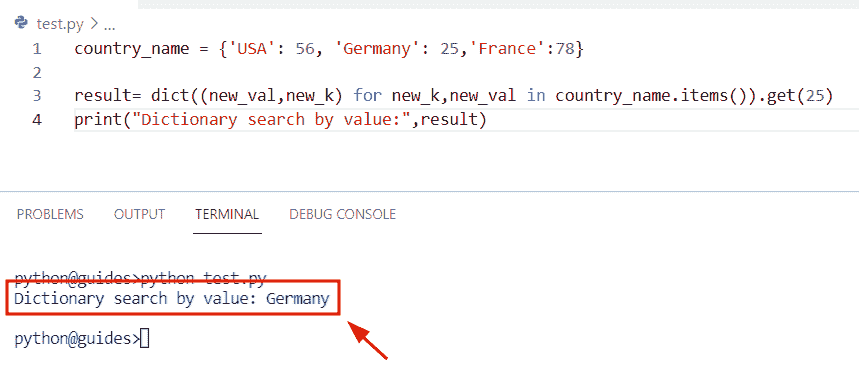

Python dictionary search by value

正如您在截图中看到的，输出根据给定值显示了**‘德国’**键。

阅读: [Python 字典键错误](https://pythonguides.com/python-dictionary-key-error/)

## Python 字典按值查找

*   在这个程序中，我们将讨论如何在 Python 字典中按值查找键。
*   为了完成这项任务，我们将使用字典理解方法，我们可以通过搜索值轻松获得关键元素。
*   在 Python 中， [dictionary comprehension](https://pythonguides.com/python-dictionary-comprehension/) 用于在字典上运行 for 循环，它将返回一个新的字典。

**举例:**

我们举个例子，检查**如何在 Python 字典**中按值查找键。

**源代码:**

```py
my_dictionary = {'Newzealand': 567,
            'United Kingdom' : 456,
            'China': 945,
            'Japan': 845
            }
new_val = 945
result=[new_k for new_k in my_dictionary.items() if new_k[1] == new_val][0][0]
print(result)
```

在下面给定的代码中，我们创建了一个名为**‘my _ dictionary’**的字典，然后声明了一个变量**‘new _ val’**，它表示我们想要对其进行操作的值。之后我们使用了字典理解的方法，并设置了条件 if**new _ k[1]= = new _ val[0][0]**。

下面是以下给定代码的执行。

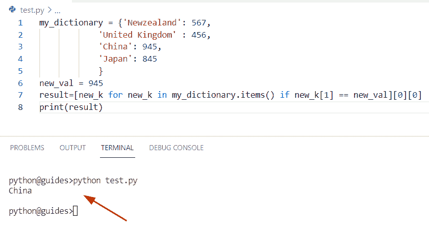

Python dictionary lookup by value

阅读: [Python 字典计数+实例](https://pythonguides.com/python-dictionary-count/)

## Python 字典通过键查找值

*   在这个程序中，我们将讨论如何在 Python 字典中通过键查找值。
*   通过使用 `dict.get()` 函数，我们可以很容易地通过字典中给定的键获得值。这个方法将检查条件，如果没有找到关键字，那么它将返回 none 值，如果给定了关键字，那么它将指定值。
*   这个方法有两个参数，一个是要搜索的键，另一个是要返回的默认值。

**语法:**

让我们来看看语法，了解一下 Python `dict.get()` 函数的工作原理。

```py
dict.get
        (
         key,
         default=None
        )
```

**举例:**

让我们举个例子，检查一下**如何在 Python 字典**中通过键找到值。

**源代码:**

```py
new_dict={'George':567,'James':145,'Micheal':678,'Oliva':234}

result= new_dict.get('Oliva')
print("Get value from key:",result)
```

下面是以下给定代码的执行。

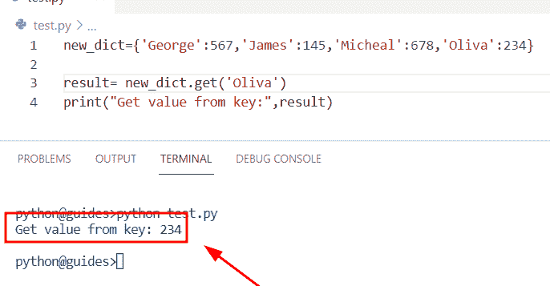

Python dictionary find value by key

阅读: [Python 字典重复键](https://pythonguides.com/python-dictionary-duplicate-keys/)

## Python 通过列表中的值查找字典

*   在这一节中，我们将讨论如何在 Python 列表中按值查找字典。
*   为了执行这个特定的任务，首先，我们将创建一个字典列表，其中包含以**键值**对形式的元素。接下来，我们将声明一个变量**‘结果’**，并使用字典理解方法。
*   在这个例子中，我们必须从给定的字典列表中获取字典。为了完成这个任务，我们将设置一个条件，如果指定的键等于 value，那么它将返回一个字典。

**举例:**

```py
new_dictionary = [
     { "Student_name": "George", "Student_id": 156 },
     { "Student_name": "Oliva", "Student_id": 278 },
     { "Student_name": "James", "Student_id": 456 },
     { "Student_name": "William", "Studemt_id": 782 }
 ]

result=next(z for z in new_dictionary if z["Student_name"] == "James")
print(result)
```

下面是下面给出的代码的截图。

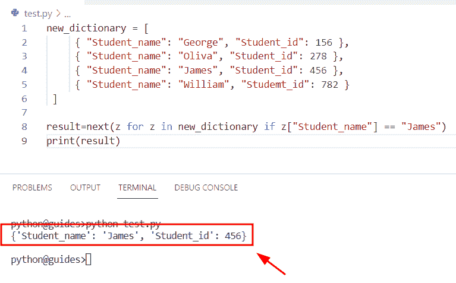

Python find dict by value in a list

阅读: [Python 字典增量值](https://pythonguides.com/python-dictionary-increment-value/)

## Python 字典按值查找索引

*   在这一节中，我们将讨论如何在 Python 字典中按值查找索引。
*   我们已经在 [Python 字典索引](https://pythonguides.com/python-dictionary-index/)文章中讨论过这个主题。你会得到关于这个话题的所有信息。

## Python 字典查找最大值

*   在本期节目中，我们将讨论如何在 Python 字典中找到最大值。
*   为了完成这个任务，我们将使用 `max()` 函数来查找给定字典中的最大值
*   为了从字典中获取值，我们将使用 `dictionary.get()` 方法，它将返回该值。

**举例:**

```py
new_dictionary = {"USA": 167, "Germany": 278, "Japan": 678}

result = max(new_dictionary, key=new_dictionary.get)
print("Maximum value:",result)
```

在上面的代码中，我们用不同的键和值创建了一个字典。现在我们必须从字典中计算最大值。为了执行这个任务，我使用了 `max()` 函数和 `dict.get()` 方法，它将返回最大值。

下面是下面给出的代码的截图。

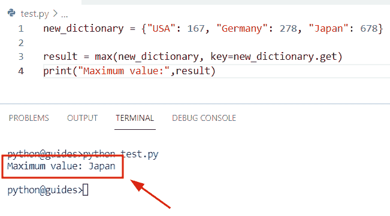

Python dictionary find max value

阅读: [Python 字典扩展](https://pythonguides.com/python-dictionary-extend/)

## Python 字典查找最小值

*   在本期节目中，我们将讨论如何在 Python 字典中寻找最小值。
*   为了完成这个任务，我们将使用 `min()` 函数，这个函数将帮助用户从字典中获取最小值。

获取有关如何在字典中查找最小值的更多信息。可以参考我们的详细文章 [Python 在字典中查找最大值](https://pythonguides.com/python-find-max-value-in-a-dictionary/#:~:text=In%20Python%20the%20max(),you%20will%20get%20two%20numbers.)。

**举例:**

```py
country_name = {"United kingdom": 567, "France": 167, "Spain": 554}

result = min(country_name, key=country_name.get)
print("Minimum value:",result)
```

下面是以下给定代码的实现

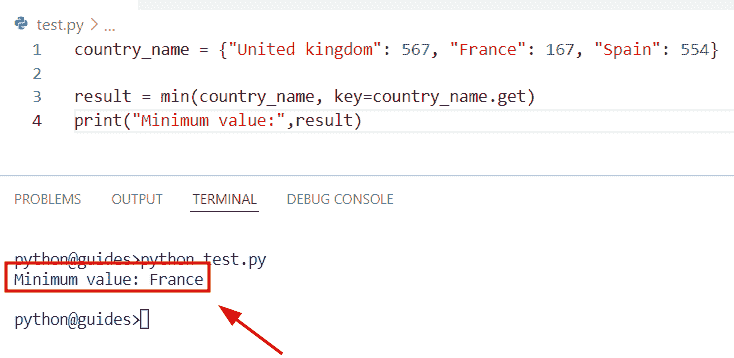

Python dictionary find the minimum value

## Python 字典查找和替换值

*   在本期节目中，我们将讨论如何替换 Python 字典中的值。
*   为了完成这项任务，我们首先创建了一个名为**‘new _ dictionary’**的字典，它包含了**键值**对形式的元素，然后我们将设置并更新键值。
*   一旦执行了这段代码，输出将显示指定键的新值。

**举例:**

让我们举个例子，**看看如何替换 Python 字典中的值。**

**源代码:**

```py
new_dictionary  =  {
   'George': 156,
   'James': 278,
   'William':134
}
new_dictionary['George'] = 189  
print(new_dictionary)
```

你可以参考下面的截图。

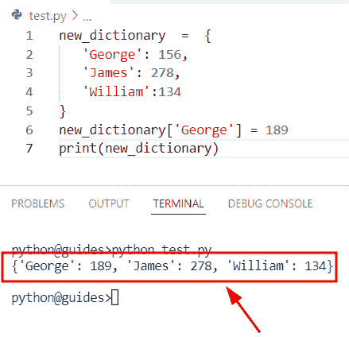

Python dict find and replace values

阅读: [Python 字典多键](https://pythonguides.com/python-dictionary-multiple-keys/)

## Python 字典查找唯一值

*   在本节中，我们将讨论如何在 Python 字典中查找唯一值。
*   为了从字典中获取唯一值，我们将使用 `set()` 方法和 `dict.values()` 方法。在 Python 中， `set()` 方法必须是唯一的，它从我们也可以用来执行数学运算的对象中移除所有重复的元素。
*   在 Python 中， `dict.values()` 方法将帮助用户从字典中提取值。

**举例:**

让我们举个例子，检查一下**如何在 Python 字典**中找到唯一值。

**源代码:**

```py
new_dictionary = {'USA' : 586,
   'United Kingdom' : 9872,
   'France' : 586,
   'Germany' : 234,
   'Newzealand' :189}

print("Original dictionary:",new_dictionary)
result=set(new_dictionary.values())
print("Unique values from dictionary:",result)
```

在下面给定的代码中，我们创建了一个字典“new_dictionary”。之后，我们使用了 set()函数，它将从字典中获取唯一的值。

下面是以下给定代码的执行。

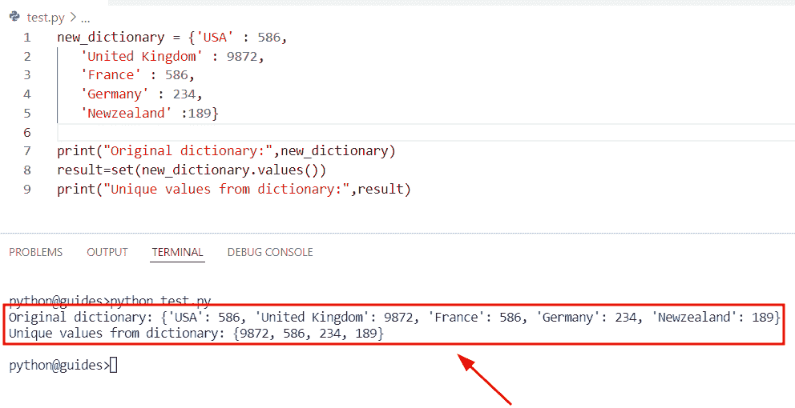

Python dictionary find unique values

阅读: [Python 字典转 CSV](https://pythonguides.com/python-dictionary-to-csv/)

## Python 字典列表按值搜索

*   在本期节目中，我们将讨论如何在 Python 中查找字典列表中的值。
*   在这个特定的任务中，我们将使用 `dict.get()` 方法，在这个方法中，我们已经设置了条件，如果给定值在字典列表中可用，那么它将返回字典。

**语法:**

让我们看一下语法，了解一下 `dict.get()` 方法的工作原理。

```py
dict.get(key[, value])
```

**举例:**

让我们举个例子，看看**如何在字典列表**中找到值。

**源代码:**

```py
new_dictionary = [{'George':145,'Oliva':245},
                {'William':567,'John':234},
                {'Micheal':234,'james':567}]

print("Original dictionary:",new_dictionary)
new_result = next((m for m in new_dictionary if m.get('John') == 234), None)
print("Get dictionary from searching value:",new_result)
```

在上面的例子中，我们已经创建了一个字典，然后我们使用字典理解方法，其中我们已经设置了条件 if **m.get('john')==234** 。

下面是下面给出的代码的截图。

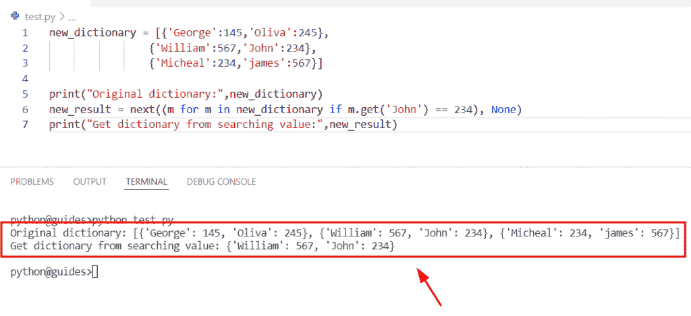

Python list of dictionaries search by values

阅读: [Python 将字典转换为数组](https://pythonguides.com/python-convert-dictionary-to-an-array/)

## Python 在字典中查找特定值

*   这里我们要检查如何在 Python 字典中找到具体的值。
*   为了执行这个特定的任务，我们将使用 `dict.get()` 方法并分配 key 元素。一旦执行了这段代码，输出将显示给定的指定键的值。

**举例:**

```py
new_dictionary={'Student_name': 'George', 'Student_id': 156,'Student_age':745}

result= new_dictionary.get('Student_id')
print(result) 
```

下面是以下给定代码的输出。

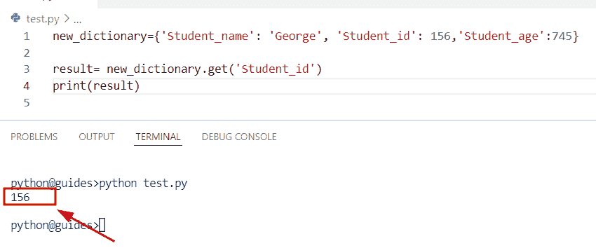

Python find specific value in the dictionary

阅读: [Python 元组字典](https://pythonguides.com/python-dictionary-of-tuples/)

## Python 字典查找重复值

*   这里我们将讨论如何在 Python 字典中找到重复值。
*   首先，我们将创建一个字典，然后我们将使用 `dict.items()` 方法。
*   接下来，我们将设置条件，如果值包含在空字典中，那么它将等同于一个关键字元素，否则它将追加关键字值。

**举例:**

让我们举一个例子，看看如何在 Python 字典中找到重复值。

**源代码:**

```py
new_dictionary = {'Grapes':245, 'Apple':567, 'Mangoes': 156, 'Oranges': 567}

empty_dict = {}
for new_k, new_val in new_dictionary.items():
   if new_val not in empty_dict:
      empty_dict[new_val] = [new_k]
   else:
      empty_dict[new_val].append(new_k)
print("Duplicate values in dictionary:",empty_dict)
```

下面是以下给定代码的实现

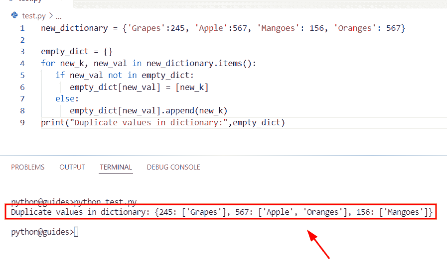

Python dictionary find duplicate values

你可能也喜欢阅读以下关于 Python 的教程。

*   [Python 集合字典](https://pythonguides.com/python-dictionary-of-sets/)
*   [Python 字典包含+个例子](https://pythonguides.com/python-dictionary-contains/)
*   [Python 将字典转换为列表](https://pythonguides.com/python-convert-dictionary-to-list/)
*   [Python 字典过滤器+示例](https://pythonguides.com/python-dictionary-filter/)
*   [Python 字典索引-完整教程](https://pythonguides.com/python-dictionary-index/)

在本 Python 教程中，我们使用 Python 中的一些例子研究了通过值进行的 **Python 字典搜索。此外，我们还讨论了这些主题。**

*   Python 字典按值搜索
*   Python 字典按值查找
*   Python 字典通过键查找值
*   Python 通过列表中的值查找字典
*   Python 字典按值查找索引
*   Python 字典查找最大值
*   Python 字典查找最小值
*   Python 字典查找和替换值
*   Python 字典查找唯一值
*   Python 字典列表按值搜索
*   Python 在字典中查找特定值
*   Python 字典查找重复值

[Bijay Kumar](https://pythonguides.com/author/fewlines4biju/)

Python 是美国最流行的语言之一。我从事 Python 工作已经有很长时间了，我在与 Tkinter、Pandas、NumPy、Turtle、Django、Matplotlib、Tensorflow、Scipy、Scikit-Learn 等各种库合作方面拥有专业知识。我有与美国、加拿大、英国、澳大利亚、新西兰等国家的各种客户合作的经验。查看我的个人资料。

[enjoysharepoint.com/](https://enjoysharepoint.com/)[](https://www.facebook.com/fewlines4biju "Facebook")[](https://www.linkedin.com/in/fewlines4biju/ "Linkedin")[](https://twitter.com/fewlines4biju "Twitter")