# Python 字典排序(11 个示例)

> 原文：<https://pythonguides.com/python-dictionary-sort/>

[](https://sharepointsky.teachable.com/p/python-and-machine-learning-training-course)

在本 [Python 教程](https://pythonguides.com/learn-python/)中，我们将讨论 **Python 字典排序。**我们将在这里看到，如何**在 python 中排序字典**，如何**在 Python 中按键和值排序字典**，以及下面的例子:

*   Python 字典按值排序
*   Python 字典按关键字排序
*   Python 字典按值降序排序
*   Python 字典按字母顺序按值排序
*   Python 字典按字母顺序按关键字排序
*   Python 字典反向排序
*   Python 字典按键值排序
*   用 lambda 进行 Python 字典排序
*   Python 字典按字母顺序排序
*   Python 字典按值列表排序
*   Python 先按值再按键对字典进行排序
*   Python 字典排序的最快方法

目录

[](#)

*   [如何在 Python 中对字典进行排序](#How_to_sort_dictionary_in_Python "How to sort dictionary in Python")
*   [检查 Python 字典排序–另一种方法](#Check_Python_dictionary_sort_-_Another_approach "Check Python dictionary sort – Another approach")
*   [Python 字典按值排序](#Python_dictionary_sort_by_value "Python dictionary sort by value")
*   [Python 字典按值排序——另一个例子](#Python_dictionary_sort_by_value_-_Another_example "Python dictionary sort by value – Another example")
*   [Python 字典按关键字排序](#Python_Dictionary_sort_by_key "Python Dictionary sort by key")
*   [如何在 Python 中对字典键进行排序——另一种方法](#How_to_sort_a_dictionary_keys_in_Python_-_Another_approach "How to sort a dictionary keys in Python – Another approach")
*   [Python 字典按值降序排序](#Python_dictionary_sort_by_value_Descending "Python dictionary sort by value Descending")
*   [Python 字典按字母顺序值排序](#Python_dictionary_sort_by_value_alphabetically "Python dictionary sort by value alphabetically")
*   [Python 字典按字母顺序键排序](#Python_dictionary_sort_by_key_alphabetically "Python dictionary sort by key alphabetically")
*   [Python 字典排序反转](#Python_dictionary_sort_reverse "Python dictionary sort reverse")
*   [如何颠倒 Python 字典中键的顺序](#How_to_reverse_the_order_of_keys_in_Python_dictionary "How to reverse the order of keys in Python dictionary")
*   [Python 字典按键值排序](#Python_dictionary_sort_by_key_value "Python dictionary sort by key value")
*   [Python 字典用 lambda 排序](#Python_dictionary_sort_with_lambda "Python dictionary sort with lambda")
*   [Python 字典按字母顺序排序](#Python_dictionary_sort_by_alphabetically "Python dictionary sort by alphabetically")
*   [Python 字典按值列表排序](#Python_dictionary_sort_by_value_list "Python dictionary sort by value list")
*   [Python 按值排序字典，然后按键排序](#Python_sort_dictionary_by_value_then_key "Python sort dictionary by value then key")
*   [Python 最快的字典排序方式](#Python_fastest_way_to_sort_a_dictionary "Python fastest way to sort a dictionary")

## 如何在 Python 中对字典进行排序

*   Python 中的 `sorted()` 是内置函数，可以帮助对 [Python 字典](https://pythonguides.com/create-a-dictionary-in-python/)中的所有可重复项进行排序。
*   为了对值和键进行排序，我们可以使用 **sorted()函数**。这个排序函数将返回一个新的列表。

**语法:**

下面是 `sorted()` 函数的语法。

```py
sorted
      (
       iterable,
       Key=None,
       reverse=False
      )
```

*   它由几个参数组成
    *   **iterable:** 这个函数可以按升序用在所有的 iterable 上。
    *   **键:**如果您想修改分类过程，那么您可以使用此键功能，默认情况下，其值为无。
    *   **reverse:** 这里可以看到 reverse=False。这是升序排列，如果你想让数字按降序排列，那么你可以将这个反向标志顺序设置为真
*   **注意:**如果您决定不使用可选参数键并反转。Python 会自动按升序对项目进行排序。

**举例:**

让我们举一个例子来检查如何在 Python 中对字典进行排序

```py
dict = {6:'George' ,2:'John' ,1:'Potter' ,9:'Micheal' ,7:'Robert' ,8:'Gayle' }  

b = sorted(dict.keys())
print("Sorted keys",b)  

c = sorted(dict.items())
print("Sorted Values",c) 
```

写完上面的代码后，我们必须对字典中可用的值和键进行排序。在 python 中，提供了内置函数 key()和 items()来对字典进行排序。我们可以应用这些函数 iterable 作为参数，并返回一个新的排序列表。

下面是以下代码的截图

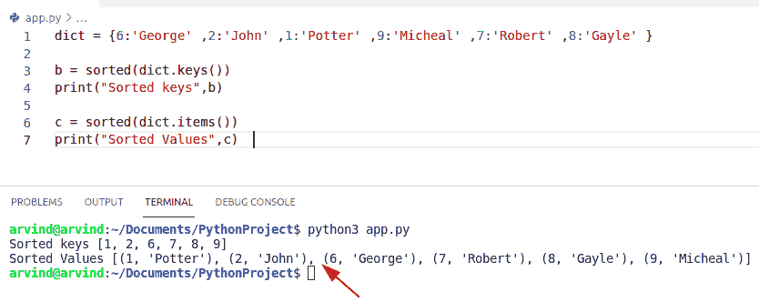

Python dictionary sort

这就是如何在 Python 中对字典进行排序。

阅读 [Python 字典附加示例](https://pythonguides.com/python-dictionary-append/)

## 检查 Python 字典排序–另一种方法

假设我们有一个 Python 的[字典，其中包含我们水果菜单上的元素。所以现在我们想按照值和键的降序对有序字典进行排序。在本例中，我们必须使用反向参数，并为它们赋值 true。](https://pythonguides.com/python-dictionary-methods/)

**举例:**

让我们举一个例子来检查如何用逆向方法对 Python 中的字典进行排序

```py
dict = {"Mangoes":200,"Banana":900,"Cherry":700,"Grapes":400} 

new_list = sorted(dict.items(), key=lambda x: x[1], reverse=True)

for i in new_list:
	print(i[0], i[1])
```

下面是以下代码的截图

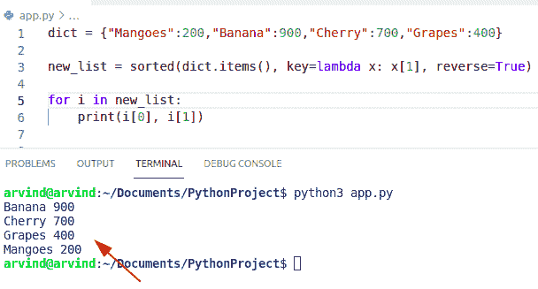

Python dictionary sort by reverse method

这是**如何用 Python** 对字典进行排序。

阅读[如何用 Python 将字典转换成 JSON](https://pythonguides.com/convert-dictionary-to-json-python/)

## Python 字典按值排序

*   现在我们可以看到如何用 Python 对字典值进行排序。通过使用 sorted()函数，可以对字典中的值进行排序。
*   在这个例子中，我们可以使用 items()和 sorted()函数对值进行排序
*   在 python 字典中，有各种方法对值进行排序
    *   按降序排序
    *   按升序排序

**举例:**

让我们举一个例子，看看如何在 python 中对字典值进行降序排序。

```py
dict = {"Python":750,"Java":950,"Ruby":700,"C++":200} 

sort_values = sorted(dict.items(), key=lambda y: y[1], reverse=True)

for i in sort_values:
	print(i[0], i[1])
```

下面是以下代码的截图

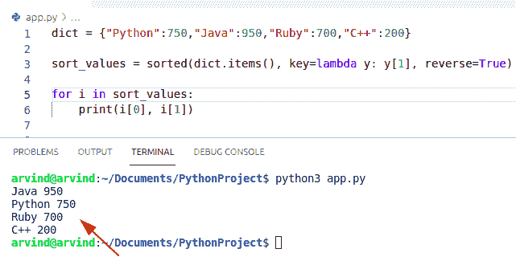

Python dictionary sort by value

这是一个按值排序的 **Python 字典的例子。**

## Python 字典按值排序——另一个例子

现在我们将检查**如何使用 sorted 函数在 Python** 中按值对字典进行排序。

**举例:**

```py
my_dict = {"Australia":250,"Germany":950,"France":170,"England":150} 

new_list = sorted(my_dict.items(), key=lambda x:x[1])
sort_values = dict(new_list)
print(sort_values)
```

在上面的代码中，您可以检查它是否返回一个按升序排序的新列表。

下面是以下代码的截图

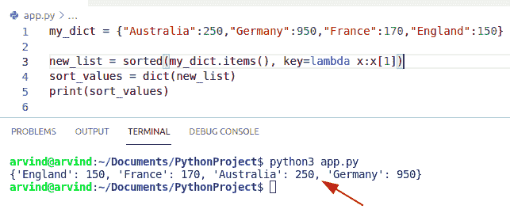

Python dictionary sort by values using the sorted method

这是一个按值排序的 **Python 字典的例子。**

阅读 [Python 串联词典+示例](https://pythonguides.com/python-concatenate-dictionary/)

## Python 字典按关键字排序

*   让我们看看如何在 Python 中对字典键进行排序。
*   为了在 python 中对字典键进行排序，我们可以使用 `dict.items()` 和 `sorted(iterable)` 方法。
*   方法返回一个存储字典键值对的对象。键值对作为元组包含在对象或项目中。
*   sorted (iterable)方法总是返回排序列表。该方法对给定字典中可用的元素数量进行排序。

**举例:**

让我们举一个例子，看看如何在 Python 中对字典键进行排序

```py
my_dict = {"m":250,"o":950,"b":170,"a":150} 

sort_keys = my_dict.items()
new_items = sorted(sort_keys)
print(new_items)
```

在上面的例子中，首先，我们将初始化一个字典，并给它们分配一个键值对值。然后使用 `dict.items()` 函数得到一个可迭代的序列值。

下面是以下代码的截图

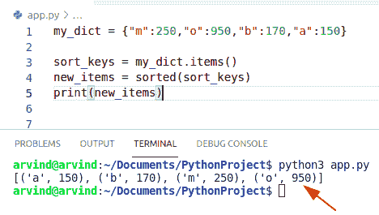

Python dictionary sort by key

阅读 [Python 字典更新示例](https://pythonguides.com/python-dictionary-update/)

## 如何在 Python 中对字典键进行排序——另一种方法

使用 dict.keys()我们可以对 Python 中的字典键进行排序。该方法返回一个 iterable view 对象，该对象显示字典中可用的所有键。

**举例:**

让我们举一个例子，看看如何在 Python 中对字典键进行排序

```py
my_dict = {"p":350,"z":750,"a":170,"c":110} 

sorted(my_dict.keys())
for key in sorted(my_dict.keys()) :
    print(key , " : " , my_dict[key])
```

下面是以下代码的截图

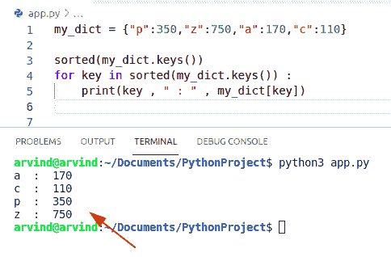

Python dictionary sort by keys method

这就是如何在 Python 中对字典键进行排序。

## Python 字典按值降序排序

*   让我们看看如何在 Python 中对字典值进行降序排序。
*   使用 dict.items()获取一个存储字典的键值对的 iterable 项，并调用返回新排序列表的 sorted(iterable，key)函数。在这种情况下，我们将排序函数中的键属性指定为一个参数，用 f 作为 lambda 键值来对值进行排序。

**举例:**

让我们举一个例子，看看如何按降序对字典值进行排序

```py
from typing import OrderedDict

my_dict = {1: {"p":350,"z":750,"a":170,"c":110},
           6: {"p":100,"z":700,"a":120,"c":900},
           4: {"p":300,"z":200,"a":450,"c":130}}

sort_values = my_dict.items()
new_item = sorted(sort_values, key=lambda key_value: key_value[1]["c"], reverse=True)
list = OrderedDict(new_item)
print(list)
```

首先在上面的代码中，我们将导入一个有序字典库并创建一个字典。key_value[1][inner_key]按内部键值对以前的结果 iterable 进行排序。

下面是以下代码的截图

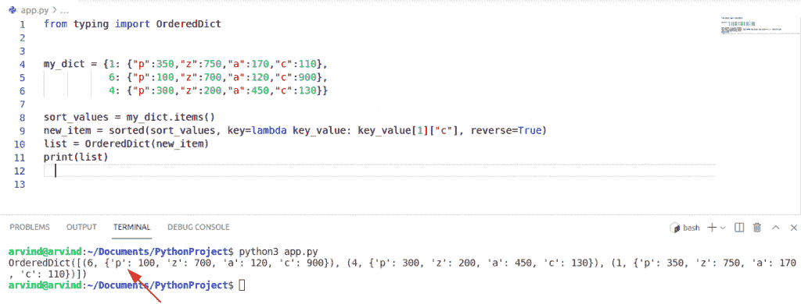

Python dictionary sort by value descending

这就是**如何按值降序对 Python 字典进行排序**。

读取 [Python 字典值以列出](https://pythonguides.com/python-dictionary-values-to-list/)

## Python 字典按字母顺序值排序

*   在 Python 中，字典由{key: value}方法的键值对组成。
*   因此，在 my_dict 变量中，键是名称，值是名称右边的整数。
*   要按字母顺序对值进行排序，您可以对字典中具有相同键的值对进行排序和打印。

**举例:**

让我们举一个例子，检查如何按字母顺序对字典值进行排序。

```py
my_dict = {'John':2,
           'George':3,
           'Micheal':4,
           'Andrew':6,}

for value in sorted(my_dict.items(), key=lambda x: x[0], reverse=True):
     print(value)
```

下面是以下代码的截图

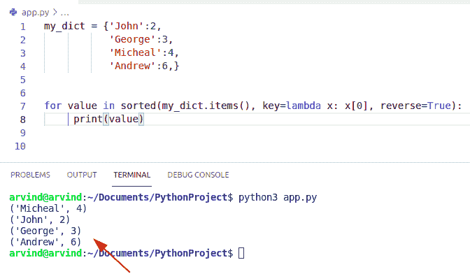

Python dictionary sort by value alphabetically

## Python 字典按字母顺序键排序

*   让我们看看如何在 Python 中按照字母顺序对字典键进行排序。
*   要按字母顺序对字典键进行排序，我们可以使用 `dict.items()` 和 sorted(iterable)函数。
*   在这个例子中，我们可以使用一个简单的算法按字母顺序对字典键进行排序，首先，使用 **Python sorted()函数对键进行排序。**
*   该函数对给定字典(键-值)对中可用的元素数量进行排序。

**举例:**

```py
new_dict = {"z":220,"v":450,"u":120,"t":350} 

sorted_keys = new_dict.items()
new_values = sorted(sorted_keys)
print(new_values)
```

下面是以下代码的截图

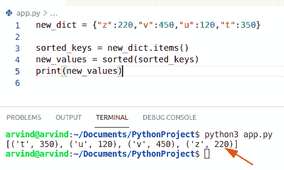

Python dictionary sort by key alphabetically

这就是如何按字母顺序通过键对 Python 字典进行排序。

阅读 [Python 检查变量是否为数字](https://pythonguides.com/python-check-if-a-variable-is-a-number/)

## Python 字典排序反转

*   让我们看看**如何颠倒 Python 字典**中键的顺序。
*   键的迭代顺序是一个任意元素。为了反转键值对，我们可以使用 **dict.keys()函数**和循环方法。

**举例:**

让我们举个例子，看看如何颠倒键的顺序

```py
dict = {'l': 1, 'm': 2, 'n': 3}

for i in reversed(list(dict.keys())):
    print(i)
```

下面是以下代码的截图

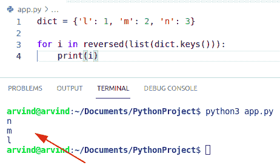

Python dictionary sort reverse

这是一个 Python 字典反向排序的例子。

## 如何颠倒 Python 字典中键的顺序

在这个例子中，我们将使用字典函数的组合来执行这个特定的任务。通过使用**列表()**，**键()**，**排序()**，**反转()**。它将对键进行排序，并使用 dict.keys()函数以降序反向提取键。

**举例:**

```py
my_dict = {2 : "John", 5 : "George", 3 : "Micheal", 2 : "James"}

new_value = list(reversed(sorted(my_dict.keys())))
print(new_value)
```

下面是以下代码的截图

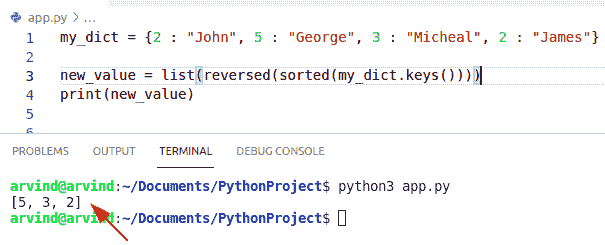

Python dictionary sort reverse keys method

这就是如何颠倒 Python 字典中键的顺序。

读取[检查 Python 中的 NumPy 数组是否为空](https://pythonguides.com/check-if-numpy-array-is-empty/)

## Python 字典按键值排序

*   让我们看看如何使用 lambda 函数以及 `item()` 和 `sorted()` 对键值对进行排序
*   Lambda() 函数的定义没有名字，这就是为什么它也被称为匿名函数。
*   键值对用逗号分隔，并用花括号括起来。
*   `sorted()` 函数用于对给定字典的键进行排序。

**举例:**

让我们举个例子，检查一下**如何在字典**中对键值对进行排序。

```py
my_dict = {3: 'George',
           5: 'Micheal',
           4:  'John'}

sort_values = sorted(
  my_dict.items(),
  key = lambda kv: kv[1]) # sort key and values

print("Sorted values and keys is :",
      sort_values) 
```

下面是以下代码的截图

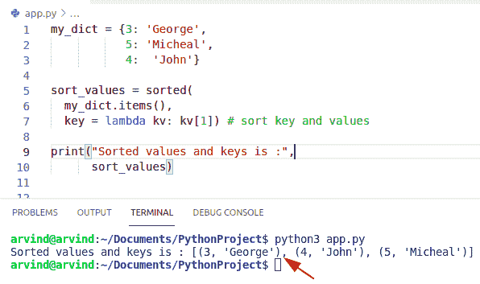

Python dictionary sort by key-value

这就是如何通过键值对 python 字典进行排序。

## Python 字典用 lambda 排序

*   让我们看看如何用 Python 中的 lambda 函数对字典进行排序。
*   Python lambda 函数是没有任何名称的函数，它们也被称为无名函数。lambda 这个词是一个关键字，指定哪些关注者是匿名的。
*   lambda 函数的主体写在一行中。
*   由于这个原因，Python lambda 函数被称为一次性函数。它们也与高阶函数一起使用，高阶函数将函数作为输入并作为输出返回。

**举例:**

让我们举一个例子，看看如何用 lambda 函数对字典进行排序

```py
my_dict = [{ "Country" : "Germany", "Val" : 40},
{ "Country" : "England", "Val" : 10 },
{ "Country" : "Japan" , "Val" : 60 }]

print (sorted(my_dict, key = lambda i: i['Val']))
print ("\r")
print (sorted(my_dict, key = lambda i: (i['Val'], i['Country'])))
print ("\r")
print (sorted(my_dict, key = lambda i: i['Val'],reverse=True)) # descending order
```

**注:**降序使用**“反向=真”**

在上面的例子中，我们使用 sorted()和一个 `lambda` 函数。首先，初始化字典列表，并使用 sorted 和 lambda 函数打印按“Val”属性排序的**列表。使用 sorted 和 lambda 函数打印按**【Val】**降序排序的列表。**

下面是以下代码的截图

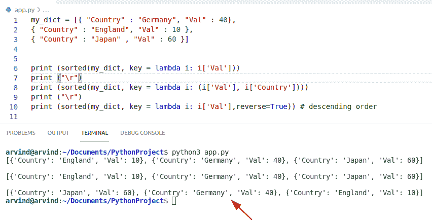

Python dictionary sort with lambda

这就是如何用 lambda 对 Python 字典进行**排序。**

读取 [Python 从字符串中移除子串](https://pythonguides.com/python-remove-substring-from-a-string/)

## Python 字典按字母顺序排序

*   让我们看看如何在 Python 中按字母顺序对字典进行排序。
*   要按字母顺序排列字典，我们可以使用 `sorted()` 和 `dict.items()`
*   它将以键值对的形式返回一个新列表。

**举例:**

让我们举一个例子，检查如何按字母顺序排列字典

```py
my_dict = {"k":430,"m":450,"c":420,"a":350} 

new_alpha = my_dict.items()
new_val = sorted(new_alpha)
print(new_val)
```

下面是以下代码的截图

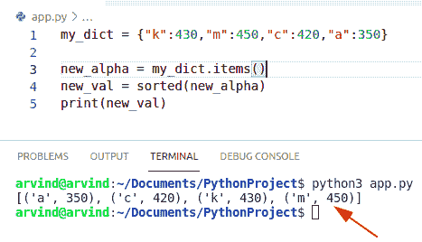

Python dictionary sort by alphabetically

这就是如何按字母顺序对 python 字典进行排序的方法。

## Python 字典按值列表排序

*   这里我们将检查**如何在 Python** 中对列表中的值进行排序。
*   通过使用 `sorted()` 和 `dict.items()` 函数，我们将检查如何对列表中的值进行排序。

**举例:**

```py
my_dict = {'u': [4, 9, 2], 'v': [7, 1, 3], 'w': [5, 2, 8]}
sort_list = {l: sorted(m) for l, m in my_dict.items()} #sort value by list
print(sort_list)
```

下面是以下代码的截图

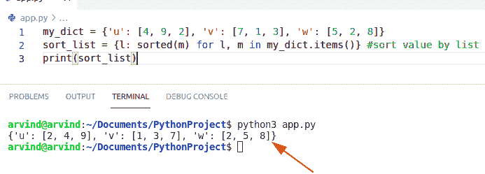

Python dictionary sort by value list

这是**如何在 Python** 中对列表中的值进行排序。

## Python 按值排序字典，然后按键排序

*   要按值排序字典，那么我们可以很容易地使用 lambda 和 sorted 函数。
*   在本例中，我们可以将这个反向标志顺序设置为 true，这意味着值将按降序排列。

**举例:**

让我们举一个例子，看看如何通过值而不是键对字典进行排序

```py
dict={49:1, 52:4, 74:3, 19:6, 101:2}
z = sorted(dict.items(), key=lambda x: (x[1],x[0]), reverse=True)
print(z)
```

下面是以下代码的截图

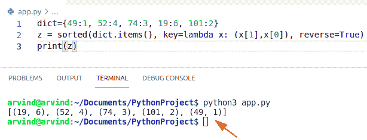

Python sort dictionary by value then key

这是**如何按值排序字典，然后键入 Python** 。

## Python 最快的字典排序方式

在 Python 中，可以使用 for 循环对字典进行排序。首先使用 sorted()函数对字典的值进行排序。然后，通过在一个循环中迭代排序后的值来识别键。我们创建一个新的字典，并按照排序后的顺序添加这些键值对。

**举例**:

```py
new_dictionary = {'U.S.A': 34, 'Germany': 12, 'France': 4}
new_val = sorted(new_dictionary.values()) 
result = {}

for m in new_val:
    for n in new_dictionary.keys():
        if new_dictionary[n] == m:
            result[n] = new_dictionary[n]

print(result)
```

下面是以下代码的截图

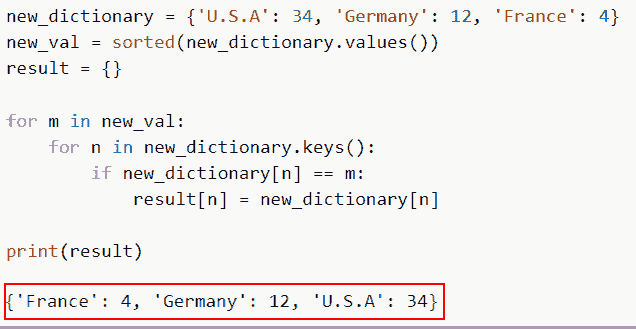

Python fastest way to sort a dictionary

**方法二**:

为了对字典进行排序，Python 提供了内置的 key()和 values()函数。它返回键的排序列表，并接受任何 iterable 作为参数。我们可以使用关键字按升序对字典进行排序。让我们检查下一个例子。

源代码:

```py
Country_name = {67:'U.S.A' ,23:'Spain' ,15:'United Kingdom' ,24:'Australia' }  

print(sorted(Country_name.keys()))  
#print the sorted list with items.  
print(sorted(Country_name.items())) 
```

下面是以下给定代码的实现

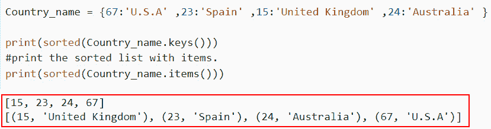

Python fastest way to sort a dictionary sorted method

这就是如何使用 Python 中的 sorted 方法对字典进行排序。

您可能会喜欢以下 Python 教程:

*   [Python 在字符串中查找子串](https://pythonguides.com/python-find-substring-in-string/)
*   [Python 3 的 string replace()方法](https://pythonguides.com/python-3-string-replace/)
*   [使用 Tkinter 的 Python 注册表](https://pythonguides.com/registration-form-in-python-using-tkinter/)
*   [PdfFileWriter Python 示例(20 个示例)](https://pythonguides.com/pdffilewriter-python-examples/)

在本 Python 教程中，我们将讨论 **Python 字典排序。**在这里我们还将看到 Python 创建字符串的例子:

*   Python 字典按值排序
*   Python 字典按关键字排序
*   Python 字典按值降序排序
*   Python 字典按字母顺序按值排序
*   Python 字典按字母顺序按关键字排序
*   Python 字典反向排序
*   Python 字典按键值排序
*   用 lambda 进行 Python 字典排序
*   Python 字典按字母顺序排序
*   Python 字典按值列表排序
*   Python 先按值再按键对字典进行排序
*   Python 字典排序的最快方法

[Bijay Kumar](https://pythonguides.com/author/fewlines4biju/)

Python 是美国最流行的语言之一。我从事 Python 工作已经有很长时间了，我在与 Tkinter、Pandas、NumPy、Turtle、Django、Matplotlib、Tensorflow、Scipy、Scikit-Learn 等各种库合作方面拥有专业知识。我有与美国、加拿大、英国、澳大利亚、新西兰等国家的各种客户合作的经验。查看我的个人资料。

[enjoysharepoint.com/](https://enjoysharepoint.com/)[](https://www.facebook.com/fewlines4biju "Facebook")[](https://www.linkedin.com/in/fewlines4biju/ "Linkedin")[](https://twitter.com/fewlines4biju "Twitter")