# Python 字典更新及示例

> 原文：<https://pythonguides.com/python-dictionary-update/>

[](https://sharepointsky.teachable.com/p/python-and-machine-learning-training-course)

在本 [Python 教程](https://pythonguides.com/learn-python/)中，我们将通过如下几个例子来讨论 **Python 字典更新**:

*   Python 字典更新方法
*   Python 字典更新值
*   如果键存在，Python 字典更新值
*   Python 字典更新功能
*   Python 字典更新与追加
*   Python 字典更新密钥
*   Python 字典更新与赋值
*   Python 字典更新所有值
*   Python 嵌套字典更新
*   Python 字典更新(如果不存在)

目录

[](#)

*   [Python 字典更新](#Python_Dictionary_update "Python Dictionary update ")
*   [Python 字典更新方法](#Python_Dictionary_update_method "Python Dictionary update method")
*   [Python 字典更新值](#Python_Dictionary_update_value "Python Dictionary update value")
*   [更新嵌套 Python 字典](#Updated_Nested_Python_dictionary "Updated Nested Python dictionary")
*   [如果关键字存在，Python 字典更新值](#Python_Dictionary_update_value_if_key_exists "Python Dictionary update value if key exists")
*   [字典中存在关键字时更新值的另一种方法](#Another_method_for_update_value_if_key_exists_in_dictionary "Another method for update value if key exists in dictionary")
*   [解决方案](#Solution "Solution")
*   [Python 字典更新 vs 追加](#Python_Dictionary_update_vs_append "Python Dictionary update vs append")
*   [Python 字典更新键](#Python_Dictionary_update_key "Python Dictionary update key")
*   [更新字典中密钥的另一种方法](#Another_method_to_update_key_in_dictionary "Another method to update key in dictionary ")
*   [Python 字典更新 vs 赋值](#Python_Dictionary_update_vs_assignment "Python Dictionary update vs assignment")
*   [Python 字典更新所有值](#Python_Dictionary_update_all_values "Python Dictionary update all values")
*   [Python 嵌套字典更新](#Python_nested_dictionary_update "Python nested dictionary update")
*   [不存在时更新 Python 字典](#Python_dictionary_update_if_not_exists "Python dictionary update if not exists")

## Python 字典更新

*   在本节中，我们将讨论 **python 字典更新**。这里我们将使用 update()方法。
*   它是一个无序的数据值集合，用于像元组一样存储数据值，不像其他数据类型只包含一个值，因为 [Python 字典](https://pythonguides.com/create-a-dictionary-in-python/)采用键值对。
*   这个方法用键和值对更新字典。如果键/值不存在，它将插入一个键/值。如果字典中已经存在该键/值，它将更新它。
*   这个函数不返回任何值，而是用新关联的键值更新同一个输入字典。

**语法:**

下面是 update()方法的语法

```py
dict.update([other])
```

*   它只包含一个参数。
    *   **其他:**是键/值对列表。

*   `Return` :不返回值(None)。

**举例:**

让我们举一个例子来检查如何实现 Python 字典更新

在本例中，通过传递键/值对来更新字典。这个方法更新字典。

**代码:**

```py
dict = {'Africa':200,'australia':300,'England':400}
print("Country Name",dict)
dict.update({'China':500})
print("updated country name",dict)
```

首先在上面的例子中，我们将创建一个字典并分配一个键值对。之后调用方法 update()并打印结果。

下面是以下代码的截图

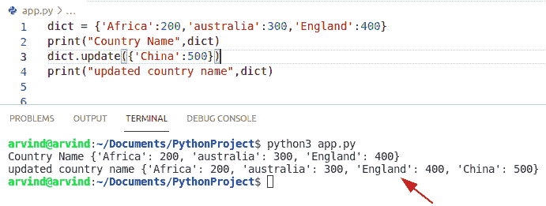

Python Dictionary update

*   另一个例子是通过键/值对更新字典。
*   在这个例子中，两个值被传递给 Python 字典，它被更新。

**举例:**

```py
dict = {'John':200,'Micheal':300,'Smith':400}
print("Name",dict)
dict.update({'Andrew':500,'Hayden':800})
print("updated name",dict)
```

下面是以下代码的截图

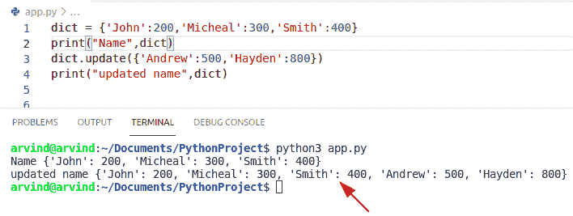

Python dictionary update 2nd method

*   另一个例子是通过键/值对更新字典。
*   在这种方法中，我们可以很容易地使用*运算符。
*   使用这种方法，我们可以在另一个字典中合并旧字典和新的键/值对。

**举例:**

```py
dict = {'b': 2, 'c': 3}

# will create a new dictionary
new_dict = {**dict, **{'d': 4}} # *operator function

print(dict)
print(new_dict)
```

下面是以下代码的截图

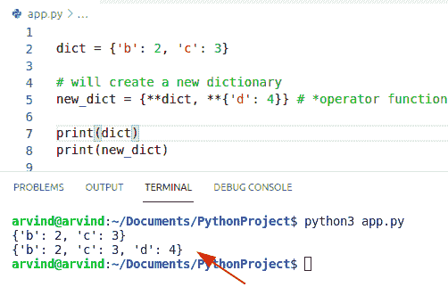

Python dictionary update operator

阅读 [Python 字典附加示例](https://pythonguides.com/python-dictionary-append/)

## Python 字典更新方法

*   在本节中，我们将通过使用 python update()方法来讨论 Python 字典更新方法。
*   您还可以通过向当前条目插入新值或密钥对或删除当前条目来更新字典。
*   update()方法将指定的项目插入 Python 字典。
*   指定的项可以是一个字典或具有键值对的可迭代元素。

**语法:**

下面是 update()方法的语法

```py
dict.update(iterable)
```

*   它只包含一个参数。
    *   **iterable:** 它是一个具有键值对的对象，将被添加到字典中

**举例:**

让我们举一个例子来检查如何更新字典条目

```py
dict1 = {'Python':200,'Java':300,'C++':400}
print("Languages",dict1)
dict1.update({'Ruby':500,'Pascal':800})
print("updated language",dict1)
```

下面是以下代码的截图

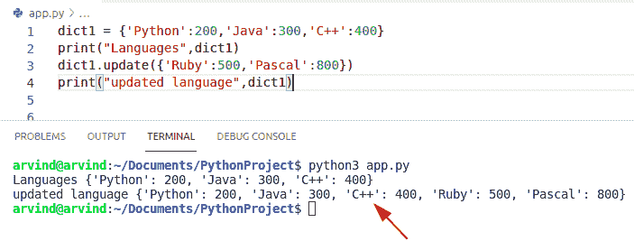

Python dictionary update method

阅读 [Python 字典索引](https://pythonguides.com/python-dictionary-index/)

## Python 字典更新值

*   在本节中，我们将讨论 **python 字典更新值**。
*   要更新 Python 字典中现有键的值，必须创建一个临时字典，其中包含具有新值的键，然后将这个字典传递给 update()函数。
*   Update()函数接受一个 iterable 键-值对的另一个参数(dictionary 或 list)作为实参，然后将 iterable 对象中的键值更新到 dictionary 中。

**语法:**

下面是更新函数的语法

```py
dict.update([other])
```

*   `Return` :不返回值(None)。

**举例:**

让我们举一个例子来检查如何更新字典中的值

```py
dict1 = {'Germany':200,'France':300,'Paris':400}
print("Country name",dict1)
dict1.update({'France':600})
print("updated value",dict1)
```

下面是以下代码的截图

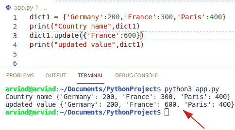

Python Dictionary update value

阅读[如何用 Python 将字典转换成 JSON](https://pythonguides.com/convert-dictionary-to-json-python/)

## 更新嵌套 Python 字典

*   另一个例子是**更新 Python 字典**中的值。
*   您可以通过引用特定项的键名来更新该项的值。
*   在这个例子中我们可以很容易地使用更新嵌套字典的方法。
*   在 Python 中，嵌套字典将由逗号创建——在括起来的花括号内。
*   嵌套字典中指定键的值可以使用其 key 方法来包含。但是，我们可以这样做，首先，你必须创建一个空字典，甚至在分配值给相应的键之前。

**语法:**

下面是 Python 嵌套字典的语法

```py
dict[out-key][in-key]='new-value'
```

**举例:**

让我们举一个例子来检查如何更新 Python 字典中的值

```py
dict = { 'student1_info':{'name':'John','Roll-no':32},'student2_info':{'name':'Micheal','Roll-no':24}}
print("Dictionary before updation:",dict)
dict['student1_info']['Roll-no']=78 # nested dictionary

print("Dictionary after updation:",dict)
```

在上面的示例中，我们已经将内部键的值“Rollno”和外部键的值“student1_info1”更新为 78。

下面是以下代码的截图

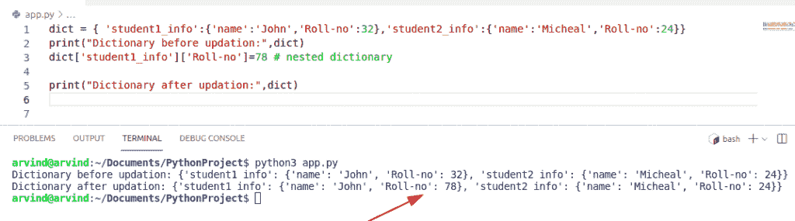

Python dictionary update value nested method

阅读 [Python 字典过滤器+示例](https://pythonguides.com/python-dictionary-filter/)

## 如果关键字存在，Python 字典更新值

*   在本节中，我们将讨论如果键存在的话 python 字典的更新值。
*   在这种方法中，我们可以很容易地使用内置方法键()的功能。
*   该方法返回字典中所有可用键的列表。通过内置的方法 Keys()，使用 if 语句和“in”操作符来检查字典中是否存在该键。
*   如果键存在，那么它将更新字典中的值。

**举例:**

让我们举一个例子，检查如果字典中存在这个键，如何更新值。

```py
def checkKey(dict, key):

    if key in dict.keys():
        print("Key exist, ", end =" ")
        dict.update({'m':600})
        print("value updated =", 600)
    else:
        print("Not Exist")
dict = {'m': 700, 'n':100, 't':500}

key = 'm'
checkKey(dict, key)
print(dict)
```

下面是以下代码的截图

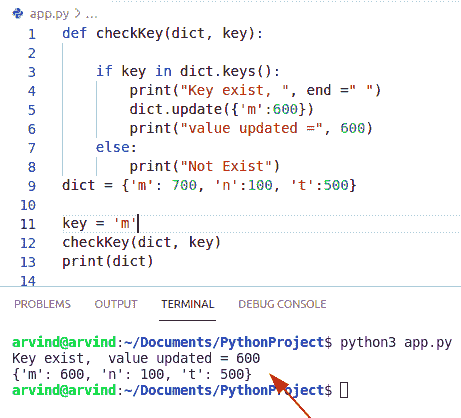

Python Dictionary update value if the key exists

阅读 [Python 串联词典](https://pythonguides.com/python-concatenate-dictionary/)

## 字典中存在关键字时更新值的另一种方法

*   让我们看看，如果 Python 字典中存在键，如何使用内置方法 has_key()来更新值。
*   该函数用于判断关键字是否存在于字典中，如果关键字存在于字典中则返回 true，否则返回 false。
*   使用内置函数 has_key()，使用 if 语句检查字典中是否有这个键。

**语法:**

下面是 has_key()方法的语法

```py
dict.has_key(key)
```

*   它只包含一个参数
    *   **Key:** 这是要在字典中搜索的密钥对。

**举例:**

让我们举一个例子，检查如果字典中存在这个键，如何更新值。

```py
def checkKey(dict, key):

    if dict.has_key(key):
        print ("Exists, value updated =", dict[key])
    else:
        print ("Not Exists")

# Driver Function
dict = {'u': 400, 't':100, 'c':300}
key = 'w'
checkKey(dict, key) 
```

在上面的例子中，我们必须使用 has_key()函数，该函数将抛出一个错误，因为 Python 版本 3 中已经删除了 has_key()方法。

下面是以下代码的截图

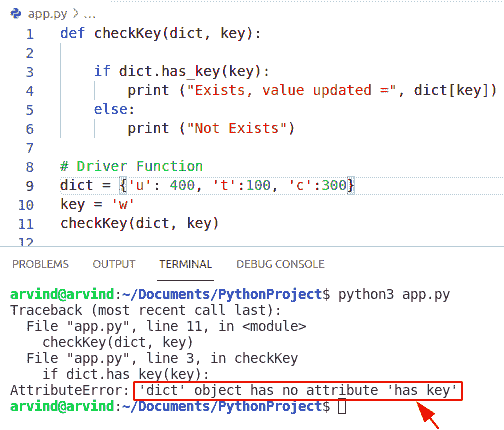

Python dictionary update value if the key exists an error message

## 解决方案

Has_key 方法只能在 python 2.7 版本中使用

下面是这个错误消息解决方案的屏幕截图

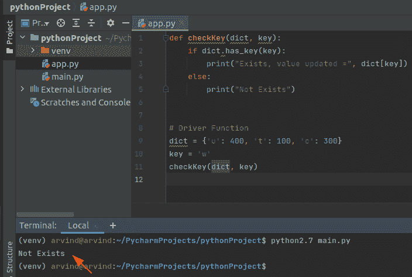

Python dictionary update value if key exists has_key method

阅读 [Python 字典排序](https://pythonguides.com/python-dictionary-sort/)

## Python 字典更新 vs 追加

*   在本节中，我们将讨论 **python 字典更新与追加**。
*   在这个方法中，我们可以很容易地使用函数 update()和 append()。
*   在这个方法中，我们可以很容易地利用内置函数 append()将值添加到字典的键中。要使用 append()将元素添加到字典中，我们必须首先找到需要添加的键。在 update()函数的情况下，用于更新与输入字典中的一个键相关联的值。
*   这个函数不返回任何值，也不使用新出现的键值更新输入字典。而在 append()函数的情况下，您可以通过向字典中插入一个新的索引键，然后给它分配一个特定的值，来向字典中添加一个条目。

**语法:**

下面是 update()函数的语法

```py
dict.update([other])
```

**举例:**

让我们举一个例子来检查如何实现 update()和 append()函数。

```py
dict = {'Mango':300,'Apple':600,'Orange':900}
print("Fruits Name",dict)
dict.update({'Grapes':500}) # update function
print("updated Fruits name",dict)

my_dict = {"Name":[],"Address":[],"Age":[]};

my_dict["Name"].append("John")
my_dict["Address"].append("England")
my_dict["Age"].append(30)	
print(my_dict)
```

首先在上面的例子中，我们将创建一个字典并分配一个键值对。之后调用方法 update()并打印结果。在 append()函数中，假设您有一个字典，字典中的关键字是姓名、地址和年龄。使用 append()方法，我们可以更新字典中的键值。

下面是以下代码的截图

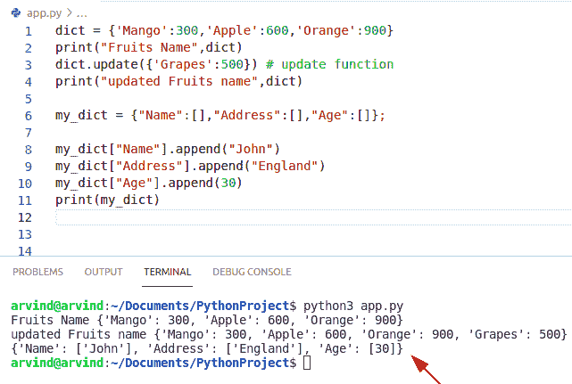

Python Dictionary update vs append

## Python 字典更新键

*   在本节中，我们将讨论 **python 字典更新键**。
*   我们能做的最接近的事情是用旧键保存值，删除它，然后用替换键和保存的值添加一个新值。
*   在这个例子中，我们可以很容易地调用 dict.pop(key)从 dict 中更新一个旧的键，并返回它的值。使用同一个字典，给字典分配一个新的键值对。
*   python pop()方法从字典中删除一个元素。它移除与指定键相关联的元素。

**语法:**

下面是 pop()方法的语法

```py
dict.pop(key,default)
```

*   它由几个参数组成
    *   **Key:** 要从字典中删除的键。
    *   **默认值:**(可选参数)如果在字典中找不到该键，则返回该值。
*   **Return:** 返回与键相关联的值。如果在字典中找不到某个键，那么如果指定了默认参数，它将返回默认值。如果没有找到键，并且没有指定默认参数，那么它会抛出一个键错误。

**举例:**

让我们举一个例子来检查如何更新字典中的键

```py
romanNumbers = {'II':1, 'IV':2, 'III':3, 'V':4, 'VI':5 }
UpdateValue = romanNumbers.pop('V')
print("The popped element is: ", UpdateValue)
print("Updated dictionary: ",romanNumbers)
```

下面是以下代码的截图

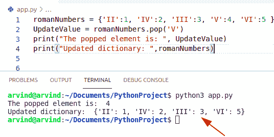

Python Dictionary update key

*   如果找不到键，并且没有指定默认参数，则会引发键错误。

**举例:**

```py
romanNumbers = {'II':1, 'IV':2, 'III':3, 'V':4, 'VI':5 }
UpdateValue = romanNumbers.pop('VII')
print("The popped element is: ", UpdateValue)
```

下面是以下代码的截图

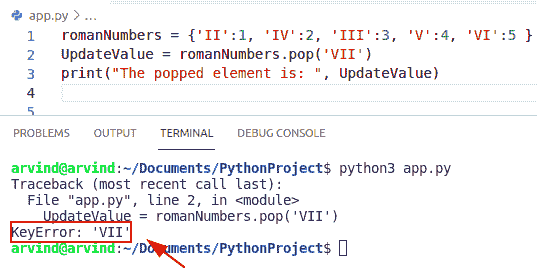

The python default parameter is not specified

## 更新字典中密钥的另一种方法

*   在这个方法中，我们可以很容易地使用 Python zip()函数。
*   假设如果我们想要更新字典的所有键，那么我们需要使用 zip()函数。
*   zip()函数创建一个序列，该序列将聚合来自两个或多个 iterables 的元素。

**举例:**

让我们举一个例子来检查如何更新字典中的键

```py
mydict = {'John': 1, 'Micheal' : 5, 
            'James' : 10, 'Potter' : 15}

mylist = ['m', 'n', 'o', 'p']
print ("initial  dictionary", mydict)
res_dict = dict(zip(mylist, list(mydict.values())))
print ("Updated dictionary", str(res_dict))
```

下面是以下代码的截图

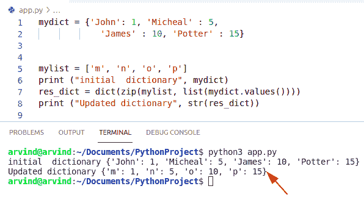

Python Dictionary update key zip method

## Python 字典更新 vs 赋值

*   在本节中，我们将讨论 **python 字典更新与赋值**。
*   在这个方法中，您可以使用符号，它可以访问键，或者使用方括号创建一个新的键，然后提供相反的值。
*   此外，您可以使用字典方法 update()来更新现有字典中的键。
*   要向字典中添加一个新键，我们可以简单地使用新键的符号，并使用赋值操作符=来赋值。

**举例:**

```py
dict1 = {'Perl':200,'Mongodb':300,'SQL':400}
print("Languages",dict1)
dict1.update({'Ruby':500,'Pascal':800}) #update function
print("updated language",dict1)

Mobilename = {'samsung': 100, 'Oppo': 50}

print("Original name:", Mobilename)
Mobilename['Apple'] = 80 # assignment operator

print("Updated name:", Mobilename)
```

下面是以下代码的截图

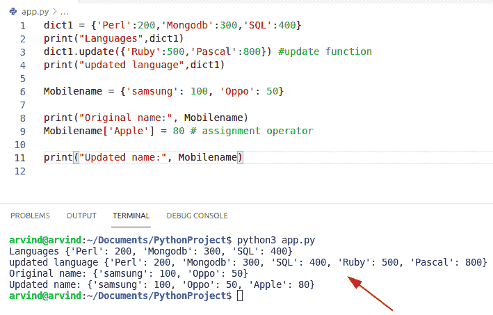

Python Dictionary update vs assignment

## Python 字典更新所有值

*   在本节中，我们将讨论 **python 字典更新所有值**。我们可以通过使用 update()函数很容易地做到这一点。
*   python update()方法用键和值对更新字典。如果键/值不存在，它将插入一个键/值。如果键/值已经存在于字典中，它将更新该键/值。
*   该函数将帮助用户更新 Python 字典中的所有值。

**语法:**

下面是 update()方法的语法

```py
dict.update([other])
```

*   **Return:** 不返回值(无)

**举例:**

```py
my_dict = {'Italy':200,'Japan':300,'Canada':400}
print("Country name",my_dict)
my_dict.update({'Italy':600,'japan':900,'Canada':250})
print("updated all values:",my_dict)
```

下面是以下代码的截图

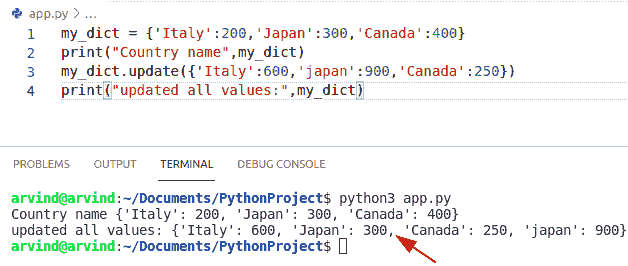

Python Dictionary update all values

上面的代码可以用来更新 Python 字典中的所有值。

## Python 嵌套字典更新

*   在本节中，我们将讨论 **python 嵌套字典更新**。
*   要删除存储在嵌套字典中的条目，我们可以很容易地使用 del 语句。del 语句删除一个对象。del 函数类似于 python break 语句。
*   在这个方法中我们可以很容易地使用方法 `del()`

**举例:**

```py
employee_info = {
	0: { "emp_name1": "John", "salary": 50, "emp_id": 20 },
	1: { "emp_name2": "Micheal","salary":30, "emp_id": 40 },
2: { "emp_name3": "George", "salary": 90, "emp_id": 60 }
}

del employee_info[2]

print(employee_info)
```

*   在上面的例子中，我们可以从嵌套字典中删除这个雇员。
*   在这个例子中，我们使用 del 语句删除嵌套字典中键等于 2 的值。如您所见，这从我们的嵌套字典中删除了 emp_name3 的条目。

下面是以下代码的截图

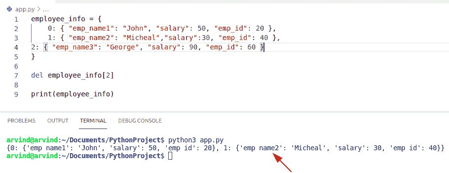

Python nested dictionary update

## 不存在时更新 Python 字典

*   在本节中，我们将讨论 **Python 字典更新，如果不存在**。
*   在这个方法中，我们可以很容易地在关键字中使用函数**。**
*   in 关键字用于检查字典中是否已经存在某个键。

**举例:**

```py
mobile = {
  "mobile name": "Samsung",
  "reference_number": "M30",
  "year":2019
}
if "mobile name" in mobile:
  print("key mobile name is exist!")
else:
  print("key mobile name is not exist!")
if "color" in mobile:
  print("key phone is exist!")
else:
  print("key phone is not exist!")
```

下面是以下代码的截图

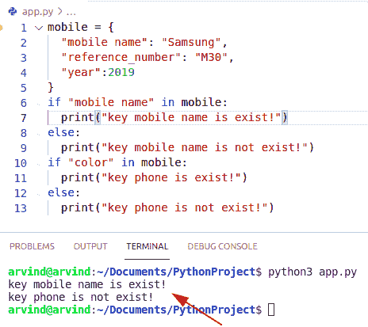

Python dictionary update if not exists

您可能会喜欢以下 Python 教程:

*   [Python 从字符串中移除子串](https://pythonguides.com/python-remove-substring-from-a-string/)
*   [Python 替换文件中的字符串](https://pythonguides.com/python-3-string-replace/)
*   [PdfFileWriter Python 示例](https://pythonguides.com/pdffilewriter-python-examples/)
*   [使用 Tkinter 的 Python 注册表](https://pythonguides.com/registration-form-in-python-using-tkinter/)
*   [Python NumPy max 带示例](https://pythonguides.com/python-numpy-max-with-examples/)

在本 Python 教程中，我们将通过如下几个例子来讨论 **Python 字典更新**:

*   Python 字典更新方法
*   Python 字典更新值
*   如果键存在，Python 字典更新值
*   Python 字典更新功能
*   Python 字典更新与追加
*   Python 字典更新密钥
*   Python 字典更新与赋值
*   Python 字典更新所有值
*   Python 嵌套字典更新
*   Python 字典更新(如果不存在)

[Bijay Kumar](https://pythonguides.com/author/fewlines4biju/)

Python 是美国最流行的语言之一。我从事 Python 工作已经有很长时间了，我在与 Tkinter、Pandas、NumPy、Turtle、Django、Matplotlib、Tensorflow、Scipy、Scikit-Learn 等各种库合作方面拥有专业知识。我有与美国、加拿大、英国、澳大利亚、新西兰等国家的各种客户合作的经验。查看我的个人资料。

[enjoysharepoint.com/](https://enjoysharepoint.com/)[](https://www.facebook.com/fewlines4biju "Facebook")[](https://www.linkedin.com/in/fewlines4biju/ "Linkedin")[](https://twitter.com/fewlines4biju "Twitter")