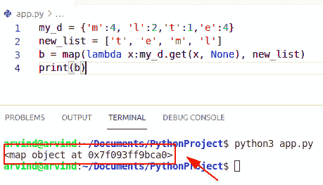

# 要列出的 Python 字典值–有用的教程

> 原文：<https://pythonguides.com/python-dictionary-values-to-list/>

[](https://sharepointsky.teachable.com/p/python-and-machine-learning-training-course)

在本 [Python 教程](https://pythonguides.com/learn-python/)中，我们将讨论 **Python 字典值来列举**。特别是，我们将通过下面的几个例子来看看如何**将 Python 字典值转换成列表**:

*   要列出的 Python 字典特定值
*   要按关键字排序的 Python 字典值列表
*   要按值排序列出的 Python 字典值
*   Python 字典值列表到数据帧
*   Python 将字典值转换为列表
*   Python 将字典值提取到列表中
*   Python 将字典值添加到列表中
*   Python 将字典值追加到列表中
*   Python 将字典值映射到列表

目录

[](#)

*   [Python 字典值列表](#Python_dictionary_values_to_list "Python dictionary values to list")
*   [检查要列出的字典值-另一种方法](#Check_dictionary_values_to_list_-_Another_method "Check dictionary values to list – Another method")
*   [Python 字典具体值列表](#Python_dictionary_specific_values_to_list "Python dictionary specific values to list")
*   [Python 字典值列表按键排序](#Python_dictionary_values_to_list_sorted_by_key "Python dictionary values to list sorted by key")
*   [检查字典值是将列表按关键字排序——另一种方式](#Check_dictionary_values_is_to_list_sorted_by_keys_-_Another_way "Check dictionary values is to list sorted by keys – Another way")
*   [Python 字典值列表按值排序](#Python_dictionary_values_to_list_sorted_by_values "Python dictionary values to list sorted by values")
*   [检查字典值以列出按值排序的列表(另一种方式)](#Check_dictionary_values_to_list_sorted_by_values_another_way "Check dictionary values to list sorted by values (another way)")
*   [Python 字典值列表到数据帧](#Python_dictionary_values_list_to_dataframe "Python dictionary values list to dataframe")
*   [检查 Python 字典值列表到 dataframe(另一个例子)](#Check_Python_dictionary_values_list_to_dataframe_Another_example "Check Python dictionary values list to dataframe (Another example)")
*   [Python 将字典值转换为列表](#Python_convert_dictionary_values_to_list "Python convert dictionary values to list")
*   [检查如何将字典值转换成列表(另一个例子)](#Check_how_to_convert_dictionary_value_into_list_Another_example "Check how to convert dictionary value into list (Another example)")
*   [Python 将字典值添加到列表中](#Python_add_dictionary_values_to_list "Python add dictionary values to list")
*   [Python 将字典值追加到列表中](#Python_append_dictionary_values_to_list "Python append dictionary values to list")
*   [检查如何将字典值追加到列表中(另一个例子)](#Check_how_to_append_dictionary_values_to_list_Another_example "Check how to append dictionary values to list (Another example)")
*   [Python 地图字典值列表](#Python_map_dictionary_values_to_list "Python map dictionary values to list")
*   [解决方案](#Solution "Solution")

## Python 字典值列表

*   让我们看看如何用 python 将字典值转换成列表。
*   在 Python 中，我们可以使用 `values()` 函数将字典值转换为 [Python 列表](https://pythonguides.com/create-list-in-python/)。
*   这个函数总是返回字典中已经给定的所有元素或值的列表。

**语法:**

下面是 `values()` 方法的语法

```py
dictionary.values()
```

**举例:**

下面举个例子来检查一下**如何将字典值转换成列表**。

```py
dict = {"john":200,"Micheal":300,"George":400}
res_list = dict.values()
new_value = list(res_list)
print(new_value)
```

首先在上面的代码中，我们将初始化一个字典，并以键/值对的形式给它们赋值。之后，使用 dict 声明字典值的视图。values()函数。使用 list(item ),它会将字典值转换成一个列表。

下面是以下代码的截图


Python dictionary values to list

这是如何在 Python 中字典值列表。

阅读 [11 Python 列表方法](https://pythonguides.com/python-list-methods/)

## 检查要列出的字典值-另一种方法

*   现在我们可以看到如何通过使用 items()方法将 Python 字典值转换为列表值，该方法总是返回一个 iterable 对象或字典中所有可用元素或值的序列。
*   在这个例子中，我们可以使用 list comprehension 方法来获取给定的 [Python 字典](https://pythonguides.com/create-a-dictionary-in-python/)的 iterable 序列项。

**举例:**

让我们举个例子来检查**如何将字典值转换为列表**

```py
dict = {"Spain":500,"Japan":600,"U.S.A":700}
new_values = [ list 
                for key, list in dict.items()]
print(new_values)
```

下面是以下代码的截图


Python dictionary values to list by item method

阅读[如何用 Python 将字典转换成 JSON](https://pythonguides.com/convert-dictionary-to-json-python/)

## Python 字典具体值列表

*   在这里，我们将讨论 **Python 字典中列出的**的具体值。
*   假设如果我们想从给定的字典中只转换特定的值。例如，只选择那些关键字是长度大于或等于 6 的字符串的字典值。
*   在这个例子中，我们可以应用列表理解方法来获取给定的[字典](https://pythonguides.com/python-dictionary-methods/)中的可重复条目或对象。

**举例:**

让我们举一个例子来检查如何在 Python 中将特定于字典的值转换为列表。

```py
dict = {"Spain":500,"Japan":600,"England":700,"Germany":100,"Australia":900}
new_values = [ value 
                    for key, value in dict.items()
                    if len(key) >= 6]
print(new_values)
```

下面是以下代码的截图


Python dictionary specific values to list

这是如何在 Python 字典中将特定值转换为列表。

阅读[蟒蛇串连⑵](https://pythonguides.com/python-concatenate-dictionary/)[一](https://pythonguides.com/python-concatenate-dictionary/)ry

## Python 字典值列表按键排序

*   让我们看看如何用 Python 将字典值转换成按键排序的列表。
*   要将字典值转换为按键排序的列表，我们可以使用 `dict.items()` 和 `sorted(iterable)` 方法。
*   Dict.items()方法总是返回一个或多个对象，这些对象以键/值对的形式显示字典列表。
*   sorted (iterable)方法总是返回排序列表。该方法对给定字典中可用的元素数量进行排序。

**语法:**

下面是 iterable 项和排序方法的语法

```py
Dict.items()
```

```py
Sorted(iterable)
```

**举例:**

让我们举一个例子来检查字典值，以便按键排序

```py
dict = {'z':5,'h':2,'f':9,'u':5}
new_items= dict.items()
sort_key = sorted(new_items)
print(sort_key)
```

在上面的代码中，首先，我们将初始化一个字典，并为它们分配键值对元素。然后使用 dict.items()方法获取 iterable 序列项，并使用 sorted(iterable)方法按键对字典进行排序，并将它们转换为列表。

下面是以下代码的截图


Python dictionary values to list sorted by key

上面的代码是一个 Python 字典值按键排序的例子。

阅读 [Python 字典更新示例](https://pythonguides.com/python-dictionary-update/)

## 检查字典值是将列表按关键字排序——另一种方式

*   在这里，我们可以检查如何**将字典值转换为按键**排序的列表。我们可以在 Python 中使用 sorted()和 keys()函数。
*   Dict.keys()方法总是返回字典中所有键的一个对象或项。
*   我们将从 iterable 序列中声明一个排序字典。项目()或。keys()方法。

**举例:**

```py
dict = {'u':10,'l':12,'c':14,'t':15}
sorted(dict.keys())

for new_key in sorted(dict.keys()):
    print(new_key , " : " , dict[new_key])
```

下面是以下代码的截图


Python dictionary values to list sorted by keys method

## Python 字典值列表按值排序

*   在 Python 中，通过使用 sorted(iterable)方法，我们可以很容易地将字典值转换为按值排序的列表。
*   在这个例子中，我们可以很容易地使用函数排序(iterable)和列表理解方法。

**举例:**

```py
my_dict = {"Spain":500,"Japan":600,"England":700,"Germany":100,"Australia":900}
list = sorted(my_dict.items(), key=lambda x:x[1])
new_dict = dict(list)
print(new_dict)
```

下面是以下代码的截图


Python dictionary values to list sorted by values

阅读[如何在 Python 中创建字符串](https://pythonguides.com/create-a-string-in-python/)

## 检查字典值以列出按值排序的列表(另一种方式)

*   在这里，我们可以检查如何通过使用 itemgetter()函数将字典值转换为按值排序的列表。它总是在 Python 中的**操作符**库或模块中定义。
*   该函数总是返回一个视图对象，该对象显示可迭代的项目或对象。
*   我们可以使用 itemgetter()方法对给定列表中的元素或值进行排序。

示例:

```py
import operator

my_dict = {"John":500,"George":800,"Python":700,"Java":100,"Ruby":400}
list = sorted(my_dict.items(), key=operator.itemgetter(1))
new_dict = dict(list)
print(new_dict)
```

下面是以下代码的截图


Python dictionary values to list sorted by values operator method

## Python 字典值列表到数据帧

*   现在，我们将讨论如何在 Python 中将字典值列表转换成数据帧。
*   在这个例子中，我们可以很容易地用 Python 导入 pandas 模块。
*   Pandas 是一个 python 库，用于数据操作和清理。在 pandas 中，我们可以处理有序和无序的数据，如系列数据(行和列)。
*   基本上，它是一个具有不同类型列的二维数据结构。

**举例:**

```py
import pandas as pd

dict = [{"Mangoes":500,"Cherry":700,"banana":900}]

df1= pd.DataFrame(dict)
print(df1)
```

首先在上面的例子中，我们将导入一个 pandas 库，创建一个字典并将数据初始化为列表。之后，创建一个数据框架并打印结果。

下面是以下代码的截图


Python dictionary values list to dataframe

阅读 [Python NumPy shape 示例](https://pythonguides.com/python-numpy-shape/)

## 检查 Python 字典值列表到 dataframe(另一个例子)

*   在这里，您可以通过使用 `dataframe()` 方法，在 Python 中检查如何**将字典值列表转换为带索引的数据帧。**

**举例:**

```py
import pandas as pd

dict = [{"James":100,"potter":600,"Bill":900}]
df1 = pd.DataFrame(dict, index =['Row1', 'Row2'])
print(df1)
```

下面是以下代码的截图


Python dictionary values list to dataframe with index

## Python 将字典值转换为列表

*   为了在 Python 中把字典值转换成列表，我们可以使用列表理解方法。
*   列表理解是通过操作现有给定列表中的每一项来声明新列表的简洁方法。

**举例:**

让我们举一个例子来检查如何将字典值转换为列表

```py
my_dict = {"Spain":500,"Japan":600,"England":700,"Germany":100}
new_List = []
for key in my_dict:
    new_List.append(my_dict[key])
print(new_List)
```

下面是以下代码的截图


Python convert dictionary values to list

阅读 [Python NumPy nan](https://pythonguides.com/python-numpy-nan/)

## 检查如何将字典值转换成列表(另一个例子)

*   现在，在这个例子中，我们可以检查**如何通过使用 values()方法**将字典值转换成列表。
*   该方法总是返回字典中已经给出的所有元素或值的列表。它将把字典值转换成一个列表。

**举例:**

让我们举一个例子来检查如何将字典值转换成列表

```py
my_dict = {"Chinese":100,"Italian":300,"Maxican":400}
new_list = my_dict.values()
new_value = list(new_list)
print(new_value)
```

下面是以下代码的截图


Python convert dictionary values to list by values method

## Python 将字典值添加到列表中

*   在这里，我们讨论如何用 Python 将字典值添加到列表中。
*   在这个例子中，我们可以很容易地使用 **values()函数将字典值添加到列表**中。
*   首先，我们将初始化一个字典，并为它们分配键值对元素。之后，创建一个具有相同变量名的新字典，并添加到新字典中。

**举例:**

```py
my_dict = {"High":100,"Low":300}
my_dict["Middle"]=500
new_list = my_dict.values()
new_value = list(new_list)
print(new_value)
```

下面是以下代码的截图


Python add dictionary values to list

阅读 [Python NumPy 绝对值示例](https://pythonguides.com/python-numpy-absolute-value/)

## Python 将字典值追加到列表中

*   让我们看看如何用 Python 将字典值追加到列表中。
*   通过使用 append()函数，我们可以向字典中的键添加元素。要使用 **append()向字典**中插入元素或值，首先，我们必须找到基于一个键的值，并向它追加一个值。
*   在这个例子中，字典中的关键字是“国家”、“地址”、“性别”。使用 append()函数，我们可以为字典中的键生成值。

**举例:**

让我们举一个例子来检查如何将字典值追加到列表中

```py
dict = {"Country":[],"Address":[],"Gender":[]};

dict["Country"].append("Japan")
dict["Address"].append("Tokyo")
dict["Gender"].append("Male")	
print(dict)
```

下面是以下代码的截图


Python append dictionary values to list

## 检查如何将字典值追加到列表中(另一个例子)

*   通过使用 `collection.defaultdict()` 我们可以在字典值或键中追加一个元素。
*   defaultdict 是内置 dictionary 类的子类。它总是返回新的类似字典的对象或项目。

**举例:**

让我们举一个例子来检查**如何将字典值追加到列表**中。

```py
import collections

my_dict = collections.defaultdict(list)
my_dict["Name"].append("George")
print(my_dict)
```

在编写了上面的代码之后，我们将首先导入一个集合模块，并初始化一个字典，该字典具有没有在参数中设置的默认值和键。现在我们可以使用 **collection.defaultdict()方法**并作为参数数据类型传递，即列表。一旦你打印了 `my_dict` 变量，输出将显示为 **{ name:['geroge']}** 。

下面是以下代码的截图


Python append dictionary values to list collections method

阅读 [Python 通过引用或值传递示例](https://pythonguides.com/python-pass-by-reference-or-value/)

## Python 地图字典值列表

*   Python 提供了 **map()函数**，该函数接受一个元素作为参数，然后将返回值存储在一个可迭代序列中。
*   让我们看看如何使用 map 对象在字典中列出值。
*   在这个例子中，你必须使用一个列表理解方法和一个特定的 iterable item。

**举例:**

```py
my_d = {'m':4, 'l':2,'t':1,'e':4}
new_list = ['t', 'e', 'm', 'l']
b = map(lambda x:my_d.get(x, None), new_list)
print(b)
```

写完上面的代码后。get(key)部分用于返回一个默认值。在这个例子中，不要使用一个**‘dict’**变量名作为字典，因为当你使用一个地图对象时，默认情况下它会将一个参数作为 dict。

**注意:**正如你在上面的代码中看到的，我们在理解列表中使用了一个 map 对象，它将抛出一个错误，如**<map object at 0x7f 093 ff 9 BCA 0>**，因为在 Python 3 版本中它不支持 map object 作为列表。

下面是以下代码的截图



Python map dictionary values to list

## 解决方案

以下是误差映射对象的解决方案


Solution of Python map dictionary values to list

这就是如何在 Python 2.7 版本中求解要列出的映射字典值。

您可能会喜欢以下 Python 教程:

*   [Python 从列表中选择](https://pythonguides.com/python-select-from-a-list/)
*   [Python 复制文件](https://pythonguides.com/python-copy-file/)
*   [Python Tkinter Listbox–如何使用](https://pythonguides.com/python-tkinter-listbox/)
*   [Python 文件方法](https://pythonguides.com/python-file-methods/)
*   [将元组列表转换为 Python 中的字符串](https://pythonguides.com/convert-list-of-tuples-to-string-in-python/)
*   [集合的并集 Python +实例](https://pythonguides.com/union-of-sets-python/)
*   [Python 字典排序](https://pythonguides.com/python-dictionary-sort/)

在本 Python 教程中，我们将讨论列出的 **Python 字典值，并举例如下:**

*   要列出的 Python 字典特定值
*   要按关键字排序的 Python 字典值列表
*   要按值排序列出的 Python 字典值
*   Python 字典值列表到数据帧
*   Python 将字典值转换为列表
*   Python 将字典值提取到列表中
*   Python 将字典值添加到列表中
*   Python 将字典值追加到列表中
*   Python 将字典值映射到列表

[Bijay Kumar](https://pythonguides.com/author/fewlines4biju/)

Python 是美国最流行的语言之一。我从事 Python 工作已经有很长时间了，我在与 Tkinter、Pandas、NumPy、Turtle、Django、Matplotlib、Tensorflow、Scipy、Scikit-Learn 等各种库合作方面拥有专业知识。我有与美国、加拿大、英国、澳大利亚、新西兰等国家的各种客户合作的经验。查看我的个人资料。

[enjoysharepoint.com/](https://enjoysharepoint.com/)[](https://www.facebook.com/fewlines4biju "Facebook")[](https://www.linkedin.com/in/fewlines4biju/ "Linkedin")[](https://twitter.com/fewlines4biju "Twitter")