# Python Django 过滤器

> 原文：<https://pythonguides.com/python-django-filter/>

[](https://sharepointsky.teachable.com/p/python-and-machine-learning-training-course)

在本 [Django 教程](https://pythonguides.com/what-is-python-django/)中，我们将讨论“ **Python Django 过滤器**”，我们还将讨论与 Django 中的过滤器相关的不同示例。我们将在本教程中讨论以下主题。

*   Python Django 过滤器
*   Python Django 过滤器或
*   Python Django 过滤器和
*   Python Django 过滤器
*   Python Django 过滤器不相等
*   Python Django 过滤器包含
*   Python Django 过滤器日期
*   Python Django 过滤器排序依据
*   Python Django 过滤器 like
*   Python Django 过滤器大于
*   Python Django 过滤器小于
*   Python Django 过滤器大于等于
*   Python Django 过滤器小于等于
*   Python Django 过滤器 q
*   Python Django 过滤器独特

目录

[](#)

*   [Python Django 过滤器](#Python_Django_filter "Python Django filter")
*   [Python Django 过滤器和](#Python_Django_filter_and "Python Django filter and ")
*   [Python Django 过滤器不等于](#Python_Django_filter_not_equal "Python Django filter not equal ")
*   [Python Django 过滤器排序依据](#Python_Django_filter_order_by "Python Django filter order by ")
*   [Python Django 过滤器大于](#Python_Django_filter_greater_than "Python Django filter greater than ")
*   [Python Django 过滤器大于等于](#Python_Django_filter_greater_than_equal_to "Python Django filter greater than equal to")
*   [Python Django 过滤器小于](#Python_Django_filter_less_than "Python Django filter less than ")
*   [Python Django 过滤器小于等于](#Python_Django_filter_less_than_equal_to "Python Django filter less than equal to")
*   [Python Django 过滤器包含](#Python_Django_filter_contains "Python Django filter contains")
*   [Python Django 滤镜喜欢](#Python_Django_filter_like "Python Django filter like ")
*   中的 [Python Django 过滤器](#Python_Django_filter_in "Python Django filter in ")
*   [Python Django 过滤日期](#Python_Django_filter_date "Python Django filter date ")
*   [Python Django 过滤器 q](#Python_Django_filter_q "Python Django filter q")
*   [Python Django 过滤器或](#Python_Django_filter_or "Python Django filter or ")
*   [Python Django 过滤器独特](#Python_Django_filter_distinct "Python Django filter distinct ")

## Python Django 过滤器

在开始这个话题之前，你应该知道 Django 和**中的**什么是模型，我们如何为我们的模型**创建对象。对此，可以参考“[如何在 Django](https://pythonguides.com/create-model-in-django/) 中创建模型”。**

所以，在创建一个模型并插入一些数据后。是时候学习如何从数据库中检索数据了。

在 Django 中，表数据由 python 对象表示，为了检索这些 python 对象，我们必须使用 `QuerySet` 。Django 中的一个**查询集**是数据库对象的集合，它可以有零个或多个过滤器。现在，这些过滤器用于根据提供的参数限制结果的数量。

很多时候，我们可能会遇到这样的情况:我们只需要从所有对象中选择一部分对象。现在，对于这个实现，我们将使用带有一些过滤条件的**查询集**。下面给出了一些命令过滤方法。

1.  `filter()` :这个方法返回一个新的**查询集**，其对象与给定的参数相匹配。即使只有一个对象符合条件，它也会返回一个**查询集**。在这种情况下，**查询集**将只包含一个元素。
2.  `exclude()` :在 Django 中， `exclude()` 方法返回一个新的 `QuerySet` ，其中的对象与给定的参数不匹配。

因此，在接下来的小节中，我们将讨论与 QuerySet 中的 filter 方法的可用性相关的不同示例。

阅读:[如何安装 Django](https://pythonguides.com/how-to-install-django/)

## Python Django 滤镜和

现在，在这一节中，我们将讨论在 Django 中使用 filter 方法时如何使用 AND 操作符。为了演示这个主题，我们使用 Django 中的**用户**模型。该模型包含以下数据。

| 用户名 | 名字 | 姓氏 | 电子邮件 |
| --- | --- | --- | --- |
| 玛琪 | 玛琪 | 工作 | mworling3@imageshack .美国 |
| 模糊的 | 模糊的 | Birkby | mbirkbyf@qq.com |
| 米卡 | 米卡 | 塞维利亚 | 姆塞维尔@skyrock.com |
| 罗斯 | 罗斯 | 汉克斯 | paylmer1@desdev.cn |
| 斯科特 | 斯科特 | 穆勒夫 | smulleary0@hud.gov |

User Model Data

现在，为了执行这个任务，我们将使用 Django shell。要使用 shell，首先，我们需要打开命令提示符并运行以下命令。

```py
python manage.py shell
```

这将在命令提示符下启动交互式控制台。现在，我们将执行下面的例子。

```py
`(InteractiveConsole)`
**>>>** from django.contrib.auth.models import User                       
**>>>**
**>>>** queryset = User.objects.filter(first_name__startswith='M', last_name__startswith='S')
**>>>**
**>>>** print(queryset)
```

在上面的例子中，首先，我们已经导入了**用户**模型。之后，我们使用 `QuerySet` 来过滤数据，为了过滤，我们定义了两个条件。

首先，记录的名字应该以字符“ `M` 开始。第二，记录的姓氏应该以字符“ `S` 开始。

现在，条件之间的逗号(“**，**”)指定了**和**操作符。最后，我们使用 print 语句打印过滤后的查询集。

因此，这个查询集将选择名字以“ `M` 开始，姓氏以“ `S` 开始”的记录。

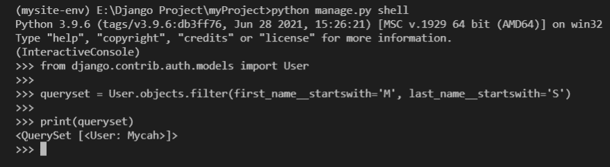

Result

我们还可以通过执行下面的命令来获取相应的 SQL 代码。

```py
str(queryset.query)
```

它将为这个查询集返回等价的 SQL 语句。

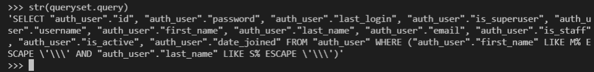

Output

阅读:[如何设置 Django 项目](https://pythonguides.com/setup-django-project/)

## Python Django 滤镜不等于

在这一节中，我们将了解如何根据“**不等于**”条件来过滤 Django 中的对象。

这仅仅意味着我们必须过滤掉所有不符合给定条件的数据。对于这次执行，我们将使用带有 QuerySet 的 `exclude()` 方法。

Django 中的 `exclude()` 方法返回一个新的 `QuerySet` ，其中包含与给定参数不匹配的对象。让我们通过执行一个例子来理解它的用法。

同样，我们将使用相同的**用户**模型，并使用 Django shell 来执行。这里是 `exclude()` 方法的例子。

```py
**>>>** from django.contrib.auth.models import User
**>>>** 
**>>>** queryset = User.objects.exclude(first_name__startswith='M')                                                
**>>>** 
**>>>** print(queryset)
```

在这个例子中，我们使用了 import 语句来导入**用户**模型。在这之后，我们定义了一个 QuerySet，它将排除名字以“ `M` 开头的所有记录。最后，我们使用**打印**语句来打印结果。

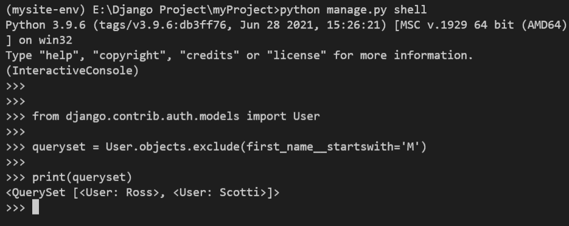

Example with Output

阅读: [Python Django vs Flask](https://pythonguides.com/python-django-vs-flask/)

## Python Django 过滤顺序由

在本节中，我们将了解如何使用 QuerySet 对 Django 中的数据库对象进行排序。因此，默认情况下，QuerySet 的结果是基于模型的元类中定义的排序元组进行排序的。

但是，我们也可以通过使用 `order_by()` 方法来改变 QuerySet 对结果的排序。

对于该任务的演示，我们使用具有以下数据的**学生**模型。

| 名字 | 姓氏 | 年龄 |
| --- | --- | --- |
| 鲍里斯 | 殷勤地 | Sixteen |
| Tawnya | 杜尔顿 | Sixteen |
| 贾丝廷娜 | 专利的 | Sixteen |
| 格里利 | 塔夫雷利 | Seventeen |
| 伊甸园 | 霍基 | Seventeen |
| 尿壶 | 洞穴 | Eighteen |
| 杰拉尔多 | 提勒拉 | Eighteen |
| 权俞利 | 马蒂莫 | Fifteen |
| 安妮莎 | 阿列克桑德罗夫 | Fifteen |
| 简在哪里 | 清脆声 | Sixteen |

Students Model Data

现在，为了执行，我们将使用 Django shell 并尝试根据名字以升序对结果进行排序。这是实现的代码。

```py
>>> from myApp.models import Students
>>> 
>>> queryset = Students.objects.order_by('first_name')
>>> 
>>> print(queryset)
```

因此，在给定的示例中，首先，我们导入了**学生**模型。之后，我们用 `order_by()` 方法定义了一个 QuerySet。在 `order_by()` 方法中，我们将“ `first_name` ”定义为一个参数。

这仅仅意味着 QuerySet 中的对象将基于 `first_name` 以升序排序。要将顺序定义为降序，我们必须在参数中使用减号(-)。

下面是上述示例的执行及其结果。

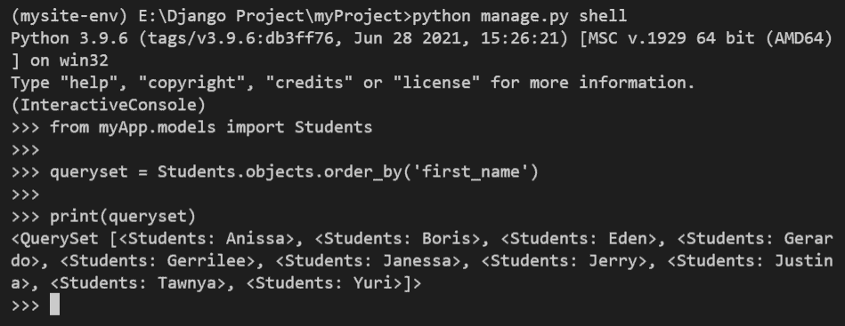

Example with Output

阅读: [Python Django 获取管理员密码](https://pythonguides.com/python-django-get-admin-password/)

## Python Django 过滤器大于

在本节中，我们将讨论如何使用带有 QuerySet 的"**大于**"过滤器来过滤 Django 中的对象。在这次演示中，我们将再次使用**学生**模型及其数据。模型中的数据如下。

| 名字 | 姓氏 | 年龄 |
| --- | --- | --- |
| 鲍里斯 | 殷勤地 | Sixteen |
| Tawnya | 杜尔顿 | Sixteen |
| 贾丝廷娜 | 专利的 | Sixteen |
| 格里利 | 塔夫雷利 | Seventeen |
| 伊甸园 | 霍基 | Seventeen |
| 尿壶 | 洞穴 | Eighteen |
| 杰拉尔多 | 提勒拉 | Eighteen |
| 权俞利 | 马蒂莫 | Fifteen |
| 安妮莎 | 亚历山大罗夫 | Fifteen |
| 简在哪里 | 清脆声 | Sixteen |

Students Model Data

让我们借助一个例子来理解如何使用“**大于**运算符。对于这个例子，我们将选择年龄大于 `16` 的所有数据库对象。该示例的代码如下。

```py
**>>>** from myApp.models import Students
**>>>** 
**>>>** queryset = Students.objects.filter(age__gt=16)    
**>>>** 
**>>>** print(queryset)
```

所以，在这个例子中，我们使用了 `filter()` 方法，在这个方法中，我们传递了“ `age__gt=16` ”作为参数。这意味着它将从**学生**模型中选择年龄大于 16 岁的所有对象。现在，如果我们运行给定的代码，我们将得到以下输出。

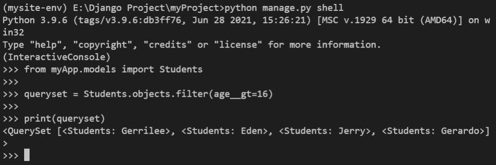

Example

阅读:[Django 中的应用程序和项目之间的差异](https://pythonguides.com/django-app-vs-project/)

## Python Django 滤镜大于等于

所以，类似于"**大于**过滤器，我们也可以在 Django 中使用"**大于等于** " ( > =)过滤器。通过使用这个过滤器，我们可以选择所有大于或等于特定值的数据库对象。

同样，在本次演示中，我们将使用与上一节所示数据相同的**学生**模型。

例如，我们将选择年龄大于或等于 `17` 的所有数据库对象。下面给出了这个例子的代码。

```py
**(InteractiveConsole)
>>>** 
**>>>** from myApp.models import Students
**>>>** 
**>>>** queryset = Students.objects.filter(age__gte=17)
**>>>** 
**>>>** print(queryset) 
```

所以，在这个例子中，我们使用了 `filter()` 方法，在这个方法中，我们传递了“ `age__gte=17` ”作为参数。

这意味着它将从年龄大于或等于 `17` 的**学生**模型中选择所有对象。现在，如果我们运行给定的代码，我们将得到以下输出。

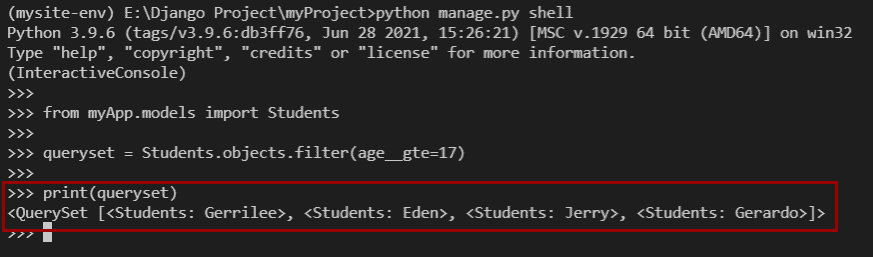

Example

阅读:[如何获取 Django 的当前时间](https://pythonguides.com/how-to-get-current-time-in-django/)

## Python Django 过滤不到

在本节中，我们将讨论如何使用带有 QuerySet 的"**小于**"过滤器来过滤 Django 中的对象。

为了更好的理解，我们将借助一个例子来理解实现。为此，我们将在 Django 使用相同的**学生**模型。

对于示例演示，我们将选择年龄小于 `17` 的所有数据库对象。下面给出了该示例的代码。

```py
**(InteractiveConsole)
>>>                                  
>>>** from myApp.models import Students
**>>>** 
**>>>** queryset = Students.objects.filter(age__lt=17)  
**>>>** 
**>>>** print(queryset)
```

在上面的例子中，我们使用带有 QuerySet 的 `filter()` 方法。而在方法中，我们已经通过“ `age__lt=17` ”作为一个参数。

这意味着它将从年龄小于 `17` 的**学生**模型中选择所有对象。现在，如果我们实现给定的代码，我们将得到下面的结果。

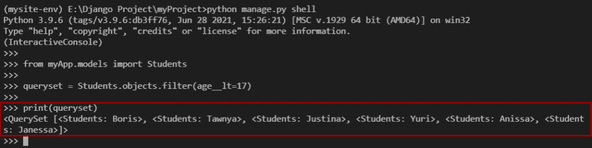

Example

阅读[使用 Python 中的 Django 将 HTML 页面转换为 PDF](https://pythonguides.com/convert-html-page-to-pdf-using-django/)

## Python Django 过滤器小于等于

在本节中，我们将讨论如何使用"**小于` `或等于** " ( < =)过滤器和**查询集**来过滤 Django 中的对象。

并且，我们将借助一个例子来理解实现。为此，我们将在 Django 中使用相同的**学生**模型。

例如，我们将选择年龄小于或等于 `16` 的所有数据库对象。这个例子的代码如下。

```py
**(InteractiveConsole)
>>> 
>>>** from myApp.models import Students
**>>> 
>>>** queryset = Students.objects.filter(age__lte=16) 
**>>> 
>>>** print(queryset)
```

在上面的例子中，我们使用的是以“**年龄 __lte=16** ”作为参数的**过滤器()**方法。这将从**学生**模型中选择年龄小于或等于 `16` 的所有对象。

现在，如果我们实现给定的代码，我们将得到 6 个对象的如下输出。

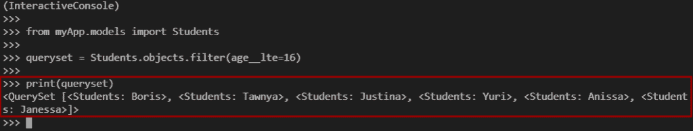

Example

阅读 [Python Django 获取](https://pythonguides.com/python-django-get/)

## Python Django 滤镜包含

在 Django 中，我们也可以基于给定的模式搜索对象，并且**包含用于此任务的**过滤器。Django 中的 contains 过滤器返回给定字段中带有区分大小写字符串的所有对象。

让我们借助一个例子来理解它的用法，我们将在例子中使用 `Person` 模型。

| 名字 | 姓氏 | 年龄 |
| --- | --- | --- |
| 扎克 | 达维多夫斯基 | Twenty-three |
| 乔纳森 | 高尔 | Nineteen |
| 扎克 | 兰德尔（亦作 Randal）（m.） | Twenty-one |
| 克里斯季 | 布林克利 | Twenty |
| 扎克 | 麦克库汉 | Twenty-four |
| 乔纳森 | 麦科维尼 | Twenty-seven |
| 乔纳森 | 坦斯维尔 | Twenty-five |

Person Model Data

正如您在模型数据中看到的，有多条记录具有相同的名字，但不同的姓氏。

现在，我们将使用**包含**过滤器来选择名字为“**扎克**”的所有记录。下面是这个例子的代码。

```py
**(InteractiveConsole)
>>> 
>>>** from myApp.models import Person
**>>>** 
**>>>** queryset = Person.objects.filter(first_name__contains='Zak')
**>>>** 
**>>>** print(queryset)
```

在给定的示例中，我们使用 QuerySet 中的 filter 方法。并且在 filter 方法中，我们传递了“**first _ name _ _ ConA tains = ' Zak '**”作为参数。

因此，这个 QuerySet 将选择名字为“ `Zak` ”的所有对象。下面是示例的执行和结果。

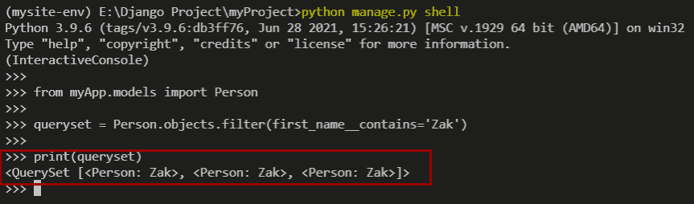

Example

## Python Django 过滤像

在 `SQL` 中，在 `WHERE` 子句中使用了一个类似**的**操作符来搜索给定的模式。但是在 Django 中，我们不能直接使用 `LIKE` 操作符，而是在 filter 方法中使用 `contains` 字段查找来搜索给定的模式。

与**相关的示例包含前面章节中给出的**字段查找。为了确认**包含**选项是否等同于 `LIKE` 操作符，我们将运行下面给出的代码。

```py
>>> from myApp.models import Person
>>> 
>>> queryset = Person.objects.filter(first_name__contains='Zak')
>>> 
>>> print(queryset) 

>>> 
>>> str(queryset.query)
```

在这个例子中，我们使用的是上一节中演示的同一个例子。这个例子是关于通过使用**包含**字段查找来选择名字为 `Zak` 的所有对象。

之后，我们使用 `str(queryset.query)` 方法，它将返回给定 queryset 的等价 SQL 代码。

最终，我们会得到以下结果。

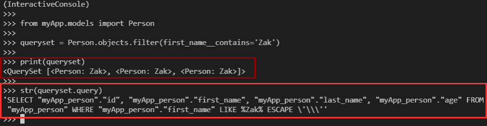

Result

## 中的 Python Django 滤镜

在 `SQL` 中，我们一般使用运算符中的**在 Where 子句中指定多个值。类似地，在 Django 中，我们可以使用**字段查找中的**来选择包含给定 iterable 中的值的对象。**

现在，这些给定的 iterable 可以是列表、元组、查询集，甚至是字符串。

让我们借助一个例子来理解在字段查找中**的用法。为此，我们将使用相同的**人**模型。**

例如，我们将在交互控制台(Django shell)中使用下面的代码。

```py
**(InteractiveConsole)
>>> 
>>>** from myApp.models import Person
**>>> **               
**>>>** queryset = Person.objects.filter(pk__in=[1,4,8]) 
**>>>** 
**>>>** print(queryset)
```

在这个例子中，我们简单地使用字段查找中的**来选择主键值为 1、4 和 8 的对象。它将返回具有这些主键值的所有三个对象。**

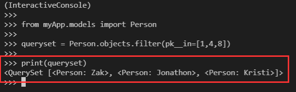

Output

## Python 姜戈过滤日期

在本节中，我们将了解如何在 Django 中根据给定的日期范围过滤数据库对象。在此，我们将学习如何选择给定日期范围内的对象。

在这个演示中，我们使用下面的**员工**模型。这个模型有以下数据。

| 名字 | 职称 | 加入日期 | 薪水 |
| --- | --- | --- | --- |
| 哈迪·芒瑟 | 高级财务分析师 | 2021-05-25 | Twenty-four thousand |
| 里克·莱夫 | 产品工程师 | 2021-02-13 | forty thousand |
| 罗达·本茨 | 总经理 | 2020-10-17 | Thirty-five thousand |
| 鲁斯廷·菲利佩利 | 金融分析师 | 2021-06-04 | Twenty thousand |
| 丹尼斯打赌 | 技术作家 | 2020-11-23 | Thirty-two thousand |
| Allene Johansson | 数据库管理员 | 2021-04-21 | Twenty-eight thousand |
| 艾米·鲁尼 | 助理会计 | 2020-10-02 | Twenty-three thousand |
| 威利·菲利普斯 | 二级工程师 | 2021-08-01 | Thirty-two thousand |

Employee Model Data

现在，为了进行示例演示，我们将选择加入日期在“ **2020- `10-02**` ”和“`2021`-05-02****”(yyyy-mm-DD)之间的所有员工记录。下面是示例的代码。

```py
**(InteractiveConsole)
>>>                                
>>>** from myApp.models import Employee
**>>> 
>>>** queryset = Employee.objects.filter(joining_date__range=["2020-10-02","2021-05-02"])
**>>> 
>>>** print(queryset)
```

在上面的例子中，我们使用**范围**字段查找来选择加入日期在“ **2020- `10-02**` ”和“ **2021 `-05-02**` ”之间的所有数据库对象。

为了定义范围，我们在范围列表中定义了日期。所以，在实现了上面的例子之后，我们将得到下面的输出。

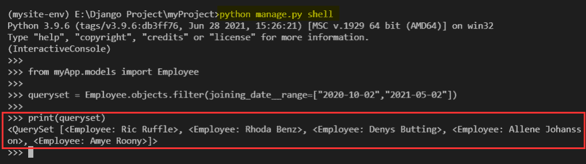

Output

## Python Django 滤镜 q

在 Django 中，我们可以使用 `Q()` 对象来实现复杂的 SQL 查询。我们可以使用一个 `Q()` 对象来表示一个 SQL 语句，该语句可以用于一些数据库操作。

该运算符允许定义和重用条件，也允许将它们与运算符组合，如“**或“**”和“**和**”。

一个 `Q()` 对象( `django.db.models.Q` )是一组关键字参数的容器。这些关键字参数以与“字段查找”相同的方式给出。那么，让我们借助一个例子来了解它的用法。

现在，对于示例演示，我们将使用上一节中显示的相同的**雇员**模型。我们将尝试从雇员模型中选择名称以“ `R` 开头的所有对象。

```py
**(InteractiveConsole)
>>>** from myApp.models import Employee
**>>>** from django.db.models import Q
**>>>** 
**>>>** queryset = Employee.objects.filter(  
... Q(name__startswith="R")
... )
**>>>** 
**>>>** print(queryset)
```

在上面的例子中，首先，我们导入了**雇员**模型，然后，我们从 `django.db.models` 导入了 `Q()` 对象。之后，我们用 filter 方法创建了一个 QuerySet，在这个方法中，我们使用了 `Q()` 对象。

因此，这个 QuerySet with 返回一个新的 QuerySet，其中对象的名称以“ `R` 开始”。下面是上面例子的结果。

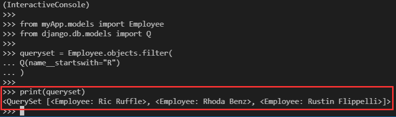

Result

阅读: [Python Django group by](https://pythonguides.com/python-django-group-by/)

## Python Django 滤镜或者

在 Django 中，我们不能直接使用**或**操作符来过滤 QuerySet。对于这个实现，我们必须使用 `Q()` 对象。通过在 filter 方法中使用 `Q()` 对象，我们将能够在 `Q()` 对象之间使用**或**操作符。

让我们借助一个例子来理解实现。对于这个例子，我们将使用**雇员**模型。我们将尝试从雇员模型中选择所有名称以“ `A` 或“ `R` 开头的对象。

```py
**(InteractiveConsole)
>>>  
>>>** from myApp.models import Employee
**>>>** from django.db.models import Q     
**>>>** 
**>>>** queryset = Employee.objects.filter(
... Q(name__startswith="A")|Q(name__startswith="R")
... )
**>>> 
>>>** print(queryset)
```

在本例中，我们使用 QuerySet 中的 filter 方法。在过滤方法中，我们使用 2 个带有字段查找语句的 `Q()` 对象。并且在这些 `Q()` 语句之间，我们定义了**或者` ( `|** )运算符。最后，我们使用 print 语句来打印查询集。

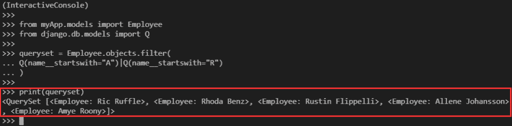

Output

读: [Django for 循环](https://pythonguides.com/django-for-loop/)

## Python Django filter distinct

在 SQL 中，我们在 `SELECT` 语句中使用 `DISTINCT` 关键字来选择唯一的记录。我们通常使用 `SELECT DISTINCT` 语句从查询结果中删除所有重复的记录。

同样，我们使用 Django 中的 `distinct()` 方法从 QuerySet 中删除重复的记录。

为了演示这种方法，我们将使用具有以下记录集的**客户**模型。

| 名字 | 地址 | 国家 | 城市 |
| --- | --- | --- | --- |
| 阿斯特拉弗里斯 | 德克萨斯圈 8268 号 | 美国 | 水牛 |
| 鲍伊·麦克斯佩龙 | 艾根达特小径 3 号 | 美国 | 清水镇 |
| 克拉琳达·凯姆 | 布尔帕斯街 78214 号 | 加拿大 | 谢迪亚茨 |
| 沙恩·弗伦奇 | Trailsway 山 35456 号 | 美国 | 底特律 |
| 科特尼·戴维森 | 小芙蓉路 94999 号 | 联合王国 | 金洛克 |
| 奎尼·格雷维 | 挪威枫叶角 8860 号 | 联合王国 | 阿什利 |
| Dulcy 鱼锁 | 德布斯路口 85095 号 | 美国 | 迈阿密海滩 |
| Teodorico Puzey | 04977 香葱圈 | 加拿大 | 鲍恩岛 |

Customer Model Data

现在，例如，我们将选择不同的国家名称，我们将使用以下代码。

**注意:-** 默认的 SQLite 数据库不支持带参数的 distinct()方法。因此，在示例中，我们展示了在 SQLite 数据库中使用 distinct 方法的一种方式。

```py
(InteractiveConsole)
>>> from myApp.models import Customer   
>>> 
>>> queryset = Customer.objects.values('country').distinct()
>>> 
>>> print(queryset)
```

上面的 QuerySet 将从 country 列返回所有不同的值。下面是上面例子的执行过程。

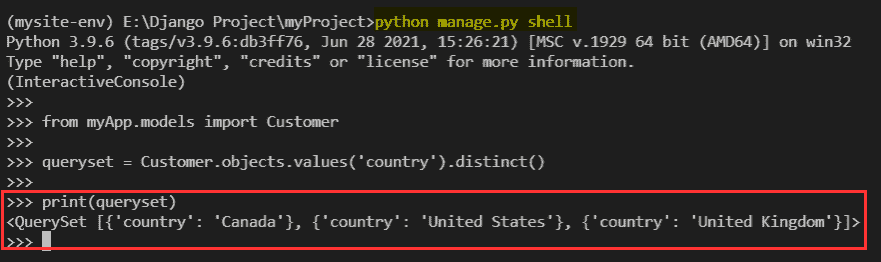

Example

另外，请阅读:[获取 Django 中的 URL 参数](https://pythonguides.com/get-url-parameters-in-django/)

在本 Django 教程中，我们已经讨论了" `Python Django filter` "并且我们还讨论了本教程中的以下主题。

*   Python Django 过滤器
*   Python Django 过滤器或
*   Python Django 过滤器和
*   Python Django 过滤器
*   Python Django 过滤器不相等
*   Python Django 过滤器包含
*   Python Django 过滤器日期
*   Python Django 过滤器排序依据
*   Python Django 过滤器 like
*   Python Django 过滤器大于
*   Python Django 过滤器小于
*   Python Django 过滤器大于等于
*   Python Django 过滤器小于等于
*   Python Django 过滤器 q
*   Python Django 过滤器独特

[Bijay Kumar](https://pythonguides.com/author/fewlines4biju/)

Python 是美国最流行的语言之一。我从事 Python 工作已经有很长时间了，我在与 Tkinter、Pandas、NumPy、Turtle、Django、Matplotlib、Tensorflow、Scipy、Scikit-Learn 等各种库合作方面拥有专业知识。我有与美国、加拿大、英国、澳大利亚、新西兰等国家的各种客户合作的经验。查看我的个人资料。

[enjoysharepoint.com/](https://enjoysharepoint.com/)[](https://www.facebook.com/fewlines4biju "Facebook")[](https://www.linkedin.com/in/fewlines4biju/ "Linkedin")[](https://twitter.com/fewlines4biju "Twitter")