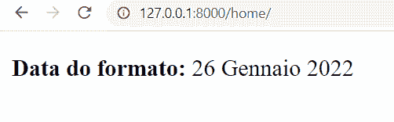

# Python Django 格式日期

> 原文：<https://pythonguides.com/python-django-format-date/>

[](https://sharepointsky.teachable.com/p/python-and-machine-learning-training-course)

在本 [Python Django 教程](https://pythonguides.com/how-to-install-django/)中，我们将了解 **Python Django 格式日期**。我们还将讨论 Django 中与格式日期相关的例子。这是我们将要涉及的主题列表。

*   如何在 Python django 中获取日期
*   Python django 格式日期
*   Python django 格式日期视图
*   Python django 格式日期日/月/年
*   Python django 在模板中格式化日期
*   Python django 格式本地日期

目录

[](#)

*   [如何获取日期](#How_to_get_date "How to get date")
*   [Python django 格式日期](#Python_django_format_date "Python django format date")
*   [Python django 格式日期视图](#Python_django_format_date_in_view "Python django format date in view")
*   [Python django 格式日期 dd/mm/yyyy](#Python_django_format_date_ddmmyyyy "Python django format date dd/mm/yyyy")
*   [Python django 格式模板中的日期](#Python_django_format_date_in_template "Python django format date in template")
*   [Python django 格式日期本地](#Python_django_format_date_locale "Python django format date locale")
    *   [使用中间件](#Using_MIDDLEWARE "Using MIDDLEWARE")
    *   [使用语言 _ 代码](#Using_LANGUAGE_CODE "Using LANGUAGE_CODE")

## 如何获取日期

在格式化日期之前，我们必须获取当前日期值或指定要格式化的日期。

在 Django 中定义或检索日期的最简单方法是使用 python 的 DateTime 模块。这个 `datetime` 模块包含许多不同的类，可以用来操作日期值。

为了生成或获取日期，我们使用了**日期类**。此外，要获取或设置日期，您可以使用以下任何一个函数。

*   **datetime.date():** 该函数用于设置具体日期。它需要三个参数:年、月和日。
*   **datetime.date.today():** 该函数用于获取今天的日期。

另外，检查:[如何获得 Django 的当前时间](https://pythonguides.com/how-to-get-current-time-in-django/)

## Python django 格式日期

由于不同地方表示日期的方式可能不同，我们有时可能需要格式化日期。在 Python 中我们有两种格式化日期的方法，我们可以很容易地在 Django 中使用。

以下是这些功能:

*   **strftime():** 这个函数从一个日期对象生成一个格式化的字符串。它接受一个或多个格式化的代码作为输入，并输出一个字符串表示。
*   strptime(): 这个方法用于格式化一个字符串格式的日期。它需要两个输入，第一个是日期字符串，第二个是格式化代码。

下面列出了用于格式化日期的最流行的 Django 日期过滤器。

| 格式符 | 描述 | 例子 |
| --- | --- | --- |
| %a | 缩写的日期名称。 | Fri, Sun |
| %A | 当天的全名。 | 星期五，星期天 |
| %B | 当月全名。 | 六月，七月 |
| %b | 缩写的月份名称。 | 一月，二月 |
| %m | 以零填充的十进制数表示的月份。 | 06, 10 |
| %d | 以零填充的小数形式表示的一个月中的某一天。 | 18, 31 |
| %y | 作为零填充十进制数的没有世纪的年份。 | 99, 22 |
| %Y | 以世纪为小数的年份。 | 1999, 2022 |
| %j | 以零填充的十进制数表示的一年中的某一天。 | 135, 365 |
| %U | 一年中的第几周。第一天是星期天。 | 28, 53 |
| %W | 一年中的第几周。第一天是星期一。 | 00, 53 |
| %x | 区域设置的适当日期表示。 | 12/31/18 |

Date Format Characters

阅读: [Python Django 与 Flask–主要区别](https://pythonguides.com/python-django-vs-flask/)

## Python django 格式日期视图

在这一节中，我们将学习如何在 Django 中使用视图文件格式化日期。将使用 `views.py` 文件获取日期，然后对其进行格式化。

我们将通过一些例子来帮助阐明我们的概念。

在开始这个例子之前，我将向您展示**项目的 urls.py** 文件。

```py
from django.contrib import admin
from django.urls import path, include

urlpatterns = [
    path('admin/', admin.site.urls),
    path('home/', include('home.urls'))
] 
```

这意味着当你在浏览器中打开你的项目并在 URL 中键入**“home/”**，它将带你到你的 `home.urls` 。

现在，请看**主页的 urls.py** 文件:

```py
from django.contrib import admin
from django.urls import path, include
from home import views

urlpatterns = [
    path('', views.home, name='home')
]
```

它会移动到 home 应用程序的 `views.py` 文件。

**例#1**

在这个例子中，我们将一个月中的某一天格式化为一个零填充的十进制数，将月份格式化为一个缩写名称，将没有世纪的年份格式化为一个零填充的十进制数。

现在，请看 `views.py` 文件:

```py
# Import Libraries

from django.shortcuts import render
import datetime

# Create your views here.

def home(request):
    currentdate = datetime.date.today()
    formatDate = currentdate.strftime("%d-%b-%y")
    return render(request,'home.html',
                  {'current_date':currentdate,
                   'format_date':formatDate} ) 
```

在 `views.py` 文件中，我们创建了一个简单的视图，将当前日期值和格式化的日期值提取到一个变量中。它还将变量返回到 home.html 的**页面。**

现在，请看`home.html`文件:

```py
<!DOCTYPE html>
<html lang="en">
<head>
    <meta charset="UTF-8">
    <meta http-equiv="X-UA-Compatible" content="IE=edge">
    <meta name="viewport" content="width=device-width, initial-scale=1.0">
    <title>PythonGuides</title>
</head>
<body>
    <p>
        <b>Current Date : </b>{{current_date}}
        <br>
        <br>
        <b>Formatted Date : </b>{{format_date}}
    </p>
</body>
</html>
```

在`home.html`文件中，我们只是使用变量来获取当前日期值和格式化日期值。最终，我们将获得以下输出。


Format Date

阅读[比较 Python Django 中的两个整数](https://pythonguides.com/compare-two-integers-in-python-django/)

**例 2**

在本例中，我们获取当前日期并打印缩写的日期名称。

**项目**中的 `urls.py` 文件和 `home` 中的 `urls.py` 文件与上例相同。

现在，请看 `views.py` 文件:

```py
from django.shortcuts import render
import datetime

# Create your views here.

def home(request):
    currentdate = datetime.date.today()
    formatDate = currentdate.strftime("%a")
    return render(request,'home.html',                 
                  {'current_date':currentdate,
                   'format_date':formatDate} ) 
```

我们在 views.py 文件中构造了一个简单的视图，将当前日期值和格式化的日期值检索到变量中。该变量也将返回到 home.html 页面。

现在，请看`home.html`文件:

```py
<!DOCTYPE html>
<html lang="en">
<head>
    <meta charset="UTF-8">
    <meta http-equiv="X-UA-Compatible" content="IE=edge">
    <meta name="viewport" content="width=device-width, initial-scale=1.0">
    <title>PythonGuides</title>
</head>
<body>
    <p>
        <b>Current Date : </b>{{current_date}}
        <br>
        <br>
        <b>Abbreviated Day Name: </b>{{format_date}}
    </p>
</body>
</html>
```

我们只是使用变量来获取 home.html 文件中的当前日期值和缩写的日期名称。最后，我们会收到以下结果。


Format Date

从这里，我们清楚地知道 2022 年 2 月 7 日**，**这一天是星期一。

**例 3**

在本例中，我们获取当前日期，并以零填充的十进制数输出一年中的某一天。

`views.py` 文件:

```py
from django.shortcuts import render
import datetime

# Create your views here.

def home(request):
    currentdate = datetime.date.today()
    formatDate = currentdate.strftime("%j")
    return render(request,'home.html',{'current_date': 
                  currentdate,'format_date':formatDate} ) 
```

`home.html`文件:

```py
<!DOCTYPE html>
<html lang="en">
<head>
    <meta charset="UTF-8">
    <meta http-equiv="X-UA-Compatible" content="IE=edge">
    <meta name="viewport" content="width=device-width, initial-scale=1.0">
    <title>PythonGuides</title>
</head>
<body>
    <p>
        <b>Current Date : </b>{{current_date}}
        <br>
        <br>
        <b>Day of the Year: </b>{{format_date}}
    </p>
</body>
</html>
```


Format Date

2022 年有 365 天，2 月 7 日是一年中的第 38 天。

阅读[将 Python 输出到 html Django](https://pythonguides.com/outputting-python-to-html-django/)

**例#4**

在本例中，我们获取当前日期，如果第一天是星期一，则输出是一年的周数。

`views.py` 文件:

```py
from django.shortcuts import render
import datetime

# Create your views here.

def home(request):
    currentdate = datetime.date.today()
    formatDate = currentdate.strftime("%W")
    return render(request,'home.html',{'current_date': 
                  currentdate,'format_date':formatDate} ) 
```

`home.html`文件:

```py
<!DOCTYPE html>
<html lang="en">
<head>
    <meta charset="UTF-8">
    <meta http-equiv="X-UA-Compatible" content="IE=edge">
    <meta name="viewport" content="width=device-width, initial-scale=1.0">
    <title>PythonGuides</title>
</head>
<body>
    <p>
        <b>Current Date : </b>{{current_date}}
        <br>
        <br>
        <b>Week number of the Year: </b>{{format_date}}
    </p> 
</body>
</html>
```


Format Date

2022 年有 365 天，是一年中的第几周。输出如下:

**例#5**

在本例中，我们获取下一个日期，并将其月份格式化为一个零填充的十进制数。

**views . py 文件:**

```py
from django.shortcuts import render
import datetime

# Create your views here.

def home(request):
    currentdate = datetime.date(2022, 2, 28) + 
                  datetime.timedelta(days=1)
    formatDate = currentdate.strftime("%m")
    return render(request,'home.html',{'current_date': 
                  currentdate,'format_date':formatDate} ) 
```

只需使用+符号来获取未来日期，然后使用 `datetime` 来确定您想要的天数。函数 `timedelta()` 用于计算两点之间的日期差异。

`home.html`文件:

```py
<!DOCTYPE html>
<html lang="en">
<head>
    <meta charset="UTF-8">
    <meta http-equiv="X-UA-Compatible" content="IE=edge">
    <meta name="viewport" content="width=device-width, initial-scale=1.0">
    <title>PythonGuides</title>
</head>
<body>
    <p>
        <b>Current Date : </b>{{current_date}}
        <br>
        <br>
        <b>Month as Number: </b>{{format_date}}
    </p> 
</body>
</html>
```


Format Date

输出显示三月是一年中的第三个月。

阅读: [Python Django 获取管理员密码](https://pythonguides.com/python-django-get-admin-password/)

## Python django 格式日期 dd/mm/yyyy

在这一节中，我们将学习如何使用 Python Django 以某种方式格式化日期。并且，因为格式是 `dd/mm/yyyy` ，所以我们必须用斜线来分隔日期、月份和年份。

为了在日期符号中分隔日、月和年，我们使用 DateSeparator。以下列表将显示有效的日期分隔符。

| 分离器 | 描述 |
| --- | --- |
| / | 斜线 |
| – | 破折号 |
| 。 | 时期 |
| , | 逗号 |
|  | 黑色 |

Date Separator

你可以根据自己的选择使用其中的任何一个。

**例#1**

同一个项目的 urls.py 和 home 的 urls.py 文件将与上一主题中一样使用。

现在，让我们看看 `views.py` 文件:

```py
from django.shortcuts import render
import datetime

# Create your views here.

def home(request):
    currentdate = datetime.date(1869, 10, 2)
    formatDate = currentdate.strftime("%d/%B/%Y")
    return render(request,'home.html',{'current_date': 
                  currentdate,'format_date':formatDate} ) 
```

我们将一个月中的日期格式化为用零填充的十进制数，将该月的全名格式化为十进制数，将带有世纪的年份格式化为使用斜杠分隔符的十进制数。

现在让我们来看看`home.html`的文件:

```py
<!DOCTYPE html>
<html lang="en">
<head>
    <meta charset="UTF-8">
    <meta http-equiv="X-UA-Compatible" content="IE=edge">
    <meta name="viewport" content="width=device-width, initial-scale=1.0">
    <title>PythonGuides</title>
</head>
<body>
    <p>
        <b>Current Date : </b>{{current_date}}
        <br>
        <br>
        <b>Format Date: </b>{{format_date}}
    </p> 
</body>
</html>
```


Python Django format date dd/mm/yyyy

**例 2**

在本例中，我们将日期格式化为一个零填充的十进制数，将月份格式化为一个零填充的十进制数，将世纪格式化为一个十进制数，并使用斜杠分隔符将它们分开。

`views.py` 文件:

```py
from django.shortcuts import render
import datetime

# Create your views here.

def home(request):
    currentdate = datetime.date.today() + 
                  datetime.timedelta(days=5)
    formatDate = currentdate.strftime("%m/%d/%Y")
    return render(request,'home.html',{'current_date': 
                  currentdate,'format_date':formatDate} ) 
```

这里我们使用天数等于 5 的 `datetime.timedelta` 函数来获得下一个 5 天的日期。

`home.html`文件:

```py
<!DOCTYPE html>
<html lang="en">
<head>
    <meta charset="UTF-8">
    <meta http-equiv="X-UA-Compatible" content="IE=edge">
    <meta name="viewport" content="width=device-width, initial-scale=1.0">
    <title>PythonGuides</title>
</head>
<body>
    <p>
        <b>Current Date : </b>{{current_date}}
        <br>
        <br>
        <b>Format Date: </b>{{format_date}}
    </p> 
</body>
</html>
```


dd/mm/yyyy

在前面的主题中，我们有一个使用破折号分隔符的示例，您可以看到它。

阅读:[如何在 Django 中创建模型](https://pythonguides.com/create-model-in-django/)

## Python django 格式模板中的日期

在这一节中，我们将学习使用内置的 Django 模板在 python Django 中格式化日期。

到目前为止，我们只讨论了在 views.py 文件中格式化当前日期并将其发送到模板页面。现在我们将看到如何使用 Django 模板标签来格式化当前日期。

以下是 Django 中最常见的格式字符串。

| 格式符 | 描述 | 例子 |
| --- | --- | --- |
| d | 一个月中的某一天，有两位数字前导零。 | 02, 28 |
| j | 一个月中没有前导零的一天。 | 2, 28 |
| D | 文本格式的星期几缩写。 | 周六，周日 |
| l | 文本格式的星期几的全名。 | 星期六，星期天 |
| S | 一个月中某一天的英文序数后缀，2 个字符。 | st '，' nd '，' rd '或' th ' |
| w | 星期几，不带前导零的数字。 | 周日为 0，周六为 6 |
| z | 一年中的某一天。 | 1, 212, 365 |
| m | 月份，有两位数字前导零。 | 01 – 12 |
| n | 没有前导零的月份。 | 1 – 12 |
| M | 以文本格式表示的一年中的缩写月份。 | 一月，二月 |
| b | 一年中缩写的月份，文本格式，小写。 | 一月，二月 |
| F | 文本格式的一年中月份的全名。 | 一月 |
| y | 年份，2 位数，带前导零。 | 00 – 99 |
| Y | 年份，带前导零的 4 位数。 | 1999, 2002 |

Format Character in Django

**例#1**

首先，我们将创建一个重定向到 HTML 页面的视图。在 view.py 文件中，我们使用 `date()` 方法定义日期，并将日期值重定向到 home.html 的**页面。**

**views . py 文件` `的代码如下:**

```py
from django.shortcuts import render
import datetime 

# Create your views here.

x = datetime.date(2002, 6, 5)

def home(request):
    return render(request,'home.html', {'my_date' : x}) 
```

接下来，我们将“日期”标签添加到`home.html`文件中以获得结果。此外，我们可以使用这个标签以不同的格式显示当前日期。

```py
<!DOCTYPE html>
<html lang="en">
<head>
    <meta charset="UTF-8">
    <meta http-equiv="X-UA-Compatible" content="IE=edge">
    <meta name="viewport" content="width=device-width, initial-scale=1.0">
    <title>PythonGuides</title>
</head>
<body>
    <p>
        <b> Environment Day : </b> {{my_date|date:"jS M Y"}}
        <br>
        <b> Environment Day : </b> {{my_date|date:"l,d F y"}}

    </p> 
</body>
</html>
```

现在，启动服务器并在浏览器中打开映射的 URL。我们将得到以下结果。


Format Date In Template

**例 2**

**views . py 文件` `的代码如下:**

```py
from django.shortcuts import render
import datetime 

# Create your views here.

x = datetime.date(2002, 1, 24)

def home(request):
    return render(request,'home.html', {'my_date' : x}) 
```

**home.html 文件的代码如下:**

```py
<!DOCTYPE html>
<html lang="en">
<head>
    <meta charset="UTF-8">
    <meta http-equiv="X-UA-Compatible" content="IE=edge">
    <meta name="viewport" content="width=device-width, initial-scale=1.0">
    <title>PythonGuides</title>
</head>
<body>
    <p>
        <b> Delivery Date: </b> {{my_date|date:"j-n-Y"}}
        <br>
        <b> Delivery Day : </b> {{my_date|date:"D"}}

    </p> 
</body>
</html>
```


Format Date In Template

**例 3**

在这个例子中，我们用字母和数字打印一周中的某一天以及一年中的某一天。

`views.py` 文件:

```py
from django.shortcuts import render
import datetime 

# Create your views here.

x = datetime.date.today()

def home(request):
    return render(request,'home.html', {'my_date' : x}) 
```

`home.html`文件:

```py
<!DOCTYPE html>
<html lang="en">
<head>
    <meta charset="UTF-8">
    <meta http-equiv="X-UA-Compatible" content="IE=edge">
    <meta name="viewport" content="width=device-width, initial-scale=1.0">
    <title>PythonGuides</title>
</head>
<body>
    <p>
        <b> Day of the Week : </b> {{my_date|date:"l"}}
        <br>
        <b> Day of the week (digits)  : </b> 
            {{my_date|date:"w"}}
        <br>
        <b> Day of the year  : </b> {{my_date|date:"z"}}
    </p> 
</body>
</html>
```

**输出如下:**


Format Date

Read: [Django 从 POST 请求中获取所有数据](https://pythonguides.com/django-get-all-data-from-post-request/)

## Python django 格式日期本地

在构建 Django 应用程序时，我们可能会遇到几个日期。但是，你知道，你所期望的展示方式可能和我所期望的不一样，对吗？因此，让我们看看如何防止我们的客户因为我们在应用程序上以不熟悉的方式显示日期而将某一天误认为某个月。

Django 包括一个复杂的格式化机制，用于在将日期、时间和数字等国际化相关的单元显示在模板上之前，将其格式化为本地化的表示形式。

要打开您的格式化机制，请打开您的**项目的 settings.py** 文件，并设置以下设置:

```py
USE_L10N = True
```

基于浏览器语言或项目中定义的语言代码，日期显示在 Django 中。所以，让我们看看改变语言的不同方法:

*   使用中间件
*   使用语言代码

### 使用中间件

我们可以把遥控器交给我们的用户，而不是试图自己找出语言。这是借助 Django 框架的中间件插件完成的。Django 默认包含一组中间件组件。

从这组中间件中，我们可以选择最适合我们需要的本地中间件。LocaleMiddleware 根据请求的数据库选择本地化语言。

以下步骤用于设置本地中间件:

1.  打开项目目录中的 settings.py 文件。
2.  查找中装列表
3.  在里面加上当地的中装。

```py
'django.middleware.locale.LocaleMiddleware'
```

LocaleMiddleware 应该放在 SessionMiddleware 之后，CommonMiddleware 之前。

让我们看一些例子来更清楚地理解这个概念:

**项目的 urls.py** 文件:

```py
from django.contrib import admin
from django.urls import path, include

urlpatterns = [
    path('admin/', admin.site.urls),
    path('home/', include('home.urls'))
] 
```

这意味着如果你在浏览器中打开你的项目并在 URL 中输入“home/”，你将被定向到你的 `home.urls` 文件。

**app 的 urls.py** 文件:

```py
from django.contrib import admin
from django.urls import path, include
from home import views

urlpatterns = [
    path('', views.home, name='home')
]
```

然后，它会转到 home 应用程序的 views.py 文件。

`views.py` 文件:

```py
from django.shortcuts import render
import datetime 

# Create your views here.

x = datetime.date.today()

def home(request):
    return render(request,'home.html', {'my_date' : x}) 
```

我们在 views.py 文件中创建了一个简单的视图，它将当前日期和格式化的日期值检索到一个变量中。该变量也将返回到 home.html 页面。

`home.html`文件:

```py
<!DOCTYPE html>
<html lang="en">
<head>
    <meta charset="UTF-8">
    <meta http-equiv="X-UA-Compatible" content="IE=edge">
    <meta name="viewport" content="width=device-width, initial-scale=1.0">
    <title>PythonGuides</title>
</head>
<body>
    <p>
        <b> Format Date : </b> {{my_date}} 
        <br>
        <b> Format Date (Different Style): </b> {{my_date|date:"l,jS b 
                                                                Y"}} 
   </p>
</body>
</html>
```

我们使用 home.html 文件中的模板过滤器以几种方式获取格式化的日期值。最后，我们会收到以下结果。

**例#1**

**浏览器语言:英语**


Locale Date

我们现在可以继续更改浏览器的语言了。当我们刷新时，它将返回一个带有我们之前设置的本地化设置的页面。

**例 2**

**浏览器语言:德语**


Locale Date

**例 3**

**浏览器语言:` `葡萄牙语(巴西)**


Locale Date

### 使用语言 _ 代码

接下来，改变语言的方法是使用 LANGUAGE_CODE 标签，我们可以在 Django 项目的设置文件中设置它。

让我们打开项目根目录中的 settings.py 文件，并将其 LANGUAGE_CODE 值设置为支持的 HTML 语言:

```py
LANGUAGE_CODE='<language id format>'
```

Django 在以下情况下使用语言代码:

*   如果项目设置为使用 LocaleMiddleware，但由于某种原因无法检测到用户选择的语言，则 LANGUAGE_CODE 通过指定它将恢复到的语言来提供一种回退策略。
*   如果项目不使用 LocaleMiddleware，则使用 LANGUAGE_CODE 作为默认语言为所有客户端提供服务。

让我们看看与此相关的例子:

**例#1**

`Setting.py` 文件:

```py
LANGUAGE_CODE = 'en-us'
```

使用与中间件相同的 URL 文件。

`views.py` 文件:

```py
from django.shortcuts import render
import datetime 

# Create your views here.

x = datetime.date(2022, 1, 26)

def home(request):
    return render(request,'home.html', {'my_date' : x}) 
```

`home.html`文件:

```py
<!DOCTYPE html>
<html lang="en">
<head>
    <meta charset="UTF-8">
    <meta http-equiv="X-UA-Compatible" content="IE=edge">
    <meta name="viewport" content="width=device-width, initial-scale=1.0">
    <title>PythonGuides</title>
</head>
<body>
    <p>
        <b> Format Date : </b> {{my_date}} 

   </p>
</body>
</html>
```

**输出如下:**


Format date locale using Django

**例 2**

`Setting.py` 文件:

```py
LANGUAGE_CODE = 'it'
```

然后输出如下:



Format locale date using Django

**例 3**

`Setting.py` 文件:

```py
LANGUAGE_CODE = 'es'
```

然后输出如下:


Python Django format locale date

另外，看看更多的 Django 教程。

*   [Python Django vs ReactJS](https://pythonguides.com/django-vs-reactjs/)
*   [在 Python Django 中登录系统](https://pythonguides.com/login-system-in-python-django/)
*   [Django 模板中的 If 语句](https://pythonguides.com/if-statement-in-django-template/)
*   [Python Django 设置时区](https://pythonguides.com/python-django-set-timezone/)
*   [获取 Django 中的 URL 参数](https://pythonguides.com/get-url-parameters-in-django/)
*   [Python Django 长度过滤器](https://pythonguides.com/python-django-length-filter/)
*   [使用 Django 将 HTML 页面转换为 PDF](https://pythonguides.com/convert-html-page-to-pdf-using-django/)

在 Python Django 教程中，我们讨论了 Python Django 格式的日期。此外，我们还将讨论以下主题列表。

*   如何获得日期
*   Python django 格式日期
*   Python django 格式日期视图
*   Python django 格式日期日/月/年
*   Python django 在模板中格式化日期
*   Python django 格式本地日期

[Bijay Kumar](https://pythonguides.com/author/fewlines4biju/)

Python 是美国最流行的语言之一。我从事 Python 工作已经有很长时间了，我在与 Tkinter、Pandas、NumPy、Turtle、Django、Matplotlib、Tensorflow、Scipy、Scikit-Learn 等各种库合作方面拥有专业知识。我有与美国、加拿大、英国、澳大利亚、新西兰等国家的各种客户合作的经验。查看我的个人资料。

[enjoysharepoint.com/](https://enjoysharepoint.com/)[](https://www.facebook.com/fewlines4biju "Facebook")[](https://www.linkedin.com/in/fewlines4biju/ "Linkedin")[](https://twitter.com/fewlines4biju "Twitter")