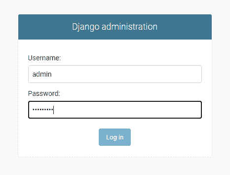

# Python Django 获取管理员密码

> 原文：<https://pythonguides.com/python-django-get-admin-password/>

[](https://sharepointsky.teachable.com/p/python-and-machine-learning-training-course)

在这个 [Django 教程](https://pythonguides.com/what-is-python-django/)中，我们将学习**如何在 Django 中创建管理员用户**以及**如何为管理员用户**重置密码。此外，我们还将在本教程中讨论以下主题。

*   如何在 Django 中创建管理员用户
*   Python Django 获取管理员密码
*   如何在 Django 中重置管理员密码

Django 是一个强大的基于 python 的 web 开发框架。当我们安装 Django 时，它默认提供一个管理界面。现在，这个管理界面使用模型的元数据来提供以模型为中心的界面。

这个接口用于管理我们的 web 应用程序的内容。此外，我们还可以根据我们的网站要求定制这个管理界面。

在本文中，我们将了解如何在 Django 中创建新的 admin 用户。

目录

[](#)

*   [如何在 Django 中创建管理员用户](#How_to_create_Admin_user_in_Django "How to create Admin user in Django ")
*   [Python Django 获取管理员密码](#Python_Django_get_admin_password "Python Django get admin password ")
*   [如何在 Django 中重置管理员密码](#How_to_reset_Admin_password_in_Django "How to reset Admin password in Django ")

## 如何在 Django 创建管理员用户

在 Django 中创建新的管理员用户非常容易。为此，我们首先需要移动到项目的根目录。在这之后，我们需要运行下面的命令。

```py
python manage.py createsuperuser
```

为了在 Django 中创建新的 admin 用户，我们使用了 `createsuperuser` 命令，这个命令可以使用 `manage.py` 实用程序来执行。

一旦我们执行给定的命令，它会提示一些字段，如用户名，电子邮件，密码，确认密码。在我们为所有这些字段输入数据后，我们的新管理员用户就创建好了。

**注意:-** 如果您在创建项目后使用这个命令，那么请确保您首先运行“ `python manage.py migrate` ”命令。然后，使用**创建超级用户**命令。

下面是上述实现的一个例子。


Example

一旦成功创建了管理员用户，我们就可以使用这些凭据来访问管理员界面。为此，我们需要启动开发服务器，在浏览器中打开“**http://127 . 0 . 0 . 1:8000/admin/**”地址。

这将打开 Django 管理登录页面。现在，我们只需要使用凭证作为管理员用户登录。



Login Page

阅读:[如何安装 Django](https://pythonguides.com/how-to-install-django/)

## Python Django 获取管理员密码

现在，在您的 Django 项目中工作时，您可能会陷入一种无法记起您的管理员凭证的情况。因此，在本节中，我们将尝试了解如何获取管理员密码。

Django 为管理界面使用自己的认证系统，这是安全框架之一。我们不能直接访问管理员密码。克服这个问题的标准解决方案之一是重置管理员密码或创建一个新的管理员用户。

现在，如果你记得你的用户名，那么我们可以很容易地改变管理员密码。这种情况将在下一节中解释。

但是，如果我们也不记得用户名呢？现在，我们可以在 Django 中访问管理员用户名。首先，我们打开 python shell。下面是打开外壳的命令。

```py
python manage.py shell
```

这将打开交互式 python 控制台。接下来，我们需要从 Django 导入用户模型。为此，我们可以使用下面的命令。

```py
from django.contrib.auth.models import User
```

一旦模型被导入，我们必须使用这个模型来获取所有用户。为此，我们将使用下面的代码。

```py
users = User.objects.all()
```

现在，我们可以通过打印刚刚创建的 users 变量轻松获得用户名。

```py
print(users)
```

下面是给定执行的一个例子。


Example

在上面的例子中， `admin` 是一个用户名。因此，一旦您获得了用户名，您就可以转到下一部分来重置您的管理员密码。

另请阅读:[如何设置 Django 项目](https://pythonguides.com/setup-django-project/)

## 如何在 Django 重置管理员密码

现在，在本节中，我们将了解如果我们知道管理员的用户名，如何重置管理员密码。

为此，我们只需移动到 manage.py 文件所在的项目根目录。然后，我们必须使用下面的语法。

```py
python manage.py changepassword <username>
```

在上面的语法中，我们使用 manage.py 实用程序来更改给定用户名的密码。在语法中，我们必须给出管理员的用户名来代替 **<用户名>** 。之后，它会要求我们为给定的用户名设置新的密码。

为了更好地理解，请考虑给定图像中显示的以下示例。


Example

在本例中，我们已经成功重置了用户名“ `admin` ”的密码。

你可能也喜欢读下面的文章。

*   [Python Django vs Flask](https://pythonguides.com/python-django-vs-flask/)
*   [Python Django 随机数](https://pythonguides.com/django-random-number/)
*   [如何获取 Django 中的用户 IP 地址](https://pythonguides.com/get-user-ip-address-in-django/)
*   [如何获取 Django 的当前时间](https://pythonguides.com/how-to-get-current-time-in-django/)
*   [Django 的应用程序和项目之间的差异](https://pythonguides.com/django-app-vs-project/)
*   [在 Django 中创建模型](https://pythonguides.com/create-model-in-django/)
*   [Python Django 过滤器](https://pythonguides.com/python-django-filter/)

因此，在本教程中，我们讨论了如何在 Django 中创建一个管理员用户，并且我们也讨论了以下主题。

*   如何在 Django 中创建管理员用户
*   Python Django 获取管理员密码
*   如何在 Django 中重置管理员密码

[Bijay Kumar](https://pythonguides.com/author/fewlines4biju/)

Python 是美国最流行的语言之一。我从事 Python 工作已经有很长时间了，我在与 Tkinter、Pandas、NumPy、Turtle、Django、Matplotlib、Tensorflow、Scipy、Scikit-Learn 等各种库合作方面拥有专业知识。我有与美国、加拿大、英国、澳大利亚、新西兰等国家的各种客户合作的经验。查看我的个人资料。

[enjoysharepoint.com/](https://enjoysharepoint.com/)[](https://www.facebook.com/fewlines4biju "Facebook")[](https://www.linkedin.com/in/fewlines4biju/ "Linkedin")[](https://twitter.com/fewlines4biju "Twitter")