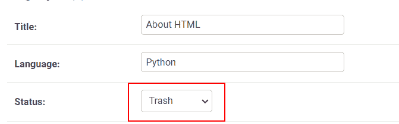
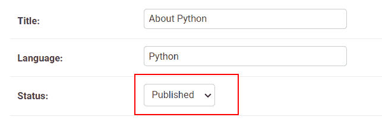
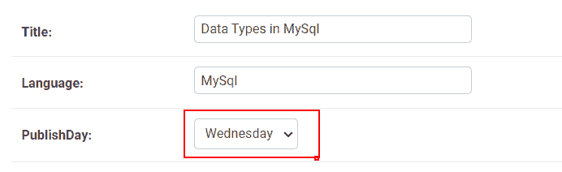
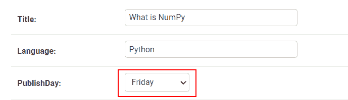
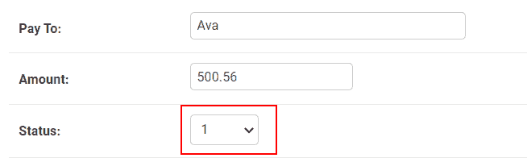
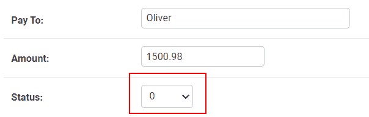
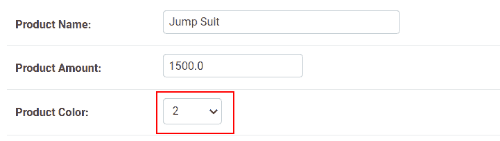
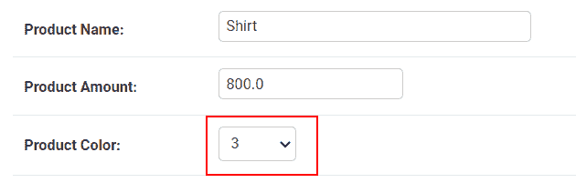

# Python Django 获取枚举选择

> 原文：<https://pythonguides.com/python-django-get-enum-choices/>

[](https://sharepointsky.teachable.com/p/python-and-machine-learning-training-course)

在这个 [Python Django 教程](https://pythonguides.com/how-to-install-django/)中，我们将了解 **Python Django get enum 选择。**我们还会看到与此相关的不同例子。这些是我们将在本教程中讨论的以下主题。

*   什么是枚举
*   为什么使用枚举
*   何时使用枚举
*   Python Django 获取枚举选择
*   Python Django 文本枚举选择
*   Python Django 整数枚举选择

目录

[](#)

*   [什么是枚举](#What_is_Enum "What is Enum")
*   [为什么使用枚举](#Why_use_Enum "Why use Enum")
*   [何时使用枚举](#When_to_use_Enum "When to use Enum")
*   [Python Django 获取枚举选择](#Python_Django_get_enum_choices "Python Django get enum choices")
    *   [将选项存储为文本](#Storing_choices_as_text "Storing choices as text")
    *   [将选择存储为整数](#Storing_choices_as_integer "Storing choices as integer")
*   [Python Django 文本枚举选择](#Python_Django_text_enum_choices "Python Django text enum choices")
*   [Python Django 整数枚举选择](#Python_Django_integer_enum_choices "Python Django integer enum choices")

## 什么是枚举

在这一节中，我们将学习什么是枚举。

Enum 代表**枚举**。枚举是链接到不同常数值的符号名称的集合。

我们的 enum 将被定义为标准 Python 库中 Enum 的子类。以下是导入枚举的语法。

```py
**# Import Library**

from enum import Enum

**# Create enum using class**

class class_name(Enum):
    # define.....
     ...... 
```

阅读: [Python Django group by](https://pythonguides.com/python-django-group-by/)

## 为什么使用枚举

在这一节，我们将学习枚举的用法。

*   我们可以使用 Python 内置的 Enum 类来构建明确的、可重用的常量，这些常量不仅可以用于模型，还可以用于其他目的。
*   将一组值中的一个值与另一个值区分开来。
*   枚举最适合用来表示一组不可变的值。
*   基本上，当我们在编译时知道所有可能的值时，就使用枚举。

## 何时使用枚举

在本节中，我们将学习何时使用 Enum。

*   如果您的代码中有枚举数据的规范源，并且希望使用规范名称而不是任意数据，那么可以随时使用它。
*   枚举对于定义一组不可变的、连接的常数值是有用的，这些常数值可能有也可能没有语义意义。
*   在给定的流程中，显示错误状态值。
*   在已定义的流程中，显示状态值。

读: [Django for 循环](https://pythonguides.com/django-for-loop/)

## Python Django 获取枚举选择

在 Django 中，我们使用枚举来定义模型中字段的选择。使用枚举类存储选择有两种方法。

*   将选项存储为文本
*   将选项存储为整数

### 将选项存储为文本

将选项存储为文本意味着使用字符作为符号。让我们看一个小例子来理清我们的理解。

**例如:**星期日为星期日，星期一为星期一，星期二为星期二，等等。

### 将选择存储为整数

将选择存储为整数意味着使用数值作为符号。让我们看一个简单的例子来更好地帮助我们。

例如:一月为 1，二月为 2，三月为 3，等等。

阅读: [Python Django 过滤器](https://pythonguides.com/python-django-filter/)

## Python Django 文本枚举选择

在这一节中，我们将学习如何在 Django 中将选项存储为文本字段。让我们看看与此相关的不同例子。

**例#1**

在这个例子中，我们将使用一个字段来标识文章的状态。我们将使用给定的状态选项，如草稿、已发布、已计划和已删除。

为执行此示例，将执行以下步骤:

首先，定义选项的类别:

```py
**# Import Library**

from enum import Enum

**# Create subclass of list**

class BlogStatus(Enum):   
    P = "Published"
    D = "Draft"
    S = "Scheduled"
    T = "Trash"
```

在这里，我们在名为 `BlogStatus` 的 `home app` 目录的 models.py 文件中创建选择的子类。

接下来，创建模型:

```py
**# Import Library**

from django.db import models

**# Create Model**

class Blog(models.Model):
    title = models.CharField(max_length=255)
    language = models.CharField(max_length=100)
    status = models.CharField(max_length=2, choices=[(tag, tag.value) for tag in BlogStatus])
```

这里，我们在应用程序的 model.py 文件中创建一个名为 `Blog` 的模型。在这个模型中，我们定义了**标题、语言和状态字段**。我们在模型的**状态**字段中使用上面定义的 `BlogStatus` 枚举类。

然后，定义管理部件，以便在管理面板中查看该表。

```py
from django.contrib import admin
from .models import Blog

class AdminBlog(admin.ModelAdmin):
    list_display = ['title', 'language', 'status']

admin.site.register(Blog,AdminBlog ) 
```

这里，我们创建名为 `AdminBlog` 的类。然后，我们创建一个我们希望在管理面板上显示的字段列表。最后，注册模型。

之后，根据您对模型所做的更改创建新的迁移。该命令如下所示:

```py
python manage.py makemigrations 
```

然后，应用和重新应用迁移。该命令如下所示:

```py
python manage.py migrate
```

然后，打开 shell 编写一个 queryset。打开外壳的命令如下:

```py
python manage.py shell
```

之后，插入并保存模型的字段。

```py
**# Import Libraries**

from home.models import Blog
from home.models import BlogStatus

**# Insert and Save Data Field** 

a = Blog.objects.create(title="About Python",  language="Python", status=BlogStatus.P)

a.save()

b = Blog.objects.create(title="Install Python", language="Python", status=BlogStatus.S)

b.save()

c = Blog.objects.create(title="Data Types in Python", language="Python", status=BlogStatus.D)

c.save()

d = Blog.objects.create(title="About HTML", language="Python", status=BlogStatus.T)

d.save() 
```

现在，已经成功地创建了带有数据字段的模型。

现在，看看数据在管理面板中的样子。



Python Django text enum choices



Python Django get enum choices

现在，从上面的输出中，您可以清楚地看到，这里我们将状态作为文本枚举选择符号进行传递。但是，它会自动在博客模型中保存完整的状态名称。

**例 2**

在这个例子中，我们将使用一个字段来标识文章的发布日期。我们将使用给定的发布日选择，如星期日、星期一、星期二、星期三、星期四、星期五和星期六。为执行此示例，将执行以下步骤:

首先，定义选项的类别:

```py
**# Import Library**

from enum import Enum

**# Create subclass of list**

class PostPublished(Enum):   
    Sun = "Sunday"
    Mon = "Monday"
    Tue = "Tuesday"
    Wed = "Wednesday"
    Thur = "Thursday"
    Fri = "Friday"
    Sat = "Saturday"
```

这里，我们在 MyApp 应用程序目录的 models.py 文件中创建名为 `PostPublished` 的选择的子类。

接下来，创建模型:

```py
**# Import Library**

from django.db import models

**# Create Model**

class Post(models.Model):
    title = models.CharField(max_length=255)
    language = models.CharField(max_length=100)
    PublishDay = models.CharField(max_length=4, choices=[(tag, tag.value) for tag in PostPublished])
```

这里，我们在 MyApp 应用程序的 model.py 文件中创建一个名为 `Post` 的模型。在这个模型中，我们定义了**标题、语言和发布日字段**。我们在模型的 `PublishDay` 字段中使用上面定义的 `PostPublished` enum 类。

然后，定义 admin 部分以查看 admin 中的表。

```py
from django.contrib import admin
from .models import Post

class AdminPost(admin.ModelAdmin):
    list_display = ['title', 'language', 'PublishDay']

admin.site.register(Post,AdminPost) 
```

这里，我们创建了名为 `AdminPost` 的类。然后，我们创建一个我们希望在管理面板上显示的字段列表。最后，注册模型。

之后，创建新的迁移并应用它们。这些命令如下所示:

```py
**# Create migrations**

python manage.py makemigrations

**# Apply Migrations**

python manage.py migrate
```

然后，打开 shell 编写一个 queryset 来插入和保存模型的字段。

```py
**# Import Libraries**

from MyApp.models import Post
from MyApp.models import PostPublished

**# Insert and Save Data Field** 

a = Post.objects.create(title="What is NumPy",  language="Python", PublishDay=PostPublished.Fri)

a.save()

b = Post.objects.create(title="Insert Data in MongoDB", language="MongoDB", PublishDay=PostPublished.Sun)

b.save()

c = Post.objects.create(title="Data Types in MySql", language="MySql", PublsihDay=PostPublished.Wed)

c.save()

d = Post.objects.create(title="About HTML", language="HTML", PublishDay=PostPublished.Thur)

d.save() 
```

现在，数据字段已成功添加到模型中。

现在，看看数据在管理面板中的样子。



Python Django get enum choices



Python Django get enum choices

现在，正如您在输出中看到的，我们将发布日期作为文本枚举选择符号传递。但是，它会自动在发布模型中保留完整的发布日期名称。

阅读:[如何在 Django 中创建模型](https://pythonguides.com/create-model-in-django/)

## Python Django 整数枚举选择

在这一节中，我们将学习如何在 Django 中将选择存储为一个整数字段。因此，我们可以使用**枚举来获得一个基于整数值的枚举。IntEnum()** 法。让我们看看与此相关的不同例子。

**例#1**

在本例中，我们将使用一个字段来标识事务的状态。我们将使用给定的状态选项，如成功、待定和失败。

为执行此示例，将执行以下步骤:

首先，定义选项的类别:

```py
**# Import Library**

from enum import IntEnum

**# Create subclass**

class TransactionStatus(IntEnum):
    Successful = 1
    Pending = 2
    Failed = 0
```

在 transaction app 目录的 models.py 文件中，我们创建了名为 `TransactionStatus` 的子类。

接下来，创建模型:

```py
**# Import Library**

from django.db import models

**# Create Model** 
class AtmTransaction(models.Model):
    Pay_To = models.CharField(max_length=150)
    Amount = models.FloatField(max_length=5)
    status = models.CharField(max_length=25, choices=[(x, x.value) for x in TransactionStatus]) 
```

这里，我们在应用程序的 model.py 文件中创建一个名为 `AtmTransaction` 的模型。在这个模型中，我们定义了**支付对象、金额和状态**。我们在模型的状态字段中使用上面定义的 `TransactionStatus` enum 类。

然后，在应用程序的 admin.py 文件中定义 admin 部分，以指定管理面板中模型的视图。

```py
from django.contrib import admin
from .models import AtmTransaction

class AdminAtmTransaction(admin.ModelAdmin):
    list_display = ['Pay_To', 'Amount', 'status']

admin.site.register(AtmTransaction,AdminAtmTransaction) 
```

这里，我们创建名为 `AdminAtmTransaction` 的类。然后，我们创建一个我们希望在管理面板上显示的字段列表。最后，注册模型。

之后，创建新的迁移并应用它们。

然后，打开 shell 编写一个 queryset 来插入和保存模型的字段。

```py
**# Import Libraries**

from transaction.models import AtmTransaction
from transaction.models import TransactionStatus

**# Insert and Save Data Field** 

a = AtmTransaction.objects.create(Pay_To="Ava", Amount=500, status=TransactionStatus.Successful)

a.save()

b = AtmTransaction.objects.create(Pay_To="Oliver", Amount=1500.98, status=TransactionStatus.Failed)

b.save()

c = AtmTransaction.objects.create(Pay_To="Charlotte", Amount=2500.28, status=TransactionStatus.Pending)

c.save() 
```

DataFeilds 已成功添加到 AtmTransaction 模型中。

现在，看看数据在管理面板中的样子。



Enum Status *1 means Successfully*



Enum Status *0 means Failed*

现在，正如您在输出中看到的，我们将事务状态作为状态的完整名称进行传递。但是，它会自动将状态保存到 `AtmTransaction` 模型中的 Int Enum。

**例 2**

在本例中，我们将使用一个字段来标识颜色的可用性。我们将使用给定的可选颜色，如红色、绿色、黑色和蓝色。

为执行此示例，将执行以下步骤:

首先，定义选项的类别:

```py
**# Import Library**

from enum import IntEnum

**# Create subclass**

class ColorAvailability(IntEnum):
    Red = 1
    Green = 2
    Black = 3
    Blue = 4
```

在 cart 应用程序目录的 models.py 文件中，我们创建了名为 `ColorAvailability` 的子类。

接下来，创建模型:

```py
**# Import Library**

from django.db import models

**# Create Model** 
class Product(models.Model):
    Product_Name = models.CharField(max_length=150)
    Product_Amount = models.FloatField(max_length=5)
    Product_Color = models.CharField(max_length=25, choices=[(x, x.value) for x in ColorAvailability]) 
```

这里，我们在应用程序的 model.py 文件中创建一个名为 `Product` 的模型。在这个模型中，我们定义了**产品名称、产品数量和产品颜色**。我们在模型的 `Product_Color` 字段中使用上面定义的 `ColorAvailability` 枚举类。

然后，在应用程序的 admin.py 文件中定义 admin 部分，以指定管理面板中模型的视图。

```py
from django.contrib import admin
from .models import Product

class AdminProduct(admin.ModelAdmin):
    list_display = ['Product_Name', 'Product_Amount', 'Product_Color']

admin.site.register(Product,AdminProduct) 
```

这里，我们创建名为 `AdminProduct` 的类。然后，我们创建一个我们希望在管理面板上显示的字段列表。最后，注册模型。

之后，创建新的迁移并应用它们。

然后，打开 shell 编写一个 queryset 来插入和保存模型的字段。

```py
**# Import Libraries**

from cart.models import Product
from cart.models import ColorAvailability

**# Insert and Save Data Field** 

a = Product.objects.create(Product_Name="T-Shirt", Product_Amount=200.00, Product_Color=ColorAvailability.Red)

a.save()

b = Product.objects.create(Product_Name="Jump Suit", Amount=200.00, Product_Color=ColorAvailability.Green)

b.save()

c = Product.objects.create(Product_Name="Shirt", Product_Amount=800.00, Product_Color=ColorAvailability.Black)

c.save() 
```

数据标签已成功添加到**产品**模型中。

现在，看看数据在管理面板中的样子。



Product_Color *2 means Green*



Product_Color 3 means Black

另外，看看更多的 Python Django 教程。

*   [Python Django 获取管理员密码](https://pythonguides.com/python-django-get-admin-password/)
*   [Python Django 格式日期](https://pythonguides.com/python-django-format-date/)
*   [如何删除 Django 中的会话属性](https://pythonguides.com/delete-session-property-in-django/)
*   [Python Django vs 金字塔](https://pythonguides.com/python-django-vs-pyramid/)
*   [在 Python Django 中登录系统](https://pythonguides.com/login-system-in-python-django/)
*   [Python Django MySQL CRUD](https://pythonguides.com/python-django-mysql-crud/)
*   [Python Django 表单验证](https://pythonguides.com/django-form-validation/)
*   [Python 改 Django 版本](https://pythonguides.com/python-change-django-version/)

在这个 Python Django 教程中，我们讨论了 **Python Django get enum 选择**。此外，我们还将讨论以下主题列表。

*   什么是枚举
*   为什么使用枚举
*   何时使用枚举
*   Python Django 获取枚举选择
*   Python Django 文本枚举选择
*   Python Django 整数枚举选择

[Bijay Kumar](https://pythonguides.com/author/fewlines4biju/)

Python 是美国最流行的语言之一。我从事 Python 工作已经有很长时间了，我在与 Tkinter、Pandas、NumPy、Turtle、Django、Matplotlib、Tensorflow、Scipy、Scikit-Learn 等各种库合作方面拥有专业知识。我有与美国、加拿大、英国、澳大利亚、新西兰等国家的各种客户合作的经验。查看我的个人资料。

[enjoysharepoint.com/](https://enjoysharepoint.com/)[](https://www.facebook.com/fewlines4biju "Facebook")[](https://www.linkedin.com/in/fewlines4biju/ "Linkedin")[](https://twitter.com/fewlines4biju "Twitter")