# python Django get——您需要知道的一切

> 原文：<https://pythonguides.com/python-django-get/>

[](https://sharepointsky.teachable.com/p/python-and-machine-learning-training-course)

在本 [Django 教程](https://pythonguides.com/what-is-python-django/)中，我们将学习“ `Python Django get` ”。我们还将涉及一些主题，如-`Python Django get post data`，`Python Django get _ or _ create`等。这是我们将在本教程中讨论的主题的完整列表。

*   Python Django get
*   Python Django 获取请求参数
*   Python Django get_or_create
*   Python Django 获取发布数据
*   Python Django 获取 URL 参数
*   Python Django 获取设置变量
*   Python Django 获取当前 URL
*   Python Django 获取用户模型
*   Python Django get _ 用户名
*   决哥 Python get URL
*   Python Django request.user.id
*   Django Python 获取用户
*   Django Python 获取用户 id

目录

[](#)

*   [Python Django get](#Python_Django_get "Python Django get")
*   [Python Django get _ or _ create](#Python_Django_get_or_create "Python Django get_or_create ")
*   [Python Django get_username](#Python_Django_get_username "Python Django get_username ")
*   [Django Python 获取用户](#Django_Python_get_user "Django Python get user")
*   [Django Python 获取用户 id](#Django_Python_get_user_id "Django Python get user id ")
*   [Python Django 获取当前 URL](#Python_Django_get_current_URL "Python Django get current URL")
*   [Python Django 获取 URL 参数](#Python_Django_get_URL_parameters "Python Django get URL parameters ")
    *   [Python Django 获取请求参数](#Python_Django_get_request_parameters "Python Django get request parameters")
*   [Python Django 获取发布数据](#Python_Django_get_post_data "Python Django get post data ")
*   [Python Django 获取 _ 用户 _ 模型](#Python_Django_get_user_model "Python Django get_user_model ")
*   [Python Django 获取设置变量](#Python_Django_get_settings_variable "Python Django get settings variable ")

## Python Django get

在我们之前的一个教程中，我们讨论了“**[Python Django filter](https://pythonguides.com/python-django-filter/)**”。其中，我们讨论了如何使用 `filter()` 、 `exclude()` 等不同的方法从完整的查询集中提取子集。

现在，这些方法返回一组对象作为结果。现在，即使 QuerySet 中只有一个对象，它们也会返回带有一个对象的 QuerySet。

因此在这一节中，我们将学习如何从 QuerySet 中获取单个对象，对于这个实现，我们将使用 Django 中的 `get()` 方法。

Django 中的 `get()` 方法返回一个匹配给定查找参数的对象。当使用 `get()` 时，我们应该总是使用唯一的查找，比如主键或唯一约束中的字段。

让我们举一个简单的例子来说明它的执行。

```py
**(InteractiveConsole)
>>> 
>>>** from myApp.models import Customer
**>>> 
>>>** q = Customer.objects.get(pk=2)   
**>>> 
>>>** print(q)
```

*   在上面的例子中，我们使用了**客户**模型，为了执行，我们使用了 Django shell。
*   因此，首先，我们从应用程序中导入了**客户**模型。在这之后，我们将创建一个**查询集**，但是这次我们使用的是 `get()` 方法。
*   并且在 `get()` 方法中，我们定义了 `pk=2` 作为查找参数。所以这个 QuerySet 将返回一个主键定义为 2 的对象。

现在，如果我们使用 `print()` 语句来打印 Queryset，它将返回对象。

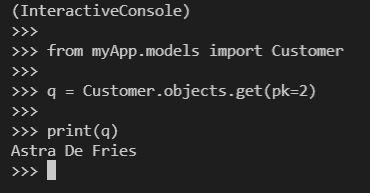

Example

现在，我们应该总是小心地使用 `get()` ，就好像 QuerySet 没有找到任何对象，它将返回一个**模型。不存在**异常。如果 QuerySet 找到不止一个对象，它将返回**模型。多个对象返回了**异常。这两个错误都显示在下面的示例中。

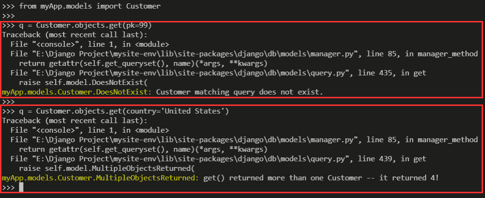

Example

阅读 [Python Django vs Flask](https://pythonguides.com/python-django-vs-flask/)

## Python Django get _ or _ create

现在，无论我们在哪里使用 Django 开发数据驱动的应用程序，我们都必须确保应用程序模型中没有重复的记录。

通常，首先，我们需要编写一个逻辑来检查对象的存在，然后，我们需要根据它的存在来保存对象。但是，Django 通过提供一个方法简化了这个任务。

在 Django 中，我们可以使用 `get_or_create()` 方法来检查一个对象的存在，并根据它的存在创建一个对象。该方法有两个参数，第一个是“**默认值**，用于设置字段的默认值。

第二个是“ `kwargs` ”，用于定义关键字参数。这个方法基于“ `kwargs` 参数检查对象。

现在，这个方法返回一个元组 **(object，created)** ，其中“**对象**是一个创建或检索的对象。而“**已创建**”是基于对象是否被创建的事实的布尔值。

因此，每当一个关键字参数被传递给 `get_or_create()` 方法时(默认情况除外)。它将调用 `get()` 方法来检索一个对象，如果找到了该对象，该方法将返回一个元组中的对象名和 False 值。让我们举一个实现的例子。

```py
**(InteractiveConsole)
>>> 
>>>** from myApp.models import Customer
**>>> 
>>>** q = Customer.objects.get_or_create(
... name='Cortney Davidsson',
... country='United Kingdom'
... )
**>>> 
>>>** print(q)
```

在这个例子中，我们使用 `get_or_create()` 方法根据给定的名称和国家值创建或检索一个对象。现在，如果对象已经在数据库中，那么它将返回一个元组作为 **(object_name，False)** 。其中**对象名称**是对象的名称，**假**表示对象未被创建。

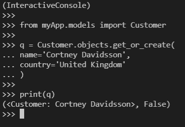

Example

当这个方法无法用给定的参数检索对象时，它会用给定的值创建一个新的对象。并且创建后会返回元组中的对象名和 `True` 。让我们看一个使用 `get_or_create()` 方法创建一个新对象的例子。

```py
(InteractiveConsole)
>>>
>>> from myApp.models import Customer
>>>
>>> q = Customer.objects.get_or_create(
... name='Randy Briston',
... address='93 Coleman Street',
... country='United States',
... city='Houston'
... )
>>> 
>>> print(q)
```

在这个例子中，我们在 `get_or_create()` 方法中传递了一个新对象的值。现在，由于该方法将无法获取对象，它将使用给定的值创建一个新的对象。下面是这个例子的输出。

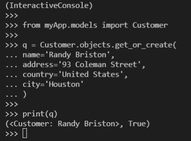

Example

阅读[如何安装 Django](https://pythonguides.com/how-to-install-django/)

## Python Django get _ 用户名

在本节中，我们将学习如何使用 Django 中的 `get_username()` 方法来获取当前登录用户的用户名。

因此， `get_username()` 方法可用于**用户**模型类，它返回用户的用户名。并且也建议使用这个方法，而不是直接使用 username 属性。

让我们借助一个例子来理解如何使用这个 `get_username()` 方法。在这个例子中，我们将演示如何在 Django 模板中打印用户名。

首先，我们将创建一个基于函数的视图来获取用户名，为了获取用户名，我们将使用这个方法。下面是 `views.py` 文件的代码。

```py
from django.shortcuts import render

def index(request):
    current_user = request.user.get_username()
    return render(request, 'index.html',{'user':current_user})
```

在上面的代码中，我们定义了一个名为 `index` 的视图。在视图中，我们使用`request . user . get _ username()`方法将用户名值存储在 `current_user` 变量中。之后，我们将变量发送到 index.html 页面。

接下来，我们将把下面的代码添加到`index.html`页面。

```py
<!DOCTYPE html>
<html lang="en">
<head>
    <meta charset="UTF-8">
    <meta http-equiv="X-UA-Compatible" content="IE=edge">
    <meta name="viewport" content="width=device-width, initial-scale=1.0">
    <title>Python Guides</title>
</head>
<style>
    p{
        text-align: center;
    }
    span{
        font-weight: bolder;
        font-size: larger;
    }
</style>
<body>
   <p><span>Username:</span> {{user}}</p> 
</body>
</html>
```

在`index.html`页面上，我们将简单地使用双花括号中的变量来打印用户名。这是这个例子的最终结果。

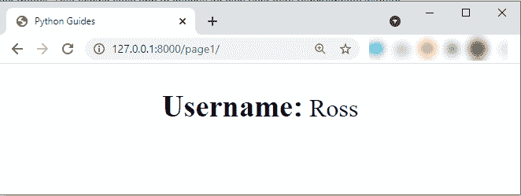

Final Result

阅读[如何设置 Django 项目](https://pythonguides.com/setup-django-project/)

## Django Python 获取用户

在本节中，我们将学习如何在 Django 中获取用户数据。我们还将了解如何使用数据在模板中显示。

默认情况下，Django 提供了一个认证系统，我们可以很容易地扩展这个系统，在我们的应用程序中使用它。它还提供了一个默认模型来存储与注册用户相关的数据。模型的名称是**用户**，它的一些字段如下。

*   **用户名:**存储用户的用户名
*   **名字:**存储用户的名字
*   **姓氏:**存储用户的姓氏
*   **电子邮件:**存储用户的电子邮件地址
*   **密码:**用于存储密码的哈希，以及关于密码的元数据。
*   **组:**它存储了与**组**模型的多对多关系。
*   **last_login:** 存储与用户上次登录相关的日期时间值。
*   **date_joined:** 它还存储一个 DateTime 值，表示创建用户的日期和时间。

接下来，我们将了解如何在 Django 中获取这些值，并在 Django 模板中使用它们。首先，我们需要创建一个视图来获取这些值并将它们返回给模板。

这里有一个 `view.py` 文件的例子，我们在这里获取这些值，并将它们发送到 index.html 页面**。**

```py
from django.shortcuts import render

def index(request):
    user = {
        'fullname' : request.user.get_full_name(),
        'firstname' : request.user.first_name,
        'lastname' : request.user.last_name,
        'email' : request.user.email,
        'last_login': request.user.last_login,
        'account_created': request.user.date_joined
    }
    return render(request, 'index.html',{'user':user})
```

在上面的代码中，我们创建了一个名为“ `index` ”的基于函数的视图。在这个视图中，我们创建了一个包含多个键和值的字典。现在，与当前登录用户相关的数据在**请求**对象中。

因此，我们使用 `request.user` 来获取与当前登录用户相关的数据。这是我们正在获取的数据列表。

*   `request . user . get _ full _ name()`返回用户的全名。
*   `request.user.first_name` 从**用户**模型返回 `first_name` 值。
*   `request.user.last_name` 从**用户**模型返回**姓氏**字段。
*   `request.user.email` 从**用户**模型返回**电子邮件**字段。
*   `request.user.last_login` 从**用户**模型返回 `last_login` 字段。
*   `request.user.date_joined` 从**用户**模型返回 `date_joined` 字段。

最后，我们将字典返回到 index.html 页面。并且在 index.html 的**页面中，我们可以使用这些值来显示它们。这里是 index.html 的**页面的代码。****

```py
<!DOCTYPE html>
<html lang="en">

<head>
    <meta charset="UTF-8">
    <meta http-equiv="X-UA-Compatible" content="IE=edge">
    <meta name="viewport" content="width=device-width, initial-scale=1.0">
    <link rel="stylesheet" href="https://maxcdn.bootstrapcdn.com/bootstrap/4.5.2/css/bootstrap.min.css">
    <script src="https://ajax.googleapis.com/ajax/libs/jquery/3.5.1/jquery.min.js"></script>
    <script src="https://cdnjs.cloudflare.com/ajax/libs/popper.js/1.16.0/umd/popper.min.js"></script>
    <script src="https://maxcdn.bootstrapcdn.com/bootstrap/4.5.2/js/bootstrap.min.js"></script>
    <title>Python Guides</title>
</head>

<body>
    <br>
    <div class="container w-50">
        <div class="card bg-light text-dark">
            <h5 class="card-header bg-dark text-light">User Info</h5>
            <div class="card-body">
                <div class="card-text"><b>Full Name:</b> {{user.fullname}}</div>
                <div class="card-text"><b>First Name:</b> {{user.firstname}}</div>
                <div class="card-text"><b>Last Name:</b> {{user.lastname}}</div>
                <div class="card-text"><b>User Email:</b> {{user.email}}></div>
                <div class="card-text"><b>Last Login:</b> {{user.last_login}}</div>
                <div class="card-text"><b>Account Created On:</b> {{user.account_created}}</div>
            </div>
        </div>
    </div>
</body>

</html>
```

在模板中，我们使用 `Bootstrap` 类来创建信息卡。在卡片中，我们使用字典值来获得所需的结果。现在，如果我们移动到映射的 URL，我们将得到下面的结果。

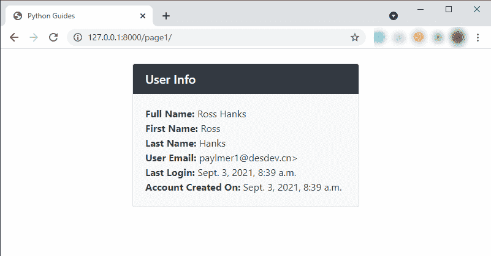

Final Result

阅读 [Python Django 获取管理员密码](https://pythonguides.com/python-django-get-admin-password/)

## Django Python 获取用户 id

对于**用户**模型中的每个条目，Django 会自动为该条目分配一个主键 id。现在，在本节中，我们将学习如何获取用户的主键 id。

为了获取用户 id，我们将使用 `request.user` 对象，因为它返回与当前登录用户相关的信息。要获取 id，我们只需使用 `request.user.id` ，因为它将返回当前用户的用户 id。这里是这个例子的 `viewa.py` 文件。

```py
from django.shortcuts import render

def index(request):
   user_id = request.user.id
   return render(request, 'index.html',{'user_id':user_id})
```

在上面的代码中，我们使用 `request.user.id` 将用户 id 的值存储在 `user_id` 变量中。在这之后，我们将变量发送到 index.html 的**页面，在那里我们用它来获取 id。**

## Python Django 获取当前网址

在这一节中，我们将讨论如何在 Django 模板中获取页面的当前 URL。

现在，完整的 URL 由 3 个东西组成，第一个是**域**，第二个是**路径**，第三个是**查询字符串**。我们将看到如何在 Django 中获取 URL 的这些部分。

在 Django 中，我们可以使用一些模板标签轻松获得 URL。为此，让我们举个例子。我们在 `views.py` 文件中添加了以下代码。

```py
from django.shortcuts import render

def index(request):
   return render(request, 'index.html')

def home(request):
   return render(request, 'home.html')
```

在上面的代码中，我们简单地创建了两个引用 HTML 页面的基于函数的视图。接下来，为了进行演示，我们将使用带有以下代码的`home.html`页面。

**注意** :为了说明 path 和 querystring 的区别，我们用 URL 传递了一个 querystring 到主页。

```py
<!DOCTYPE html>
<html lang="en">

<head>
    <meta charset="UTF-8">
    <meta http-equiv="X-UA-Compatible" content="IE=edge">
    <meta name="viewport" content="width=device-width, initial-scale=1.0">
    <link rel="stylesheet" href="https://maxcdn.bootstrapcdn.com/bootstrap/4.5.2/css/bootstrap.min.css">
    <script src="https://ajax.googleapis.com/ajax/libs/jquery/3.5.1/jquery.min.js"></script>
    <script src="https://cdnjs.cloudflare.com/ajax/libs/popper.js/1.16.0/umd/popper.min.js"></script>
    <script src="https://maxcdn.bootstrapcdn.com/bootstrap/4.5.2/js/bootstrap.min.js"></script>
    <title>Python Guides</title>
</head>

<body>
    <br>
    <div class="container w-50">
        <div class="card bg-light text-dark">
            <h5 class="card-header bg-dark text-light">Python Django get current URL</h5>
            <div class="card-body">
                <div class="card-text"><b>Current Page Path: </b>{{request.path}}</div>
                <div class="card-text"><b>Current Page Path with Querystring: </b>{{request.get_full_path}}</div>
                <div class="card-text"><b>Current Domain, Path and Querystring: </b>{{request.build_absolute_uri}}</div>
            </div>
        </div>
    </div>
</body>

</html>
```

现在，在《家居时代》中，我们使用了 3 个标签，与这些标签相关的信息如下。

*   **{{ request.path }}:** 这将返回当前页面路径。
*   **{ { request . get _ full _ path } }**:这将使用 querystring 返回当前页面路径。
*   **{ { request . build _ absolute _ uri } }**:这样会一起返回域、页面路径和 querystring。

现在，如果我们打开主页，我们将得到以下结果。

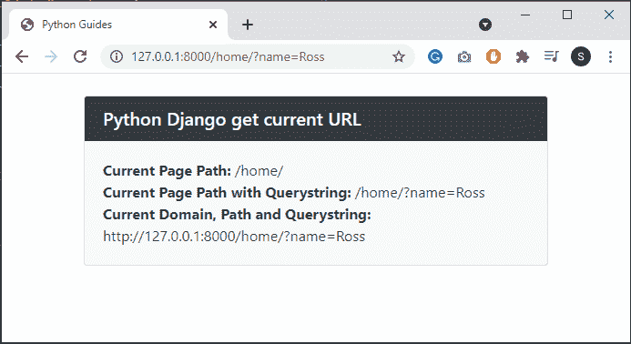

Final Result

在 Django 中阅读[应用程序和项目之间的差异](https://pythonguides.com/django-app-vs-project/)

## Python Django 获取 URL 参数

在上一节中，我们讨论了如何获取 URL 的不同部分。现在，在这一部分，我们将讨论如何在 Django 中获取 URL 参数。我们还将看到如何在您的模板中显示它们。但是，在这之前，我们应该了解一下**得到**的方法。

`GET` 是 Django 中的一个 HTTP 方法，它将数据封装在一个字符串中，并利用它来构造一个 URL。URL 包括数据密钥和值以及数据必须传输到的地址。

### Python Django 获取请求参数

在 Django 中，要获得 URL 参数，我们必须使用**请求。GET** 方法。因此，首先，我们将使用这个方法来获取参数值并将其存储在变量中。之后，我们将变量返回到一个 HTML 页面。让我们借助一个例子来理解这一点。

对于这个例子，首先，我们将使用索引页面，它有到主页的链接。对于主页 URL，它也将传递一条消息作为参数。

现在，在主页上，我们将打印参数消息。下面是 `views.py` 文件的代码。

```py
from django.shortcuts import render

def index(request):
   return render(request, 'index.html')

def home(request):
   msg=request.GET.get('message')
   return render(request, 'home.html',{'msg':msg }) 
```

对于主页的视图，我们使用的是**请求。GET.get('message')** 方法。并且它会将“**消息**的值存储在“**消息**变量中。在这之后，我们只是将“**消息**返回到`home.html`页面。

这里是 index.html 页面的代码。

```py
<!DOCTYPE html>
<html lang="en">

<head>
    <meta charset="UTF-8">
    <meta http-equiv="X-UA-Compatible" content="IE=edge">
    <meta name="viewport" content="width=device-width, initial-scale=1.0">
    <link rel="stylesheet" href="https://maxcdn.bootstrapcdn.com/bootstrap/4.5.2/css/bootstrap.min.css">
    <script src="https://ajax.googleapis.com/ajax/libs/jquery/3.5.1/jquery.min.js"></script>
    <script src="https://cdnjs.cloudflare.com/ajax/libs/popper.js/1.16.0/umd/popper.min.js"></script>
    <script src="https://maxcdn.bootstrapcdn.com/bootstrap/4.5.2/js/bootstrap.min.js"></script>
    <title>Python Guides</title>
</head>

<body>
    <br>
    <div class="container w-50">
        <div class="card bg-light text-dark">
            <h5 class="card-header bg-dark text-light">Index Page</h5>
            <div class="card-body">
                <div class="card-text"><a href="?message=Hi Welcome to Python Guides">Link To Home Page</a></div>
            </div>
        </div>
    </div>
</body>

</html>
```

在这个页面上，我们有一个到主页的链接，通过这个 URL，我们传递了一个消息。

现在，这里是 home.html 页面的代码。

```py
<!DOCTYPE html>
<html lang="en">

<head>
    <meta charset="UTF-8">
    <meta http-equiv="X-UA-Compatible" content="IE=edge">
    <meta name="viewport" content="width=device-width, initial-scale=1.0">
    <link rel="stylesheet" href="https://maxcdn.bootstrapcdn.com/bootstrap/4.5.2/css/bootstrap.min.css">
    <script src="https://ajax.googleapis.com/ajax/libs/jquery/3.5.1/jquery.min.js"></script>
    <script src="https://cdnjs.cloudflare.com/ajax/libs/popper.js/1.16.0/umd/popper.min.js"></script>
    <script src="https://maxcdn.bootstrapcdn.com/bootstrap/4.5.2/js/bootstrap.min.js"></script>
    <title>Python Guides</title>
</head>

<body>
    <br>
    <div class="container">
        <div class="card bg-light text-dark">
            <h5 class="card-header bg-dark text-light">Home Page</h5>
            <div class="card-body">
                <div class="card-text"><b>URL parameters: </b>{{msg}}</div>
            </div>
        </div>
    </div>
</body>

</html>
```

在主页上，我们简单地使用" `msg` "变量来显示消息值。最终，我们得到了如下结果。

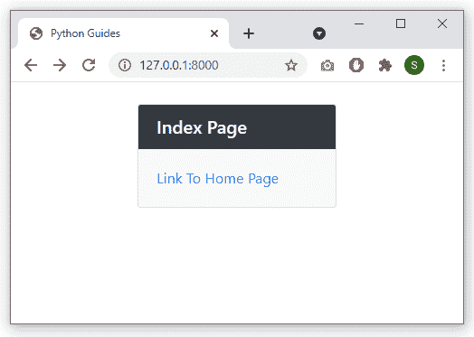

`index.html` page

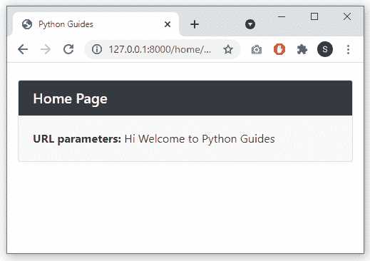

`home.html` page

## Python Django 获取帖子数据

在这一节中，我们将讨论如何在 Django 中获取 `POST` 数据。但在此之前，我们要知道 Django 中什么是 `POST` 什么是 `POST` 数据。

`POST` 也是一个 `HTTP` 方法，用于处理 Django 中的表单。 `POST` 方法收集表单数据，对其进行加密以便传输，将其传输到服务器，然后接收其响应。

现在，为了实现这个任务，我们将创建一个表单来保存模型中的一些数据。表单将使用 `POST` 方法，我们将尝试在服务器端获取表单数据。

因此，首先，我们将在`home.html`页面上创建一个表单，这是实现的代码。

```py
<!DOCTYPE html>
<html lang="en">

<head>
    <meta charset="UTF-8">
    <meta http-equiv="X-UA-Compatible" content="IE=edge">
    <meta name="viewport" content="width=device-width, initial-scale=1.0">
    <link rel="stylesheet" href="https://maxcdn.bootstrapcdn.com/bootstrap/4.5.2/css/bootstrap.min.css">
    <script src="https://ajax.googleapis.com/ajax/libs/jquery/3.5.1/jquery.min.js"></script>
    <script src="https://cdnjs.cloudflare.com/ajax/libs/popper.js/1.16.0/umd/popper.min.js"></script>
    <script src="https://maxcdn.bootstrapcdn.com/bootstrap/4.5.2/js/bootstrap.min.js"></script>
    <title>Python Guides</title>
</head>

<body>
    <br>
    <div class="container w-50">

        <form action="success/" method="POST">
            
            <div class="form-group">
                <label for="first_name">First Name</label>
                <input type="text" class="form-control" id="first_name" placeholder="Enter First Name">
            </div>
            <div class="form-group">
                <label for="last_name">Last Name</label>
                <input type="text" class="form-control" id="last_name" placeholder="Enter Last Name">
            </div>
            <div class="form-group">
                <label for="age">Age</label>
                <input type="number" class="form-control" id="age" placeholder="Enter Your Age">
            </div>
            <button type="submit" class="btn btn-primary">Submit</button>
        </form>
    </div>
</body>

</html>
```

在上面的页面中，我们用 `POST` 方法创建了一个表单，表单中有 3 个字段。此外，我们使用 Bootstrap 框架及其类来构建这个表单。

接下来，我们将为这个`home.html`页面创建一个视图，这里是 `views.py` 文件的代码。

```py
from django.shortcuts import render
from myApp.models import Students

def home(request):
   if request.method=='POST':
       first_name = request.POST.get("first_name")
       last_name = request.POST.get("last_name")
       age = request.POST.get("age")
       data = Students(first_name,last_name,age)
       data.save()

   return render(request, 'home.html')

def success(request):
    return render(request, 'success.html')
```

*   因此，在主视图中，我们使用了**请求。POST.get()** 方法获取**名字**、**姓氏、**和**年龄**字段的值。
*   然后，我们将这些值存储到变量中。之后，我们使用这些变量为**学生**模型创建一个对象。
*   最后，我们使用 save()方法将数据存储在数据库中。

现在，我们还创建了一个成功页面，因此如果数据存储成功，将会打开成功页面。

现在，运行开发服务器，打开主页并提交记录。

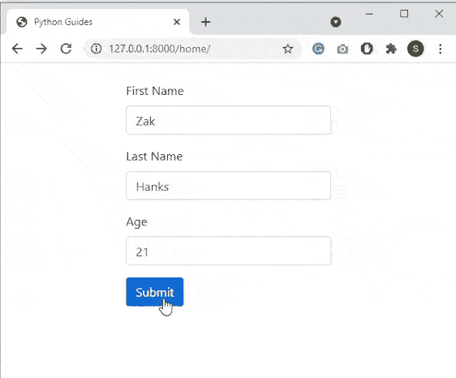

Example

## Python Django get _ user _ model

在 Django 中，我们有一个与名为 `AUTH_USER_MODEL` 的**用户**模型相关的设置。该设置代表用于**用户**的型号。

现在，如果这个 `AUTH_USER_MODEL` 设置被更改为某个其他用户模型，那么我们就不能直接使用**用户**模型类。

因此，我们可以使用 `get_user_model()` 方法，而不是引用**用户**模型类。 `get_user_model()` 方法返回当前活动的用户模型。我们举个例子，了解一下如何使用这个 `get_user_model()` 方法。

同样，对于这个执行，我们将使用 Django shell。下面是执行示例。

```py
**(InteractiveConsole)
>>> 
>>>** from django.contrib.auth import get_user_model
**>>> 
>>>** get_user_model()
**<class 'django.contrib.auth.models.User'>**
**>>>
>>>** user = get_user_model()
**>>>** user.objects.all()      
**<QuerySet [<User: Ross>, <User: Margit>, <User: Misty>, <User: Mycah>, <User: Scotti>]>**
```

在这个例子中，我们首先从 `django.contrib.auth` 导入了 `get_user_model()` 方法。在这之后，我们简单地打印了方法来显示它所使用的模型类。

由于我们没有改变 `AUTH_USER_MODEL` 的设置，它使用的是**用户**模型。接下来，我们使用这个方法创建一个包含所有对象的查询集。最后，我们打印了查询集。

下面是这次执行的截图。

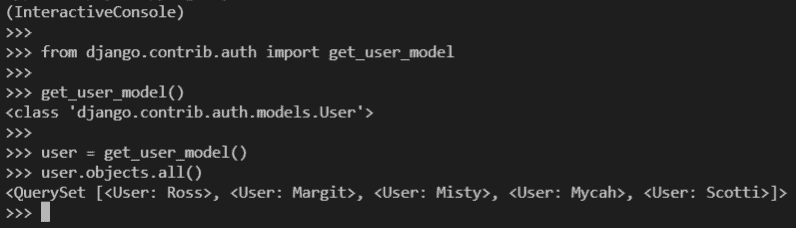

Example Execution

阅读: [Python Django group by](https://pythonguides.com/python-django-group-by/)

## Python Django 获取设置变量

在 Django 中，我们有一个 `settings.py` 文件，这个文件包含了与我们的 Django 安装相关的所有配置。这个 `settings.py` 文件本身就是一个带有模块级变量的 python 模块。

现在，在这一节中，我们将学习如何在 Django 中获取这些设置变量的值。

对于这个任务，首先，我们需要导入**设置**模块，然后，我们可以使用**设置访问变量。变量**。其中**变量**是设置变量的名称，并且应该总是大写字母。

让我们通过实现来理解这个实现，为了实现，我们使用 Django shell。

```py
**(InteractiveConsole)
>>> 
>>>** from django.conf import settings
**>>> 
>>>** print('Time Zone: ',settings.TIME_ZONE)
**Time Zone:  UTC**
**>>>
>>>** print('Language Code: ',settings.LANGUAGE_CODE)
**Language Code:  en-us**
**>>>**
```

在这个例子中，首先，我们从 `django.conf` 中导入了**设置**模块。在这之后，我们使用 `print()` 语句来打印两个设置变量。首先是时区使用**设置。时区**，第二个是使用**设置的语言代码。语言 _ 代码**”。

下面是上面例子的截图。

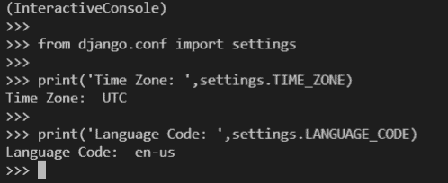

Example

读: [Django for 循环](https://pythonguides.com/django-for-loop/)

在这个 Django 教程中，我们讨论了“ `Python Django get` ”。我们还讨论了一些主题，如-`Python Django get post data`、`Python Django get _ or _ create`等。这是我们在本教程中涉及的主题的完整列表。

*   Python Django get
*   Python Django 获取请求参数
*   Python Django get_or_create
*   Python Django 获取发布数据
*   Python Django 获取 URL 参数
*   Python Django 获取设置变量
*   Python Django 获取当前 URL
*   Python Django 获取用户模型
*   Python Django get _ 用户名
*   决哥 Python get URL
*   Python Django request.user.id
*   Django Python 获取用户
*   Django Python 获取用户 id

[Bijay Kumar](https://pythonguides.com/author/fewlines4biju/)

Python 是美国最流行的语言之一。我从事 Python 工作已经有很长时间了，我在与 Tkinter、Pandas、NumPy、Turtle、Django、Matplotlib、Tensorflow、Scipy、Scikit-Learn 等各种库合作方面拥有专业知识。我有与美国、加拿大、英国、澳大利亚、新西兰等国家的各种客户合作的经验。查看我的个人资料。

[enjoysharepoint.com/](https://enjoysharepoint.com/)[](https://www.facebook.com/fewlines4biju "Facebook")[](https://www.linkedin.com/in/fewlines4biju/ "Linkedin")[](https://twitter.com/fewlines4biju "Twitter")