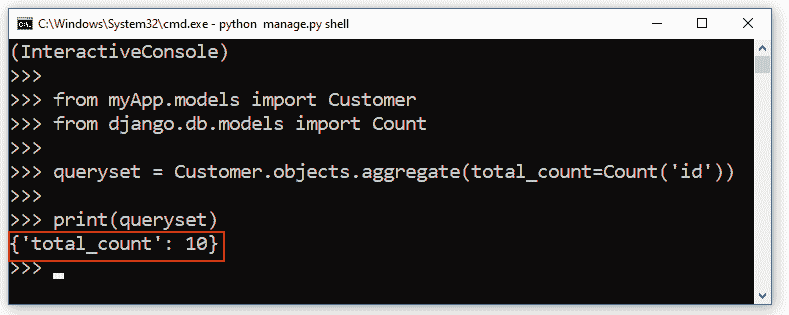
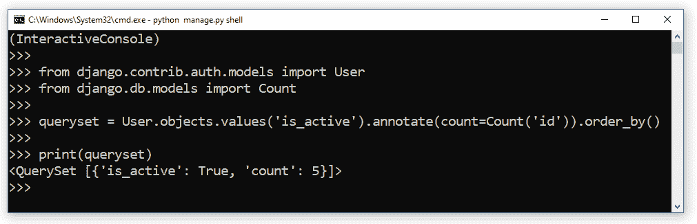
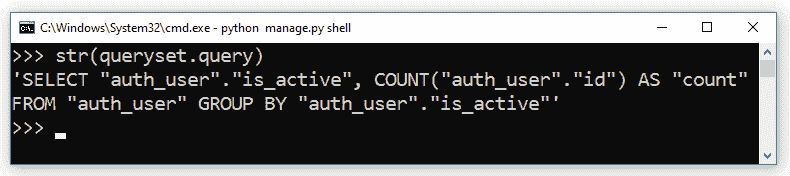
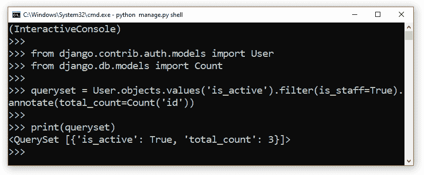
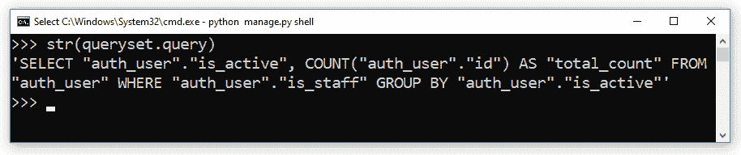
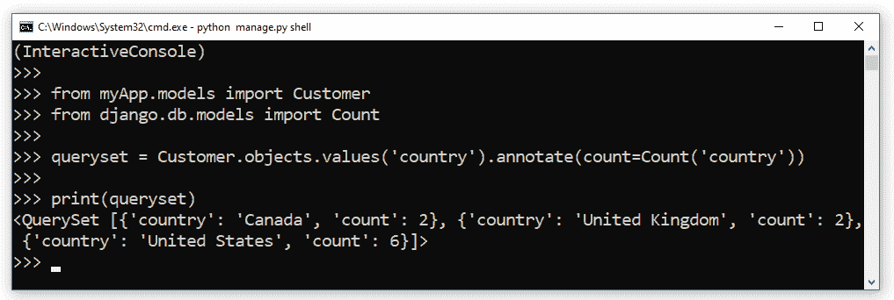
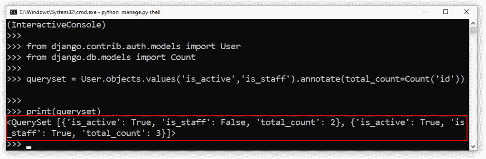
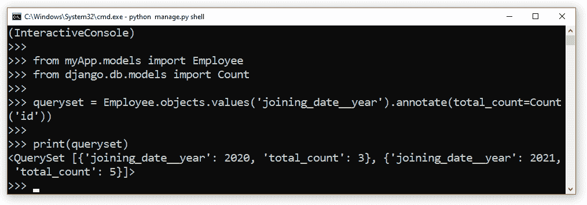
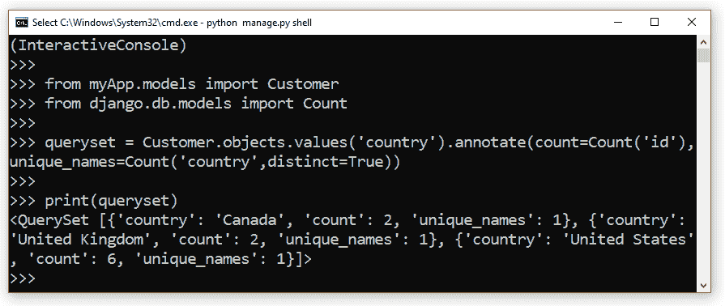
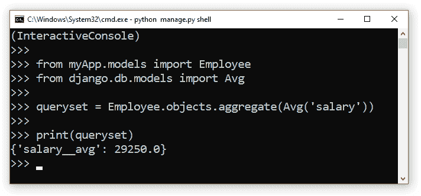

# Python Django 分组依据

> 原文：<https://pythonguides.com/python-django-group-by/>

[](https://sharepointsky.teachable.com/p/python-and-machine-learning-training-course)

在本 [Django 教程](https://pythonguides.com/what-is-python-django/)中，我们将通过了解“ **Python Django 组”，我们还将讨论一些与之相关的例子。这些是我们将在本教程中讨论的以下主题。**

*   Python Django 分组依据
*   Python Django group by annotate
*   Python Django 按过滤器分组
*   Python Django 按计数分组
*   Python Django 按平均值分组
*   Python Django 按多个字段分组
*   Python Django 按表达式分组
*   Python Django group by distinct
*   Python Django 模型分组依据
*   Python Django orm 分组依据

目录

[](#)

*   [Python Django group by](#Python_Django_group_by "Python Django group by ")
*   [Python Django group by annotate](#Python_Django_group_by_annotate "Python Django group by annotate ")
*   [Python Django 按过滤器分组](#Python_Django_group_by_filter "Python Django group by filter ")
*   [Python Django 按计数分组](#Python_Django_group_by_count "Python Django group by count ")
*   [Python Django 按多个字段分组](#Python_Django_group_by_multiple_fields "Python Django group by multiple fields ")
*   [Python Django group by 表达式](#Python_Django_group_by_expression "Python Django group by expression ")
*   [Python Django group by distinct](#Python_Django_group_by_distinct "Python Django group by distinct")
*   [Python Django 按平均值分组](#Python_Django_group_by_avg "Python Django group by avg ")

## Python Django group by

因此，在这一节中，我们将了解如何在 Django ORM 中使用 GROUP BY 子句。现在，如果你熟悉 `SQL` ，你可能知道 `GROUP BY` 语句。

`GROUP BY` 语句用于合并具有相同值的行，主要与 `COUNT()` 、 `AVG()` 、 `SUM()` 等聚合函数一起使用。然而， `Django ORM` 是一个抽象层，它允许我们通过将 python 代码翻译成 SQL 语句来处理数据库。

在 Django 中，我们可以通过使用聚合函数或者使用一些内置函数来使用 `GROUP BY` 语句。此外， `GROUP BY` 语句和聚合函数总是组合使用来对结果集进行分组。

在本节中，我们将学习使用 Django 中的聚合函数来实现 GROUP BY 语句。让我们借助一个简单的例子来理解这一点。

在本示例演示中，我们将使用包含以下数据的**客户**模型。

| 名字 | 地址 | 国家 | 城市 |
| --- | --- | --- | --- |
| 阿斯特拉弗里斯 | 德克萨斯圈 8268 号 | 美国 | 水牛 |
| 鲍伊·麦克斯佩龙 | 艾根达特小径 3 号 | 美国 | 清水镇 |
| 克拉琳达·凯姆 | 布尔帕斯街 78214 号 | 加拿大 | 谢迪亚茨 |
| 沙恩·弗伦奇 | Trailsway 山 35456 号 | 美国 | 底特律 |
| 科特尼·戴维森 | 小芙蓉路 94999 号 | 联合王国 | 金洛克 |
| 奎尼·格雷维 | 挪威枫叶角 8860 号 | 联合王国 | 阿什利 |
| Dulcy 鱼锁 | 德布斯路口 85095 号 | 美国 | 迈阿密海滩 |
| Teodorico Puzey | 04977 香葱圈 | 加拿大 | 鲍恩岛 |

Customer Model

例如，我们将简单地使用一个聚合函数 `COUNT()` 来计算**客户**模型中的记录总数。

```py
**(InteractiveConsole)
>>>
>>>** from myApp.models import Customer
**>>>** from django.db.models import Count
**>>>
>>>** queryset = Customer.objects.aggregate(total_count=Count('id'))
**>>>
>>>** print(queryset)
```

在这个例子中，首先，我们简单地导入了**客户**模型，然后，我们导入了**计数()**函数。在这之后，我们使用聚合方法创建了一个 QuerySet，在这个方法中，我们使用了 `Count()` 函数。由于模型中有 10 条记录，queryset 将返回一个字典，关键字为 `total_count` ，值为 `10` 。



Result

阅读: [Python Django vs Flask](https://pythonguides.com/python-django-vs-flask/)

## Python Django group by 标注

现在，每当我们使用 aggregate 时，aggregate 函数就会应用于整个表。但是，我们通常对一些行组应用 GROUP BY T1 语句。对于这个执行，我们必须使用 `annotate()` 方法。让我们用一个简单的例子来说明这个实现。

下面是这个例子的代码。

```py
**(InteractiveConsole)
>>>**
**>>>** from django.contrib.auth.models import User
**>>>** from django.db.models import Count
**>>>
>>>** queryset = User.objects.values('is_active').annotate(count=Count('id')).order_by()
**>>>
>>>** print(queryset)
```

*   在上面的代码中，我们使用的是**用户**模型，这一次，我们寻找的是活跃用户的总数。
*   因此，在导入了**用户**模型和 `Count()` 函数之后，我们正在创建 QuerySet。
*   在 QuerySet 中，我们使用**值(' is_active')** 来选择所有活动用户。然后，我们使用**注释(count=Count('id'))** 来应用基于主键的聚合函数。
*   最后，我们使用 print 语句来打印查询集。



Example with output

所以，在上面的例子中， `values()` 和 `annotate()` 一起可以用于实现 `GROUP BY` 语句。我们也可以通过使用下面的代码来确认这一点。

```py
**>>>** str(queryet.query)
```

它将返回给定查询集的等效 SQL 语句。在结果中，我们可以很容易地看到语句对**组的使用。**



SQL Query

阅读:[如何安装 Django](https://pythonguides.com/how-to-install-django/)

## Python Django group by 滤镜

很多时候我们只需要计算特定的行或列，而不是一组列。在这种情况下，我们可以使用带有**值()**和**注释()**的**过滤器()**方法来获得想要的结果。

让我们借助一个例子来理解一下 `filter()` 方法的用法。为此，我们再次使用内置的**用户**模型及其数据。我们将尝试从**用户**模型中获取所有活跃员工用户的数量。

```py
**(InteractiveConsole)
>>>
>>>** from django.contrib.auth.models import User
**>>>** from django.db.models import Count
**>>>
>>>** queryset = User.objects.values('is_active').filter(is_staff=True).annotate(total_count=Count('id'))
**>>>**
**>>>** print(queryset)
```

在代码中，我们使用了 filter 方法从用户模型中选择所有的职员。与前面的例子类似，我们已经使用了 `values()` 和 `annotate()` 方法对**分组 BY** 。

下面是上面带有输出的代码截图。



Example with output

下面是上述代码的等效 SQL 查询。



SQL Query

阅读:[Django 中的应用程序和项目之间的差异](https://pythonguides.com/django-app-vs-project/)

## Python Django 组按计数

在这一节中，我们将了解如何基于对多行的分组来获得一列的计数。让我们借助一个例子来理解这一点。这一次，我们使用的是我们在第一部分展示的**客户**模型。

在演示中，我们将获取 country 列中每个唯一国家的计数。这是这个例子的代码。

```py
**(InteractiveConsole)
>>>
>>>** from myApp.models import Customer
**>>>** from django.db.models import Count
**>>>**
**>>>** queryset = Customer.objects.values('country').annotate(count=Count('country'))
**>>>
>>>** print(queryset)
```

在上面的例子中，我们使用了 `values()` 和 `annotate()` 方法来获取 country 列中的国家。下面是这个例子的结果。



Output

阅读:[如何设置 Django 项目](https://pythonguides.com/setup-django-project/)

## Python Django 按多个字段分组

在本节中，我们将了解如何通过在 Django 中实现 `GROUP BY` 语句来对多个字段进行分组。现在，对于这个实现，我们将通过 `values()` 方法来指定多个字段。

为了更好地理解，让我们执行一个相关的例子。为此，我们将使用内置的**用户**模型。该示例的代码如下。

```py
**(InteractiveConsole)
>>>**
**>>>** from django.contrib.auth.models import User
**>>>** from django.db.models import Count
**>>>
>>>** queryset = User.objects.values('is_active','is_staff').annotate(total_count=Count('id'))
**>>>
>>>** print(queryset)
```

在上面的例子中，我们在 `values()` 方法中传递了 2 个字段，第一个是 **is_active，**，第二个是 `is_staff` 。我们还使用了 `Count()` 聚合函数。因此，这个 QuerySet 将返回属于或不属于 `is_active` 或 `is_staff` 组的用户计数。下面是示例的输出。



Output

阅读:[如何在 Django 中创建模型](https://pythonguides.com/create-model-in-django/)

## Python Django group by 表达式

在本节中，我们将了解如何根据表达式对值进行分组。让我们借助一个例子来理解群表达的用法。我们将使用包含以下数据的**员工**模型。

| 名字 | 职称 | 加入日期 | 薪水 |
| --- | --- | --- | --- |
| 哈迪·芒瑟 | 高级财务分析师 | 2021-05-25 | Twenty-four thousand |
| 里克·莱夫 | 产品工程师 | 2021-02-13 | forty thousand |
| 罗达·本茨 | 总经理 | 2020-10-17 | Thirty-five thousand |
| 鲁斯廷·菲利佩利 | 金融分析师 | 2021-06-04 | Twenty thousand |
| 丹尼斯打赌 | 技术作家 | 2020-11-23 | Thirty-two thousand |
| Allene Johansson | 数据库管理员 | 2021-04-21 | Twenty-eight thousand |
| 艾米·鲁尼 | 助理会计 | 2020-10-02 | Twenty-three thousand |
| 威利·菲利普斯 | 二级工程师 | 2021-08-01 | Thirty-two thousand |

Employee Model

现在，我们将尝试获取每年加入的员工人数。下面给出了该示例的代码。

```py
**(InteractiveConsole)
>>>
>>>** from myApp.models import Employee
**>>>** from django.db.models import Count
**>>>
>>>** queryset = Employee.objects.values('joining_date__year').annotate(total_count=Count('id'))
**>>>
>>>** print(queryset)
```

在上面的示例中，为了从 Datetime 值中获取日期，我们将表达式 ***<字段>_ _ 年*** 传递给了 `values()` 方法。它将返回一个包含键和值的字典。下面是结果截图。



Output

阅读:[如何获取 Django 的当前时间](https://pythonguides.com/how-to-get-current-time-in-django/)

## Python Django group by distinct

如果我们正在使用 Django 开发一个数据驱动的应用程序，那么大多数时候我们的表可能会有一些重复的值。当使用一些聚合函数如 `COUNT()` 、**、【AVG()** 等时，我们可能需要基于不同事件的结果。因此在这一节中，我们将讨论如何在 Django 中根据不同的值对数据进行分组。

在 SQL 方面，我们使用 `SELECT DISTINCT` 语句从表中选择不同的值。现在，让我们了解如何在我们的查询集中使用这个 `DISTINCT` 。

让我们通过演示一个例子来理解这一点，为此，我们使用了**客户**模型。

**注**:您可以在本文第一节查看**客户**模型的数据。

对于本示例演示，我们将从**客户**模型中获取所有不同的国家名称及其数量。对于实现，我们使用 Django shell。这是我们已经实现的代码。

```py
**(InteractiveConsole)
>>>
>>>** from myApp.models import Customer
**>>>** from django.db.models import Count
**>>>**
**>>>** queryset = Customer.objects.values('country').annotate(count=Count('id'),unique_names=Count('country',distinct=True))
**>>>
>>>** print(queryset) 
```

为了选择不同的国家名称，我们在 `annotate()` 方法中给出了“ `distinct=True` ”。因此，这个 QuerySet 将返回每个唯一国家名称的计数。为了更好地理解，下面是上述 QuerySet 的 SQL 查询。

```py
SELECT "myApp_customer"."country", COUNT("myApp_customer"."id") AS "count", COUNT(DISTINCT "myApp_customer"."country") AS "unique_names" FROM "myApp_customer" GROUP BY "myApp_customer"."country"
```

最终，我们会得到如下输出，如下面的截图所示。



Use of Distinct with GROUP BY in Django

阅读: [Python Django 获取管理员密码](https://pythonguides.com/python-django-get-admin-password/)

## Python Django group by avg

在 Django 中，可以使用不同的聚合函数对记录进行分组，比如 `COUNT()` 、**、【AVG()** 、**、MIN()** 、 `MAX()` 等。因此，在本节中，我们将了解如何使用 `AVG()` 方法从 Django 中的一组记录中获取平均值。

让我们以 Django 中的 `AVG()` 方法的执行为例。在本演示中，我们将使用包含以下数据的雇员模型。

| 名字 | 职称 | 加入日期 | 薪水 |
| --- | --- | --- | --- |
| 哈迪·芒瑟 | 高级财务分析师 | 2021-05-25 | Twenty-four thousand |
| 里克·莱夫 | 产品工程师 | 2021-02-13 | forty thousand |
| 罗达·本茨 | 总经理 | 2020-10-17 | Thirty-five thousand |
| 鲁斯廷·菲利佩利 | 金融分析师 | 2021-06-04 | Twenty thousand |
| 丹尼斯打赌 | 技术作家 | 2020-11-23 | Thirty-two thousand |
| Allene Johansson | 数据库管理员 | 2021-04-21 | Twenty-eight thousand |
| 艾米·鲁尼 | 助理会计 | 2020-10-02 | Twenty-three thousand |
| 威利·菲利普斯 | 二级工程师 | 2021-08-01 | Thirty-two thousand |

Employee Model

现在，我们将通过运行以下代码来获取雇员的平均工资。

```py
**(InteractiveConsole)
>>>
>>>** from myApp.models import Employee
**>>>** from django.db.models import Avg
**>>>
>>>** queryset = Employee.objects.aggregate(Avg('salary'))
**>>>
>>>** print(queryset)
```

所以，首先，我们导入了**雇员**模型和 `Avg()` 方法。在此之后，我们使用聚合函数来获得雇员的平均工资。下面是这段代码及其输出的图像。



Output

读: [Django for 循环](https://pythonguides.com/django-for-loop/)

在本 Django 教程中，我们已经讨论了由创建的“ **Python Django 组”，并且我们还介绍了一些与之相关的例子。这些是我们在本教程中讨论过的以下主题。**

*   Python Django 分组依据
*   Python Django group by annotate
*   Python Django 按过滤器分组
*   Python Django 按计数分组
*   Python Django 按平均值分组
*   Python Django 按多个字段分组
*   Python Django 按表达式分组
*   Python Django group by distinct
*   Python Django 模型分组依据
*   Python Django orm 分组依据

[Bijay Kumar](https://pythonguides.com/author/fewlines4biju/)

Python 是美国最流行的语言之一。我从事 Python 工作已经有很长时间了，我在与 Tkinter、Pandas、NumPy、Turtle、Django、Matplotlib、Tensorflow、Scipy、Scikit-Learn 等各种库合作方面拥有专业知识。我有与美国、加拿大、英国、澳大利亚、新西兰等国家的各种客户合作的经验。查看我的个人资料。

[enjoysharepoint.com/](https://enjoysharepoint.com/)[](https://www.facebook.com/fewlines4biju "Facebook")[](https://www.linkedin.com/in/fewlines4biju/ "Linkedin")[](https://twitter.com/fewlines4biju "Twitter")