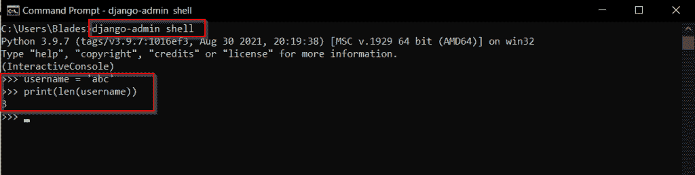
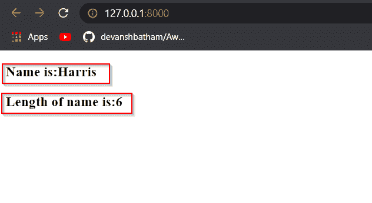
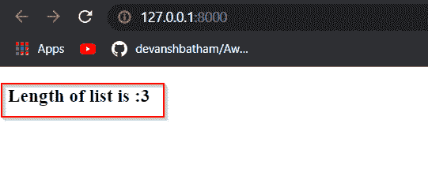
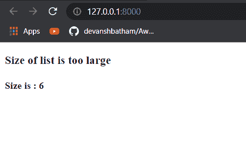
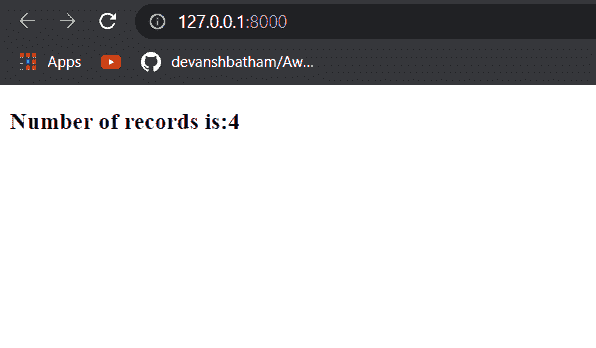

# Python Django 长度过滤器

> 原文：<https://pythonguides.com/python-django-length-filter/>

[](https://sharepointsky.teachable.com/p/python-and-machine-learning-training-course)

在这篇 [Python 教程](https://pythonguides.com/python-hello-world-program/)中，我将解释如何用 Python 检查 Django 应用程序中的字符串或列表的长度。

*   检查 Django 中字符串的长度
*   Django 模板中字符串的长度
*   Django 模板列表长度
*   Django 模板，如果长度大于
*   获取 queryset Django 的长度

目录

[](#)

*   [检查 Django 中字符串的长度](#Check_length_of_a_string_in_Django "Check length of a string in Django")
*   [Django 模板中字符串的长度](#Length_of_string_in_Django_template "Length of string in Django template")
*   [Django 模板列表长度](#Django_template_length_of_list "Django template length of list")
*   [Django 模板，如果长度大于](#Django_template_if_length_greater_than "Django template if length greater than")
*   [获取查询集 Django 的长度](#Get_length_of_queryset_Django "Get length of queryset Django")

## 检查 Django 中字符串的长度

要简单地检查 Django 中字符串的长度，可以使用 `len()` 函数。该函数接受一个字符串输入，并返回一个整数值，即字符串的长度。

您可以使用 len 函数，如下例所示。我正在 Django shell 中执行代码。

要开始使用 Django shell，请在 windows 命令提示符下运行以下命令:

```py
django-admin shell
```

现在您可以看到 len()函数如何工作并返回字符串的长度:

```py
>>> username = 'abc'
>>> print(len(username))
3
```



String length in Django

这样，你就可以求出一个字符串的长度。但是，如果您想要查找 Django 模板中字符串的长度，您可以使用长度过滤器。

阅读[如何在 Django 获取当前时间](https://pythonguides.com/how-to-get-current-time-in-django/)

## Django 模板中字符串的长度

假设您正在生成一个动态字符串并将其传递给 Django 模板，您需要找到该字符串的长度。在这种情况下，您可以使用**长度**过滤器来查找长度。

例如，我创建了一个视图，并将一个字符串从这个视图传递给一个模板。我的 `views.py` 文件如下所示:

```py
from django.shortcuts import render
def index(request):
    parameters={
        'name' : 'Harris' 
    }
    return render(request, 'index.html', parameters)
```

如果我想在 `"Harris"` 变量中呈现字符串的长度，我可以使用模板中如下所示的 length 函数:

```py
<!DOCTYPE html>
<html lang="en">
<head>
    <meta charset="UTF-8">
    <meta http-equiv="X-UA-Compatible" content="IE=edge">
    <meta name="viewport" content="width=device-width, initial-scale=1.0">
    <title>Demo</title>
</head>
<body>
    <h3>Name is:{{name}}</h3>
    <h3>Length of name is:{{name|length}}</h3>
</body>
</html>
```

在上面的模板中，我访问了 `name` 变量，并对其应用了长度过滤器。



Length of string in Django template

这样，你可以在 Django 模板中找到一个字符串的长度。

阅读[如何在 Django 中创建模型](https://pythonguides.com/create-model-in-django/)

## Django 模板列表长度

通常，当我们试图将字典中的列表从视图传递到模板时，我们需要找到 Django 模板中列表的长度。在这种情况下，我们可以使用 `length` 过滤器来查找列表的长度。

例如，我创建了一个视图，它传递一个包含元素列表的字典。 `views.py` 文件如下所示:

```py
from django.shortcuts import render
def index(request):
    list1=['Steve', 'Peter', 'Jonathan']
    return render(request, 'index.html', {'list1':list1})
```

您可以看到，我已经通过字典向模板传递了一个列表。现在，在模板文件中，您可以使用长度过滤器来查找该列表的长度，如下所示:

```py
<!DOCTYPE html>
<html lang="en">
<head>
    <meta charset="UTF-8">
    <meta http-equiv="X-UA-Compatible" content="IE=edge">
    <meta name="viewport" content="width=device-width, initial-scale=1.0">
    <title>Demo</title>
</head>
<body>
    <h3>Length of list is :{{list1|length}}</h3>
</body>
</html>
```



Length of a list in a Django template

这样，您可以使用 Python Django 中的长度过滤器来查找列表的长度。

另请参阅，[Django 中的应用程序和项目之间的差异](https://pythonguides.com/django-app-vs-project/)

## Django 模板，如果长度大于

既然您已经了解了长度过滤器，让我们看一个例子，在这个例子中，我们将使用 Django 模板中的大于号操作符(>)来比较字符串的长度。

在下面的例子中，我使用了一个 if 语句和一个大于运算符来比较视图中指定的列表的长度。视图文件的源代码是:

```py
from django.shortcuts import render
def index(request):
    list1=['Steve', 'Peter', 'Jonathan', 'Rambo', 'Vicky', 'Daisy']
    return render(request, 'index.html', {'list1':list1}) 
```

我已经将包含六个项目的列表传递到一个模板文件中，该文件是:

```py
<!DOCTYPE html>
<html lang="en">
<head>
    <meta charset="UTF-8">
    <meta http-equiv="X-UA-Compatible" content="IE=edge">
    <meta name="viewport" content="width=device-width, initial-scale=1.0">
    <title>Demo</title>
</head>
<body>
    
    <h3>Size of list is too large</h3>
    <h4>Size is : {{list1|length}}</h4>
    
</body>
</html>
```

我使用了一个 if 块。这个 if 块中的代码只有在列表长度大于 5 时才会执行，在我们的例子中是 `True` 。现在来看看输出。



Comparing the size of a list in an HTML template

因此，您可能已经学会了如何在 Django 模板中找到列表的长度。

阅读 [Python Django 获取管理员密码](https://pythonguides.com/python-django-get-admin-password/)

## 获取查询集 Django 的长度

有时，您从数据库获取结果集，并在 HTTP 响应中呈现记录。您可能希望获得结果集的长度，即结果集中的记录数，并相应地显示结果。

在这种情况下，您可以使用 `count()` 方法或 `len()` 函数来查找 queryset 中的记录数。

例如，我创建了一个视图，它从名为 `Employees` 的表中获取一个 queryset。该表包含如下所示的记录:

| 身份证明（identification） | 名字 | 姓氏 | 部门 |
| --- | --- | --- | --- |
| One thousand six hundred and one | 克莉丝 | 海姆斯沃斯 | 研究 |
| One thousand six hundred and two | 赫勒纳 | 威廉姆斯 | 金融 |
| One thousand six hundred and three | 尿壶 | 詹姆斯 | 营销 |
| One thousand six hundred and four | 督尼 | 莫克尔 | 金融 |

Employees Table

我的 `views.py` 文件如下所示:

```py
from app1.models import Employees
from django.shortcuts import render
def index(request):
    querysetlen = Employees.objects.count()
    return render(request, 'index.html', {'queryset':querysetlen}) 
```

您可以看到我是如何使用 `count()` 函数来查找查询集的长度的。

现在我将这个计数渲染到一个名为`index.html`的 Django 模板中，它是:

```py
<!DOCTYPE html>
<html lang="en">
<head>
    <meta charset="UTF-8">
    <meta http-equiv="X-UA-Compatible" content="IE=edge">
    <meta name="viewport" content="width=device-width, initial-scale=1.0">
    <title>Demo</title>
</head>
<body>
    <h3>Number of records is:{{queryset}}</h3>
</body>
</html>
```



Length of a queryset

也可以使用 `len()` 函数。只需对您的 `views.py` 文件进行如下修改:

```py
from app1.models import Employees
from django.shortcuts import render
def index(request):
    querysetlen = len(Employees.objects.all())
    return render(request, 'index.html', {'queryset':querysetlen}) 
```

这样，你就可以在 Django 中找到一个 queryset 的长度。

您可能会喜欢以下 Python Django 教程:

*   [Django for loop](https://pythonguides.com/django-for-loop/)
*   [Python Django group by](https://pythonguides.com/python-django-group-by/)
*   [Python Django get](https://pythonguides.com/python-django-get/)
*   [Python Django 过滤器](https://pythonguides.com/python-django-filter/)
*   [如何设置 Django 项目](https://pythonguides.com/setup-django-project/)
*   模型 Django 上的联合操作

因此，您可能已经学会了如何使用各种技术**找到各种 Django 对象**的长度。

*   检查 Django 中字符串的长度
*   Django 模板中字符串的长度
*   Django 模板列表长度
*   Django 模板，如果长度大于
*   获取 queryset Django 的长度

[Bijay Kumar](https://pythonguides.com/author/fewlines4biju/)

Python 是美国最流行的语言之一。我从事 Python 工作已经有很长时间了，我在与 Tkinter、Pandas、NumPy、Turtle、Django、Matplotlib、Tensorflow、Scipy、Scikit-Learn 等各种库合作方面拥有专业知识。我有与美国、加拿大、英国、澳大利亚、新西兰等国家的各种客户合作的经验。查看我的个人资料。

[enjoysharepoint.com/](https://enjoysharepoint.com/)[](https://www.facebook.com/fewlines4biju "Facebook")[](https://www.linkedin.com/in/fewlines4biju/ "Linkedin")[](https://twitter.com/fewlines4biju "Twitter")