# Python Django MySQL CRUD

> 原文：<https://pythonguides.com/python-django-mysql-crud/>

[](https://sharepointsky.teachable.com/p/python-and-machine-learning-training-course)

在这个 [Python Django 教程](https://pythonguides.com/how-to-install-django/)中，我们将学习使用 MySQL 的 **Django crud 示例。这些是我们将在本教程中讨论的主题。**

*   Python Django MySQL CRUD
*   Python Django MySQL CRUD 项目设置
*   Python Django MySQL CRUD 创建 url 模式
*   Python Django MySQL CRUD 创建模型
*   Python Django MySQL CRUD 创建模型表单
*   Python Django MySQL CRUD 视图函数创建
*   Python Django MySQL CRUD HTML 创建
*   Python Django MySQL CRUD 视图函数检索
*   Python Django MySQL CRUD HTML 检索
*   Python Django MySQL CRUD 视图函数更新
*   Python Django MySQL CRUD HTML 更新
*   Python Django MySQL CRUD 视图函数删除
*   Python Django MySQL CRUD HTML 删除
*   Python Django MySQL CRUD 示例

目录

[](#)

*   [Python Django MySql CRUD](#Python_Django_MySql_CRUD "Python Django MySql CRUD")
*   [Python Django MySQL CRUD 项目设置](#Python_Django_MySQL_CRUD_project_setup "Python Django MySQL CRUD project setup")
*   [Python Django MySQL CRUD 创建 url 模式](#Python_Django_MySQL_CRUD_create_url_pattern "Python Django MySQL CRUD create url pattern")
*   [Python Django MySQL CRUD 创建模型](#Python_Django_MySQL_CRUD_create_model "Python Django MySQL CRUD create model")
*   [Python Django MySQL CRUD 创建模型表单](#Python_Django_MySQL_CRUD_create_model_form "Python Django MySQL CRUD create model form")
*   [Python Django MySQL CRUD 视图函数创建](#Python_Django_MySQL_CRUD_view_function_CREATE "Python Django MySQL CRUD view function CREATE")
*   [Python Django MySQL CRUD HTML CREATE](#Python_Django_MySQL_CRUD_HTML_CREATE "Python Django MySQL CRUD HTML CREATE")
*   [Python Django MySQL CRUD 视图函数检索](#Python_Django_MySQL_CRUD_view_function_RETRIEVE "Python Django MySQL CRUD view function RETRIEVE")
*   [Python Django MySQL CRUD HTML 检索](#Python_Django_MySQL_CRUD_HTML_RETRIEVE "Python Django MySQL CRUD HTML RETRIEVE")
*   [Python Django MySQL CRUD 视图函数更新](#Python_Django_MySQL_CRUD_view_function_UPDATE "Python Django MySQL CRUD view function UPDATE")
*   [Python Django MySQL CRUD HTML 更新](#Python_Django_MySQL_CRUD_HTML_UPDATE "Python Django MySQL CRUD HTML UPDATE")
*   [Python Django MySQL CRUD 视图函数删除](#Python_Django_MySQL_CRUD_view_function_DELETE "Python Django MySQL CRUD view function DELETE")
*   [Python Django MySQL CRUD HTML 删除](#Python_Django_MySQL_CRUD_HTML_DELETE "Python Django MySQL CRUD HTML DELETE")
*   [Python Django MySQL CRUD 示例](#Python_Django_MySQL_CRUD_Example "Python Django MySQL CRUD Example")

## Python Django MySql CRUD

在本节中，我们将学习 CRUD 操作。

Django 是一个执行 CRUD 操作的 web 框架，基于 MVT 架构。CRUD 代表创建、检索、更新和删除，它们是任何 web 开发人员都应该熟悉的基本流程。

我们将了解 Django 的 CRUD 操作如下。

*   **创建:**在数据库表中，创建或添加新条目。
*   **检索:**从数据库的表中读取、检索或获取全部或部分条目。
*   **更新:**在数据库表中，更新或修改现有条目。
*   **删除:**在一个数据库表中，删除已有的记录。

另外，检查:Python Django 中的[登录系统](https://pythonguides.com/login-system-in-python-django/)

## Python Django MySQL CRUD 项目设置

在这一节中，我们将学习如何建立一个 Django 项目来用 MySQL 执行 CRUD 操作。

**创建项目:** 首先，我们需要创建一个 Django 项目。为此，请在终端中键入以下命令。

```py
django-admin startproject PythonGuides
```

*   在这里，我们创建了一个名为 `PythonGuides` 的 Django 项目。

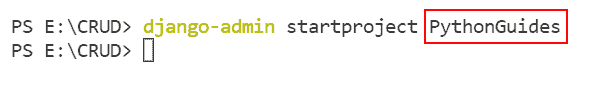

Python Django MySQL crud example

**创建 APP:** 接下来，在项目内部，我们将创建一个名为**博客**的 APP。稍后，我们将执行 CRUD 操作。在终端中键入以下命令创建一个应用程序。

```py
python manage.py startapp Blog
```

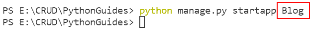

MySQL crud example using Python Django

**创建模板:** 之后，我们在项目根目录下创建 TEMPLATES 文件夹。我们还将在 Templates 文件夹中创建一个 HTML 文件。

我们将创建不同的模板来执行 CRUD 操作。

*   **search.html:** 显示提取的数据。
*   **create.html:** 添加新博客。
*   **update.html:** 更新现有博客。
*   **remove.html:** 删除博客实体。

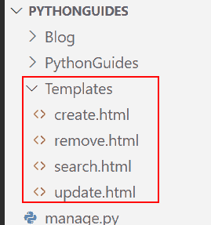

Python Django project setup MySQL crud

**安装 APP:** 那么，在 `settings.py` 文件中，一定要包含**博客** app。

```py
INSTALLED_APPS = [
    'django.contrib.admin',
    'django.contrib.auth',
    'django.contrib.contenttypes',
    'django.contrib.sessions',
    'django.contrib.messages',
    'django.contrib.staticfiles',
    'Blog'
]
```

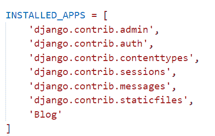

INSTALLED_APPS

**添加模板:** 我们还需要将**模板**目录添加到我们项目的目录中。在 `settings.py` 文件中添加以下代码。

```py
'DIRS': ['Templates']
```

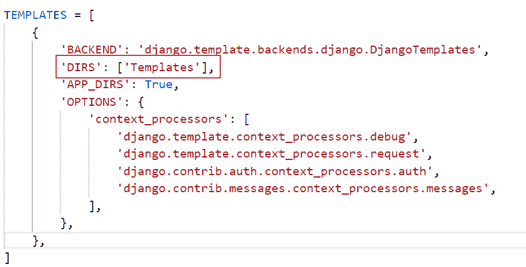

TEMPLATES

**数据库设置** :创建一个名为 `Blog` 的 MySQL 数据库，并将其设置在 Django 项目的 `settings.py` 文件中。

```py
DATABASES = {  
    'default': {  
        'ENGINE': 'django.db.backends.mysql',  
        'NAME': 'Blog',  
        'USER':'root',  
        'PASSWORD':'',  
        'HOST':'localhost',  
        'PORT':'3306'  
    }  
} 
```

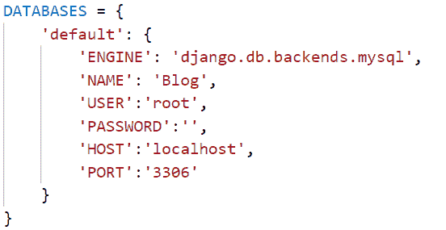

DATABASE SETUP

**安装 MySQL 客户端:** 你还需要为 Python 安装 MySQL 客户端。

```py
pip install mysqlclient
```

阅读: [Python 过滤器不在 Django 中](https://pythonguides.com/filter-not-in-django/)

## Python Django MySQL CRUD 创建 url 模式

在这一节中，我们将学习创建 URL 模式来执行 MySQL CRUD 操作。

**项目 URL:** 在项目的 `urls.py` 中添加以下代码。

```py
from django.contrib import admin
from django.urls import path, include

urlpatterns = [
    path('admin/', admin.site.urls),
    path('', include('Blog.urls')),
]
```

*   我们将 `Blog.urls` 添加到 `PythonGuides urls.py` 文件中。

**APP URL:** 接下来，我们将为每个视图创建 URL 模式。在**博客 URL . py**文件中添加以下代码。

```py
from django.urls import path
from . import views

urlpatterns = [
    path('', views.create_blog, name='create-blog'),
    path('search/', views.retrieve_blog, name='retrieve-blog'),
    path('update/<int:pk>', views.update_blog, name='update-blog'),
    path('delete/<int:pk>', views.delete_blog, name='delete-blog'),
]
```

## Python Django MySQL CRUD 创建模型

在本节中，我们将开发一个执行 CRUD 操作的模型。

**创建模型:** 在 models.py 文件中添加以下代码。

```py
from django.db import models

class Blog(models.Model):
    BlogId = models.CharField(max_length=30)
    Title = models.CharField(max_length=200)
    Author_Name = models.CharField(max_length=300)
    Start_Date = models.DateField()
    End_Date = models.DateField()

    class Meta:
        db_table = 'Blog'
```

*   我们将创建一个包含三个 `CharField` 和两个 `DateField` 的**博客**模型。
*   各自的 `CharFields` 分别是 `BlogId` 、 `Title` 和 `Author_Name` 。
*   并且，各自的**日期字段**是**开始 _ 日期**和**结束 _ 日期**。

**注册型号:** 在 `admin.py` 文件中添加以下代码。

```py
from django.contrib import admin
from .models import Blog

admin.site.register(Blog)
```

*   我们在管理网站上注册了**博客**模型。

阅读:[输出 Python 到 HTML Django](https://pythonguides.com/outputting-python-to-html-django/)

## Python Django MySQL CRUD 创建模型表单

在本节中，我们将开发一个模型表单来执行 CRUD 操作。

**创建表单:** 在 forms.py 文件中添加以下代码。

```py
from django import forms
from django.forms import ModelForm
from .models import Blog

class BlogForm(forms.ModelForm):  
    class Meta:  
        model = Blog
        fields = "__all__" 
```

*   我们创建一个表单类 `BlogForm` 。
*   然后，我们使用 `ModelForm` 从**博客模型**中获取模型字段，然后通过使用这些字段我们创建一个表单。

## Python Django MySQL CRUD 视图函数创建

在这一节中，我们将学习创建一个添加博客的视图函数。

**create_blog VIEW:** 在 `views.py` 文件中添加以下代码。

```py
from django.shortcuts import render, redirect
from .forms import BlogForm
from .models import Blog

# Add Blog

def create_blog(request):
    if request.method == "POST":
        form = BlogForm(request.POST)
        if form.is_valid():
            try:
                form.save()
                return redirect('search/')
            except:
                pass
    else:
        form = BlogForm()
    return render(request, 'create.html', {'form':form}) 
```

*   我们定义了带有**请求**参数的 `create_blog` 函数，用户使用该参数添加他们的新博客。
*   该功能将用户重定向到`create.html`页面。

使用 PostgreSQL 阅读 [Django CRUD 示例](https://pythonguides.com/django-crud-example-with-postgresql/)

## Python Django MySQL CRUD HTML CREATE

在这一节中，我们将学习创建一个 HTML 模板来添加一个新的博客。

**创建 HTML:** 在【create.html】文件中添加以下代码。

```py
<!DOCTYPE html>
<html lang="en">

<head>
    <meta charset="UTF-8">
    <meta http-equiv="X-UA-Compatible" content="IE=edge">
    <meta name="viewport" content="width=device-width, initial-scale=1.0">
    <title>Create Blog</title>
</head>

<body>
    <h2 style="text-align:center"> Create New Blog </h2>
    <form method="POST" >
        
        {{ form.as_p }}
        <input type="submit" class="btn btn-success">
    </form>
</body>

</html>
```

*   这里，我们使用 `form` 元素为用户输入创建一个 HTML 表单。
*   我们还将 `method=POST` 添加到表单标签中。
*   然后，我们使用 **** 来保护我们的表单免受网络攻击。
*   接下来，我们将 Django 表单呈现为段落。

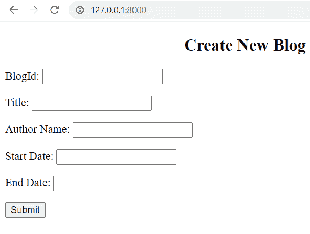

CREATE NEW FORM

阅读: [Python Django 随机数](https://pythonguides.com/django-random-number/)

## Python Django MySQL CRUD 视图函数检索

在这一节中，我们将学习创建一个视图函数，显示用户添加的所有博客列表。

**检索 _ 博客视图:** 在 `views.py` 文件中添加以下代码。

```py
from django.shortcuts import render, redirect
from Blog.forms import BlogForm
from Blog.models import Blog

# Search Blog

def retrieve_blog(request):
    blogs = Blog.objects.all()
    return render(request,'search.html',{'blogs':blogs} )
```

*   我们用**请求**参数定义了 `retrieve_blog` 函数。
*   它显示了用户进入博客的所有细节。
*   该功能将用户重定向到`search.html`页面。

## Python Django MySQL CRUD HTML 检索

在这一节中，我们将学习创建一个 HTML 模板来显示用户添加的博客列表。

**搜索 HTML:** 在【search.html】文件中添加以下代码。

```py
<!DOCTYPE html>
<html lang="en">

<head>
    <meta charset="UTF-8">
    <meta http-equiv="X-UA-Compatible" content="IE=edge">
    <meta name="viewport" content="width=device-width, initial-scale=1.0">
    <title>Search Blog</title>
</head>
<style>
    table,
    th,
    td 
    {
        border: 2px solid;
    }
</style>

<body>
    <h2 style="text-align:center"> Blog Informationn </h2>
    <table align="center" style="margin: 0px auto;">
        <thead>
            <tr>
                <th>Blog ID</th>
                <th>Title</th>
                <th>Author</th>
                <th>Start Date</th>
                <th>End Date</th>
                <th>Edit Blog</th>
                <th>Remove Blog</th>
            </tr>
        </thead>
        <tbody>
            
            <tr>
                <td>{{blog.BlogId}}</td>
                <td>{{blog.Title}}</td>
                <td>{{blog.Author_Name}}</td>
                <td>{{blog.Start_Date}}</td>
                <td>{{blog.End_Date}}</td>
                <td>
                    <a href="/update/{{blog.pk}}">Update</a>    
                </td>
                <td>
                    <a href="/delete/{{blog.pk}}">Delete</a>
                </td>
            </tr>
            
        </tbody>
    </table>
</body>

</html>
```

*   在这里，我们创建 HTML 模板，在表格中显示用户输入的所有博客列表。
*   以下是表格的标题:
    *   **博客 ID:** 显示博客 ID。
    *   **标题:**显示博客的标题。
    *   **作者:**显示谁写了特定的博客。
    *   开始日期:作者开始写这篇博客的时间。
    *   结束日期:作者结束博客的时间。
*   它还显示以下操作按钮:
    *   **更新:**编辑用户添加的具体条目。
    *   **删除:**删除用户添加的特定条目。

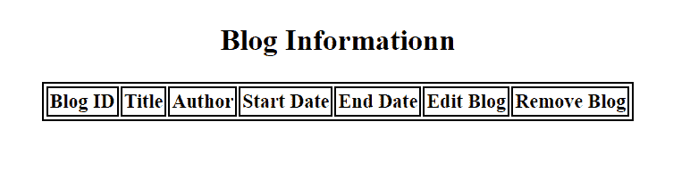

RETRIEVE BLOG INFORMATION

阅读: [Python 改 Django 版本](https://pythonguides.com/python-change-django-version/)

## Python Django MySQL CRUD 视图函数更新

在这一节中，我们将学习创建一个视图函数来更新用户添加的博客。

**更新 _ 博客视图:** 在 `views.py` 文件中添加以下代码。

```py
from django.shortcuts import render, redirect
from Blog.forms import BlogForm
from Blog.models import Blog

# Update Blog

def update_blog(request,pk):
    blogs = Blog.objects.get(id=pk)
    form = BlogForm(instance=blogs)

    if request.method == 'POST':
        form = BlogForm(request.POST, instance=blogs)
        if form.is_valid():
            form.save()
            return redirect('/search')

    context = {
        'blogs': blogs,
        'form': form,
    }
    return render(request,'update.html',context) 
```

*   **更新**视图类似于**创建**视图。
*   唯一不同的是，这里我们创建了 `update_blog` 函数，并且我们还将 blogs **实例**传递给表单。
*   我们根据博客的**主键**进行更新。

## Python Django MySQL CRUD HTML 更新

在这一节中，我们将学习如何开发一个 HTML 模板来更新用户添加的特定字段。

**更新 HTML:** 在【update.html】文件中添加以下代码。

```py
<!DOCTYPE html>
<html lang="en">

<head>
    <meta charset="UTF-8">
    <meta http-equiv="X-UA-Compatible" content="IE=edge">
    <meta name="viewport" content="width=device-width, initial-scale=1.0">
    <title>Update Blog</title>
</head>

<body>
    <h2 style="text-align: center; padding-top: 1em; padding-bottom: 1em;">Edit Blog</h2>

    <form action="" method="POST">
        
        {{ form.as_p }}
        <input type="submit" class="btn btn-success">
    </form>
</body>

</html>
```

*   这里，我们使用 `form` 元素来创建一个 HTML 表单。
*   通过使用这个表单，用户可以编辑他们想要的任何字段。

阅读: [Python Django vs 金字塔](https://pythonguides.com/python-django-vs-pyramid/)

## Python Django MySQL CRUD 视图函数删除

在本节中，我们将学习创建一个视图函数，用于删除用户添加的特定条目。

**删除 _ 博客视图:** 在 `views.py` 文件中添加以下代码。

```py
from django.shortcuts import render, redirect
from Blog.forms import BlogForm
from Blog.models import Blog

# Delete Blog

def delete_blog(request, pk):
    blogs = Blog.objects.get(id=pk)

    if request.method == 'POST':
        blogs.delete()
        return redirect('/search')

    context = {
        'blogs': blogs,
    }
    return render(request, 'remove.html', context)
```

*   当有人点击 `Delete` 时，我们从数据库中删除实例。

此外，检查:[Python Django 中网站的简单联系表](https://pythonguides.com/simple-contact-form-for-website-in-python-django/)

## Python Django MySQL CRUD HTML 删除

在这一节中，我们将学习如何开发一个 HTML 模板来删除用户添加的条目。

**删除 HTML:** 在【remove.html】文件中添加以下代码。

```py
<!DOCTYPE html>
<html lang="en">

<head>
    <meta charset="UTF-8">
    <meta http-equiv="X-UA-Compatible" content="IE=edge">
    <meta name="viewport" content="width=device-width, initial-scale=1.0">
    <title>Delete Blog</title>
</head>

<body>
    <form action="" method="POST">
        

        <br><br>
        <div class="alert alert-danger" role="alert">
            Are you sure you want to delete "{{ blogs.emp_name }}"?
        </div>

        <p>
            <a href=""><--Return</a>
        </p>

        <p>
            <input class="btn btn-danger" type="submit" value="Confirm">
        </p>
    </form>
</body>

</html>
```

*   这里，我们创建一个 HTML 模板，删除用户想要删除的特定条目。
*   并且它还在删除过程之前**确认**一次。
*   当我们点击**返回**按钮时，我们也可以返回到上一页，即搜索模板。

Read: [Django 从 POST 请求中获取所有数据](https://pythonguides.com/django-get-all-data-from-post-request/)

## Python Django MySQL CRUD 示例

在本节中，我们将使用 MySQL 关系数据库管理系统执行 Django CRUD 示例。

首先，我们必须在终端上运行一些命令来创建模型。

**命令如下:**

```py
python manage.py makemigrations

python manage.py migrate
```

然后，我们必须运行服务器，为此在终端中键入以下命令。

```py
python manage.py runserver
```

启动服务器，通过将 URL 定义为 http://127.0.0.1:8000 来访问表单。

首先，在表单中输入所有详细信息以创建一个新博客，然后单击**提交**按钮。

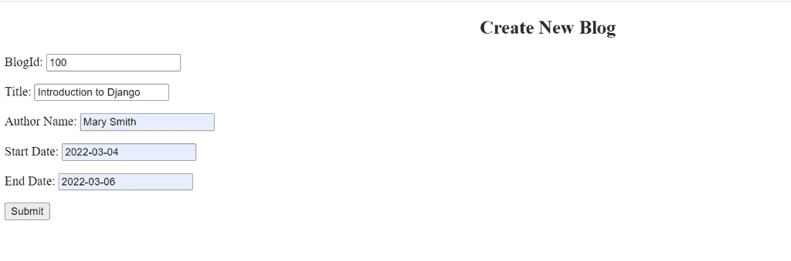

Add New Blog

让我们看看它在 MySQL 中的样子。

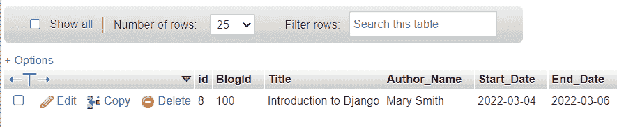

MySQL

当我们点击提交按钮，它呈现搜索 HTML 模板。

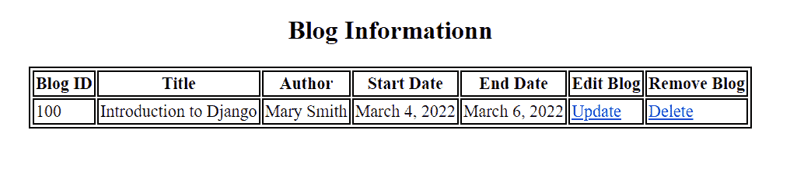

BLOG INFORMATION

我们可以看到，如果我们想编辑博客，我们可以使用**更新按钮**，如果我们想删除博客，我们可以使用**删除按钮**。

现在，看看当我们点击**更新**按钮时会是什么样子。

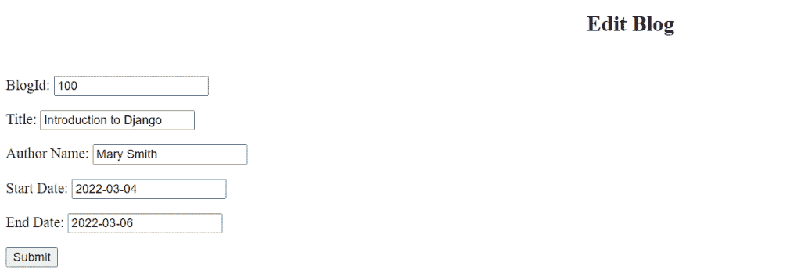

UPDATE HTML TEMPLATE

现在，我们可以编辑任何字段。

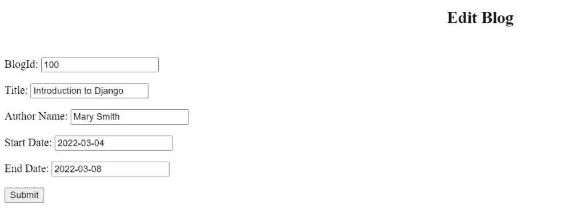

EDIT BLOG INFORMATION

*   在这里，我编辑表单的结束日期字段。
*   我将结束日期从 2022 年 3 月 6 日更改为 2022 年 3 月 8 日。

现在，看看当我们点击**提交**按钮时会发生什么。

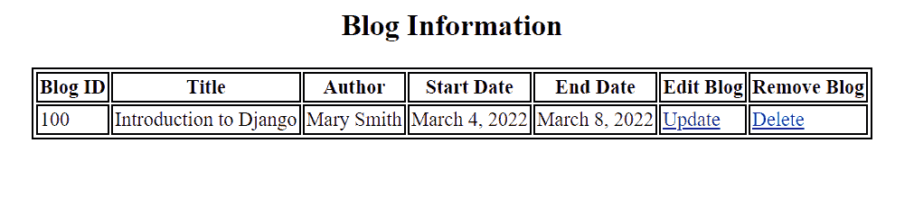

EDIT BLOG INFORMATION

在这里，我们看到结束日期已经更新。

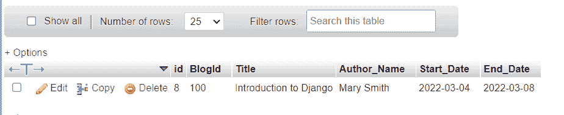

MySQL

我们可以看到它还更新 MySQL 上的博客信息。

现在，看看当我们点击**删除**按钮时是什么样子。

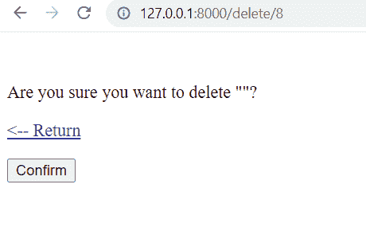

DELETE HTML TEMPLATE

现在我们可以看到，在删除之前，它确认了一次**“您确定要` `删除**。

现在，看看如果我们点击**返回**会发生什么。

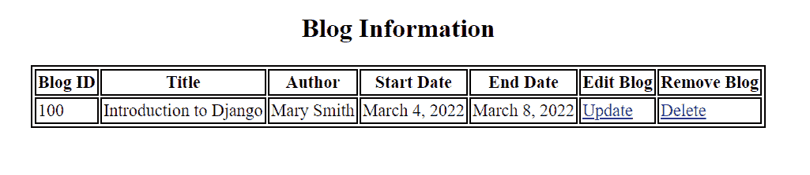

我们可以看到它把我们带回了博客信息。

现在，看看如果我们点击**确认**会发生什么。

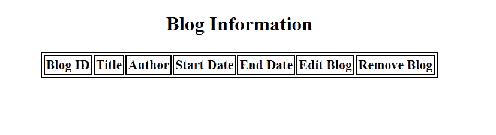

DELETE

我们可以看到它删除了博客。

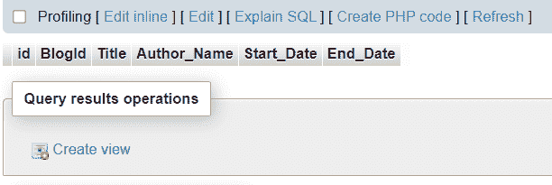

DELETE MySQL

我们可以看到它还会从 MySQL 数据库中删除博客。

你可能也喜欢阅读下面的 Django 教程。

*   [Python Django 长度过滤器](https://pythonguides.com/python-django-length-filter/)
*   [如何设置 Django 项目](https://pythonguides.com/setup-django-project/)
*   [获取 Django 中的 URL 参数](https://pythonguides.com/get-url-parameters-in-django/)
*   [如何在 Django 中创建模型](https://pythonguides.com/create-model-in-django/)
*   [Python Django app 上传文件](https://pythonguides.com/django-app-upload-files/)
*   [Python Django 表单验证](https://pythonguides.com/django-form-validation/)

在本 Django 教程中，我们已经讨论了" **Python Django CRUD 示例(MySQL)** "并且我们还讨论了本教程中的以下主题。

*   Python Django MySQL CRUD
*   Python Django MySQL CRUD 项目设置
*   Python Django MySQL CRUD 创建 url 模式
*   Python Django MySQL CRUD 创建模型
*   Python Django MySQL CRUD 创建模型表单
*   Python Django MySQL CRUD 视图函数创建
*   Python Django MySQL CRUD HTML 创建
*   Python Django MySQL CRUD 视图函数检索
*   Python Django MySQL CRUD HTML 检索
*   Python Django MySQL CRUD 视图函数更新
*   Python Django MySQL CRUD HTML 更新
*   Python Django MySQL CRUD 视图函数删除
*   Python Django MySQL CRUD HTML 删除
*   Python Django MySQL CRUD 示例

[Bijay Kumar](https://pythonguides.com/author/fewlines4biju/)

Python 是美国最流行的语言之一。我从事 Python 工作已经有很长时间了，我在与 Tkinter、Pandas、NumPy、Turtle、Django、Matplotlib、Tensorflow、Scipy、Scikit-Learn 等各种库合作方面拥有专业知识。我有与美国、加拿大、英国、澳大利亚、新西兰等国家的各种客户合作的经验。查看我的个人资料。

[enjoysharepoint.com/](https://enjoysharepoint.com/)[](https://www.facebook.com/fewlines4biju "Facebook")[](https://www.linkedin.com/in/fewlines4biju/ "Linkedin")[](https://twitter.com/fewlines4biju "Twitter")