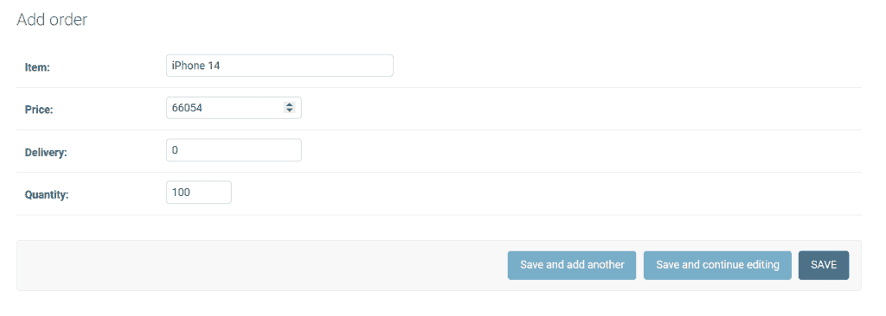

# 如何使用 Python Django pre_save

> 原文：<https://pythonguides.com/python-django-pre_save/>

[](https://sharepointsky.teachable.com/p/python-and-machine-learning-training-course)

有时候，在执行了像在 Django 模型中输入、删除和更新数据这样的 [Django](https://pythonguides.com/how-to-install-django/) 操作之后，您想要运行某个函数或者进行修改。

那时，你需要一个 Django 信号。在本文中，我们将研究 Django 信号及其类型 pre_save。还有，我已经讲了这几点:—

*   先决条件
*   Django 的预保存信号是什么
*   在 Django 中何时使用 pre_save 信号
*   Django pre_save 信号如何使用 receiver decorator 工作
*   Django pre_save 信号如何使用 connect 方法工作

目录

[](#)

*   [先决条件](#Prerequisite "Prerequisite")
*   [Python Django 预保存信号](#Python_Django_pre_save_signal "Python Django pre_save signal")
*   [在 Django Python 中使用 pre_save 信号](#Use_pre_save_signal_in_Django_Python "Use pre_save signal in Django Python")
*   [Python Django pre_save 使用接收器装饰器](#Python_Django_pre_save_using_receiver_decorator "Python Django pre_save using receiver decorator")
*   [Python Django pre_save 使用连接方法](#Python_Django_pre_save_using_connect_method "Python Django pre_save using connect method")
*   [结论](#Conclusion "Conclusion")

## 先决条件

在前进到 pre_save 信号之前。Django 要求你对信号有所了解。我们来理解一下信号。

当您想要在事件之前或之后在模型或数据库上执行某段代码时，您可以使用 Django 信号。信号用于执行任何修改或创建模型实例的操作。基本上，信号是支持事件和动作之间关系的工具。

例如，考虑这样一个场景，您有一个 Django 食品订购项目，它有一个订单和目录模型。业务逻辑是这样的，在保存订单之前，应该检查目录以确保食品有库存。此外，在保存订单后，应该有一个逻辑来发送订单已收到的通知。

结果，我们现在明白 Django 的信号是什么了。

阅读:[在 Django 中运行 Python 脚本](https://pythonguides.com/run-python-script-in-django/)

## Python Django 预保存信号

你对信号有个大概的了解。所以，现在我们来讨论一下 pre_save 信号。

*pre_save* 信号在数据保存到数据库之前必须执行逻辑的情况下使用。 *pre_save()* 信号函数的语法如下。

```py
django.db.models.signals.pre_save(sender, instance, raw, using, update_fields)
```

这个函数在一个 model *save()* 方法的开始被发送。以下是参数。

| 参数 | 描述 |
| --- | --- |
| 发报机 | 它指定了模型类。 |
| 情况 | 正在保存的实际实例。 |
| 生的 | 如果为 True，模型将完全按照显示的内容保存。 |
| 使用 | 数据库中使用的别名。 |
| 更新 _ 字段 | 传递给需要更新的模型的字段。如果没有向 save()提供 update_fields，默认值为 None。 |

至此，我们已经学习了预保存信号的介绍。

阅读: [Python Django 连接字符串](https://pythonguides.com/django-concatenate-string/)

## 在 Django Python 中使用 pre_save 信号

在了解了 pre_save 信号之后。现在，让我们学习何时使用 Django pre_save 信号。

*   当你想把一个函数产生的值保存到数据库中时，你经常使用 *pre_save* 信号。

至此，我们已经了解了 *pre_save* 信号的用途。

## Python Django pre_save 使用接收器装饰器

让我们首先了解一下*接收器*函数，然后，我们将使用接收器装饰器检查一个 Django *pre_save* 信号示例。

*接收器*是 python 函数，路由到每个信号。当信号发送消息时，连接的每个接收器接收呼叫。*接收器*函数的语法如下。

```py
def receiver_func(sender, request, user, **kwargs)
```

*@接收器*装饰器用于将接收器连接到信号。接收器装饰器的语法如下:

```py
@receiver(signals.pre_save, sender= <sender_name>
```

这些参数如下:

| 参数 | 描述 |
| --- | --- |
| 信号 | 指定要使用的信号类型或信号列表。此处作为 signals.pre_save 传递。 |
| 发报机 | 指定接收信号的发送方。 |

一个与@ *接收者*装饰者相关的例子:

*   首先，使用下面给出的命令在 Django 中创建一个项目(名为 *"eCartProject"* )。

```py
django-admin startproject eCartProject
```

*   通过在终端键入下面的命令，在 Django 项目中创建一个 Django 应用程序(名为 *"eCartApp"* )。

```py
python manage.py startapp eCartApp
```

*   将 *"eCartApp"* 应用添加到位于 *settings.py* 文件中的已安装应用列表中。


Settings.py in Django Project

*   默认情况下，Django 在项目下有一个 *urls.py* 文件。Django 建议将新创建的应用程序*“eCartApp”*映射到其中。

```py
from django.contrib import admin
from django.urls import path,include

urlpatterns = [
    path('admin/', admin.site.urls),
    path('',include('eCartApp.urls')),
]
```

*   创建 Django 模型，定义 *"eCartApp"* 应用程序的字段和行为。打开 Django 应用中的 *models.py* 文件，添加以下代码。

```py
from django.db import models

# Create your models here.

class Order(models.Model):
    item = models.CharField(max_length=50)
    price = models.FloatField()
    delivery = models.FloatField()
    quantity = models.IntegerField()

    def __str__(self):
        return self.item
```

在这里，我们用以下数据库字段创建一个模型类*“Order”*。

*   **项目:**项目的名称。
*   **价格:**物品的价格。
*   **送货:**物品的送货费用。
*   **数量:**可用库存中的食品数量。

并使用 *def __str__(self)* 来更改 Django 模型中对象的显示名称。当我们返回*自我时，它会显示物品名称。*物品。

*   要在管理站点注册模型 *"Order"* ，打开 *admin.py* 文件并添加下面给出的代码。

```py
from django.contrib import admin
from .models import Order

# Register your models here.

class OrderAdmin(admin.ModelAdmin):
    list_display = ("item", "price", "delivery", "quantity")

admin.site.register(Order, OrderAdmin)
```

*   在 app 目录下创建一个 *urls.py* 文件。

```py
from django.urls import path

urlpatterns = [

]
```

*   在 app 目录下创建一个 *signals.py* 文件。并在其中添加以下代码。

**注意:**您可以向任一型号的模块添加信号，或者为信号创建单独的文件。但是将信号保存在一个单独的文件中总是一个好主意，因为对于信号，您需要导入一些其他模块，这可能会产生意想不到的后果。

```py
from django.db.models.signals import pre_save
from django.dispatch import receiver
from .models import Order

# pre_save signal using decorator

@receiver(signals.pre_save, sender=Order)

def check_delivery(sender, instance, **kwargs):
    if not instance.delivery:
        instance.delivery = 50
        print("Item Purchased:",instance.item)
        print("Price:",instance.price)
        print("Delivery Charges:",instance.delivery)
    else:
        print("Item Purchased:",instance.item)
        print("Price:",instance.price)
        print("Delivery Charges:",instance.delivery)
```

首先，我们导入了*预保存*信号和*接收器、*和*订单*模型，然后我们创建了一个接收器函数 *check_delivery()* ，它将接收一个*预保存*信号。然后我们使用一个 *@receiver* decorator 来调用关于商品配送费用的 *check_delivery()* 函数。

*check _ delivery()*receiver 函数接受 sender、instance 和 kwargs 参数。我们使用*if*–*else*语句来检查订单中是否提到了产品的运费。

如果*是*，则使用 *print()* 功能在终端上打印物品名称、价格和运费[即执行 else 部分]。如果*否*，则使用 *print()* 功能【即如果零件执行】在终端上打印物品名称、价格和指定的送货费用。

*   正如 Django 社区建议将信号放在一个单独的文件中，您也必须将它放在一个 *apps.py* 文件中。添加下面给出的代码。

```py
from django.apps import AppConfig

class EcartappConfig(AppConfig):
    name = 'eCartApp'

    def ready(self):
        import eCartApp.signals
```

每当 Django 加载项目及其应用程序时，都会在每个应用程序的 Appconfig 实例上调用 *ready()* 方法。

在这里，您使用这个方法告诉 Django 关于应用程序中的信号处理程序，以便 Django 知道它们的存在。

*   打开 *__init__。py* 文件，并将给定的代码添加到其中。

```py
default_app_config = 'eCartApp.apps.EcartappConfig' 
```

由于您已经在应用程序中创建了自定义 AppConfig 类，因此您必须通知 Django 它的存在。为此，您必须在 __init__ 中设置变量 *default_app_config* 。应用程序的 py 文件。

**额外收获:**如果你不想在 *__init__ 中添加自定义 AppConfig 类。py* 文件。在 *settings.py* 文件中添加自定义 AppConfig 类名，而不是应用程序名，如下所示。


settings.py

*   使用下面显示的命令为指定的模型生成迁移。将创建一个迁移文件，并放在迁移文件夹中。

```py
python manage.py makemigrations
```

*   要反映数据库，首先创建一个迁移，然后迁移它。下面列出了 migrate 命令。

```py
python manage.py migrate
```

*   在终端中输入以下命令创建超级用户。

```py
python manage.py createsuperuser
```

*   要在*“Order”*模型中添加记录，请打开管理应用程序并添加它。


Order Model in Admin Site

*   现在，让我们看看*预保存*信号的工作情况。所以，如果你订购一件有运费的商品。以下是屏幕上的输出。


An item with delivery charges


pre_save signal output

*   如果你订购的商品没有送货费。它将调用 pre_signal 并自动将其更改为 50。以下是屏幕上的输出。



An item with zero delivery


pre_save signal example

这就是你如何使用 Django pre_save 信号工作。

阅读: [Python Django app 上传文件](https://pythonguides.com/django-app-upload-files/)

## Python Django pre_save 使用连接方法

您已经通过 receiver decorator 学会了使用 pre_save 信号类型。因此，现在我们将继续学习另一种方法，即使用 pre_save 信号的 connect 方法。

要接收信号，使用 *connect()* 方法注册一个接收器函数。当信号发出时，接收器功能被激活。信号的每个接收器函数都被调用一次，按照它被注册的顺序。

下面是 *connect()* 方法的语法。

```py
pre_save.connect(recevier_func, sender=None, weak=True, dispatch_uid=None)
```

这些参数如下:

| 参数 | 描述 |
| --- | --- |
| recept _ func | 回调函数将连接到信号。 |
| 发报机 | 定义接收信号的特定发送方。 |
| 无力的 | 如果接收方是本地函数，它可能会被垃圾回收。为了防止这种情况，将其 bool 值设置为 False。 |
| 调度 _uid | 在可能发送重复信号的情况下，信号接收器的唯一标识符。 |

一个与 *connect()* 方法相关的例子:

*   首先，使用下面给出的命令在 Django 中创建一个项目(名为 *"Hotel"* )。

```py
django-admin startproject Hotel
```

*   通过在终端键入下面的命令，在 Django 项目中创建一个 Django 应用程序(名为 *"FoodCourt"* )。

```py
python manage.py startapp FoodCourt
```

*   将*“food court”*应用添加到位于 *settings.py* 文件中的已安装应用列表中。


settings.py

*   默认情况下，Django 在项目下有一个 *urls.py* 文件。Django 建议将新创建的应用程序*“美食广场”*映射到其中。

```py
from django.contrib import admin
from django.urls import path,include

urlpatterns = [
    path('admin/', admin.site.urls),
    path('',include('FoodCourt.urls')),
]
```

*   创建 Django 模型，定义*“food court”*应用程序的字段和行为。打开 Django 应用中的 *models.py* 文件，添加以下代码。

```py
from django.db import models

# Create your models here.

class Catalog(models.Model):
    item = models.CharField(max_length=50)
    item_code = models.IntegerField()
    quantity = models.IntegerField()

    def __str__(self):
        return self.item

class Order(models.Model):
    order_number = models.CharField(max_length=20)
    catalog_item = models.ForeignKey(Catalog, on_delete=models.CASCADE)
    quantity = models.IntegerField()

    def __str__(self):
        return self.order_number
```

这里，我们首先创建一个模型类*“Catalog”*，它具有以下数据库字段。

*   **项目:**食品项目的名称。
*   **item_code:** 食品项目的代码。
*   **数量:**可用库存中的食品数量。

并使用 *def __str__(self)* 来更改 Django 模型中对象的显示名称。当我们返回*自我时，它会显示物品名称。*物品。

然后我们创建一个模型类*“Order”*，它有以下数据库字段。

*   **订单编号:**订单的订单编号。
*   **catalog_item:** 它是一个外键，用于映射关系数据库中表之间的关系。
*   **数量:**订购食品的数量。

并使用 *def __str__(self)* 来更改 Django 模型中对象的显示名称。当我们返回*自身时，它将呈现订单号。*订单 _ 编号。

*   要在管理站点注册模型*“目录”*和*“订单”*，打开 *admin.py* 文件并添加下面给出的代码。

```py
from django.contrib import admin
from .models import Catalog,Order

# Register your models here.

class CatalogAdmin(admin.ModelAdmin):
    list_display = ("item", "item_code", "quantity")

class OrderAdmin(admin.ModelAdmin):
    list_display = ("order_number", "catalog_item", "quantity")

admin.site.register(Catalog, CatalogAdmin)
admin.site.register(Order, OrderAdmin)
```

*   在 app 目录下创建一个 *urls.py* 文件。

```py
from django.urls import path

urlpatterns = [

]
```

*   在上面的例子中，你已经学会了在 *signals.py* 文件中创建一个信号。所以，如你所知，我们也可以在 *models.py* 文件中添加信号代码。将下面给出的代码添加到 *models.py* 文件中，通过 *connect()* 方法使用 *pre_save* 信号。

```py
from django.db.models.signals import pre_save

# pre_save signal with connect() method

def verify_order(sender, instance, **kwargs):
    if instance.quantity < instance.catalog_item.quantity:
        print('Your Order Number:', instance.order_number)
        print('Orderd Successfully')
    else:
        print('Your Order Number:',instance.order_number)
        print('Item Name:', instance.catalog_item)
        print('Out of stock')

pre_save.connect(verify_order, sender=Order)
```

首先，我们导入了*预保存*信号，然后我们创建了一个接收函数 *verify_order()* ，它将接收一个*预保存*信号。然后我们使用一个 *connect()* 方法来调用食物的*订单*上的 *verify_order()* 函数。

*verify_order()* receiver 函数接受 sender、instance 和 kwargs 参数。我们使用*if*–*else*语句来检查订购的食物数量是否少于目录中的食物数量。

如果*是*，则使用 *print()* 功能在终端上打印订单号和信息。如果*否*，则使用 *print()* 功能在终端上打印订单号、项目名称和信息。

*   要为模型创建一个迁移，使用下面给出的命令。在迁移文件夹中，将创建一个迁移文件。

```py
python manage.py makemigrations
```

*   创建一个迁移，然后迁移它以反映数据库。下面是 migrate 命令。

```py
python manage.py migrate
```

*   要创建超级用户，请在终端中键入以下命令。

```py
python manage.py createsuperuser
```

*   要在*“Catalog”*模型中添加记录，请打开管理应用程序并添加它。


Catalog Model in Admin Site

*   现在，让我们看看*预保存*信号的工作情况。因此，如果你订购的商品数量少于目录中的食品数量。以下是屏幕上的输出。


An item with a quantity less than the quantity of the food


Django pre_save using connect

*   如果您订购的商品数量大于目录中的食品数量。以下是屏幕上的输出。


Item order greater than the item in catalog


Django pre_save signal

这就是你如何使用 Django 的 pre_save 信号使用 connect 方法工作。

阅读:[模型 Django 上的联合操作](https://pythonguides.com/union-operation-on-models-django/)

## 结论

这样，我们就知道了 Django 信号，也能够创建可靠的 web 应用程序，在 pre_save 期间预处理数据。凭借这种灵活性，您还可以创建独特的工作流，更有效地满足特定用例的需求。

此外，我们还讨论了以下主题。

*   先决条件
*   Django 的预保存信号是什么
*   在 Django 中何时使用 pre_save 信号
*   Django pre_save 信号如何使用 receiver decorator 工作
*   Django pre_save 信号如何使用 connect 方法工作

另外，看看更多的 Python Django 教程。

*   [在 Python Django 中登录系统](https://pythonguides.com/login-system-in-python-django/)
*   [Python Django 获取枚举选择](https://pythonguides.com/python-django-get-enum-choices/)
*   [将 Python 输出到 html Django](https://pythonguides.com/outputting-python-to-html-django/)
*   [Python Django 随机数](https://pythonguides.com/django-random-number/)
*   [Python Django 中网站的简单联系方式](https://pythonguides.com/simple-contact-form-for-website-in-python-django/)

[Bijay Kumar](https://pythonguides.com/author/fewlines4biju/)

Python 是美国最流行的语言之一。我从事 Python 工作已经有很长时间了，我在与 Tkinter、Pandas、NumPy、Turtle、Django、Matplotlib、Tensorflow、Scipy、Scikit-Learn 等各种库合作方面拥有专业知识。我有与美国、加拿大、英国、澳大利亚、新西兰等国家的各种客户合作的经验。查看我的个人资料。

[enjoysharepoint.com/](https://enjoysharepoint.com/)[](https://www.facebook.com/fewlines4biju "Facebook")[](https://www.linkedin.com/in/fewlines4biju/ "Linkedin")[](https://twitter.com/fewlines4biju "Twitter")