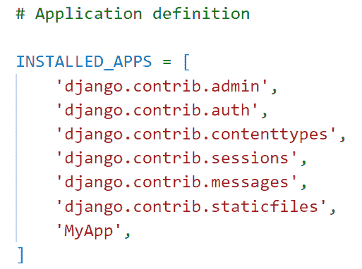
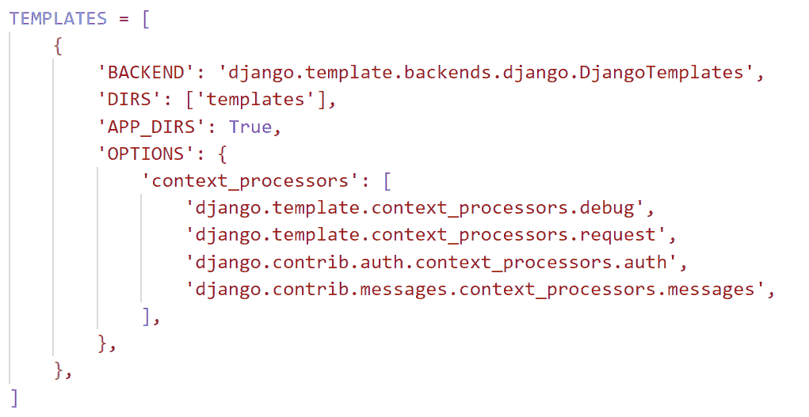
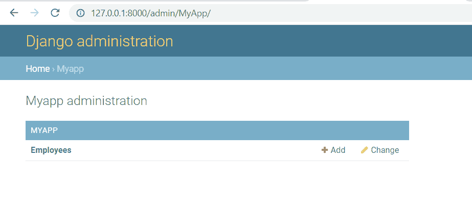
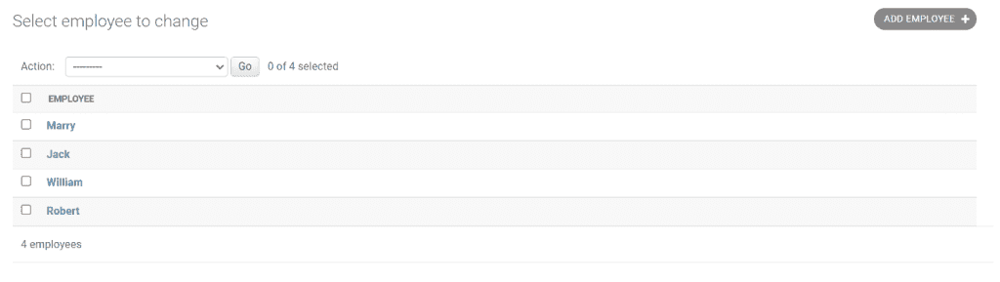
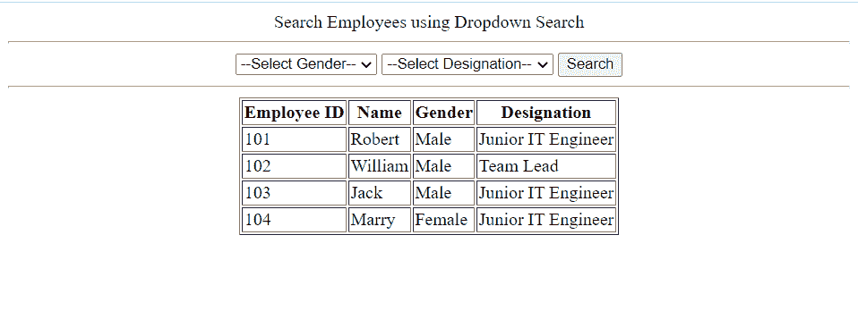
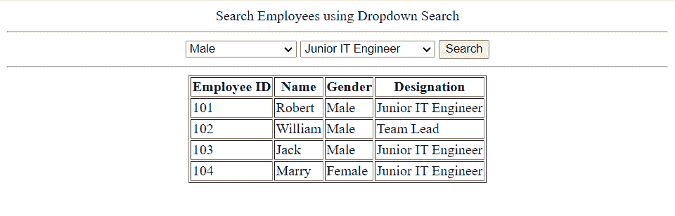
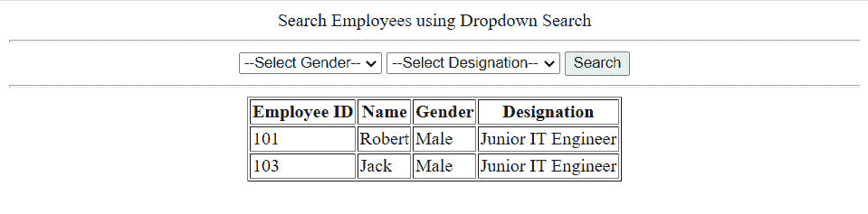

# 使用下拉过滤器的 Python Django 搜索

> 原文：<https://pythonguides.com/python-django-search-with-dropdown-filter/>

[](https://sharepointsky.teachable.com/p/python-and-machine-learning-training-course)

在这个 [Python Django 教程](https://pythonguides.com/what-is-python-django/)中，我将通过简单的步骤解释**如何在 Django** 中使用下拉过滤器进行搜索。

最近，我一直在使用 Django 框架创建一个网站。我需要一个下拉菜单来搜索特定标准的员工。

在这里我们将看到:

*   如何用简单的步骤建立 Django 项目
*   用下拉过滤器实现 Python Django 搜索
*   如何在 Django 中添加下拉菜单
*   创建基于函数的视图来呈现模板
*   如何在 Django 中创建模型
*   从 Django 管理界面添加数据

在本文的最后，您还可以使用 Django 在网站上下载带有下拉菜单的搜索代码。

目录

[](#)

*   [使用下拉过滤器的 Python Django 搜索](#Python_Django_search_with_dropdown_filter "Python Django search with dropdown filter")
    *   [Django 搜索框](#Django_Search_Box "Django Search Box")
    *   [如何在 Django 中创建下拉菜单进行搜索](#How_to_create_a_dropdown_menu_to_search_in_Django "How to create a dropdown menu to search in Django")
        *   [建立 Django 项目](#Set_up_Django_Project "Set up Django Project")
        *   [使用下拉过滤器创建 Python Django 搜索](#Create_a_Python_Django_search_with_dropdown_filter "Create a Python Django search with dropdown filter")
        *   [定义视图](#Define_View "Define View")
    *   [执行 Django 模型](#Execute_Django_Model "Execute Django Model")
    *   [从 Django 管理界面添加数据](#Add_data_from_the_Django_admin_interface "Add data from the Django admin interface")
    *   [执行 Django 应用程序](#Execute_Django_Application "Execute Django Application")
*   [下载 Python Django 搜索和下拉过滤器完整代码](#Download_Python_Django_search_with_dropdown_filter_complete_code "Download Python Django search with dropdown filter complete code")
*   [结论](#Conclusion "Conclusion")

## 使用下拉过滤器的 Python Django 搜索

现在，让我们首先了解什么是搜索框，并一步一步地学习在 Django 中添加下拉菜单进行搜索。

### Django 搜索框

搜索框、搜索栏或搜索栏是文件管理器、web 浏览器和其他计算机程序以及网站中常见的图形控制元素。

搜索框允许用户通过输入或从下拉菜单中选择来搜索指定的内容。

### 如何在 Django 中创建下拉菜单进行搜索

现在，我们将看到一个与创建下拉菜单相关的示例，该菜单根据员工的职务来搜索员工。

阅读:[如何设置 Django 项目](https://pythonguides.com/setup-django-project/)

#### 建立 Django 项目

要启动 Django 项目，请打开终端并输入以下命令。这里， `DropdownSearchProject` 是 Django 项目的名称。

```py
django-admin startproject DropdownSearchProject
```

它将创建一个名为 `DropdownSearchProject` 的文件夹，并在终端中输入下面的命令。

```py
cd DropdownSearchProject
```

通过在终端中键入下面的命令，在这个项目文件夹中创建一个名为 `MyApp` 的 Django 应用程序。

```py
python manage.py startapp MyApp
```

将应用名称添加到位于 `settings.py` 文件中的 `INSTALLED_APP` 列表中，以激活该应用。



Install App inside settings.py

默认情况下，Django 在项目目录中包含一个 `urls.py` 文件，用于将新构建的应用程序映射到其中。为此，在其中添加以下代码。

```py
from django.contrib import admin
from django.urls import path,include

urlpatterns = [
    path('admin/', admin.site.urls),
    path('',include('MyApp.urls')),
]
```

要在 Django 中创建模型，打开 app 目录中的 `models.py` 文件，并添加下面给出的代码。

```py
from django.db import models

# Create your models here.

class Employee(models.Model):
    emp_id=models.IntegerField(primary_key=True)
    name=models.CharField(max_length=150)
    gender=models.CharField(max_length=8)
    designation=models.CharField(max_length=150)
    def __str__(self):
        return self.name
    class Meta:
        db_table = 'Employee'
```

在这里，我们创建一个模型类**雇员**有以下字段。

1.  `emp_id` 是 Django IntegerField，并作为主键。
2.  **的名字**是姜戈·查菲尔德。这个字符字段有 150 个字符的限制。
3.  性别是姜戈·查菲尔德。此字符字段限制为 8 个字符。
4.  **的名称**是 Django CharField。这个字符字段有 150 个字符的限制。

并使用 `def __str__(self)` 来更改 Django 模型中对象的显示名称。当我们返回**自己的名字**时，它会将项目名称渲染为名称。我们还将模型的名称更改为 Employee。

将模型注册到管理站点，以便用户可以在管理应用程序中查看它。打开 `admin.py` 文件，添加下面给出的代码。

```py
from django.contrib import admin
from .models import Employee

# Register your models here.
admin.site.register(Employee)
```

阅读: [Python 改 Django 版本](https://pythonguides.com/python-change-django-version/)

#### 使用下拉过滤器创建 Python Django 搜索

在 Django 中，应用程序的**前端**是在模板中定义的，为此，在主项目目录中创建一个名为**模板**的子目录来存储所有的项目模板。

打开 `settings.py` 文件，更新 `DIRS` 指向 Templates 文件夹的位置。



settings.py

创建一个`home.html`文件来添加 HTML 代码，用于创建一个下拉菜单，以便在模板文件夹内的 Django 中进行搜索。

```py
<!DOCTYPE html>
<html lang="en">

<head>
    <meta charset="UTF-8">
    <meta http-equiv="X-UA-Compatible" content="IE=edge">
    <meta name="viewport" content="width=device-width, initial-scale=1.0">
    <title>Document</title>
</head>

<body>
    <center>
        Search Employees using Dropdown Search
        <hr>
        <form method="POST>">
            
            <select name="gender">
                <option selected disabled=true>--Select Gender--</option>
                <option>Male</option>
                <option>Female</option>
                <option>Other</option>
            </select>
            <select name="designation">
                <option selected disabled=true>--Select Designation--</option>
                <option>HR</option>
                <option>Team Lead</option>
                <option>Junior IT Engineer</option>
                <option>Senior IT Engineer</option>
            </select>
            <input type="submit" value="Search">
            <hr>
            <table border="1">
                <tr>
                    <th>Employee ID</th>
                    <th>Name</th>
                    <th>Gender</th>
                    <th>Designation</th>
                </tr>
                
                <tr>
                    <td>{{result.emp_id}}</td>
                    <td>{{result.name}}</td>
                    <td>{{result.gender}}</td>
                    <td>{{result.designation}}</td>
                </tr>
                
            </table>

        </form>

    </center>
</body>

</html>
```

*   我们将通过使用 `POST` 方法调用**表单**标签来呈现 HTML 文件。
*   为了保护页面免受黑客攻击，并使安全发送数据成为可能，我们在 form 元素中包含了 `csrf_token` 。
*   然后，我们将使用 `select` HTML 标签为**性别**和**称谓**字段创建一个下拉字段。
*   添加一个**搜索**按钮，根据使用下拉字段选择的性别和职位搜索员工。
*   然后，我们将使用带有 `border 1` 的**表**标签来存储**员工 Id** 、**姓名、` `性别**和**职务**。
*   在此之后，循环的**用于获取**数据**上下文，我们在**视图**文件中的**渲染**函数中传递该上下文。**

阅读: [Python Django 设置时区](https://pythonguides.com/python-django-set-timezone/)

#### 定义视图

要定义应用程序的主要逻辑，打开 `views.py` 文件并添加下面给出的代码。

```py
from django.shortcuts import render
from MyApp.models import Employee

# Create your views here.

def dropdownsearch(request):
    if request.method=="POST":
        searchgender=request.POST.get('gender')
        searchdesignation=request.POST.get('designation')
     empsearch=Employee.objects.filter(gender=searchgender,designation=searchdesignation)

        return render(request,'home.html',{"data":empsearch})
    else:
        displayemp=Employee.objects.all()

        return render(request,'home.html',{"data":displayemp}) 
```

*   创建一个名为 `dropdownsearch` 的视图，首先从 `models.py` 文件中导入**员工**。
*   之后，执行 **if 语句**确定请求方法是否为 `POST` 。
    *   如果是这样，只需使用**请求获取性别和名称。POST.get()** 。
    *   然后，我们使用 `empsearch` QuerySet 和 `filter` 方法返回**性别**和**称谓**。
    *   之后，我们使用**渲染**函数，该函数返回带有 `empsearch` 模型查询集对象的`home.html`文件。
*   如果请求方法是**则得到**。
    *   我们使用`display EMP`query set with`all`方法从模型中返回每个对象。
    *   在这之后，我们使用**渲染**函数，该函数返回带有 `displayemp` 模型查询集对象的`home.html`文件。

现在，我们必须用 URL 映射视图以便调用它，因此我们必须在 app 目录中创建一个名为 `urls.py` 的文件。包括下面的代码。

```py
from django.urls import path
from . import views

urlpatterns = [
path('', views.dropdownsearch, name='dropdownsearch'),
]
```

阅读: [Python Django vs ReactJS](https://pythonguides.com/django-vs-reactjs/)

### 执行 Django 模型

要创建包含模型表格模式代码的迁移文件，请在终端中键入以下命令。

```py
python manage.py makemigrations
```

要按照迁移文件的模式构建表，请执行以下命令。

```py
python manage.py migrate
```

### 从 Django 管理界面添加数据

要从 Django 管理界面添加雇员，首先我们必须创建一个管理员。在给定的命令下键入。

```py
python manage.py createsuperuser
```

然后，点击 `MYAPP` 下的**员工**。点击**添加**选项添加员工详细信息，然后点击**保存**按钮。



Admin Interface to add Employee

以下是员工名单。



List of all the employees

### 执行 Django 应用程序

要启动开发服务器，请在终端中键入下面给出的命令。

```py
python manage.py runserver
```

它将打开，页面以表格格式显示员工的详细信息。



Employee Details

现在，我想使用下拉菜单和搜索按钮搜索一名性别为男性、职务为初级 IT 工程师的员工。



Search employees using dropdown search

它将显示所有员工的性别男性和名称初级 It 工程师。



Gender=Male and Designation=Junior IT Engineer

这就是如何在 Python Django 中使用下拉过滤器进行搜索。

## 下载 Python Django 搜索和下拉过滤器完整代码

[Django Search with Dropdown Filter](https://pythonguides.com/wp-content/uploads/2023/01/DropdownSearchProject.zip)

## 结论

这样，我们就成功地创建了一个 Django web 应用程序，它可以使用下拉过滤器进行搜索。此外，我们已经学会了将 Django QuerySet 与 `filter()` 和 `all()` 方法一起使用。
此外，我们还讨论了以下主题。

*   如何用简单的步骤建立 Django 项目
*   用下拉过滤器实现 Python Django 搜索
*   如何在 Django 中添加下拉菜单
*   创建基于函数的视图来呈现模板
*   如何在 Django 中创建模型
*   从 Django 管理界面添加数据

您可能也喜欢阅读下面的 Python Django 教程。

*   [从 Python Django 中删除模式](https://pythonguides.com/how-to-delete-schema-from-python-django/)
*   [Python Django app 上传文件](https://pythonguides.com/django-app-upload-files/)
*   [Python Django MySQL CRUD](https://pythonguides.com/python-django-mysql-crud/)

[Tanya Puri](https://pythonguides.com/author/tanya/)

拥有丰富 Django 和 Matplotlib 经验的 Python 开发人员，目前在 TSInfo Technologies 工作。我正在成为专业程序员、博客写手和 YouTuber 的路上。