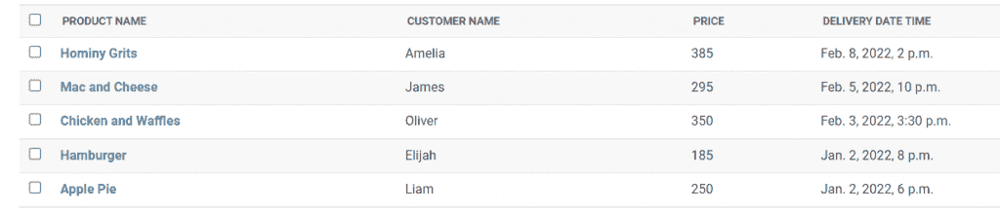
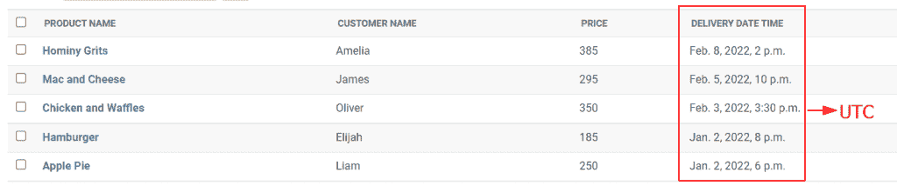
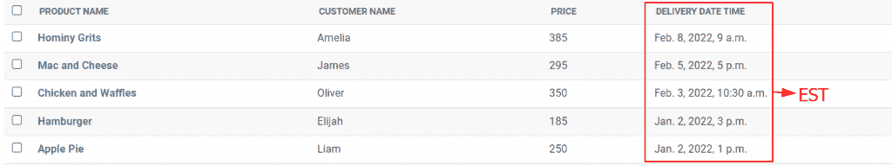
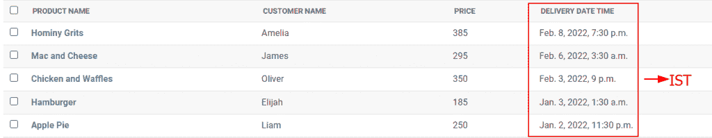
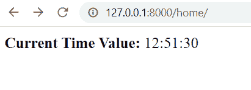
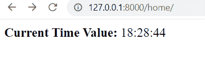

# Python Django 设置时区

> 原文：<https://pythonguides.com/python-django-set-timezone/>

[](https://sharepointsky.teachable.com/p/python-and-machine-learning-training-course)

在本 [Django 教程](https://pythonguides.com/what-is-python-django/)中，我们将了解**如何在 python Django** 中设置时区。我们还将讨论与 Django 时区相关的例子。这是我们将要涉及的主题列表。

*   Python Django 设置时区
*   Python Django 设置时区设置
*   Python Django 设置时区 UTC
*   Python Django 将时区设置为东部时间
*   Python Django 将时区设置为 IST
*   Python Django 为用户设置时区

目录

[](#)

*   [Python Django 设置时区](#Python_Django_set_timezone "Python Django set timezone")
*   [Python Django 设置时区设置](#Python_Django_set_timezone_settings "Python Django set timezone settings")
*   [Python Django 设置时区 UTC](#Python_Django_set_timezone_UTC "Python Django set timezone UTC")
*   [Python Django 将时区设置为东部时间](#Python_Django_set_timezone_to_EST "Python Django set timezone to EST")
*   [Python Django 将时区设置为 IST](#Python_Django_set_timezone_to_IST "Python Django set timezone to IST")
*   [Python Django 为用户设置时区](#Python_Django_set_timezone_for_user "Python Django set timezone for user")

## Python Django 设置时区

时区只是地球上的一个区域，每个人都在同一个时钟上。然而，由于所谓的夏令时，一个给定的时区可能不会全年遵循相同的时间。

因为这些问题，全球同意采用一个世界时间标准，不管你在哪里，也不管现在是一年中的什么时候，这个标准都是不变的。**协调世界时，或 UTC** ，是它的名字。

**比如我住在印度**，印度比 UTC 早 5 小时 30 分，所以这个时间是**UTC 晚上 10:32:10+5:30**。**格林威治时间下午 10:32:10+5:30**是另一种写法。GMT 和 UTC 在时间上没有区别；尽管如此，GMT 是一个时区，而 UTC 是一个时间测量标准。

另外，检查:[如何获得 Django 的当前时间](https://pythonguides.com/how-to-get-current-time-in-django/)

## Python Django 设置时区设置

为了在数据库中保存信息，Django 建议使用 UTC。即使您的网站只能在一个时区内访问，在数据库中存储 UTC 格式的数据仍然是一个不错的策略。夏令时是造成这种情况的主要原因。

夏令时是一种计时系统，在许多国家，时钟在春天向前推，在秋天向后推。如果你按当地时间工作，当时钟改变时，你很可能一年遇到两次问题。

您只需要在 Django 应用程序的 `settings.py` 中配置一些东西来设置时区。

```py
TIME_ZONE = '<Time zone of your choice>'
USE_TZ = True
```

默认情况下，时区是 UTC，而 T2 的使用 TZ 的时间被设置为真，这确保了在 Django 应用程序中使用 datetime . now()函数来创建 UTC 时间。

阅读:[如何在 Django 中创建模型](https://pythonguides.com/create-model-in-django/)

## Python Django 设置时区 UTC

现在，在本节中，我们将讨论如何将时区设置为 UTC。为了演示这个主题，我们使用 Django 中的**交付**模型。该模型包含以下数据。



Delivery Model

Django 的时区默认设置为 UTC。如果您的时区不是 UTC，您可以使用以下过程进行更改:

*   打开我们项目目录下的 setting.py 文件。
*   通过向下滚动文件可以找到国际化。
*   时区将出现在此下方。
*   将其设置为“UTC”。

**设置时区的命令:**

```py
TIME_ZONE='UTC'
```

现在，您可以启动服务器并登录到管理界面。之后，打开您的交付模型，您会注意到时间已经更改为 UTC。



TIME_ZONE = UTC

阅读: [Python Django 获取管理员密码](https://pythonguides.com/python-django-get-admin-password/)

## Python Django 将时区设置为东部时间

现在，在这一节中，我们将讨论如何将时区设置为美国东部时间。为了说明这个主题，我们使用 Django 中的**交付模型**。该模型包含以下数据，默认情况下，该模型中使用的时区是 UTC。


Delivery Model

要设置时区，首先必须在 Django 应用程序的 settings.py 中设置一些东西，如下所示:

**设置时区的命令:**

```py
TIME_ZONE = 'EST'
```

现在，您可以启动服务器并访问管理界面。当您打开您的交付模型时，您会看到时间已经更改为美国东部时间。

下面是输出，它清楚地显示了时区更改为美国东部时间。



TIME_ZONE = EST

阅读:[Django 模板中的 If 语句](https://pythonguides.com/if-statement-in-django-template/)

## Python Django 将时区设置为 IST

现在，在这一节中，我们将讨论如何将时区设置为 IST。为了说明这个主题，我们使用 Django 中的**交付模型**。该模型包含以下数据，默认情况下，该模型中使用的时区是 UTC。


Delivery Model

这里 IST 指的是印度标准时间，也就是亚洲/加尔各答的时区。而且，要设置时区，您必须首先在 Django 应用程序的 settings.py 中设置一些东西，如下所示:

**设置时区的命令:**

```py
TIME_ZONE = 'Asia/Kolkata'
```

现在，您可以启动服务器并访问管理界面。当您打开您的交付模型时，您会看到时间已经更改为 IST。

下面是输出，它清楚地显示时区更改为 IST。



TIME_ZONE = IST

阅读:[获取 Django 中的 URL 参数](https://pythonguides.com/get-url-parameters-in-django/)

## Python Django 为用户设置时区

在这一节中，我们将学习如何根据用户的本地时间戳为他们设置时区。如果您想在本地时区创建时间戳。在 Django 项目的 settings.py 文件中执行以下设置。

```py
USE_TZ = FALSE
```

如果您将 `USE_TZ` 设置为 `False` ，Django 会认为您的应用程序不关心时区。它指的是 Django 应用程序所在的位置；例如，如果您在本地计算机上运行它，它将使用该时间。

让我们看一个例子来清楚地理解这个概念:

默认情况下，时区设置为“UTC”，使用时区设置为“True”。因此，当我们获取时间时，它显示的是 UTC 时间。

`views.py` 文件:

```py
from django.http import HttpResponse
from django.utils import timezone

# Create your views here.

def home(request):
    current_time = timezone.now().strftime('%H:%M:%S')
    html = "<html><body><b>Current Time Value:</b> %s</body></html>" % 
            current_time
    return HttpResponse(html)
```

在上面的例子中，我们从 `django.utils` 模块中导入了**时区**类。接下来，我们创建了一个名为**家**的视图。在这个视图中，我们使用的是 **timezone.now()。strftime()** 方法将当前时间值存储在一个变量中。然后，我们使用变量返回当前时间值作为 HTTP 响应。

现在，如果我们运行开发服务器并移动到映射的 URL，我们将得到以下输出。



UTC Time Zone

现在，如果您将时区设置为“UTC ”,并且将时区设置为“False”。它将按照当地时区显示时间。在本例中，当地时区是亚洲/加尔各答。

`views.py` 文件:

```py
from django.http import HttpResponse
from django.utils import timezone

# Create your views here.

def home(request):
    current_time = timezone.now().strftime('%H:%M:%S')
    html = "<html><body><b>Current Time Value:</b> %s</body></html>" % 
current_time
    return HttpResponse(html)
```

现在，如果我们运行开发服务器并移动到映射的 URL，我们将得到以下输出。



Local Time Zone

你可能也喜欢阅读下面的 Django 教程。

*   [Python 列表追加 Django](https://pythonguides.com/python-list-append-django/)
*   [Python Django 随机数](https://pythonguides.com/django-random-number/)
*   [使用 Django 将 HTML 页面转换为 PDF](https://pythonguides.com/convert-html-page-to-pdf-using-django/)
*   [如何从 Django 的 get 请求中获取数据](https://pythonguides.com/get-data-from-get-request-in-django/)
*   [Python Django get–您需要知道的一切](https://pythonguides.com/python-django-get/)
*   [将 Python 输出到 html Django](https://pythonguides.com/outputting-python-to-html-django/)
*   [比较 Python Django 中的两个整数](https://pythonguides.com/compare-two-integers-in-python-django/)

在这个 Django 教程中，我们讨论了如何在 python Django 中设置时区。此外，我们还讨论了以下主题列表:

*   Python Django 设置时区
*   Python Django 设置时区设置
*   Python Django 设置时区 UTC
*   Python Django 将时区设置为东部时间
*   Python Django 将时区设置为 IST
*   Python Django 为用户设置时区

[Bijay Kumar](https://pythonguides.com/author/fewlines4biju/)

Python 是美国最流行的语言之一。我从事 Python 工作已经有很长时间了，我在与 Tkinter、Pandas、NumPy、Turtle、Django、Matplotlib、Tensorflow、Scipy、Scikit-Learn 等各种库合作方面拥有专业知识。我有与美国、加拿大、英国、澳大利亚、新西兰等国家的各种客户合作的经验。查看我的个人资料。

[enjoysharepoint.com/](https://enjoysharepoint.com/)[](https://www.facebook.com/fewlines4biju "Facebook")[](https://www.linkedin.com/in/fewlines4biju/ "Linkedin")[](https://twitter.com/fewlines4biju "Twitter")