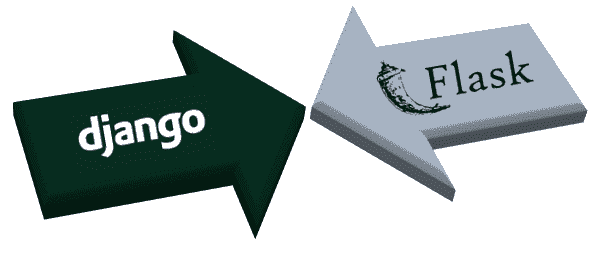

# Python Django 与 Flask 的主要区别

> 原文：<https://pythonguides.com/python-django-vs-flask/>

Django 和 Flask 都是非常流行的基于 python 的 **web 开发框架**。由于两者都用于相同的目的，在它们之间选择一个总是令人困惑。所以在本文中，我们将讨论 Django 和 Flask 之间的一些主要**差异。并且，我们也会试着去理解什么时候选择哪一个。**

本文中讨论的主题的详细列表如下。

*   Django 简介
*   姜戈的优势和劣势
*   烧瓶简介
*   烧瓶的优缺点
*   Python Django 与 Flask 的主要区别
*   Python Django vs Flask 性能

Django v/s Flask

所以，在直接讨论 python Django 和 Flask 之间的**差异之前。我们应该对什么是 Django，什么是 Flask 有一个基本的了解。我们先从了解 Django 开始。**

目录

*   [Django 简介](#Introduction_to_Django "Introduction to Django ")
*   [优点&姜戈的缺点](#Advantages_Disadvantages_of_Django "Advantages & Disadvantages of Django ")
    *   Django 的优势
    *   [姜戈的缺点](#Disadvantages_of_Django "Disadvantages of Django  ")
*   [烧瓶介绍](#Introduction_to_Flask "Introduction to Flask ")
*   [优点&烧瓶的缺点](#Advantages_Disadvantages_of_Flask "Advantages & Disadvantages of Flask ")
    *   [烧瓶的优点](#Advantages_of_Flask "Advantages of Flask ")
    *   [长颈瓶的缺点](#Disadvantages_of_Flask "Disadvantages of Flask")
*   [Python Django 与 Flask–主要区别](#Python_Django_vs_Flask_-_Key_Differences "Python Django vs Flask – Key Differences")
*   [Python Django vs Flask 性能](#Python_Django_vs_Flask_performance "Python Django vs Flask performance ")
*   [结论](#Conclusion "Conclusion")

## 姜戈简介

Django 是一个基于 python 的全栈 **web 开发框架**。它是一个遵循**模型-视图-模板** (MVT)架构的免费开源框架。现在，Django 提供了许多内置功能，所以作为开发人员，我们只需要构建业务逻辑。

现在如果想深入了解 Django，也可以参考下面这篇文章“[什么是 python Django](https://pythonguides.com/what-is-python-django/) ”。

## 优点&缺点姜戈

在这一节中，我们将讨论在我们的项目中使用 Django 框架的一些主要优点和缺点。

让我们先来看看使用 Django 框架的一些**主要优势。**

### 姜戈的优势

*   因为 Django 是基于 python 的，所以它的设置和使用很容易理解和实现。
*   我们还在一个 Django 项目中创建了多个 web 应用程序。
*   它是一个全栈框架，因此它包含许多有助于快速开发的内置特性和功能。例如认证系统、国际化系统等等。
*   它还提供了一个内置的管理界面，可用于一些管理任务。
*   Django 还提供端到端的应用测试。
*   对于大型网络项目来说，Djongo 是一个非常有效和可靠的框架。

### 姜戈的缺点

接下来，让我们了解一下在我们的项目中使用 Django 框架的一些缺点。

*   使用 Django，我们可以在一个项目中组合多个组件。但是同时处理多个组件可能会很复杂。
*   是全栈框架，所以学习曲线也高。
*   我们应该了解 Django ORM(对象关系映射器),以便与应用程序数据进行交互。
*   我们应该知道在 Django 中实现路由的正则表达式。
*   将 Django 用于小型项目可能会利用不足。

阅读:[如何设置 Django 项目](https://pythonguides.com/setup-django-project/)

## 烧瓶简介

Flask 也是一个基于 python 的 web 开发框架，但它是一个 T2 的极简框架。这个框架提供了开发 web 应用程序的基本特性，并且它也不依赖于任何外部库。Flask 还允许开发者添加库或插件作为扩展。它还提供了一组合理的易于使用的 API。

阅读 [Python Django 长度过滤器](https://pythonguides.com/python-django-length-filter/)

## 优点&缺点烧瓶

在这一节中，我们将讨论在我们的项目中使用 Flask 框架的一些主要优点和缺点。

让我们首先看看使用 Flask 框架的一些主要优点。

### 烧瓶的优点

*   flask 是 web 开发的微型框架，因此开发和维护网站非常容易。
*   在 Flask 中路由 URL 非常容易实现。
*   由于 flask 附带了基本的工具，所以这个框架的学习曲线很简单。
*   使用 Flask，数据库集成也非常简单和容易。
*   这是一个**极简的框架**,但是它非常强大，并且在互联网上有很多可用的资源。
*   这个框架在处理中小型应用程序时非常有效。

### 烧瓶的弊端

接下来，让我们了解一下在我们的项目中使用 Flask 框架的一些缺点。

*   使用 Flask 开发和维护非常大规模的应用程序可能是一项复杂的任务。
*   它附带了一组有限的工具和功能。
*   使用 Flask 维护一个复杂的网站可能成本很高。
*   它没有任何内置的管理界面。

阅读: [Python Tkinter 测验](https://pythonguides.com/python-tkinter-quiz/)

## Python Django 与 Flask–主要区别

现在，在这一节中，让我们讨论 Django 和 Flask 框架的一些关键区别。

1.  Django 于 2005 年推出，而 Flask 于 2010 年推出。
2.  Dango 是一个用于快速开发 web 应用程序的全栈 web 框架。而 Flask 是一个 WSGI 框架，用于开发简单易用的项目。
3.  Django 有一个单一的工作方法，而 Flask 有一个多样化的工作方法。
4.  Django 还提供动态 HTML 页面。但是，Flask 不支持动态 HTML 页面。
5.  Flask 中有 API 支持，但是 Django 中没有。
6.  Django 遵循标准的项目布局，但是 flask 却不遵循任何布局。
7.  Django 框架也支持第三方应用，但是 Flask 不支持任何第三方应用。

## Python Django vs Flask 性能

现在，在这一节中，我们将尝试理解这两个框架之间的性能差异。

说到开发速度，Django 比 Flask 表现更好。Django 旨在实现快速 web 开发的目标。而且 Django 也更擅长开发和维护大型 web 应用。因为它提供了非常广泛的工具和功能。此外，Django 还通过提供不同的安全特性来关注安全性，如认证系统、CSRF 令牌等。

在处理 JSON 响应时，Flask 更快。它有助于构建简单的小型 web 应用程序。由于它体积小、性能高，因此最适合中小型应用。

Read: [ModuleNotFoundError:没有名为 Django 的模块](https://pythonguides.com/modulenotfounderror-no-module-named-django/)

## 结论

最后，我想建议，如果你是 python 新手，并且想学习 web 开发，那么 Flask 是最好的选择。如果你是 python 的专业人士，想要构建一个高端的 web 应用程序，那么 Django 是最好的选择。

你可能也喜欢读下面的文章。

*   [Python Tkinter Image](https://pythonguides.com/python-tkinter-image/)
*   [Python Tkinter Colors](https://pythonguides.com/python-tkinter-colors/)
*   [python tkinter auto complete](https://pythonguides.com/python-tkinter-autocomplete/)
*   [Python Tkinter 主循环](https://pythonguides.com/python-tkinter-mainloop/)
*   [Python While 循环条件](https://pythonguides.com/python-while-loop-condition/)

因此，在本教程中，我们已经讨论了 Django 和 Flask 的主要区别。我们还讨论了以下主题。

*   Django 简介
*   姜戈的优势和劣势
*   烧瓶简介
*   烧瓶的优缺点
*   Python Django 与 Flask 的主要区别
*   Python Django vs Flask 性能

[Bijay Kumar](https://pythonguides.com/author/fewlines4biju/)

Python 是美国最流行的语言之一。我从事 Python 工作已经有很长时间了，我在与 Tkinter、Pandas、NumPy、Turtle、Django、Matplotlib、Tensorflow、Scipy、Scikit-Learn 等各种库合作方面拥有专业知识。我有与美国、加拿大、英国、澳大利亚、新西兰等国家的各种客户合作的经验。查看我的个人资料。

[enjoysharepoint.com/](https://enjoysharepoint.com/)