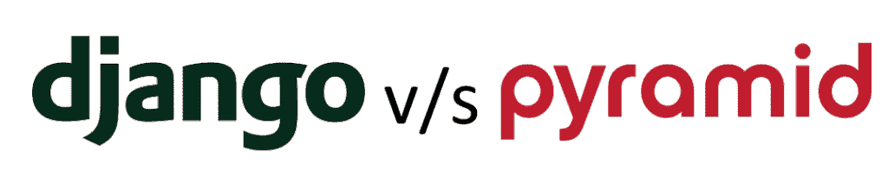

# Python Django vs 金字塔

> 原文：<https://pythonguides.com/python-django-vs-pyramid/>

[`Django`](https://pythonguides.com/what-is-python-django/) 和**金字塔**都是主要依赖 Python 的 **web 开发框架**。因为它们的目的是一样的，所以在它们之间做出选择总是一个挑战。因此，在本文中，我们将讨论 Django 和 Pyramid 之间的一些关键差异。并且，我们也会试着去了解哪一个更优越。

以下是本教程涵盖的主题的综合列表。

*   Django 简介
*   为什么是姜戈
*   金字塔简介
*   金字塔的特征
*   Python Django 与金字塔–主要区别
*   姜戈和金字塔哪个更好
*   结论

Python Django vs Pyramid

因此，在我们进入 python Django 和 Pyramid 之间的**差异之前。我们应该对 Django 和金字塔有一个基本的了解。让我们从学习姜戈开始。**

目录

*   [Django 简介](#Introduction_to_Django "Introduction to Django")
*   [为什么是姜戈](#Why_Django "Why Django")
*   [金字塔简介](#Introduction_to_Pyramid "Introduction to Pyramid")
*   [金字塔的特征](#Features_of_Pyramid "Features of Pyramid")
*   [Python Django vs Pyramid–主要区别](#Python_Django_vs_Pyramid_-_Key_Differences "Python Django vs Pyramid – Key Differences")
*   [姜戈和金字塔哪个更好](#Which_one_is_better_Django_or_Pyramid "Which one is better Django or Pyramid")
*   [结论](#Conclusion "Conclusion")

## Django 简介

Django 是一种 python 编程语言 **web 应用框架**。使用了 `MVT` (模型视图模板)设计模式。由于其快速开发特性和免费开源框架，Django 的需求量很大。

Django 通常被称为**“包含电池的框架”**，因为它为所有东西都提供了内置特性，比如 Django 管理界面和默认数据库 SQLlite3。

现在如果你想深入了解 Django，也可以参考下面这篇文章[什么是 Python Django](https://pythonguides.com/what-is-python-django/)。

## 为什么是姜戈

在这一节中，我们将讨论在我们的项目中使用 Django 框架的一些主要原因。

*   高可扩展性。
*   优秀的文档。
*   顶级的跨国公司和企业都在用。
*   最简单易懂的框架。
*   飞速的发展。
*   大型支持性社区。
*   Django 为您提供了现成的组件，比如用户认证、网站管理面板、表单和上传文件的机制等等。
*   最后但同样重要的是，Django 基于 Python，它提供了一个大的库和特性。所有这些都可以与一个 web 应用程序集成，从而实现广泛的高级功能。

另外，检查:[如何安装 Django](https://pythonguides.com/how-to-install-django/)

## 金字塔简介

Python 微框架不需要使用任何特定的工具或模块。例如，您可以灵活地选择自己喜欢的数据库。微框架可能更适合小规模的应用程序。

**金字塔**是 **Python 微框架**之一。它是一个基于 python 的通用 **web 应用开发轻量级框架**。与 Flask 或其他“微型”容器不同，Pyramid 有许多与众不同的特性和功能。

它构建在 **WSGI 框架**之上。很简单，受 Zope，Pylons，Django 的影响。这座金字塔之前被称为 `repoze.bfg` 。

简单地说，我们将讨论 `WSGI` 。它是 web 服务器和应用程序之间的接口。它的目的是为不同的服务器和框架相互通信提供一种标准化的方式，允许在必要时从开发环境切换到生产环境。

阅读:[如何设置 Django 项目](https://pythonguides.com/setup-django-project/)

## 金字塔的特征

在这一节中，我们将讨论在我们的项目中使用金字塔框架的一些主要特征。

*   它是使用最广泛的 Python web 框架。
*   它有助于小型和大型项目的成功。
*   支持微框架和单文件 web 应用程序。
*   它有预安装的会话。
*   它基于 Pylons/Zope/Django。
*   它允许您管理事务。
*   支持同步请求。
*   不强迫任何人使用任何特定的项目架构。
*   可以用一些第三方模块来增强。
*   很好的例子和文档。

阅读:[Django 中的应用程序和项目之间的差异](https://pythonguides.com/django-app-vs-project/)

## Python Django vs Pyramid–主要区别

在这一节中，让我们看看 Django 和 Pyramid 框架之间的一些显著差异。

| 参数 | 姜戈 | 金字塔 |
| --- | --- | --- |
| 放 | Django 于 2005 年获释。 | 金字塔于 2008 年发布。 |
| 作者 | 阿德里安·霍洛瓦蒂和西蒙·威廉森是《姜戈》的作者。 | 克里斯·麦克多诺是《金字塔》的作者。 |
| 基于 | Django 是一个用于快速开发 web 应用程序的全栈 web 框架。 | Pyramid 是为开发大型项目而构建的 WSGI 框架。 |
| 类型 | Django 是 web 应用程序开发的大型框架。 | 金字塔是一个 web 应用程序微框架。 |
| 使用人 | Django 被 Instagram，Pinterest，Coursera，Udemy 使用。 | 金字塔被 Reddit，YOU-app，Kalibrr，SurveyMoney，NewCars.com 使用。 |
| 设计 | Django 提供了大量的电池和组件供开发人员快速构建定制的 web 应用程序。 | 金字塔允许开发人员选择合适的工具，以更灵活的方式构建 web 应用程序。 |
| 灵活性 | 在使用 Django 时，Web 开发人员可以使用模板系统和对象关系映射器(ORM)系统，以及内置的安全措施。 | 金字塔没有模板系统或 ORM 系统。它使程序员能够为每个项目选择合适的模板系统和 ORM 系统。 |
| 数据库ˌ资料库 | Django 支持流行的关系数据库管理系统，如 MySQL、Oracle、PostgreSQL，甚至 NoSQL。 | 另一方面，Pyramid 允许 web 开发人员使用 SQLAlchemy，这是一个强大的 Python 数据库工具包。 |
| 管理支持 | Django 包括一个基于网络的管理门户，界面友好。它允许程序员通过在浏览器中对模型进行 CRUD 操作来快速测试。 | 金字塔没有管理网站，但第三方工具是可用的。 |
| 编码 | Django 将每个项目视为独立应用程序的集合。 | Pyramid 将整个 web 应用程序开发项目视为单个文件。 |
| 自举
技术 | Django 的 bootstrapping 方法允许程序员通过执行某些命令来创建应用程序。 | Pyramid 不要求程序员遵循精确的代码，但它确实建议他们使用支架来实现一个自举方法。 |

Python Django vs Pyramid

## 姜戈和金字塔哪个更好

现在，在这一节中，我们将尝试了解两个框架中哪一个更好。

如果您正在创建一个基于健壮的 MVT 的应用程序，Django 可能是理想的选择，因为它允许您快速创建一个原型并将其发展成一个完全可操作的服务。

然而，如果您的项目需要最高性能，或者您不希望框架的假设限制您实现项目的特定需求，那么使用**金字塔**是一个绝妙的主意。

阅读:[如何在 Django 中创建模型](https://pythonguides.com/create-model-in-django/)

## 结论

最后，我想建议，如果你是编程新手，你想学习 web 开发，那么金字塔是最好的选择，因为它提供了选择数据库和模板的灵活性。如果你是一个专业的程序员，想开发一个高端的 web 应用，那么 Django 是最好的选择。

另外，看看更多的 Django 教程。

*   [如何获取 Django 的当前时间](https://pythonguides.com/how-to-get-current-time-in-django/)
*   [获取 Django 中的 URL 参数](https://pythonguides.com/get-url-parameters-in-django/)
*   [Python Django 格式日期](https://pythonguides.com/python-django-format-date/)
*   [Python Django 长度过滤器](https://pythonguides.com/python-django-length-filter/)
*   [Python 改 Django 版本](https://pythonguides.com/python-change-django-version/)
*   [Django 从 POST 请求中获取所有数据](https://pythonguides.com/django-get-all-data-from-post-request/)

因此，在本教程中，我们已经讨论了 Python Django 和 Pyramid 的主要区别。我们还讨论了以下主题。

*   Django 简介
*   为什么是姜戈
*   金字塔简介
*   金字塔的特征
*   Python Django 与金字塔–主要区别
*   姜戈和金字塔哪个更好
*   结论

[Bijay Kumar](https://pythonguides.com/author/fewlines4biju/)

Python 是美国最流行的语言之一。我从事 Python 工作已经有很长时间了，我在与 Tkinter、Pandas、NumPy、Turtle、Django、Matplotlib、Tensorflow、Scipy、Scikit-Learn 等各种库合作方面拥有专业知识。我有与美国、加拿大、英国、澳大利亚、新西兰等国家的各种客户合作的经验。查看我的个人资料。

[enjoysharepoint.com/](https://enjoysharepoint.com/)