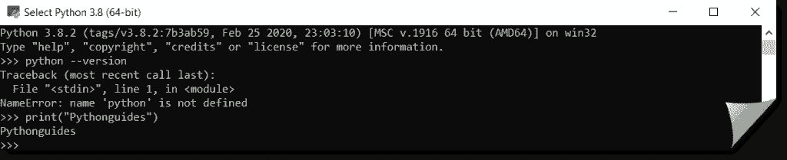

# Python 下载和安装步骤(Windows 10/Unix/Mac/Ubuntu/CentOS)

> 原文：<https://pythonguides.com/python-download-and-installation/>

[](https://sharepointsky.teachable.com/p/python-and-machine-learning-training-course)

在本 Python 教程中，我们将讨论 **Python 下载和安装步骤**。此外，我们将涵盖以下内容。：

*   下载 Python
*   如何在 windows 10 上安装 python？
*   如何在 Linux 上安装 python？
*   在 Ubuntu 16.10 和 17.04 上安装 Python 3.6
*   如何在 Ubuntu 上安装 Python 3.8？
*   Python 3 在 mac 上的安装
*   如何在 CentOS 7 上安装 Python 3？
*   如何卸载 Python 2.7
*   Python 禁用路径长度限制

也可以查看[中一篇非常好的文章 python 是如何工作的？](https://pythonguides.com/python-programming-for-the-absolute-beginner/)。

如果你想学习 Python 和机器学习，可以查看 [Python 和机器学习培训课程](https://pythonguides.com/python-and-machine-learning-training-course/)。

目录

[](#)

*   [如何在 windows 上安装 python？](#How_to_install_python_on_windows "How to install python on windows?")
*   [如何在 Linux 上安装 python？](#How_to_install_python_on_Linux "How to install python on Linux?")
*   [在 Ubuntu 16.10 和 17.04 上安装 Python 3.6](#Install_Python_36_on_Ubuntu_1610_and_1704 "Install Python 3.6 on Ubuntu 16.10 and 17.04")
*   [如何在 Centos 的 Ubuntu 上安装 Python 3.8？](#How_to_install_Python_38_on_Ubuntu_Centos "How to install Python 3.8 on Ubuntu, Centos?")
*   [Python 3 在 mac 上的安装](#Python_3_Installation_on_mac "Python 3 Installation on mac")
*   [如何在 CentOS 7 上安装 Python 3？](#How_to_Install_Python_3_on_CentOS_7 "How to Install Python 3 on CentOS 7?")
*   [在 CentOS 7 / CentOS 8 上安装 Python 3.8](#Install_Python_38_on_CentOS_7_CentOS_8 "Install Python 3.8 on CentOS 7 / CentOS 8")
*   [Python ide 和代码编辑器](#Python_IDEs_and_Code_Editors "Python IDEs and Code Editors")
*   [什么是 ide 和代码编辑器？](#What_are_IDEs_and_Code_Editors "What are IDEs and Code Editors?")
    *   [1- PyCharm:](#1-_PyCharm "1- PyCharm:")
    *   [2- Spyder](#2-_Spyder "2- Spyder")
    *   [3- Visual Studio](#3-_Visual_Studio "3- Visual Studio")
    *   [4- Visual studio 代码](#4-_Visual_studio_code "4- Visual studio code")
    *   [5-崇高的文字](#5-_Sublime_Text "5- Sublime Text")
    *   [6- Atom](#6-_Atom "6- Atom")
    *   [7-托纳](#7-_Thonny "7- Thonny")
*   [如何卸载 Python 2.7](#How_to_Uninstall_Python_27 "How to Uninstall Python 2.7")
*   [Python 禁用路径长度限制](#Python_disable_path_length_limit "Python disable path length limit")
*   [结论](#Conclusion "Conclusion")

## 如何在 windows 上安装 python？

大家来讨论一下， Python 3.8.2 在 Windows 10 中下载安装。请按照以下步骤操作。

Installing Python on Windows

第一步:

打开 [Python 官方网站](https://www.python.org/downloads/)下载 Python 更新版本。2020 年 4 月的当前版本是 3.8.2。


download python

第二步:

现在，点击“Windows”链接下载 python Windows 版。


download python 3.8.2

第三步:

从 Python 稳定版 3.8.2 版本部分，点击**下载**“Windows x86-64 可执行安装程序”。现在 Python-3.8.2-amd64.exe 文件可以下载了。将该文件复制到您的桌面或其他位置。

第四步

现在双击下载的文件。下面的窗口将会打开。点击**立即安装**。


Install Python

确保选中底部的为所有用户安装启动器(推荐)和将 Python 3.8 添加到路径复选框。

第五步:

**您是否要允许此应用程序更改您的设备**。请点击“是”选项。然后安装将开始。


install python 3.8.2

第六步:

现在下面的弹出窗口将打开说“安装成功”。


install python in windows 10

第七步:

如果您将在您的机器中搜索 Python，将显示 `Python 3.8` (64 位)。现在，如果你双击下面的终端将会打开。


现在让我们检查一下我的系统中安装的确切的 **python 版本**。检查我是否输入了以下命令

```py
python --version
```

但不幸的是，我得到了以下错误

Traceback(最近一次调用 last):
文件"< stdin >，第 1 行，在<模块>
**name 错误:名称' python '未定义**


为什么会有这个错误？

实际上，我们正在尝试通过运行命令“python”来启动 Python 解释器。

然而，解释器已经启动。它**将 python** 解释为一个变量的名称，该名称在此处未定义，因此它显示“名称 python 未定义”。

但是不要担心 python 安装正确。为了验证这一点，我输入了 print("pythonguides ")，得到了预期的输出" pythonguides "。



现在，在这种情况下，我们可以通过两种方式看到 python 版本

1-请在 **python 终端**中输入下面一行代码

```py
import sys

mypythonversion = 0x600
mypythonversion = sys.version[:5]
print("%s%s" %("my python version is: ", mypythonversion))
```

现在看下面的截图，它显示我的 python 版本是“python 3.8.2”。


2-这里查看 **python 版本**的另一种方法是打开**系统命令提示符**并输入下面的命令。您可以看到它将显示版本为 Python 3.8.2。

```py
python --version
```


阅读[编程初学者指南](https://pythonguides.com/beginners-guide-to-programming/)

## **如何在 Linux 上安装 python？**

请按照以下步骤在 Linux 上进行 Python 下载和安装。

如果你是第一次在你的系统中构建这个软件，你应该安装 build-essentials，bzip2，SQLite 作为先决条件，否则你会在 python 的安装过程中出错。如果你之前已经做过，那么你可以忽略下面的三个步骤。

第一步:

打开终端，输入命令“sudo apt-get install build-essential”。这将在您的系统中安装所有的构建软件包。

第二步:

现在在终端上输入命令“Sudo apt-get install libbz2-dev”。这将安装所需的 bzip2 支持。

第三步:

现在在终端上输入命令“Sudo apt-get install libsqlite3-dev”。这将安装 SQ Lite 支持，这也是需要的。

现在你已经完成了先决条件。现在按照下面的步骤

第一步:

打开 [Python 官方网站](https://www.python.org/downloads/)下载 Python 更新版本。2020 年 4 月的当前版本是 3.8.2。但是你想下载哪个版本取决于你自己。

点击“Linux\Unix”链接，下载需要的版本。

第二步:

将有许多版本，所以点击你需要的版本。它将被下载为 Python 版本并保存在您的本地文件夹中。双击它将提取并复制到文件夹 Python-version。

注意:这里的版本是你下载的 python 版本(例如:3.8.2，所以你的文件夹\文件名将是 Python-3.8.2)

第三步:

现在打开终端，然后输入下面的命令。现在它会指向你下载的文件所在的文件夹。

```py
CD Python-version
```

第四步:

现在输入下面的命令并按回车键，然后等待一段时间。一旦系统检查完毕，你就可以进入下一步了。

```py
./configure
```

第五步:

现在输入下面的命令并按回车键。Linux 将制造 python 软件。

```py
make
```

第六步:

现在在你的终端输入下面的命令。这将在您的系统中安装 Python。

```py
sudo make altinstall
```

注意:根据您的 Linux 版本，一些命令可能会有所不同。

阅读[人工智能完全指南](https://pythonguides.com/complete-guide-to-artificial-intelligence/)

## 在 Ubuntu 16.10 和 17.04 上安装 Python 3.6

我们来讨论一下如何**在 Ubuntu 16.10 和 17.04 上安装 Python 3.6** 。 `Python 3.6` 默认存在于 Ubuntu 16.10 和 17.04 的资源库中。所以请按照下面的步骤找到更新并**安装 python 3.6** 。

第一步:

首先打开系统中的终端。

第二步:

现在检查更新。请使用下面的命令

```py
sudo apt update
```

第三步:

使用下面的命令**在你的机器上安装 python 3.6** 。

```py
sudo apt install python3.6
```

第四步:

现在确保你的机器上安装了正确的版本。您可以使用下面的命令检查 python 的版本。

```py
python3.6 -V
```

您将得到如下输出

```py
Python 3.6.0
```

## 如何在 Centos 的 Ubuntu 上安装 Python 3.8？

下面我们来讨论一下 **Python 3.8 下载** 和在 Ubuntu 上安装的步骤。现在最新版本是 3 . 8 . 2(2020 年 4 月)。同样，请遵循以下步骤。

在开始实际安装之前，我们需要安装必备组件，否则在安装过程中会显示很多错误。

第一步:

打开终端并运行以下命令。这将下载并安装安装所需的软件包。

```py
sudo apt update
sudo apt install build-essential zlib1g-dev libncurses5-dev libgdbm-dev libnss3-dev libssl-dev libreadline-dev libffi-dev wget
```

第二步:

打开 [Python 官方网站](https://www.python.org/downloads/)下载 python 3.8 版本。点击“Linux\Unix”链接，下载 3.8 版本。

第三步:

它将被下载为 Python 版本并保存在您的本地文件夹中。双击它将提取并复制到文件夹 Python-3.8。

第四步:

现在打开终端，然后输入下面的命令。现在它会指向你下载的文件所在的文件夹。

```py
CD Python-3.8
```

第五步:

现在输入下面的命令并按回车键，等待一段时间。一旦系统检查完毕，你就可以进入下一步了。

```py
./configure
```

第六步:

现在在你的终端输入下面的命令。这将在您的系统中安装 Python。

```py
sudo make altinstall
```

第七步:

现在确保你的机器上安装了正确的版本。您可以使用下面的命令检查 python 的版本。

```py
python3.8 -V
```

您将获得以下输出。

```py
Python 3.8.2
```

## Python 3 在 mac 上的安装

这里讨论一下**如何在 macOS 上安装 Python 3**？在开始实际安装之前，我们需要安装一些必要的先决条件。

第一步:

打开您的终端并键入以下命令来安装 XCode。这是需要的。

```py
xcode-select --install
```

第二步:

现在我们需要安装自制软件。要安装它，请在您的终端中运行以下命令

```py
ruby -e "$(curl -fsSL https://raw.githubusercontent.com/Homebrew/install/master/install)"
```

第三步:

现在打开您的终端并输入下面的命令，它将在您的 mac 上安装最新版本的 python 3

```py
brew install python3
```

第四步:

要确认 mac 上安装的 python 版本，请键入以下命令

```py
python3 --version
```

它将显示最新的 python 版本作为输出。

## 如何在 CentOS 7 上安装 Python 3？

这里讨论一下如何通过 CentOS 7 的包管理器 Yum 安装 Python 3。在 Centos 7.7 中，存储库中提供了 Python 3。因此，让我们遵循以下步骤

第一步:

要更新环境，请使用下面的命令。

```py
yum update -y
```

第二步:

现在我们需要进行 python 的实际安装。为此，请使用下面的命令。

```py
yum install -y python3
```

第三步:

现在要确保 python3 安装正确，请运行下面的命令。这将显示安装在您机器上的 python3 版本。

```py
python3
```

## 在 CentOS 7 / CentOS 8 上安装 Python 3.8

下面就来讨论一下在 Centos 7 / Centos 8 上 Python 3.8 下载和安装的步骤。请按照以下步骤操作。

第一步:

我们需要在实际安装 python 之前安装所需的包。为此，请运行以下命令。

```py
sudo yum -y groupinstall "Development Tools"
sudo yum -y install openssl-devel bzip2-devel libffi-devel
```

第二步:

打开 [Python 官方网站](https://www.python.org/downloads/)下载 python 3.8 版本。点击“Linux\Unix”链接，下载 3.8 版本。

第三步:

它将被下载为 Python 版本并保存在您的本地文件夹中。双击它将提取并复制到文件夹 Python-3.8。

第四步:

现在打开终端，然后输入下面的命令。现在它会指向你下载的文件所在的文件夹。

```py
CD Python-3.8
```

第五步:

现在输入下面的命令并按回车键，等待一段时间。一旦系统检查完毕。

```py
sudo ./configure --enable-optimizations
```

第六步:

现在在你的终端输入下面的命令。这将在您的系统中安装 Python。

```py
sudo make altinstall
```

第七步:

现在来验证您已经正确安装了 python 3.8 版本。请使用下面的命令。

```py
python3.8 --version
```

您将获得以下输出

```py
Python 3.8.2
```

现在我们正在不同的操作系统中安装 python 3。因此，我们需要开始开发活动的下一步是，我们需要安装一个 IDE 或代码编辑器，在那里我们将编写和执行我们的代码。

## Python ide 和代码编辑器

我们将讨论开发 python 所需的不同 python IDEs 和代码编辑器。

## 什么是 ide 和代码编辑器？

当我们开始使用任何编程语言时，我们需要一些工具或编辑器来编写和执行我们的程序。

IDE 无非就是一个**“集成开发环境”**。这是一个为软件开发而设计的软件。该工具有助于轻松编写、设计和调试代码。

当你得到一个错误时，你可以放一个调试器，一行一行地检查问题是从哪里来的。不仅如此，IDE 还会突出显示代码，并具有自动建议功能等。

其中，代码编辑器是简单的文本编辑器，可以突出代码语法，也可以轻松地格式化代码。

很少有好的代码编辑器也能支持调试。

如果您使用 python 进行普通编程，那么您可以选择一个好的代码编辑器，而不是使用 IDE。但是如果你正在使用 python 构建任何复杂的项目，那么 IDE 是最好的选择。

市场上有许多 ide 和代码编辑器。有些是通用的，支持多种语言，少数只能用于 python 开发。

### **1-皮查姆** :

Pycharm 是 python 最好的开发 IDE 之一。

这个 IDE 有很多好的特性，比如代码编辑器、错误突出显示功能、代码调试功能，还支持源代码控制。

Pycharm 有付费(专业)版和免费开源(社区)版。

这是一个简单的 IDE，支持 Windows、Linux 和 Mac 平台。

下面讨论一下 Windows 10 中免费的 pycharm 社区版 2020.1 的安装步骤。

第一步:

从[官方网站](https://www.jetbrains.com/pycharm/download/#section=windows)下载 Pycharm 可执行文件。点击社区选项下的“下载”按钮。


第二步:

将下载 Python-community-2020.1 文件。复制到一个适当的位置，例如桌面或任何驱动器，然后双击该文件。当系统询问“是否允许此应用程序更改您的设备？”时，单击“是”

第三步:

将出现下面的弹出窗口，请单击下一步。


第四步:

现在将出现下面的弹出窗口，请再次单击下一步按钮。


第五步:

现在你会看到下面的弹出窗口，如果你想要一个桌面快捷方式，选中复选框 64 位启动器，然后单击下一步。


第六步:

现在看到下面弹出选择 JetBrains 并点击安装


第七步:

现在您可以看到安装正在进行中。请等待它 100%完成。


第八步:

现在，如果您想立即运行 Pycharm 社区版本，您可以选中该选项，或者单击 Finish 按钮。


第九步:

现在您的安装已经完成。在你的电脑中搜索 Pycharm，点击它，你会看到下面的弹出窗口。选中复选框，然后单击继续。


第十步:

将出现下面的弹出窗口。点击“不发送”按钮。


步骤 11:

现在 IDE 将像下面这样打开，只需点击“跳过剩余的默认设置”按钮。


第 12 步:祝贺你，现在这是 Pycharm IDE 版本 2020.1。


### `2-Spyder`

Spyder 最好的一点是，它是一个开源的 Python IDE。

Spyder 拥有所有 ide 提供的所有公共特性，比如代码编辑、语法高亮、自动完成等。

Spider 主要面向使用 python 的数据科学家，因为它可以很好地集成常见的 Python 数据科学库，如 SciPy、NumPy 等。

对于 python 开发来说，它看起来非常简单易用。

### `3- Visual Studio`

Visual studio 是微软的又一个集成开发环境。这是一个非常实用的 IDE，具有所有的功能，如代码编辑器、突出显示错误、自动完成、智能感知支持、调试功能等等。

这是一个具有完全加载功能的 IDE。你可以用这个 IDE 做任何你想做的事情。

这不仅适用于 python，它还支持其他语言，如微软。网络等。

visual studio 有免费版(社区版)和付费版(专业版和企业版)。目前的版本 vs 是截至目前的 2019。


### **4- Visual studio 代码**

Visual studio 代码是一个代码编辑器，可以用于 python 开发。这不仅对 python 有意义，它也支持其他语言。

主要用于许多脚本语言以及 share point 框架开发目的。

VSC 的另一个好处是它是一个开源工具，有很多功能，比如语法高亮、括号匹配、自动缩进、框选等等。


### **5-崇高文字**

这是另一个用于 python 开发的代码编辑器。

它具有所有常见的功能，如自动完成、选择多行、格式化、语法高亮等

它支持许多包，这使得崇高的文本编辑器非常丰富。

Sublime Text 不是完全免费的，你可以免费使用评估版，但与付费版相比，它的功能较少。

### `6- Atom`

Atom 主要用于开发许多使用 HTML、javascript、CSS 等的桌面应用程序。但是您需要安装一个扩展，然后只有您能够使用 Atom 进行 python 开发。

这是一个轻量级的工具，您可以在许多平台上安装它。唯一不同的是，与其他编辑器相比，它的内置功能更少。

### `7-Thonny`

Thonny 是一个可以用来开发 python 的 IDE。

它主要面向编写 python 编程的初学者。

它具有调试、突出语法错误、自动完成、可变范围突出显示等功能

## 如何卸载 Python 2.7

要从 windows 中卸载 Python 2.7，请按照以下步骤操作:

1.  **打开开始**–首先点击屏幕左下角的 windows 标志。将出现一个菜单。
2.  **打开设置**–点击开始菜单左下方的设置图标。这将打开设置窗口。
3.  **点击应用程序**–点击应用程序。
4.  **找到您想要卸载的 python 2.7 版本****——向下滚动，直到您找到带有“python 2.7”名称的应用程序。**
5.  ****点击 Python 2.7 版本**——然后展开显示**卸载**按钮。**
6.  ****点击卸载**–在 2.7 版本上**
7.  ****出现提示**时点击是——点击**是**并确认你要卸载 python。**
8.  ****允许 python 卸载**–弹出一个带进度条的窗口，一旦进度条到达末尾，Python 就应该被卸载了。**

 **## Python 禁用路径长度限制

在 windows 10 最新更新中有一个路径长度的设置选项，请按照以下步骤操作:

1.  首先，进入开始菜单，输入**“regedit”**
2.  然后转到路径**“HKEY _ LOCAL _ MACHINE \ SYSTEM \ current Control set \ Control \ file SYSTEM**
3.  之后双击右侧的**长文件路径**。
4.  会出现一个弹出窗口，在**长路径` `中启用**类型**值数据【1】**。
5.  现在，这将允许限制通过。
6.  如果需要再次设置限制，将值设置为**“0”**到**禁用路径长度限制**。

您可能会喜欢以下 Python 教程:

*   [如何在 python 中连接字符串](https://pythonguides.com/concatenate-strings-in-python/)
*   [什么是 Python，Python 的主要用途是什么？](https://pythonguides.com/python-programming-for-the-absolute-beginner/)
*   [如何在 python 中使用命名约定](https://pythonguides.com/python-naming-conventions/)
*   [为什么 python 如此受欢迎？python 为什么会蓬勃发展？](https://pythonguides.com/python-programming-for-the-absolute-beginner/)
*   [python 是如何工作的？python 是如何解读的？](https://pythonguides.com/python-programming-for-the-absolute-beginner/)
*   [用 Python 创建列表](https://pythonguides.com/create-list-in-python/)

## 结论

[Python](https://www.python.org/) 是最流行的开源面向对象编程语言。Python 很容易学，语法上也很简单。

我们可以在不同的操作系统上安装 python，如 windows、Linux、Ubuntu、Mac、CentOS7 等。

我们了解了用于 python 开发的不同 IDE 和代码编辑器，如 Pycharm、Spyder、Atom、Visual Studio、visual studio code、Sublime Text、Thonny 等

2020 年 4 月最新的 python 版本是 3.8.2。

Python 是最好的！！！！！

本 python 教程解释了以下几点:

*   如何在 windows 10 上安装 python？
*   如何在 Linux 上安装 python？
*   在 Ubuntu 16.10 和 17.04 上安装 Python 3.6？
*   如何在 Ubuntu 上安装 Python 3.8？
*   Python 3 在 Mac 上的安装。
*   如何在 CentOS 7 上安装 Python 3？
*   Python IDEs 和代码编辑器
*   如何卸载 Python 2.7
*   Python 禁用路径长度限制

[Bijay Kumar](https://pythonguides.com/author/fewlines4biju/)

Python 是美国最流行的语言之一。我从事 Python 工作已经有很长时间了，我在与 Tkinter、Pandas、NumPy、Turtle、Django、Matplotlib、Tensorflow、Scipy、Scikit-Learn 等各种库合作方面拥有专业知识。我有与美国、加拿大、英国、澳大利亚、新西兰等国家的各种客户合作的经验。查看我的个人资料。

[enjoysharepoint.com/](https://enjoysharepoint.com/)[](https://www.facebook.com/fewlines4biju "Facebook")[](https://www.linkedin.com/in/fewlines4biju/ "Linkedin")[](https://twitter.com/fewlines4biju "Twitter")**