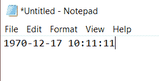
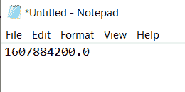
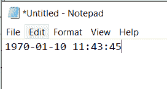
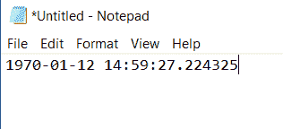
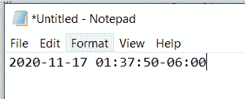
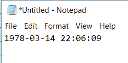
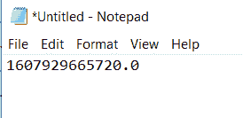
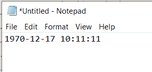
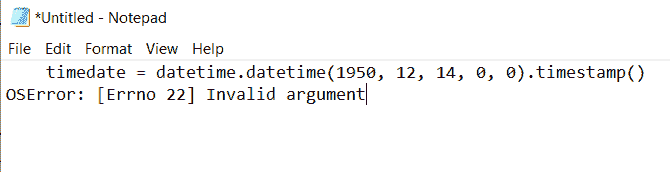

# Python 纪元到日期时间+示例

> 原文：<https://pythonguides.com/python-epoch-to-datetime/>

[](https://sharepointsky.teachable.com/p/python-and-machine-learning-training-course)

在这篇 [python tutoria](https://pythonguides.com/python-hello-world-program/) l 中，您将通过几个例子了解到 **Python 纪元到日期时间**。Python epoch 用于将 epoch 转换为日期和时间。这里我们将检查 **:**

*   Python 日期时间到纪元时间
*   python 纪元到日期时间字符串
*   python 纪元到日期时间毫秒
*   python 纪元到日期时间时区
*   python Unix 纪元到日期时间
*   python 纪元日期时间到毫秒
*   python 纪元时间戳到日期时间
*   python 纪元日期时间年份超出范围

目录

[](#)

*   [什么是 Python 纪元](#What_is_Python_epoch "What is Python epoch")
*   [Python 纪元到日期时间](#Python_epoch_to_DateTime "Python epoch to DateTime")
*   [Python 日期时间到纪元时间](#Python_DateTime_to_epoch_time "Python DateTime to epoch time")
*   [Python 纪元到日期时间字符串](#Python_epoch_to_datetime_string "Python epoch to datetime string")
*   [Python 历元到日期时间毫秒](#Python_epoch_to_DateTime_milliseconds "Python epoch to DateTime milliseconds")
*   [Python 纪元到日期时间时区](#Python_epoch_to_DateTime_timezone "Python epoch to DateTime timezone")
*   [Python Unix 历元到日期时间](#Python_Unix_epoch_to_DateTime "Python Unix epoch to DateTime")
*   [Python 纪元日期时间到毫秒](#Python_epoch_DateTime_to_milliseconds "Python epoch DateTime to milliseconds")
*   [Python 纪元时间戳到日期时间](#Python_epoch_timestamp_to_datetime "Python epoch timestamp to datetime")
*   [Python 纪元日期时间年份超出范围/Python 无效参数](#Python_epoch_datetime_year_is_out_of_rangePython_Invalid_argument "Python epoch datetime year is out of range/Python Invalid argument")

## 什么是 Python 纪元

纪元时间也称为 **Unix 时间、POSIX 时间、**和 `Unix` 时间戳。纪元时间是指自**1970 年 1 月 1 日起经过的秒数，不包括闰秒**。Unix 时间有 10 位数字。Unix 时间可以同时表示所有时区。

## Python 纪元到日期时间

让我们看看下面这个关于 **Python epoch 到 DateTime** 的例子。

示例:

```py
import datetime
epochtime = 30256871
datetime = datetime.datetime.fromtimestamp(epochtime)
print(datetime) 
```

在这个例子中，我已经导入了 `datetime` **包**，并将变量作为纪元时间，并将值作为变量，如秒数，并使用`DateTime . DateTime . from timestamp(epochtime)`方法将**纪元时间转换为 DateTime** 。

下图显示了输出:



## Python 日期时间到纪元时间

现在，让我们看看如何从 Python DateTime 中获取纪元时间。

在下面的例子中，我传递了日期时间，它返回了纪元时间。

示例:

```py
import datetime
timedate = datetime.datetime(2020, 12, 14, 0, 0).timestamp()
print(timedate)
```

在这个例子中。我用了时间戳函数。

下图显示了输出:



Python DateTime to epoch time

## Python 纪元到日期时间字符串

让我们来看一个例子，我们将传递纪元时间，它将为我们提供 Python 中字符串格式的日期时间。

示例:

```py
import datetime
ts = datetime.datetime.fromtimestamp(800025)
print(ts.strftime('%Y-%m-%d %H:%M:%S'))
```

在这个例子中，为了将 epoch 转换为 date time，我从 datetime 模块中获取了函数 `fromtimestamp()` 来从 Unix 时间戳中获取一个日期。

这个 `fromtimestamp()` 函数以时间戳作为输入，给出 DateTime 作为输出。 `strftime` 是一个以字符串格式返回日期和时间的字符串。

我们使用 `Python strftime()` 将日期和时间转换成字符串。

*   %Y 表示年份
*   %m 表示月份
*   %d 表示日期
*   %H 表示一个小时
*   %M 表示月份
*   %S 表示秒

下图显示了输出。



Python epoch to datetime string

## Python 历元到日期时间毫秒

现在，让我们看看如何在 Python 中从纪元时间获得毫秒的日期时间。

示例:

```py
import datetime

millseconds = 984567.224325
datetime = datetime.datetime.fromtimestamp(millseconds)

print(datetime)
```

在这里，我用 Python 将时间戳函数中的**转换为毫秒格式的**隐蔽纪元。****

下图显示了输出。



Python epoch to DateTime milliseconds

## Python 纪元到日期时间时区

```py
from datetime import datetime
import pytz
tz = pytz.timezone('CST6CDT')
datetz = tz.localize(datetime(2020, 11, 17, 1, 37, 50), is_dst=None)
print(datetz)
```

在这个例子中，pytz 包被导入。要获取给定时区的当前日期，需要使用 tz = pytz.timezone('CST6CDT ')。

以 DateTime 的形式获取给定时区中当天的开始时间，其中 timezone datetz = tz，localize(datetime(2020，11，17，1，37，50)，is_dst=None)是传递给 localize 的标志。

见下文:



Python epoch to DateTime timezone

## Python Unix 历元到日期时间

这与上面的例子是一样的，我们传递 Unix 纪元时间，它以日期时间格式给出我们。

示例:

```py
import datetime
print(datetime.datetime.fromtimestamp(int("258741369")).strftime('%Y-%m-%d %H:%M:%S'))
```

在这个例子中。我使用了`str time`()这是一个返回日期和时间的字符串方法。

下图显示了输出。



## Python 纪元日期时间到毫秒

现在，让我们看看如何以纪元格式从 Python DateTime 中获取毫秒。

```py
from datetime import datetime

date_obj = datetime.strptime('14.12.2020 12:37:45,72',
                           '%d.%m.%Y %H:%M:%S,%f')
milliseconds = date_obj.timestamp() * 1000

print(milliseconds)
```

理想情况下， `date_obj.timestamp()` 将以秒为单位返回日期。为了得到毫秒，我们需要乘以 1000。

下图显示了输出。



Python epoch DateTime to milliseconds

## Python 纪元时间戳到日期时间

让我们看看如何**将 epoch 时间戳转换为 datetime** 。

示例:

```py
import datetime
epochtime = 30256871
datetime = datetime.datetime.fromtimestamp(epochtime)
print(datetime) 
```

下图显示了输出:



Python epoch timestamp to datetime

## Python 纪元日期时间年份超出范围/Python 无效参数

在使用 Python epoch datetime 时，我得到了以下错误，即 Python epoch datetime year 超出范围或 **Python 无效参数**。

示例:

```py
import datetime
timedate = datetime.datetime(1950, 12, 14, 0, 0).timestamp()
print(timedate)
```

在这个例子中，我选择了不在时间戳范围内的 1950 年。因此，对于这个输出，将会出现一个错误，在下图中显示为**无效参数。**



要修复**无效参数**错误，请将日期从 1950 年更改为 `1970` 之后的任何日期。

您可能会喜欢以下 Python 教程:

*   [Python 将变量写入文件+示例](https://pythonguides.com/python-write-variable-to-file/)
*   [Python 3 pickle typeerror 需要一个类似字节的对象，而不是“str”](https://pythonguides.com/python-3-pickle-typeerror-a-bytes-like-object-is-required-not-str/)
*   [Python 二分搜索法和线性搜索](https://pythonguides.com/python-binary-search/)
*   [Python 点积和叉积](https://pythonguides.com/python-dot-product/)
*   [Python 退出命令(quit()、exit()、sys.exit())](https://pythonguides.com/python-exit-command/)
*   [Python 输入和 raw_input 函数](https://pythonguides.com/python-input-and-raw_input-function/)
*   [Python 中的排序算法](https://pythonguides.com/sorting-algorithms-in-python/)
*   [在 Python 中使用 JSON 数据](https://pythonguides.com/json-data-in-python/)
*   [Python 将字符串写入文件](https://pythonguides.com/python-write-string-to-a-file/)
*   [Python 将列表写入文件](https://pythonguides.com/python-write-list-to-file/)
*   [如何用 Turtle 创建 Python 中的贪吃蛇游戏](https://pythonguides.com/snake-game-in-python/)
*   [如何在 Python 中将 dictionary 转换成 JSON](https://pythonguides.com/convert-dictionary-to-json-python/)

在这里，我们学习了如何将 **Python epoch 转换成 DateTime** 。

[Bijay Kumar](https://pythonguides.com/author/fewlines4biju/)

Python 是美国最流行的语言之一。我从事 Python 工作已经有很长时间了，我在与 Tkinter、Pandas、NumPy、Turtle、Django、Matplotlib、Tensorflow、Scipy、Scikit-Learn 等各种库合作方面拥有专业知识。我有与美国、加拿大、英国、澳大利亚、新西兰等国家的各种客户合作的经验。查看我的个人资料。

[enjoysharepoint.com/](https://enjoysharepoint.com/)[](https://www.facebook.com/fewlines4biju "Facebook")[](https://www.linkedin.com/in/fewlines4biju/ "Linkedin")[](https://twitter.com/fewlines4biju "Twitter")