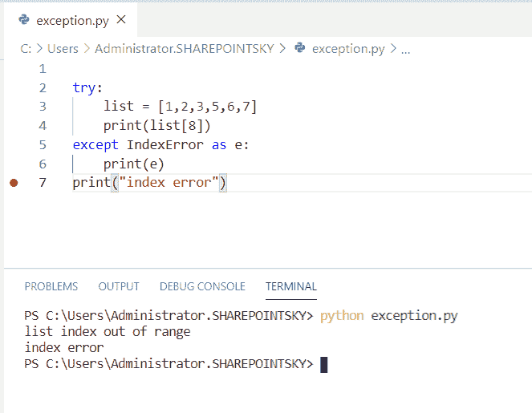

# Python 异常处理(示例)

> 原文：<https://pythonguides.com/python-exceptions-handling/>

[](https://sharepointsky.teachable.com/p/python-and-machine-learning-training-course)

在本 [Python 教程](https://pythonguides.com/python-programming-for-the-absolute-beginner/)中，我们将学习 **Python 异常处理**，我们还将涵盖以下主题:

*   什么是例外？
*   Python 中的错误类型
*   Python 语法错误
*   Python 异常处理示例
*   试用示例
*   except 的示例
*   关于 try、except 和 else 的示例
*   最终尝试的示例
*   异常处理关键字
*   引发异常
*   提出一个错误
*   提高值错误
*   关于 KeyError 的示例
*   键盘中断错误示例
*   溢出错误示例
*   IndexError 示例
*   名称错误示例
*   ImportError 示例
*   AssertionError 示例
*   attributeerror 示例

目录

[](#)

*   什么是例外？
*   [Python 中的错误类型](#Types_of_error_in_Python "Types of error in Python")
*   [Python 语法错误](#Python_Syntax_Error "Python Syntax Error")
*   [Python 异常处理示例](#Python_Exceptions_Handling_Examples "Python Exceptions Handling Examples")
    *   [Python 中的 try 示例](#Example_on_try_in_Python "Example on try in Python")
    *   [Python 中 except 的例子](#Examples_of_except_in_Python "Examples of except in Python")
    *   [Python 中的 try、except 和 else 示例](#Example_on_try_except_and_else_in_Python "Example on try, except and else in Python")
    *   [Python 中 try-finally 的例子](#Example_of_try-finally_in_Python "Example of try-finally in Python")
*   [异常处理关键字](#Exception_handling_keyword "Exception handling keyword")
*   [在 Python 中引发异常](#Raise_an_exception_in_Python "Raise an exception in Python")
*   [在 Python 中引发错误](#Raise_an_error_in_Python "Raise an error in Python")
*   [提升 Python 中的值错误](#Raise_valueError_in_Python "Raise valueError in Python")
    *   [Python 中 KeyError 的例子](#Example_on_KeyError_in_Python "Example on KeyError in Python")
    *   [Python 中键盘中断错误的例子](#Example_on_KeyboardInterrupt_Error_in_Python "Example on KeyboardInterrupt Error in Python")
    *   [Python 中溢出错误的例子](#Example_on_OverflowError_in_Python "Example on OverflowError in Python")
    *   [Python IndexError 示例](#Python_IndexError_Example "Python IndexError Example")
    *   [Python 名称错误示例](#Python_NameError_Example "Python NameError Example")
    *   [Python 导入错误示例](#Python_ImportError_Example "Python ImportError Example")
    *   [Python 中 AssertionError 的例子](#Example_on_AssertionError_in_Python "Example on AssertionError in Python")
    *   [Python 中 AttiributeError 的例子](#Example_on_AttiributeError_in_Python "Example on AttiributeError in Python")

## 什么是例外？

异常是在一段代码执行过程中发生的错误。运行时的错误称为异常，异常的原因是输入不正确。

## Python 中的错误类型

| 断言错误 | 当 assert 语句失败时，就会出现这种情况 |
| 属性错误 | 当属性分配失败时，就会出现这种情况 |
| 浮点错误 | 当浮点运算失败时，就会发生这种情况 |
| 存储器错误 | 当操作内存不足时，就会出现这种情况 |
| 索引错误 | 当订单超出范围时，就会出现这种情况 |
| notimplemontederror | 它的发生是因为抽象方法 |
| NameError | 当在局部或全局范围内找不到变量时 |
| KeyError | 当在字典中找到该键时，就会出现这种情况 |
| 导入错误 | 当导入的模块不存在时，会出现这种情况 |
| 零除法误差 | 当第二个操作数为 0 时出现 |
| 发电机出口 | 当发生器的闭合()为 |
| 溢出误差 | 当算术运算的结果太大时，就会发生这种情况 |
| 内建 Error | 当缩进不正确时会出现这种情况 |
| 埃费罗尔 | 它发生在 input()函数在文件条件中结束时 |
| 句法误差 | 当出现语法错误时，就会发生这种情况 |
| TabError | 当不一致的空格或制表符 |
| ValueError | 当函数得到一个正确的参数和一个不正确的值时，就会发生这种情况 |
| TypeError | 当功能或操作不正确时，就会出现这种情况 |
| 系统误差 | 当解释器检测到内部错误时，就会出现这种情况 |

Types of errors in Python

*   当错误发生异常被调用时，python 将停止它并生成错误消息。

异常由 **try、**T2 处理，最后由和**处理。**

*   try–它检查代码块中的错误
*   例外–它处理错误
*   最后，它执行代码。

## Python 语法错误

现在，我们可以看到 Python 中的**语法错误**。

*   在这个例子中，我使用了 try 来检查块中的错误，因为错误出现在 `print(hello)` 的语法中。
*   except 用作 **except SyntaxError 用作 e** 。执行 except。

示例:

```py
try:
  print(hello)
except SyntaxError as e:
  print("Invalid syntax")
except:
    print("Invalid syntax")
```

随着 except 的执行，我们可以看到输出为**“无效语法”**。您可以参考下面的输出截图。


Python Syntax Error

## Python 异常处理示例

现在，让我们看看 **Python 异常处理**的各种例子。

### Python 中的 try 示例

现在，我们可以使用 python 中的 try 来检查一个**示例。**

在本例中，我使用了 try 来检查块中的错误，因为错误出现在 `print(a+b)` 中。执行 except。

示例:

```py
try:
  print(a+b)
except:
  print("exception occured")
```

在下面的截图中，我们可以看到输出为发生了异常**。**


Example on try

### Python 中 except 的例子

这里，我们可以用 Python 中的 except 来**检查这个例子。**

*   在本例中，我使用了 try 来检查块中的错误，因为这里没有定义 x，所以错误出现在 `print(x)` 中。
*   except 被用作 `except TypeError` ，except 被执行。所以，除了:**打印(“错误”)**被执行。

示例:

```py
try:
  print(x)
except TypeError:
  print("x is not defined")
except:
  print("Error")
```

随着 except 的执行，我们可以看到输出为**“Error”**。下面的屏幕截图显示了输出:


Examples of except

### Python 中的 try、except 和 else 示例

在这里，我们可以看到 Python 中 try 上的**示例，except 和 else** 。

*   在这个例子中，我已经打开了 try 块中的文件，以检查该文件是否包含错误或者没有找到该文件。
*   在使用 except else 语句之后使用 `except IOError` 如果文件不存在且内容未写入其中，则 else 将执行。

示例:

```py
try:
   file = open("sushma.txt", "w")
   file.write("This is the test file")
except IOError:
   print("No file found")
else:
   print("The content is not written in the file")
   file.close()
```

我们可以看到 else 被执行为"**内容没有被写入文件**作为输出。您可以参考下面的输出截图。


Example on try, except and else

### Python 中 try-finally 的例子

这里我们可以看到 Python 中 try finally 的**例子。**

*   在本例中，我使用了 try 来检查块中的错误，因为这里没有定义 x，所以错误出现在 `print(x)` 中。
*   当 finally 块出现时，finally 被执行。如果我们使用 finally 块，无论异常是否发生，finally 总是被执行。
*   甚至除此之外的版块也最终得到印刷。

示例:

```py
try:
  print(x)
except:
  print("x is not defined")
finally:
  print(" The finally is executed")
```

下面的屏幕截图显示了输出:


Python try finally

## 异常处理关键字

Python 使用 `try` 和 `except` 关键字来处理异常。

## 在 Python 中引发异常

*   raise 关键字用于引发异常。
*   引发异常需要异常类的名称。
*   内置错误被隐式引发，内置异常可以被强制。

在本例中，我取了一个**数= 2** ，如果使用了条件，则与错误消息一起写入提升值错误。

示例:

```py
number = 2
if number < 36:
    raise ValueError('The given number is less than 36')
```

下面的屏幕截图显示了作为 valueError 的输出以及错误消息。


Raise an exception in Python

## 在 Python 中引发错误

现在，我们可以看到**如何在 python 中引发错误**。

*   在这个例子中，我将一个变量作为 num，并将一个 char 指定为“hello”。
*   使用 if 条件时，if not type(x)是 int。如果条件不为 true，则会引发错误。

示例:

```py
num = "python"
if not type(num) is int:
  raise TypeError("Only integers are allowed")
```

由于条件不成立，我们可以看到一个**类型错误**作为输出。你可以参考下面的截图。


Raise an error in Python

## 提升 Python 中的值错误

现在，我们可以看到**如何在 python 中引发 ValueError** 。

*   在这个例子中，我取了一个变量作为数字，并赋予**数字= 5** ，if 条件用作 **if 数字< 19。**
*   由于分配的数字小于 19，通过使用**增加值错误(‘数字不应小于 19’)**增加值错误。

示例:

```py
number = 5
if number < 19:
    raise ValueError('number should not be less than 19')
```

您可以在下面的屏幕截图中看到输出错误。


Raise valueError in Python

### Python 中 KeyError 的例子

现在，我们可以**看看 python 中 KeyError** 的例子。

*   在这个例子中，我将一个字典作为 `Rate` 并分配键和值对，以输入使用 input 语句的值。
*   try 块用于检查字典中是否出现任何错误，即使发现错误也要执行，但使用了 except KeyError。

示例:

```py
Rate = { 'bottle' : 5, 'chair' : 1200, 'pen' : 50}
item = input('Enter the item: ')
try:
   print(f'The rate of {item} is {Rate[item]}')
except KeyError:
    print(f'The price of {item} is not found')
```

由于字典中没有汽车这一项，我们可以看到输出，因为汽车的价格在下面的截图中找不到。


Example on KeyError in Python

### Python 中键盘中断错误的例子

在这里，我们可以看到 python 中键盘中断错误的**示例。**

*   在这个例子中，我使用了 try 块来检查错误。这里我使用了**InP = input(" Enter the input:")**来获取输入。
*   如果用户输入任何单词，如果用户输入 ctrl+c，则不会发生异常，除非执行。

示例:

```py
try:
    inp = input("Enter the input:")
    print ('Press Ctrl+c')
except KeyboardInterrupt:
    print ('Caught KeyboardInterrupt')
else:
    print ('No exception occurred')
```

我们可以看到两个输出，其中一个输入为 book，那么输出为**无异常` `发生**，当输入为**【ctrl+c】**时，输出为**【捕获键盘中断】。**你可以参考下面的输出截图。


Example on KeyboardInterrupt Error in Python

### Python 中溢出错误的例子

现在，我们可以**检查 python 中 OverflowError** 的例子。

*   在本例中，我将一个变量设为 `i` 并将 `i=1` 赋值，并使用 try 块检查错误，我将一个变量设为 **num = 2.5`i` 执行乘法运算。
*   循环的**用于迭代，当乘法的结果大于给定范围时，出现**溢出错误**，当出现错误时，执行 except。**

示例:

```py
i=1
try:
  num = 2.5**i
  for i in range(20):
      print(i, num)
      num = num**8 
except OverflowError as e:
          print('Overflowed after ', num, e)
```

随着 except 的执行，我们可以看到输出在给定范围后溢出。您可以参考下面的输出截图。


Example on OverflowError in Python

### Python IndexError 示例

现在，我们可以看到 python 中 IndexError 的**示例。**

*   在这个例子中，我使用了 try 块来检查错误。这里我取了一个列表，赋值 **list = [1，2，3，5，6，7]** 。
*   为了打印列表中的值，我使用了 print(list[8])，8 是索引值。
*   由于列表包含范围 5 以内的值，但值为 8，因此出现错误。
*   因此，except 被用作 **except IndexError 被用作 e** 并且 except 被执行。

示例:

```py
try:
    list = [1,2,3,5,6,7]
    print(list[8])
except IndexError as e:
    print(e)
print("index error")
```

随着 except 的执行，我们可以看到输出为索引错误。您可以参考下面的输出截图:



Example on IndexError in Python

### Python 名称错误示例

在这里，我们可以看到 python 中关于 NameError 的例子。

*   在这个例子中，我在代码块中使用了 try to error 来打印单词 cat，因为在 **print(cat)中有一个错误。**
*   except 被赋值为 `except NameError` ，except 被执行。

示例:

```py
try:
    print(cat)
except NameError:  
    print ("NameError:'cat' is not defined")
else:  
    print ("word found no error")
```

当发现错误时，除了作为 **NameError 执行之外:“cat”没有被定义为输出**。下面的屏幕截图显示了输出


Example on NameError in Python

### Python 导入错误示例

现在，我们可以看到 python 中 ImportError 的**示例。**

*   在这个例子中，我导入了一个名为 **sys，**的模块，并使用一个 try 块来检查错误。
*   我从 cv 中导入了一个名为 **math 的模块，因为该模块中存在错误。所以，except 被用作**的 except**除外。**

示例:

```py
import sys
try:
    from cv import math
except Exception:
    print("improper module") 
```

由于导入时出现错误，except 被执行，我们可以看到一个不正确的模块作为输出。您可以参考下面的输出截图。


Example on ImportError in Python

### Python 中 AssertionError 的例子

在这里，我们可以看到 python 中 AssertionError 的**例子。**

*   在这个例子中，我使用了 try 块来检查块中的错误，a=5，b=5
*   当条件给定为**时断言 a！= b** ，因为条件不成立。AssertionError 发生异常给出为**异常 AssertionError** 。否则，执行 else 条件..

示例:

```py
try:  
    a = 5
    b = 5
    assert a != b
except AssertionError:  
        print ("Exception Error")
else:  
    print ("Success, no error!")
```

当异常发生时，我们可以看到输出为**“异常错误”**。你可以参考下面的截图。


Example on AssertionError in Python

### Python 中 AttiributeError 的例子

现在，我们可以**看到 python 中 attribute error**的例子。

*   在这个例子中，我将一个类作为**类属性**并传递参数对象，变量被声明为 num = 5。
*   我使用 try 块来检查代码块中的错误，except 被用作 `except AttributeError` 因为错误存在，except 被执行。

示例:

```py
class Attributes(object):
    num = 5
    print(num)
try:
    object = Attributes()
    print (object.attribute)
except AttributeError:
    print ("Attribute Exception")
```

随着 except 的执行，我们可以在下面的截图中看到输出为**“属性异常”**。


Example on AttiributeError in Python

您可能会喜欢以下 Python 教程:

*   [Python Tkinter Map()函数](https://pythonguides.com/python-tkinter-map-function/)
*   [Python 将图像保存到文件](https://pythonguides.com/python-save-an-image-to-file/)
*   [如何使用 Python Tkinter 创建日期时间选择器](https://pythonguides.com/create-date-time-picker-using-python-tkinter/)
*   [Python 获取目录中的所有文件](https://pythonguides.com/python-get-all-files-in-directory/)
*   [如何使用 Python Tkinter 读取文本文件](https://pythonguides.com/python-tkinter-read-text-file/)
*   [如何在 Python 中将 dictionary 转换成 JSON](https://pythonguides.com/convert-dictionary-to-json-python/)
*   [如何在 python 中创建变量](https://pythonguides.com/create-python-variable/)

在本教程中，我们已经学习了 **Python 异常处理**，并且我们已经涵盖了以下主题:

*   什么是例外？
*   错误类型
*   Python 语法错误
*   Python 异常处理示例
*   试用示例
*   except 的示例
*   关于 try、except 和 else 的示例
*   最终尝试的示例
*   异常处理关键字
*   引发异常
*   提出一个错误
*   提高值错误
*   关于 KeyError 的示例
*   键盘中断错误示例
*   溢出错误示例
*   IndexError 示例
*   名称错误示例
*   ImportError 示例
*   AssertionError 示例
*   AttiributeError 示例

[Bijay Kumar](https://pythonguides.com/author/fewlines4biju/)

Python 是美国最流行的语言之一。我从事 Python 工作已经有很长时间了，我在与 Tkinter、Pandas、NumPy、Turtle、Django、Matplotlib、Tensorflow、Scipy、Scikit-Learn 等各种库合作方面拥有专业知识。我有与美国、加拿大、英国、澳大利亚、新西兰等国家的各种客户合作的经验。查看我的个人资料。

[enjoysharepoint.com/](https://enjoysharepoint.com/)[](https://www.facebook.com/fewlines4biju "Facebook")[](https://www.linkedin.com/in/fewlines4biju/ "Linkedin")[](https://twitter.com/fewlines4biju "Twitter")