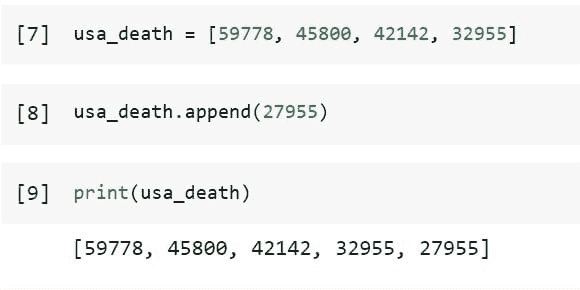
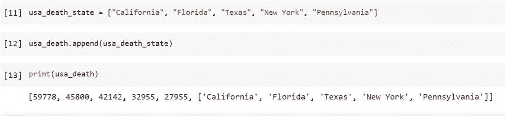
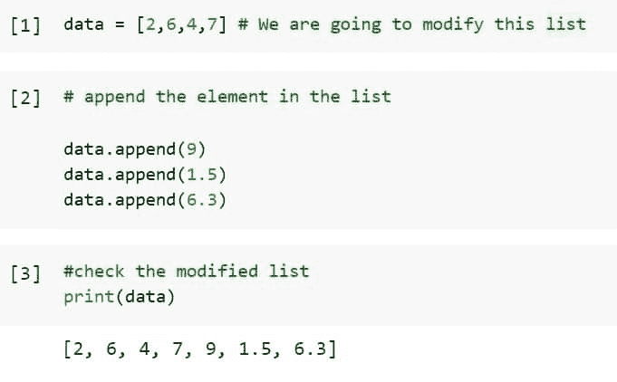
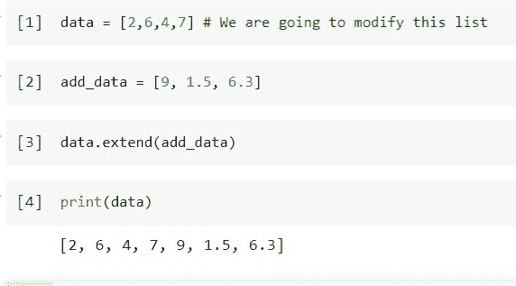
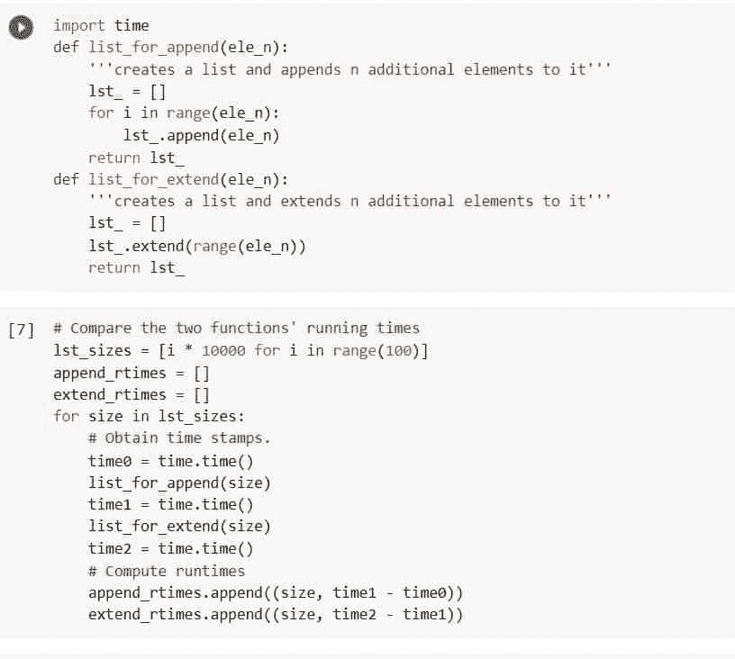
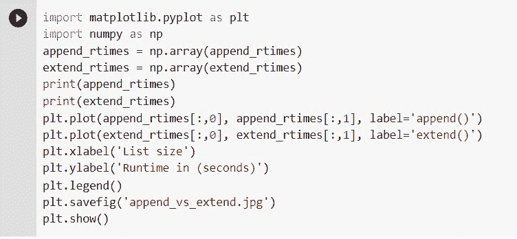
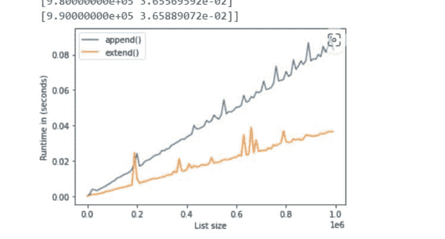

# Python 扩展与追加[主要区别]

> 原文：<https://pythonguides.com/python-extend-vs-append/>

[](https://sharepointsky.teachable.com/p/python-and-machine-learning-training-course)

如果我们想了解如何使用 Python 中的***【append()***和 *`extend()`* 函数以及它们的区别，我们就到了正确的地方。在我们的 Python 项目中，我们无疑会使用这些健壮的列表方法。

*   Python 扩展与追加
*   如何使用 extend vs append 在列表中添加元素
*   扩展函数和追加函数哪个更快

目录

[](#)

*   [Python 扩展 Vs 追加](#Python_Extend_Vs_Append "Python Extend Vs Append")
*   [Python 扩展 Vs 追加列表](#Python_Extend_Vs_Append_List "Python Extend Vs Append List")
    *   [Python 中的 Append 方法](#Append_method_in_Python "Append method in Python")
    *   [Python 中的扩展方法](#Extend_method_in_Python "Extend method in Python")
*   [Python 扩展 Vs 追加速度](#Python_Extend_Vs_Append_Speed "Python Extend Vs Append Speed")

## Python 扩展 Vs 追加

以下是 Python 的 add()和 extend()方法之间的区别:

*   使用 append()函数将单个元素添加到列表的末尾。
*   extend()方法添加了许多元素。

这里有一个简单的对比图表，解释了不同之处。

| ***追加()函数*** | ***扩展()功能*** |
| 将输入作为单个元素添加到列表中。 | 向列表中添加多个项目。 |
| O(1)或恒定时间复杂度。 | 列表元素的数量 n 决定了时间复杂度，时间复杂度为 O(n)。 |
| 长度增加一。 | 随着包含的项目越来越多，长度也会增加。 |

Python Extend Vs Append

上图显示了 extend()和 append()之间的区别，在接下来的小节中，我们将了解 extend()和 append()函数是如何工作的。

阅读:[二分搜索法的 Python 程序](https://pythonguides.com/python-program-for-binary-search/)

## Python 扩展 Vs 追加列表

### Python 中的 Append 方法

Python 中的 append()方法将一个元素添加到已经存在的列表中。该元素将被追加到旧列表的末尾，而不是返回到新列表中。将其参数作为单个元素添加到列表的末尾。列表又增加了一项。

因为列表可以包含几种数据类型的元素，所以我们可以添加任何数据类型的项目。

语法如下所示

```py
list_name.append(item)
```

在哪里，

*   **list_name:** 是我们要修改的列表的名称或者需要添加项目的地方。
*   `append()` :该函数将参数作为括号内的单个元素，将该元素添加到 list_name 中。
*   **item:** 是添加到 list_name 中的元素或项目，可以是任何数据类型或对象，如数字、浮点、字符串等。

圆点起着至关重要的作用。它被称为“点符号”该函数的影响将应用于位于点号之前的列表，因为点号实际上是在说，“在这个特定的列表上调用这个方法”。

让我们举一个例子，看看方法`*`append()`*`如何通过以下步骤向列表中添加元素:

创建一个包含 2020 年美国前四个州死亡人数的列表，如`California = 59778`、`Florida = 45800`、`Texas = 42142`和`New York = 32955`。

```py
usa_death = [59778, 45800, 42142, 32955]
```

假设我们想将州``Pennsylvania = 27955``的死亡人数添加到列表的末尾，这将是美国的第五个州，或者我们想修改列表，使其包含美国前五个州的死亡人数。为此，请使用以下代码。

```py
usa_death.append(27955)
```

使用以下代码检查修改后的列表“usa_death”。

```py
print(usa_death)
```



Python Extend Vs Append List Example

在上面的输出中，how list 被修改并添加了新元素到 list 的末尾“usa_death”。请记住，当我们使用. append()函数时，原始列表或初始列表会发生变化。这种方法不是复制列表，而是在内存中修改原始列表的内容。

在上面，我们谈到了 append()方法可以将任何对象添加到列表的末尾，这意味着我们可以添加任何数字、浮点数、字符串甚至整个列表。我们来看一个例子。

在本例中，我们将按照以下步骤将包含州名的列表添加到列表“usa_death”中:

```py
usa_death_state = ["California", "Florida", "Texas", "New York", "Pennsylvania"]
```

现在使用下面的代码将整个列表“usa_death_state”添加到列表“usa_death”中。

```py
usa_death.append(usa_death_state)
```

使用下面的代码查看列表“usa_death”。

```py
print(usa_death)
```



Python Extend Vs Append List Append

使用 append()方法将整个项目添加到列表的末尾，如上面的输出所示。如果项目是序列，例如列表、字典或元组，则完整的序列将作为一个项目添加到当前列表中。

阅读:[在 Python 中从一个字符串中移除一个特定的字符](https://pythonguides.com/remove-specific-character-from-string-in-python/)

### Python 中的扩展方法

extend()函数扩展列表并迭代遍历其参数，添加每个新元素。随着越来越多的组件包含在它的参数中，这个列表变得越来越长。

语法如下所示

```py
list_name.extend(iterable)
```

在哪里，

*   **list_name:** 是我们要修改的列表的名称或者需要添加项目的地方。
*   `extend()` :以 iterable 为参数的函数名。
*   **iterable:** 括号中的字符串、列表、字典、元组或集合，包含将作为不同列表元素插入的项目。

让我用您最近学到的一个方法 append()来演示这个方法的重要性。根据我们到目前为止所学的内容，我们需要多次使用 append()，如下所示，以便使用这种方法向列表中添加许多不同的项目。

使用下面的代码创建一个新列表。

```py
data = [2,6,4,7] # We are going to modify this list
```

使用下面的代码添加一些数字或元素。

```py
# append the element in the list

data.append(9)
data.append(1.5)
data.append(6.3)

#check the modified list 
print(data)
```



Python Extend Vs Append List Extend

这不是很有效，不是吗？如果需要添加几十个或者几百万个值呢？对于这个简单的活动，我们不能写成千上万行。这个过程需要很长时间。

然而，有一种方法更有效、可读性更强、也更简洁:extend()。

使用下面的代码创建一个新列表。

```py
data = [2,6,4,7] # We are going to modify this list
```

使用下面的代码创建我们想要添加到列表“数据”中的值列表。

```py
add_data = [9, 1.5, 6.3]
```

使用下面的代码将上面创建的列表“add_data”传递给 extend()方法。

```py
data.extend(add_data)
```

使用下面的代码查看添加到列表“数据”中的数字。

```py
print(data)
```



Python Extend Vs Append List Extend Example

看看上面的输出，如何使用 extend()方法一次性添加包含数字的列表。

阅读:[如何在 Python 中删除字符串的最后一个字符](https://pythonguides.com/remove-the-last-character-from-a-string-in-python/)

## Python 扩展 Vs 追加速度

哪个更快？下面是一个简单的脚本，它评估了使用 extend()和 append()方法构建长度逐渐变大的大型列表的性能，以便为该查询提供答案。

由于 Python 能够将条目批量添加到列表中，而不是重复调用同一个方法，因此对于较大的列表，extend()方法应该更快。

首先，构建两个函数 list by append(n)和 list by extend(n ),它们将整数列表大小 n 作为输入参数，并分别使用 append()和 extend()函数创建连续增加的整数条目列表。

```py
import time
def list_for_append(ele_n):
    '''creates a list and appends n additional elements to it'''
    lst_ = []
    for i in range(ele_n):
        lst_.append(ele_n)
    return lst_
def list_for_extend(ele_n):
    '''creates a list and extends n additional elements to it'''
    lst_ = []
    lst_.extend(range(ele_n))
    return lst_
```

其次，我们使用 100 个不同的列表大小 n 值来比较这两个函数的运行时间。

```py
# Compare the two functions' running times
lst_sizes = [i * 10000 for i in range(100)]
append_rtimes = []
extend_rtimes = []
for size in lst_sizes:
    # Obtain time stamps.
    time0 = time.time()
    list_for_append(size)
    time1 = time.time()
    list_for_extend(size)
    time2 = time.time()
    # Compute runtimes
    append_rtimes.append((size, time1 - time0))
    extend_rtimes.append((size, time2 - time1))
```



Python Extend Vs Append List Extend Tutorial

第三，用下面的代码画出两个函数的运行时间。

```py
import matplotlib.pyplot as plt
import numpy as np
append_rtimes = np.array(append_rtimes)
extend_rtimes = np.array(extend_rtimes)
print(append_rtimes)
print(extend_rtimes)
plt.plot(append_rtimes[:,0], append_rtimes[:,1], label='append()')
plt.plot(extend_rtimes[:,0], extend_rtimes[:,1], label='extend()')
plt.xlabel('List size')
plt.ylabel('Runtime in (seconds)')
plt.legend()
plt.savefig('append_vs_extend.jpg')
plt.show()
```



Python Extend Vs Append List Extend



Python Extend Vs Append List-Extend Example

下图比较了 add()和 extend()两种方法的运行时。我们现在可以在 x 轴上看到列表大小，范围从 0 到 1，000，000 个条目。我们可以在 y 轴上看到执行每个功能所需的运行时间，单位为秒。

结果图表明，对于少量的数万个项目，这两种方法都非常快。事实上，它们移动得如此之快，以至于时间模块的 time()方法无法记录时间的流逝。

然而，一旦列表的大小增加到几十万个元素，extend()方法就开始流行起来。

您可能也喜欢阅读以下 Python 教程。

*   [如何用 Python 将列表追加到另一个列表中](https://pythonguides.com/python-append-list-to-another-list/)
*   [如何在 Python 中寻找完全数](https://pythonguides.com/perfect-number-in-python/)
*   [如何在 Python 中反转一个数字](https://pythonguides.com/reverse-a-number-in-python/)
*   [使用 For 循环对 Python 中的列表元素求和](https://pythonguides.com/sum-elements-in-list-in-python-using-for-loop/)

在本 Python 教程的最后，我们了解了 Python 中 append 和 extend 方法之间的主要区别。此外，我们还讨论了以下主题。

*   Python 扩展与追加
*   如何使用 extend vs append 在列表中添加元素
*   扩展函数和追加函数哪个更快

[Saurabh](https://pythonguides.com/author/saurabh/)

我叫 Kumar Saurabh，是一名 Python 开发人员，在 TSInfo Technologies 工作。此外，像 Python 编程，SciPy，机器学习，人工智能等技术的专业知识。是我喜欢做的事情。