# Python 中的斐波那契数列[包含 13 个不同例子的完整程序]

> 原文：<https://pythonguides.com/python-fibonacci-series/>

[](https://sharepointsky.teachable.com/p/python-and-machine-learning-training-course)

在这个 [python 教程中，](https://pythonguides.com/python-hello-world-program/)你将了解到 **Python 斐波那契数列**，我们将看到 **Python 程序打印斐波那契数列**，我们还将检查 **:**

*   python 中的斐波那契数列
*   使用递归打印斐波那契数列的 Python 程序
*   python 中的斐波那契数列使用 for 循环
*   Python 程序可以打印多达 n 项的斐波那契数列
*   Python 程序打印 0 到 50 之间的斐波那契数列
*   使用迭代打印斐波那契数列的 Python 程序
*   不使用递归打印斐波那契数列的 Python 程序
*   Python 程序使用递归打印斐波那契数列直到“n”值
*   使用 while 循环在 python 中打印斐波那契数列
*   使用函数打印斐波那契数列的 Python 程序
*   用 python 打印前 50 个斐波那契数的程序
*   Python 程序使用列表在 python 中打印斐波那契数列
*   python 中使用函数的斐波那契数列

目录

[](#)

*   [Python 程序打印斐波那契数列](#Python_program_to_print_fibonacci_series "Python program to print fibonacci series")
*   [Python 程序使用递归打印斐波那契数列](#Python_program_to_print_fibonacci_series_using_recursion "Python program to print fibonacci series using recursion")
*   [python 中的斐波那契数列使用 for 循环](#Fibonacci_series_in_python_using_for_loop "Fibonacci series in python using for loop")
*   [Python 程序打印最多 n 项的斐波那契数列](#Python_program_to_print_fibonacci_series_up_to_n_terms "Python program to print fibonacci series up to n terms")
*   [Python 程序打印 0 到 50 之间的斐波那契数列](#Python_program_to_print_fibonacci_series_between_0_to_50 "Python program to print fibonacci series between 0 to 50")
*   [Python 程序使用迭代打印斐波那契数列](#Python_program_to_print_fibonacci_series_using_iteration "Python program to print fibonacci series using iteration")
*   [Python 程序不使用递归打印斐波那契数列](#Python_program_to_print_Fibonacci_series_without_using_recursion "Python program to print Fibonacci series without using recursion")
*   [Python 程序使用递归打印斐波那契数列直到‘n’值](#Python_program_to_print_fibonacci_series_until_n_value_using_recursion "Python program to print fibonacci series until ‘n’ value using recursion")
*   [使用 while 循环在 python 中打印斐波那契数列](#print_fibonacci_series_in_python_using_while_loop "print fibonacci series in python using while loop")
*   [python 中的斐波那契数列使用函数](#fibonacci_series_in_python_using_function "fibonacci series in python using function")
*   [用 python 打印前 50 个斐波那契数的程序](#Program_to_print_first_50_fibonacci_numbers_in_python "Program to print first 50 fibonacci numbers in python")
*   [Python 程序使用列表在 Python 中打印斐波那契数列](#Python_program_to_print_fibonacci_series_in_python_using_a_list "Python program to print fibonacci series in python using a list")

## Python 程序打印斐波那契数列

现在，我们将看到 **python 程序打印斐波那契数列**。

*   在这个例子中，我使用了函数 `def fib(n)`
*   我们已经将第一项初始化为 `0` ，将第二项初始化为 `1` 。
*   循环的**用于迭代这些值，直到给定的数字**
*   最后，它将**打印**斐波那契数列

**举例:**

```py
def fib(n):
    a = 0
    b = 1
    if n == 1:
        print(a)
    else:
        print(a)
        print(b)
        for i in range(2,n):
            c = a + b
            a = b
            b = c
            print(c)
fib(10)
```

为了得到输出，我使用了 `print(c)` 来得到斐波那契数列。您可以参考下面的输出截图。

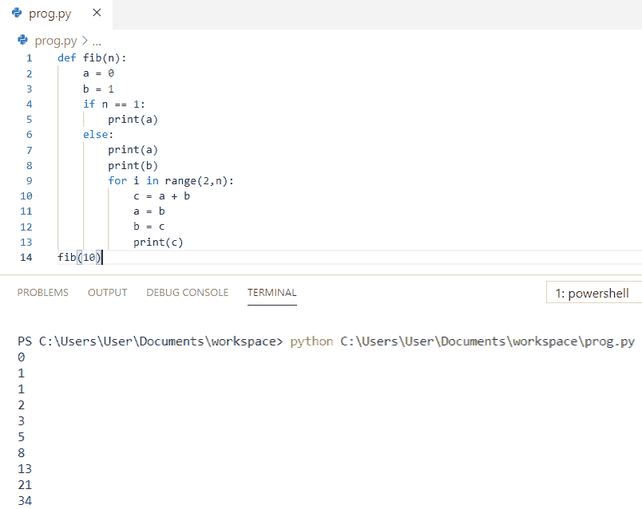

Python program to print fibonacci series

上面的代码，我们可以用 Python 中的来打印**斐波那契数列。**

你可能会喜欢，[如何在 python 中创建变量](https://pythonguides.com/create-python-variable/)和在 Python 中创建[注释行](https://pythonguides.com/comment-lines-in-python/)。

## Python 程序使用递归打印斐波那契数列

在这里，我们将看到 **python 程序使用递归**打印斐波那契数列。

*   在这个例子中，我使用了函数 `def Fibonacci(number)`
*   这里，如果 `(number == 0)` 检查给定的数是否为 0。如果为真，该函数返回值零。
*   elif `(number == 1)` 检查给定的数是否为 1。如果为真，函数返回值一。
*   递归函数 `Fibonacci()` 用于计算 n 项序列。
*   一个 `for` 循环用于递归地迭代和计算每一项。
*   我们将接受用户的输入

**举例:**

```py
def Fibonacci(number):
           if(number == 0):
                      return 0
           elif(number == 1):
                      return 1
           else:
                      return (Fibonacci(number - 2)+ Fibonacci(number - 1))
number = int(input("Enter the Range Number: "))
for n in range(0, number):
           print(Fibonacci(n))
```

为了得到输出，我使用了 `print(Fibonacci(n))` 来使用递归得到斐波那契数列。您可以参考下面的输出截图。

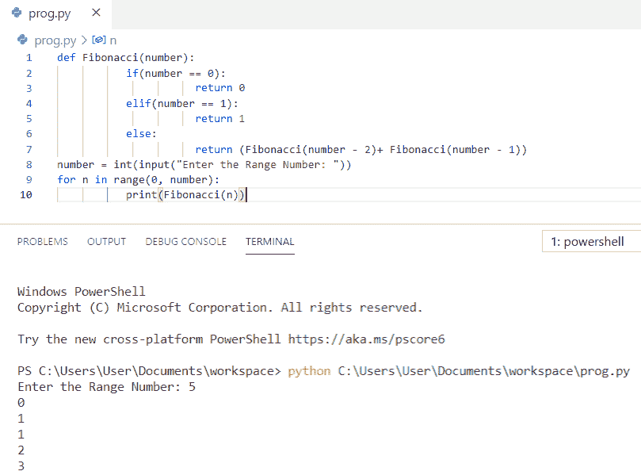

fibonacci series in python using recursion

上面的代码我们可以用 Python 中的递归来**打印斐波那契数列。**

你可能喜欢，[Python dictionary append with examples](https://pythonguides.com/python-dictionary-append/)和[在 Python 中检查一个列表是否为空](https://pythonguides.com/check-if-a-list-is-empty-in-python/)。

## python 中的斐波那契数列使用 for 循环

让我们看看使用 for 循环打印斐波那契数列的 **python 程序**

*   首先，我们将允许用户**输入任何正整数**。
*   我们已经将 `First_val` 初始化为 `0` ，将 `second_val` 初始化为 `1` 。
*   这里，循环的**用于从 0 到用户指定的数字的迭代。**
*   最后， `print(next)` 用于在 Python 中得到斐波那契数列

**举例:**

下面是 python 中使用 for 循环的**斐波那契数列的例子。**

```py
num = int(input("Enter the Range Number: "))
First_val = 0
Second_val = 1
for n in range(0, num):
           if(n <= 1):
                      next = n
           else:
                      next = First_val + Second_val
                      First_val = Second_val
                      Second_val = next
           print(next)
```

为了获得输出，我使用了 `print(next)` 来获得使用 for 循环的斐波那契数列。您可以参考下面的输出截图。

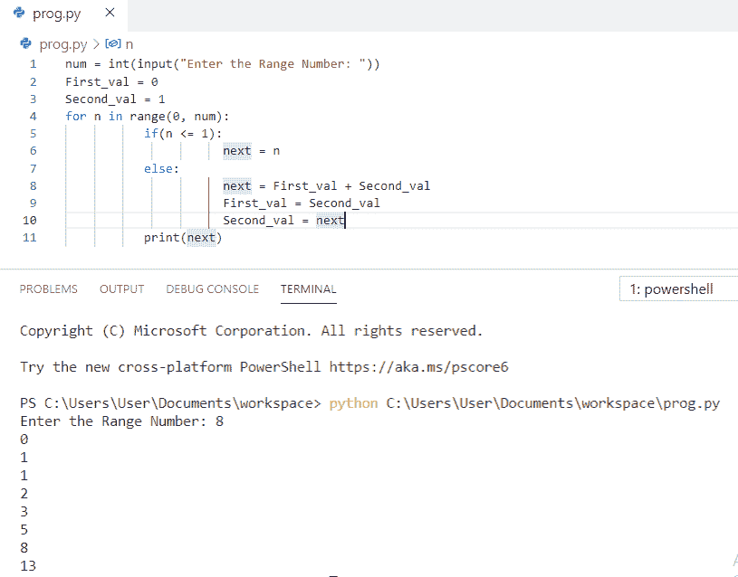

Python program to print fibonacci series using for loop

上面的代码，我们可以用 Python 中的 for 循环来打印**斐波那契数列。**

又念， [Python 程序查闰年](https://pythonguides.com/python-program-to-check-leap-year/)。

## Python 程序打印最多 n 项的斐波那契数列

在这里，我们将看到 **python 程序打印多达 n 项的斐波那契数列**

*   首先，我们将允许用户**输入 n 个术语**
*   我们已经将 `n1` 初始化为 `0` 并将 `n2` 初始化为 `1` 。
*   如果项的数量超过 2，我们将使用一个 **while 循环**通过添加前两项来查找序列中的下一项。
*   之后，我们交换变量，继续这个过程。

**举例:**

```py
n = int(input("Enter the n terms: "))
n1, n2 = 0, 1
count = 0
if n <= 0:
   print("Please enter a positive integer")
elif n == 1:
   print("Fibonacci sequence upto",n,":")
   print(n1)
else:
   print("Fibonacci sequence:")
   while count < n:
       print(n1)
       r = n1 + n2
       n1 = n2
       n2 = r
       count += 1
```

为了得到输出，我使用了 `print(Fibonacci sequence)` 来得到多达 n 项的 Fibonacci 数列。您可以参考下面的输出截图

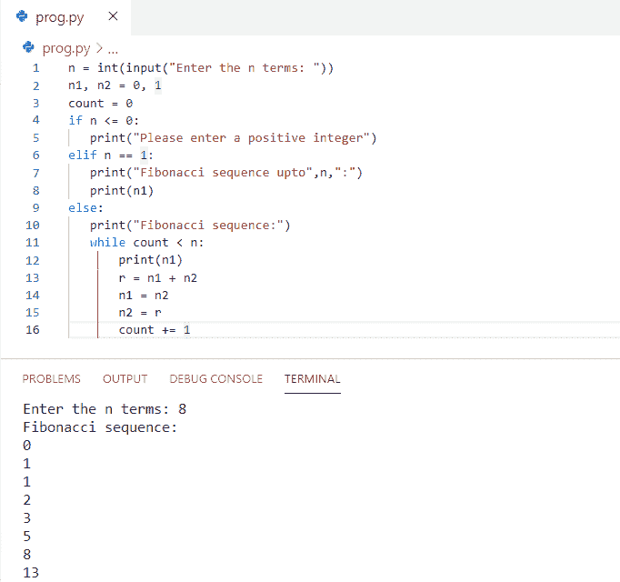

Python program to print fibonacci series up to n terms

这是一个 Python 程序，可以打印多达 n 项的斐波那契数列。

另外，请阅读 Python 中的[如何将列表转换为字符串](https://pythonguides.com/python-convert-list-to-string/)和 [Python 平方一个数字](https://pythonguides.com/python-square-a-number/)。

## Python 程序打印 0 到 50 之间的斐波那契数列

现在，我们将看到 **python 程序打印 0 到 50 之间的斐波那契数列**

*   我们已经将 `n1` 初始化为 `0` 并将 `n2` 初始化为 `1` 。
*   每下一个数字都是通过将它前面的两个数字相加得到的。

**举例:**

```py
n1,n2 = 0,1
print(n1)
while n2<50:
    print(n2)
    n1,n2 = n2, n1+n2
```

为了得到输出，我使用了 `print` 来得到 0 到 50 之间的斐波那契数列。您可以参考下面的输出截图。

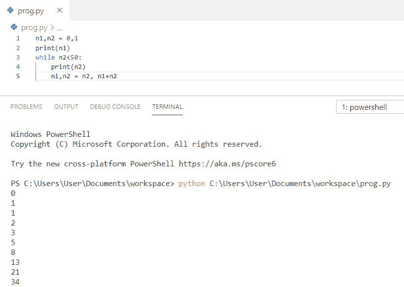

Python program to print fibonacci series between 0 to 50

上面的 Python 代码，我们可以用 Python 中的来**打印 0 到 50 之间的斐波那契数列。**

## Python 程序使用迭代打印斐波那契数列

现在，我们将看到 **python 程序使用迭代**打印斐波那契数列。

*   在这个例子中，我使用了函数 `def fib(number)` 。
*   我们首先初始化为 `0` ，其次初始化为 `1` 。
*   `while` 循环用于通过添加前两项来查找序列中的下一项。
*   然后**更新**第一个和第二个的值。

**举例:**

```py
def fib(number):
   count = 0
   first = 0
   second = 1
   temp = 0
   while count <= number:
      print(first)
      temp = first + second
      first = second
      second = temp
      count = count + 1
fib(6)
```

为了得到输出，我使用了 `print` 通过迭代得到斐波那契数列。您可以参考下面的输出截图。

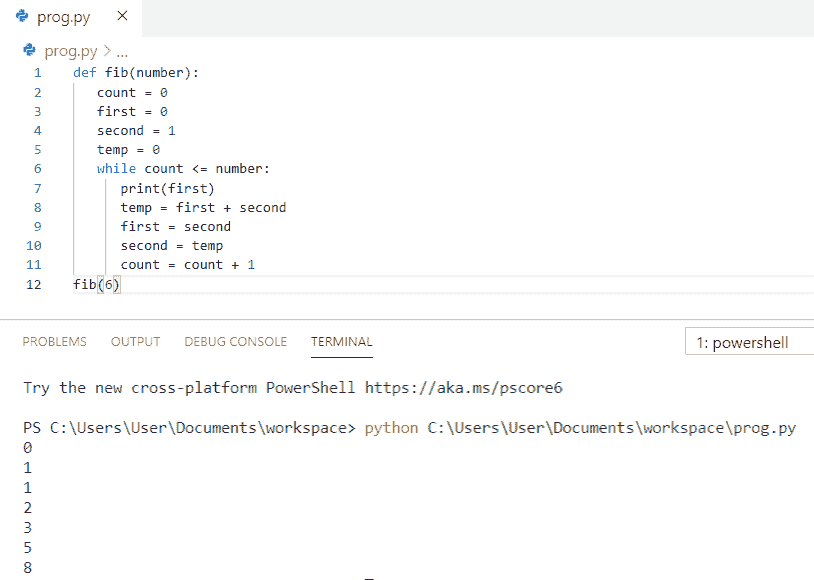

Python program to print fibonacci series using iteration

上面的 Python 代码，我们可以用 Python 中的使用迭代来打印**斐波那契数列。**

你可能喜欢读，[什么是 Python 字典](https://pythonguides.com/create-a-dictionary-in-python/)和[没有换行符的 Python 打印](https://pythonguides.com/python-print-without-newline/)。

## Python 程序不使用递归打印斐波那契数列

我们来看 **python 程序打印斐波那契数列不使用递归**。

*   首先，用户将输入系列的前两个数字和用户要打印的术语数。
*   然后**打印**前两个数字
*   `while` 循环用于计算前两个数的和，然后是斐波那契数列
*   现在，打印斐波那契数列，直到 `n-2` 大于 `0` 。

**举例:**

```py
n1=int(input("Enter the first number of the series: "))
n2=int(input("Enter the second number of the series: "))
n=int(input("Enter the number of terms needed: "))
print(n1,n2,end=" ")
while(n-2):
    t=n1+n2
    n1=n2
    n2=t
    print(n2,end=" ")
    n=n-1
```

为了获得输出，我使用了 `print` 来获得斐波那契数列，而没有使用递归。您可以参考下面的输出截图。

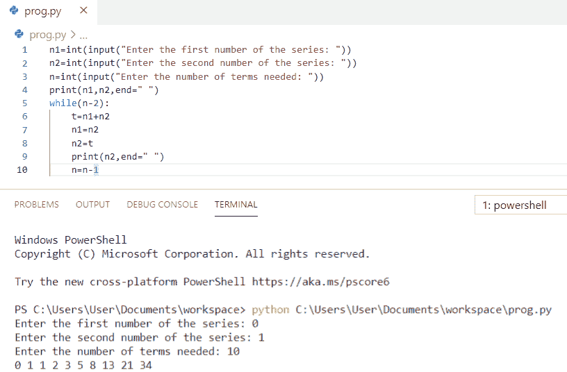

Python program to print fibonacci series without using recursion

上面的 Python 代码我们可以用来打印**斐波那契数列，而不需要使用 Python** 中的递归。

你可能喜欢， [Python zip()函数](https://pythonguides.com/python-zip/)。

## Python 程序使用递归打印斐波那契数列直到‘n’值

让我们看看 **python 程序使用递归**打印斐波那契数列直到‘n’值。

*   在这个例子中，我使用了函数`def``recursion _ fib(num)`
*   这里，**如果 num < = 1** 那么返回 `num`
*   其他项是通过将前面两项相加得到的。n 项是 `(num-1)` 和 `(num-2)` 项之和。
*   递归函数 `recursion_fib` 用于计算 n 项序列。
*   一个 `for` 循环用于递归地迭代和计算每一项。

**举例:**

```py
def recursion_fib(num):
   if num <= 1:
       return num
   else:
       return(recursion_fib(num-1) + recursion_fib(num-2))
n = 9
if n <= 0:
   print("Plese enter a positive integer")
else:
   print("Fibonacci sequence:")
   for i in range(n):
       print(recursion_fib(i))
```

为了获得输出，我使用了 `print(recursion_fib(i))` 来获得 fibonacci 数列，直到使用递归的‘n’值。您可以参考下面的输出截图。

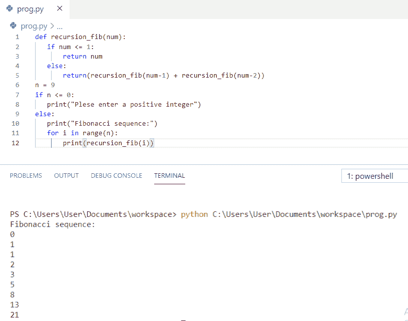

Python program to print fibonacci series until ‘n’ value using recursion

上面的代码我们可以用 Python 中的递归来打印**斐波那契数列直到‘n’的值。**

## 使用 while 循环在 python 中打印斐波那契数列

现在，我们将看到 **python 程序使用 while 循环**打印斐波那契数列。

*   首先，用户将输入任意正整数。
*   我们已经将 F_val 初始化为 `0` ，将 S_val 初始化为 `1` 。
*   我们已经声明了三个整数变量，比如 I、F_val 和 S_val。
*   `while` 循环确保循环从 `0` 开始，并且小于用户给定的数字。
*   在 `while` 循环中，我们使用了 if 和 else。
*   最后斐波纳契数列将被输出。

**举例:**

```py
Num = int(input("Enter the Range Number: "))
i = 0
F_val = 0
S_val = 1
while(i < Num):
           if(i <= 1):
                      Next = i
           else:
                      Next = F_val + S_val
                      F_val = S_val
                      S_val = Next
           print(Next)
           i = i + 1
```

为了获得输出，我使用了 `print(Next)` 来使用 while 循环获得斐波那契数列。您可以参考下面的输出截图。

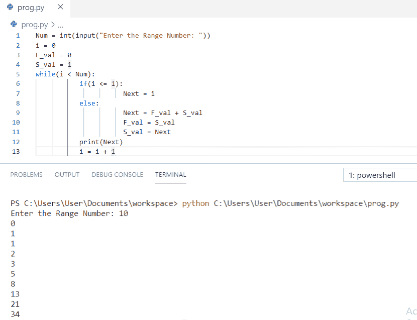

Python program to print fibonacci series using while loop

上面的代码，我们可以用 Python 中的 while 循环来打印**斐波那契数列。**

也可阅读， [Python For 循环示例](https://pythonguides.com/python-for-loop/)和 [Python While 循环示例](https://pythonguides.com/python-while-loop/)。

## python 中的斐波那契数列使用函数

在这里，我们将看到 **python 程序使用函数**打印斐波那契数列

*   在这个例子中，我们使用的函数是 `def fib(n)`
*   我们已经将 n1 初始化为 `0` ，将 n2 初始化为 `1` 。
*   如果 `n == 1` 则打印(n1)
*   循环的**用于迭代这些值，直到给定的数字**
*   最后，它将**打印**斐波那契数列

**举例:**

```py
def fib_series(n):
    n1 = 0
    n2 = 1
    if n == 1:
        print(n1)
    else:
        print(n1)
        print(n2)
        for i in range(2,n):
            t = n1 + n2
            n1 = n2
            n2 = t
            print(t)
fib_series(5)
```

为了得到输出，我使用了 `print(t)` 来使用函数得到斐波那契数列。您可以参考下面的输出截图。

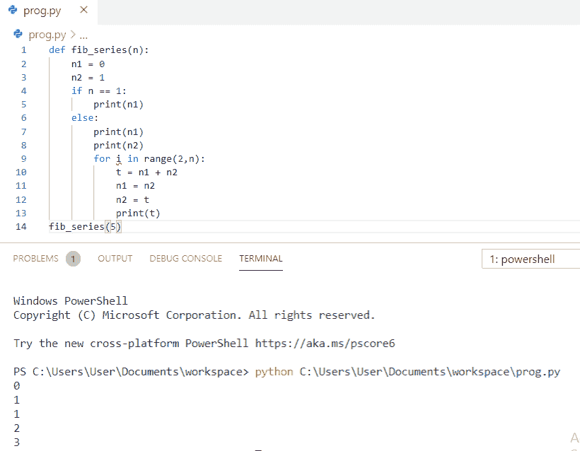

Python program to print fibonacci series using function

## 用 python 打印前 50 个斐波那契数的程序

有人让你**写一个 python 程序来得到 0 到 50** 之间的斐波那契数列吗？让我们看看用 python 打印前 50 个斐波那契数的程序。

*   在这个例子中，我使用了函数`def`FibonacciNum(n)
*   我们已经将 n1 初始化为 `0` ，将 n2 初始化为 `1` 。
*   在这里，**如果 n < 1** 则返回
*   循环的**用于迭代这些值，直到给定的数字。**
*   最后，调用函数`fibonaccium(50)`获得输出中的前 50 个 fibonacci 数。

**举例:**

```py
def FibonacciNum(n):
    n1 = 0
    n2 = 1
    if (n < 1):
        return
    print(n1, end=" ")
    for i in range(1, n):
        print(n2, end=" ")
        next = n1 + n2
        n1 = n2
        n2 = next
FibonacciNum(50)
```

你可以参考下面的截图，看看 python 中前 50 个斐波那契数的输出。

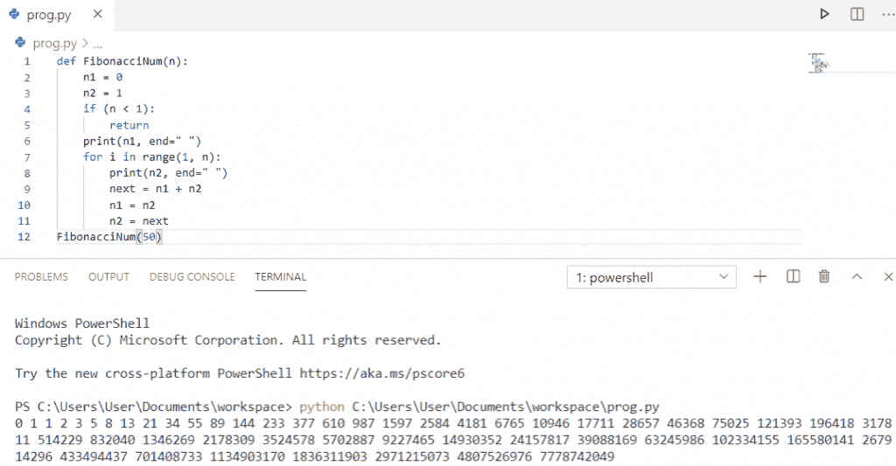

Program to print first 50 fibonacci numbers in python

## Python 程序使用列表在 Python 中打印斐波那契数列

现在，我们将看到 **python 程序使用列表**用 python 打印斐波那契数列

*   首先，用户将输入任意正整数。
*   循环的**用于迭代这些值，直到给定的数字**
*   最后， `print(fib)` 得到列表中的斐波那契数列。

**举例:**

```py
n = int(input("Enter the number:"))
if n==0:
    fib=[0]
elif n==1:
    fib=[0,1]
else:
    fib=[0,1]
    for i in range(2,n):
        fib.append(fib[i-1]+fib[i-2])
print(fib)
```

为了获得输出，我使用了 `print(fib)` 来使用函数获得斐波那契数列。您可以参考下面的输出截图。

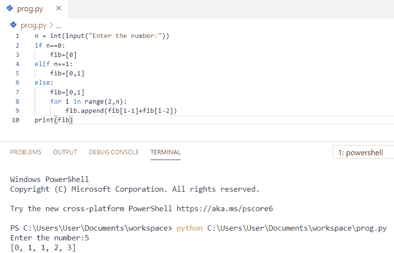

Python program to print fibonacci series in python using a list

上面的代码我们可以用 Python 中的函数来打印斐波那契数列。

您可能会喜欢以下教程:

*   [如何在 Python 中减去两个数](https://pythonguides.com/subtract-two-numbers-in-python/)
*   [Python 中两个数如何除法](https://pythonguides.com/divide-two-numbers-in-python/)
*   [如何在 Python 中添加两个变量](https://pythonguides.com/add-two-variables-in-python/)

在本 Python 教程中，我们学习了 ****Python 程序在 Python 中打印**斐波那契数列**或**斐波那契数列**。此外，我们还讨论了以下主题:

*   Python 程序打印斐波那契数列
*   python 中使用递归的斐波那契数列
*   使用 for 循环打印斐波那契数列的 Python 程序
*   Python 程序可以打印多达 n 项的斐波那契数列
*   Python 程序打印 0 到 50 之间的斐波那契数列
*   使用迭代打印斐波那契数列的 Python 程序
*   python 中无递归的斐波那契数列
*   Python 程序使用递归打印斐波那契数列直到“n”值
*   使用 while 循环打印斐波那契数列的 Python 程序
*   使用函数打印斐波那契数列的 Python 程序
*   用 python 打印前 50 个斐波那契数的程序
*   Python 程序使用列表在 python 中打印斐波那契数列

[Bijay Kumar](https://pythonguides.com/author/fewlines4biju/)

Python 是美国最流行的语言之一。我从事 Python 工作已经有很长时间了，我在与 Tkinter、Pandas、NumPy、Turtle、Django、Matplotlib、Tensorflow、Scipy、Scikit-Learn 等各种库合作方面拥有专业知识。我有与美国、加拿大、英国、澳大利亚、新西兰等国家的各种客户合作的经验。查看我的个人资料。

[enjoysharepoint.com/](https://enjoysharepoint.com/)[](https://www.facebook.com/fewlines4biju "Facebook")[](https://www.linkedin.com/in/fewlines4biju/ "Linkedin")[](https://twitter.com/fewlines4biju "Twitter")