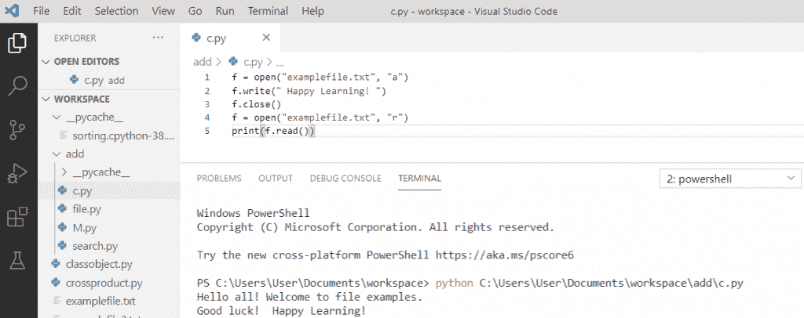
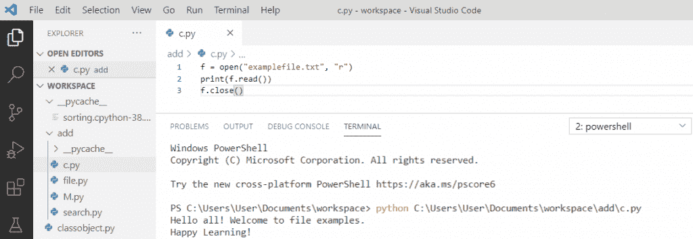
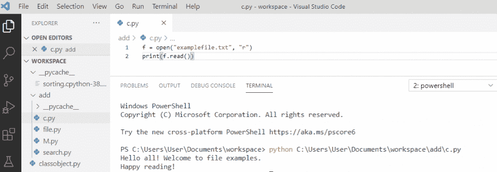
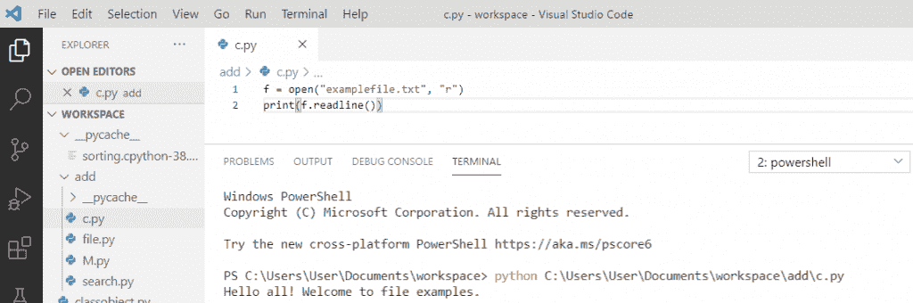
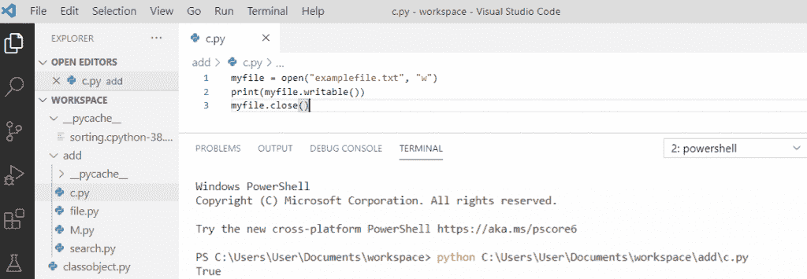
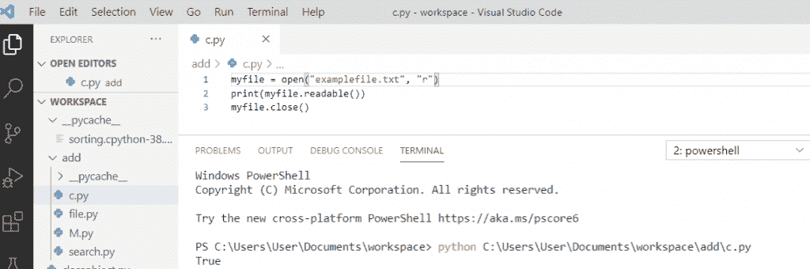
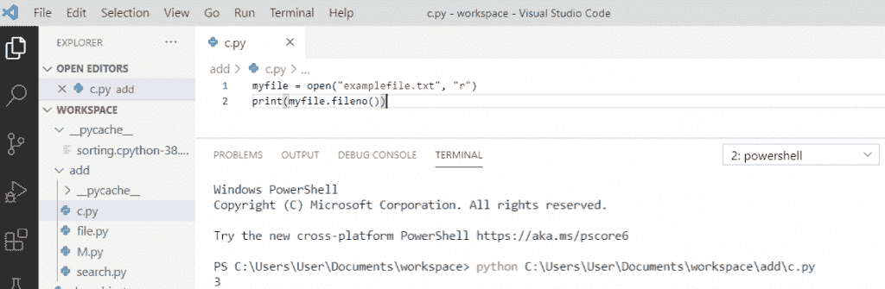
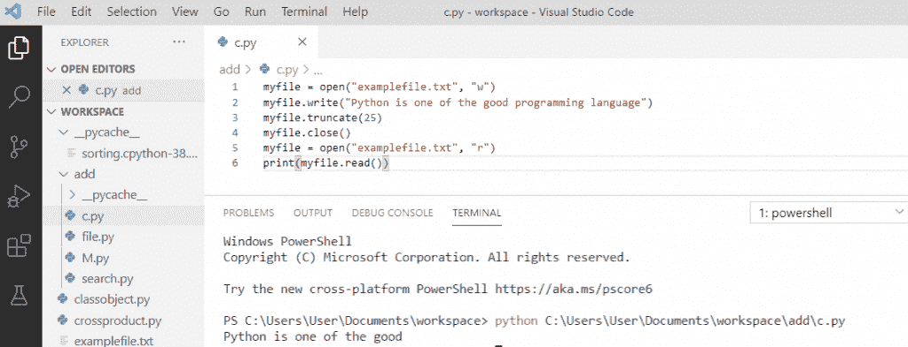
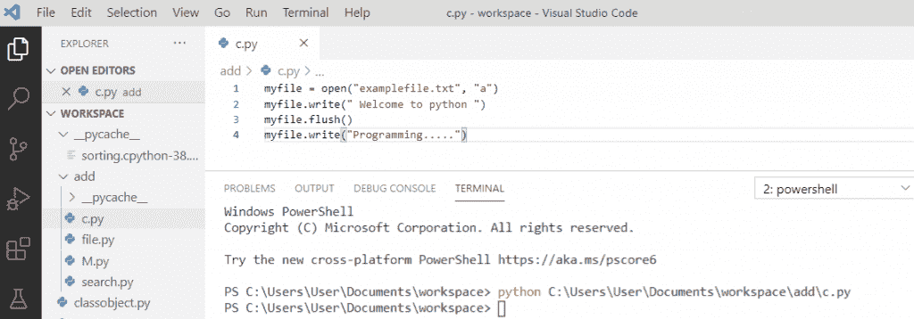
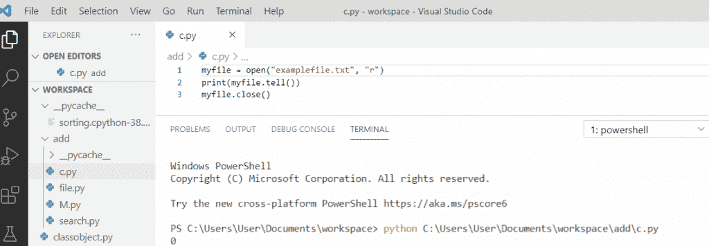

# Python 文件方法(有有用的例子)

> 原文：<https://pythonguides.com/python-file-methods/>

[](https://sharepointsky.teachable.com/p/python-and-machine-learning-training-course)

在这个 [Python 教程](https://pythonguides.com/python-programming-for-the-absolute-beginner/)中，我们将讨论 Python 中的**文件方法，我们还将检查以下主题。**

*   Python 文件 write()方法
*   Python 文件 close()方法
*   Python 文件 read()方法
*   Python 文件 readline()方法
*   Python 文件 writable()方法
*   Python 文件可读()方法
*   Python 文件 fileno()方法
*   Python 文件 truncate()方法
*   Python 文件 flush()方法
*   Python 文件 tell()方法

我们将看到所有的 Python 文件方法和各种例子。

如果您是 Python 的新手，您可以查看一篇文章来用 Python 创建您的第一个 hello world 程序。

下面是 **Python 文件方法**的列表。

目录

[](#)

*   [Python 文件的 write()方法](#Python_file_write_method "Python file write() method")
*   [Python 文件关闭()方法](#Python_file_close_method "Python file close() method")
*   [Python 文件 read()方法](#Python_file_read_method "Python file read() method")
*   [Python 文件 readline()方法](#Python_file_readline_method "Python file readline() method")
*   [Python 文件的 writable()方法](#Python_file_writable_method "Python file writable() method")
*   [Python 文件可读()方法](#Python_file_readable_method "Python file readable() method")
*   [Python 文件 fileno()方法](#Python_file_fileno_method "Python file fileno() method")
*   [Python 文件 truncate()方法](#Python_file_truncate_method "Python file truncate() method")
*   [Python 文件 flush()方法](#Python_file_flush_method "Python file flush() method")
*   [Python 文件 tell()方法](#Python_file_tell_method "Python file tell() method")

## Python 文件的 write()方法

*   Python file `write()` 方法用于将指定的文本写入文件。这里，我们用用于追加的**“a”**打开文件，然后一些文本被添加到文件中。
*   如果我们将使用 `"a"` 文本将被添加到当前文件，默认情况下在文件的末尾。
*   f.write("快乐学习！")被追加在文件的最后。

**举例:**

```py
f = open("examplefile.txt", "a")
f.write(" Happy Learning! ")
f.close()
f = open("examplefile.txt", "r")
print(f.read())
```

写完上面的代码后，一旦打印出来，输出将显示为**“Hello all！欢迎提交示例。祝你好运！快乐学习！”**。在这里，我们在 `"r"` 模式下打开了文件 `"examplefile.txt"` ，因此，它将被打开，我们将能够在追加后**读取**文件。

您可以参考下面的输出截图。



Python file write() method

## Python 文件关闭()方法

Python 中的 file `close()` 方法用于关闭打开的文件。打开文件时，使用 close()方法关闭文件是一个好习惯。

**举例:**

```py
f = open("examplefile.txt", "r")
print(f.read())
f.close()
```

这里，我们在**“r”**模式下打开了文件名为**“example file . txt”**的文件，最后，我们使用了 `close()` 方法来关闭文件。

当我们运行上面的程序时，它会产生以下输出。



Python file close() method

## Python 文件 read()方法

Python 文件操作中的 `read()` 方法用于从 `"examplefile.txt"` 中读取文件内容。 `read()` 方法从文件中返回指定的字节，默认为-1，这意味着它将读取整个文件内容。

**举例:**

```py
f = open("examplefile.txt", "r"
print(f.read())
```

写完上面的代码后，当我们打印 `"f.read()"` 时，输出会出现 **"Hello all！欢迎提交示例。读书快乐！”。**在这里，我们没有提到指定的字节数。所以， `read()` 方法默认返回整个文件。

**python 文件 read()方法**可以参考下面的截图。



Python file read() method

## Python 文件 readline()方法

Python 文件 `readline()` 方法从**“example file . txt”**文件中读取一整行。通过使用 size 参数，我们可以在输出中获得指定的字节。

**举例:**

```py
f = open("examplefile.txt", "r")
print(f.readline())
```

在这里，当我们打印 `"f.readline()"` 时，输出将出现**"大家好！欢迎提交示例。”**。同样，我们可以看到 `readline()` 从文件中返回第一行。我们还可以指定从该行返回多少字节。

**python 文件 read()方法**可以参考下面的截图。



Python file readline() method

## Python 文件的 writable()方法

Python file `writable()` 方法是一个内置方法，如果文件可写，则返回 True 否则，如果文件不可写，则返回 False。一个文件只有在使用**【w】**打开**写入**【a】**追加时才是可写的。**

 ****举例:**

```py
myfile = open("examplefile.txt", "w")
print(myfile.writable())
myfile.close()
```

为了得到输出，我们将打印 `"myfile.writable()"` 它将返回布尔值 `"True"` ，这意味着文件是可写的，并且文件是使用 `"w"` 打开的。

下面的截图显示了 python 中的 **file writable()方法的输出。**



Python file writable() method

## Python 文件可读()方法

python 中的 `readable()` 方法是 Python 中的内置方法，它检查文件是否可读。该方法返回一个布尔值。如果文件可读，readable()方法返回**真**，否则返回**假**。

**举例:**

```py
myfile = open("examplefile.txt", "r")
print(myfile.readable())
myfile.close()
```

为了得到输出，我们将打印 `"myfile.readable()"` ，它将返回 `"True"` 作为输出，因为文件是可读的。使用**“r”**打开的文件是可读的。

当我们运行上面的程序时，它会产生以下输出。



Python file readable() method

## Python 文件 fileno()方法

Python file `fileno()` 方法是 Python 中的一个内置方法，它以数字的形式返回流的文件描述符。如果操作系统不使用文件描述符，就会发生错误。

**举例:**

```py
myfile = open("example.txt", "r")
print(myfile.fileno())
```

在这里，当我们将打印 `"myfile.fileno()"` 时，输出将出现 `" 3 "` 。同样，我们可以看到 `fileno()` 返回一个整数值，它是文件描述符。

python 文件 fileno()方法可以参考下面的截图。



Python file fileno() method

## Python 文件 truncate()方法

*   python 文件中的 `truncate()` 方法是 Python 中的一个内置方法，它将文件的大小调整为给定的字节数。
*   首先，我已经在**【w】**模式下打开了文件。然后我们在文件上写。这里，我给了**大小为“25”**，这是一个可选参数。
*   truncate 方法后，我们将读取文件，并打印“ `myfile.read()` ”以查看输出。

**举例:**

```py
myfile = open("examplefile.txt", "w")
myfile.write("Python is one of the good programming language")
myfile.truncate(25)
myfile.close()
myfile = open("examplefile.txt", "r")
print(myfile.read())
```

为了得到输出，我们将打印 `"myfile.read()"` 然后输出将出现 **" Python 是好的之一"**。因此，它将根据给定的大小“25”截断文件。

关于 **python 文件 truncate()方法**，可以参考下面的截图。



Python file truncate() method

## Python 文件 flush()方法

`flush()` 方法是 python 中的一个内置方法。它用于在写入文件时清除内部缓冲区。在 python 中处理文件时，这是最好的方法。

**举例:**

```py
myfile = open("examplefile.txt", "a")
myfile.write("Welcome to python")
myfile.flush()
myfile.write("Programming.....")
```

为了查看输出，我们将使用 `"myfile.flush()"` ，它将清除文件的内部缓冲区。但是，它不影响文件的内容。因此，文件的内容可以被读取和显示。

下面的截图显示了 python 中的**文件 flush()方法的输出，它在输出中不返回任何内容。**



Python file flush() method

## Python 文件 tell()方法

Python file `tell()` 方法返回当前文件在文件中的位置。它不接受任何参数，返回一个整数值。

**举例:**

```py
myfile = open("examplefile.txt", "r")
print(myfile.tell())
myfile.close()
```

在这里，当我们打印 `"myfile.tell()"` 时，输出将显示为 `" 0 "` 。这里，如果没有在追加模式下打开，最初文件指针指向文件的开头。所以，tell()的初始值是零。

关于 **python 文件 tell()方法**，可以参考下面的截图。



Python file tell() method

您可能会喜欢以下 Python 教程:

*   [Python tkinter messagebox +示例](https://pythonguides.com/python-tkinter-messagebox/)
*   [集合的并集 Python +实例](https://pythonguides.com/union-of-sets-python/)
*   [Python 接口介绍](https://pythonguides.com/python-interface/)
*   [如何在 Python 中把字符串转换成日期时间](https://pythonguides.com/convert-a-string-to-datetime-in-python/)
*   [Python 列表理解λ](https://pythonguides.com/python-list-comprehension/)
*   [Python 将列表写入文件，并附有示例](https://pythonguides.com/python-write-list-to-file/)
*   [Python 将字符串写入文件](https://pythonguides.com/python-write-string-to-a-file/)
*   [Python 将变量写入文件+示例](https://pythonguides.com/python-write-variable-to-file/)
*   [Python 读取 CSV 文件并写入 CSV 文件](https://pythonguides.com/python-read-csv-file/)
*   [Python 从路径中获取文件名](https://pythonguides.com/python-get-filename-from-the-path/)
*   [Python 从列表中选择](https://pythonguides.com/python-select-from-a-list/)

在本 Python 教程中，我们通过几个例子学习了 python 中的**文件方法。此外，我们还讨论了以下主题:**

*   Python 文件 write()方法
*   Python 文件 close()方法
*   Python 文件 read()方法
*   Python 文件 readline()方法
*   Python 文件 writable()方法
*   Python 文件可读()方法
*   Python 文件 fileno()方法
*   Python 文件 truncate()方法
*   Python 文件 flush()方法
*   Python 文件 tell()方法

[Bijay Kumar](https://pythonguides.com/author/fewlines4biju/)

Python 是美国最流行的语言之一。我从事 Python 工作已经有很长时间了，我在与 Tkinter、Pandas、NumPy、Turtle、Django、Matplotlib、Tensorflow、Scipy、Scikit-Learn 等各种库合作方面拥有专业知识。我有与美国、加拿大、英国、澳大利亚、新西兰等国家的各种客户合作的经验。查看我的个人资料。

[enjoysharepoint.com/](https://enjoysharepoint.com/)[](https://www.facebook.com/fewlines4biju "Facebook")[](https://www.linkedin.com/in/fewlines4biju/ "Linkedin")[](https://twitter.com/fewlines4biju "Twitter")**