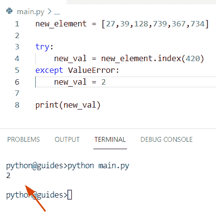
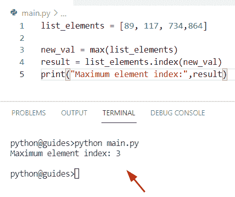
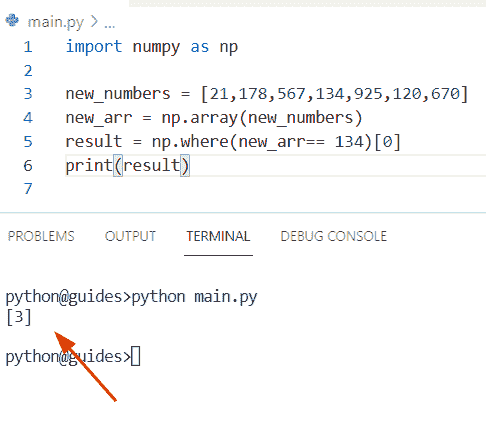

# Python 查找列表中元素的索引

> 原文：<https://pythonguides.com/python-find-index-of-element-in-list/>

[](https://sharepointsky.teachable.com/p/python-and-machine-learning-training-course)

在本 [Python 教程](https://pythonguides.com/python-hello-world-program/)中，我们将学习**如何使用 Python** 找到列表中元素的索引。此外，我们将涵盖这些主题。

*   Python 查找列表中最接近值的元素的索引
*   Python 查找列表中元素的索引大于
*   Python 查找列表列表中元素的索引
*   Python 使用条件查找列表中元素的索引
*   Python 查找列表中项目的索引
*   Python 通过属性查找列表中对象的索引
*   Python 在包含字符串的列表中查找项目的索引
*   Python 通过值获取列表中元素的索引
*   Python 无例外地在列表中查找项目的索引
*   Python 查找列表中项目的索引，不区分大小写
*   Python 在迭代时获取列表中项目的索引
*   Python 使用默认值获取列表中项目的索引
*   Python 获取列表中元素的索引(如果存在)
*   Python 在列表正则表达式中查找项目的索引
*   Python 查找列表中项目的位置
*   Python 获取列表中最大元素的索引。
*   Python 查找列表中最小元素的索引
*   在列表 Python 中查找重复元素的索引
*   Python 查找列表中多个元素的索引
*   Python 获取列表 NumPy 中元素的索引
*   Python 在两个列表中查找公共元素的索引
*   Python 获取列表理解中项目的索引

目录

[](#)

*   [Python 查找列表中元素的索引](#Python_find_index_of_element_in_list "Python find index of element in list")
    *   [获取 Python 列表中元素的索引](#Get_index_of_elements_in_a_Python_list "Get index of elements in a Python list")
    *   [通过使用 NumPy 方法](#By_using_NumPy_method "By using NumPy method")
*   [Python 查找列表中最接近值](#Python_find_index_of_element_in_list_closest_to_value "Python find index of element in list closest to value")的元素的索引
*   [Python 发现列表中元素的索引大于](#Python_find_index_of_element_in_list_greater_than "Python find index of element in list greater than")
*   [Python 查找列表列表中元素的索引](#Python_find_index_of_element_in_list_of_lists "Python find index of element in list of lists")
*   [Python 使用条件](#Python_find_index_of_element_in_list_with_condition "Python find index of element in list with condition")查找列表中元素的索引
*   [Python 查找列表中项目的索引](#Python_find_index_of_item_in_list "Python find index of item in list")
*   [Python 在包含字符串的列表中查找项目的索引](#Python_find_index_of_item_in_list_containing_string "Python find index of item in list containing string")
*   [Python 通过值获取列表中元素的索引](#Python_get_index_of_element_in_list_by_value "Python get index of element in list by value")
*   [Python 无例外地找到列表中项目的索引](#Python_find_index_of_item_in_list_without_exception "Python find index of item in list without exception")
    *   [在列表中无一例外地找到项目的索引](#Finding_an_index_of_the_item_in_a_list_without_exception "Finding an index of the item in a list without exception")
*   [Python 查找列表中项目的索引，不区分大小写](#Python_find_index_of_item_in_list_case_insensitive "Python find index of item in list case insensitive")
*   [Python 在迭代](#Python_get_index_of_item_in_list_while_iterating "Python get index of item in list while iterating")时获取列表中项目的索引
    *   [在迭代](#Get_the_index_of_an_item_in_a_list_while_iterating "Get the index of an item in a list while iterating")时获取列表中某项的索引
*   [Python 获取列表中项目的索引，默认为](#Python_get_index_of_item_in_list_with_default "Python get index of item in list with default")
*   [如果存在，Python 获取列表中元素的索引](#Python_get_index_of_element_in_list_if_exists "Python get index of element in list if exists")
*   [Python 在列表正则表达式中查找项目的索引](#Python_find_index_of_item_in_list_regex "Python find index of item in list regex")
*   [Python 在列表中找到一个项目的位置](#Python_find_a_position_of_an_item_in_a_list "Python find a position of an item in a list")
*   [Python 获取列表中 max 元素的索引](#Python_get_index_of_max_element_in_a_list "Python get index of max element in a list")
*   [Python 查找列表中最小元素的索引](#Python_find_index_of_smallest_element_in_list "Python find index of smallest element in list")
*   [在列表 Python 中查找重复元素的索引](#Find_index_of_duplicate_elements_in_list_Python "Find index of duplicate elements in list Python")
    *   [获取重复值的索引号](#Get_the_index_number_of_duplicate_values "Get the index number of duplicate values")
*   [Python 查找列表中多个元素的索引](#Python_find_index_of_multiple_elements_in_list "Python find index of multiple elements in list")
*   [Python 获取列表 NumPy 中元素的索引](#Python_get_index_of_element_in_list_NumPy "Python get index of element in list NumPy")
*   [Python 在两个列表中找到公共元素的索引](#Python_find_index_of_common_elements_in_two_lists "Python find index of common elements in two lists")
*   [Python 获取列表理解中项目的索引](#Python_get_index_of_item_in_list_comprehension "Python get index of item in list comprehension")

## Python 查找列表中元素的索引

*   在本期节目中，我们将讨论**如何使用 Python** 找到列表中元素的索引。
*   在 Python 中获取列表中项的索引。我们将使用一个方法 `list.index()` ，这个函数将总是返回列表中特定项目的索引，这是 Python 中的一个**内置()**函数。
*   在 Python 中，列表基本上是项目的集合，每个项目都有其唯一的位置，这些位置被称为索引。现在，通过使用 `list.index()` 函数，我们能够获得列表中某项的索引。

**语法:**

下面是 index()方法的语法

```py
list.index(
           element,
           start,
           end
          )
```

*   它由几个参数组成
    *   **元素:**该参数表示您想要查找哪个元素。
    *   **start:** 这是一个可选参数，它将帮助您开始搜索。
    *   **end:** 此参数指定如果您提供“end”参数，则搜索将在索引处结束。

**举例:**

让我们举个例子，看看如何在一个列表中找到一个元素的索引

```py
new_lis = [82, 64, 189, 920, 452, 701]

new_val = 920
result = new_lis.index(new_val)
print(result)
```

在上面的代码中，我们创建了一个整数列表，然后我们将在给定的列表中找到**‘920’**的索引。为了完成这项任务，我们首先创建一个变量**‘result’**，然后分配一个 `list.index()` 方法来获取该数字的索引值。

下面是以下给定代码的输出


Python find an index of an element in a list

用 Python 读[平方根](https://pythonguides.com/square-root-in-python/)

### 获取 Python 列表中元素的索引

*   在这个例子中，我们将结合使用 for 循环和 `append()` 方法来获取 Python 列表中元素的索引。
*   为了首先获得列表中元素的索引，我们将创建一个列表**‘lis _ 1’**，现在我们想要获得列表中存在的索引号**‘193’**，现在我想要具有编号**‘193’**的所有索引。

**源代码:**

```py
lis_1 = ['45', '92', '193', '193', '231', '190'] 

emp_lis = [] 
for m in range(0, len(lis_1)) : 
    if lis_1[m] == '193' : 
        emp_lis.append(m)
print("Index no of '193':", emp_lis)
```

下面是以下给定代码的实现


Python find the index of an element in a list

正如您在截图中看到的，该元素出现在 2 和 3 位置。

### 通过使用 NumPy 方法

*   在这个例子中，我们特别使用了 [Python numpy 数组](https://pythonguides.com/python-numpy-array/)的概念来获取列表中元素的索引。因此，为了完成这项任务，我们首先创建一个列表，然后使用 `np.array()` 函数将列表转换成一个数组。现在我们想得到列表中可用的**‘119’**号的索引。
*   为此，我们可以应用概念 `np.where()` 方法，该函数将帮助用户根据条件从给定数组中选择元素。

**源代码:**

```py
import numpy as np

new_list = [56,829,992,119,734,567,890] 
arr = np.array(new_list)
result = np.where(arr == 119)[0]
print(result)
```

你可以参考下面的截图


Python find the index of an element in a list

正如你在截图中看到的，元素“119”出现在 3 个位置。

这就是如何使用 NumPy 方法获取 Python 列表中元素的索引。

同样，检查: [Python 在字符串中查找数字](https://pythonguides.com/python-find-number-in-string/)

## Python 查找列表中最接近值的元素的索引

*   让我们看看如何在列表中找到最接近值的元素索引。
*   通过使用 `min()` 方法，我们可以应用一个键来搜索每个项目与 `K` 的差异，这个方法将总是返回差异数量较少的项目。

**举例:**

```py
new_lis = [21.34,15.4567,18.478,22.105,13.189]

b = min(range(len(new_lis)), key=lambda m: abs(new_lis[m]-17.6))
print(b)
```

下面是以下代码的截图


Python find an index of the element in the list closest to value

阅读:[删除非 ASCII 字符 Python](https://pythonguides.com/remove-non-ascii-characters-python/)

## Python 发现列表中元素的索引大于

在这个例子中，我们将使用一个 [Python lambda 函数](https://pythonguides.com/python-anonymous-function/)来等于每个索引处的给定值，然后过滤掉给定的条件。该方法实际上将索引值设置为 `0` ，并指定大于该值的第一个项目。

**举例:**

```py
my_lis = [109,134,12,83,10]

new_output = list(filter(lambda m: m > 120, my_lis))[0]
print(my_lis.index(new_output))
```

在上面的代码中，我们首先初始化了一个列表**‘my _ lis’**，然后使用**过滤器+ lambda()** 函数来获取列表中大于**‘120’**的元素的索引。

一旦您将打印**‘new _ output’**，那么输出将显示大于**‘120’**的索引号，即**‘1’:134**。

下面是以下给定代码的输出


Python find an index of the element in list greater than

阅读: [Python 将二进制转换成十进制](https://pythonguides.com/python-convert-binary-to-decimal/)

## Python 查找列表列表中元素的索引

*   在这个程序中，我们将讨论如何在 Python 中找到列表列表中元素的索引。
*   为了执行这个特定的任务，我们将应用 `list.index()` 方法，在这个示例中，我们将检查条件，如果列表中没有该项目，那么 `index()` 方法将引发一个错误。
*   在下面的例子中，我们已经创建了一个列表列表，我们必须在给定的列表中找到索引号**‘321’**。

**源代码:**

```py
new_lis_lis = [["98","85","112","321","405"],["189","239","706","148","227"]]
def find(m):
    for x, new_val in enumerate(new_lis_lis):
        try:
            y = new_val.index(m)
        except ValueError:
            continue
        yield x, y

new_result = [z for z in find('321')]
print(new_result)
```

下面是以下给定代码的执行过程


Python find an index of the element in a list of lists

正如您在截图中看到的，该元素出现在 3 个位置。

阅读: [Python 统计文件中的字数](https://pythonguides.com/python-count-words-in-file/)

## Python 使用条件查找列表中元素的索引

*   让我们看看如何用 Python 中的条件找到列表中元素的索引。
*   通过使用列表理解方法，我们可以很容易地得到特定元素的索引号。在 Python 中，列表理解用于遍历给定列表中的项目，并访问其索引和值。
*   它将检查 `len()` 方法中的条件，如果没有参数被传递，那么它将返回一个空列表。这种方法实际上会帮助用户减少较长的循环，使程序更容易。

**举例:**

```py
new_lis = [1877,18,77,30,77,45,567]

output = [ i for i in range(len(new_lis)) if new_lis[i] == 77 ]
print("Get index number from list:",output)
```

在上面的代码中，我们要使用列表理解来找到**‘77’**的索引号。一旦您将打印“输出”，那么结果将显示索引号**‘77’**，即 2 和 4。

你可以参考下面的截图


Python find an index of an element in the list with condition

另外，请查看:[如何在 Python 数据帧中找到重复项](https://pythonguides.com/how-to-find-duplicates-in-python-dataframe/)

## Python 查找列表中项目的索引

*   在 Python 中，为了获得列表中项目的索引，我们可以应用 `len()` 类的列表理解，将项目作为参数传递。
*   在这个例子中，我们必须找到给定列表中第一次出现的值的索引。首先，我们将创建一个列表**‘new _ lis’**，并为其分配整数值。
*   现在使用 `len()` 方法并给出条件，如果值**‘64’**出现在列表中，那么它将显示索引号，否则它将返回一个空列表。

**源代码:**

```py
new_lis = [73,123,64,52,74,86,32,64,64] 

output = [m for m in range(len(new_lis)) if new_lis[m] == 64] 
print("Find index of element in list:",output)
```

下面是以下代码的截图


Python find an index of the item in a list

正如您在屏幕截图中看到的，该元素出现在 2、7 和 8 位置。

阅读:Python 中的 [Case 语句](https://pythonguides.com/case-statement-in-python/)

## Python 在包含字符串的列表中查找项目的索引

*   在本节中，我们将讨论如何使用 Python 在包含 string 的列表中查找项目的索引。
*   为了首先获得列表中元素的索引，我们将创建一个字符串列表**‘new _ list’**，现在我们想要获得列表中出现的**‘Micheal’**的索引号。默认情况下，索引值从 0 开始。

**源代码:**

```py
new_list = ['George', 'Micheal', 'Micheal', 'John', 'Micheal', 'Potter'] 

emp_lis = [] 
for m in range(0, len(new_list)) : 
    if new_list[m] == 'Micheal' : 
        emp_lis.append(m)
print("Index no of 'Micheal':", emp_lis)
```

你可以参考下面的截图


Python find the index of an item in a list containing a string

阅读:[如何在 Python 中反转一个列表](https://pythonguides.com/reverse-a-list-in-python/)

## Python 通过值获取列表中元素的索引

*   在本期节目中，我们将讨论**如何在 Python** 中通过值获取列表中元素的索引。
*   通过使用 `list.index()` 方法，我们可以很容易地从 list 中获得元素索引值。在这个例子中，我们定义了一个整数值列表，使用 `list.index()` 方法，我们可以得到值为**‘210’**的项目的索引。

**举例:**

```py
new_lis = [28, 190, 210, 567, 912, 678]

new_val = 210
result = new_lis.index(new_val)
print(result)
```

在上面的代码中，我们创建了一个列表**‘new _ lis’**，然后初始化一个变量**‘new _ val’**，我们必须在其中赋值**‘210’**。现在，为了找到 210 的索引号，我们必须使用方法。

下面是以下给定代码的实现


Python get an index of an element in the list by value

另外，请阅读:[获取 Python 字典中的第一个键](https://pythonguides.com/get-first-key-in-dictionary-python/)

## Python 无例外地找到列表中项目的索引

*   在这个程序中，我们将讨论**如何在不使用 Python** 中的 exception 的情况下获得列表中元素的索引。
*   为了执行这个任务，我们可以应用 Python `enumerate()` 方法，这个函数可以用来返回列表中所有元素的索引号。
*   在 Python 中，枚举器基本上允许我们遍历序列中的条目，这个函数接受一个 iterable 作为参数，比如 lists。

**源代码:**

```py
my_new_lis = [56,92,17,39,115,189,459,512] 

new_output = [i for i, j in enumerate(my_new_lis) if j == 115] 
print("Element is present at index:",new_output)
```

你可以参考下面的截图


Python find an index of the item in a list without exception

正如您在截图中看到的，该元素出现在第 4 个位置。

### 在列表中无一例外地找到项目的索引

*   在这个例子中，我们希望**找到一个元素的索引，如果它存在的话，否则它将是 Python** 中的默认值。
*   如果值不包含在列表中，它将返回 `2` 。在本例中，未找到**‘420’**值，将抛出一个值错误。

**举例:**

```py
new_element = [27,39,128,739,367,734]

try:
    new_val = new_element.index(420)
except ValueError:
    new_val = 2

print(new_val) 
```

下面是以下代码的截图



Python find an index of the item in a list without exception

这就是你如何无一例外地找到列表中元素的索引。

阅读: [Python 字典增量值](https://pythonguides.com/python-dictionary-increment-value/)

## Python 查找列表中项目的索引，不区分大小写

*   在这一节中，我们将讨论如何使用 Python 在不区分大小写的列表中找到条目的索引。
*   在这个程序中，您将使用 Python `lower()` 方法将列表中的元素转换为小写，这个函数将所有大写字符转换为小写字符。
*   这个方法不接受任何参数，总是返回小写字符串。在这个例子中，我们想要得到**的’**字符的索引号。 `new_list` 中的 `index()` 方法有小写元素**的'**。

**举例:**

```py
Search_ele = 's'

my_new_lis1 =  ['M', 'Q', 'S', 'T', 'Z', 'H', 'W', 'A']
new_result = [item.lower() for item in my_new_lis1]
b = new_result.index(Search_ele.lower())
print(b)
```

下面是以下给定代码的执行过程


Python find an index of the item in list case insensitive

正如你在截图中看到的，第二个位置有“s”。

阅读: [Python 列表字典](https://pythonguides.com/python-dictionary-of-lists/)

## Python 在迭代时获取列表中项目的索引

*   让我们看看**如何在使用 Python** 进行迭代时获得列表中的项目索引。
*   通过使用 Python `range()` 函数，我们可以轻松地遍历 Python 列表的索引。在 Python 中，这个方法将返回一个从 0 开始的元素序列。

**源代码:**

```py
new_lis = ['Micheal', 'John', 'Micheal']

for m in range(len(new_lis)):
    print((m, new_lis[m])) 
```

下面是以下给定代码的实现


Python get the index of an item in a list while iterating

### 在迭代时获取列表中某项的索引

通过使用 `enumerator()` 方法，我们可以解决这个特定的任务，这个方法将帮助用户通过一个序列迭代项目，这个函数接受一个 iterable 作为参数，如列表。

**举例:**

```py
list_value = [46, 81, 72, 39, 38, 1, 89,987,705,409]

for x, y in enumerate(list_value): 
    print(list((x, y))) 
```

你可以参考下面的截图


Python get the index of an item in a list while iterating

阅读: [Python 字典扩展](https://pythonguides.com/python-dictionary-extend/)

## Python 获取列表中项目的索引，默认为

*   在这个程序中，我们将讨论如何通过使用 Python 来获取带有默认值的列表中项目的索引。
*   在给定的情况下，我们已经将默认值设置为 `0` 用于开始索引值。通过使用 range 和 `len()` 函数的组合，我们可以很容易地得到每个元素的索引值。

**源代码:**

```py
my_new_val = [78,39,117,84,47,290]

for z in range(0,len(my_new_val)):
    print([z])
```

下面是以下给定代码的输出


Python get the index of an item in a list with default

## 如果存在，Python 获取列表中元素的索引

*   在这里，我们可以看到如何使用 Python 获取列表中元素的索引(如果存在的话)。
*   在这个例子中，我们将结合使用'操作符中的**和 `index()` 方法。在 Python 中，In 运算符将始终检查条件，如果值存在于列表中，则返回 true，否则返回 false。现在我们将使用 `index()` 方法，它将返回列表中特定项目的索引。**

**举例:**

```py
Student_name = ['Olijah', 'William', 'Chris', 'James', 'Potter']
select_name = 'William'

if select_name in Student_name:
    new_output = Student_name.index(select_name)
    print("Element exist in list:",new_output)
else:
    print("Element does not exist in list:",select_name)
```

在上面的代码中，我们首先创建了一个列表，并使用一个操作符来检查列表中是否存在条目**‘William’**，然后使用 `index()` 方法将获得**‘William’**的索引号，如果存在的话。

下面是给定代码的执行


Python get an index of the element in a list if exists

正如你在截图中看到的，柠檬排在第一位。

阅读: [Python 字符串列表](https://pythonguides.com/python-string-to-list/)

## Python 在列表正则表达式中查找项目的索引

*   在这一节中，我们将讨论**如何通过使用 Python** 中的正则表达式来查找列表中项目的索引。
*   在 Python 中，正则表达式模块用于根据条件匹配字符串，正则表达式通过 re 模块导入。
*   在这个例子中，我们使用了 `re.search()` 方法的概念，这个函数将搜索正则表达式模式。它将检查列表中是否存在**‘中国’**元素。如果存在，它将返回索引号。

**源代码:**

您可以使用下面的代码片段来执行这个程序

```py
import re

new_lis1 = ['Germany', 'China', 'Switzerland']
new_output = [m for m, item in enumerate(new_lis1) if re.search('China', item)]
print("element index:",new_output)
```

下面是以下代码的截图


Python find an index of the item in list regex

阅读: [Python 字典复制](https://pythonguides.com/python-dictionary-copy/)

## Python 在列表中找到一个项目的位置

*   让我们看一下**如何使用 Python** 在列表中找到一个条目的位置。
*   在 Python 中，使用 `index()` 方法查找列表中元素的位置，它将在给定的列表中搜索元素并返回其索引。
*   在本例中，我们必须找到**‘芒果’**的索引号，为此我们将使用 `list.index()` 方法。

**举例:**

```py
fruit_name = ['Banana', 'Grapes', 'Mangoes', 'Apple']

result = fruit_name.index('Mangoes')
print("Position of element in list:",result)
```

你可以参考下面的截图


Python find a position of an item in a list

正如您在截图中看到的，该元素出现在第二个位置。

阅读: [Python NumPy Random](https://pythonguides.com/python-numpy-random/)

## Python 获取列表中 max 元素的索引

*   在本程序中，我们将讨论**如何得到列表中最大元素的索引**。
*   在 Python 中， `max()` 方法用于查找给定列表中的最大值，它接受序列作为方法参数。
*   在这个例子中，我们还使用了 `list.index()` 方法的概念来从列表中查找特定元素的索引。

**来源` `代号:**

```py
list_elements = [89, 117, 734,864]

new_val = max(list_elements)
result = list_elements.index(new_val)
print("Maximum element index:",result)
```

在上面的代码中，一旦打印出' **result'** ，输出将显示最大元素的索引号，即 **'864'** 。



Python get the index of the max element in a list

正如你在截图中看到的，最大元素出现在第三个位置。

阅读: [Python 字典多键](https://pythonguides.com/python-dictionary-multiple-keys/)

## Python 查找列表中最小元素的索引

*   让我们看看如何用 Python 找到列表中最小元素的索引。
*   通过使用 Python `min()` 方法，我们可以很容易地获得列表中可用的最小数字，同时我们还使用了 `index()` 方法来查找列表中特定元素的索引。

**举例:**

```py
min_list_my = [89, 64, 734,864,1167,23,45]

new_val = min(min_list_my)
result = min_list_my.index(new_val)
print("Smallest element index:",result)
```

你可以参考下面的截图


Python find an index of the smallest element in a list

正如你在截图中看到的，最小元素出现在第 5 个位置。

## 在列表 Python 中查找重复元素的索引

*   在这一节中，我们将讨论**如何使用 Python** 找到 List 中重复元素的索引。
*   通过使用列表理解和列表切片方法，我们可以很容易地得到给定列表中重复值的索引号。

**源代码:**

```py
numbers_list = [83, 71, 83, 45, 83, 21, 11]

new_output = [m for m, new_val in enumerate(numbers_list) if new_val in numbers_list[:m]]
print("Duplicate element index:",new_output)
```

下面是以下代码的截图


Find an index of duplicate elements in list Python

这就是如何找到重复值的索引号

### 获取重复值的索引号

通过使用 duplicated 和 `where()` 方法，我们可以轻松地执行这个特定的任务。在 Python 中， `duplicated()` 方法检查列表中是否有重复值， `np.where()` 函数返回重复值的索引。

**源代码:**

```py
import numpy as np
import pandas as pd

my_list =  [78,489,55,78,92,78]
b=pd.DataFrame(my_list)
new_result = np.where(b.duplicated())
print("Index number of duplicate values:",new_result) 
```

下面是以下给定代码的执行过程


Find an index of duplicate elements in list Python

## Python 查找列表中多个元素的索引

*   这里我们可以看到**如何使用 Python** 找到给定列表中多个元素的索引。
*   在这个例子中，我们从一个列表中选择了多个值，并将它们存储到一个新列表中，然后我们应用列表理解方法来获取这些值的索引号。

**源代码:**

```py
num_lis = [89,145,734,819]

result = {new_ele: m for m, new_ele in enumerate(num_lis)}
search_ele = [734,145]
b = [result.get(new_val) for new_val in search_ele]
print("Multiple index:",b) 
```

在上面的代码中，一旦你将打印**‘b’**，那么输出将显示**‘734’**和**‘145’**的索引号。

你可以参考下面的截图


Python find an index of multiple elements in a list

## Python 获取列表 NumPy 中元素的索引

*   在本期节目中，我们将讨论**如何通过使用 Python NumPy** 来获取列表中元素的索引。
*   为了完成这项任务，我们首先创建一个列表，然后使用 np.array()函数将列表转换成一个数组。现在我们要获取列表中可用的**‘134’**号的索引。

**源代码:**

```py
import numpy as np

new_numbers = [21,178,567,134,925,120,670] 
new_arr = np.array(new_numbers)
result = np.where(new_arr== 134)[0]
print(result) 
```

下面是以下给定代码的执行过程



Python get an index of an element in list NumPy

正如您在截图中看到的，该元素出现在第三个位置。

## Python 在两个列表中找到公共元素的索引

*   在本节中，我们将讨论**如何在 Python** 中找到两个列表中公共元素的索引。
*   首先，我们创建了两个列表，然后初始化一个变量**‘result’**，我们在其中分配了集合和交集方法。这个方法将帮助我们从列表中获取公共元素。现在使用 `list.index()` 方法获取这些元素的索引号。

**举例:**

```py
new_lis1=[87,56,36,77,58]
new_lis2=[56,44,39,12,13]

result = set(new_lis1).intersection(new_lis2)
index_lis1 = [new_lis1.index(m) for m in result]
index_lis2 = [new_lis2.index(m) for m in result]
print(index_lis1,index_lis2)
```

下面是以下给定代码的输出


Python find an index of common elements in two lists

## Python 获取列表理解中项目的索引

*   让我们看看如何通过使用 [Python list comprehension](https://pythonguides.com/python-list-comprehension/) 方法来获得列表中项目的索引。在 Python 中，列表理解方法用于遍历给定列表中的项目，并访问其索引和值。
*   在本例中，我们将使用 for 循环方法迭代列表索引和元素，它将检查元素是否为【T0’156’的条件，然后返回带有索引号的值。

**举例:**

```py
int_numbers = [78, 68, 156, 289, 213, 71]

new_output = [z for z in range(len(int_numbers)) if int_numbers[z] == 156]
print(new_output)
```

下面是以下代码的截图


Python get the index of an item in a list comprehension

这是如何使用 Python list comprehension 方法获得列表中某项的索引。

您可能还会喜欢以下 Python 教程:

*   [Python NumPy 列举示例](https://pythonguides.com/python-numpy-to-list/)
*   [添加字符串到列表 Python](https://pythonguides.com/add-string-to-list-python/)
*   [Python 连接列表与示例](https://pythonguides.com/python-concatenate-list/)
*   [检查一个列表是否存在于另一个列表中 Python](https://pythonguides.com/check-if-a-list-exists-in-another-list-python/)
*   [Python 向 CSV 写列表](https://pythonguides.com/python-write-a-list-to-csv/)
*   [使用 if-else 理解 Python 列表](https://pythonguides.com/python-list-comprehension-using-if-else/)

在这个 Python 教程中，我们已经学习了**如何使用 Python** 找到列表中元素的索引。此外，我们已经讨论了这些主题。

*   Python 查找列表中最接近值的元素的索引
*   Python 查找列表中元素的索引大于
*   Python 查找列表列表中元素的索引
*   Python 使用条件查找列表中元素的索引
*   Python 查找列表中项目的索引
*   Python 通过属性查找列表中对象的索引
*   Python 在包含字符串的列表中查找项目的索引
*   Python 通过值获取列表中元素的索引
*   Python 无例外地在列表中查找项目的索引
*   Python 查找列表中项目的索引，不区分大小写
*   Python 在迭代时获取列表中项目的索引
*   Python 使用默认值获取列表中项目的索引
*   Python 获取列表中元素的索引(如果存在)
*   Python 在列表正则表达式中查找项目的索引
*   Python 查找列表中项目的位置
*   Python 获取列表中最大元素的索引。
*   Python 查找列表中最小元素的索引
*   在列表 Python 中查找重复元素的索引
*   Python 查找列表中多个元素的索引
*   Python 获取列表 NumPy 中元素的索引
*   Python 在两个列表中查找公共元素的索引
*   Python 获取列表理解中项目的索引

[Bijay Kumar](https://pythonguides.com/author/fewlines4biju/)

Python 是美国最流行的语言之一。我从事 Python 工作已经有很长时间了，我在与 Tkinter、Pandas、NumPy、Turtle、Django、Matplotlib、Tensorflow、Scipy、Scikit-Learn 等各种库合作方面拥有专业知识。我有与美国、加拿大、英国、澳大利亚、新西兰等国家的各种客户合作的经验。查看我的个人资料。

[enjoysharepoint.com/](https://enjoysharepoint.com/)[](https://www.facebook.com/fewlines4biju "Facebook")[](https://www.linkedin.com/in/fewlines4biju/ "Linkedin")[](https://twitter.com/fewlines4biju "Twitter")