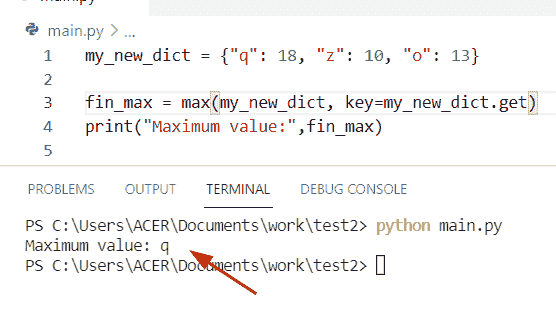
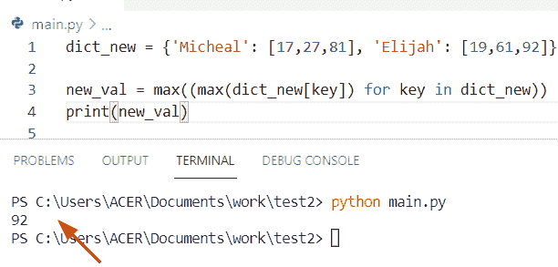

# Python 在字典中查找最大值

> 原文：<https://pythonguides.com/python-find-max-value-in-a-dictionary/>

[](https://sharepointsky.teachable.com/p/python-and-machine-learning-training-course)

在本 Python 教程中，我们将讨论 **Python 在字典中查找最大值**这里我们还将涵盖以下示例:

*   Python 在列表字典中查找最大值
*   Python 在字典中找到最高值
*   Python 在嵌套字典中查找最大值
*   在没有内置函数的情况下在 Python 字典中查找最大值
*   如何在字典 Python 中查找最小值和最大值
*   Python 在字典中查找最大键值

目录

[](#)

*   [Python 在字典中查找最大值](#Python_find_max_value_in_a_dictionary "Python find max value in a dictionary")
    *   [通过使用 dict.items()方法](#By_using_dictitems_method "By using dict.items() method")
    *   [通过使用 max()和 lambda 函数](#By_using_max_and_lambda_function "By using max() and lambda function")
    *   [通过使用 max()和 dict()值](#By_using_max_and_dict_values "By using max() and dict() values")
*   [Python 在列表字典中查找最大值](#Python_find_max_value_in_a_dictionary_of_lists "Python find max value in a dictionary of lists")
*   [Python 在字典中找到最高值](#Python_find_highest_value_in_dictionary "Python find highest value in dictionary ")
*   [Python 在嵌套字典中查找最大值](#Python_find_max_value_in_a_nested_dictionary "Python find max value in a nested dictionary")
*   [如何在 Python 字典中找到最小值和最大值](#How_to_find_min_and_max_value_in_dictionary_Python "How to find min and max value in dictionary Python")
*   [Python 在字典中查找最大键值](#Python_find_max_key_value_in_dictionary "Python find max key value in dictionary")

## Python 在字典中查找最大值

*   让我们看看如何在 Python 字典中找到最大值。
*   通过使用 **max()和 dict.get()** 方法，我们可以很容易地得到字典中最大值的键。
*   有多种方法可以完成这项任务
    *   通过使用 `dict.items()`
    *   通过使用带有λ函数的 `max()`
    *   通过使用 `max()` 和 `dict.values()`

**例题**

让我们举一个例子，检查如何使用 `max()` 函数在字典中找到最大值

为了从字典中获得最大值，我们可以使用内置的 `max()` 函数。在这个例子中，我们可以使用 iterable 和 dict 来获得与最大值配对的键。

**源代码:**

```py
my_new_dict = {"q": 18, "z": 10, "o": 13}

fin_max = max(my_new_dict, key=my_new_dict.get)
print("Maximum value:",fin_max)
```

下面是以下代码的截图



Python find max value in a dictionary

### 通过使用 dict.items()方法

如果你想在字典中迭代键值对，那么我们可以使用 `dict.items()` 方法。这个方法是 Python 中的一个内置函数，它将帮助用户从字典中获取最大值。

**举例:**

```py
import operator

max_dict = {'Australia':178, 'Germany':213, 'Japan': 867}
new_ma_val = max(max_dict.items(), key=operator.itemgetter(1))[0]
print((new_ma_val))
```

在上面的代码中，我们先导入操作符模块，然后用花括号 **{}创建一个字典。**现在声明一个**‘new _ ma _ val’**变量，并赋值 **max()和 key()** 函数作为参数。

下面是以下给定代码的输出


Python find max value in a dictionary by using dict

### 通过使用 max()和 lambda 函数

在这个例子中，我们可以使用 `max()` 和 lambda 函数的组合来从字典中获取值。

**源代码:**

```py
Country_dict = {'China':982, 'Egypt':758, 'Malaysia' : 12}

new_val = max(Country_dict, key= lambda x: Country_dict[x])
print("maximum value from dictionary:",new_val) 
```

在上面的代码中，我使用了 th `e max()` 函数，该函数使用 lambda 表达式返回**‘country _ dict’**变量的实例。

下面是以下给定代码的执行过程


Python find max value in a dictionary by using max with a lambda function

### 通过使用 max()和 dict()值

**源代码:**

```py
name_dict = {"Oliva": 18, "potter": 56, "Harry": 15}

new_val = name_dict.values()
maximum_val = max(new_val)
print("Maximum value from dict:",maximum_val) 
```

下面是以下给定代码的实现


Python find max value in a dictionary by using max and dict

阅读:[如何创建一个空的 Python 字典](https://pythonguides.com/how-to-create-an-empty-python-dictionary/)

## Python 在列表字典中查找最大值

*   为了找到列表字典中的最大值，我们可以使用 `max()` 函数。
*   为了解决这个问题，首先我们将创建一个字典并分配键值对元素。然后创建一个变量，并使用 `max()` 函数作为参数。

**源代码:**

```py
dict_new = {'Micheal': [17,27,81], 'Elijah': [19,61,92]}

new_val = max((max(dict_new[key]) for key in dict_new))
print(new_val) 
```

下面是以下代码的截图



Python find max value in a dictionary of lists

阅读: [Python 字典转 CSV](https://pythonguides.com/python-dictionary-to-csv/)

## Python 在字典中找到最高值

*   在 Python 中寻找字典中的最高值，我们可以使用 `key.get()` 的概念方法。
*   通过使用内置的 `max()` 方法。它提供了**‘alpha _ dict’**变量来从给定的字典中获取最大值并返回具有最大值的关键字，使用了 `dict.get()` 方法。

**举例:**

```py
alpha_dict = {"g": 14, "q": 16, "h": 19}

new_value = max(alpha_dict, key=alpha_dict.get)
print("Highest value from dictionary:",new_value)
```

下面是以下代码的截图


Python find the highest value in the dictionary

阅读: [Python 将字典转换为数组](https://pythonguides.com/python-convert-dictionary-to-an-array/)

## Python 在嵌套字典中查找最大值

*   为了执行这个特定的任务，我们可以使用 for 循环的概念来迭代每个键，并从嵌套字典中获取最大值。
*   在这个例子中，内部字典 `"variables"` 被存储为一个字符串，所以在应用了 `max()` 函数后，我将得到一个具有两个值的集合，一个是键，另一个是其对应的值，这样你就可以使用**元素> count_new。**

**源代码:**

```py
my_dictionary = {'Micheal' : {'i' : 15, 'z' : 14},
			'George' : {'q' : 2, 'y' : 10, 'w' : 3},
			'John' : {'n' : 19}}

new_out = {}
for new_k, new_v in my_dictionary.items():
	count_new = 0
	for element in new_v.values():
		if element > count_new:
			count_new = element
	new_out[new_k] = count_new

print(new_out)
```

首先在上面的代码中，我们将声明一个嵌套的字典，并在其中分配键值对元素。现在创建一个变量并分配一个空字典。为了检查字典中的最大值，我们声明了一个**‘count _ new’**变量，并将值设置为 **0。**如果元素大于 0，它将检查 for 循环中的条件，并将迭代所有值，并将它们存储在一个空字典中。

下面是以下给定代码的输出。


Python find max value in a nested dictionary

阅读:[从字典中获取所有值 Python](https://pythonguides.com/get-all-values-from-a-dictionary-python/)

## 如何在 Python 字典中找到最小值和最大值

*   在 Python 中查找字典中的最小值和最大值，我们可以使用内置的 **min()和 max()** 函数。
*   在 Python 中, `max()` 函数用于查找给定字典中的最大值。而在**的情况下，min()** 函数用于查找字典中的最小值。这些值可以存储字符串或数字。所以在这个例子中，我们把最大值和最小值分开，你会得到两个数字。

**举例:**

```py
 your_dictionary = {'Australia':1780, 'England':6723, 'Tokyo': 1946}

new_maximum_val = max(your_dictionary.keys(), key=(lambda new_k: your_dictionary[new_k]))
print('Maximum Value: ',your_dictionary[new_maximum_val])
new_minimum_val = min(your_dictionary.keys(), key=(lambda new_k: your_dictionary[new_k]))
print('Minimum Value: ',your_dictionary[new_minimum_val])
```

在上面的代码中，我用不同的值和键创建了一个字典。现在我们要计算字典的最小值和最大值。为了完成这个任务，我使用了 `max()` 函数，该函数使用 lambda 表达式返回**‘your _ dictionary’**变量的实例。而在使用 `min()` 函数的情况下，您也可以使用 lambda 表达式在 Python 字典中查找最小值。

下面是以下给定代码的执行过程


How to find min and max value in dictionary Python

阅读: [Python 元组字典](https://pythonguides.com/python-dictionary-of-tuples/)

## Python 在字典中查找最大键值

*   让我们看看如何在 Python 字典中找到 max **键值**对。
*   在 Python 中，字典用于包含键值对。如果您想访问这些值，您可以使用给定的键。在这种方法中，我们将从字典中检查出最大值。

**源代码:**

```py
dict_cities = {'Uganda': 763, 'France': 830, 'Tokyo': 193, 'Malaysia': 1682}
max_val = list(dict_cities.values())
max_ke = list(dict_cities.keys())
print(max_ke[max_val.index(max(max_val))])
```

这里**‘dict _ cities’**是给定的字典，key 保存所有字典键的列表。之后，我们创建一个变量**‘max _ val’**，并通过使用 `dict.values()` 方法将一个列表作为参数分配给它们，以保存所有字典值的列表，在最后一行，我们显示最大值的键。

下面是以下代码的截图


Python find max key value in a dictionary

您可能还想阅读以下 Python 字典教程:

*   [Python 从两个列表中创建一个字典](https://pythonguides.com/python-creates-a-dictionary-from-two-lists/)
*   [在 Python 中检查两个字典是否相等](https://pythonguides.com/check-if-two-dictionaries-are-equal-in-python/)
*   [Python 字典流行](https://pythonguides.com/python-dictionary-pop/)
*   [Python 字典复制](https://pythonguides.com/python-dictionary-copy/)
*   [Python 字典包含](https://pythonguides.com/python-dictionary-contains/)
*   [Python 字典按值搜索](https://pythonguides.com/python-dictionary-search-by-value/)
*   [Python 字典理解](https://pythonguides.com/python-dictionary-comprehension/)
*   [Python 字典多键](https://pythonguides.com/python-dictionary-multiple-keys/)

在本 Python 教程中，我们讨论了 **Python 在字典中查找最大值。**此外，我们还介绍了以下示例:

*   Python 在列表字典中查找最大值
*   Python 在字典中找到最高值
*   Python 在嵌套字典中查找最大值
*   在没有内置函数的情况下在 Python 字典中查找最大值
*   如何在字典 Python 中查找最小值和最大值
*   Python 在字典中查找最大键值

[Bijay Kumar](https://pythonguides.com/author/fewlines4biju/)

Python 是美国最流行的语言之一。我从事 Python 工作已经有很长时间了，我在与 Tkinter、Pandas、NumPy、Turtle、Django、Matplotlib、Tensorflow、Scipy、Scikit-Learn 等各种库合作方面拥有专业知识。我有与美国、加拿大、英国、澳大利亚、新西兰等国家的各种客户合作的经验。查看我的个人资料。

[enjoysharepoint.com/](https://enjoysharepoint.com/)[](https://www.facebook.com/fewlines4biju "Facebook")[](https://www.linkedin.com/in/fewlines4biju/ "Linkedin")[](https://twitter.com/fewlines4biju "Twitter")