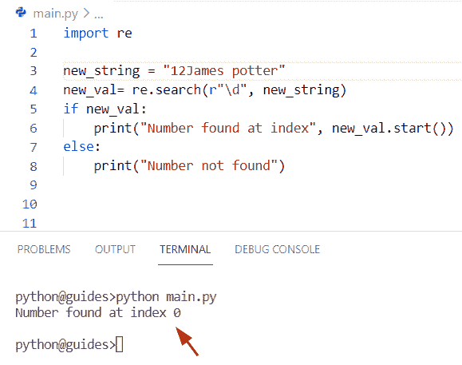
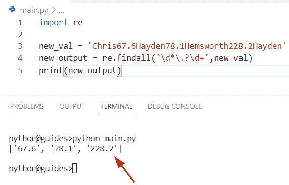

# Python 在字符串中查找数字

> 原文：<https://pythonguides.com/python-find-number-in-string/>

[](https://sharepointsky.teachable.com/p/python-and-machine-learning-training-course)

在本 [Python 教程](https://pythonguides.com/python-hello-world-program/)中，我们将学习**如何使用 Python** 在字符串中查找一个数字。此外，我们将涵盖这些主题。

*   Python 在字符串正则表达式中查找数字
*   Python 在字符串中查找值
*   Python 查找字符串中的第一个数字
*   Python 查找字符串中的最后一个数字
*   Python 在字符串中查找十进制数
*   Python 在字符串中查找浮点数
*   Python 在字符串中找到最大的数字
*   Python 在字符串中查找连续数字
*   Python 查找字符串中的字数
*   字符串反向的 Python 查找
*   Python 检查数字是否在字符串中
*   Python 在字符串中查找键值
*   Python 查找字符串中元音的数量

目录

[](#)

*   [Python 在字符串中查找数字](#Python_find_number_in_string "Python find number in string")
    *   [使用 Python 查找字符串中的数字](#Finding_a_number_in_a_string_by_using_Python "Finding a number in a string by using Python")
*   [Python 在字符串正则表达式中查找数字](#Python_find_number_in_string_regex "Python find number in string regex")
*   [Python 在字符串中查找值](#Python_find_value_in_string "Python find value in string")
*   [Python 找到字符串中的第一个数字](#Python_find_first_number_in_string "Python find first number in string")
*   [Python 找到字符串中的最后一个数字](#Python_find_last_number_in_string "Python find last number in string")
*   [Python 在字符串中找到十进制数](#Python_find_decimal_number_in_string "Python find decimal number in string")
*   [Python 在字符串中找到浮点数](#Python_find_float_number_in_string "Python find float number in string")
*   [Python 找到字符串中最大的数字](#Python_find_largest_number_in_string "Python find largest number in string")
*   [Python 在字符串中找到连续的数字](#Python_find_consecutive_numbers_in_string "Python find consecutive numbers in string")
*   [Python 查找字符串中的字数](#Python_find_number_of_words_in_string "Python find number of words in string")
*   [Python 在字符串中反向查找](#Python_find_in_string_reverse "Python find in string reverse")
*   [Python 检查字符串中是否有数字](#Python_check_if_number_in_string "Python check if number in string")
*   [Python 在字符串中查找键值](#Python_find_key_value_in_string "Python find key value in string")
*   [Python 查找字符串中元音的数量](#Python_find_number_of_vowels_in_string "Python find number of vowels in string")

## Python 在字符串中查找数字

*   在本期节目中，我们将讨论**如何利用 Python** 在字符串中求一个数。
*   为了在 Python 中从给定的字符串中找到数字，我们可以很容易地应用 `isdigit()` 方法。在 Python 中，如果所有数字字符都包含在输入字符串中，并且该函数从字符串中提取数字，则 `isdigit()` 方法返回 True。如果给定字符串中没有一个字符是数字，那么它将返回 False。

**语法:**

下面是 str.isdigit()方法的语法

```py
string.isdigit()
```

**注意:**这个方法没有任何参数，它总是返回布尔值 true 或 false。

**举例:**

让我们举一个例子，看看如何在一个字符串中找到一个数字

```py
new_string = "Germany26China47Australia88"

emp_str = ""
for m in new_string:
    if m.isdigit():
        emp_str = emp_str + m
print("Find numbers from string:",emp_str) 
```

在上面的代码中，我们创建了一个字符串，并在其中分配了整数和字母字符。现在我们将使用 `string.isdigit()` 方法，并且不向它传递任何参数。

作为输出，它只返回输入字符串中包含的整数值。

下面是以下给定代码的执行过程


Python find a number in string

阅读:[通过索引](https://pythonguides.com/remove-character-from-python-string-through-index/)从 Python 字符串中删除一个字符

### 使用 Python 查找字符串中的数字

这里我们可以应用 `append()` 和 `split()` 方法在 Python 中查找一个字符串中的数字。

在 Python 中， `append()` 函数用于将元素添加到列表的末尾。而 `split()` 函数用于将字符串分解成一个列表。

**源代码:**

```py
new_str = "Micheal 89 George 94"

emp_lis = []
for z in new_str.split():
   if z.isdigit():
      emp_lis.append(int(z))

print("Find number in string:",emp_lis)
```

在上面的代码中，我们使用了一个 for 循环来迭代列表中的每个单词。现在使用 str.append()函数并传递带有单词的 int(z)将其转换为整数。

一旦您打印了**‘EMP _ lis’**，那么输出将只显示一个包含整数值的列表。

下面是以下给定代码的输出


Python find a number in string

阅读: [Python 字符串格式化](https://pythonguides.com/python-string-formatting/)

## Python 在字符串正则表达式中查找数字

*   让我们看看如何使用 Python 中的正则表达式在字符串中找到一个数字。
*   通过使用正则表达式 **'[0-9]+'** 和 re.findall()方法。在 Python 中,[0-9]表示查找从 0 到 9 匹配的所有字符，而+符号表示连续数字字符。
*   在 Python 中， `re.findall()` 方法用于从左到右匹配字符串中的模式，它将以字符串列表的形式返回。

**语法:**

下面是 re.findall()方法的语法

```py
re.findall
          (
           pattern,
           string,
           flags=0
          )
```

**举例:**

让我们举个例子，检查一下**如何在 Python** 中使用正则表达式在一个字符串中找到一个数字。

```py
import re

new_string = 'Rose67lilly78Jasmine228Tulip'
new_result = re.findall('[0-9]+', new_string)
print(new_result)
```

在上面的代码中，我们创建了一个字符串**‘new _ string’**，其中插入了一些整数和字母字符。一旦您将打印**‘new _ result’**，那么输出将只显示列表中的整数值。

下面是以下给定代码的实现


Python find a number in string regex

阅读: [Python 字符串列表](https://pythonguides.com/python-string-to-list/)

## Python 在字符串中查找值

*   这里我们可以看到**如何在 Python** 中找到一个字符串中的值。为了执行这个特定的任务，我们将结合使用 `split()` 和 `str.isdigit()` 方法。
*   在这个例子中，我们通过使用 list comprehension 创建了一个列表，并将方法存储在其中。在 Python 中， `str.isdigit()` 方法用于检查给定的字符串是否包含数字。

**源代码:**

```py
fin_str = "Bangladesh 2578 England 8349 France 3900"

new_result= [int(m) for m in fin_str.split() if m.isdigit()]
print("Find value in string:",new_result)
```

你可以参考下面的截图


Python find value in a string

阅读:[从字符串 Python 中删除字符](https://pythonguides.com/remove-character-from-string-python/)

## Python 找到字符串中的第一个数字

*   在这个程序中，我们将讨论如何使用 Python 在字符串中找到第一个数字。
*   为了完成这个任务，我们将使用 `re.search()` 方法，这个函数检查字符串中任何位置的模式，它总是返回模式的第一个匹配，它只接受两个参数。

**语法:**

下面是 re.search()方法的语法

```py
new_val= re.search(pattern, string)
```

**源代码:**

```py
import re

new_string = "12James potter"
new_val= re.search(r"\d", new_string)
if new_val:
    print("Number found at index", new_val.start())
else:
    print("Number not found")
```

在上面的代码中，我们首先创建了一个字符串**‘new _ string’**，然后对它应用了 `re.search()` 方法。

现在我们将使用**‘if-else’**条件。如果数字包含在一个字符串中，那么它将显示索引号。如果没有，它将显示未找到的号码。

你可以参考下面的截图



Python find the first number in string

阅读:[如何在 Python 中创建字符串](https://pythonguides.com/create-a-string-in-python/)

## Python 找到字符串中的最后一个数字

*   在这一节中，我们将讨论如何使用 Python 找到字符串中的最后一个数字。
*   通过使用 `re.findall()` 方法，我们可以找到字符串中的最后一个数字。为了完成这个任务，我们首先要取一个字符串**‘new _ str’**，并给它分配整数和字母字符。
*   现在使用 `re.findall()` 方法从左到右匹配字符串中的模式。在这个方法中，有两个参数 pattern 和 string。

**举例:**

```py
import re

new_str ="73 Japan Germany Paris 36"
output=re.findall(r'\d+', new_str)[-1]
print("Last number in string:",output)

new_string = "Elijah Oliva 89" # Another method 
result= re.search(r"\d", new_string)
if result:
    print("Number found at index", result.start())
else:
    print("Number not found")
```

在上面的代码中，我们还使用了 `re.search()` 方法来获取索引号，该方法将检查字符串中任何位置的模式。

下面是以下给定代码的执行过程


Python find the last number in the string

阅读: [Python 从字符串中移除子串](https://pythonguides.com/python-remove-substring-from-a-string/)

## Python 在字符串中找到十进制数

*   在本期节目中，我们将讨论**如何利用 Python** 在字符串中求一个十进制数。
*   为了完成这个任务，我们使用 regex 模块 **'re'** ，然后创建一个字符串，在其中我们已经指定了十进制值。现在我们将应用 re.findall()方法，它将帮助用户匹配包含小数点数字的字符列表。
*   一旦您打印了**‘new _ output’**，那么输出将只显示给定字符串中可用的十进制值。

**源代码:**

```py
import re

new_val = 'Chris67.6Hayden78.1Hemsworth228.2Hayden'
new_output = re.findall('\d*\.?\d+',new_val)
print(new_output)
```

下面是以下给定代码的执行过程



Python find a decimal number in a string

阅读: [Python 3 string replace()方法](https://pythonguides.com/python-3-string-replace/)

## Python 在字符串中找到浮点数

*   在这一节中，我们将讨论如何使用 Python 在字符串中查找浮点数。
*   这里你可以更喜欢我们之前的例子，字符串中的十进制数。您可以使用 `re.findall()` 方法来获取列表中的小数或浮点数。
*   正如您在上面的屏幕截图中看到的，输出列表只包含十进制值。在 Python 中，浮点数代表十进制值。

## Python 找到字符串中最大的数字

*   这里我们可以看到**如何通过使用 Python** 找到一个字符串中的最大数字。
*   在这个例子中我们已经使用了 `max()` 和 `map()` 函数的概念来寻找字符串中的最大数。
*   在 Python 中， `map()` 函数用于类似 iterable 列表的每个元素，它总是返回一个迭代器 map 对象，而 `max()` 函数用于查找 iterable 中的最大元素。
*   在这个程序中，首先，我们有一个导入正则表达式模块，并使用概念 **'[0-9]'+** 来查找从 0 到 9 匹配的所有字符。

**举例:**

```py
import re

new_string = 'George,146,Micheal,23,John,228,Potter'
new_result = re.findall('[0-9]+', new_string)
print("Largest number in string:")
print (max(map(int, new_result)))
```

你可以参考下面的截图


Python find the largest number in string

正如你在截图中看到的，输出是 228。

阅读: [Python 比较字符串](https://pythonguides.com/python-compare-strings/)

## Python 在字符串中找到连续的数字

*   在这一节中，我们将讨论如何使用 Python 在一个字符串中找到连续的数字。
*   连续数字是指从最小的数字到最大的数字之间没有空格的连续数字。
*   这里我们将应用 regex 模块和 `re.search()` 方法来匹配字符串中的模式。

**源代码:**

```py
import re

new_string = "Blue2345green98red"
i = 4
new_val = re.search('\d{% s}'% i, new_string)
new_output = (new_val.group(0) if new_val else '')
print("Consecutive number in string:")
print(new_output)
```

下面是以下给定代码的输出


Python find consecutive numbers in string

阅读: [Python 在字符串](https://pythonguides.com/python-find-substring-in-string/)中查找子串

## Python 查找字符串中的字数

*   让我们看看**如何通过使用 Python** 在字符串中找到多个单词。
*   通过使用 `str.split()` 和 `len(iterable)` 方法，我们可以很容易地找到一个字符串中的单词数。
*   在 Python 中， `str.split()` 方法将字符串拆分成一个列表， `len()` 方法返回字符串或列表的长度。这个方法只有一个参数，就是一个可迭代对象，这是 Python 中的内置函数，可以用来测量可迭代对象的长度。

**源代码:**

```py
new_str = "Australia Japan Bangladesh"

new_val = new_str.split()
count_word = len(new_val)
print(count_word)
```

在上面的代码中，我们首先创建了一个字符串**‘new _ str’**，并检查一个字符串中有多少个单词。我们将创建一个变量**‘new _ val’**，并应用函数 `str.split()` 将字符串分解成一个列表。

现在使用 `len()` 函数来检查字符串的长度。一旦你打印了**‘count _ word’**，那么输出将显示一个字符串中的字数**‘3’**。

下面是以下代码的截图


Python find a number of words in a string

阅读:[在 Python 中切片字符串](https://pythonguides.com/slicing-string-in-python/)

## Python 在字符串中反向查找

*   在本节中，我们将讨论**如何使用 Python** 以逆序查找字符串。
*   在这个例子中，我们创建了一个字符串和一个字符串的任意索引。现在我想用 index 和 `str.rfind()` 方法找到第二个**‘M’**的索引。
*   在这个程序中，我们调用 `str.find()` 方法，它将帮助用户从索引 18 开始检查。现在在这个函数中，我们将 `0` 作为参数传递，它将从字符串的开头开始。

**源代码:**

```py
new_str = "Geroge, M,micheal,John,M"

new_indx = 18
output = new_str.rfind('M', 0, new_indx)
print(output)
```

下面是以下给定代码的执行过程


Python find in string reverse

正如您在截图中看到的，输出是 8。

阅读:[追加到字符串 Python](https://pythonguides.com/append-to-a-string-python/)

## Python 检查字符串中是否有数字

*   这里我们可以看到**如何使用 Python** 来检查数字是否包含在一个字符串中。
*   为了执行这个特定的任务，我们可以应用方法 `str.isdigit()` ，这个方法将检查条件，如果所有的整数字符都包含在给定的字符串中，那么它将返回 true，否则它将返回 false。

**语法:**

下面是 str.isdigit()方法的语法

```py
string.isdigit()
```

**举例:**

让我们举个例子来理解 isdigit()方法的工作原理

```py
new_string = '835' #integer value
print(new_string.isdigit())

new_str = 'George'
print(new_str.isdigit())
```

在上面的程序中，我们创建了一个字符串，并给它赋了一个整数值。现在使用 print 语句并传递 isdigit()方法，它将显示**‘true’**布尔值。同样，在字符串字母字符的情况下，它将显示**‘假’**值。

下面是以下给定代码的实现


Python checks if a number in a string

阅读:[添加字符串到列表 Python](https://pythonguides.com/add-string-to-list-python/)

## Python 在字符串中查找键值

*   在这一节中，我们将讨论如何在 Python 中找到字符串中的键值对。
*   通过使用 regex 模块，我们可以很容易地完成这项任务，但是首先，我们必须使用 `re.compile()` 和 `dict()` 方法从给定的字符串中获取键值对。
*   在 Python 中， `re.compile()` 方法用于编译以字符串形式提供的正则表达式模式，而 `dict()` 方法用于创建字典，该字典必须是无序的。

**源代码:**

```py
import re

new_val = "China=893 Australia=945"
result = re.compile(r"\b(\w+)=([^=]*)(?=\s\w+=\s*|$)")
new_output = dict(result.findall(new_val))
print(new_output)
```

在上面的代码中，我们首先创建了一个字符串**‘new _ val’**，然后包含被转义的等号。

下面是以下代码的截图


Python find key value in a string

另外，查看:[如何在 python 中连接字符串](https://pythonguides.com/concatenate-strings-in-python/)

## Python 查找字符串中元音的数量

*   在本期节目中，我们将讨论**如何使用 Python** 找到字符串中的多个元音。
*   在本例中，我们将从用户处获取一个字符串，并将其存储在变量**‘new _ string’**中。现在使用 print 语句并分配 map 函数和 **lower()。count()** 方法，它将打印字符串中元音的总数。

**源代码:**

```py
new_string = input("Enter the string: ")

print(*map(new_string.lower().count, "aeiou"))
```

下面是以下给定代码的输出


Python find a number of vowels in a string

您可能会喜欢以下 Python 教程:

*   [如何在 python 中使用正则表达式拆分字符串](https://pythonguides.com/python-split-string-regex/)
*   [在 Python 中检查列表是否为空–39 个例子](https://pythonguides.com/check-if-a-list-is-empty-in-python/)
*   [如何在 Python 中把列表转换成字符串](https://pythonguides.com/python-convert-list-to-string/)
*   [Python 方块一号](https://pythonguides.com/python-square-a-number/)
*   [无换行符的 Python 打印](https://pythonguides.com/python-print-without-newline/)
*   [如何在 python 中把整数转换成字符串](https://pythonguides.com/convert-an-integer-to-string-in-python/)

在本教程中，我们已经学习了如何使用 Python 在字符串中查找数字。此外，我们已经讨论了这些主题。

*   Python 在字符串正则表达式中查找数字
*   Python 在字符串中查找值
*   Python 查找字符串中的第一个数字
*   Python 查找字符串中的最后一个数字
*   Python 在字符串中查找十进制数
*   Python 在字符串中查找浮点数
*   Python 在字符串中找到最大的数字
*   Python 在字符串中查找连续数字
*   Python 查找字符串中的字数
*   字符串反向的 Python 查找
*   Python 在字符串正则表达式中查找子字符串
*   Python 检查数字是否在字符串中
*   Python 在字符串中查找键值
*   Python 查找字符串中元音的数量

[Bijay Kumar](https://pythonguides.com/author/fewlines4biju/)

Python 是美国最流行的语言之一。我从事 Python 工作已经有很长时间了，我在与 Tkinter、Pandas、NumPy、Turtle、Django、Matplotlib、Tensorflow、Scipy、Scikit-Learn 等各种库合作方面拥有专业知识。我有与美国、加拿大、英国、澳大利亚、新西兰等国家的各种客户合作的经验。查看我的个人资料。

[enjoysharepoint.com/](https://enjoysharepoint.com/)[](https://www.facebook.com/fewlines4biju "Facebook")[](https://www.linkedin.com/in/fewlines4biju/ "Linkedin")[](https://twitter.com/fewlines4biju "Twitter")