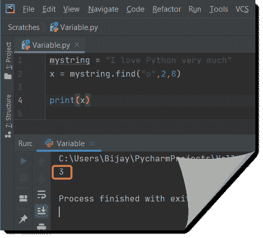

# Python 在 string + Examples 中查找子串

> 原文：<https://pythonguides.com/python-find-substring-in-string/>

[](https://sharepointsky.teachable.com/p/python-and-machine-learning-training-course)

在这个 [Python 教程](https://pythonguides.com/learn-python/)中，我们将讨论关于 **Python 在字符串**中查找子串的所有内容，并给出几个例子。我们将看到，如何在 Python 中从一个字符串中找到子串。

*   如何在字符串中查找子串
*   如何使用 Python string find()方法从字符串中查找子串
*   在 Python 中检查字符串是否包含子串
*   如何用 Count()方法计算字符串 python 中的子串
*   在 Python 中检查字符串中的子字符串是否
*   Python 使用多个分隔符分割字符串
*   Python 使用 split()方法将字符串拆分为子字符串
*   Python string startswith substring
*   用 Python 从字符串中提取数字
*   在 python 中检查字符串是否包含单词
*   如何在 Python 中找到最长的回文子串
*   在 Python 中查找字符串的最后一个索引
*   如何检查一个 python 字符串是否包含另一个字符串

目录

[](#)

*   [Python 在字符串中查找子串](#Python_find_substring_in_a_string "Python find substring in a string")
*   [使用 Python string find()方法从字符串中查找子字符串](#Find_substring_from_string_using_Python_string_find_method "Find substring from string using Python string find() method")
*   [在 Python 中检查一个字符串是否包含子串](#Check_if_a_string_contains_a_substring_in_Python "Check if a string contains a substring in Python")
*   [使用 Count()方法对字符串 python 中的子串进行计数](#Count_substring_in_string_python_using_count_method "Count substring in string python using count() method")
*   [在 Python 中检查字符串中的子串是否](#Check_if_a_substring_in_a_string_in_Python "Check if a substring in a string in Python")
*   [Python 用多个分隔符分割字符串](#Python_split_string_with_multiple_delimiters "Python split string with multiple delimiters")
*   [Python 使用 split()方法将字符串拆分为子字符串](#Python_split_string_to_substring_using_split_method "Python split string to substring using split() method")
*   [Python 字符串以子字符串](#Python_string_startswith_substring "Python string startswith substring")开始
*   [Python 从字符串中提取数字](#Python_extract_number_from_string "Python extract number from string")
*   [检查一个字符串是否包含 python 中的单词](#Check_if_a_string_contains_a_word_in_python "Check if a string contains a word in python")
*   [最长回文子串 python](#Longest_palindromic_substring_python "Longest palindromic substring python")
*   [如何在 Python 中找到字符串的最后一个索引](#How_to_find_last_index_of_a_string_in_Python "How to find last index of a string in Python")
*   [检查一个 python 字符串是否包含另一个字符串](#Check_if_a_python_string_contains_another_string "Check if a python string contains another string")
    *   [1-使用 in 运算符](#1-_Using_in_operator "1- Using in operator")
    *   [2-使用 find()方法](#2-_Using_find_method "2- Using find() method")
    *   [3-使用 index()方法](#3-_Using_index_method "3- Using index() method")

## Python 在字符串中查找子串

让我们看看**如何在字符串**中找到子串。

*   在 python 中，我们可以使用 Python 中的字符串**切片**从一个字符串中找到一个子串。切片从起始位置开始，在结束位置索引处结束。
*   要子串任何字符串，我们可以使用切片将字符串子串。
*   它可以将任何字符串作为输入，并将产生一个子字符串作为输出。

**举例:**

*   首先，我们需要取一个字符串作为值。在下面的 python 代码中，你可以看到，我把值取为**“欢迎使用 Python 指南”**。
*   然后我们需要将字符串值存储在某个变量**“value”**中。
*   现在打印 `"text"` ，它将给出所需的子串。

**代码为 Python 字符串的子串**

下面展示了 **python 子串**的代码。

```py
value = 'Welcome to Python Guide'
text = value[18:]
print(text)
```

这里，

*   `Start-` 子串的起始索引，索引中出现的字符称为子串。如果我们不提到开始，那么它被假定为等于 0。在上面的代码中，我以 `18` 为起点。
*   `end-` 称为子串的终止索引。如果没有包含结尾，或者指定的值超过了字符串长度，则默认情况下假定它等于该长度。在上面的代码中，我没有使用 end，所以默认情况下，它将使用 end 值。

写完上面的 Python 代码(string substring)后，你将打印出 `"text"` ，然后输出将显示为 `"Guide"` ，因为我们已经从第 18 个索引到最后一个索引，所以我们得到了字符串的最后 5 个字符。

另外，你可以参考下面的截图。


Python find substring in string

这是**如何在 Python** 中从一个字符串中找到一个子串。

阅读:[Python 中的切片字符串+示例](https://pythonguides.com/slicing-string-in-python/)

## 使用 Python string find()方法从字符串中查找子字符串

*   通过使用 **Python find()方法**，我们可以在一个字符串中找到指定子字符串值的第一个匹配项。如果 find()方法返回-1，则该值不在字符串中。
*   为了从字符串中查找任何子字符串值，我们有一个内置的 find()函数，它将查找特定的值。
*   该函数可以接受任何字符串作为输入，并且可以产生一个整数值作为输出。

**举例:**

*   首先，我们需要取一个字符串值。在下面的 python 代码中，你可以看到，我把值取为**“Python 很容易”**。
*   然后我们需要在某个变量**“a”**中存储指定的子串值。
*   现在打印出 `"a"` ，它将给出该索引的整数值。

查看 [Python 程序，用示例](https://pythonguides.com/python-program-to-reverse-a-string/)反转字符串。

**python 字符串查找的代码()**

按照下面的代码，使用 Python string find()方法查找字符串的子字符串。

```py
msg = 'Python is easy'
a = msg.find("easy")
print(a)
```

*   写完上面的 Python 代码(字符串查找)后，你将打印出 `"a"` ，然后输出将显示为 `"10"` ，因为我们想从字符串中找到**简单的**。因此，这里索引 10 是作为输出的整数值。另外，你可以参考下面的截图。


Python string find()

这就是如何**使用 Python string find()方法**从字符串中找到子字符串。

阅读:[无法将字符串转换为浮点 Python](https://pythonguides.com/could-not-convert-string-to-float-python/)

## 在 Python 中检查一个字符串是否包含子串

*   通过在"操作符中使用**，它被用作比较操作符，也是**检查一个字符串是否包含 Python** 中的子串的最简单方法。如果字符串包含字符，则该运算符返回 true，否则返回 false。**
*   为了检查字符串是否存在，我们使用这个操作符，它将返回一个布尔值。
*   该函数可以将任何字符串值作为输入，并将返回**真**或**假**作为输出。

**举例:**

*   首先，我们需要取一个字符串值。在下面的 python 代码中，你可以看到，我已经把值取为**“你好 John，你好吗”**。
*   然后我们需要将指定的子串值存储在某个变量**“store”**中。
*   现在打印**“store”**，它将返回值 true 或 false。

**python 代码检查字符串是否包含子串**

下面显示了用于检查字符串是否包含子字符串的 python 代码。

```py
msg = "Hello John, how are you"
store = ('how' in msg)
print(store)
```

*   写完上面的 Python 代码来检查(string 包含 substring)，你会打印出**【store】**然后输出会出现**【True】**作为**【如何】**存在于其中。另外，你可以参考下面的截图。


Check if string contains substring

*   如果字符串不包含指定的值，那么它将返回**“false”**作为输出。你可以参考下面的截图。


Check if a string contains a substring in Python

上面的代码，我们可以用 Python 中的来**检查一个字符串是否包含一个子串。这是一个**如何在 python** 中检查一个字符串中是否存在子串的例子。**

阅读:[在 Python 中把字符串转换成浮点数](https://pythonguides.com/convert-string-to-float-in-python/)

## 使用 Count()方法对字符串 python 中的子串进行计数

*   Python 中的 **count()方法返回指定子串在列表中出现的次数。**
*   在 Python 中查找给定字符串中指定子字符串的匹配项。我们使用 count()方法返回子串在 Python 中出现的次数。
*   该函数可以将任何字符串值作为输入，它将返回指定的子字符串值。子字符串在其中出现的次数。

**举例:**

*   首先，我们需要取一个字符串值。在下面的 python 代码中，你可以看到，我把值取为**“约翰好，但约翰话少”**。
*   然后我们需要将指定的子串值存储在某个变量“store”中。
*   现在打印“store ”,它将返回出现的子字符串。这是它出现的次数。

**python 字符串计数的代码()**

下面显示了字符串计数()的 python 代码

```py
msg = "John is good but John talk less"
store = msg.count("John")
print(store)
```

写完上面的 Python 代码(字符串计数)后，你将打印出**【store】**，然后输出将出现**【2】**，因为**【约翰】**出现了两次。另外，你可以参考下面的截图。


Python string count()

这样，我们可以使用 **Python string count()方法**来计算一个子串在 string python 中出现的次数。

阅读:[追加到一个字符串 Python +示例](https://pythonguides.com/append-to-a-string-python/)

## 在 Python 中检查字符串中的子串是否

让我们检查 Python 中的字符串中的子串。我们可以使用**`if`**条件，而运算符中的**用于在 Python 中检查一个字符串中的子串。`**`

 `**`举例:**

```py
string = ' Welcome to Python '
if "Welcome" in string:
print('yes')
else:
print('No')
```

在编写了上面的 python 代码(Python 字符串中的子串)之后，你将打印出这些代码，然后输出将显示为 `" Yes "` ，因为 `" Welcome "` 出现在字符串中。这里， `"` 运算符中的 `"` **如果子串出现在字符串中，则返回 true，否则返回 false。**

另外，你可以参考下面的截图。


Python substring in a string

这就是如何在 Python 中**检查一个字符串中的子串是否。**

阅读: [Python 比较字符串](https://pythonguides.com/python-compare-strings/)

## Python 用多个分隔符分割字符串

在 python 中，我们使用 `re.split()` 方法用多个分隔符来分隔字符串，分隔符用逗号分隔值。

**举例:**

```py
import re
msg = " I want\n to learn, python as\nit is* easy."
print(re.split('; | , |\n|\*', msg))
```

写完上面的 python 代码(Python 拆分多个分隔符)，你要打印的那些然后输出会出现 **" ['我要'，'要学，Python 为'，'这是'，'容易。'] "** 在这里，它将用逗号和空格作为分隔符进行拆分。另外，你可以参考下面的截图。


Python split string with multiple delimiters

这就是如何在 Python 中**用多个分隔符拆分字符串。**

阅读: [Python 程序反转字符串示例](https://pythonguides.com/python-program-to-reverse-a-string/)

## Python 使用 split()方法将字符串拆分为子字符串

让我们看看如何在 Python 中使用 split()方法**将一个字符串拆分为 substring。**

*   使用 **Python split()方法**我们可以将一个字符串分成几部分。这些片段作为列表返回。
*   为了分割任何字符串，我们有一个内置的 split()，它将把字符串分割成一个列表。
*   该函数可以将任何字符串作为输入，并且可以生成一个列表作为输出。

**举例:**

*   首先，我们需要取一个字符串值。在下面的 python 代码中，你可以看到，我把值取为**“欢迎使用 Python 指南”**。
*   然后我们需要将字符串值存储在某个变量**“value”**中。
*   现在打印**“值”**，它将给出列表。

**python 字符串 split()的代码**

下面代表的是用 python 代码来**拆分字符串**。

```py
value = 'Welcome to Python Guide'
print(value.split())
```

*   写完上面的 Python 代码(字符串拆分)，你将打印出 `value.split()` ，然后输出将显示为一个列表 **'['欢迎'，' to '，' Python '，' Guide']'** 。另外，你可以参考下面的截图。


Python split string to substring

这就是如何使用 **Python split()方法**来拆分字符串。

阅读: [Python 字符串格式化示例](https://pythonguides.com/python-string-formatting/)。

## Python 字符串以子字符串开始

让我们看看如何使用 **Python 字符串 startswith()方法**。

*   **Python startswith()方法**返回一个布尔值。如果指定的字符串以前缀开头，startswith()返回 true，否则返回 false。如果我们想得到第一个字符串值，我们可以使用这个方法。
*   为了从字符串中获取第一个值，使用了内置的 **startswith()方法**。
*   该函数可以将任何字符串值作为输入，如果指定的子字符串匹配，它将返回 true 值。

**举例:**

*   首先，我们需要取一个字符串值。在下面的 python 代码中，你可以看到，我已经把值取为**“Hi John”**。
*   然后我们需要将指定的子串值存储在某个变量**“store”**中。
*   现在打印**“store”**，它将返回字符串值作为**“True”**。

**Python 字符串 startswith()代码:**

下面显示了字符串 startswith()的 python 代码

```py
msg = "Hi John"
store = msg.startswith('Hi')
print(store)
```

*   写完上面的 Python 代码(string startswith)，你将打印出 `"store"` ，然后输出将显示为 `"True"` ，如果指定的条件为真，则输出为假。另外，你可以参考下面的截图。


Python string startswith()

*   如果子字符串不是以指定的值开始，那么它将返回**“false”**作为输出。你可以参考下面的截图。


Python string startswith()

下面是一个以子串开始的 **Python 字符串的例子。**

阅读 [Python 字典扩展](https://pythonguides.com/python-dictionary-extend/)

## Python 从字符串中提取数字

通过使用 python 中的 **split 函数**将字符串转换为列表，可以从字符串中提取数字。然后**列表理解**帮助我们遍历列表，**是数字函数**帮助我们从字符串中取出数字。

**举例:**

```py
my_string = "Welcome 2 python 5"
number = [int(w) for w in my_string.split() if w.isdigit()]
print(number)
```

写完上面的代码(python 从字符串中提取数字)，你将打印出 `"number"` ，然后输出将显示为 **" [2 5]"。**这里，我们将使用 `isdigit()` 方法从字符串中获取数字。

你可以参考下面的截图 python 从字符串中提取数字。


Python extract number from string

上面的 Python 代码我们可以用来从 Python 中的字符串提取数字。

## 检查一个字符串是否包含 python 中的单词

检查字符串是否包含单词最简单的方法是 Python 中“操作符中的**”。如果字符串包含单词，该运算符返回 true，否则返回 false。**

**举例:**

```py
my_str = "Rahul is good player"
check = "good" in my_str
print(check)
```

写完上面的代码(在 python 中检查一个字符串是否包含 word)，你将打印出**“check”**，然后输出将显示为**“真”。**这里，我们将在操作符中使用**来检查一个字符串是否包含该单词。**

你可以参考下面的截图检查一个字符串是否包含 python 中的单词


Check if a string contains word in python

上面的 Python 代码，我们可以用来**检查一个字符串是否包含 python** 中的一个单词。

## 最长回文子串 python

为了得到最长的回文子串，我们将检查每个子串是否是回文。

我们将遍历字符串，将每个字符视为回文的中间部分，并尝试通过比较左边的字符和右边的字符来构建回文。

**举例:**

```py
class find(object):
   def longestPalindrome(self, x):
      v = [[False for i in range(len(x))] for i in range(len(x))]
      for i in range(len(x)):
         v[i][i] = True
      max_length = 1
      start = 0
      for l in range(2,len(x)+1):
         for i in range(len(x)-l+1):
            end = i+l
            if l==2:
               if x[i] == x[end-1]:
                  v[i][end-1]=True
                  max_length = l
                  start = i
            else:
               if x[i] == x[end-1] and v[i+1][end-2]:
                  v[i][end-1]=True
                  max_length = l
                  start = i
      return x[start:start+max_length]
obj1 = find()
print(obj1.longestPalindrome("ZABBABBACD"))
```

写完上面的代码(最长的回文子串 python)，你将打印出`" obj 1 . longestpalindrome(" zabbabacd ")"`，然后输出将显示为 **" ABBABBA "。**这里，我们得到最长的回文子串。

可以参考下面截图最长的回文子串 python


Longest palindromic substring python

这就是如何**找到最长的回文子串 python** 。

## 如何在 Python 中找到字符串的最后一个索引

让我们看看**如何在 python** 中找到一个字符串的最后一个索引。

在 python 中， `rindex()` 方法用于查找字符串的最后一个索引。

**举例:**

```py
my_str = "Hello, how are you"
f = my_str.rindex("u")
print(f)
```

写完上面的代码(一个字符串 python 的最后一个索引)，你将打印出 `"f"` ，然后输出将显示为 **" 17 "。**在这里， `rindex()` 方法返回指定值的最后一个索引，如果没有这样的索引存在，则引发异常。

可以参考下面截图一个字符串 python 的最后一个索引。


How to find last index of a string in Python

上面的 Python 代码，我们可以用来**查找 Python** 中一个字符串的最后一个索引。

另外，检查:[如何在 Python 中从列表中获取字符串值](https://pythonguides.com/how-to-get-string-values-from-list-in-python/)

## 检查一个 python 字符串是否包含另一个字符串

在其他面向对象语言中，我们可以使用 `contains` 方法来检查一个 python 字符串是否包含另一个字符串。

在 python 中，有一些方法可以检查一个 python 字符串是否包含另一个字符串。

### **1-使用中运算符**

我们可以在操作符中使用**来检查一个 python 字符串是否包含另一个字符串。**

在操作符中使用**是检查字符串是否包含另一个字符串的一种简单明了的方法。**

让我们来看一个例子

示例:

```py
mystring = "I love Python"

print("Python" in mystring)
print("Java" in mystring)
```

在这里查看输出


check if a python string contains another string

在上面的例子中，我们看到由于“Python”存在于字符串中，所以它返回 True，由于“Java”不存在于字符串中，所以它返回 False。

### 2- **使用 find()方法**

检查一个 python 字符串是否包含另一个字符串的另一种方法是使用 `find()` 。这是 python 内置的方法。

`find()` 方法返回第一次出现的指定值。

如果没有找到该值，则返回 `-1` 。

句法

```py
string.find(value, start, end)
```

其中开始和结束参数是可选的。

让我们来看一个例子

例子

```py
mystring = "I love Python"
x = mystring.find("Python")
print(x)
```

现在看看这里的输出


How to check if a python string contains another string

例子

```py
x = mystring.find("Python")
y = mystring.find("java")
print(x)
print(y)
```

输出将是 7 和-1。–1，因为 java 不在字符串中。


check if a python string contains another string

示例:

```py
mystring = "I love Python very much"
x = mystring.find("o",2,8)

print(x)
```

在这里查看输出



check if a python string contains another string

### `3-` **利用指数()方法**

我们可以使用 `index()` 方法在字符串内部找到一个字符串第一次出现的起始索引。

如果指定的字符串不在字符串中，那么它将抛出一个异常。

让我们看一个同样的例子

句法

```py
string.index(value, start, end)
```

其中开始和结束是可选的。

示例:

```py
mystring = "I love Python very much"
x = mystring.index("Python")

print(x)
```

看到这里的输出了吗


`index() method` in python

示例:

```py
mystring = "I love Python very much"
x = mystring.index("o",2,8)

print(x)
```


index() method in Python

这就是**如何检查一个 python 字符串是否包含另一个字符串**。

您可能会喜欢以下 Python 示例:

*   [如何在 python 中连接字符串](https://pythonguides.com/concatenate-strings-in-python/)
*   [Python 字典更新示例](https://pythonguides.com/python-dictionary-update/)
*   [Python NumPy max 带示例](https://pythonguides.com/python-numpy-max-with-examples/)
*   [值错误:用序列](https://pythonguides.com/valueerror-setting-an-array-element-with-a-sequence/)设置数组元素

在本 Python 教程中，我们学习了， **Python 在字符串**中查找子串以及下面的例子:

*   如何在字符串中查找子串
*   使用 Python string find()方法从字符串中查找子字符串
*   在 Python 中检查字符串是否包含子串
*   使用 Count()方法计算字符串 python 中的子字符串
*   在 Python 中检查字符串中的子字符串是否
*   Python 使用多个分隔符分割字符串
*   Python 使用 split()方法将字符串拆分为子字符串
*   Python string startswith substring
*   用 Python 从字符串中提取数字
*   在 python 中检查字符串是否包含单词
*   如何在 Python 中找到最长的回文子串
*   如何在 Python 中找到字符串的最后一个索引
*   如何检查一个 python 字符串是否包含另一个字符串

[Bijay Kumar](https://pythonguides.com/author/fewlines4biju/)

Python 是美国最流行的语言之一。我从事 Python 工作已经有很长时间了，我在与 Tkinter、Pandas、NumPy、Turtle、Django、Matplotlib、Tensorflow、Scipy、Scikit-Learn 等各种库合作方面拥有专业知识。我有与美国、加拿大、英国、澳大利亚、新西兰等国家的各种客户合作的经验。查看我的个人资料。

[enjoysharepoint.com/](https://enjoysharepoint.com/)[](https://www.facebook.com/fewlines4biju "Facebook")[](https://www.linkedin.com/in/fewlines4biju/ "Linkedin")[](https://twitter.com/fewlines4biju "Twitter")****