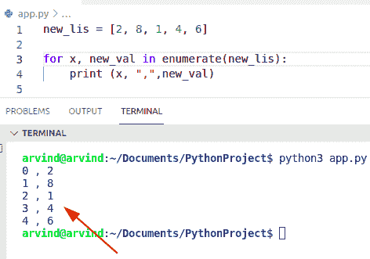

# Python for 循环索引+示例

> 原文：<https://pythonguides.com/python-for-loop-index/>

[](https://sharepointsky.teachable.com/p/python-and-machine-learning-training-course)

在本 [Python 教程](https://pythonguides.com/learn-python/)中，我们将讨论 **Python for loop index。**这里我们还将涵盖下面的例子:

*   Python for 循环索引范围
*   Python for 循环索引和值
*   Python for 循环索引从 1 开始
*   Python for 循环索引从 0 开始
*   Python for 循环索引增量
*   Python for 循环索引减量
*   Python for 循环索引超出范围
*   Python for 循环向后索引
*   Python for 循环索引字典
*   Python for 循环索引范围从 1 开始
*   Python for 循环遍历数据帧索引

目录

[](#)

*   [Python for 循环索引](#Python_for_loop_index "Python for loop index")
    *   [通过使用 range()函数](#By_using_range_function "By using range() function")
    *   [通过使用 zip 功能](#By_using_zip_function "By using zip function")
    *   [通过使用 map()函数](#By_using_map_function "By using map() function")
*   [Python for 循环索引范围](#Python_for_loop_index_range "Python for loop index range")
*   [Python for 循环索引和值](#Python_for_loop_index_and_value "Python for loop index and value ")
*   [Python for 循环索引从 1 开始](#Python_for_loop_index_start_at_1 "Python for loop index start at 1")
*   [Python for 循环索引从 0 开始](#Python_for_loop_index_start_at_0 "Python for loop index start at 0")
*   [Python for 循环索引增量](#Python_for_loop_index_increment "Python for loop index increment")
*   [Python 为循环索引减量](#Python_for_loop_index_decrement "Python for loop index decrement")
*   [Python for 循环索引超出范围](#Python_for_loop_index_out_of_range "Python for loop index out of range")
    *   [解决方案:](#Solution "Solution:")
*   [Python for 循环索引向后](#Python_for_loop_index_backwards "Python for loop index backwards")
    *   [通过使用 reversed()函数](#By_using_reversed_function "By using reversed() function")
    *   [通过使用 range()函数](#By_using_range_function-2 "By using range() function")
*   [Python for 循环索引字典](#Python_for_loop_index_dictionary "Python for loop index dictionary ")
*   [Python for 循环索引范围从 1 开始](#Python_for_loop_index_range_start_at_1 "Python for loop index range start at 1")
*   [Python for 循环遍历数据帧索引](#Python_for_loop_through_dataframe_index "Python for loop through dataframe index")

## Python for 循环索引

*   让我们看看如何在 Python 中检查 for 循环的索引。
*   要检查 for 循环中的索引，可以使用 `enumerate()` 函数。在 Python 中，enumerate()是一个内置函数，它允许我们遍历一个列表，并在 for 循环的迭代过程中计算元素的数量。
*   在 Python 中有各种方法来检查如何检查 for 循环中的索引。
    *   使用 range()函数
    *   使用 zip()函数
    *   使用 map()函数

**例子:**

让我们举个例子，用 enumerate()函数检查 for 循环中的索引。

**源代码:**

```py
new_lis = [2, 8, 1, 4, 6]

for x, new_val in enumerate(new_lis):
	print (x, ",",new_val)
```

下面是以下给定代码的执行过程



Python for loop index

### 通过使用 range()函数

这是另一个迭代列表范围的例子，可以通过组合 `range()` 和 `len()` 函数来执行。这个函数总是返回一个具有数字范围的可迭代序列。

下面是源代码:

```py
my_lis = [6, 1, 9, 2]

for new_indic in range(len(my_lis)):
   print(new_indic, my_lis[new_indic])
```

下面是以下代码的截图


Python for loop index range function

阅读 [Python 数字猜谜游戏](https://pythonguides.com/python-number-guessing-game/)

### 通过使用 zip 功能

要完成这项任务，我们可以很容易地使用 Python 中的函数 zip()。这个方法总是返回一个元组迭代器，其中作为参数传递的所有值都成对包含。

**举例:**

```py
new_str = ['e', 'f', 'i']

for m in zip(range(len(new_str)), new_str):
        print(m)
```

实施:


Python for loop index zip function

### 通过使用 map()函数

为了执行这个任务，我们可以很容易地使用 Python 中的 `map()` 函数。这是 Python 中的一个内置函数，用于将一个函数应用于序列中的所有元素。

**举例:**

```py
new_str2 = ['Germany', 'England', 'France']

new_out = map(lambda o: (o, new_str2[o]), range(len(new_str2))) #map function
print(list(new_out))
```

下面是以下给定代码的执行过程


Python for loop index map function

这就是如何检查 python 的循环索引

读: [For 循环 vs Python 中的 while 循环](https://pythonguides.com/for-loop-vs-while-loop-in-python/)

## Python for 循环索引范围

*   range 函数根据给定的第一个和最后一个索引给出一个整数序列。在本例中，第一个索引没有给出。默认情况下，索引值设置为 0。

**语法:**

```py
for index in range(n):
    statement
```

在此语法中,“n”参数是循环终止语句的次数。

**举例:**

```py
for index in range(2,8):
    print("loop index range",index)
```

在上面的代码中，我们必须将 for 循环与 `range` 函数一起使用，并显示从 2 到 7 的 6 个数字。


Python for loop index range

阅读: [Python For 循环](https://pythonguides.com/python-for-loop/)

## Python for 循环索引和值

*   让我们看看如何在 For 循环中访问元素的索引。
*   在 Python 中，我们可以在每次迭代时将 iterable 对象中的下一项分配给循环。

**举例:**

```py
new_val = ["i", "m", "k"]
new_index = 0

for value in new_val:
   print(new_index, value)
   new_index += 1
```

在上面的代码中，索引是一个整数，循环的每次迭代都打印索引和值。首先在这个例子中，我们将声明一个变量来存储索引，并在每次迭代中更新它。

下面是以下给定代码的输出


Python for loop index and value

阅读: [Python while 循环继续](https://pythonguides.com/python-while-loop-continue/)

## Python for 循环索引从 1 开始

*   在 Python 中为了**在索引 1** 处开始一个 for 循环，我们可以很容易地跳过第一个索引 0。
*   通过使用切片方法**【start:】**我们可以轻松地执行这个特定的任务。在本例中，我们必须将索引值设为 1，并将**‘start’**设为所需的索引。
*   通过使用这个操作符，我们可以指定在哪里开始切片，在哪里停止，并指定步骤。

**举例:**

```py
my_new_lis = ["Alena", "Joseph", "Mathew"]

for indx in my_new_lis[1:] :
      print(indx)
```

在上面的代码中，您可以看到我们已经创建了一个列表，并从索引“1”开始通过**‘my _ new _ lis’**对其进行迭代。

下面是以下给定代码的执行过程


Python for loop index starts at 1

**检查如何访问索引 1 处循环的另一个示例**

*   如果我们想访问列表的值和索引，那么我们可以使用 Python 内置函数 enumerate()。此方法将索引值添加到 iterable 项中，并将它们组合作为枚举器对象返回。
*   现在让我们举一个例子，检查如何使用这种方法。

**源代码:**

```py
new_list = ["e","u","o","p","g"]
print("Values in list with index:") 
for new_indices, new_val in enumerate(new_list, start=1): 
    print(list((new_indices, new_val))) 
```

首先在上面的代码中，我们将创建一个枚举器对象，并通过使用“new_list”作为参数将该对象转换为一个列表，并将输出显示到每个单独的列表中。在本例中，我们必须将**‘start’**关键字设置为参数，并将索引值从 0 更改为 1。

该源代码将产生以下输出:


Python for loop index starts at 1

阅读:[Python 中的索引和切片](https://pythonguides.com/indexing-and-slicing-in-python/)

## Python for 循环索引从 0 开始

*   在 Python 中，默认情况下，范围从 0 开始，到传递的参数值-1 结束。
*   在这个例子中，我们不遍历列表中的条目。我们将使用索引从 `len(new_lis)` 函数中迭代条目，然后我们使用这个索引变量来检查 0 序列中的列表编号..其中 n 是列表的最后一个数字。

**源代码:**

```py
new_lis = ["j","l","q","u","e","t"]

print("index start at:")

for new_indx in range(len(new_lis)):
    print(new_indx, new_lis[new_indx], end = "\n")
```

下面是以下代码的截图


Python for loop index start at 0

**检查如何访问索引为 0 的循环的另一个示例**

在本例中，首先，我们将指定一个索引值为“0”。现在，循环的每次迭代都打印索引以及列表中的值。

**举例:**

```py
my_val = [9,2,3,4,7,8]
new_index = 0

for value in my_val:
   print(new_index, value)
   new_index += 1
```

**输出:**


Python for loop index start at 0

阅读: [Python 字典索引](https://pythonguides.com/python-dictionary-index/)

## Python for 循环索引增量

*   让我们看看如何在 Python 中访问索引增量处的 for 循环。
*   通过使用 range()函数，我们可以逐步遍历 iterable 中的条目。该功能由三个参数**开始、停止和步进组成。**此方法将不包括止损值。

**源代码:**

```py
new_list = [4,8,10,11,12,16,18]

m = 0
for o in range(len(new_list)):

	if(m >= len(new_list)):
		break
	print(new_list[m], end = "\n ")
	m += 3
```

在上面的代码中，我们将在循环内改变**‘m’**的值，它将根据给定的条件【T2’‘m+= 3’改变它的值。在这个例子中，我们可以使用 range 函数作为参数。

现在它将检查条件，如果 m 大于 0 (m>0 ),它将使用一个 iterable 项执行循环。

**输出:**


Python for loop index increment

阅读: [Python 字典理解](https://pythonguides.com/python-dictionary-comprehension/)

## Python 为循环索引减量

*   让我们举个例子，看看如何在 Python 中**递减 for 循环中的值。**
*   通过使用 range()函数，我们可以执行这项任务。在 Python 中，range 函数包含三个参数 start、stop 和 step，这些参数可以帮助用户访问 for 循环中的减量值。
*   首先在这个例子中，我们将调整 for 循环中的 start、stop 和 step 索引值，并显示输出。在范围函数中，起始值总是大于停止索引值，因此这些值会自动递减。

下面是源代码:

```py
for r in range(8,0,-2):
    print('Final result:',r)
```

首先在上面的代码中，我们必须将 range 函数中的所有值放在参数集内，将起始索引值设置为 8，将停止索引值设置为 0。现在将步长值设置为-2，这将使该值递减 2。

下面是以下给定代码的实现


Python for loop index decrement

## Python for 循环索引超出范围

*   在这种情况下，当您忘记在 for 循环中应用 **range()函数时，就会出现错误**“索引超出范围”**。**
*   如果你正在访问列表中的 iterable 项，并且忘记使用 range()函数，那么它将会产生一个错误。

**举例:**

```py
numbers = [1, 5, 3,7]

for date in numbers:
	print(numbers[date])
```

首先在上面的代码中，我们将显示“数字”列表中的所有值。该列表包含日期数。现在我们将执行这个程序。

**执行:**


Python for loop index out of range

### 解决方案:

为了解决这个问题，我们可以很容易地使用 range()函数来遍历列表**‘numbers’中的条目。**

**源代码:**

```py
numbers = [1, 5, 3,7]

for date in range(0, len(numbers)):
	print(numbers[date])
```

在上面的代码中，range()函数创建了一个给定范围内的数字列表。在这个例子中，范围是**【1，5，3，7】**。

**输出:**


Solution for loop index out of range in Python

阅读:[如何处理索引错误](https://pythonguides.com/indexerror-string-index-out-of-range-python/)

## Python for 循环索引向后

*   让我们看看如何在 Python 的 for 循环中获得逆序元素。
*   有各种方法来执行这个任务。
    *   通过使用 reversed()函数。
    *   通过使用 range()函数

**例子:**

### 通过使用 reversed()函数

要执行向后迭代，我们可以很容易地使用 reversed()函数。这种方法只是选择元素并以相反的顺序显示它们。

**举例:**

```py
for m in reversed(range(2, 8)):
        print(m)
```

下面是以下代码的截图


Python for loop index backward

### 通过使用 range()函数

为了在 for 循环中向后迭代，我们可以使用 range()函数，将 `step` 参数设为-1。

**源代码:**

```py
my_lis = ['Australia', 'Germany', 'Indonesia', 'Spain']
for m in range( len(my_lis) - 1, -1, -1) :
   print(my_lis[m])
```

实施:


Python for loop index backward range function

阅读: [Python 字典按值查找键](https://pythonguides.com/python-dictionary-find-a-key-by-value/)

## Python for 循环索引字典

要通过索引遍历 Python 字典的所有键值对，我们可以使用 items()函数，它返回一个可迭代序列。

**源代码:**

```py
my_dic = {"a":20,"n":91,"u":87,"t":41}

for new_indx, (new_k, new_val) in enumerate(my_dic.items()):
    print('Index value: ', new_indx, ' :: ', new_k, ':', new_val)
```

下面是以下给定代码的实现


Python for loop index dictionary

## Python for 循环索引范围从 1 开始

*   这里我们可以看到如何在 Python 中从索引 1 开始一个 for 循环。要解决这个问题，我们可以使用 range()函数。

**语法:**

```py
range(start, stop,[step])
```

**注:**根据参数中给定的条件产生一个整数序列。

**举例:**

```py
for m in range(1,6):
    print(m, end='\n ')
```

下面是以下给定代码的执行过程


Python for loop index range starts at 1

阅读: [Python 将字典转换为列表](https://pythonguides.com/python-convert-dictionary-to-list/)

## Python for 循环遍历数据帧索引

在 Python for dataframe 中，我们可以使用 for 语句来迭代项目。通过使用数据帧的索引属性，我们可以解决这个问题。

**代码:**

```py
import pandas as pd

student_info = {'stud_name': ['George', 'Potter', 'Adam', 'Gilchrist'],
                'stud_age': [28, 25, 18, 15],
                'stud_str': ['Python', 'Java', 'Sql', 'Mongodb'],
                'stud_id': [192,76,23, 68]}

df1 = pd.DataFrame(student_info, columns = ['stud_name', 'stud_age', 'stud_str', 'stud_id'])

print("Given Dataframe :\n", df1)

print("\nIterate rows by index :\n")

for indices in df1.index:
     print(df1['stud_name'][indices], df1['stud_str'][indices]) 
```

下面是以下代码的截图


Python for loop through dataframe index

这就是如何通过 dataframe 检查 python for 循环。

您可能还会喜欢以下 Python 教程:

*   [如何在 Python 中使用 Pandas drop()函数](https://pythonguides.com/pandas-drop/)
*   [创建 Python 变量](https://pythonguides.com/create-python-variable/)
*   [从字符串 Python 中删除字符](https://pythonguides.com/remove-character-from-string-python/)
*   [Python NumPy nan](https://pythonguides.com/python-numpy-nan/)
*   [Python 字典值列表](https://pythonguides.com/python-dictionary-values-to-list/)
*   [Python 字典包含](https://pythonguides.com/python-dictionary-contains/)

在本 Python 教程中，我们将讨论 **Python for loop index。**在这里，我们还将介绍以下示例:

*   Python for 循环索引范围
*   Python for 循环索引和值
*   Python for 循环索引从 1 开始
*   Python for 循环索引从 0 开始
*   Python for 循环索引增量
*   Python for 循环索引减量
*   Python for 循环索引超出范围
*   Python for 循环向后索引
*   Python for 循环索引字典
*   Python for 循环索引范围从 1 开始
*   Python for 循环遍历数据帧索引

[Bijay Kumar](https://pythonguides.com/author/fewlines4biju/)

Python 是美国最流行的语言之一。我从事 Python 工作已经有很长时间了，我在与 Tkinter、Pandas、NumPy、Turtle、Django、Matplotlib、Tensorflow、Scipy、Scikit-Learn 等各种库合作方面拥有专业知识。我有与美国、加拿大、英国、澳大利亚、新西兰等国家的各种客户合作的经验。查看我的个人资料。

[enjoysharepoint.com/](https://enjoysharepoint.com/)[](https://www.facebook.com/fewlines4biju "Facebook")[](https://www.linkedin.com/in/fewlines4biju/ "Linkedin")[](https://twitter.com/fewlines4biju "Twitter")