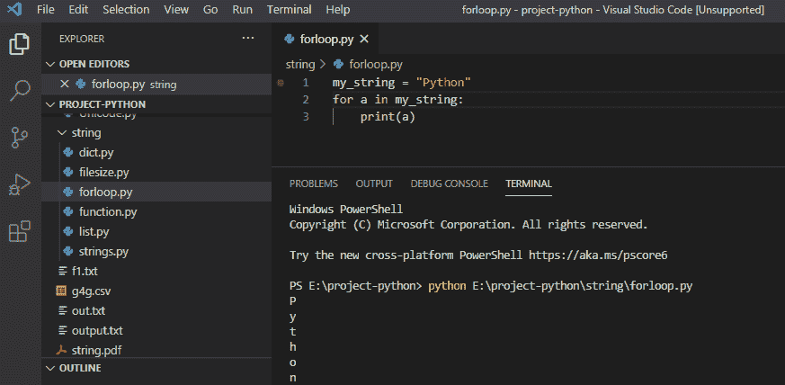

# Python For 循环示例

> 原文：<https://pythonguides.com/python-for-loop/>

[](https://sharepointsky.teachable.com/p/python-and-machine-learning-training-course)

在这个 [Python 教程](https://pythonguides.com/python-programming-for-the-absolute-beginner/)中，我们将检查 **Python for 循环**，我们将通过例子看到**如何在 python** 中使用 for 循环。

此外，我们还将讨论:

*   python 中的 For 循环
*   python 中的字符串循环
*   Python range()函数
*   python 中的嵌套循环
*   否则在 for 循环中
*   Python for 循环向后

目录

[](#)

*   [python 中的 For 循环](#For_Loop_in_python "For Loop in python")
*   [在 python 中循环一个字符串](#Loop_over_a_string_in_python "Loop over a string in python")
*   [Python range()函数](#Python_range_function "Python range() function")
*   [Python 中的嵌套循环](#Nested_loops_in_Python "Nested loops in Python")
*   [Python 中的 Else in for 循环](#Else_in_for_loop_in_Python "Else in for loop in Python")
*   [Python for loop backward](#Python_for_loop_backward "Python for loop backward")

## python 中的 For 循环

Python 中的 **For 循环**用于迭代任意序列的项，如链表、字符串、[元组](https://pythonguides.com/create-a-tuple-in-python/)等。

**举例:**

```py
chocolate = ['Dairy Milk', 'Kit Kat', 'perk']
for a in chocolate:
print(a)
```

写完上面的代码(对于 python 中的循环)，你将打印出 `" a "` ，然后输出将显示为 `"Dairy Milk Kit Kat perk"` 。

这里，循环为列表中的每个项目执行一组语句。python 中的循环可以参考截图。


For Loop in python

这是 python 中的一个 For 循环示例。

你可能喜欢看，[如何在 Python](https://pythonguides.com/pandas-drop/) 中使用 Pandas drop()函数。

## 在 python 中循环一个字符串

在 python 中，我们可以通过使用循环中的**和 python 中的 In 操作符**来迭代字符串的一个单词。

**举例:**

```py
my_string = "Python"
for a in my_string:
print(a)
```

写完上面的代码(在 python 中循环遍历一个字符串)，你将打印出 `" a "` ，然后输出将显示为 `" P y t h o n "` 。

这里，循环遍历字符串“Python”中的所有字符。你可以参考下面的 python 中字符串的截图循环。



Loop over a string in python

*   [Python 中的字符串方法及示例](https://pythonguides.com/string-methods-in-python/)
*   [从字符串 Python 中删除字符](https://pythonguides.com/remove-character-from-string-python/)
*   [Python 将列表转换成字符串](https://pythonguides.com/python-convert-list-to-string/)

## Python range()函数

在 python 中，为了循环通过代码，我们使用 Python 中的 **range()函数，默认情况下，它返回从 0 开始的数字序列，并在指定的数字处结束。**

**举例:**

```py
for value in range(4):
print(value)
```

写完上面的代码(python range()函数)，你将打印出 `" value "` ，然后输出将显示为 `" 0 1 2 3 "` 。

在这里，我们使用 range()函数来处理数字序列，并使用 for 循环来遍历数字。可以参考截图 python range()函数


Python range() function

以上以 **Python range()函数**为例。

## Python 中的嵌套循环

在 python 中，**嵌套循环**是循环内部的一个循环，它用于重复外部循环中项目的某些动作。

**举例:**

```py
numbers = ["5", "8", "10"]
colors = ["red", "blue", "black"]
for a in numbers:
for z in colors:
print(a,z)
```

写完上面的代码(python 中的嵌套循环)，你将打印出 **" a，z "** ，然后输出将会出现。

这里，内循环将为外循环的每次迭代执行一次。可以参考下面的截图 python 中的嵌套循环。


Nested loops in python

这是一个例子，**Python 中的嵌套循环**。

## Python 中的 Else in for 循环

在 python 中，for 循环中的 **else 用于指定循环结束时的代码块。迭代完成后，Else 块出现在循环体之后。**

**举例:**

```py
for value in range(5):
print(value)
else:
print("Loop Ends")
```

写完上面的代码(否则在 for 循环中)，你将打印出 `" value "` ，然后输出将出现 **" 0 1 2 3 4 循环结束"。**

这里，else 块将在所有迭代完成后执行，程序仅在 else 块之后退出循环。你可以在 for 循环中参考下面的截图。


Else in for loop

这是 Python 中 for 循环中关于 **Else 的一个例子。**

## Python for loop backward

向后 for 循环向后遍历一个序列，我们将使用 `reversed()` 函数向后遍历一个序列。

**举例:**

```py
for val in reversed(range(5))
    print(val)
```

写完上面的代码(python 用于循环返回)，你将打印出 `" val "` ，然后输出将出现 **" 4 3 2 1 0 "。**在这里，我们将使用 `reversed(sequence)` 以相反的顺序打印它们。

你可以参考下面的 python 的截图来进行向后循环


Python for loop backward

这样，我们就可以在 python 中使用**进行循环。**

您可能会喜欢以下 Python 教程:

*   [Python 方块一号](https://pythonguides.com/python-square-a-number/)
*   [什么是 Python 字典](https://pythonguides.com/create-a-dictionary-in-python/)
*   [无换行符的 Python 打印](https://pythonguides.com/python-print-without-newline/)
*   [Python 字典方法+示例](https://pythonguides.com/python-dictionary-methods/)
*   [11 Python 列表方法](https://pythonguides.com/python-list-methods/)
*   [如何在 Python 中创建列表](https://pythonguides.com/create-list-in-python/)
*   [使用 Visual Studio 代码](https://pythonguides.com/python-hello-world-program/)用 python 创建一个 hello world 程序
*   [Python 输入和 raw_input 函数](https://pythonguides.com/python-input-and-raw_input-function/)
*   [Python 从列表中选择+示例](https://pythonguides.com/python-select-from-a-list/)
*   [Python 通过引用或值传递示例](https://pythonguides.com/python-pass-by-reference-or-value/)

在本教程中，我们通过示例学习了如何在 python 中使用**进行循环，我们还讨论了:**

*   python 中的 For 循环
*   python 中的字符串循环
*   Python range()函数
*   python 中的嵌套循环
*   否则在 for 循环中
*   Python for 循环向后

[Bijay Kumar](https://pythonguides.com/author/fewlines4biju/)

Python 是美国最流行的语言之一。我从事 Python 工作已经有很长时间了，我在与 Tkinter、Pandas、NumPy、Turtle、Django、Matplotlib、Tensorflow、Scipy、Scikit-Learn 等各种库合作方面拥有专业知识。我有与美国、加拿大、英国、澳大利亚、新西兰等国家的各种客户合作的经验。查看我的个人资料。

[enjoysharepoint.com/](https://enjoysharepoint.com/)[](https://www.facebook.com/fewlines4biju "Facebook")[](https://www.linkedin.com/in/fewlines4biju/ "Linkedin")[](https://twitter.com/fewlines4biju "Twitter")