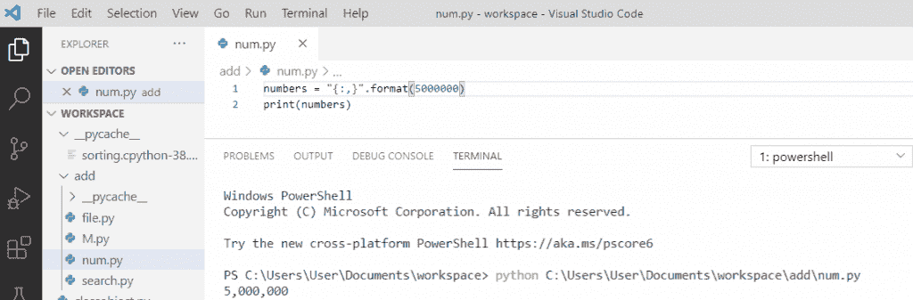
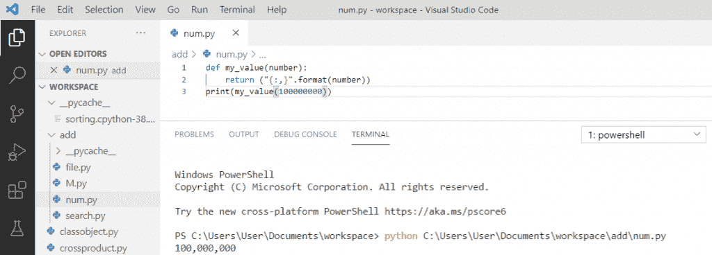
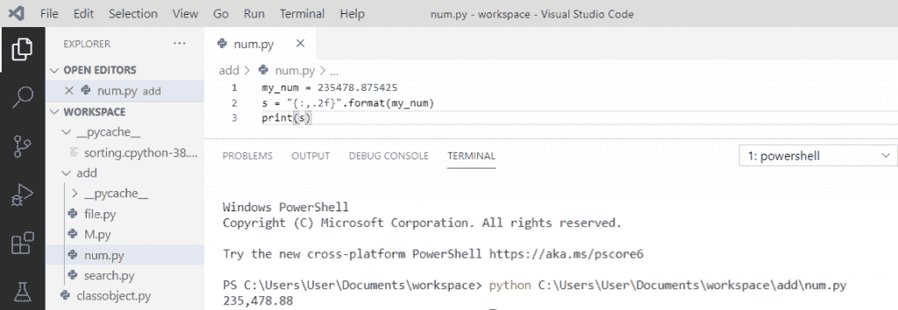

# 带逗号的 Python 格式数字

> 原文：<https://pythonguides.com/python-format-number-with-commas/>

[](https://sharepointsky.teachable.com/p/python-and-machine-learning-training-course)

在本 [Python 教程](https://pythonguides.com/python-hello-world-program/)中，我们将讨论带逗号的 **python 格式数字**。此外，我们将看到以下主题:

*   带逗号的 Python 格式数字
*   Python 在元素之间添加逗号
*   Python 格式的数字带有逗号，四舍五入到小数点后两位

目录

[](#)

*   [Python 格式数字加逗号](#Python_format_number_with_commas "Python format number with commas")
*   [Python 在元素之间添加逗号](#Python_add_a_comma_between_elements "Python add a comma between elements")
*   [Python 格式数字加逗号并四舍五入到 2 位小数](#Python_format_number_with_commas_and_round_to_2_decimal_places "Python format number with commas and round to 2 decimal places")

## Python 格式数字加逗号

让我们看看如何在 python 中用逗号来格式化数字**。**

在 Python 中，要用逗号格式化一个数字，我们将使用“{:，}”和 format()函数，它将从左开始每隔一千个位置添加一个逗号。

**举例:**

```py
numbers = "{:,}".format(5000000)
print(numbers)
```

写完上面的代码(python 格式的数字加逗号)，你将打印出**“数字”**，然后输出将显示为**“5，000，000”**。这里， **{:，}。format()** 会在数字后每千位加逗号。这样，我们就可以用逗号来格式化数字。

可以参考下面的截图，为 python 格式的数字加逗号。



Python format number with commas

## Python 在元素之间添加逗号

让我们看看如何在 Python 中的元素之间添加逗号。

我们将使用****“{:，}”。format()** 函数，它将在从左开始的每一千个位置之后的元素之间添加一个逗号**

 ****举例:**

```py
def my_value(number):
    return ("{:,}".format(number))
print(my_value(100000000)
```

写完上面的代码(python 在元素之间加了一个逗号)，一旦打印出 `"my_value(100000000)"` ，那么输出将显示为 **" 100，000，000"** 。这里， **{:，}。【格式(数字)】T5 会在元素之间添加逗号。**

你可以参考下面的 python 元素间添加逗号的截图。



Python add a comma between elements

## Python 格式数字加逗号并四舍五入到 2 位小数

现在，让我们看看下面的例子，关于 **python 格式的数字，带逗号，四舍五入到 2 位小数**。

我们会用**“{:，. 2f}”。format()"** 为浮点数格式，以逗号作为千位分隔符。小数点后两位以上的数字将被忽略。

**举例:**

```py
my_num = 235478.875425
s = "{:,.2f}".format(my_num)
print(s)
```

写完上面的代码(python 格式数字加逗号，四舍五入到小数点后两位)，当你要打印 `"s"` 那么输出会出现`" 235478.88 "`。这里，my_num = 235478.875425 是浮点数，我们将使用 **{:，. 2f}。format(my_num)** 在数字后每千位加逗号，会四舍五入到小数点后两位。

可以参考下面的截图，为 python 格式数字加逗号，四舍五入到小数点后 2 位。



Python format number with commas and round to 2 decimal places

您可能会喜欢以下 Python 教程:

*   [Python Tkinter 条目–如何使用](https://pythonguides.com/python-tkinter-entry/)
*   [Python 生成随机数和字符串](https://pythonguides.com/python-generate-random-number/)
*   [Python tkinter 标签](https://pythonguides.com/python-tkinter-label/)
*   [Python 中的块缩进](https://pythonguides.com/block-indentation-in-python/)
*   [Python 从路径中获取文件名](https://pythonguides.com/python-get-filename-from-the-path/)
*   [Python 类型错误:“列表”对象不可调用](https://pythonguides.com/python-typeerror-list-object-is-not-callable/)
*   [Python if else with examples](https://pythonguides.com/python-if-else/)
*   [Python For 循环示例](https://pythonguides.com/python-for-loop/)
*   [用乌龟创建一个 Python 的贪吃蛇游戏](https://pythonguides.com/snake-game-in-python/)

在本 Python 教程中，我们学习了带逗号的 **python 格式数字**。此外，我们还讨论了以下主题:

*   带逗号的 Python 格式数字
*   Python 在元素之间添加逗号
*   Python 格式的数字带有逗号，四舍五入到小数点后两位

[Bijay Kumar](https://pythonguides.com/author/fewlines4biju/)

Python 是美国最流行的语言之一。我从事 Python 工作已经有很长时间了，我在与 Tkinter、Pandas、NumPy、Turtle、Django、Matplotlib、Tensorflow、Scipy、Scikit-Learn 等各种库合作方面拥有专业知识。我有与美国、加拿大、英国、澳大利亚、新西兰等国家的各种客户合作的经验。查看我的个人资料。

[enjoysharepoint.com/](https://enjoysharepoint.com/)[](https://www.facebook.com/fewlines4biju "Facebook")[](https://www.linkedin.com/in/fewlines4biju/ "Linkedin")[](https://twitter.com/fewlines4biju "Twitter")**