# Python 生成随机数和字符串(完整教程)

> 原文：<https://pythonguides.com/python-generate-random-number/>

[](https://sharepointsky.teachable.com/p/python-and-machine-learning-training-course)

在本 [Python 教程](https://pythonguides.com/python-programming-for-the-absolute-beginner/)中，让我们就 **Python 生成随机数**进行讨论，如何在 Python 中生成随机数。此外，我们将讨论**如何在 Python** 中生成随机字符串。

让我们讨论以下几点:

*   介于 0 和 1 之间的 Python 随机数
*   Python 随机数范围内的整数
*   1 到 10 之间的 Python 随机数
*   Python 随机数种子
*   Python 随机数的选择
*   Python 随机整数 n 的倍数
*   Python 随机数洗牌
*   两个浮点数之间的 Python 随机数
*   n 位数的 Python 随机数
*   不重复的 Python 随机数
*   Python 随机 10 位数
*   Python 长度的随机字符串
*   来自字母的 Python 随机字符串
*   Python 字母和数字的随机字符串
*   带有特殊字符的 Python 随机字符串
*   来自字母表的 Python 随机字符串

目录

[](#)

*   [Python 生成随机数](#Python_generate_random_number "Python generate random number")
    *   [0 和 1 之间的 Python 随机数](#Python_random_number_between_0_and_1 "Python random number between 0 and 1")
    *   [Python 随机数范围内的整数](#Python_random_number_integers_in_the_range "Python random number integers in the range")
    *   [1 到 10 之间的 Python 随机数](#Python_random_numbers_between_1_and_10 "Python random numbers between 1 and 10")
    *   [Python 随机数种子](#Python_random_number_seed "Python random number seed")
    *   [Python 随机数的选择](#Python_random_number_of_choice "Python random number of choice")
    *   [Python 随机整数 n 的倍数](#Python_random_integer_number_multiple_of_n "Python random integer number multiple of n")
    *   [Python 随机数洗牌](#Python_random_number_shuffle "Python random number shuffle")
    *   [Python 两个浮点数之间的随机数](#Python_random_number_between_two_floats "Python random number between two floats")
    *   [n 位数 Python 随机数](#Python_random_number_with_n_digits "Python random number with n digits")
    *   [Python 无重复随机数](#Python_random_number_without_repeating "Python random number without repeating")
*   [Python 随机 10 位数](#Python_random_10_digit_number "Python random 10 digit number")
*   [Python 随机数使用 sample()](#Python_random_number_using_sample "Python random number using sample()")
*   [Python 生成随机字符串](#Python_generate_random_string "Python generate random string")
    *   [Python 随机串的长度](#Python_random_string_of_length "Python random string of length")
    *   [Python 随机字符串列表](#Python_random_string_of_list "Python random string of list")
    *   [Python 随机的字母和数字串](#Python_random_string_of_letters_and_numbers "Python random string of letters and numbers")
    *   [带特殊字符的 Python 随机字符串](#Python_random_string_with_special_character "Python random string with special character")
    *   [来自字母表的 Python 随机字符串](#Python_random_string_from_alphabets "Python random string from alphabets")

## Python 生成随机数

让我们看看 Python 中**生成随机数的各种方式。我们将讨论在 Python** 中**生成随机数的不同方法。**

在这个例子中，我已经导入了 random 模块， `random()` 返回随机的浮点值。

示例:

```py
import random
random_number = random.random()
print(random_number) 
```

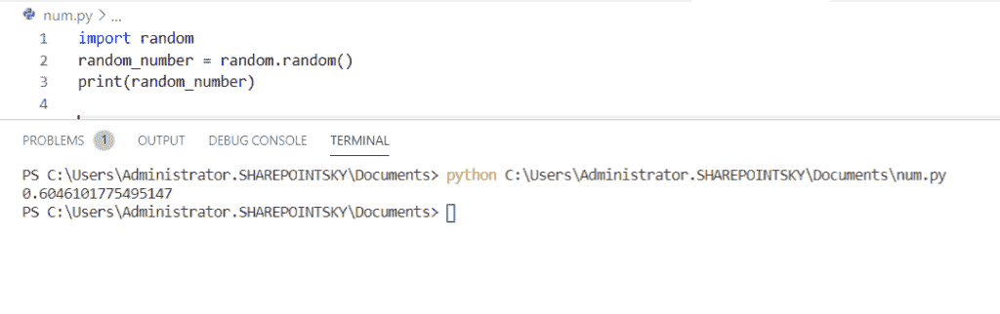

Python generate random number

这样，我们可以用 Python 创建一个随机数。

> 你可能会喜欢[用蟒蛇龟](https://pythonguides.com/draw-colored-filled-shapes-using-python-turtle/)和[绘制彩色填充形状](https://pythonguides.com/snake-game-in-python/)

### 0 和 1 之间的 Python 随机数

现在我们可以看到**如何在 python 中获得 0 到 1 之间的随机数**

要获得任意随机数，我们必须首先导入**随机**模块。 `random.uniform()` 用于获取一个随机数，uniform()返回两个给定数之间的随机浮点数。

示例:

```py
import random
number = random.uniform(0,1)
print(number)
```

下面的屏幕截图显示了输出:

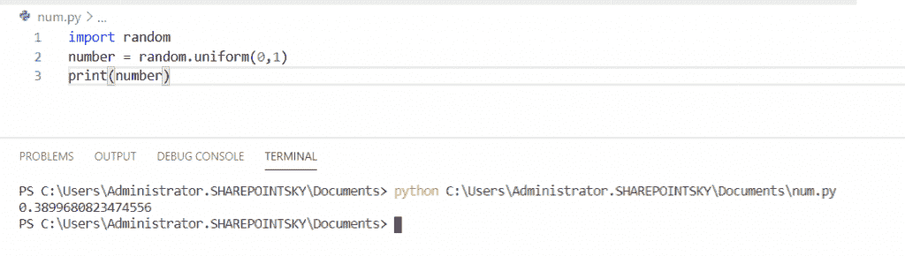

Python random number between 0 and 1

### Python 随机数范围内的整数

这里我们可以看到**如何在 python 中获得一个范围**内的随机数整数，

在这个例子中，我们可以看到如何在给定范围的情况下**得到一个随机数，这里我使用了 `randint()` 方法，它从给定的范围返回一个整数。**

示例:

```py
import random  
random_number = random.randint(0, 9) 
print(random_number) 
```

下面的屏幕截图显示了输出:

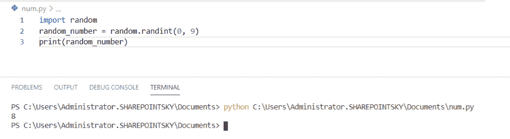

Python random number integers in the range

### 1 到 10 之间的 Python 随机数

这里我们可以看到**如何在 python 中获得 1 到 10 之间的随机数**

在这个例子中，我使用了 `randint()` ，它在指定范围时返回一个随机数。

示例:

```py
import random
print(random.randint(1,10))
```

下面的屏幕截图显示了输出:

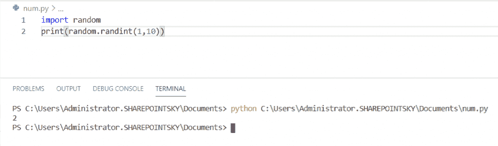

Python random numbers between 1 and 10

### Python 随机数种子

我们可以使用 **Python 种子函数**在 Python 中初始化一个随机数。默认情况下，它将使用系统的当前时间创建一个随机数。

要得到自定义随机数生成器的起始数，我们可以使用 `seed()` 函数

这里我们可以看到**如何使用 python 中的 seed()函数**生成随机数。

示例:

```py
import random

random.seed(15)
print(random.random()) 
```

下面的屏幕截图显示了输出:

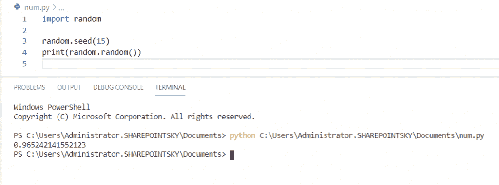

Python random number seed

### Python 随机数的选择

在这里，我们可以看到**如何从 python 中指定的列表或字符串序列**中获得一个随机数

在这个例子中，使用了 `random.choice()` ，它从指定的 [Python 列表](https://pythonguides.com/create-list-in-python/)中返回一个随机数。

示例:

```py
import random

numberList = [1,22,58,14,25,24,]
print( random.choice(numberList))
```

下面的屏幕截图显示了输出:

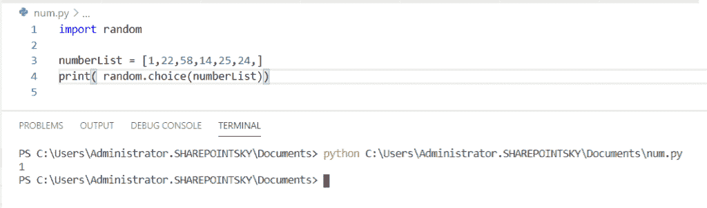

Python random number of choice

### Python 随机整数 n 的倍数

现在我们可以看到**如何在 Python 中获得 n** 的随机整数倍。

这里我们可以生成一个随机数，它是 4 的倍数，范围从 4 到 200。

示例:

```py
import random

num = random.randrange(4, 200, 4)
print(num)
```

下面的屏幕截图显示了输出:

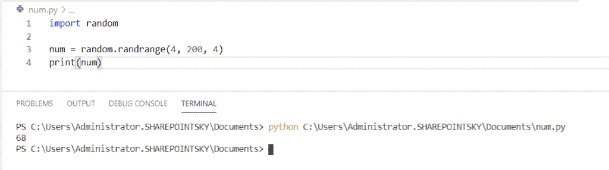

Python random integer number multiple of n

### Python 随机数洗牌

在这里我们可以看到**如何在 python 中使用 shuffle()** 获得一个随机数。

在这个例子中，一些数字被分配给一个列表号码，并且使用 `random.shuffle()` 从列表中获得随机的洗牌号码。

`shuffle()` 方法取列表中的一个数字序列，随机重组列表中数字的顺序。

示例:

```py
import random

number = ["1","5","2","3"]
random.shuffle(number)

print(number)
```

下面的屏幕截图显示了输出:

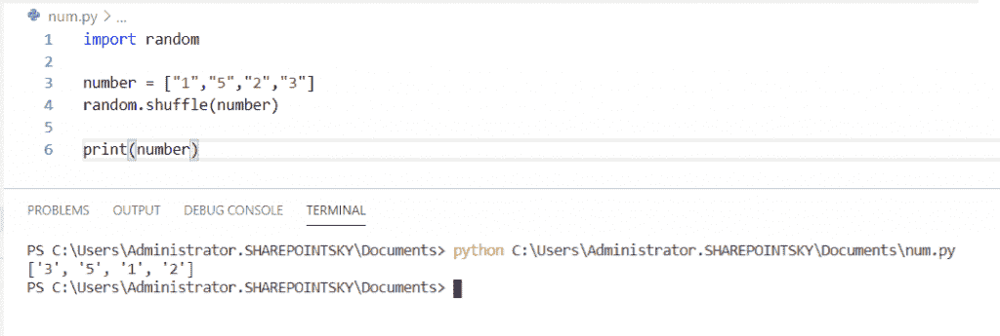

Python random number shuffle

### Python 两个浮点数之间的随机数

现在我们可以看到**如何在 python 中获得两个浮点数**之间的随机数

在这个例子中，我们要导入一个随机模块，用 `random.uniform()` 函数得到一个随机数。

**uniform()返回两个给定浮点数**之间的随机浮点数。

示例:

```py
import random
x = random.uniform(0.5, 1.5)
print(x)
```

下面的屏幕截图显示了输出:

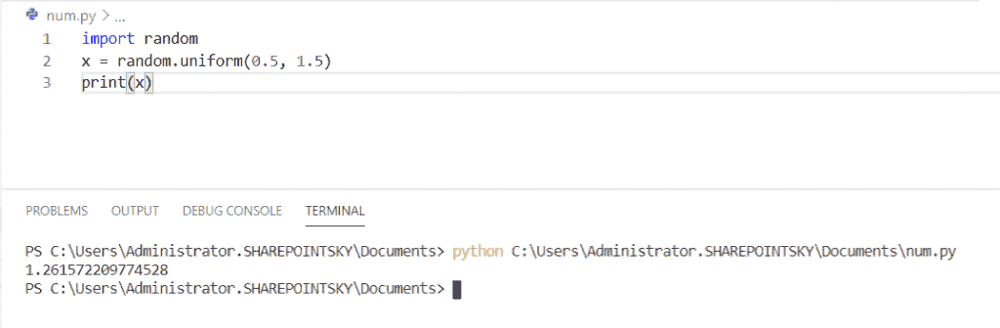

python random number between two floats

### n 位数 Python 随机数

现在我们可以看到**如何在 python 中得到一个 n 位数的随机数**。

为了得到一个 n 位数的随机数**，random.radint()** 被用来返回两个给定位数长度的随机数。随机数的长度将等于两个给定数字的长度。

示例:

```py
import random
random_number = random.randint(1000, 2000)
print(random_number)
```

下面的屏幕截图显示了输出:

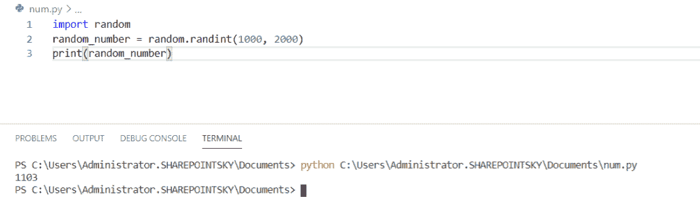

python random number with n digits

### Python 无重复随机数

在这里我们可以看到**如何在 python 中不重复**的情况下获得一个随机数列表。

在这个例子中，我使用了 Python `random.sample()` 函数，该函数在给定的数字范围内生成唯一的随机数。

示例:

```py
import random
list = random.sample(range(0, 10), 10)
print(list)
```

下面的屏幕截图显示了输出:

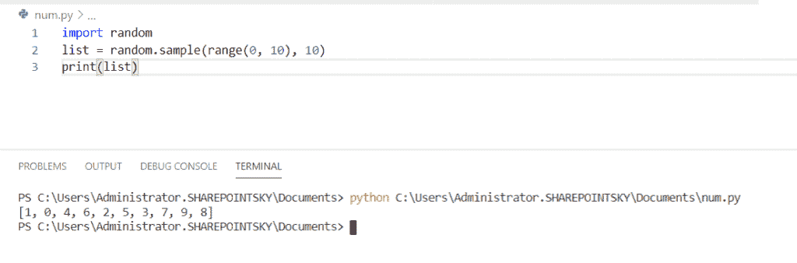

Python random number without repeating

这就是我们如何使用 random.sample() 在 Python 中**生成随机数。**

## Python 随机 10 位数

这里我们可以看到如何用 Python 生成一个随机的 10 位数。为了得到指定长度的随机数，我们应该设置最大值和最小值。

在这个例子中，我已经导入了一个模块 random，为了得到一个随机数，我们应该生成 N 并指定 minimum–**minimum = pow(10，N-1)** 和 maximum–**maximum = pow(10，N)–1**，然后返回一个长度如参数中给出的随机数。

示例:

```py
import random

def randomnumber(N):
	minimum = pow(10, N-1)
	maximum = pow(10, N) - 1
	return random.randint(minimum, maximum)

print(randomnumber(10))
```

下面的屏幕截图显示了输出:

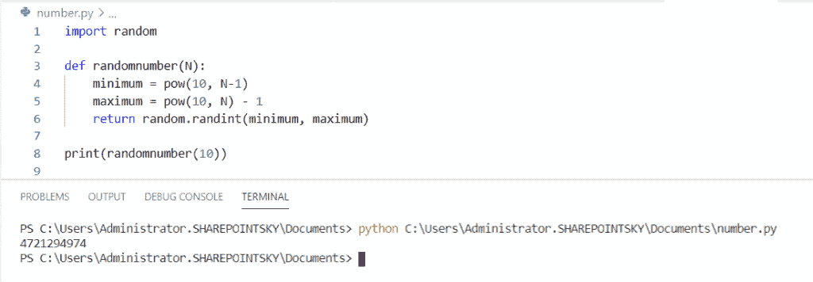

Python random 10 digit number

这就是我们如何在 Python 中非常容易地生成一个随机的 10 位数。

## Python 随机数使用 sample()

现在我们可以看到如何使用 sample()**生成随机数。**

在这个例子中，我从 random 中导入了 random 模块和 sample 模块，我将一个列表作为数字，print()包含一个 `sample()` ，一个**列表**，以及列表的**大小。**`sample()`从指定列表中返回随机列表。

示例:

```py
from random import sample 
numbers = [1, 2, 3, 4, 5, 6, 7, 8, 9]  
print(sample(numbers,5)) 
```

下面的屏幕截图显示了输出:

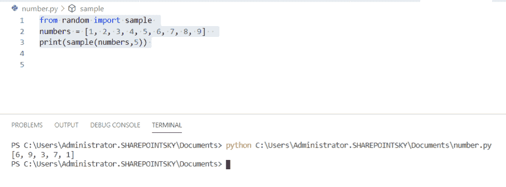

Python random number using sample()

## Python 生成随机字符串

现在，让我们看看**如何在 Python** 中生成随机字符串。

在这个例子中，我导入了两个模块，它们是 random 和 string，并得到一个随机的字符串

调用**字符串。ascii** 初始化得到一个常量字符串，string.ascii_uppercase 只给出大写字母。choice()返回从任意序列中随机选择的元素。

示例:

```py
import random
import string
letters = string.ascii_uppercase
print ( ''.join(random.choice(letters)))
```

下面的屏幕截图显示了输出:

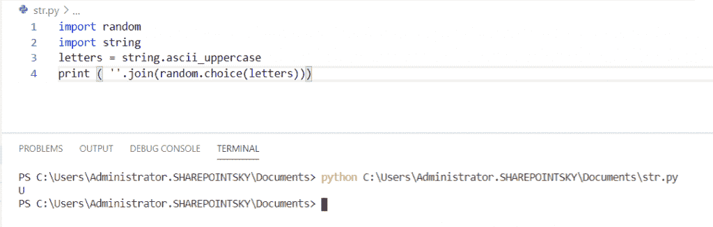

Python Random String

### Python 随机串的长度

在这里我们可以看到 python 中指定长度的随机字符串是如何

在这个例子中，我使用了 `length_of_string = 4` ，它是字符串长度函数返回输入字符串中的字符数。此外， `range()` 函数用于获取字符串的长度范围，

并且 `choice()` 返回从任意序列中随机选择的元素。

示例:

```py
import random
import string
length_of_string = 4
letters = string.ascii_uppercase
random_string = ""
for number in range(length_of_string):
  random_string += random.choice(letters)
print(random_string)
```

下面的屏幕截图显示了输出:

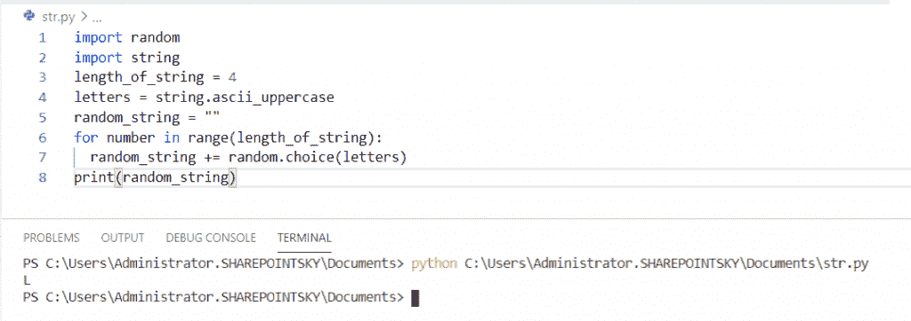

Python Random String

### Python 随机字符串列表

这里我们可以看到**如何从 python 中的一个给定列表**中获得一个随机字符串

在此示例中，给出了一个列表，并从该字符串本身生成了一个随机字符串。如上所示，这里也使用相同的随机。choice()返回从任意序列中随机选择的元素。

示例:

```py
import random
import string
print(random.choice(['mango', 'orange', 'apple']))
```

下面的屏幕截图显示了输出:

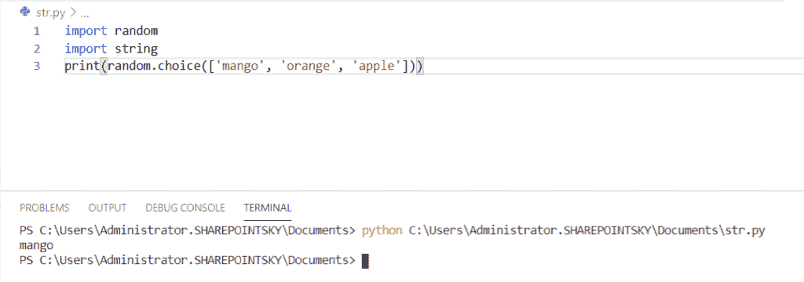

python random string of choice

### Python 随机的字母和数字串

在这里我们可以看到**如何在 python** 中获得字母和数字的随机字符串

本例中使用了 `string join()` 来连接字符串中的所有项目。

".join(random . choices(string . ascii _ upper case+string . digits，k = N)该方法连接随机的字母和数字。

示例:

```py
import string 
import random 
N = 5
res = ''.join(random.choices(string.ascii_uppercase +  string.digits, k = N)) 
print("The random string : " + str(res))
```

下面的屏幕截图显示了输出:

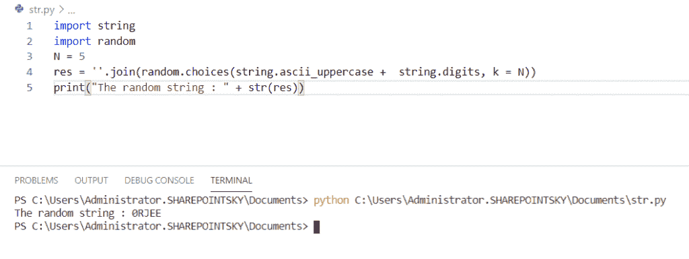

Python random string of letters and numbers

### 带特殊字符的 Python 随机字符串

在这里，我们可以看到如何在 python 中获得一个带有特殊字符的随机字符串

这个例子类似于一个由字母和数字组成的随机字符串，其中还添加了标点符号以获得字符串中的特殊字符，并使用了 `string join()` 来连接字符串中的所有项目。

```py
import random
import string
def randomStringwithDigitsAndSymbols(stringLength=4):
  special_characters = string.ascii_letters + string.digits + string.punctuation
   return ''.join(random.choice(special_characters) 
for i in range(stringLength))
print (randomStringwithDigitsAndSymbols())
print (randomStringwithDigitsAndSymbols())
print (randomStringwithDigitsAndSymbols()) 
```

下面的屏幕截图显示了输出:

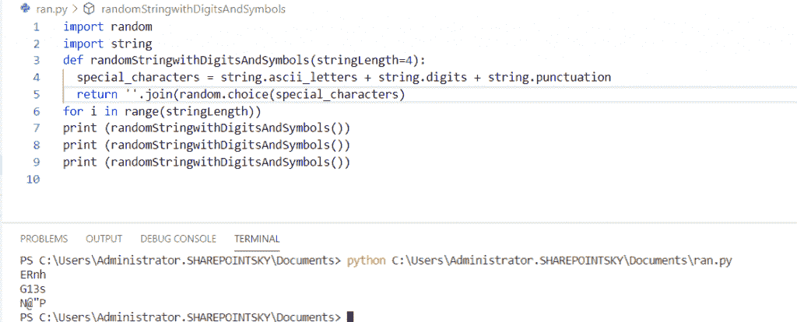

Python random string with special character

### 来自字母表的 Python 随机字符串

这里我们可以看到**如何从 python 中的字母**中获取随机字符串，

在这个例子中，使用了字符串的长度，还使用了 `string join()` 来连接字符串中的所有项目。 `range ()` 返回字符串的长度范围。

示例:

```py
import random
import string
string_length = 8
upper_case_alphabet = string.ascii_letters
lower_case_alphabet = string.ascii_letters
random_upper_letter = random.choice(lower_case_alphabet)
random_lower_letter = random.choice(upper_case_alphabet)

print(''.join(random.choice(random_upper_letter+random_lower_letter) for i in range(string_length)))
```

下面的屏幕截图显示了输出:

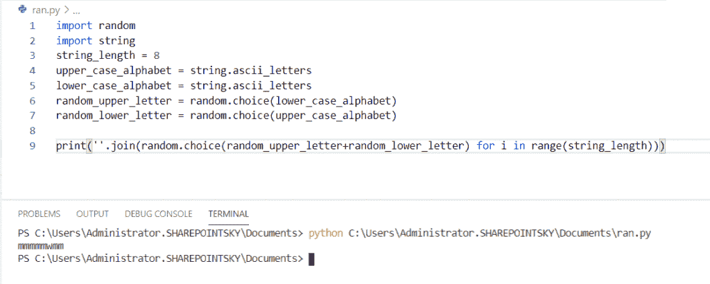

Python random string from alphabets

这里，我们看到了在 Python 中**生成随机字符串的不同方法。**

您可能会喜欢以下 Python 教程:

*   [Python 将列表写入文件，并附有示例](https://pythonguides.com/python-write-list-to-file/)
*   [Python 将字符串写入文件](https://pythonguides.com/python-write-string-to-a-file/)
*   [Python 中的优先级队列](https://pythonguides.com/priority-queue-in-python/)
*   [Python 历元到日期时间+示例](https://pythonguides.com/python-epoch-to-datetime/)
*   [Python 将变量写入文件+示例](https://pythonguides.com/python-write-variable-to-file/)
*   [Python 3 pickle typeerror 需要一个类似字节的对象，而不是“str”](https://pythonguides.com/python-3-pickle-typeerror-a-bytes-like-object-is-required-not-str/)
*   [Python 二进制海洋](https://pythonguides.com/python-binary-search/) [r](https://pythonguides.com/python-binary-search/) [ch 和线性搜索](https://pythonguides.com/python-binary-search/)
*   [Python 点积和叉积](https://pythonguides.com/python-dot-product/)

在本教程中，我们学习如何用 Python 生成随机数**，以及如何用 Python** 生成随机字符串**。**

*   Python 生成随机数
*   介于 0 和 1 之间的 Python 随机数
*   Python 随机数范围内的整数
*   1 到 10 之间的 Python 随机数
*   Python 随机数种子
*   Python 随机数的选择
*   Python 随机整数 n 的倍数
*   Python 随机数洗牌
*   两个浮点数之间的 Python 随机数
*   n 位数的 Python 随机数
*   不重复的 Python 随机数
*   Python 生成随机字符串
*   Python 长度的随机字符串
*   Python 列表的随机字符串
*   Python 字母和数字的随机字符串
*   带有特殊字符的 Python 随机字符串
*   来自字母表的 Python 随机字符串

[Bijay Kumar](https://pythonguides.com/author/fewlines4biju/)

Python 是美国最流行的语言之一。我从事 Python 工作已经有很长时间了，我在与 Tkinter、Pandas、NumPy、Turtle、Django、Matplotlib、Tensorflow、Scipy、Scikit-Learn 等各种库合作方面拥有专业知识。我有与美国、加拿大、英国、澳大利亚、新西兰等国家的各种客户合作的经验。查看我的个人资料。

[enjoysharepoint.com/](https://enjoysharepoint.com/)[](https://www.facebook.com/fewlines4biju "Facebook")[](https://www.linkedin.com/in/fewlines4biju/ "Linkedin")[](https://twitter.com/fewlines4biju "Twitter")