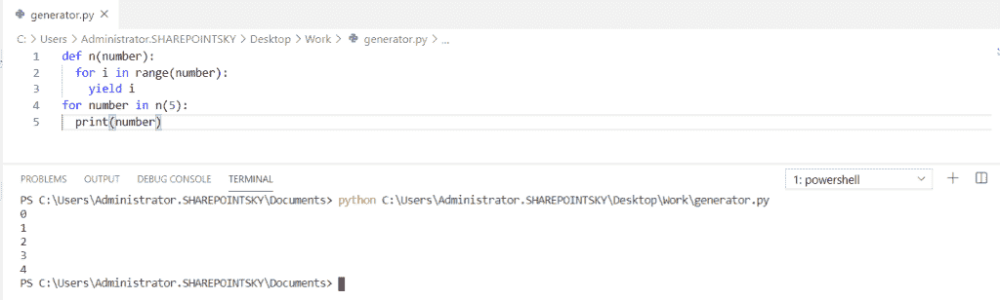

# Python 生成器(Python 生成器与迭代器)

> 原文：<https://pythonguides.com/python-generators/>

[](https://sharepointsky.teachable.com/p/python-and-machine-learning-training-course)

想了解一下 **Python 生成器**？阅读这篇文章，了解更多关于什么是 Python 生成器、 **Python 迭代器**，以及 **Python 生成器 vs 迭代器**的知识。

不熟悉 Python？绝对初学者请查看 [Python 编程](https://pythonguides.com/python-programming-for-the-absolute-beginner/)。

我们将编码:

*   什么是 Python 生成器
*   什么是 Python 迭代器
*   Python 生成器与迭代器
*   Python 生成器函数
*   接下来是 Python 生成器
*   Python 生成器表达式
*   Python 将生成器转换为迭代器
*   Python 生成器与迭代器性能

目录

[](#)

*   [Python 生成器](#Python_generator "Python generator")
*   [Python 中字符串的生成器](#Generator_for_a_string_in_Python "Generator for a string in Python")
*   [Python 生成器函数](#Python_generator_function "Python generator function")
*   [Python 生成器下一步](#Python_generator_next "Python generator next")
*   [Python 生成器表达式](#Python_generator_expression "Python generator expression")
*   [Python 生成器类](#Python_generator_class "Python generator class")
*   [Python 生成器连接](#Python_generator_connecting "Python generator connecting")
*   [Python 生成器 vs 迭代器](#Python_generator_vs_iterator "Python generator vs iterator")
    *   [Python 迭代器](#Python_Iterator "Python Iterator")
    *   [使用类](#Iterator_using_class "Iterator using class")的迭代器
    *   [Python 生成器 vs 迭代器](#Python_Generator_vs_Iterator "Python Generator vs Iterator")
*   [Python 生成器 vs 迭代器性能](#Python_generator_vs_iterator_performance "Python generator vs iterator performance")
*   [Python 将生成器转换成迭代器](#Python_convert_a_generator_to_an_iterator "Python convert a generator to an iterator")

## Python 生成器

一个 **Python 生成器**是一个使用 yield 方法创建一个值序列的函数。这里使用了 `yield` 关键字，而不是 return。

在这里，我们可以看到**如何在 python** 中生成数字

在这个例子中，为了从给定的范围生成数字，我定义了一个函数 n()，yield 用于生成数字。当我们使用 yield 关键字时，函数就变成了 Python 中的一个生成器。

示例:

```py
def n(number):
  for i in range(number):
    yield i
for number in n(5):
  print(number)
```

下面的屏幕截图显示了输出:

在此输出中，我们可以看到数字被迭代。数字的总数取决于我们在 range()中提到的范围。



Python generator

## Python 中字符串的生成器

在这个例子中，我们可以看到如何使用 python 中的 yield 关键字来迭代给定的字符串。这里我定义了一个函数字符串并将字符串的范围赋为 length，然后调用 yield 迭代字符串 `print(string)` 得到最终值。

示例:

```py
def string(my_string):
    length = len(my_string)
    for i in range(length):
        yield my_string[i]

for string in ("python"):
    print(string)
```

下面的屏幕截图显示了输出:

在这个输出中，我们可以看到字符串 python 被迭代。


Generator for a string

## Python 生成器函数

现在，我们可以看到**如何使用 python 中的生成器函数**打印数字

在这个例子中，为了从给定的范围生成数字，我定义了一个函数 n()，yield 关键字用于生成数字。当我们使用 yield 关键字时，函数就变成了一个生成器。

。

示例:

```py
def n(number):
  for i in range(number):
    yield i
for number in n(5):
  print(number)
```

下图显示了输出:

在此输出中，我们可以看到数字被迭代。数字的总数取决于我们在 range()中提到的范围。


Python generator function

## Python 生成器下一步

现在，我们可以看到在 python 中使用 next() 的 **python 生成器**

在这个例子中，我将一个函数定义为 numberGenerator，并指定 number = 2，同时使用了 loop。counter 是一个子类，用于对可散列对象进行计数。

示例:

```py
def numberGenerator(n):
     number = 2
     while number < n:
         yield number
         number += 2

g = numberGenerator(20)

counter = 0

while counter < 9:
    print(next(g))
    counter += 1 
```

下面的屏幕截图显示了输出:

在这个输出中，我们可以看到斐波那契数列。


Python generator next

## Python 生成器表达式

这里我们可以看到关于 **python 生成器表达式**的 python。

生成器表达式类似于列表压缩，生成器表达式**创建一个没有 yield 关键字**的列表 **。在本例中，我将一个变量作为一个数字，并使用 `range()` 对该数字执行了一个**加法运算**。最后，为了打印范围内的每个数字，我使用了 print 语句。**

示例:

```py
number = (x+x+x for x in range(10))
for each in number:
    print(each)
```

下面的屏幕截图显示了输出:

在这个输出中，我们可以看到我们得到的输出数字被加了三次，这里执行的算术运算被认为是表达式。


Python generator expression

## Python 生成器类

在这里我们可以看到**如何用 python 编写生成器类**

在下面的例子中，我用 `init()` 来初始化对象，self 表示类的实例， `self` 关键字用于访问类的属性和方法 **self.num1，self.num2 = 1，2** 是类的属性。

`def __next__(self)` 用于迭代下一个对象，yield 用于调用一个块， `range()` 函数返回给定范围内的列表。

示例:

```py
class fibonacci:
    def __init__(self, num):
        self.num = num
        self.num1, self.num2 = 2, 3

    def __iter__(self):
        for i in range(self.num):
            yield self.num1
            self.num1, self.num2 = self.num2, self.num1+self.num2

f = fibonacci(3)

for i in f:
    print(i)
```

下面的屏幕截图显示了输出:

在这个输出中，我们可以看到 3 个斐波那契数列


Python generator class

## Python 生成器连接

现在我们可以看到 python 中生成器是如何连接它们自己的。

在下面的例子中，我将 3 个生成器作为 **myGeneratora，myGeneratorb，myGeneratorc，**第一个生成器是 `myGeneratora` 有一个输入参数，给出了范围内的限制，第二个生成器是 `myGeneratorb` 有两个参数作为输入，给出了范围内的两个限制，接下来 `mygeneratorc` 调用 `myGeneratora` 和 `myGeneratorb` 来产生它们的值，并打印如下

示例:

```py
def myGeneratora(n):
    for i in range(n):
        yield i
def myGeneratorb(n, m):
    for j in range(n, m):
        yield j
def myGeneratorc(n, m):
    yield from myGeneratora(n)
    yield from myGeneratorb(n, m)
    yield from myGeneratorc(m, m+10)
print(list(myGeneratora(0)))
print(list(myGeneratorb(1, 5)))
print(list(myGeneratorb(0, 10)))
```

下面的屏幕截图显示了输出:

在这个输出中，我们可以看到发电机是如何连接的。


Python generator connecting

## Python 生成器 vs 迭代器

在了解 **Python 生成器 vs 迭代器**的区别之前，我们先来了解一下什么是 Python 迭代器。

### Python 迭代器

**Python 迭代器**是一个一次返回一个元素的对象，next()用于获取下一个值。

在这里，我们可以看到如何在 python 中迭代列表中的项目。

在这个例子中，我将列表名指定为 `my_list` ，iter()返回对象**的迭代器。next()** 从迭代器返回下一项。

例子

```py
my_list = [1, 2, 3, 4, 5]
my_iter = iter(my_list)
print(next(my_iter))
print(next(my_iter))
print(next(my_iter))
print(next(my_iter))
print(next(my_iter))
```

下面的屏幕截图显示了输出:

在这个输出中，我们可以看到从列表中迭代的条目，迭代的条目数量取决于 print(next(my_iter))语句的数量。

*   

    迭代器

### 使用类的迭代器

现在，我们可以看到如何使用 python 中的类来迭代数字。

在这个例子中，我定义了一个 EvenNumber 类，它创建了一个 iter，然后按照(2，4，6，8，10，12)的顺序返回数字，这六个数字是迭代的，因为我使用了 6 个 `print(next(myiter))` 语句。self 是一个参数，用于访问属于该类的变量。

示例:

```py
class EvenNumbers:
  def __iter__(self):
    self.a = 2
    return self

  def __next__(self):
    numbers = self.a
    self.a += 2
    return numbers

myclass = EvenNumbers()
myiter = iter(myclass)

print(next(myiter))
print(next(myiter))
print(next(myiter))
print(next(myiter))
print(next(myiter))
print(next(myiter))
```

在这个输出中，我们可以看到数字按顺序返回，因为我使用了六个 print(next(myiter))语句，所以返回了六个数字。


Iterator using class

### Python 生成器 vs 迭代器

| **发电机** | **迭代器** |
| yield 关键字用于迭代一个值。 | return 关键字用于迭代一个值 |
| 类不是必需的。 | 类别是必需的 |
| 生成器总是一个迭代器。 | 迭代器并不总是生成器。 |
| 所有的局部变量都存储在它之前。 | 没有局部变量 |

Generator vs Iterator

总而言之，

*   Python 生成器通常使用**函数**实现，迭代器使用**类**实现，生成器使用关键字 `yield` ，迭代器使用关键字 `return` 。
*   所有的**局部变量都存储在生成器中的 yield** 语句之前，迭代器中没有局部变量。在 python 生成器中，我们可以编写快速简洁的代码。
*   为了在 python 中创建生成器，我们使用了**函数**，但是为了创建迭代器函数，我们必须使用**迭代器()和下一个函数()**。

## Python 生成器 vs 迭代器性能

*   Python 生成器有更多的内存，对 CPU 来说效率更高。
*   Python 生成器拥有良好的编程结构。
*   迭代器允许惰性求值。
*   迭代器仅在被请求时才迭代下一个元素。
*   生成器和迭代器只能迭代一次。
*   对于简单的情况，Python 中的生成器函数和生成器表达式比迭代器更好。

## Python 将生成器转换成迭代器

在这里，我们可以看到**如何在 python** 中将生成器转换成迭代器。

在这个例子中，**产出**被用来将一个函数转换成一个生成器，它返回一个生成器。当 yield 被调用时，它将返回生成器。

示例:

```py
def common_divisors_generator(a):
    factors_a = [i for i in range(2, a + 2) if a%i == 0]
    def gen():
        for fa in factors_a:
            yield fa
    return gen()
print(common_divisors_generator)
```

下面的屏幕截图显示了输出:


Python convert generator to an iterator

您可能会喜欢以下 Python 教程:

*   [Python 将字符串写入文件](https://pythonguides.com/python-write-string-to-a-file/)
*   [命令出错，退出状态为 1 python](https://pythonguides.com/command-errored-out-with-exit-status-1-python/)
*   [Python 将列表写入文件，并附有示例](https://pythonguides.com/python-write-list-to-file/)
*   [Python 生成随机数和字符串](https://pythonguides.com/python-generate-random-number/)
*   [Python 格式数字加逗号](https://pythonguides.com/python-format-number-with-commas/)
*   [Python Tkinter 按钮–如何使用](https://pythonguides.com/python-tkinter-button/)
*   [Python Tkinter 单选按钮–如何使用](https://pythonguides.com/python-tkinter-radiobutton/)
*   [Python Tkinter 菜单栏–如何使用](https://pythonguides.com/python-tkinter-menu-bar/)
*   [Python 计数器——详细教程](https://pythonguides.com/python-counter/)
*   [Python 递归(你应该知道的一切)](https://pythonguides.com/python-recursion/)
*   [Python 比较运算符](https://pythonguides.com/python-comparison-operators/)
*   [Python 线程和多线程](https://pythonguides.com/python-threading-and-multithreading/)
*   [如何将 Python 角度转换为弧度](https://pythonguides.com/python-degrees-to-radians/)

这就是我们如何使用 **Python 生成器**和迭代器。在这里我们学到了以下东西:

*   Python 生成器
*   Python 中字符串的生成器
*   Python 生成器函数
*   接下来是 Python 生成器
*   Python 生成器表达式
*   Python 生成器类
*   Python 生成器连接
*   Python 生成器与迭代器
*   Python 迭代器
*   使用类的迭代器
*   Python 生成器与迭代器性能
*   Python 将生成器转换为迭代器

[Bijay Kumar](https://pythonguides.com/author/fewlines4biju/)

Python 是美国最流行的语言之一。我从事 Python 工作已经有很长时间了，我在与 Tkinter、Pandas、NumPy、Turtle、Django、Matplotlib、Tensorflow、Scipy、Scikit-Learn 等各种库合作方面拥有专业知识。我有与美国、加拿大、英国、澳大利亚、新西兰等国家的各种客户合作的经验。查看我的个人资料。

[enjoysharepoint.com/](https://enjoysharepoint.com/)[](https://www.facebook.com/fewlines4biju "Facebook")[](https://www.linkedin.com/in/fewlines4biju/ "Linkedin")[](https://twitter.com/fewlines4biju "Twitter")