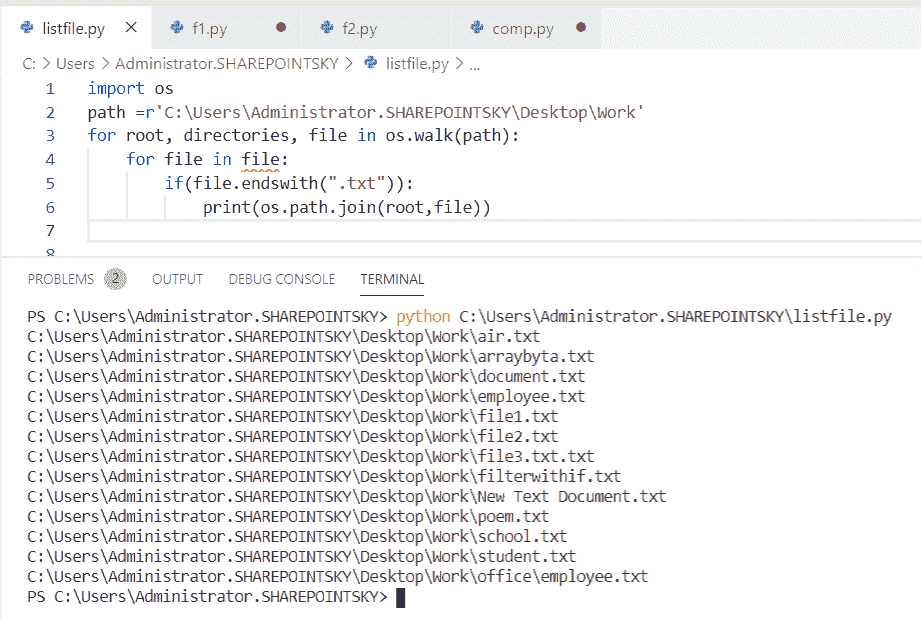
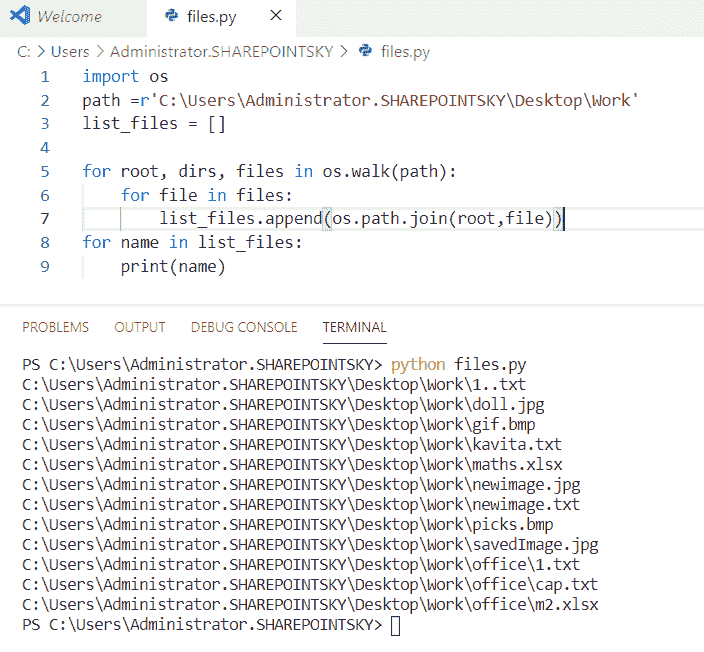
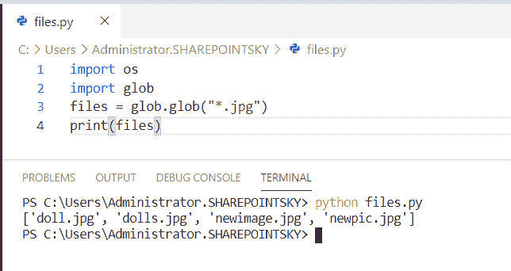

# Python 获取目录中的所有文件+各种示例

> 原文：<https://pythonguides.com/python-get-all-files-in-directory/>

[](https://sharepointsky.teachable.com/p/python-and-machine-learning-training-course)

在本 [Python 教程](https://pythonguides.com/python-programming-for-the-absolute-beginner/)中，我们将学习 **Python 获取目录**中的所有文件，我们还将涉及以下主题:

*   Python 获取带有扩展名的目录中的所有文件
*   Python 获取给定范围内的所有文件和目录
*   列出给定目录的所有目录 python
*   Python 递归地列出了目录中的所有文件
*   Python 目录中的所有文件列表
*   如何在 Python 中删除一个目录下的所有文件
*   Python 获取目录中匹配某个模式的所有文件
*   如何在 Python 中获取以开始的目录中的所有文件
*   Python 在没有扩展名的目录中获取文件
*   Python 获取目录过滤器中的所有文件
*   Python 目录，大小为
*   Python 使用绝对路径列出了目录中的所有文件
*   Python 列出了目录和子目录中的所有文件
*   Python 获取目录完整路径中的所有文件
*   Python 列出了目录和子目录中所有文件及其大小
*   Python 目录中的所有文件过滤得到 jpg 文件

目录

[](#)

*   [Python 获取目录中的所有文件](#Python_get_all_files_in_directory "Python get all files in directory")
*   [Python 列出了目录中所有扩展名为](#Python_list_all_files_in_directory_with_extension "Python list all files in directory with extension")的文件
*   [Python 获取给定范围内的所有文件目录](#Python_get_all_files_directories_with_a_given_range "Python get all files directories with a given range")
*   [列出给定目录的所有目录 Python](#List_all_directories_with_the_given_directories_Python "List all directories with the given directories Python")
*   [Python 递归列出目录中的所有文件](#Python_list_all_files_in_directory_recursively "Python list all files in directory recursively")
*   [Python 一个目录下的所有文件列表](#Python_all_files_in_a_directory_to_list "Python all files in a directory to list")
*   [Python 删除一个目录下的所有文件](#Python_delete_all_files_from_a_directory "Python delete all files from a directory")
*   [Python 获取目录中所有匹配模式的文件](#Python_get_all_files_in_a_directory_that_match_a_pattern "Python get all files in a directory that match a pattern")
*   [Python 获取从](#Python_get_all_files_in_a_directory_starting_with "Python get all files in a directory starting with")开始的目录中的所有文件
*   [Python 获取没有扩展名的目录中的文件](#Python_get_files_in_a_directory_without_an_extension "Python get files in a directory without an extension")
*   [Python 获取目录过滤器中的所有文件](#Python_get_all_files_in_directory_filter "Python get all files in directory filter")
*   [Python 目录，大小为](#Python_directory_with_the_size "Python directory with the size")
*   [Python 用绝对路径](#Python_list_all_files_in_a_directory_with_an_absolute_path "Python list all files in a directory with an absolute path")列出一个目录中的所有文件
*   [Python 列出一个目录和子目录中的所有文件](#Python_list_all_files_in_a_directory_and_subdirectory "Python list all files in a directory and subdirectory")
*   [Python 列出子目录中扩展名为](#Python_list_all_files_in_subdirectories_with_extension "Python list all files in subdirectories with extension")的所有文件
*   [Python 获取目录下所有文件的完整路径](#Python_get_all_files_in_directory_full_path "Python get all files in directory full path")
*   [Python 列出了目录和子目录中所有大小为](#Python_list_all_files_in_directory_and_subdirectories_with_size "Python list all files in directory and subdirectories with size")的文件
*   [Python 目录中的所有文件过滤得到 jpg 文件](#Python_all_files_in_directory_filter_to_get_jpg_files "Python all files in directory filter to get jpg files")

## Python 获取目录中的所有文件

在这里，我们可以看到**如何在 Python 中列出一个目录**中的所有文件。

*   在这个例子中，我已经导入了一个名为 `os` 的模块，并将一个变量声明为**路径**，并指定**路径**来列出目录中的文件。
*   一个空变量被声明为 `list_of_files` ， `root` 用于打印所有目录， `dirs` 用于打印根目录下的所有子目录， `files` 用于打印根目录和目录下的所有文件。
*   **os。walk()** 用于通过遍历树来生成目录树中的文件名，**用于` `循环**用于迭代。
*   `path.join` 用于将一个或多个路径组合成一个路径，以组合文件 `os` 方法，如 `os.walk()` 来创建最终路径。
*   **list _ of _ files . append(OS . path . join(root，file))** 用于将生成的文件追加到一个空变量中，为了打印文件列表，我使用了 `print(name)` 。

示例:

```py
import os
path =r'C:\Users\Administrator.SHAREPOINTSKY\Desktop\Work'
list_of_files = []

for root, dirs, files in os.walk(path):
	for file in files:
		list_of_files.append(os.path.join(root,file))
for name in list_of_files:
    print(name)
```

在输出中可以看到目录中的所有文件。您可以参考下面的输出截图。


Python all files in a directory

这就是如何用 Python 从一个目录中获取所有文件。

你可能喜欢 [Python 捕捉多个异常](https://pythonguides.com/python-catch-multiple-exceptions/)和 [Python 异常处理](https://pythonguides.com/python-exceptions-handling/)。

## Python 列出了目录中所有扩展名为的文件

现在，我们可以看到**如何在 Python 中列出扩展名为**的目录中的所有文件。

*   在这个例子中，我已经导入了一个名为 `os` 的模块，并将一个变量声明为**路径**，并指定**路径**来列出目录中的文件。
*   一个空变量被声明为 `list_of_files` 并且**根目录**被用于打印所有目录并且**目录**被用于打印从根目录开始的所有**子目录**。
*   **文件**用于打印根目录和目录下的所有文件。
*   `os.walk()` 用于遍历目录树生成文件名，循环的**用于迭代。**
*   如果使用了条件并且提到了扩展名并且使用了 `os.path.join()` ，则获取具有指定扩展名**的文件列表。**
*   `path.join` 用于将一个或多个路径组合成一个路径，以组合文件 `os` 方法，如 `os.walk()` 来创建最终路径。

示例:

```py
import os
path =r'C:\Users\Administrator.SHAREPOINTSKY\Desktop\Work'
for root, directories, file in os.walk(path):
	for file in file:
		if(file.endswith(".txt")):
			print(os.path.join(root,file))
```

有一个**的文件。txt** 扩展名在输出中列出。您可以参考下面的输出截图。



python list files in directory with extension

这就是如何**用 Python** 获取一个带扩展名的目录中的所有文件。

你可能喜欢读不存在 Python 的[文件。](https://pythonguides.com/file-does-not-exist-python/)

## Python 获取给定范围内的所有文件目录

现在，我们可以看到**如何在 python 中列出给定范围**的目录中的所有文件。

*   在这个例子中，我导入了一个名为 `glob` 的模块。glob 模块用于检索与指定模式匹配的文件。
*   循环的**用于迭代，**【0-9】**为指定模式。使用 print(name)来获得输出。**

示例:

```py
import glob  
for name in glob.glob(r'C:\Users\Administrator.SHAREPOINTSKY\Desktop\Work/*[0-9].*'): 
    print(name) 
```

我们可以看到文件名包含数字范围[0-9]的文件列表。您可以参考下面的输出截图。


Python all files directories with a given range

这就是如何在 Python 中**获得给定范围内的所有文件目录。**

## 列出给定目录的所有目录 Python

在这里，我们可以看到**如何用 python 中的给定目录**列出所有目录。

*   在这个例子中，我导入了一个名为 `os` 的模块，并将一个变量声明为路径，并指定了目录的路径。
*   并且另一个名为**的变量文件夹**被声明为空并且 `os.walk()` 被用于通过遍历树来生成目录树中的文件名，for 循环被用于迭代。
*   `path.join` 用于将一个或多个路径组合成一个路径，以组合文件 `os` 方法，如 `os.walk()` 来创建最终路径。

示例:

```py
 import os
path = r'C:\Users\Administrator.SHAREPOINTSKY\Desktop\Work'
folders = []
for root, directories, files in os.walk(path):
    for folder in directories:
        folders.append(os.path.join(root, folder))
for files in folders:
    print(files)
```

我们只能看到给定目录中的目录作为输出。下面的截图显示了输出。


List all directories with the given directories python

这就是如何用 Python 中的给定目录**列出所有目录。**

## Python 递归列出目录中的所有文件

现在，我们可以看到**如何在 python 中递归地列出目录中的所有文件**。

*   在这个例子中，我导入了一个名为 `glob` 的模块，并声明了一个变量，为该变量分配了**路径**，并将其用于循环迭代。
*   并且用了*** */*。csv"** 获取扩展名为 `CSV` 的文件列表，并使用**递归=真**函数。
*   递归函数是一个根据自身定义的函数，它将继续调用自身并重复调用，直到返回某个条件。

示例:

```py
import glob
path = r'C:\Users\Administrator.SHAREPOINTSKY\Desktop\Work'
files = [f for f in glob.glob(path + "**/*.csv", recursive=True)]
for f in files:
    print(f)
```

在下面的截图中，我们可以看到带有**的文件列表。csv** 扩展


python list all files in directory recursively

这就是如何用 Python 递归地**获取一个目录中的所有文件。**

阅读:[如何用 python 创建字典键列表](https://pythonguides.com/create-a-list-of-dictionary-keys-in-python/)

## Python 一个目录下的所有文件列表

在这里，我们可以看到**目录中的所有文件，以 python 列出**。

*   在这个例子中，我已经导入了一个名为 `os` 的模块，**根目录**用于打印所有目录，**目录**用于打印根目录下的所有**子目录**。**文件**用于打印根目录和目录下的所有文件。
*   `os.walk()` 用于通过遍历树来生成目录树中的文件名。
*   for 循环用于迭代。这里，我使用了 `print(filename)` 来获取文件的名称。

示例:

```py
import os
for root, dirs, files in os.walk(r'C:\Users\Administrator.SHAREPOINTSKY\Desktop\Work'):
    for filename in files:
        print(filename)
```

我们可以从目录中看到文件列表。您可以参考下面的输出截图


Python all files in a directory to list

## Python 删除一个目录下的所有文件

在这里，我们可以看到**如何用 python 删除一个目录**中的所有文件。

*   在这个例子中，我导入了一个名为 `os` 的模块，声明了一个名为 **path、**的变量，并分配了一个路径。
*   `os.walk()` 用于通过遍历树来生成目录树中的文件名，for 循环用于迭代。 `os.remove()` 用于从目录中删除文件。

示例:

```py
import os
path = r'C:\Users\Administrator.SHAREPOINTSKY\Desktop\Work'
for root, directories, files in os.walk(path):
    for file in files:
        os.remove(os.path.join(root, file))
```

由于所有文件都被删除，文件不会显示在输出中。这就是我们如何在 Python 中从一个目录中删除所有文件。

## Python 获取目录中所有匹配模式的文件

在这里，我们可以看到**如何获取一个目录中与 python 中的模式**相匹配的所有文件

*   在这个例子中，我导入了一个名为 `glob` 的模块，并使用**作为循环**。
*   `glob.glob()` 用于查找所有匹配指定模式的路径名。
*   路径与模式一起分配。这里，我已经把图案当成**新的了？*** 。 **'*'** 用于匹配任何字符序列和【T4 '？'匹配任何单个字符。

示例:

```py
import glob
for name in glob.glob(r'C:\Users\Administrator.SHAREPOINTSKY\Desktop\Work\new?*'):
    print(name)
```

在这里，我们可以在输出中看到匹配模式的文件作为 `new` 。您可以参考下面的输出截图:


Python get all files in a directory that match a pattern

## Python 获取从开始的目录中的所有文件

在这里，我们可以**如何在 python 中获得一个以**开头的目录中的所有文件

*   在这个例子中，我导入了一个名为 `os` 的模块，并使用 `os.walk ()` 通过遍历目录树来生成文件名。
*   这里，我们使用了 **for 循环**进行迭代，if 条件用于获取文件`starts with**`【new】**。这里我们可以使用任何我们想要的关键字。

示例:

```py
import os
for path, Directory, files in os.walk(r'C:\Users\Administrator.SHAREPOINTSKY\Desktop\Work'):
    for file in files:
        if file.startswith("new"):
            print(file)
```

我们可以在输出中看到文件名只以 `new` 开头。您可以参考下面的输出截图。


Python get all files in a directory starting with

## Python 获取没有扩展名的目录中的文件

在这里，我们可以看到**如何在 python 中获取没有扩展名**的目录中的文件

*   在这个例子中，我导入了一个名为 `os` 的模块，并将一个变量声明为一个**目录**。
*   并将路径与路径名一起分配给它，文件名也被提及并使用**(OS . path . split ext(directory)[0])**来拆分文件名和扩展名。**【0】**是去掉扩展名的 jpg 的索引值。

示例:

```py
import os
directory = r'C:\Users\Administrator.SHAREPOINTSKY\Desktop\Work\newimage.jpg'
print(os.path.splitext(directory)[0]) 
```

我们在输出中只能看到不带扩展名的文件名。下面的截图显示了输出。


Python get files in a directory without an extension

## Python 获取目录过滤器中的所有文件

现在，我们可以看到**如何使用 python 中的过滤器**获取目录中的所有文件

*   在这个例子中，我导入了一个名为 `os` 和 `glob` 的模块，并将一个变量声明为 files，并将 **glob.glob("*。txt")** 。
*   `glob.glob()` 用于返回文件列表和过滤文件，我用了 **"*。txt"** 并使用**打印(文件)**来获取文件列表。
*   星号**' * "**用于匹配任何字符序列

示例:

```py
import os
import glob
files = glob.glob("*.txt")
print(files)
```

我们可以从目录中看到所有只有**的文件。txt** 分机为输出。你可以参考下面的截图。


Python get all files in directory filter

## Python 目录，大小为

在这里，我们可以看到**如何从 python 中大小为**的目录中获取文件

*   在这个例子中，我导入了一个名为 **os、**的模块，并分配了一个**路径**。另一个变量被声明为一个文件，并将其赋值为 **file = os.stat(path)。**
*   `stat()` 用于获取特定路径的状态。为了获得文件的字节大小，我使用了 `file.st_size` 。
*   为了获得以兆字节为单位的文件大小，我使用了 `file.st_size / (1024 * 1024)` 。

示例:

```py
import os
path = r'C:\Users\Administrator.SHAREPOINTSKY\Desktop\Work'
file = os.stat(path)
print(file)
print(f'Size in Bytes is {file.st_size}')
print(f'Size in MegaBytes is {file.st_size / (1024 * 1024)}')
```

在下面的截图中，我们可以看到以**字节**和**兆字节**作为输出的大小。


Python directory with the size

## Python 用绝对路径列出一个目录中的所有文件

现在，我们可以看到**如何用 python 中的绝对路径**列出一个目录中的所有文件

*   在这个例子中，我导入了一个名为 `os` 的模块，我使用了 `os.walk()` 通过遍历目录树来生成文件名。
*   `os.path.join()` 用于将两条或多条路径合并成一条路径。 `os.path.abspath` 返回路径名的规范化绝对版本。

示例:

```py
import os
for root, dirs, files in os.walk('.'):
    for file in files:
        p=os.path.join(root,file)
    print(os.path.abspath(p))
```

我们可以看到来自绝对路径的所有文件作为输出。您可以参考下面的输出截图。


Python list all files in a directory with an absolute path

## Python 列出一个目录和子目录中的所有文件

现在，我们可以看到**如何在 python 中列出一个目录和子目录**中的所有文件

*   在这个例子中，我已经导入了一个名为 `os` 的模块，并将一个变量声明为**路径**，并指定**路径**来列出目录和子目录中的文件。
*   声明一个空变量为 `list_files` ，用**根目录**打印所有目录，用**目录**打印根目录下的所有子目录，**文件**打印根目录下的所有文件。
*   **os。walk()** 用于通过遍历树来生成目录树中的文件名，**用于` `循环**用于迭代。
*   `path.join` 用于将一个或多个路径组合成一个路径，以组合文件 `os` 方法，如 `os.walk()` 来创建最终路径。
*   **list _ of _ files . append(OS . path . join(root，file))** 用于将生成的文件追加到一个空变量中，为了打印文件列表，我使用了 `print(name)` 。

示例:

```py
import os
path =r'C:\Users\Administrator.SHAREPOINTSKY\Desktop\Work'
list_files = []
for root, dirs, files in os.walk(path):
	for file in files:
		list_files.append(os.path.join(root,file))
for name in list_files:
    print(name)
```

下面的屏幕截图显示了目录和子目录中所有文件的输出。



Python list all files in a directory and subdirectory

## Python 列出子目录中扩展名为的所有文件

在这里，我们可以看到**如何在 python 中列出子目录中扩展名为**的所有文件

*   在这个例子中，我已经导入了**操作系统、**并将一个变量声明为**路径、**，并将该路径分配给一个子目录。
*   一个空变量被声明为 `list_files` 。**根目录**用于打印所有目录，**目录**用于打印根目录下的所有子目录，**文件**用于打印根目录下的所有文件。
*   **os。walk()** 用于通过遍历树来生成目录树中的文件名，**用于` `循环**用于迭代。
*   `path.join` 用于将一个或多个路径组合成一个路径，以组合文件 `os` 方法，如 `os.walk()` 来创建最终路径。
*   **list _ files . append(OS . path . join(root，file))** 用于将生成的文件追加到一个空变量中，要打印文件列表，我使用了 `print(name)` 。

示例:

```py
import os
path =r'C:\Users\Administrator.SHAREPOINTSKY\Desktop\Work\office'
list_files = []
for root, dirs, files in os.walk(path):
	for file in files:
		list_files.append(os.path.join(root,file))
for name in list_files:
    print(name)
```

我们可以看到子目录中的文件列表作为输出。您可以参考下面的输出截图。


Python list all files in subdirectories with extension

## Python 获取目录下所有文件的完整路径

在这里，我们可以看到**如何在 python 中获取目录完整路径**中的所有文件

*   在这个例子中，我已经导入了 `os` ，并声明了一个变量为**路径**，并指定了目录的完整路径。
*   声明一个空变量为 `list_files` ，用**根目录**打印所有目录，用**目录**打印根目录下的所有子目录，**文件**打印根目录下的所有文件。
*   **os。walk()** 用于通过遍历树来生成目录树中的文件名，**用于` `循环**用于迭代。
*   `path.join` 用于将一个或多个路径组合成一个路径，以组合文件 `os` 方法，如 `os.walk()` 来创建最终路径。
*   **list _ files . append(OS . path . join(root，file))** 用于将生成的文件追加到一个空变量中，要打印文件列表，我使用了 `print(name)` 。

示例:

```py
import os
path =r'C:\Users\Administrator.SHAREPOINTSKY\Desktop\Newfolder'
list_files = []
for root, dirs, files in os.walk(path):
	for file in files:
		list_files.append(os.path.join(root,file))
for name in list_files:
    print(name)
```

我们可以在输出中看到来自指定的完整路径的文件列表。您可以参考下面的输出截图。


Python get all files in directory full path

## Python 列出了目录和子目录中所有大小为的文件

在这里，我们可以看到**如何在 python 中从目录和子目录中获取大小为**的文件

*   在这个例子中，我导入了一个名为 `os` 的模块，并分配了**路径**，这里 `Work` 是目录， `office` 是子目录。
*   另一个变量被声明为一个文件，并将其赋值为 **file = os.stat(path)。**
*   `stat()` 用于获取特定路径的状态。为了获得文件的字节大小，我使用了 `file.st_size` 。
*   为了获得以兆字节为单位的文件大小，我使用了 `file.st_size / (1024 * 1024)` 。

示例:

```py
import os
path = r'C:\Users\Administrator.SHAREPOINTSKY\Desktop\Work\office'
file = os.stat(path)
print(file)
print(f'Size in Bytes is {file.st_size}')
print(f'Size in MegaBytes is {file.st_size / (1024 * 1024)}')
```

在下面的截图中，我们可以看到以**字节**和**兆字节**作为输出的大小。


Python list all files in directory and subdirectories with size

## Python 目录中的所有文件过滤得到 jpg 文件

现在，我们可以看到**如何在 python 中使用 filter 获取 jpg 文件**来获取目录中的所有文件

*   在这个例子中，我导入了一个名为 `os` 和 `glob` 的模块，并将一个变量声明为 files，并将 **glob.glob("*。jpg")** 。
*   `glob.glob()` 用于返回文件列表和过滤文件，我用了 **"*。jpg"** 并使用 print(files)来获取文件列表。 **'*'** 用于匹配任何字符序列。

示例:

```py
import os
import glob
files = glob.glob("*.jpg")
print(files)
```

我们可以从目录中看到所有只有**的文件。jpg** 扩展名作为输出。你可以参考下面的截图。



Python all files in directory filter to get jpg files

您可能会喜欢以下 Python 教程:

*   [如何用 Python 把 DateTime 转换成 UNIX 时间戳](https://pythonguides.com/convert-datetime-to-unix-timestamp-in-python/)
*   [如何在 Python 中将 dictionary 转换成 JSON](https://pythonguides.com/convert-dictionary-to-json-python/)
*   [Python 向 CSV 写列表](https://pythonguides.com/python-write-a-list-to-csv/)
*   [如何将 Python 数组写入 CSV](https://pythonguides.com/python-write-array-to-csv/)
*   [Python 读取二进制文件](https://pythonguides.com/python-read-a-binary-file/)
*   [Python 要求用户输入](https://pythonguides.com/python-ask-for-user-input/)
*   [Python 文件方法](https://pythonguides.com/python-file-methods/)
*   [Python 复制文件](https://pythonguides.com/python-copy-file/)

在本教程中，我们学习了 **Python 获取一个目录中的所有文件**，我们还讨论了以下主题:

*   Python 列出了带有扩展名的目录中的所有文件
*   Python 获取给定范围内的所有文件和目录
*   列出给定目录的所有目录 python
*   Python 递归地列出了目录中的所有文件
*   Python 列出了一个目录中所有要列出的文件
*   Python 删除一个目录中的所有文件
*   Python 获取目录中匹配某个模式的所有文件
*   Python 获取一个目录中的所有文件，以
*   Python 在没有扩展名的目录中获取文件
*   Python 获取目录过滤器中的所有文件
*   Python 目录，大小为
*   Python 使用绝对路径列出了目录中的所有文件
*   Python 列出了目录和子目录中的所有文件
*   Python 获取目录完整路径中的所有文件
*   Python 列出了目录和子目录中所有文件及其大小
*   Python 目录中的所有文件过滤得到 jpg 文件

[Bijay Kumar](https://pythonguides.com/author/fewlines4biju/)

Python 是美国最流行的语言之一。我从事 Python 工作已经有很长时间了，我在与 Tkinter、Pandas、NumPy、Turtle、Django、Matplotlib、Tensorflow、Scipy、Scikit-Learn 等各种库合作方面拥有专业知识。我有与美国、加拿大、英国、澳大利亚、新西兰等国家的各种客户合作的经验。查看我的个人资料。

[enjoysharepoint.com/](https://enjoysharepoint.com/)[](https://www.facebook.com/fewlines4biju "Facebook")[](https://www.linkedin.com/in/fewlines4biju/ "Linkedin")[](https://twitter.com/fewlines4biju "Twitter")