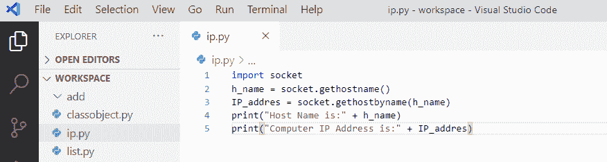
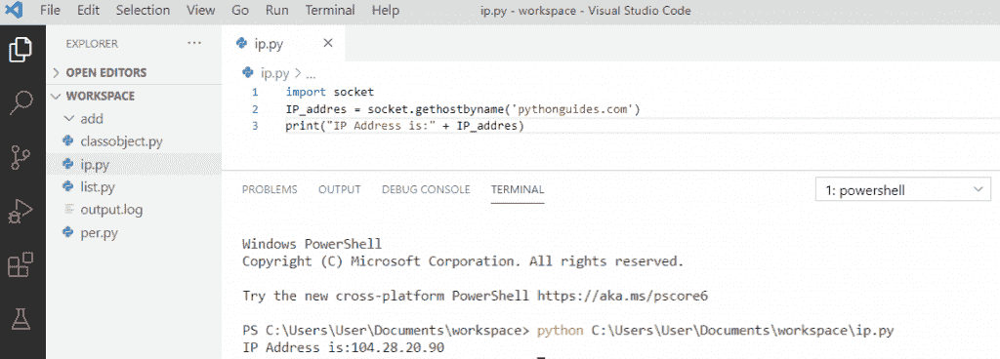
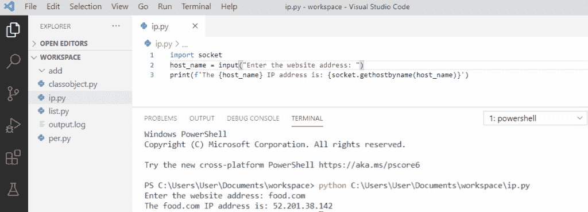
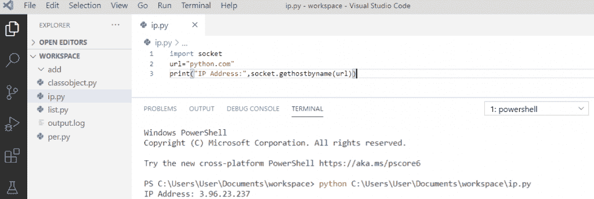
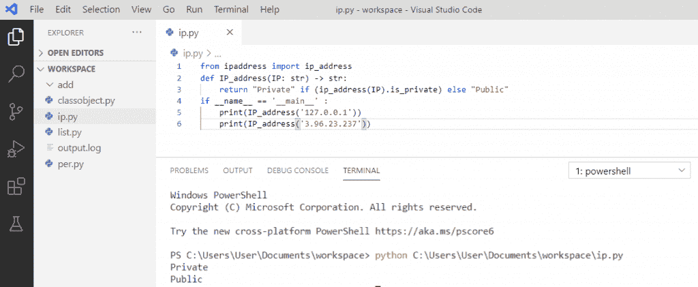
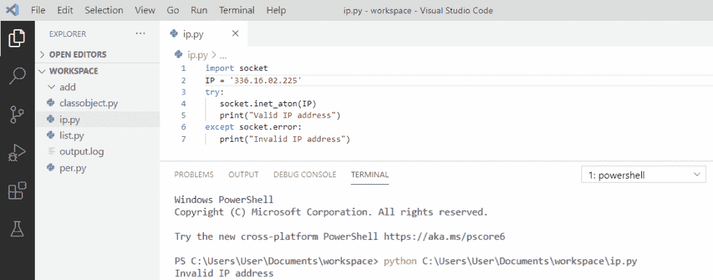
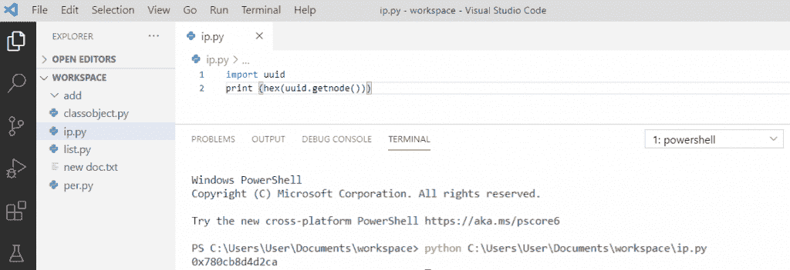
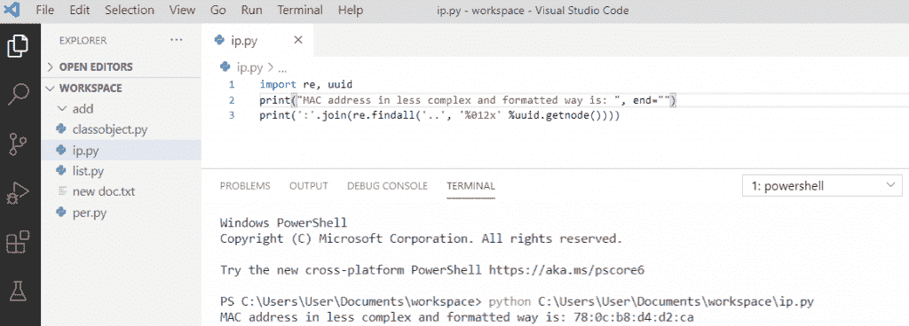

# Python 获得一个 IP 地址

> 原文：<https://pythonguides.com/python-get-an-ip-address/>

[](https://sharepointsky.teachable.com/p/python-and-machine-learning-training-course)

在这个 [python 教程中，](https://pythonguides.com/python-hello-world-program/)你将通过例子学习**什么是 IP 地址**和**如何使用 python 中的**套接字模块**获得 IP 地址**。这里我们将检查 **:**

*   Python 获取 IP 地址
*   Python 从主机名获取 IP 地址
*   Python 使用脚本获取网站的 IP 地址
*   Python 从 URL 获取 IP 地址
*   使用 python 中的 IP Address 模块确定给定的 IP 地址是公共的还是私有的
*   Python IP 地址验证
*   Python 提取 MAC 地址

目录

[](#)

*   [什么是 IP 地址](#What_is_an_IP_Address "What is an IP Address ")
*   [Python 获取 IP 地址](#Python_get_IP_Address "Python get IP Address")
*   [Python 从主机名中获取 IP 地址](#Python_get_IP_Address_from_hostname "Python get IP Address from hostname")
*   [Python 使用脚本获取网站的 IP 地址](#Python_get_the_IP_Address_of_a_website_using_a_script "Python get the IP Address of a website using a script")
*   [Python 从 URL 获取 IP 地址](#Python_get_an_IP_address_from_the_URL "Python get an IP address from the URL")
*   [使用 python 中的 IP Address 模块确定给定的 IP 地址是公共的还是私有的](#Determine_if_the_given_IP_Address_is_public_or_private_using_the_ipaddress_module_in_python "Determine if the given IP Address is public or private using the ipaddress module in python")
*   [Python IP 地址验证](#Python_IP_Address_validation "Python IP Address validation")
*   [Python 提取 MAC 地址](#Python_extract_MAC_address "Python extract MAC address")

## 什么是 IP 地址

*   IP 代表**互联网协议**地址。它是您的网络硬件的一个地址，在那里它将您的计算机与您的网络上和世界各地的其他设备连接起来。
*   IP 地址由字符或数字组成，如 `508.543.12.514` 。所有连接到互联网的设备都有一个唯一的 IP 地址。

## Python 获取 IP 地址

为了**获得你电脑的 Python** 中的 IP 地址，我们需要导入 `socket` 库，然后我们就可以找到电脑、笔记本电脑等的 IP 地址，它们就有了自己唯一的 IP 地址。

**举例:**

```py
import socket
h_name = socket.gethostname()
IP_addres = socket.gethostbyname(h_name)
print("Host Name is:" + h_name)
print("Computer IP Address is:" + IP_addres)
```

*   写完上面的代码(python 获取 IP 地址)，你会打印出 `"IP_addres"` 然后输出会显示为**"主机名是:桌面-AJNOCQ 计算机 IP 地址是:192.168.45.161 "** 。
*   首先导入 `socket` 模块，然后使用 `socket.gethostname()` 获取 `h_name` 。
*   现在，通过将 `h_name` 作为参数传递给 `socket.gethostbyname()` 来找到 **IP 地址**，并将其存储在一个变量中。打印 IP 地址。

你可以参考下面的 python 获取 IP 地址的截图



Python get IP Address

**输出:**

```py
Host Name is: DESKTOP-AJNOCQ
Computer IP Address is: 192.168.45.161
```

## Python 从主机名中获取 IP 地址

Python `gethostbyname()` 函数接受主机名作为参数，它将使用**套接字**模块返回某些网站的 IP 地址。

**举例:**

```py
import socket
IP_addres = socket.gethostbyname('pythonguides.com')
print("IP Address is:" + IP_addres)
```

*   写完上面的代码(python 从主机名中获取 IP 地址)，你将打印出 `"IP_addres"` ，然后输出将显示为 **"IP 地址是:104.28.20.90"** 。
*   这里， `socket.gethostbyname()` 会返回网站的 IP 地址。
*   如果你和我不在同一个地方，那么你可能会得到不同的 IP 地址作为输出。

你可以参考下面的 python 从主机名获取 IP 地址的截图



Python get IP Address from hostname

## Python 使用脚本获取网站的 IP 地址

这里，我们将要求用户输入网站地址，然后打印该网站的 IP 地址。

**举例:**

```py
import socket
host_name = input("Enter the website address: ")
print(f'The {host_name} IP address is: {socket.gethostbyname(host_name)}')
```

*   写完上面的代码(python 使用脚本获取一个网站的 IP 地址)后，首先我们将输入网站地址，然后它将输出为**“food.com 的 IP 地址是:52 . 201 . 38 . 142”**。
*   这里，`socket . gethostbyname(host _ name)`会返回网站**“food . com”**的 IP 地址。

你可以参考下面的 python 截图，使用脚本获取网站的 IP 地址。



Python get the IP Address of a website using a script

## Python 从 URL 获取 IP 地址

首先，我们导入了一个 `socket` 模块来获取 python 中一个 URL 的 IP 地址。URL 代表**统一资源定位符**。URL 是资源在互联网上的地址。

**举例:**

```py
import socket
url = "python.com"
print("IP Address:",socket.gethostbyname(url))
```

*   写完上面的代码(python 从 URL 中获取一个 IP 地址)后，我们将把一个 URL 赋给一个变量。
*   该变量作为`socket . gethostbyname(URL)`的参数，它将返回输出为**IP 地址:3 . 96 . 23 . 237**。

你可以参考下面 python 从 URL 获取 IP 地址的截图。



Python get an IP address from the URL

## 使用 python 中的 IP Address 模块确定给定的 IP 地址是公共的还是私有的

*   **私有 IP 地址–**私有 IP 地址是连接到家庭或企业网络的设备的地址。无法从家庭或企业网络之外的设备访问此 IP 地址。
*   **公共 IP 地址–**公共 IP 地址是用于网络外部通信的地址。这个 IP 地址把你和世界联系起来，它对所有人来说都是独一无二的。公共 IP 地址由互联网服务提供商(ISP)分配。

为了确定给定的 **IP 地址是公有的还是私有的**，我们将首先**导入 ipaddress** 模块，我们将使用 IP Address 模块的 `is_private` 方法，该方法将测试该地址是否被分配为私有。

**举例:**

```py
from ipaddress import ip_address
def IP_address(IP: str)-> str:
    return "Private" if (ip_address(IP).is_private)else "Public"
if __name__ == '__main__':
    print(IP_address('127.0.0.1'))
    print(IP_address('3.96.23.237'))
```

先写完上面的代码(用 python 中的 ipaddress 模块确定给定的 IP 地址是公有的还是私有的)之后，我们就导入 ipaddress 模块，然后我们就使用 IP Address 的 is_private 方法。它将输出作为**“私有公共”**返回。

你可以参考下面 python 从 URL 获取 IP 地址的截图。



Determine if the given IP Address is public or private using the ipaddress module in python

## Python IP 地址验证

如果你想检查给定的 **IP 地址是否有效**，使用 `socket` 模块，我们也将使用函数 `inet_aton()` ，该函数只有一个参数。

**举例:**

```py
import socket 
IP = '127.0.0.2561'
try:
   socket.inet_aton(IP)
   print("Valid IP address")
except socket.error:
   print("Invalid IP")
```

在编写完上面的代码(python IP 地址验证)之后，您将打印这些代码，然后输出将是**“无效的 IP 地址”**，因为给定的 IP 是无效的，因此将执行 except 块。如果给定的 IP 地址有效，那么它将返回一个有效的 IP 地址。

你可以参考下面的 python IP 地址验证截图。



Python IP Address validation

## Python 提取 MAC 地址

*   **媒体访问控制地址(MAC 地址)**也称为物理地址，是分配给计算机的**网卡(NIC)** 的唯一标识符。
*   **MAC 地址**是唯一标识网络上每个设备的硬件标识号。
*   网卡帮助计算机与网络中的计算机连接。

为了提取 **MAC 地址**我们将首先**导入 uuid** 模块，然后我们将使用 `uuid.getnode()` 来提取计算机的 MAC 地址。

**举例:**

```py
import uuid
print(hex(uuid.getnode()))
```

写完上面的代码(python 提取 MAC 地址)后，你将打印出 `"hex(uuid.getnode())"` ，然后输出将是 `" 0x780cb8d4d2ca "` 。但是可视输出的格式不适合，而且也很复杂。

你可以参考下面的 python 提取 MAC 地址的截图。



Python extract MAC address

为了获得格式形式的 MAC 地址，我们将使用 **getnode()、findall()和 re()** 。我们需要**导入 re** 和 `uuid` 模块。

**举例:**

```py
import re, uuid
print(" MAC address in less complex and formatted way is :", end="")
print(':'.join(re.findall('..', '%012x' %uuid.getnode())))
```

编写完上面的代码(python 提取 MAC 地址)后，您将打印这些代码，然后输出将是 **" MAC 地址以不太复杂和格式化的方式是:78:0c:b8:d4:d2:ca"** 。在每 2 位数后使用 getnode()的 join 元素使用 regex 表达式将以格式化的方式提供。

你可以参考下面的 python 提取 MAC 地址的截图。



Python extract MAC address

您可能会喜欢以下 Python 教程:

*   [Python – stderr, stdin and stdout](https://pythonguides.com/python-stderr-stdin-and-stdout/)
*   [Python 中的阿姆斯特朗数](https://pythonguides.com/armstrong-number-in-python/)
*   [Python GUI 编程(Python Tkinter)](https://pythonguides.com/python-gui-programming/)
*   [Python 中的递增和递减运算符](https://pythonguides.com/increment-and-decrement-operators-in-python/)
*   [Python 中的构造函数](https://pythonguides.com/constructor-in-python/)
*   [Python 匿名函数](https://pythonguides.com/python-anonymous-function/)
*   [Python 匿名函数](https://pythonguides.com/python-anonymous-function/)
*   [Python 访问修饰符+示例](https://pythonguides.com/python-access-modifiers/)
*   Python 中的[函数](https://pythonguides.com/function-in-python/)
*   [Python 数组与示例](https://pythonguides.com/python-array/)
*   [Python 3 pickle typeerror 需要一个类似字节的对象，而不是“str”](https://pythonguides.com/python-3-pickle-typeerror-a-bytes-like-object-is-required-not-str/)

在这个 Python 教程中，我们学习了 **Python 获取 IP 地址**。此外，我们还讨论了以下主题:

*   什么是 IP 地址，如何在 Python 中获得 IP 地址
*   Python 从主机名获取 IP 地址
*   Python 使用脚本获取网站的 IP 地址
*   Python 从 URL 获取 IP 地址
*   使用 python 中的 IP Address 模块确定给定的 IP 地址是公共的还是私有的
*   Python IP 地址验证
*   Python 提取 MAC 地址

[Bijay Kumar](https://pythonguides.com/author/fewlines4biju/)

Python 是美国最流行的语言之一。我从事 Python 工作已经有很长时间了，我在与 Tkinter、Pandas、NumPy、Turtle、Django、Matplotlib、Tensorflow、Scipy、Scikit-Learn 等各种库合作方面拥有专业知识。我有与美国、加拿大、英国、澳大利亚、新西兰等国家的各种客户合作的经验。查看我的个人资料。

[enjoysharepoint.com/](https://enjoysharepoint.com/)[](https://www.facebook.com/fewlines4biju "Facebook")[](https://www.linkedin.com/in/fewlines4biju/ "Linkedin")[](https://twitter.com/fewlines4biju "Twitter")