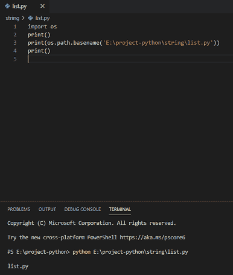
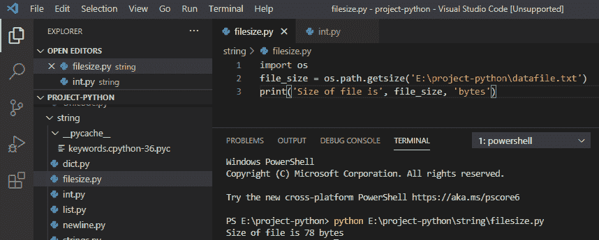
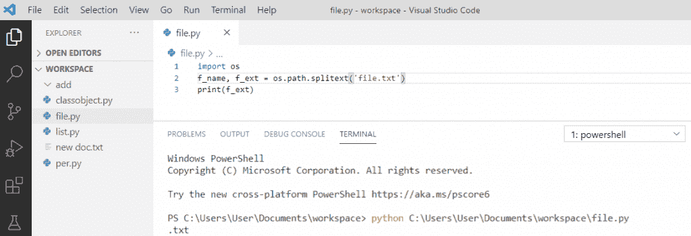
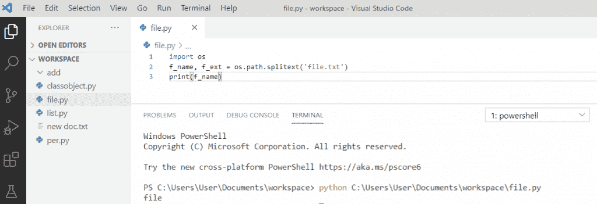

# 如何在 Python 中从路径中获取文件名

> 原文：<https://pythonguides.com/python-get-filename-from-the-path/>

[](https://sharepointsky.teachable.com/p/python-and-machine-learning-training-course)

在这个 [Python 教程](https://pythonguides.com/python-programming-for-the-absolute-beginner/)中，我们将讨论如何**从路径**中获取文件名，我们也将看到如何在 Python 中获取文件大小。

*   Python 从路径中获取文件名
*   Python 获取文件大小
*   Python 从文件名中获取文件扩展名
*   Python 获取不带扩展名的文件名

目录

[](#)

*   [Python 从路径](#Python_get_filename_from_path "Python get filename from path")获取文件名
*   [Python 获取文件大小](#Python_get_the_file_size "Python get the file size")
*   [Python 从文件名中获取文件扩展名](#Python_get_file_extension_from_filename "Python get file extension from filename")
*   [Python 获取不带扩展名的文件名](#Python_get_filename_without_extension "Python get filename without extension")

## Python 从路径获取文件名

为了从 Python 中的路径获取文件名，我们需要导入 os，然后添加路径。

**举例:**

```py
import os
print()
print(os.path.basename('E:\project-python\string\list.py'))
print()
```

在编写了上面的代码(python 从 path 中获取文件名)之后，您将打印这些代码，然后输出将显示为 `" list.py "` 。你可以参考下面的截图从路径创建一个 python get 文件名。



Get filename from the path in Python

上面的代码，我们可以用 Python 中的从一个路径中**获取文件名。**

你可能也喜欢，[如何使用 Python](https://pythonguides.com/pandas-drop/) 中的熊猫 drop()函数？

## Python 获取文件大小

在 python 中，为了获得文件大小，我们将使用 **os 模块**，python os 模块具有 `getsize()` 函数，其中文件名作为参数传递，并以字节为单位返回文件的大小。

```py
import os
file_size = os.path.getsize('E:\project-python\datafile.txt')
print('Size of file is', file_size, 'bytes')
```

写完上面的代码(Python 获取文件大小)，你将打印出 `"file_size"` ，然后输出将显示为**"文件大小为 78 字节"**。这里，我们使用 getsize()函数来获取文件的大小。你可以参考下面的截图 Python 获取文件大小。



Get file size in Python

这就是我们如何在 Python 中**获得文件大小。**

## Python 从文件名中获取文件扩展名

为了从文件名字符串中获取**文件扩展名**，我们将**导入 os** 模块，然后我们可以使用方法 `os.path.splitext()` 。它会将路径名分成一对根和扩展名。

**举例:**

```py
import os
f_name, f_ext = os.path.splitext('file.txt')
print(f_ext)
```

写完上面的代码(Python 从文件名中获取文件扩展名)，你将打印出**“f _ ext”**，然后输出将显示为**。txt "** 。这里，文件名将被分成两部分，当我们打印 f_ext 时，它将给出文件名的扩展名。你可以参考下面的截图 Python 从文件名中获取文件扩展名。



Python get file extension from filename

这就是我们如何在 Python 中从文件名中获取文件扩展名。

## Python 获取不带扩展名的文件名

为了在 python 中获取不带扩展名的**文件名**，我们将**导入 os** 模块，然后我们可以使用 `os.path.splitext()` 方法获取名称。

**举例:**

```py
import os
f_name, f_ext = os.path.splitext('file.txt')
print(f_name)
```

写完上面的代码(Python 获得不带扩展名的文件名)，你将打印出**“f _ name”**，然后输出将显示为**“文件”**。这里，文件名将被分成两部分，当我们打印 f_name 时，它将删除扩展名。你可以参考下面的截图 Python 获取不带扩展名的文件名。



Python get filename without extension

这就是如何在 Python 中**获得不带扩展名的文件名。**

您可能会喜欢以下 Python 教程:

*   [使用 Visual Studio 代码](https://pythonguides.com/python-hello-world-program/)用 python 创建一个 hello world 程序
*   [Python 字符串函数](https://pythonguides.com/string-methods-in-python/)
*   [Python 类型错误:“列表”对象不可调用](https://pythonguides.com/python-typeerror-list-object-is-not-callable/)
*   [如何在 python 中把整数转换成字符串](https://pythonguides.com/convert-an-integer-to-string-in-python/)
*   [如何在 python 中连接字符串](https://pythonguides.com/concatenate-strings-in-python/)
*   [Python 命名约定](https://pythonguides.com/python-naming-conventions/)
*   [如何在 python 中使用正则表达式拆分字符串](https://pythonguides.com/python-split-string-regex/)
*   [如何在 Python 中创建字符串](https://pythonguides.com/create-a-string-in-python/)

在本 Python 教程中，我们将讨论如何从 Python 的路径中获取文件名，以及以下内容:

*   如何在 Python 中从路径中获取文件名
*   如何在 Python 中获取文件大小
*   如何在 Python 中从文件名中获取文件扩展名
*   如何在 Python 中获得不带扩展名的文件名

[Bijay Kumar](https://pythonguides.com/author/fewlines4biju/)

Python 是美国最流行的语言之一。我从事 Python 工作已经有很长时间了，我在与 Tkinter、Pandas、NumPy、Turtle、Django、Matplotlib、Tensorflow、Scipy、Scikit-Learn 等各种库合作方面拥有专业知识。我有与美国、加拿大、英国、澳大利亚、新西兰等国家的各种客户合作的经验。查看我的个人资料。

[enjoysharepoint.com/](https://enjoysharepoint.com/)[](https://www.facebook.com/fewlines4biju "Facebook")[](https://www.linkedin.com/in/fewlines4biju/ "Linkedin")[](https://twitter.com/fewlines4biju "Twitter")