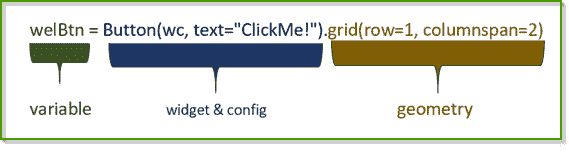
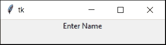
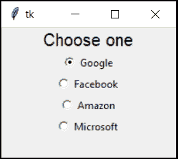

# Python GUI 编程(Python Tkinter)

> 原文：<https://pythonguides.com/python-gui-programming/>

[](https://sharepointsky.teachable.com/p/python-and-machine-learning-training-course)

想了解更多关于 **Python GUI 编程**？在这个 Python 教程中，我们将讨论关于 python gui 编程，基本上我们会看到什么是 Python GUI，什么是 `Python TKinter` 。**如何在 Python 中使用 Tkinter**。同样，我们将把下面这些东西看作:

*   如何在 Python 中下载和安装 Tkinter
*   使用 Tkinter 创建第一个程序
*   什么是 Python Tkinter 小部件
*   什么是几何管理(包、网格、位置)
*   包装、网格和位置之间的差异
*   使用 Python Tkinter 的迷你项目
*   使用 python Tkinter 的 10 个最佳项目创意

目录

[](#)

*   [使用 python 的 Gui](#Gui_using_python "Gui using python")
*   [Python tkinter 安装](#Python_tkinter_installation "Python tkinter installation")
*   [使用 Tkinter](#Create_First_Program_using_Tkinter "Create First Program using Tkinter") 创建第一个程序
*   [Python Tkinter widgets](#Python_Tkinter_widgets "Python Tkinter widgets")
    *   [Python tkinter 标签](#Python_tkinter_Label "Python tkinter Label")
    *   [Python tkinter 条目](#Python_tkinter_Entry "Python tkinter Entry")
    *   [Python tkinter Button](#Python_tkinter_Button "Python tkinter Button")
    *   [Python tkinter 消息框](#Python_tkinter_message_box "Python tkinter message box")
    *   [Python tkinter 复选框](#Python_tkinter_checkbox "Python tkinter checkbox")
    *   [Python tkinter 单选按钮](#Python_tkinter_radiobutton "Python tkinter radiobutton")
    *   [Python tkinter 列表框](#Python_tkinter_listbox "Python tkinter listbox")
    *   [Python tkinter 选项菜单](#Python_tkinter_optionmenu "Python tkinter optionmenu")
    *   [Python tkinter 标签帧](#Python_tkinter_labelframe "Python tkinter labelframe")
    *   [Python tkinter Menu](#Python_tkinter_Menu "Python tkinter Menu")
*   [几何管理](#Geometry_Management "Geometry Management")
*   [包装、网格和位置之间的差异](#Differences_between_Pack_Grid_and_Place "Differences between Pack, Grid, and Place")
*   [使用 Python Tkinter 的迷你项目](#Mini_Project_using_Python_Tkinter "Mini Project using Python Tkinter")
*   [使用 python Tkinter 的 10 个最佳项目创意](#10_best_project_Ideas_using_python_Tkinter "10 best project Ideas using python Tkinter")

## 使用 python 的 Gui

*   如果你是一名 [Python](https://pythonguides.com/python-programming-for-the-absolute-beginner/) 开发者，并且想要创建支持**图形用户界面**的酷应用程序，那么你来对地方了。在这里，我们将学习如何使用 `Python Tkinter` 创建基于 `GUI` 的应用程序。单词“ `Tkinter` ”读作**“T-kin-ter”**。我们将阅读所有关于 **Python gui 编程**的内容。
*   在 python 中，Tkinter 用于创建软件，而 `Turtle` & `Pygame` 用于创建基于图形的动画&游戏。

## Python tkinter 安装

*   Python 自带了一个**内置的 Tkinter` `模块**，所以如果你安装了 python 就可以执行 **Tkinter 程序**。
*   如果你想知道，如何安装 python，那么查看 [Python 下载安装步骤](https://pythonguides.com/python-download-and-installation/)。
*   在命令提示符下键入`python -m tkinter`来快速检查 `Tkinter` 。如果出现下面这种窗口，意味着 tkinter 已安装&，您可以跳过这一步。


python gui programming

*   如果这些窗口没有出现，请遵循以下步骤:(Macintosh 和 Linux 用户也可以遵循这些步骤)

**第一步**:

检查系统中安装的 python 版本:`python --version`


**第二步**:

去[python.org](https://www.python.org/)下载相同版本的 python。在我的情况下，我已经下载了 64 位的 `python 3.7.9` 。

**第三步**:

点击安装文件>>会出现窗口>>点击**修改**。


python gui programming

**第四步**:

选择显示 **tcl/tk 和 IDLE** 的第三个选项，然后点击**下一个**，接着点击**安装**。


Python tkinter installation

**第五步**:

在命令提示符下键入`python -m tkinter`。如果此窗口出现，意味着 tkinter 现在已安装。


Python GUI Programming

## 使用 Tkinter 创建第一个程序

让我们试着多理解一点关于 **Python gui 编程**的知识。

在引入任何命令之前，我们希望您将代码复制并粘贴到代码编辑器中，并尝试一次。这是一个简单的“你好”程序，将给出一个关于我们将要做什么的想法。


**代码**:

```py
# import modules
from tkinter import *

# configure workspace
ws = Tk()
ws.title("First Program")
ws.geometry('250x150')
ws.configure(bg="#567")

# function territory
def welcome():
    name = nameTf.get()
    return Label(ws, text=f'Welome {name}', pady=15, bg='#567').grid(row=2, columnspan=2)

# label & Entry boxes territory
nameLb = Label(ws, text="Enter Your Name", pady=15, padx=10, bg='#567')
nameTf = Entry(ws)

# button territory
welBtn = Button(ws, text="ClickMe!", command=welcome)

# Position Provide territory
nameLb.grid(row=0, column=0)
nameTf.grid(row=0, column=1)
welBtn.grid(row=1, columnspan=2)

# infinite loop 
ws.mainloop()
```

*   本节目仅供参考。本博客结束时，你将能够编写基于图形用户界面的软件。
*   在继续之前，让我们了解一下基于 tkinter 的应用程序的流程。


python tkinter example

上面提到的程序是以同样的顺序完成的&这个顺序在每个 Tkinter 初学者程序中都要遵循。这保持了代码的整洁和有序。

1.  导入必要的模块或库。
2.  工作区是使用`ws = Tk()`创建的，这里的`ws`可以替换为任意名称。最常见的 `ws` 替换有**根**、**窗**、**赢、主、**等。这完全是你自己的参考，在我们的情况下，它意味着工作空间。
3.  需要一个无限循环来支撑屏幕。如果没有这个循环，屏幕将会立即飞溅&消失。
4.  标签、输入框和按钮是部件。我们将在课程的后面详细研究它们。
5.  按钮区域包含所有的按钮。
6.  如图所示，小部件有 3 个部分。



python gui programming.

*   **变量**是分配给小工具的名称。在小部件上执行的所有活动都将存储在这个名称下。这个名称可以在以后用来指代这个小部件。
*   `Widgets` 是标签、条目、按钮、消息、复选按钮、单选按钮等。他们有专门的任务要完成。除了这个任务之外，它们还可以配置额外的工具，如颜色、字体等。
*   **几何**指的是小部件的位置。Tkinter 有 3 种类型的几何图形(包装、网格、位置)。它们中的每一个都有不同的放置小部件的方式。会在后面的课程中详细介绍。

## Python Tkinter widgets

*   GUI 完全是关于小部件的，因为 **Python Tkinter 小部件**为我们提供了控件，用户使用这些控件与我们的应用程序进行交互。
*   **标签、文本框、列表框、按钮、菜单、**等被称为**控件**。每个小部件都有自己的属性。
*   有 10 种类型的 Python Tkinter 小部件，我已经逐一解释过了(有例子)。
*   `ws` 代表父窗口。

### Python tkinter 标签

*   一个 **Python tkinter 标签**是一段简单的文本或信息。
*   标签是一个非常常见且广泛使用的小部件。
*   标签是创建任何应用程序之前使用的第一个小部件。

**语法**:

```py
Label(ws, text=value )
```

**举例**:

这是 Label 的实现。在这里，文本被赋值为“输入名称”。

**代码:**

```py
from tkinter import *

ws = Tk()

nameLb = Label(ws, text="Enter Name")
nameLb.pack()

ws.mainloop()
```

**输出**:

输入名称是在标签中分配的值，因此它显示在此处。



python tkinter example

### Python tkinter 条目

让我们来讨论一下 **Python tkinter 入口。**

*   输入框用于接收用户输入。
*   这是另一个广泛使用的小部件。

**语法**:

```py
Entry(ws)
```

**举例:**

这是输入框的实现。它将显示一个空框，准备由用户填充。

**代码:**

```py
from tkinter import *

ws = Tk()

nameTf = Entry(ws)
nameTf.pack()

ws.mainloop() 
```

**输出:**

输出显示一个空文本框，在这里输入文本！”是用户写的。


Python tkinter Entry

### Python tkinter Button

让我们来讨论一下 **Python tkinter 按钮**。

*   按钮触发动作。
*   Button 将 command 作为一个参数，这很神奇。

**语法**:

```py
Button(ws, command=<action>)
```

**举例:**

这是 Button 的实现。提供的显示文本是“**提交**，传递的命令是函数:**提交**。点击按钮将触发功能。

**代码:**

```py
from tkinter import *

ws = Tk()

def submit():
    return Label(ws, text="Submitted!").pack()

submitBtn = Button(ws, text="submit", command=submit)
submitBtn.pack()

ws.mainloop() 
```

**输出:**

该功能是创建另一个标签，其文本为“**已提交**”。因此输出显示了按钮下面的小文本。它是在单击按钮后创建的。


Python tkinter Button

### Python tkinter 消息框

*   **Python 消息框**是一个带有消息的弹出框。
*   要使用消息框，导入**消息框**模块。
*   有六种类型的消息提示，例如:
    *   **showinfo :** 用声音显示消息。返回“确定”
    *   **显示警告:**用声音显示警告信息。返回“确定”
    *   **显示错误:**用声音显示错误信息。返回“确定”
    *   **askquestion :** 提示“是”、“否”选项。返回是或否
    *   **询问是否:**提示“是”、“否”选项。是返回 1，否返回 0
    *   **askretrycancel :** 提示选择“**重试**或“**取消**。带声音重试返回 `1` 和取消返回 `0`

**语法:**

```py
messagebox.function(title, message)
```

**举例:**

下面是使用 python tkinter 的所有消息框的例子。所有类型的消息都放在一个功能下，只需一个按钮即可触发。

**代码:**

```py
from tkinter import *
from tkinter import messagebox

ws = Tk()

def prompts():
    messagebox.showinfo("showinfo", "Hi there!")
    messagebox.showwarning("showinfo", "Hi there!")
    messagebox.showerror("showinfo", "Hi there!")
    messagebox.askquestion("showinfo", "Hi there!")
    messagebox.askyesno("showinfo", "Hi there!")
    messagebox.askretrycancel("showinfo", "Hi there!")

Button(ws, text="Click Me!", command=prompts).pack()

ws.mainloop() 
```

**输出**:

点击我的那一刻！按下按钮，这些提示开始按顺序出现。


python tkinter message box

### Python tkinter 复选框

*   **Python 复选框**是一个选择小部件。
*   可以选择多个项目。
*   返回类型可以是字符串或整数。
*   对于整数，我们可以用 `IntVar()` 。
*   对于字符串，我们可以使用 `StringVar()` 。

**语法**:

```py
var = IntVar()
Checkbutton(ws, text= , variable=var).pack()
```

**举例:**

这是 check 按钮的实现。这里提供了备茶的多种选择。用户可以根据自己的喜好选中它们。

```py
from tkinter import *

ws = Tk()
Label(ws, text="Tea", font=(24)).pack()
var1 = IntVar()
Checkbutton(ws, text="Milk", variable=var1).pack()
var2 = IntVar()
Checkbutton(ws, text="Sugar", variable=var2).pack()
var3 = IntVar()
Checkbutton(ws, text="Ginger", variable=var3).pack()
var4 = IntVar()
Checkbutton(ws, text="Lemon", variable=var4).pack()

ws.mainloop()
```

**输出:**

在这个输出中，用户选择只用牛奶、糖和姜来泡茶。既然柠檬没有被选中，那么就不考虑了。


Python tkinter checkbox

### Python tkinter 单选按钮

*   Python tkinter Radiobutton 是另一个类似复选框的选择部件
*   它只允许单项选择。
*   返回类型可以是字符串或整数。
*   对于整数值，我们可以使用 `IntVar()` 。
*   对于字符串值，我们可以使用 `StringVar()` 。
*   相同的变量被分配给所有的单选按钮，以便将它们放在一个组中。

**语法:**

```py
var = IntVar()
Radiobutton(ws, text= ,variable=var, value= ).pack()
```

如果值是字符串，那么用**字符串变量**()替换**整型变量**()。

**举例:**

Radiobutton 仅用于单项选择。所以这里我们假设一个候选人已经收到了所有提到的公司的聘书，但是问题是他只能加入一家公司。所以他有很多选择。

**代码:**

```py
from tkinter import *

ws = Tk()

var = IntVar()
Label(ws, text="Choose one", font=(18)).pack()
Radiobutton(ws, text="Google", variable=var, value=1).pack()
Radiobutton(ws, text="Facebook", variable=var, value=2).pack()
Radiobutton(ws, text="Amazon", variable=var, value=3).pack()
Radiobutton(ws, text="Microsoft", variable=var, value=4).pack()

ws.mainloop()
```

**输出:**

所以候选人选择了谷歌。Google 单选按钮被选中。



Python tkinter radiobutton

### Python tkinter 列表框

*   `Python tkinter listbox` 也是一个选择小部件。
*   项目显示在小部件框中。
*   它提供了滚动功能。

**语法:**

```py
var_name = Listbox(ws)
var_name.pack()

var_name.insert(index, value)
```

**举例:**

在这个军队字母表使用列表框列出。

**代码:**

```py
from tkinter import *

ws = Tk()
ws.geometry("300x300")

alphabets = Listbox(ws)
alphabets.pack()

alphabets.insert(0, "Alpha")
alphabets.insert(1, "Bravo")
alphabets.insert(2, "Charlie")
alphabets.insert(3, "Delta")

ws.mainloop() 
```

**输出:**

显示军队字母表列表。用户可以选择单个或多个选项


Python tkinter listbox

### Python tkinter 选项菜单

让我们来看一个关于 `Python tkinter optionmenu` 的例子。

*   OptionMenu 按钮类似于列表框。
*   它以下拉格式显示项目。
*   可以放在更小的空间里。

**语法:**

```py
var-name = StringVar()
alphabets = Optionmenu(ws, var-name, "item-1", "item-2", "item-n")
alphabets.pack()
```

**举例:**

这是 optionmenu 的实现，其中军队字母用于以下拉形式显示。

**代码:**

```py
from tkinter import *

ws = Tk()
ws.geometry("200x100")

items = StringVar()
items.set("Alpha")

alphabets = OptionMenu(ws,items, "Alpha", "Bravo", "Charlie", "Delta")
alphabets.pack()

ws.mainloop()
```

**输出:**

在 Optionmenu 的这个实现中。Alpha 设置为默认值。当用户点击这个框时，选项显示如下。


python tkinter optionmenu

### Python tkinter 标签帧

让我们看看如何使用 `Python tkinter labelframe` 。

*   它向当前窗口添加一个框架。
*   它用于创建区段或组。
*   它改进了 gui。

**语法:**

```py
var-name = LabelFrame(ws, text=value)
var-name.pack()
```

**举例:**

这是 `LabelFrame` 的实现。这里的性别&食物是几节。

**代码:**

```py
from tkinter import *

ws = Tk()

genF = LabelFrame(ws, text="Gender")
genF.pack()

var = IntVar()
Radiobutton(genF, text="Male", variable=var, value=1).pack()
Radiobutton(genF, text="Female", variable=var, value=2).pack()

food = LabelFrame(ws, text="Food")
food.pack()
Checkbutton(food, text="snacks").pack()
Checkbutton(food, text="Drinks").pack()
Checkbutton(food, text="Meal").pack()

ws.mainloop()
```

**输出:**

`LabelFrame` 已经使这个输出不言自明。现在我们既然有两节性别&的食物。&每个部分都有项目。


Python tkinter labelframe

### Python tkinter Menu

*   **Python tkinter 菜单**是窗口左上角的选项
*   这些选项提供了各种各样的控制。
*   **文件**、**编辑**、**帮助**等是每个窗口中的一些基本选项。

**语法:**

```py
var-name = Menu(ws, command=<action>)
ws.config(menu=var-name)
```

**举例:**

这是 **Python 菜单栏**的实现。创建了三个流行的菜单(文件、编辑、帮助),当用户点击它们时，会在终端或命令行上显示一条消息。

**代码:**

```py
from tkinter import *

ws = Tk()  

def fileSec():  
    print("File section")  

def editSec():  
    print("Edit section")  

def helpSec():  
    print("Help section")  

mb = Menu(ws)  
mb.add_command(label="File", command=fileSec)  
mb.add_command(label="Edit", command=editSec) 
mb.add_command(label="Help", command=helpSec)   

ws.config(menu=mb)  

ws.mainloop() 
```

**输出:**

这是菜单栏的实现。在左上角，你会看到菜单。文件、编辑和帮助。


Python tkinter Menu

## 几何管理

有三种类型的 **Python 几何管理**如:

1.  **打包**
2.  **网格**
3.  **地点**

1.**打包**

*   该包是一个几何管理器。
*   它填满了空间&粘在中间，
*   这对于小型应用程序来说很好。
*   人们可以很快从这个包开始，因为它不需要参数。

**语法:**

```py
widget.pack()
```

**举例:**

这是包的实现。这里使用了 4 个标签来显示消息。

**代码:**

```py
from tkinter import *

ws = Tk()

Label(ws, text="Placing").pack()
Label(ws, text="Text ").pack()
Label(ws, text="using ").pack()
Label(ws, text="Pack is fun").pack()

ws.mainloop()
```

**输出:**

Pack 在屏幕中央自动调整，因此在下一张图像中，您可以看到，即使在调整图像大小后，pack 文本仍在中央。


python gui programming with tkinter

2.**网格**

*   Grid 以表格形式维护小部件。
*   如果调整了窗口的大小，它会停留在左上方。
*   **网格**需要 2 个必要的参数:**行** & **列**。
*   以下是行和列的解释。


python gui programming with tkinter

**语法:**

```py
widget.grid(row= value ,column= value )
```

所以在这里，**值**等于您想要提供给**行** & **列**的数字。

**举例:**

这是网格的实现。 **Python 网格**以行&列格式工作。

**代码:**

```py
from tkinter import *

ws = Tk()

Button(ws, text="These buttons").grid(row=0, column=0)
Button(ws, text="are positioned").grid(row=0, column=1)
Button(ws, text="using Grid").grid(row=0, column=2)

Button(ws, text="This is ").grid(row=1, column=0)
Button(ws, text="another line").grid(row=1, column=1)
Button(ws, text="using Grid").grid(row=1, column=2)

ws.mainloop()
```

**输出:**

使用网格显示六个按钮。每个按钮都有其行和值。


3.**地点**

*   Place 用于为小部件提供固定位置。
*   它为用户提供最大限度的控制。
*   微件保持在指定的位置
*   `x` & `y` 值带有**锚**。
*   **锚**有 8 种变化
    *   东北方向
    *   **北**:北
    *   西北方向:西北方向
    *   东:东
    *   西方
    *   **东南** : **东南**
    *   西南方:西南方
    *   南方:南方

**语法:**

```py
widget.place(x = value,  y = value, anchor=location )
```

**举例:**

这是执行的地方。地点需要 x 和 y 坐标。

**代码:**

```py
from tkinter import *

ws = Tk()
ws.geometry("300x300")

Button(ws, text="North-West").place(x=50, y=20, anchor="center")
Button(ws, text="North").place(x=148, y=20, anchor="center")
Button(ws, text="North-South").place(x=250, y=20, anchor="center")
Button(ws, text="East").place(x=50, y=148, anchor="center")
Button(ws, text="West").place(x=250, y=148, anchor="center")
Button(ws, text="South-East").place(x=50, y=250, anchor="center")
Button(ws, text="South").place(x=148, y=250, anchor="center")
Button(ws, text="South-West").place(x=250, y=250, anchor="center")
Button(ws, text="Center").place(x=148, y=148, anchor="center")

ws.mainloop()
```

**输出**:

这里，屏幕上实现了九个按钮。每一个都放在方向上，即北、南、东、西等。


python gui programming with tkinter

## 包装、网格和位置之间的差异

下表显示了 **Python 包、网格和位置**之间的区别。

| **打包** | **网格** | 地方 |
| --- | --- | --- |
| Pack 在序列中定位小部件。
一个接一个。 | 网格以行和列的方式放置小部件 | 将点部件放在用户想要的地方。 |
| 包不需要强制参数 | 网格要求用户将行和列作为参数 | Place 需要 x & y 坐标作为参数 |
| 调整窗口大小时，窗口小部件会保持居中。 | 当窗口调整大小时，窗口小部件贴在左上角 | 一切都保持在它的位置。如果窗口缩小到小于，窗口小部件将开始消失。 |
| 小部件定位没有手动控制 | 它提供了对小部件定位的更多控制 | 它允许将小工具准确地放置在用户想要的位置。 |
| place 便于快速使用，因为它易于实现。它不允许控制部件的位置。 | 它以表格的形式工作。因此，行和列中提供的值可以定位小部件。 | Place 最擅长将小部件定位在 x & y 坐标中定义的精确位置 |

## 使用 Python Tkinter 的迷你项目

让我们开发一个小的 **Python 项目**。

这是一个使用 `Python Tkinter` 的简单登录和注册机制。您可以使用代码进行进一步开发。该计划基于您在上面学到的主题。

**第一步。**这是将出现的第一页。在您继续之前，需要用户名&密码。默认用户名为“`python`”&密码为“**导游**”。


python tkinter control

****第二步。**** 如果您输入了错误的凭证，即用户名或密码，则会出现错误消息框。如果您没有电子邮件和密码，您可以使用注册按钮创建一个。


python tkinter tutorial

****第三步。**** 填写表格并按下注册键。它提示的信息消息说注册成功，这意味着你现在注册。


python tkinter example

****第四步。**** 如果凭证即用户名&密码正确，信息消息框将显示消息“登录成功”。


python tkinter examples

**代码:**

```py
# import module
from tkinter import *
from tkinter import messagebox

# configure 
ws = Tk()
ws.title("Login Page")
ws.geometry("300x250")

# functions
def checkCred():
    email = email_tf.get()
    pwd = pwd_tf.get()
    print(email, pwd)
    if email == "python" and pwd == "guides":
        return messagebox.showinfo("Login", "Login Sucessfully!")
    else:
        return messagebox.showerror("Login", "Login Failed!")
def success_msg():
    return messagebox.showinfo("Signup", "Sign-up Successfully")

def register():
    ws = Tk()
    ws.title("Register")
    ws.geometry("300x250")

    Label(ws, text="Enter Name").place(x=50, y=20, anchor="center")
    nTf =Entry(ws).place(x=170, y=20, anchor=CENTER)
    Label(ws, text="Enter Email").place(x=50, y=60, anchor=CENTER)
    eTf = Entry(ws).place(x=170, y=60, anchor=CENTER)
    Label(ws, text="Password").place(x=50, y=100, anchor=CENTER)
    pTf = Entry(ws).place(x=170, y=100, anchor=CENTER)
    Label(ws, text="re-enter Password").place(x=50, y=140, anchor=CENTER)
    rpTf = Entry(ws).place(x=170, y=140, anchor=CENTER)
    Button(ws, text="Register", command=success_msg).place(x=100, y=180, anchor=CENTER)

# write code
email_lb = Label(ws,text="Enter Email")
email_tf = Entry(ws)
pwd_lb = Label(ws,text="Enter Password")
pwd_tf = Entry(ws)
login_btn = Button(ws, text="Login", command=checkCred)
reg_btn = Button(ws, text="Register", command=register)

# placeholders
email_lb.place(x=50, y=40, anchor=CENTER)
email_tf.place(x=170, y=40, anchor=CENTER)
pwd_lb.place(x=50, y=80, anchor=CENTER)
pwd_tf.place(x=170, y=80, anchor=CENTER)
login_btn.place(x=100, y=120, anchor=CENTER)
reg_btn.place(x=180, y=120, anchor=CENTER)

# infinite loop
ws.mainloop()
```

## 使用 python Tkinter 的 10 个最佳项目创意

下面是使用 tkinter 的 Python 项目列表。

1.  使用 python Tkinter 的石头剪刀布游戏
2.  使用 Python Tkinter 的基本小部件的电子邮件界面
3.  带有太阳图像的数字时钟，每小时变化一次。
4.  密码管理器，使用 Python Tkinter & SQLite 数据库
5.  使用 Python Tkinter 的密码生成器。
6.  使用 python Tkinter 的彩票系统。
7.  投掷系统可以选择任意数量的赢家。
8.  使用 Python Tkinter 的井字游戏
9.  使用 Python Tkinter 的计费管理系统
10.  带有数据库的秒表稍后使用机器学习执行数据分析。

您可能会喜欢以下 Python 教程:

*   [Python 中的递增和递减运算符](https://pythonguides.com/increment-and-decrement-operators-in-python/)
*   [Python 中的构造函数](https://pythonguides.com/constructor-in-python/)
*   [面向对象编程 python](https://pythonguides.com/object-oriented-programming-python/)
*   [Python 匿名函数](https://pythonguides.com/python-anonymous-function/)
*   [Python 访问修饰符+示例](https://pythonguides.com/python-access-modifiers/)
*   [Python 类型错误:“列表”对象不可调用](https://pythonguides.com/python-typeerror-list-object-is-not-callable/)
*   [Python For 循环示例](https://pythonguides.com/python-for-loop/)
*   [在 Python 中创建一个元组](https://pythonguides.com/create-a-tuple-in-python/)
*   [Python 关键字与示例](https://pythonguides.com/python-keywords/)

在这个 Python 教程中，我们学习了 **Python Gui 编程**。

*   使用 python 的 GUI
*   下载并安装 Tkinter
*   使用 Tkinter 创建第一个程序
*   Python Tkinter 小部件
*   几何管理(包装、网格、位置)
*   包装、网格和位置之间的差异
*   使用 Python Tkinter 的迷你项目
*   使用 python Tkinter 的 10 个最佳项目创意

[Bijay Kumar](https://pythonguides.com/author/fewlines4biju/)

Python 是美国最流行的语言之一。我从事 Python 工作已经有很长时间了，我在与 Tkinter、Pandas、NumPy、Turtle、Django、Matplotlib、Tensorflow、Scipy、Scikit-Learn 等各种库合作方面拥有专业知识。我有与美国、加拿大、英国、澳大利亚、新西兰等国家的各种客户合作的经验。查看我的个人资料。

[enjoysharepoint.com/](https://enjoysharepoint.com/)[](https://www.facebook.com/fewlines4biju "Facebook")[](https://www.linkedin.com/in/fewlines4biju/ "Linkedin")[](https://twitter.com/fewlines4biju "Twitter")