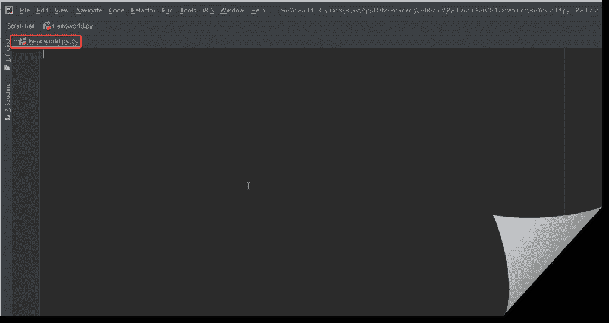
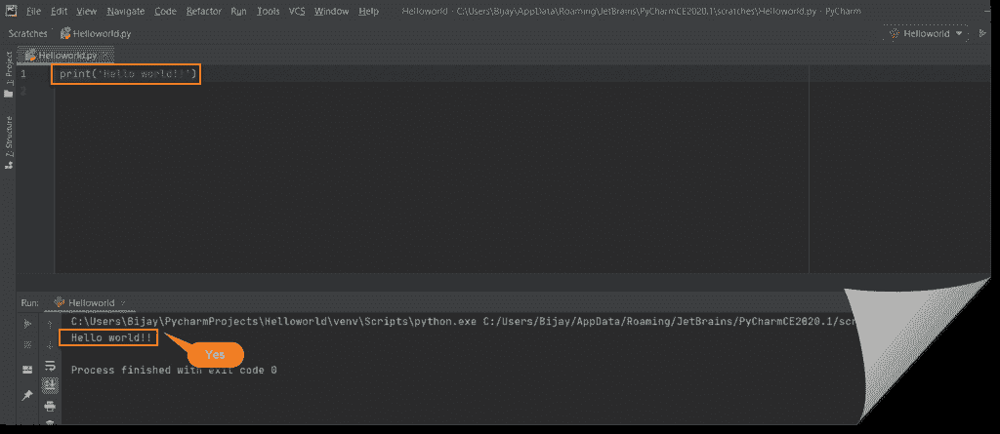
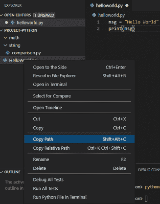

# Python Hello World 程序(逐步使用 Pycharm + Visual Studio 代码)

> 原文：<https://pythonguides.com/python-hello-world-program/>

[](https://sharepointsky.teachable.com/p/python-and-machine-learning-training-course)

在本 python 教程中，我们将使用 Pycharm 和 Visual studio 代码构建我们的第一个传统的 **Python Hello world 程序**。如果你想让[作为初学者](https://pythonguides.com/python-programming-for-the-absolute-beginner/)学习 Python，那么让我们**使用 vscode 和 pycharm 用 Python** 创建一个 hello world 程序。

任何编辑器(Pycharm 或 Visual Studio 代码)，您都可以用它来编写 Python 代码。

这是一个循序渐进的教程，使用 Pycharm 和 Visual Studio 代码用 Python 创建你的第一个 hello world 程序。

如果你想学习 Python 和机器学习，加入 [Python 和机器学习培训班](https://pythonguides.com/python-and-machine-learning-training-course/)。

目录

[](#)

*   [使用 Python 3.8 和 Pycharm 2020 的 Python Hello World 程序](#Python_Hello_World_program_using_Python_38_and_Pycharm_2020 "Python Hello World program using Python 3.8 and Pycharm 2020")
*   [在命令提示符下运行 Python 文件](#Run_your_Python_file_from_the_command_prompt "Run your Python file from the command prompt")
*   [使用 Visual Studio 代码](#Create_a_hello_world_program_in_Python_using_Visual_Studio_Code "Create a hello world program in Python using Visual Studio Code")用 Python 创建一个 hello world 程序
    *   [什么是 Visual Studio 代码？](#What_is_Visual_Studio_Code "What is Visual Studio Code?")
*   [在 Windows 10 中下载并安装 Visual Studio 代码](#Download_and_Install_Visual_Studio_Code_in_Windows_10 "Download and Install Visual Studio Code in Windows 10")
    *   [安装 Visual Studio 代码的 Python 扩展](#Install_Python_Extension_for_Visual_Studio_Code "Install Python Extension for Visual Studio Code")
    *   [使用 Visual Studio 代码用 python 创建 hello world 程序](#Create_hello_world_program_in_python_using_Visual_Studio_Code "Create hello world program in python using Visual Studio Code")
*   [结论](#Conclusion "Conclusion")

## 使用 Python 3.8 和 Pycharm 2020 的 Python Hello World 程序

我已经[安装了 python](https://pythonguides.com/python-download-and-installation/) 版本 3.8.2 和 **Pycharm 版本 2020**1 作为代码编辑器，我们将使用它们来构建第一个程序。

现在我们的 python 安装好了，代码编辑器( `Pycharm` )也安装在我的机器上。两者都是截至 2020 年 4 月的最新版本。让我们开始第一个节目。

**第一步:**

打开 Pycharm 代码编辑器


Python Hello World program

**第二步:**

现在接下来是点击“**创建新项目**按钮。


pycharm hello world

**第三步:**

在这一步中，首先给项目起一个有意义的名字。我给它起了个名字“Helloworld”。您也可以更改您的首选位置。基本解释器将自动填充。现在请点击“创建”按钮。


Python Hello World Program

**第四步:**

现在下面的弹出窗口将会出现，你可以关闭弹出的每日提示窗口。


python hello world pycharm

**第五步:**

现在下面的弹出窗口显示了一些有用的信息。见过一次。其中更重要的一点是，你可以将文件拖放到那里，这样它就可以打开了。


hello world python pycharm

**第六步:**

在这一步中点击**文件**–>–**新建暂存文件**。


Python Hello World Program

**第七步:**

现在从弹出的新暂存文件中选择“ `Python` ”。


hello world program in python using pycharm

**第八步:**

现在看下面一个名为 `scratch.py` 的 python 文件被创建。


hello world in pycharm

**第九步:**

现在给文件起一个有意义的全名。所以我们需要重命名这个文件。右键点击 `Scratch.py` ，选择**重命名文件**。


print hello world in pycharm

**第十步:**

下面会出现重命名弹出框，给一个合适的名字。在本例中，我将名称命名为 Helloworld.py。


Python Hello World Program

**第十一步:**

现在，看到文件名已经被重命名为“Helloworld.py”。所以现在我们的空 python 文件已经准备好了。



python 3.8 hello world

**第十二步:**

现在将下面的代码写入 `Helloworld.py` 文件，然后点击**运行**–>**运行选项**。你也可以使用键盘快捷键 `Alt+Shift+F10` 来运行文件。

```py
Print("Hello world!!")
```


python hello world program

**第十三步:**

糟糕，在执行上面的代码时，它抛出了下面的错误

```py
Traceback (most recent call last):
  File "C:/Users/Bijay/AppData/Roaming/JetBrains/PyCharmCE2020.1/scratches/Helloworld.py", line 1, in <module>
    Print('Hello world!!')
NameError: name 'Print' is not defined
```

任何猜测为什么上述错误。这是因为我们输入了 print 作为 Print(caps P)。正确的应该是 print()。

**注意:** Python 区分大小写。

正确的代码如下所示。

```py
print(Hello world!!)
```

现在输入上面的代码并运行文件。让我们看看发生了什么。现在，如果你注意到这里的运行选项是运行“HelloWorld ”,这意味着运行“文件名”。

现在当我把 Print(caps P)改成 Print()时。如果您看到下面的自动建议框显示打印功能。


pycharm hello world program

现在让我们运行程序。


Python Hello World Program

**第 14 步:**

恭喜，是的，这次我得到了预期的输出，没有任何错误。见下文。



hello world pycharm

*   [Python While 循环示例](https://pythonguides.com/python-while-loop/)

## 在命令提示符下运行 Python 文件

如果您的机器上没有安装 Pycharm，还有一种方法可以从命令提示符下运行 python 文件。

**第一步:**

打开命令提示符，转到 python 文件所在的路径。为此，请使用下面的命令并按回车键。

```py
cd C:\Users\Bijay\AppData\Roaming\JetBrains\PyCharmCE2020.1\scratches
```

注意:C:\ Users \ Bijay \ AppData \ Roaming \ JetBrains \ pycharmce 2020.1 \ scratches 是我的 HelloWorld.py 文件所在的路径。所以我需要去那个路径并执行代码。

**第二步:**

现在输入文件名，即 Helloworld.py，然后按回车键。如下所示，我们得到了预期的输出。


Run your Python file from the command prompt

这就是我们如何在 Pycharm 中使用 Python 创建第一个 hello world 程序的方法。

## 使用 Visual Studio 代码用 Python 创建一个 hello world 程序

现在，让我们看看如何**用 python 创建一个 hello world 程序，**并且，我们还将看到如何在 windows 10 中下载和安装 visual studio 代码。

### 什么是 Visual Studio 代码？

微软提供了一个 Visual Studio 代码的免费开源代码编辑器。它又快又简单。Visual Studio 代码支持所有三种操作系统，如 Windows、Linux 和 macOS。

它有许多内置功能，如 GitHub、调试和嵌入式 Git 控件、语法高亮、代码片段和智能代码完成。此外，您可以根据需要添加扩展来创建 Python 开发环境。

VS 代码是轻量级的，它有许多强大的特性。这就是它在 Python 开发者中流行的原因。Visual studio 代码是一个代码编辑器，可以用于 python 开发。这不仅对 python 有意义，它也支持其他语言。

## 在 Windows 10 中下载并安装 Visual Studio 代码

我们来看看如何**下载安装免费的 visual studio 代码** (VS 代码)。

**第一步**

首先[下载 visual studio 代码](https://code.visualstudio.com/download)。基于操作系统，可以下载 VS 代码。


visual studio code

**第二步**

*   下载后打开 **VS 代码**然后接受协议点击**下一步**。
*   单击“下一步”后，将出现一个默认位置。如果您不想更改默认位置，则点击下一个的**。**


download and install vs code

**第三步**

现在点击**“创建桌面图标”**，以便可以从桌面访问它，然后点击下一步。


visual studio code

**第四步**

之后，点击**安装**按钮。它将开始安装 VS 代码。


visual studio code for python

**第五步**

最后，安装完成，默认情况下, **Launch Visual Studio 代码**将带有复选标记。点击**完成**按钮，visual studio 代码将打开。


visual studio code for python

**第六步**

现在你可以看到 Visual Studio 代码已经在 windows 10 上启动了。


Python Extension for Visual Studio Code

### 安装 Visual Studio 代码的 Python 扩展

要安装扩展，打开左侧的扩展菜单，在搜索空间**“Python”**上写。

然后选择弹出的第一个，可以点击**安装**对应的扩展。


Python Extension for Visual Studio Code

阅读[人工智能完全指南](https://pythonguides.com/complete-guide-to-artificial-intelligence/)

### 使用 Visual Studio 代码用 python 创建 hello world 程序

现在，我们将看到如何用 vs 代码在 python 中**创建 hello world 程序。**

打开 visual studio 代码。然后**档**->-**新档**。

然后在文件中编写以下代码:

```py
msg = "Hello World"
print(msg)
```

然后保存文件 Ctrl+S 然后用**给一个文件名。py** 扩展并将类型保存为 Python。


visual studio code python hello world

该文件将如下所示:


hello world python visual studio code

要运行代码，**在编辑器窗口的任意位置右键单击**并选择**在终端**中运行 Python 文件。


vscode python hello world

**输出:**

您可以在终端中看到如下输出:


python hello world visual studio code

你也可以使用命令行手动运行代码，只需在终端中编写文件的 `python` 和**路径**。



vs code python hello world

下面你可以看到，我写完 python 后复制了文件的**路径。**

```py
python E:\project-python\HelloWorld.py
```


create hello world program in python

现在，如果你输入，你将会看到**输出**。


python hello world vscode

我们可以按照上面的步骤**用 visual studio 代码**用 python 创建 hello world 程序。以及如何**在 windows 10** 中下载并安装 Visual Studio 代码，同时我们也看到了如何**在 vs 代码**中安装 Python 扩展。

您可能会喜欢以下 Python 教程:

*   [Python 将变量写入文件+示例](https://pythonguides.com/python-write-variable-to-file/)
*   [Python 中的排序算法](https://pythonguides.com/sorting-algorithms-in-python/)
*   [在 Python 中使用 JSON 数据](https://pythonguides.com/json-data-in-python/)
*   [Python GUI 编程](https://pythonguides.com/python-gui-programming/)
*   [面向对象编程 python](https://pythonguides.com/object-oriented-programming-python/)
*   [Python 中的构造函数](https://pythonguides.com/constructor-in-python/)
*   [Python 匿名函数(Lambda 函数)](https://pythonguides.com/python-anonymous-function/)
*   [Python 访问修饰符+示例](https://pythonguides.com/python-access-modifiers/)
*   Python 中的[函数](https://pythonguides.com/function-in-python/)

## 结论

我希望这篇文章能帮助你用 Python 创建一个 hollo world 程序。

*   用 Python 创建一个 hello world 程序
*   使用 python 3.8 和 Pycharm 2020 的 Python Hello World 程序
*   从命令提示符运行 Python 文件
*   使用 Visual Studio 代码用 Python 创建一个 hello world 程序
*   Visual studio 代码下载和安装
*   为 Visual Studio 代码安装 Python 扩展

[Bijay Kumar](https://pythonguides.com/author/fewlines4biju/)

Python 是美国最流行的语言之一。我从事 Python 工作已经有很长时间了，我在与 Tkinter、Pandas、NumPy、Turtle、Django、Matplotlib、Tensorflow、Scipy、Scikit-Learn 等各种库合作方面拥有专业知识。我有与美国、加拿大、英国、澳大利亚、新西兰等国家的各种客户合作的经验。查看我的个人资料。

[enjoysharepoint.com/](https://enjoysharepoint.com/)[](https://www.facebook.com/fewlines4biju "Facebook")[](https://www.linkedin.com/in/fewlines4biju/ "Linkedin")[](https://twitter.com/fewlines4biju "Twitter")