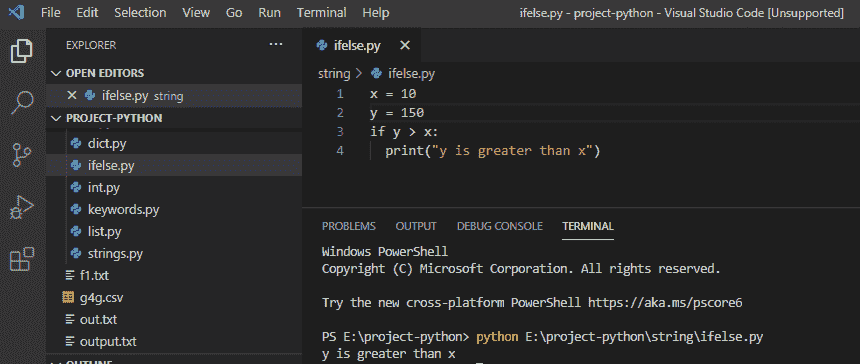
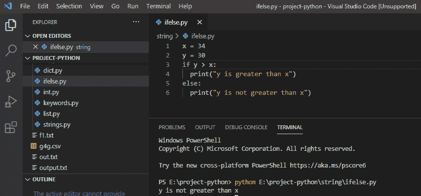
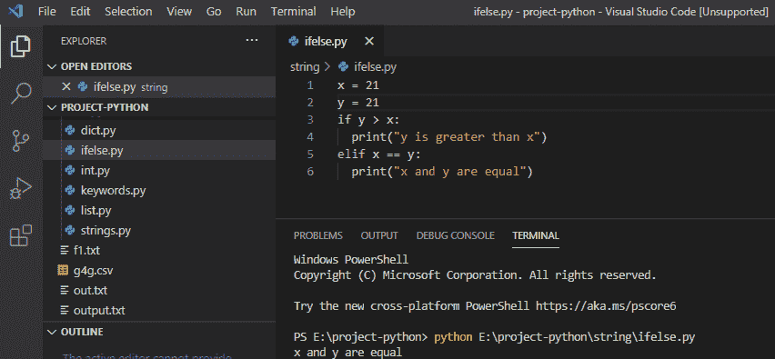
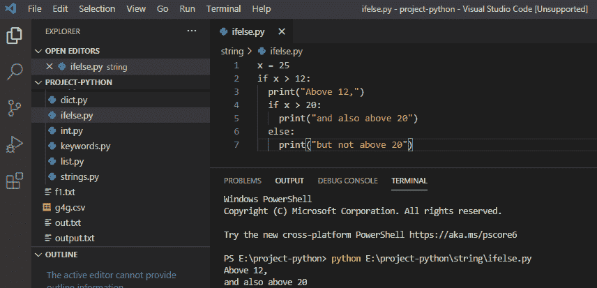

# Python if else 示例

> 原文：<https://pythonguides.com/python-if-else/>

[](https://sharepointsky.teachable.com/p/python-and-machine-learning-training-course)

在这个 [Python 教程](https://pythonguides.com/python-download-and-installation/)中，让我们讨论一下 Python 中的 if else 语句，以及 **if else 语句在 Python** 中是如何工作的。

我们还将检查:

*   Python if 语句
*   Python else 语句
*   Python elif 语句
*   Python 嵌套 if 语句

目录

[](#)

*   [Python if 语句](#Python_if_statement "Python if statement")
*   [Python else 语句](#Python_else_statement "Python else statement")
*   [Python elif 语句](#Python_elif_statement "Python elif statement")
*   [Python 嵌套 if 语句](#Python_nested_if_statement "Python nested if statement")

## Python if 语句

在 python 中， **if 语句**用于检查语句是真还是假，只有当语句为真时才运行代码。

**举例:**

```py
x = 10
y = 150
if y > x:
print("y is greater than x")
```

编写上述代码(python if 语句)后，您将打印这些代码，然后输出将显示为**“y 大于 x”**。这里，if 语句检查条件，如果条件为真，则运行代码。

可以参考下面 python if 语句的截图。



Python if statement

这是 Python if 语句的一个简单例子。

你可以查看一下，[如何使用 Python](https://pythonguides.com/pandas-drop/) 中的 Pandas drop()函数。

## Python else 语句

在 python 中， **else 语句**包含当 if 条件语句为假时执行的代码块。

**举例:**

```py
x = 34
y = 30
if y > x:
print("y is greater than x")
else:
print("y is not greater than x")
```

写完上面的代码(python else 语句)后，你要打印的代码输出将显示为**“y 不大于 x”**。这里，当 if 条件为假时，else 语句执行，然后 else 语句执行。

你可以参考下面 python else 语句的截图。



Python else statement

## Python elif 语句

在 python 中， **elif 语句**用于检查多个表达式，如果前面的条件不为真，那么试试这个。

**举例:**

```py
x = 21
y = 21
if y > x:
print("y is greater than x")
elif x == y:
print("x and y are equal")
```

在编写完上述代码(python elif 语句)后，您将打印这些代码，然后输出将显示为**“x 和 y 相等”**。这里，当前面的条件不为真时，执行 elif 语句，然后执行 elif 语句。

你可以参考下面 python elif 语句的截图。



Python elif statement

## Python 嵌套 if 语句

在 python 中，我们使用嵌套的 if 语句来检查第一条语句的计算结果是否为真，以及嵌套语句的计算结果是否为真。

**举例:**

```py
x = 25
if x > 12:
print("Above 12,")
if x > 20:
print("and also above 20")
else:
print("but not above 20")
```

在编写了上面的代码(python 嵌套 if 语句)之后，您将打印这些代码，然后输出将显示为大于 12 的**"以及大于 20 的"**。这里，我们在 if 语句中有 if 语句。

可以参考下面 python 嵌套 if 语句的截图。



Python nested if statement

您可能会喜欢以下 Python 教程:

*   [Python For 循环示例](https://pythonguides.com/python-for-loop/)
*   [Python 中的阿姆斯特朗数](https://pythonguides.com/armstrong-number-in-python/)
*   [Python 读取 excel 文件并在 Python 中写入 Excel](https://pythonguides.com/python-read-excel-file/)
*   [在 Python 中创建一个元组](https://pythonguides.com/create-a-tuple-in-python/)
*   [Python 创建空集](https://pythonguides.com/python-create-empty-set/)
*   [Python 关键字与示例](https://pythonguides.com/python-keywords/)
*   [Python While 循环示例](https://pythonguides.com/python-while-loop/)
*   [Python 中的字符串方法及示例](https://pythonguides.com/string-methods-in-python/)
*   [名称错误:Python 中没有定义名称](https://pythonguides.com/nameerror-name-is-not-defined/)

在本 python 教程中，我们学习了 Python 中的各种 if else 语句，例如:

*   Python if 语句
*   Python else 语句
*   Python elif 语句
*   Python 嵌套 if 语句

[Bijay Kumar](https://pythonguides.com/author/fewlines4biju/)

Python 是美国最流行的语言之一。我从事 Python 工作已经有很长时间了，我在与 Tkinter、Pandas、NumPy、Turtle、Django、Matplotlib、Tensorflow、Scipy、Scikit-Learn 等各种库合作方面拥有专业知识。我有与美国、加拿大、英国、澳大利亚、新西兰等国家的各种客户合作的经验。查看我的个人资料。

[enjoysharepoint.com/](https://enjoysharepoint.com/)[](https://www.facebook.com/fewlines4biju "Facebook")[](https://www.linkedin.com/in/fewlines4biju/ "Linkedin")[](https://twitter.com/fewlines4biju "Twitter")