# Python 输入和 raw_input 函数

> 原文：<https://pythonguides.com/python-input-and-raw_input-function/>

[](https://sharepointsky.teachable.com/p/python-and-machine-learning-training-course)

在本 [python 教程中，](https://pythonguides.com/python-hello-world-program/)您将了解到 **Python input()和 raw_input()函数，input()和 raw_input()** 之间的区别以及示例，我们还将看到 **python 名称错误:名称 raw_input 未定义。**

目录

[](#)

*   [为什么我们在 python 中需要 input()和 raw_input()函数？](#Why_we_need_input_and_raw_input_function_in_python "Why we need input() and raw_input() function in python?")
*   [Python 输入()函数](#Python_input_function "Python input() function")
*   [Python raw_input()函数](#Python_raw_input_function "Python raw_input() function")
*   [python 中 input()和 raw_input()函数的区别](#Difference_between_input_and_raw_input_function_in_python "Difference between input() and raw_input() function in python")
*   [Python raw_input 示例](#Python_raw_input_example "Python raw_input example")
*   [Python raw_input 超时](#Python_raw_input_timeout "Python raw_input timeout")
*   [Python raw_input 默认值](#Python_raw_input_default_value "Python raw_input default value")
*   [Python raw_input 转义键](#Python_raw_input_escape_key "Python raw_input escape key")
*   [Python raw_input 不工作](#Python_raw_input_not_working "Python raw_input not working")
*   [Python raw_input argv](#Python_raw_input_argv "Python raw_input argv")
*   [Python raw_input 隐藏密码](#Python_raw_input_hide_password "Python raw_input hide password")
*   [Python 名称错误:名称 raw_input 未定义](#Python_NameError_name_raw_input_not_defined "Python NameError: name raw_input not defined")

## 为什么我们在 python 中需要 input()和 raw_input()函数？

主要原因是交互式的用户友好代码。它使代码具有交互性，而不是硬编码。我们使用 `input()` 和 `raw_input()` 函数根据用户自己的值接受用户输入。

## Python 输入()函数

**python input()函数**从用户处获取值。调用这个函数来告诉程序停止并等待用户输入值。它读取输入并返回 python 类型，如 int、list、tuple 等。

**举例:**python 2 中的程序

```py
value = input("Enter your name:")
print(type(value)
print(value)
```

写完上面的代码(python input()函数)，你将打印出 `" value "` ，然后输出将显示为**"输入你的名字:娜萨< class 'str' >娜萨"**。这里，它要求用户输入值，然后读取输入并返回用户输入的输入类型。我们不需要显式地改变 python2 中的变量类型。

可以参考下面截图 **python input()函数**

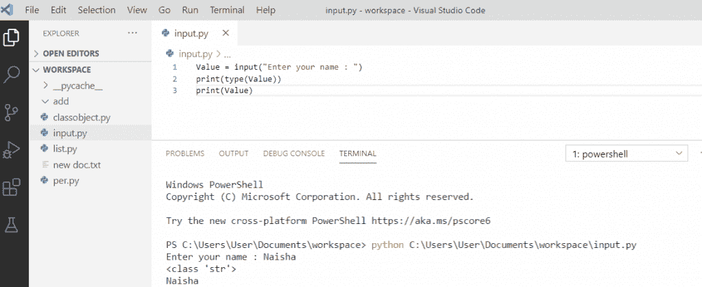

Python input() function

在 python 2.x 和 3.x 版本中都使用了 **Python input()函数**。在 Python 3.x 中，input 函数明确地将您给定的输入转换为字符串类型，否则在 Python 3 中，输入函数存储的值总是字符串。但是在 python 2.x 中，函数接受值，您输入的输入将照原样接受，而不修改其类型。

**举例:**python 3 中的程序

```py
value = input("Enter the roll: ")
value = int(value)
print(type(value)
print(value)
```

写完上面的代码(python input()函数)后，一旦你将打印 `" value "` 那么输出将显示为**"输入你的掷骰子:23065 <类' int' > 23065 "** 。这里，它要求用户输入 roll，然后它读取输入并返回用户输入的输入类型。此外，我们将变量的类型指定为整数。

可以参考下面截图 **python input()函数**

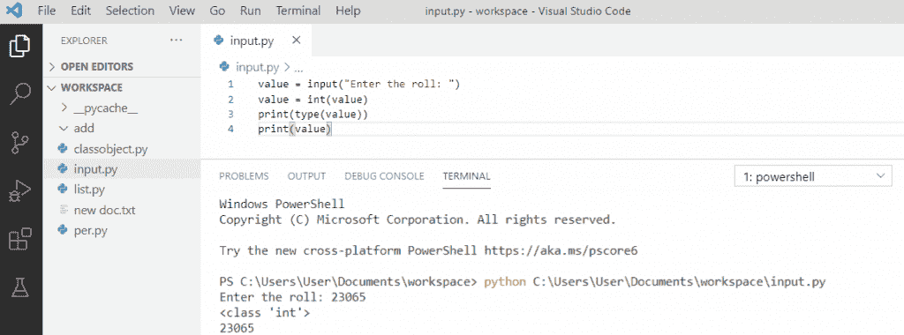

Python input() function

## Python raw_input()函数

**Python raw_input()函数**读取输入并返回一个字符串。它用于从用户那里获取价值。该输入函数仅在 Python 2.x 版本中使用。

Python 2.x 有两个函数从用户那里获取值。第一个是 input，第二个是 raw_input 函数。raw_input()函数类似于 python3 中的 input()函数。

**举例:**python 2 中的程序

```py
value = raw_input("Enter your name: ")
print(type(value))
print(value)
```

在输出中，你可以看到它的类型是一个字符串。对于 `raw_input()` 函数，存储的值的类型始终是字符串。

**输出:**

```py
Enter your name: Trisha
<type 'str'>
Trisha
```

在这里，在 `python2` 中，我们将看到我们是否想要整数形式的输出，然后，我们必须使用 `raw_input()` 函数中的 `"int"` 将类型转换为整数。

**举例:**

```py
value = raw_input("Enter the roll: ")
value = int(value)
print(type(value)
print(value)
```

这里，值 `"20564"` 取自用户，但是我们使用 `int()` 将类型转换为整数。一旦你打印出**“值”**，你将得到变量及其类型。您可以看到下面的输出。

**输出:**

```py
Enter the roll: 20564
<type 'int'>
20564
```

## python 中 input()和 raw_input()函数的区别

让我们讨论一下 python 中 input()和 raw_input()函数的**区别。**

*   **raw_input 函数**是在 python 2 中构建的。但是在 python3 中我们没有。
*   **raw_input 函数**的工作方式与 python3 中的 input 函数相同。
*   在 python 2 中， **input()函数**首先用于获取 raw_input()，然后在其中执行 eval()。
*   在 python 2 中， `raw_input()` 返回一个字符串，而 input()返回一个求值结果。而在 python 3 中，input()返回一个字符串，但可以转换成任何类型。

## Python raw_input 示例

*   让我们看看如何在 Python 中使用 **input 和 raw_input 函数。**
*   在 python 中有两个从用户那里获取输入的函数，即 input 和 raw_input 函数。这两个函数都用于获取用户的输入。
*   在 python 2 版本中使用 raw_input()函数，在 Python 3 版本中使用 input()函数

**举例:**

以下是 raw_input 函数的示例

```py
new_val = raw_input("Enter name:") # raw_input function

print(type(new_val)) #python version 2.7
print(new_val)
```

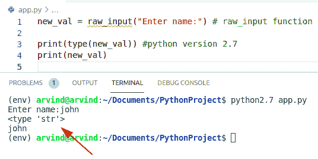

Python raw_input function

## Python raw_input 超时

在这里，我们可以检查我们是否需要用户输入，我们将使用 input()函数。在这个例子中，我们将给出条件，如果没有输入，那么它将显示结果“超时”。

**源代码:**

```py
import sys
from select import select

raw_timeout = 5
print ("Enter the string:",)
new_lis, _, _ = select([sys.stdin], [], [], raw_timeout)
if new_lis:
    val = sys.stdin.readline()
    print (val)
else:
    print ("No string.....timeout")
```

首先在上面的代码中，我们将导入一个“sys”库，因为这是从用户那里获取输入的标准方式。现在创建一个变量**‘raw _ time out’**，并给它们赋值。

下面是以下给定代码的执行过程

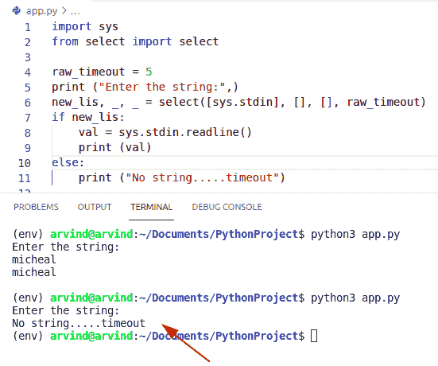

Python raw_input timeout

## Python raw_input 默认值

要获取 raw_input 并设置默认值，我们可以使用 try-except 块和 import readline 模块。在本例中，用户按下**‘enter’**关键字，直到 Python 编程’值存储在**‘最佳语言’**变量中。

**举例:**

```py
 import readline
def new_input(new_tex, fill_val=''):
   readline.set_startup_hook(lambda: readline.insert_text(fill_val))
   try:
      return raw_input(new_tex)
   finally:
      readline.set_startup_hook()

new_def_val = "Python Programming"
output = new_input("language: ", new_def_val)
print("best langauge: " + output)
```

下面是以下给定代码的执行过程

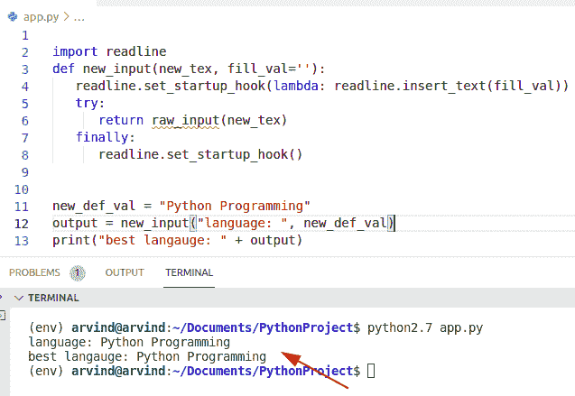

Python raw_input default value

## Python raw_input 转义键

*   在本例中，用户输入一个字符并按下“enter”关键字。现在，我将允许用户通过简单地按下键盘上的**‘escape’**键来退出输出。
*   为了完成这项任务，我们将导入一个**‘pynput’**模块。该模块允许用户控制和监控输入设备。它包含像键盘和监听器这样的子包。

```py
import pynput
from pynput import keyboard

def initialize():
     print("Enter name: Java")
def on_press(new_key):
    if new_key == keyboard.Key.esc:

        return False
    else:
         initialize()

with keyboard.Listener(
        on_press=on_press) as listener:
    listener.join()
```

**输出:**

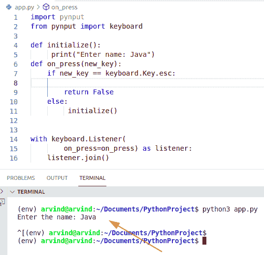

Python raw_input escape key

## Python raw_input 不工作

*   在 Python 3 版本中，Raw_input 不起作用。您可以使用 input()函数代替 raw_input()。input 函数具有相同的功能来接受用户的输入。
*   如果您正在使用 raw_input()函数，那么请安装 Python 的先前版本，即 python 2.7。

**代码:**

```py
new_variable = raw_input("Enter name:") 

print(type(new_variable)) # python3 version
print(new_variable)
```

**实施:**

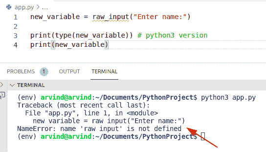

Python raw_input not working

正如您所看到的，输出中有一条错误消息，这意味着 raw_ input 在 Python 3 中不起作用。

**解决方案:**

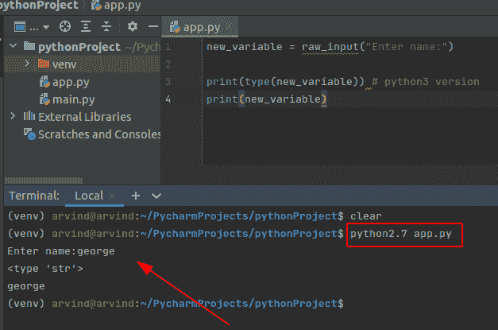

Solution for raw_input not working in python

## Python raw_input argv

*   让我们看看如何在 Python 中使用 argv。基本上，argv 是一个命令行参数列表。为了计算脚本中参数的数量，我们可以使用这个函数。

**举例:**

```py
from sys import argv

new_script, emp_name, emp_id, emp_code = argv,raw_input("Enter the employee name: "), raw_input("Enter the employee id: "), raw_input("Enter the employee code: ")

print ("script is called:", new_script)
print ("first value is:", emp_name)
print ("second value is:", emp_id)
print ("third value is:", emp_code)
```

下面是以下给定代码的执行过程

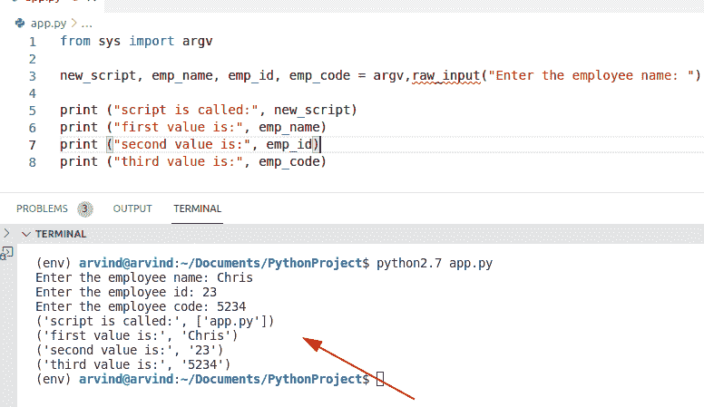

Python raw_input argv

## Python raw_input 隐藏密码

让我们看另一个 **Python raw_input 隐藏密码**的例子。

**程序:**

```py
res = True

while res:
    print("""(a).close!
                   (b). numbers!""")

    res=raw_input("""Enter a Value: """)

    if res == "a":

        exit()
    elif res == "b":

        new_pas=raw_input("""Enter the Password: """)

        if new_pas == "Pythonguides":

            print("""(a). password (b).close""")

            paswr=raw_input ("""Again Enter a Value: """)

            if paswr == "a":
                print ("""Password Is Spguides""")
                import time
                time.sleep(1)
                exit()

            elif paswr == "b":
                exit()

            else:
                print("""You Have Entered the Incorrect value. Not executing the Programm""")
                import time
                time.sleep(1)
                exit()

        else:
                print("""You Have Entered the Incorrect Password. Not executing the Programm""")
                import time
                time.sleep(1)
                exit()
```

下面是以下代码的截图

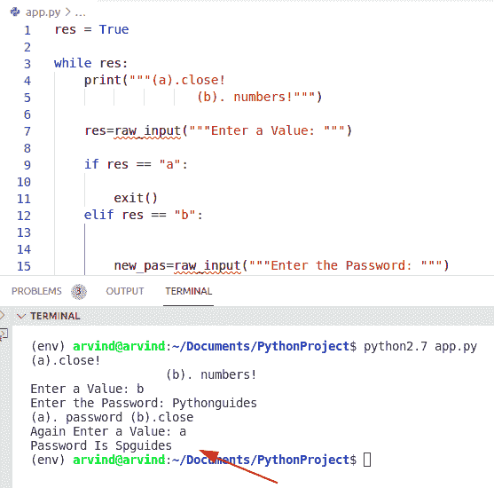

Python raw_input hide password

## Python 名称错误:名称 raw_input 未定义

我们得到这个**名` `错误**是因为 python 版本。在 python3.x 中， `input()` 代替了 `raw_input()` ，用于控制台的输入。所以我们得到这个错误**名称‘raw _ input’没有在 python3 中定义**。

**举例:**

```py
value = raw_input("Enter the name: ")
print(type(value))
print(value)
```

写完上面的代码后(python nameerror: name raw_input 未定义)，你会打印出**“value”**然后错误会显示为**“name error:name raw _ input 未定义”**。这里，我们得到这个错误，因为它在 python3 中没有 raw_input()。

您可以参考下面的 python 名称截图错误:名称 raw_input 未定义

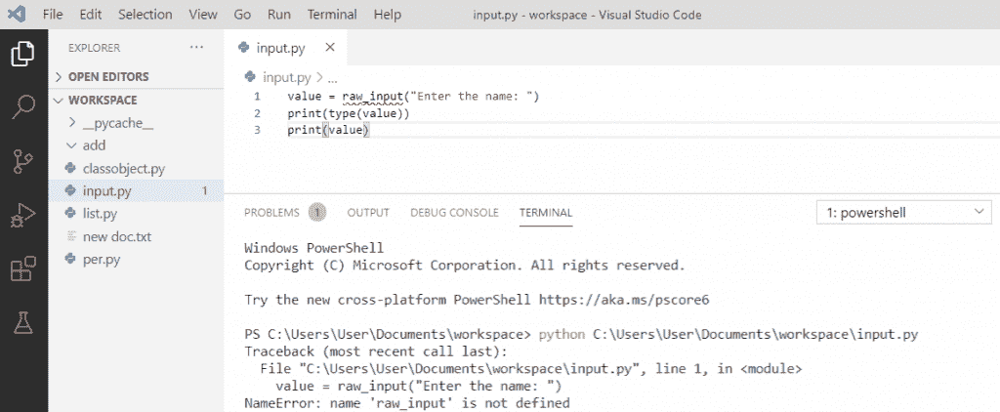

Python NameError: name raw_input not defined

为了解决这个错误，我们可以使用 `input()` 代替 python3 中的 raw_input()来避免这个错误。否则，如果你想使用 `raw_input()` 函数，我们有 python2。

**举例:**

```py
value = input("Enter the name: ")
print(type(value))
print(value)
```

写完上面的代码后，一旦你打印出 `" value "` ，那么输出将显示为一个**"输入名字:John < class 'str' > John "** 。这里，错误是通过使用 python3 中的**“input()”**函数解决的，该函数的工作方式与 python2 中的 raw_input()类似。

可以参考下面截图名称 raw_input 未定义

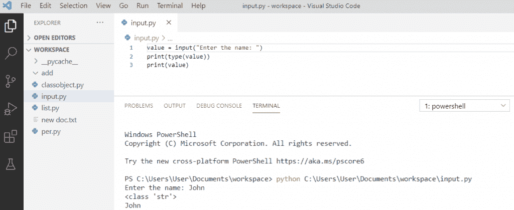

Python NameError: name raw_input not defined

您可能会喜欢以下 Python 教程:

*   [Python 中的排序算法](https://pythonguides.com/sorting-algorithms-in-python/)
*   [在 Python 中使用 JSON 数据](https://pythonguides.com/json-data-in-python/)
*   [使用 Python 发送电子邮件](https://pythonguides.com/send-email-using-python/)
*   [Python 访问修饰符+示例](https://pythonguides.com/python-access-modifiers/)
*   [Python 读取 CSV 文件并写入 CSV 文件](https://pythonguides.com/python-read-csv-file/)
*   [Python 数组与示例](https://pythonguides.com/python-array/)
*   [python 中的哈希表](https://pythonguides.com/hash-table-in-python/)

在本教程中，我们学习了**、Python input()和 raw_input()函数**、input()和 raw_input() 之间的关键**区别以及以下主题:**

1.  python 中为什么需要 input()和 raw_input()函数？
2.  Python 输入()函数
3.  Python raw_input()函数
4.  python 中 input()和 raw_input()函数的区别
5.  Python raw_input 示例
6.  Python 原始输入超时
7.  Python raw_input 默认值
8.  Python raw_input 转义键
9.  Python 原始输入不起作用
10.  Python raw_input argv
11.  Python 原始输入隐藏密码
12.  Python 名称错误:未定义名称 raw_input

[Bijay Kumar](https://pythonguides.com/author/fewlines4biju/)

Python 是美国最流行的语言之一。我从事 Python 工作已经有很长时间了，我在与 Tkinter、Pandas、NumPy、Turtle、Django、Matplotlib、Tensorflow、Scipy、Scikit-Learn 等各种库合作方面拥有专业知识。我有与美国、加拿大、英国、澳大利亚、新西兰等国家的各种客户合作的经验。查看我的个人资料。

[enjoysharepoint.com/](https://enjoysharepoint.com/)[](https://www.facebook.com/fewlines4biju "Facebook")[](https://www.linkedin.com/in/fewlines4biju/ "Linkedin")[](https://twitter.com/fewlines4biju "Twitter")