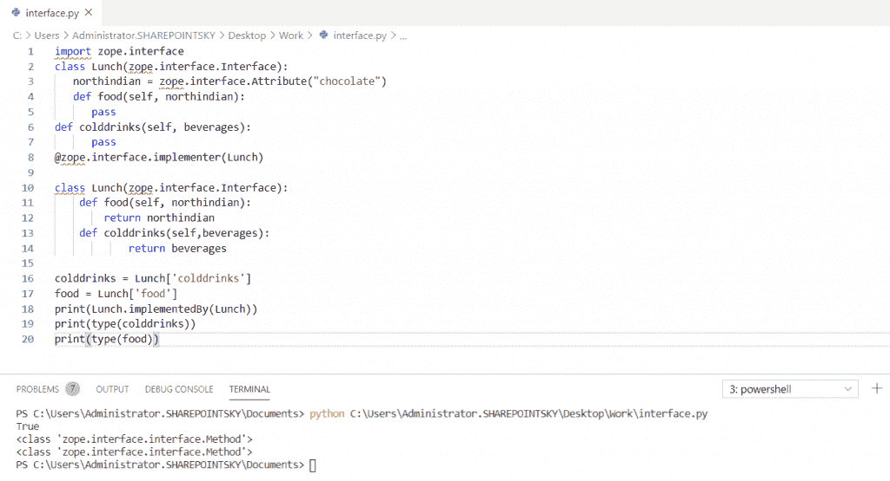
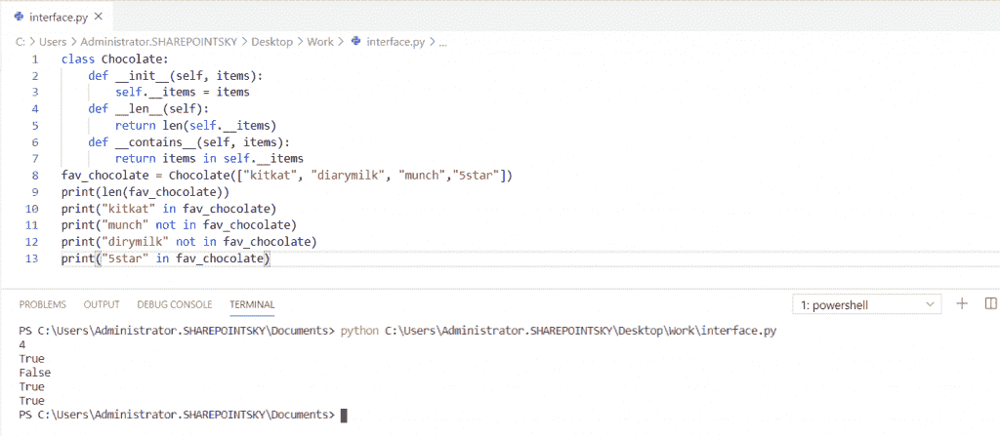
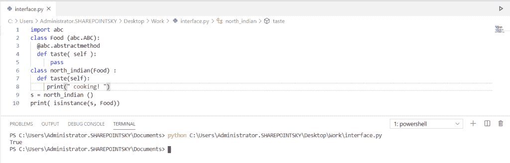
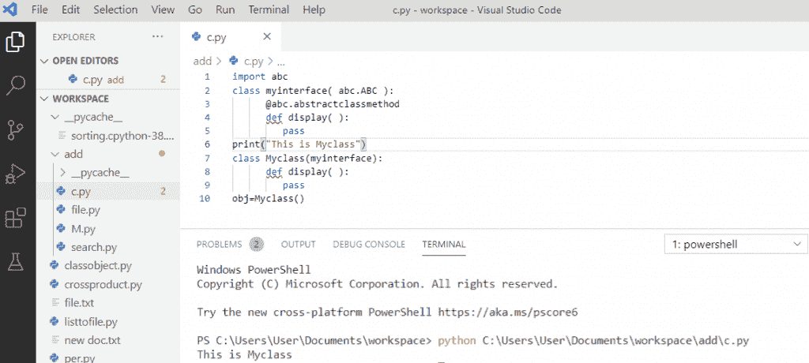
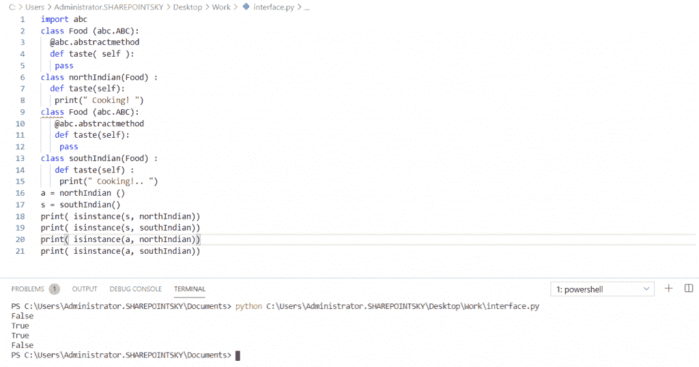

# Python 接口介绍

> 原文：<https://pythonguides.com/python-interface/>

[](https://sharepointsky.teachable.com/p/python-and-machine-learning-training-course)

在这个 [Python 教程](https://pythonguides.com/python-programming-for-the-absolute-beginner/)中，我们将讨论 **python 接口**，并且我们将通过例子检查什么是 Python 中的接口。让我们学习:

*   Python 中的接口是什么？
*   如何用 Python 创建接口？
*   Python 中的正式和非正式接口是什么？
*   Python 接口示例
*   Python 接口 vs 抽象类

目录

[](#)

*   [什么是接口？](#What_is_an_Interface "What is an Interface?")
*   [如何在 Python 中声明接口](#How_to_declare_an_interface_in_Python "How to declare an interface in Python")
*   [创建一个 Python 接口](#Create_a_Python_interface "Create a Python interface")
*   [python 中的非正式接口](#Informal_interface_in_python "Informal interface in python")
    *   [python 中的形式接口(ABCs)](#Formal_interface_in_pythonABCs "Formal interface in python(ABCs)")
*   [Python 接口示例](#Python_interface_examples "Python interface examples")
*   [Python 多接口](#Python_multiple_interfaces "Python multiple interfaces")
*   [Python 接口 vs 抽象类](#Python_interface_vs_abstract_class "Python interface vs abstract class")

## 什么是接口？

*   接口是应该由实现类提供的方法签名的集合。
*   接口包含本质上抽象的方法。抽象方法将只有声明，因为没有实现。
*   python 中的接口是使用 python 类定义的，是 interface 的子类。作为所有接口的父接口的接口。
*   实现将由继承接口的类来完成。Python 中的接口与 Java、C#或 C++等其他语言略有不同。
*   实现接口是编写有组织的代码的一种方式。

让我们用几个例子来理解一下 **Python 接口**。

## 如何在 Python 中声明接口

在这里，我们将看到如何在 Python 中声明**接口模块**。

语法:

```py
class MyInterface(zope.interface.Interface)
```

*   首先，我们将**导入 zope.interface** 模块。
*   zope.interface 是一个模块，用于在 python 中实现对象接口。
*   zope.interface 库是当事情不清楚时的出路。
*   接口充当设计类的蓝图。这里， **@zope.interface.implementer(午餐)**是使用类中的 implementer decorator 实现的。
*   这个包直接导出属性和接口。
*   为了克服接口**的不确定性，实现了 zope 模块**。

implementation by(class)–该函数返回一个布尔值。如果这个类实现了这个接口，它将导致**真**否则**假**。

示例:

```py
import zope.interface 
class Lunch(zope.interface.Interface): 
	northindian = zope.interface.Attribute("chocolate")
	def food(self, northindian): 
		pass
def colddrinks(self, beverages): 
		pass
@zope.interface.implementer(Lunch) 

class Lunch(zope.interface.Interface): 
    def food(self, northindian):
        return northindian
    def colddrinks(self,beverages):
            return beverages

colddrinks = Lunch['colddrinks'] 
food = Lunch['food']
print(Lunch.implementedBy(Lunch))
print(type(colddrinks))
print(type(food))
```

在这里，我们可以看到该类是在接口中实现的。因此，布尔值**真**被返回。同样，我们可以看到两次返回 **<类‘Zope . interface . interface . method’>**的输出，因为我在一个类中定义了两个函数 `def food` 和 `def colddrinks` 。

下图显示了输出:



Python interface module

## 创建一个 Python 接口

在 python 中有两种方法来创建和实现接口

*   非正式界面
*   正式接口

## python 中的非正式接口

Python 中的非正式接口是一个类。它定义了可以被重写但不强制执行的方法。python 中的**非正式接口被称为协议，因为它是非正式的，不能正式实施。用于执行某些操作的常用方法有:**

1.  _ _ ITER _ _–此方法返回对象的迭代器。
2.  _ _ len _ _–此方法返回字符串、列表、字典、元组的长度。
3.  _ _ contain _ _–此方法用于检查它是否包含另一个字符串。

示例:

```py
class Chocolate:
    def __init__(self, items):
        self.__items = items
    def __len__(self):
        return len(self.__items)
    def __contains__(self, items):
        return items in self.__items
fav_chocolate = Chocolate(["kitkat", "diarymilk", "munch","5star"])
print(len(fav_chocolate))
print("kitkat" in fav_chocolate)
print("munch" not in fav_chocolate)
print("dirymilk" not in fav_chocolate)
print("5star" in fav_chocolate)
```

*   在这个例子中，我实现了 __len__ 和 __contain__。我们可以直接在 chocolate 实例上使用 len()函数，然后我们必须检查一个条目是否出现在列表中。
*   在运算符中使用**，`print(len(fav _ chocolate))`用于查找列表的长度。**
*   在这里，我们可以看到它返回一个**布尔值**。如果项目出现在列表中，它将返回 true，否则将返回 false。下面的屏幕截图显示了输出:



Informal interface in Python

### python 中的形式接口(ABCs)

在这里，我们可以看到 python 中的**形式接口。**

*   正式接口是正式实施的接口。为了创建一个正式的接口，我们需要使用 ABCs(抽象基类)。
*   ABCs 的解释是，我们定义了一个本质上是抽象的类，我们也将基类上的方法定义为抽象方法。
*   我们从基类派生的任何对象都必须实现这些方法。
*   在这个例子中，我已经**导入了一个` `模块 abc** 并定义了一个食物类。 **@abc.abstractmethod** 是一个指示抽象方法的装饰器，用于声明属性的抽象方法。
*   我使用 def 关键字定义了一个函数 `def taste` ，通过使用 `self` 关键字我们可以访问该类的属性和方法。
*   并且，我还定义了一个子类为 `class north_indian` ，然后从 food 类打印一个实例。pass 语句用作占位符。

示例:

```py
import abc
class Food (abc.ABC):
  @abc.abstractmethod
  def taste( self ):
      pass
class north_indian(Food) :
  def taste(self):
     print(" Cooking! ")
s = north_indian ()
print( isinstance(s, Food))
```

下面的屏幕截图显示了输出:

在这个输出中，我们可以看到输出了一个布尔值。只有当实例出现在类中时才返回 true，否则返回 false。



Formal interface in python(ABCs)

## Python 接口示例

在这里，我们将看到派生类的代码如何定义一个抽象方法。所以，我们有了**导入的 abc** 模块，我们有了类名 **myinterface(abc。ABC)** 。

**举例:**

```py
import abc
class myinterface(abc.ABC):
      @abc.abstractclassmethod
      def display():
        pass
print("This is Myclass")
class Myclass(myinterface):
      def display():
        pass
obj=Myclass()
```

这里， `obj = Myclass()` 被调用，它将输出打印为“这是我的类”。你可以参考下面的 python 接口例子截图。



Python interface examples

## Python 多接口

现在，我们可以在 Python 中看到**多个接口。**

在下面的例子中，我们必须**导入** `abc` 模块，然后我们可以将类初始化为 `Food` 并将子类初始化为 `northIndian()` 和 **southIndian()。**

示例:

```py
import abc
class Food (abc.ABC):
  @abc.abstractmethod
  def taste( self ):
   pass
class northIndian(Food) :
  def taste(self):
   print(" Cooking! ")
class Food (abc.ABC):
   @abc.abstractmethod
   def taste(self):
    pass
class southIndian(Food) :
   def taste(self) :
    print(" Cooking!.. ")
a = northIndian ()
s = southIndian()
print( isinstance(s, northIndian))
print( isinstance(s, southIndian))
print( isinstance(a, northIndian))
print( isinstance(a, southIndian))
```

这里，我们可以在输出中看到 false，因为**实例 s** 被分配给**南印度**，但是在打印语句中，它被分配为 **(s，北印度)**。我们可以参考下面的截图:



Python multiple interfaces

## Python 接口 vs 抽象类

让我们了解一下 **Python 接口与抽象类**的区别。

| **Python 接口** | **Python 抽象类** |
| 接口是该对象的一组方法和属性。 | 我们可以使用一个抽象基类来定义和实现一个接口。 |
| 接口的所有方法都是抽象的 | 抽象类可以有抽象方法，也可以有具体方法。 |
| 如果不同的对象需要实现不同的特性，我们就使用接口。 | 当所有对象都有一些共同的特征时，就使用抽象类。 |
| 与抽象类相比，接口速度较慢。 | 抽象类更快。 |

您可能会喜欢以下 Python 教程:

*   [如何在 Python 中把字符串转换成日期时间](https://pythonguides.com/convert-a-string-to-datetime-in-python/)
*   [Python 中的转义序列](https://pythonguides.com/escape-sequence-in-python/)
*   [Python 列表理解λ](https://pythonguides.com/python-list-comprehension/)
*   [Python 线程和多线程](https://pythonguides.com/python-threading-and-multithreading/)
*   [如何将 Python 角度转换为弧度](https://pythonguides.com/python-degrees-to-radians/)
*   [Python 比较运算符](https://pythonguides.com/python-comparison-operators/)
*   [Python 命名空间教程](https://pythonguides.com/python-namespace-tutorial/)
*   [Python 中的链表](https://pythonguides.com/linked-lists-in-python/)

在本 Python 教程中，我们学习了 **Python 接口**。此外，我们还讨论了以下主题:

*   什么是接口？
*   如何在 Python 中声明接口
*   如何在 Python 中创建接口
*   Python 接口示例
*   Python 多接口
*   Python 接口 vs 抽象类

[Bijay Kumar](https://pythonguides.com/author/fewlines4biju/)

Python 是美国最流行的语言之一。我从事 Python 工作已经有很长时间了，我在与 Tkinter、Pandas、NumPy、Turtle、Django、Matplotlib、Tensorflow、Scipy、Scikit-Learn 等各种库合作方面拥有专业知识。我有与美国、加拿大、英国、澳大利亚、新西兰等国家的各种客户合作的经验。查看我的个人资料。

[enjoysharepoint.com/](https://enjoysharepoint.com/)[](https://www.facebook.com/fewlines4biju "Facebook")[](https://www.linkedin.com/in/fewlines4biju/ "Linkedin")[](https://twitter.com/fewlines4biju "Twitter")