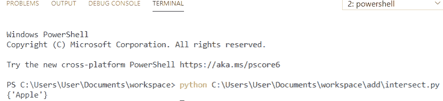
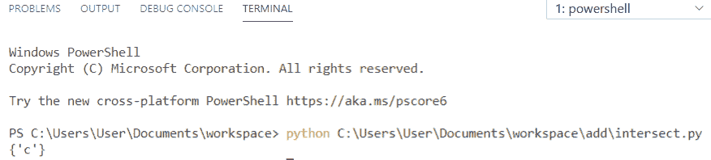
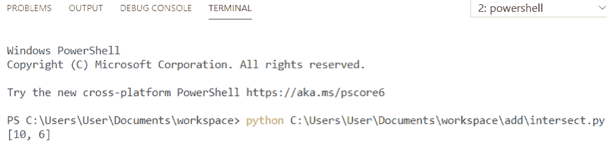
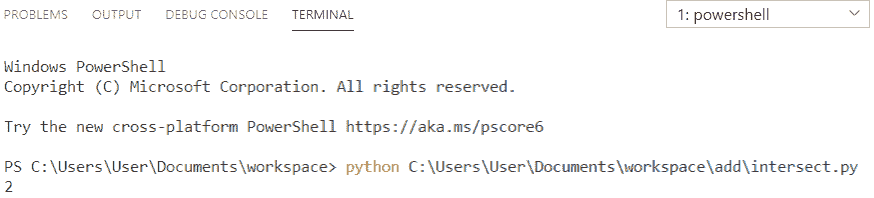
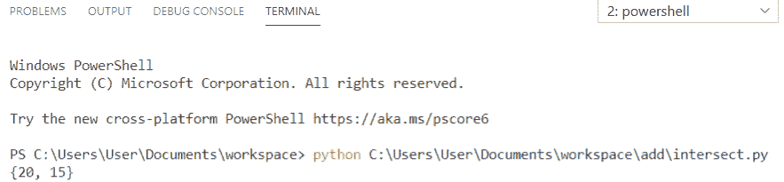
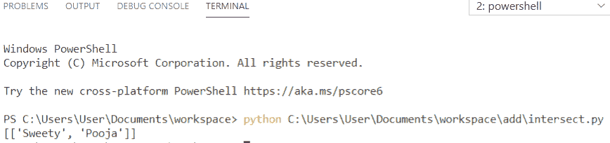
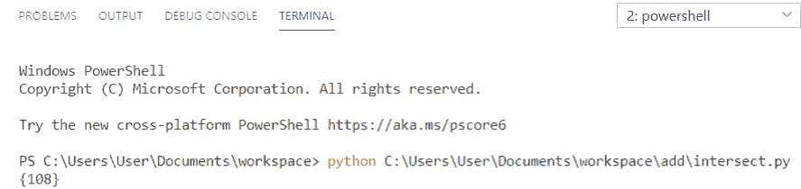
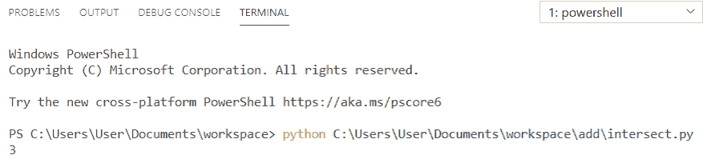
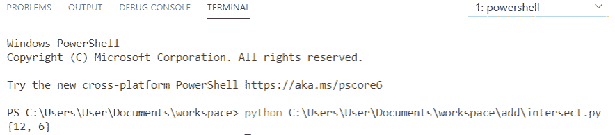
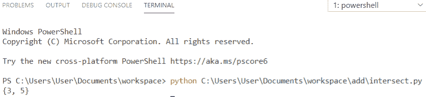

# 集合的 Python 交集

> 原文：<https://pythonguides.com/python-intersection-of-sets/>

[](https://sharepointsky.teachable.com/p/python-and-machine-learning-training-course)

在本 [python 教程中，](https://pythonguides.com/python-hello-world-program/)我们将通过几个例子讨论 python 中集合的**交集，我们还将涉及以下主题:**

*   交集是什么？
*   集合的 Python 交集
*   Python 集合交集示例
*   两个列表的 Python 交集
*   Python 计算列表的交集
*   多个集合的 Python 交集
*   多个列表的 Python 交集
*   三个集合的 Python 交集
*   Python 计算集合的交集
*   使用&运算符的 Python 集合交集
*   Python 寻找多个集合的交集

目录

[](#)

*   [交集是什么？](#What_is_the_intersection "What is the intersection?")
*   [Python 集合的交集](#Python_intersection_of_sets "Python intersection of sets")
*   [Python 集合交集示例](#Python_sets_intersection_example "Python sets intersection example")
*   [Python 两个列表的交集](#Python_intersection_of_two_lists "Python intersection of two lists")
*   [Python 计算列表的交集](#Python_count_intersection_of_lists "Python count intersection of lists")
*   [Python 多个集合的交集](#Python_intersection_of_multiple_sets "Python intersection of multiple sets")
*   [Python 多个列表的交集](#Python_intersection_of_multiple_lists "Python intersection of multiple lists")
*   [Python 三集的交集](#Python_intersection_of_three_sets "Python intersection of three sets")
*   [Python 计算集合的交集](#Python_count_intersection_of_sets "Python count intersection of sets")
*   [Python 使用&运算符](#Python_set_intersection_using_operators "Python set intersection using & operators")设置交集
*   [Python 寻找多个集合的交集](#Python_find_the_intersection_of_multiple_sets "Python find the intersection of multiple sets")

## 交集是什么？

两个集合的**交集**只有两个集合的**共有的元素，在 Python 中称为交集。如果一个元素只在一个集合中，那么它就不是交集的一部分。**

**语法:**

```py
set.intersection(other_sets)
```

## Python 集合的交集

让我们看看，**如何在 python 中执行集合的交集**。

`intersection` 方法返回一个新的集合，其中包含两个集合共有的元素。在下面的例子中**“苹果”**同时出现在两个集合中，所以它返回新的集合。

**举例:**

```py
m1 = {"Samsung","Apple","OnePlus"}
m2 = {"Oppo","Apple","Vivo"}
i = m1.intersection(m2)
print(i)
```

在这个输出中，我们可以看到集合的 **python 交集被执行。你可以参考下面的截图。**



Python intersection of sets

你可能喜欢 [Python 二叉树实现](https://pythonguides.com/python-binary-tree/)和[如何在 Python 中读取视频帧](https://pythonguides.com/read-video-frames-in-python/)。

## Python 集合交集示例

让我们看看， **python 中设置交集的例子**。

在本例中，我们将比较 3 个集合，并返回一个包含所有 3 个集合中的项目的集合。我们可以看到，**“c”**在所有 3 个集合中都存在。

**举例:**

```py
s1 = {"c", "y", "z"}
s2 = {"a", "c", "e"}
s3 = {"f", "g", "c"}
result = s1.intersection(s2, s3)
print(result)
```

在这个输出中，我们可以看到 **python 设置交集示例**。你可以参考下面的截图。



Python sets intersection example

阅读:[如何在 Django 中添加下拉导航条](https://pythonguides.com/add-dropdown-navbar-in-django/)

## Python 两个列表的交集

现在，我们将看到两个列表的 **python 交集。**

两个列表的**交集**意味着我们必须获取两个列表中的所有公共元素。在下面的示例中，**“10 和 6”**同时出现在两者中。所以，它返回新的列表。

**举例:**

```py
def intersection(l1, l2): 
    return list(set(l1) & set(l2)) 
l1 = [10, 8, 6, 5, 2]
l2 = [6, 3, 10, 4, 1]
print(intersection(l1, l2)) 
```

在这个输出中，我们可以看到两个列表的 **python 交集被执行。你可以参考下面的截图。**



Python intersection of two lists

阅读:[如何在 Python 中添加集合中的元素](https://pythonguides.com/add-elements-in-a-set-in-python/)

## Python 计算列表的交集

在这里，我们将看到 **python 计数列表的交集**。

为了**统计列表的交集**，我们将使用**“len(set(L1)&set(L2))”**。在这里，**&**是两者共有的交集元素。它将返回计数为 `"2"` ，因为 **"101 和 88"** 是两个列表共有的。

**举例:**

```py
l1 = [101, 120, 88, 16, 14]
l2 = [88, 108, 66, 101, 140]
r = len(set(l1) & set(l2)) 
print(r)
```

在这个输出中，我们可以看到列表的 **python 计数交集被执行。你可以参考下面的截图。**



Python count intersection of lists

## Python 多个集合的交集

让我们看看，**如何在 python 中执行多个` `集合**的交集。

多个集合的**交集**包含所有集合共有的所有元素。在下面的示例中，**“20 和 15”**出现在所有集合中。所以，它返回新的集合。

**举例:**

```py
s1 = {15, 18, 16, 20, 25}
s2 = {20, 14, 15, 12, 22}
s3 = {15, 12, 20, 23, 19}
i = set. intersection(s1,s2,s3)
print(i) 
```

在这个输出中，我们可以看到执行了多个集合的 **python 交集。你可以参考下面的截图。**



Python intersection of multiple sets

## Python 多个列表的交集

现在，我们将看到多个列表的 **python 交集。**

*   两个 [Python 列表](https://pythonguides.com/create-list-in-python/)的交集以不同的方式包含多个列表。
*   首先，我们用多个列表初始化了两个列表。
*   现在，使用列表理解或循环来迭代列表。

**举例:**

```py
def intersection(l1, l2): 
    return [item for item in l1 if item in l2] 
l1 = [['Naina', 'Raj'], ['Sweety', 'Pooja']] 
l2 = [['Sweety', 'Pooja'], ['Sam', 'Sid']] 
print(intersection(l1, l2)) 
```

在这个输出中，我们可以看到执行了多个列表的 **python 交集。你可以参考下面的截图。**



Python intersection of multiple lists

## Python 三集的交集

让我们看看，**如何在 python 中执行三个` `集合**的交集。

三个集合的交集包含所有集合共有的所有元素。在下面的示例中，**“108”**出现在所有集合中。所以，它返回新的集合。

**举例:**

```py
set1 = {101, 105, 108}
set2 = {108, 130, 111}
set3 = {119, 125, 108}
i = set. intersection(set1,set2,set3)
print(i) 
```

在这个输出中，我们可以看到执行了三个集合的 **python 交集。你可以参考下面的截图。**



Python intersection of three sets

## Python 计算集合的交集

为了**统计 Python 中集合的交集**，我们将使用**“len(set(set 1)&set(set 2))”**。在这里，**&**是两者共有的交集元素。它将返回计数“3”，因为**“10、8 和 6”**对两组都是通用的。

**举例:**

```py
set1 = {10, 12, 8, 6, 4}
set2 = {8, 18, 6, 10, 5}
r = len(set(set1) & set(set2)) 
print(r)
```

在这个输出中，我们可以看到执行了集合的 **python 计数交集。你可以参考下面的截图。**



Python count intersection of sets

## Python 使用&运算符设置交集

为了找到集合的交集，我们还可以使用**&**运算符。 **&** 运算符将返回集合中存在的公共元素。

**举例:**

```py
set1 = {10, 12, 8, 6, 4}
set2 = {88, 18, 60, 101, 5}
set3 = {12, 22, 6, 20, 28}
print(set1 & set3)
```

在这个输出中，我们可以看到使用&操作符执行的 **python 集合交集。你可以参考下面的截图。**



Python set intersection using & operators

## Python 寻找多个集合的交集

为了在 Python 中找到多个集合的交集，我们必须获得 4 个集合，然后我们可以使用 **" & "** 操作符来获得另一个集合，该集合将具有在所有 4 个集合中出现的公共元素。

**举例:**

```py
set1 = {1,2,3,4,5}
set2 = {2,3,5,7,9}
set3 = {3,5,10,11,12}
set4 = {8,7,5,4,3}
result = set1 & set2 & set3 & set4
print(result)
```

在这个输出中，我们可以看到 **python 找到了多个集合的交集**。你可以参考下面的截图。



Python find the intersection of multiple sets

您可能会喜欢以下 Python 教程:

*   [Python 逐行读取文件示例](https://pythonguides.com/python-read-a-file-line-by-line/)
*   [用 Python 创建和修改 PDF 文件](https://pythonguides.com/create-and-modify-pdf-file-in-python/)
*   [使用 Python Pygame 创建游戏](https://pythonguides.com/create-a-game-using-python-pygame/)
*   [Python 熊猫 CSV 教程](https://pythonguides.com/python-pandas-csv/)
*   [如何用 Python 把 DateTime 转换成 UNIX 时间戳](https://pythonguides.com/convert-datetime-to-unix-timestamp-in-python/)
*   [删除 python 中的 Unicode 字符](https://pythonguides.com/remove-unicode-characters-in-python/)
*   [Python 元组排序列表](https://pythonguides.com/python-sort-list-of-tuples/)
*   [Python 中的索引和切片](https://pythonguides.com/indexing-and-slicing-in-python/)

在本教程中，我们已经学习了集合的 **Python 交集，并且我们已经涵盖了以下主题:**

*   交集是什么？
*   集合的 Python 交集
*   Python 集合交集示例
*   两个列表的 Python 交集
*   Python 计算列表的交集
*   多个集合的 Python 交集
*   多个列表的 Python 交集
*   三个集合的 Python 交集
*   Python 计算集合的交集
*   使用&运算符的 Python 集合交集
*   Python 寻找多个集合的交集

[Bijay Kumar](https://pythonguides.com/author/fewlines4biju/)

Python 是美国最流行的语言之一。我从事 Python 工作已经有很长时间了，我在与 Tkinter、Pandas、NumPy、Turtle、Django、Matplotlib、Tensorflow、Scipy、Scikit-Learn 等各种库合作方面拥有专业知识。我有与美国、加拿大、英国、澳大利亚、新西兰等国家的各种客户合作的经验。查看我的个人资料。

[enjoysharepoint.com/](https://enjoysharepoint.com/)[](https://www.facebook.com/fewlines4biju "Facebook")[](https://www.linkedin.com/in/fewlines4biju/ "Linkedin")[](https://twitter.com/fewlines4biju "Twitter")