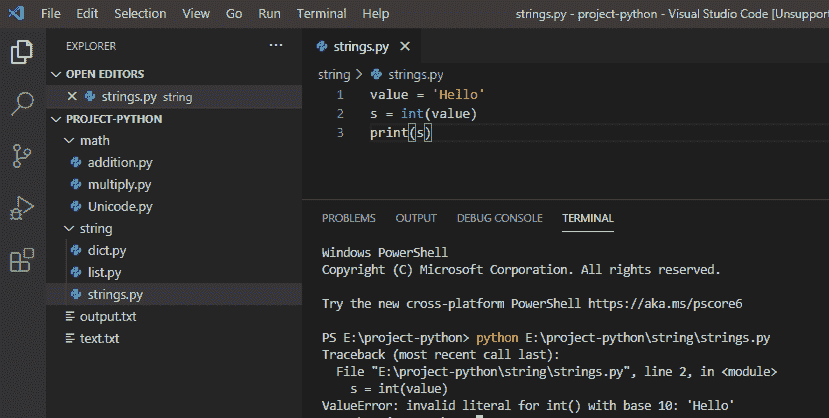
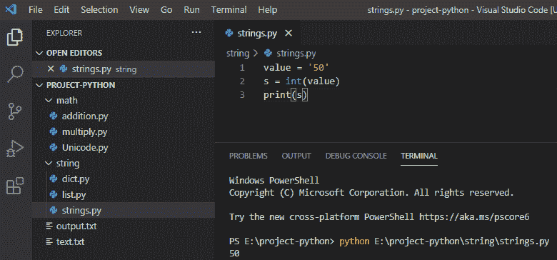

# 基数为 10 的 int()的 Python 无效文字

> 原文：<https://pythonguides.com/python-invalid-literal-for-int-with-base-10/>

[](https://sharepointsky.teachable.com/p/python-and-machine-learning-training-course)

在本 [Python 教程](https://pythonguides.com/python-download-and-installation/)中，我们将讨论什么是 Value Error——Python 对以 10 为基数的 int()的无效文字，以及如何修复这个错误。

## 基数为 10 的 int()的 Python 无效文字

在 python 中，每当我们用不能被解析为整数的字符串参数调用 **int()函数**时，就会引发基数为 10 的 int()的**无效文字，然后它会给出一个错误。**

**举例:**

```py
value = 'Hello'
s = int(value)
print(s)
```

写完上面的代码(python 对基数为 10 的 int()无效的文字)，你将打印出 `" s "` 然后错误将显示为**"值错误:对基数为 10 的 int()无效的文字:' Hello' "** 。这里，每当我们用一个不能被解析为整数的字符串参数调用 `int()` 函数时，就会出现这个错误。

你可以参考下面的截图 python 对以 10 为基数的 int()无效文字



Python invalid literal for int() with base 10

这是**值错误:基数为 10 的 int()的文本无效:“Hello”**

为了解决这个 **ValueError:` `以 10 为基数的 int()的无效文字:“Hello”**，我们需要将一个整数值作为字符串传递给变量**“value”**，然后它会使用内置的 int()函数将变量转换为 int。这样就不会发现错误。

**举例:**

```py
value = '50'
s = int(value)
print(s)
```

写完上面的代码后(python 对以 10 为基数的 int()无效)，你将打印出 `" s "` ，然后输出将显示为 `" 50 "` 。

这里，由于我们将整数值作为字符串传递给了变量，因此解决了该错误，它可以使用 int()函数将该值转换为整数，这样，错误就解决了。

你可以参考下面的截图 python 对以 10 为基数的 int()无效文字



Python invalid literal for int() with base 10

您可能会喜欢以下 Python 教程:

*   [Python 元组排序列表](https://pythonguides.com/python-sort-list-of-tuples/)
*   [如何在 Python 中处理 indexerror:字符串索引超出范围](https://pythonguides.com/indexerror-string-index-out-of-range-python/)
*   [解析 Python 时出现意外的 EOF](https://pythonguides.com/unexpected-eof-python/)
*   [删除 python 中的 Unicode 字符](https://pythonguides.com/remove-unicode-characters-in-python/)
*   [Python](https://pythonguides.com/python-dictionary-append/)[d](https://pythonguides.com/python-dictionary-append/)[ictionary 附实例](https://pythonguides.com/python-dictionary-append/)
*   [如何在 python 中把整数转换成字符串](https://pythonguides.com/convert-an-integer-to-string-in-python/)
*   [如何在 python 中连接字符串](https://pythonguides.com/concatenate-strings-in-python/)
*   [如何在 python 中使用正则表达式拆分字符串](https://pythonguides.com/python-split-string-regex/)
*   [如何在 Python 中创建列表](https://pythonguides.com/create-list-in-python/)

这是我们如何解决 **值错误的**:以 10 为基数的 int()的无效文字:“Hello”****

[Bijay Kumar](https://pythonguides.com/author/fewlines4biju/)

Python 是美国最流行的语言之一。我从事 Python 工作已经有很长时间了，我在与 Tkinter、Pandas、NumPy、Turtle、Django、Matplotlib、Tensorflow、Scipy、Scikit-Learn 等各种库合作方面拥有专业知识。我有与美国、加拿大、英国、澳大利亚、新西兰等国家的各种客户合作的经验。查看我的个人资料。

[enjoysharepoint.com/](https://enjoysharepoint.com/)[](https://www.facebook.com/fewlines4biju "Facebook")[](https://www.linkedin.com/in/fewlines4biju/ "Linkedin")[](https://twitter.com/fewlines4biju "Twitter")