# Python 关键字及示例

> 原文：<https://pythonguides.com/python-keywords/>

[](https://sharepointsky.teachable.com/p/python-and-machine-learning-training-course)

在这篇 [python tutoria](https://pythonguides.com/python-hello-world-program/) l 中，你将通过几个例子了解**什么是 python 关键字**。有各种 **python 保留的关键字**可以在 [Python](https://pythonguides.com/create-list-in-python/) 中使用。这里我们将检查 **:**

*   Python 中的关键词是什么
*   python 中的 class 关键字
*   python 中的 del 关键字
*   python 中的 def 关键字
*   python 中的 False 关键字
*   python 中的 True 关键字
*   python 中的 break 关键字
*   python 中的 continue 关键字
*   python 中的 if 关键字
*   python 中的 else 关键字
*   python 中的 return 关键字
*   python 中的导入关键字
*   python 中的 lambda 关键字
*   python 中的 None 关键字
*   python 中的 Try 关键字
*   python 中的 Pass 关键字
*   python 中的 in 关键字

目录

[](#)

*   [Python 中的关键字有哪些](#What_are_Keywords_in_Python "What are Keywords in Python")
*   [python 中的 class 关键字](#class_keyword_in_python "class keyword in python")
*   [python 中的 del 关键字](#del_keyword_in_python "del keyword in python")
*   [python 中的 def 关键字](#def_keyword_in_python "def keyword in python")
*   [python 中的 False 关键字](#False_keyword_in_python "False keyword in python")
*   [python 中的 True 关键字](#True_keyword_in_python "True keyword in python")
*   [python 中的 break 关键字](#break_keyword_in_python "break keyword in python")
*   [python 中的 continue 关键字](#continue_keyword_in_python "continue keyword in python")
*   [python 中的 if 关键字](#if_keyword_in_python "if keyword in python")
*   [python 中的 else 关键字](#else_keyword_in_python "else keyword in python")
*   [返回 python 中的关键字](#return_keyword_in_python "return keyword in python")
*   [在 python 中导入关键字](#import_keyword_in_python "import keyword in python")
*   [python 中的 lambda 关键字](#lambda_keyword_in_python "lambda keyword in python")
*   [python 中的无关键字](#None_keyword_in_python "None keyword in python")
*   [python 中的 Try 关键字](#Try_keyword_in_python "Try keyword in python")
*   [python 中的 Pass 关键字](#Pass_keyword_in_python "Pass keyword in python")
*   [在 python 中的关键字](#in_keyword_in_python "in keyword in python")

## Python 中的关键字有哪些

在 python 中，**关键字**是保留字，不能用作变量名、标识符或任何函数名。

python 中的关键字列表

| 班级 | 是吗 | 极好的 | 错误的 |
| 真实的 | 破裂 | 继续 | 如果 |
| 其他 | 返回 | 进口 | 希腊字母的第 11 个 |
| 没有人 | 尝试 | 及格 | 在 |

List of keywords

## python 中的 class 关键字

在 python 中， **class 关键字**用于创建一个类，而一个类就像一个用户定义的对象。

**举例:**

```py
class Student:
name = "Jack"
roll = 21
print(Student.name)
```

写完上面的代码(python 中的 class 关键字)，你将打印出 `" Student.name "` ，然后输出将显示为 `" Jack "` 。在这里，我的班级名字是“学生”。

你可以参考下面的 python 类关键字截图

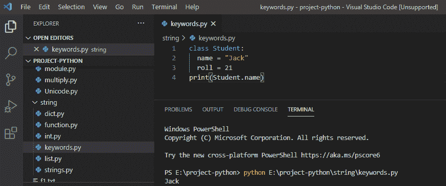

Class keyword in python

## python 中的 del 关键字

在 python 中， **del 关键字**用于从列表或变量等中删除特定项。

**举例:**

```py
value = ["A", "B"]
del value[0]
print(value)
```

写完上面的代码(python 中的 del 关键字)，你将打印出 `" value "` ，然后输出将显示为 **" ['B'] "** 。这里，index [0]项从列表中删除，并返回列表中的其余项。

你可以参考下面的 python del 关键字截图

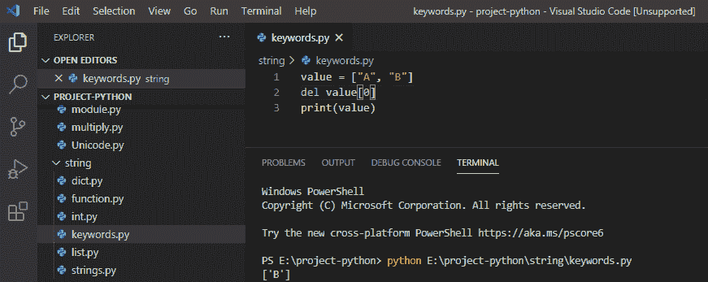

del keyword in python

## python 中的 def 关键字

在 python 中， **def 关键字**用于创建新的用户定义函数。

**举例:**

```py
def function1():
print("Welcome to function in python")
function1()
```

在编写完上述代码(python 中的 def 关键字)后，您将打印这些代码，然后输出将显示为**“欢迎使用 python 中的函数”**。在这里，我们定义函数，然后调用函数。

你可以参考下面的 python def 关键字截图

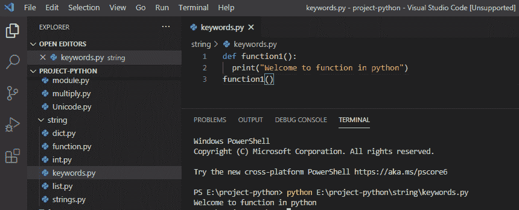

def keyword in python

## python 中的 False 关键字

在 python 中， **false 关键字**是布尔值，false 关键字也被表示为零，这意味着什么。

**举例:**

```py
print(10<3)
```

在编写了上面的代码(python 中的 false 关键字)之后，您将打印这些代码，然后输出将显示为 `" false "` 。这里，我们使用比较运算符来检查 3 是否大于 10，因此它返回 false。

你可以参考下面的 python 中 false 关键字的截图

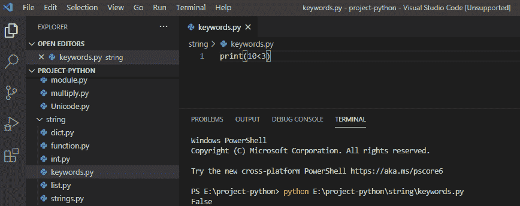

False keyword in python

## python 中的 True 关键字

在 python 中， **true 关键字**是布尔值，true 关键字表示为 1。

**举例:**

```py
print(10>3)
```

在编写了上面的代码(python 中的 true 关键字)之后，您将打印这些代码，然后输出将显示为一个 `" true "` 。这里，我们使用比较运算符来检查 10 是否大于 3，因此它返回 true。

你可以参考下面的 python 中 true 关键字的截图

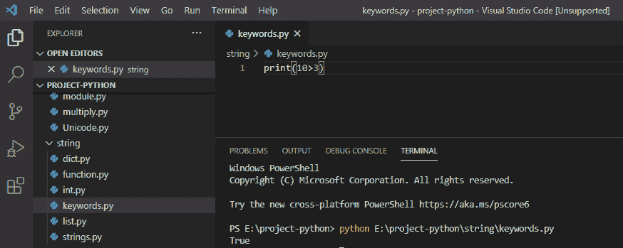

True keyword in python

## python 中的 break 关键字

在 python 中， **break 关键字**用于终止循环的当前迭代。

**举例:**

```py
for value in range(5):
if value > 2:
break
print(value)
```

写完上面的代码(python 中的 break 关键字)，你将打印出 `" value "` ，然后输出将显示为 `" 0 1 2 "` 。这里，我们使用 break 关键字来中断循环。

你可以参考下面 python 中 break 关键字的截图。

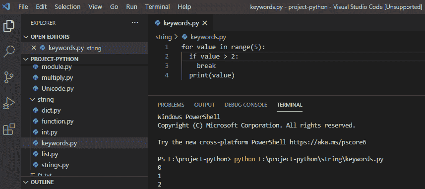

break keyword in python

## python 中的 continue 关键字

在 python 中， **continue 关键字**用于结束 for 循环的当前迭代，并继续下一次迭代。

**举例:**

```py
for value in range(6):
if value == 4:
continue
print(value)
```

写完上面的代码(python 中的 continue 关键字)，你将打印出 `" value "` ，然后输出将显示为 `" 0 1 2 3 5 "` 。这里，我们使用 continue 关键字循环不终止，而是继续下一次迭代。

你可以参考下面 python 中 continue 关键字的截图。

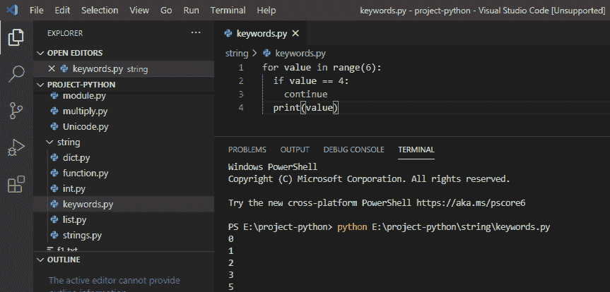

continue keyword in python

## python 中的 if 关键字

在 python 中， **if 关键字**用于定义条件语句，如果条件为真，它就执行代码块。

**举例:**

```py
value = 4
if value > 2:
print("Yes value is greater")
```

写完上面的代码(如果是 python 中的关键字)，你将打印出 `" value "` ，然后输出将显示为 `" Yes value is greater "` 。这里，我们使用 if 关键字来检查是否满足某个条件。

python 中的 if 关键字可以参考下面的截图。

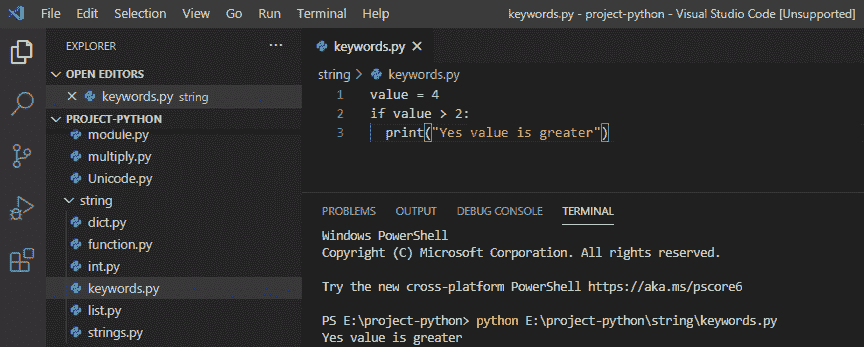

if keyword in python

## python 中的 else 关键字

在 python 中， **else 关键字**被用作条件语句，它决定如果条件为假时该做什么。

**举例:**

```py
value = 2
if value > 4:
print("Yes value is greater")
else:
print("No value is not greater")
```

写完上面的代码(python 中的 else 关键字)，你将打印出，然后输出将显示为**“无值不大于”**。这里，如果条件为假，我们使用 else 关键字。

你可以参考下面 python 中 else 关键字的截图。

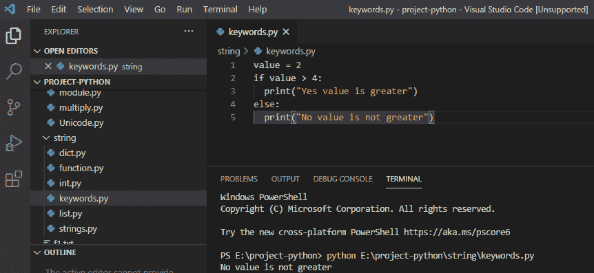

else keyword in python

## 返回 python 中的关键字

在 python 中， **return 关键字**用于从调用函数返回值。

**举例:**

```py
def my_fun():
return 5+7
print(my_fun())
```

写完上面的代码(python 中的 return 关键字)，你将打印出 `" my_fun() "` ，然后输出将显示为 `" 12 "` 。这里，return 关键字将退出函数并返回值。

您可以参考下面 python 中 return 关键字的截图。

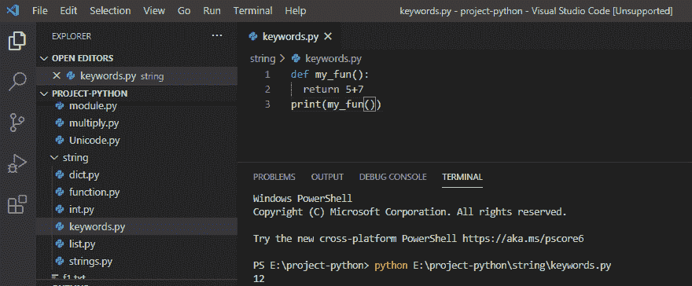

return keyword in python

## 在 python 中导入关键字

在 python 中，**导入关键字**用于导入日期时间模块**、**，然后显示当前日期和时间。

**举例:**

```py
import datetime
a = datetime.datetime.now()
print(a)
```

写完上面的代码(python 中的 import 关键字)，你将打印出 `" a "` ，然后输出将显示为**" 2020-08-28 17:30:26.590678 "**。这里，import 关键字用于导入 python 中的模块。

你可以参考下面的 python 中导入关键字的截图。

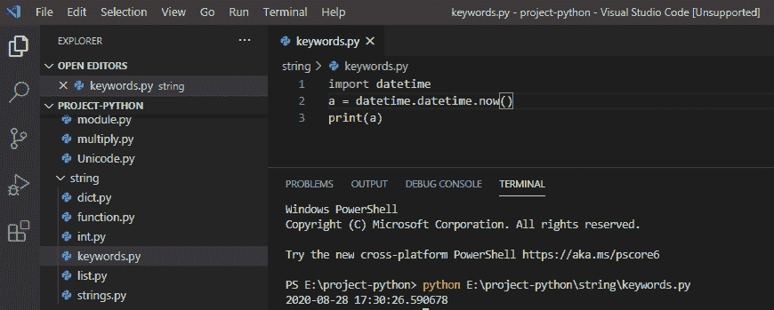

import keyword in python

## python 中的 lambda 关键字

在 python 中， **lambda 关键字**可以接受任意数量的参数，但只能接受一个表达式，它会创建一个小型匿名函数。

**举例:**

```py
s = lambda x : x + 20
print(s(5))
```

写完上面的代码(python 中的 lambda 关键字)，你将打印出 `" s(5) "` ，然后输出将显示为 `" 25 "` 。在这里，lambda 关键字将计算表达式，并返回结果。

可以参考下面 python 中 lambda 关键字的截图。

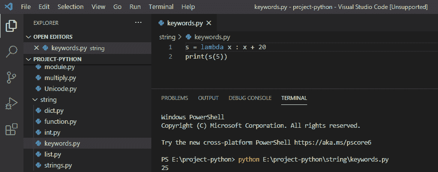

lambda keyword in python

## python 中的无关键字

在 python 中， **none 关键字**是其自身数据类型的对象，用于定义空值，即没有值。

```py
a = None 
print(a)
```

写完上面的代码(python 中的 none 关键字)，你将打印出 `" a "` ，然后输出将显示为 `" None "` 。这里，none 关键字用于定义值的缺失，它可以被赋给变量。

可以参考下面 python 中 none 关键字的截图。

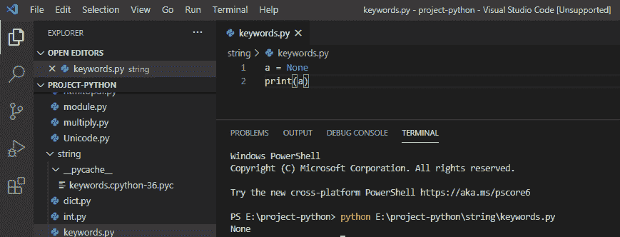

None keyword in python

## python 中的 Try 关键字

在 python 中，`**`关键字**用于错误和异常处理，如果没有出错，try 块就会执行。****

```py
try:
x > 10
except:
print("Something is wrong")
```

在编写了上面的代码(python 中的 Try 关键字)之后，您将打印这些代码，然后输出将显示为**“有问题”**。这里，try 块不会执行，因为发生了异常，所以它引发了一个错误。

可以参考下面 python 中 try 关键字的截图。

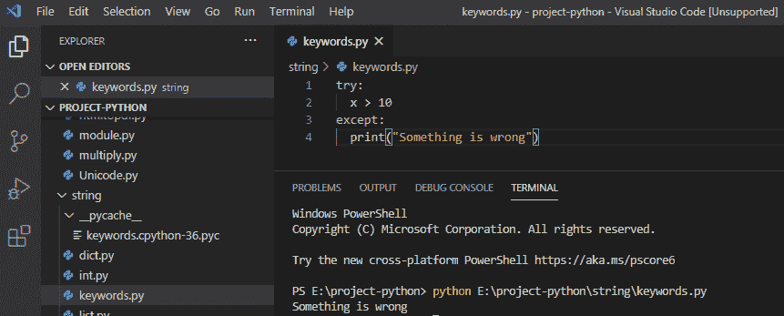

Try keyword in python

## python 中的 Pass 关键字

在 python 中， `pass` **关键字**是一个伪占位符，当 pass 关键字被执行时什么都不会发生，并且它避免了在不允许空代码时出现错误。

```py
for a in [10, 11, 12]:
pass
```

编写上述代码(python 中的 pass 关键字)后，您将运行代码，然后输出中不显示任何内容。在这里，pass 关键字被用作一个伪占位符，它可以被视为一个空语句。

关于 python 中的 pass 关键字，可以参考下面的截图。

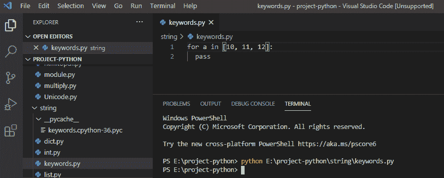

Pass keyword in python

## 在 python 中的关键字

在 python 中， **中的**关键字**用于遍历 for 循环，也用于检查值是否出现在列表、字符串等中。**

```py
flower = ["rose", "sunflowers", "tulips"]
if "tulips" in flower:
print("yes")
```

在编写完上面的代码(python 中的关键字)后，您将打印这些代码，然后输出将显示为**“yes”**。这里，in 关键字用于检查值是否存在。

你可以参考下面 python 中 in 关键字的截图。

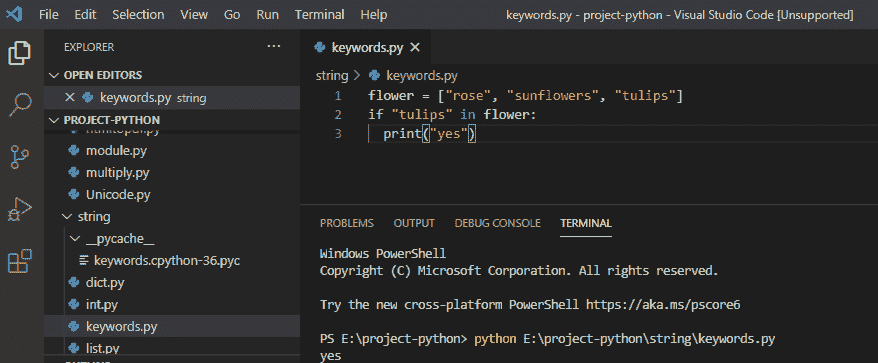

in keyword in python

您可能会喜欢以下 Python 教程:

*   [Python 数组与示例](https://pythonguides.com/python-array/)
*   [python 中的哈希表](https://pythonguides.com/hash-table-in-python/)
*   [Python 中的块缩进](https://pythonguides.com/block-indentation-in-python/)
*   [Python 从路径中获取文件名](https://pythonguides.com/python-get-filename-from-the-path/)
*   [Python 类型错误:“列表”对象不可调用](https://pythonguides.com/python-typeerror-list-object-is-not-callable/)
*   [Python if else with examples](https://pythonguides.com/python-if-else/)
*   [Python For 循环示例](https://pythonguides.com/python-for-loop/)
*   [Python 读取 excel 文件并在 Python 中写入 Excel](https://pythonguides.com/python-read-excel-file/)
*   [Python 中的排序算法](https://pythonguides.com/sorting-algorithms-in-python/)
*   [Python 中的优先级队列](https://pythonguides.com/priority-queue-in-python/)

在本 python 教程中，我们学习了 Python 中出现的各种 **python 关键字**，例如:

*   python 中的 class 关键字
*   python 中的 del 关键字
*   python 中的 def 关键字
*   python 中的 False 关键字
*   python 中的 True 关键字
*   python 中的 break 关键字
*   python 中的 continue 关键字
*   python 中的 if 关键字
*   python 中的 else 关键字
*   python 中的 return 关键字
*   python 中的导入关键字
*   python 中的 lambda 关键字
*   python 中的 None 关键字
*   python 中的 Try 关键字
*   python 中的 Pass 关键字
*   python 中的 in 关键字

[Bijay Kumar](https://pythonguides.com/author/fewlines4biju/)

Python 是美国最流行的语言之一。我从事 Python 工作已经有很长时间了，我在与 Tkinter、Pandas、NumPy、Turtle、Django、Matplotlib、Tensorflow、Scipy、Scikit-Learn 等各种库合作方面拥有专业知识。我有与美国、加拿大、英国、澳大利亚、新西兰等国家的各种客户合作的经验。查看我的个人资料。

[enjoysharepoint.com/](https://enjoysharepoint.com/)[](https://www.facebook.com/fewlines4biju "Facebook")[](https://www.linkedin.com/in/fewlines4biju/ "Linkedin")[](https://twitter.com/fewlines4biju "Twitter")****