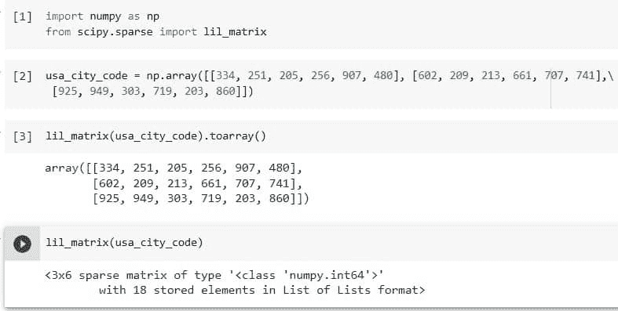
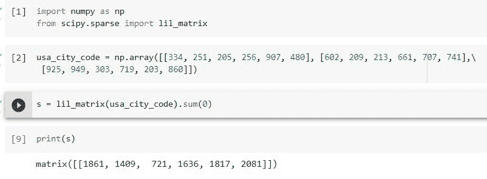
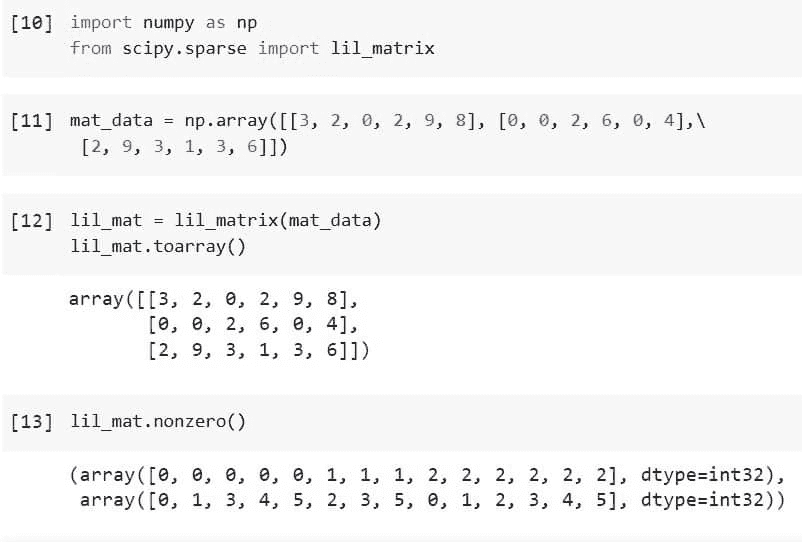
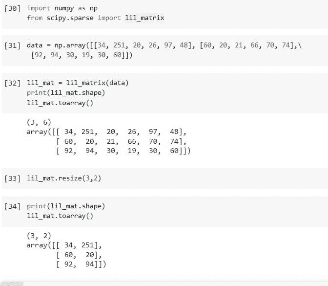
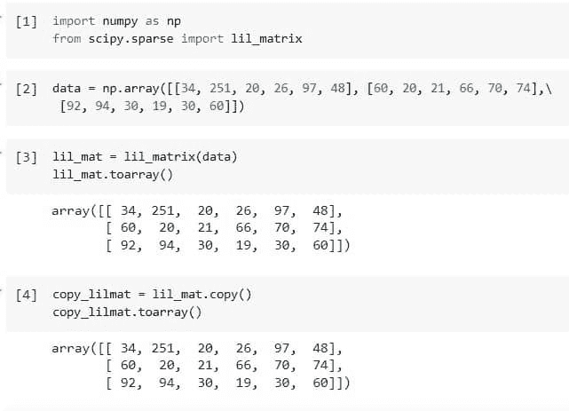
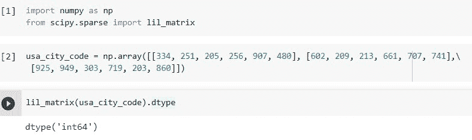
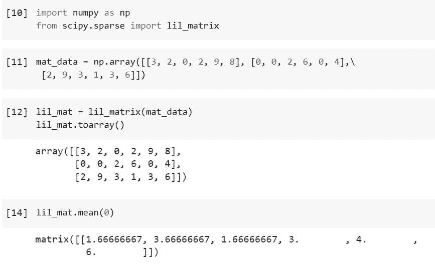
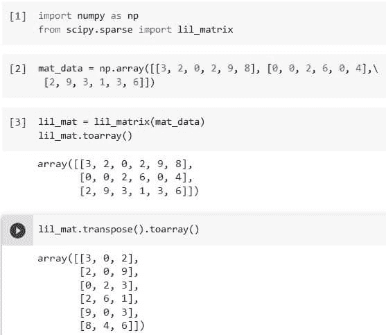

# 使用 Python Lil_Matrix Scipy

> 原文：<https://pythonguides.com/python-lil_matrix-scipy/>

[](https://sharepointsky.teachable.com/p/python-and-machine-learning-training-course)

本教程将教我们关于"`*Python Lil _ Matrix Scipy*`"这是另一种稀疏矩阵，但在使用或本质上是高效的。

所以这里我们将创建 Lil 矩阵，并对矩阵中的元素求和或计算其平均值，同时执行一些操作，如调整矩阵大小或复制矩阵等。此外，涵盖以下主题。

*   Scipy 中的 Lil Matrix 是什么？
*   如何使用 Python Scipy 创建 Lil_Matrix
*   如何对沿特定轴的 Lil_Matrix 元素求和？
*   如何寻找 Scipy Lil_Matrix 中非零元素的索引
*   如何调整 Scipy Lil_Matrix
*   如何创建 Scipy Lil_Matrix 的副本
*   如何检查 Scipy Lil_Matrix 的数据类型
*   如何求科学矩阵的平均值
*   如何转置科学的 Lil_Matrix

目录

[](#)

*   [Scipy 中的 Lil Matrix 是什么？](#What_is_Lil_Matrix_in_Scipy "What is Lil Matrix in Scipy?")
*   [Python Lil_Matrix Scipy](#Python_Lil_Matrix_Scipy "Python Lil_Matrix Scipy")
*   [Python Lil_Matrix Scipy Sum](#Python_Lil_Matrix_Scipy_Sum "Python Lil_Matrix Scipy Sum")
*   [Python Lil_Matrix Scipy 非零](#Python_Lil_Matrix_Scipy_Nonzero "Python Lil_Matrix Scipy Nonzero")
*   [Python Lil _ Matrix Scipy Resize](#Python_Lil_Matrix_Scipy_Resize "Python Lil_Matrix Scipy Resize")
*   [Python Lil _ Matrix Scipy Copy](#Python_Lil_Matrix_Scipy_Copy "Python Lil_Matrix Scipy Copy")
*   [Python Lil _ Matrix Scipy Dtype](#Python_Lil_Matrix_Scipy_Dtype "Python Lil_Matrix Scipy Dtype")
*   [Python Lil_Matrix Scipy 的意思是](#Python_Lil_Matrix_Scipy_Mean "Python Lil_Matrix Scipy Mean")
*   [Python Lil_matrix Scipy 转置](#Python_Lil_matrix_Scipy_Transpose "Python Lil_matrix Scipy Transpose")

## Scipy 中的 Lil Matrix 是什么？

Lil 矩阵是一个稀疏矩阵，具有基于行的列表列表。该结构在下一小节中给出，可用于增量构建稀疏矩阵。

在构建矩阵时，确保每行的元素都按索引进行了预先排序，因为在最坏的情况下，只插入一项会花费线性时间。

稀疏矩阵支持减法、加法、乘法、除法和矩阵幂等算术运算。

*   LIL 格式的好处是允许灵活的切片，并且矩阵稀疏结构被有效地修改。
*   LIL 格式的缺点是 LIL + LIL 是一个缓慢的加法过程(考虑 CSR 或 CSC)，缓慢切片列(考虑 CSC)，以及低效的矩阵向量乘积(考虑 CSR 或 CSC)。

使用目的:LIL 格式使创建稀疏矩阵变得简单。对于快速算术和矩阵向量运算，一旦创建了矩阵，就将其转换为 CSR 或 CSC 格式。当创建大矩阵时，考虑选择首席运营官格式。

阅读: [Python Scipy 稀疏 Csr_matrix](https://pythonguides.com/python-scipy-sparse-csr_matrix/)

## Python Lil_Matrix Scipy

Python Scipy 的类`*`lil_matrix()`*`存在于基于列表行的稀疏矩阵的模块`*`scipy.sparse`*`中。

下面给出了语法。

```py
class scipy.sparse.lil_matrix(arg1, shape=None, dtype=None, copy=False)
```

有多种方法可以实例化它:

*   `lil_matrix(D)` 秩为 2 ndarray D 或稠密矩阵。
*   `lil_matrix(S)` 具有不同的稀疏矩阵 S
*   要创建形状为(M，N)的空矩阵，请使用语法**“lil matrix((M，N)，[dtype])”**。Dtype 是可选的，默认为 dtype='d '。

让我们按照以下步骤创建 Lil 矩阵:

使用下面的 python 代码导入所需的库或方法。

```py
import numpy as np
from scipy.sparse import lil_matrix
```

使用以下代码创建一个包含美国城市代码的秩 2 矩阵。

```py
usa_city_code = np.array([[334, 251, 205, 256, 907, 480], [602, 209, 213, 661, 707, 741],\
 [925, 949, 303, 719, 203, 860]])
```

使用以下代码将上述矩阵传递给`*`lil_matrix()`*`。

```py
lil_matrix(usa_city_code).toarray()
```

运行下面的代码来检查它是否是 Lil 矩阵。

```py
lil_matrix(usa_city_code)
```



Python Lil_Matrix Scipy

这就是如何使用 Python Scipy 的方法`*`lil_matrix()`*`生成或创建 Lil 矩阵。

阅读: [Python Scipy IIR 滤波器](https://pythonguides.com/python-scipy-iir-filter/)

## Python Lil_Matrix Scipy Sum

Python Scipy 的方法`*`lil_matrix.sum`*`沿着特定的轴将每个矩阵成员相加。

下面给出了语法。

```py
lil_matrix.sum(axis=None, dtype=None, out=None)
```

其中参数为:

*   **轴({-2，-1，0，1} ):** 用于计算总和的轴。默认情况下，计算每个矩阵元素的总和并作为标量返回(即 axis = None)。
*   **dtype:** 用于将分量相加的累加器的种类和返回矩阵的类型。除非具有精度低于平台整数的整数 dtype，否则默认情况下会使用的 dtype。如果有符号，则在这种情况下使用平台整数，而如果无符号，则使用具有相同精度的无符号整数。
*   **out(np.matrix):** 备选输出矩阵可用于结果。它必须与所需的输出具有相同的形状，但是如果需要，输出值的类型将被强制转换。

方法`*`lil_matrix.sum`*`返回 ***`sum_along_axis`(缺少所需轴的同自矩阵)*** 。

让我们以上述小节中使用的相同示例为例，按照以下步骤计算轴上元素的总和:

使用下面的 python 代码导入所需的库或方法。

```py
import numpy as np
from scipy.sparse import lil_matrix
```

使用以下代码创建一个包含美国城市代码的秩 2 矩阵。

```py
usa_city_code = np.array([[334, 251, 205, 256, 907, 480], [602, 209, 213, 661, 707, 741],\
 [925, 949, 303, 719, 203, 860]])
```

使用以下代码将上述矩阵传递给`*`lil_matrix()`*`。

```py
lil_matrix(usa_city_code).toarray()
```

上面的代码显示了 Lil 矩阵的样子，现在使用下面的代码将轴上的元素相加等于零。

```py
s = lil_matrix(usa_city_code).sum(0)
print(s)
```



Python Lil_Matrix Scipy Sum

这就是如何使用 Python Scipy 的方法`*`lil_matrix.sum()`*`对沿着指定轴的 Lil 矩阵的元素求和。

阅读: [Python Scipy 统计符合](https://pythonguides.com/python-scipy-stats-fit/)

## Python Lil_Matrix Scipy 非零

在模块`scipy.sparse`中有一个方法`lil_matrix.nonzero()`来返回一个数组元组(row，col ),该数组元组保存矩阵的非零项的索引。

让我们以一个例子来理解如何通过以下步骤获得 Lil 矩阵中非零元素的索引:

使用下面的 python 代码导入所需的库或方法。

```py
import numpy as np
from scipy.sparse import lil_matrix
```

使用下面的代码创建一个秩为 2 的矩阵。

```py
mat_data = np.array([[3, 2, 0, 2, 9, 8], [0, 0, 2, 6, 0, 4],\
 [2, 9, 3, 1, 3, 6]])
```

创建一个 Lil 矩阵，并使用下面的代码检查矩阵。

```py
lil_mat = lil_matrix(mat_data)
lil_mat.toarray()
```

对 Lil，matrix 应用方法`*`nonzero()`*`,使用下面的代码找到非零元素的索引。

```py
lil_mat.nonzero()
```



Python Lil_Matrix Scipy Nonzero

上面的输出显示了 Lil 矩阵中非零元素的索引，例如(0，0) = 3，(0，1)=2 和(0，3) =2 等等。

阅读: [Python Scipy ttest_ind](https://pythonguides.com/python-scipy-ttest_ind/)

## Python Lil _ Matrix Scipy Resize

Python Scipy 模块`scipy.sparse`有一个方法`*`lil_matrix.resize()`*`将矩阵调整到由形状指定的尺寸。新形状外部的非零元素将被删除，而新形状内部的元素将保持其当前索引。

下面给出了语法。

```py
lil_matrix.resize(*shape)
```

其中参数 **shape(int，int)** :新矩阵的行数和列数。

如下所示，在下一小节中我们所做的相同示例的帮助下，使用如何调整 Lil 矩阵大小的示例。

使用下面的 python 代码导入所需的库或方法。

```py
import numpy as np
from scipy.sparse import lil_matrix
```

使用下面的代码创建一个秩为 2 的矩阵。

```py
data = np.array([[34, 251, 20, 26, 97, 48], [60, 20, 21, 66, 70, 74],\
 [92, 94, 30, 19, 30, 60]])
```

创建一个 Lil 矩阵，并使用下面的代码检查矩阵的形状。

```py
lil_mat = lil_matrix(data)
print(lil_mat.shape)
lil_mat.toarray()
```

现在使用下面的代码将 Lil 矩阵的形状改为 3x 2。

```py
lil_mat.resize(3,2)
```

使用下面的代码检查调整后的矩阵形状。

```py
print(lil_mat.shape)
lil_mat.toarray()
```



Python Lil_Matrix Scipy Resize

这是如何使用 Python Scipy 的方法`*`lil_matrix.resize()`*`来调整 Lil 矩阵的大小。

阅读: [Python Scipy Gamma](https://pythonguides.com/python-scipy-gamma/)

## Python Lil _ Matrix Scipy Copy

模块`scipy.sparse`中 Python Scipy 的方法`*`lil_matrix.copy()`*`复制这个矩阵并返回。当前矩阵和返回值之间没有数据或索引共享。

让我们举个例子，按照以下步骤复制 Lil 矩阵:

使用下面的 python 代码导入所需的库或方法。

```py
import numpy as np
from scipy.sparse import lil_matrix
```

使用下面的代码创建一个秩为 2 的矩阵。

```py
data = np.array([[34, 251, 20, 26, 97, 48], [60, 20, 21, 66, 70, 74],\
 [92, 94, 30, 19, 30, 60]])
```

使用下面的代码创建一个 Lil 矩阵。

```py
lil_mat = lil_matrix(data)
lil_mat.toarray()
```

现在使用方法`*`copy()`*`复制上面创建的 Lil 矩阵`*`lil_mat`*`。

```py
copy_lilmat = lil_mat.copy()
copy_lilmat.toarray()
```



Python Lil_Matrix Scipy Copy

这是如何使用 Python Scipy 的方法`*`lil_matrix.copy()`*`复制 Lil 矩阵。

阅读: [Python Scipy 正常测试](https://pythonguides.com/python-scipy-normal-test/)

## Python Lil _ Matrix Scipy Dtype

Lil matrix 有一个属性`*`dtype`*`,用于了解 Lil matrix 中存在的元素的数据类型。

让我们举一个我们在本教程的上述小节中使用过的例子。

使用下面的 python 代码导入所需的库或方法。

```py
import numpy as np
from scipy.sparse import lil_matrix
```

使用下面的代码创建一个包含美国城市代码的秩 2 矩阵。

```py
usa_city_code = np.array([[334, 251, 205, 256, 907, 480], [602, 209, 213, 661, 707, 741],\
 [925, 949, 303, 719, 203, 860]])
```

使用下面的代码将前面提到的矩阵传递给 *`lil_matrix()`* 并访问属性`*`dtype`*`以了解 lil 矩阵的数据类型。

```py
lil_matrix(usa_city_code).dtype
```



Python Lil_Matrix Scipy Dtype

这就是如何使用 Lil 矩阵的属性`*`dtype`*`检查 Lil 矩阵的数据类型。

阅读: [Python Scipy 统计偏差](https://pythonguides.com/python-scipy-stats-skew/)

## Python Lil_Matrix Scipy 的意思是

Python Scipy 的方法`*`lil_matrix.mean()`*`返回矩阵的平均值。默认情况下，对所有矩阵元素计算平均值；如果不是，则跨选定的轴进行计算。整数输入使用 float64 作为中间值和返回值。

下面给出了语法。

```py
lil_matrix.mean(axis=None, dtype=None, out=None)
```

其中参数为:

*   **轴(1，0，-1，-2):** 用于计算平均值的轴。默认设置(即 axis = None)计算矩阵中每个成员的平均值。
*   **dtype:** 利用此类型计算平均值。浮点输入的默认值等于输入数据类型，而整数输入的默认值为 float64。
*   **out(np.matrix):** 应该使用不同的输出矩阵来存储结果。如果需要，可以转换输出值的类型，但是它们必须与预期的输出具有相同的形状。

使用下面的 python 代码导入所需的库或方法。

```py
import numpy as np
from scipy.sparse import lil_matrix
```

使用下面的代码创建一个秩为 2 的矩阵。

```py
mat_data = np.array([[3, 2, 0, 2, 9, 8], [0, 0, 2, 6, 0, 4],\
 [2, 9, 3, 1, 3, 6]])
```

创建一个 Lil 矩阵，并使用下面的代码检查矩阵。

```py
lil_mat = lil_matrix(mat_data)
lil_mat.toarray()
```

将方法`*`mean()`*`应用于 Lil，matrix，使用下面的代码沿着轴= 0 找到 Lil 矩阵的平均值。

```py
lil_mat.mean(0)
```



Python Lil_Matrix Scipy Mean

从上面包含 Lil 矩阵中沿轴的元素平均值的输出= 0。

阅读: [Python Scipy Kdtree](https://pythonguides.com/python-scipy-kdtree/)

## Python Lil_matrix Scipy 转置

模块`*`scipy.sparse`*`中 Python Scipy 的方法`*`lil_matrix.transpose()`*`反转稀疏矩阵的维数。

下面给出了语法。

```py
lil_matrix.transpose(axes=None, copy=False)
```

其中参数为:

**axes:** 这个参数出现在签名中的唯一原因是为了确保 NumPy 兼容性。除默认值外，不应输入任何其他内容。

**copy(boolean):** 是否应该尽可能地模仿自我属性。根据所使用的稀疏矩阵的种类，不同的属性被复制到不同的程度。

方法`*`lil_matrix.transpose()`*`返回`p`。

让我们举个例子，按照以下步骤转置 Lil 矩阵:

使用下面的 python 代码导入所需的库或方法。

```py
import numpy as np
from scipy.sparse import lil_matrix
```

使用下面的代码创建一个秩为 2 的矩阵。

```py
mat_data = np.array([[3, 2, 0, 2, 9, 8], [0, 0, 2, 6, 0, 4],\
 [2, 9, 3, 1, 3, 6]])
```

创建一个 Lil 矩阵，并使用下面的代码检查矩阵。

```py
lil_mat = lil_matrix(mat_data)
lil_mat.toarray()
```

对 Lil，matrix 应用方法`*`transpose()`*`,使用下面的代码将 Lil 矩阵中的行交换为列或将列交换为行。

```py
lil_mat.transpose().toarray()
```



Python Lil_matrix Scipy Transpose

这就是如何使用 Python Scipy 的方法`*`lil_matrix.transpose()`*`转置 Lil 矩阵。

另外，看看更多的 Python Scipy 教程。

*   [Python Scipy Stats 峰度](https://pythonguides.com/python-scipy-stats-kurtosis/)
*   [蟒蛇 scipy linlanguage](https://pythonguides.com/python-scipy-linprog/)
*   [Python Scipy 最小化](https://pythonguides.com/python-scipy-minimize/)
*   [Python Scipy 指数](https://pythonguides.com/python-scipy-exponential/)
*   [Python Scipy Linalg Eigh](https://pythonguides.com/python-scipy-linalg-eigh/)
*   [Python Scipy 特殊模块](https://pythonguides.com/python-scipy-special/)

我们已经学习了如何创建一个 Lil 矩阵和计算总和，找到非零元素的索引，复制和转置 Lil 矩阵的元素，等等。

*   Scipy 中的 Lil Matrix 是什么？
*   如何使用 Python Scipy 创建 Lil_Matrix
*   如何对沿特定轴的 Lil_Matrix 元素求和？
*   如何寻找 Scipy Lil_Matrix 中非零元素的索引
*   如何调整 Scipy Lil_Matrix
*   如何创建 Scipy Lil_Matrix 的副本
*   如何检查 Scipy Lil_Matrix 的数据类型
*   如何求科学矩阵的平均值
*   如何转置科学的 Lil_Matrix

[Bijay Kumar](https://pythonguides.com/author/fewlines4biju/)

Python 是美国最流行的语言之一。我从事 Python 工作已经有很长时间了，我在与 Tkinter、Pandas、NumPy、Turtle、Django、Matplotlib、Tensorflow、Scipy、Scikit-Learn 等各种库合作方面拥有专业知识。我有与美国、加拿大、英国、澳大利亚、新西兰等国家的各种客户合作的经验。查看我的个人资料。

[enjoysharepoint.com/](https://enjoysharepoint.com/)[](https://www.facebook.com/fewlines4biju "Facebook")[](https://www.linkedin.com/in/fewlines4biju/ "Linkedin")[](https://twitter.com/fewlines4biju "Twitter")