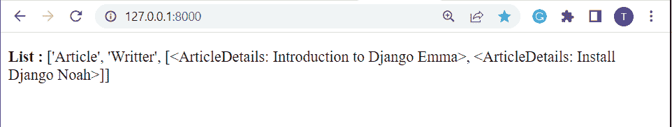

# Python 列表追加 Django

> 原文：<https://pythonguides.com/python-list-append-django/>

[](https://sharepointsky.teachable.com/p/python-and-machine-learning-training-course)

在这个 [Python Django 教程](https://pythonguides.com/how-to-install-django/)中，我们将学习**如何在 Django** 中追加列表。我们还会看到与此相关的例子。这些是我们将在本教程中讨论的以下主题。

*   Python 列表追加 Django
*   Python 列表追加 Django 基本命令
*   Python 列表追加 Django 视图-字符串追加
*   Python 列表追加 Django 视图-数字追加
*   Python 列表附加 Django 视图-列表附加
*   Python Django 将 queryset 追加到列表中
*   Python Django 会话列表追加

目录

[](#)

*   [Python 列表追加 Django](#Python_list_append_Django "Python list append Django")
*   [Python 列表追加 Django 基本命令](#Python_list_append_Django_basic_commands "Python list append Django basic commands")
*   [Python 列表追加 Django 视图-字符串追加](#Python_list_append_Django_view-string_append "Python list append Django view-string append")
*   [Python 列表追加 Django 视图-编号追加](#Python_list_append_Django_view-number_append "Python list append Django view-number append")
*   [Python 列表附加 Django 视图-列表附加](#Python_list_append_Django_view-list_append "Python list append Django view-list append")
*   [Python Django 将 queryset 追加到列表中](#Python_Django_append_queryset_to_list "Python Django append queryset to list")
*   [Python Django 会话列表追加](#Python_Django_session_list_append "Python Django session list append")

## Python 列表追加 Django

在本节中，我们将学习在 python 中追加列表的基础知识。

在 Python 中， `append()` 函数将单个项目添加到现有列表中。它不会返回新的项目列表，但会将项目添加到现有列表的末尾。

在对列表调用 `append()` 方法后，列表的大小会增加 1。

**语法:**

```py
list_name.append(elements)
```

*   **元素:**`append()`方法接受单个元素作为输入参数，并将其追加到列表的末尾。

> ***注意:**数字、字符串、另一个列表、字典都可以追加到一个列表中。*

阅读: [Python Django 连接字符串](https://pythonguides.com/django-concatenate-string/)

## Python 列表追加 Django 基本命令

在这一节中，我们将学习在 Django 中追加列表的基本命令。

**创建项目:** 首先，我们需要创建一个 Django 项目**【书店】**。为此，请在终端中键入以下命令。

```py
django-admin startproject BookShop
```

**创建 APP:** 然后，我们再创建一个 Django App **【图书】**。为此，请在终端中键入以下命令。

```py
python manage.py startapp Books
```

**安装 APP:** 现在，将上面创建的 APP 包含在 `settings.py` 文件中。

```py
INSTALLED_APPS = [
    'django.contrib.admin',
    'django.contrib.auth',
    'django.contrib.contenttypes',
    'django.contrib.sessions',
    'django.contrib.messages',
    'django.contrib.staticfiles',
    'Books',
]
```

**创建模板:** 然后创建名为**模板**的文件夹。并且，在文件夹中添加 HTML 文件。

**添加模板:** 现在，将此文件夹添加到模板文件夹中的 `settings.py` 文件中。

```py
DIRS : ['Templates']
```

**项目 URL:**在**书店**的 `urls.py` 文件中添加以下代码。

```py
from django.contrib import admin
from django.urls import path, include

urlpatterns = [
    path('admin/', admin.site.urls),
    path('', include('Books.urls'))
]
```

**APP 网址:** 在**书籍**的 `urls.py` 文件中添加以下代码。

```py
from django.urls import path
from . import views
urlpatterns = [
path('', views.Books, name='Books'),
]
```

**创建表单:** 现在，将下面的代码添加到 `Books` app 的 `forms.py` 文件中，创建表单。

```py
from django import forms

class BooksForm(forms.Form):
    Author = forms.CharField()
    Book = forms.CharField()
    Price = forms.IntegerField()
```

`form.html`:将下面的代码添加到`form.html`文件中，创建一个表单。

```py
<!DOCTYPE html>  
<html lang="en">  
<head>  
    <meta charset="UTF-8">  
    <title>Index</title>  
</head>  
<body>  
<form method="POST" class="post-form" enctype="multipart/form-data">  
          
        {{ form.as_p }}  
        <button type="submit" class="save btn btn-default">Submit</button>  
</form>  
</body>  
</html> 
```

**index.html:** 将以下代码添加到【index.html】文件中。

```py
<!DOCTYPE html>
<html lang="en">
<head>
    <meta charset="UTF-8">
    <meta http-equiv="X-UA-Compatible" content="IE=edge">
    <meta name="viewport" content="width=device-width, initial-scale=1.0">
    <title>Document</title>
</head>
<body>
    <p>
       <b>Book List : </b> {{List}}
    </p>
</body>
</html>
```

阅读: [Python Django MySQL CRUD](https://pythonguides.com/python-django-mysql-crud/)

## Python 列表追加 Django 视图-字符串追加

在这一节中，我们将学习在 Django 中向列表添加字符串。

**创建视图:** 在 `views.py` 文件中添加以下代码。

```py
from django.shortcuts import render
from Books.forms import BooksForm

def Books(request):  
    if request.method == "POST":  
        form = BooksForm(request.POST)  
        if form.is_valid():  
            Author = form.cleaned_data['Author']
            Book = form.cleaned_data['Book']
            Price = form.cleaned_data['Price']
            print(Book)
            BookList = ['Moby Dick', 'War and Peace']
            print(BookList)
            BookList.append(Book)
            print(BookList)
            return render(request, 'index.html', {'List':BookList})
    else:  
        form = BooksForm()  
    return render(request,'form.html',{'form':form})
```

*   `append()` 函数是一个内置的 python 函数。
*   这里，它用于将字符串元素追加到列表的末尾。

**运行服务器:** 启动服务器，通过定义 URL 为 http://127.0.0.1:8000 来访问表单。


Python list append Django


Python list append Django view string append

阅读: [Python Django 表单验证](https://pythonguides.com/django-form-validation/)

## Python 列表追加 Django 视图-编号追加

在这一节中，我们将学习在 Django 的列表中添加数字。

**创建视图:** 在 `views.py` 文件中添加以下代码。

```py
from django.shortcuts import render
from Books.forms import BooksForm

def Books(request):  
    if request.method == "POST":  
        form = BooksForm(request.POST)  
        if form.is_valid():  
            Author = form.cleaned_data['Author']
            Book = form.cleaned_data['Book']
            Price = form.cleaned_data['Price']
            PriceList = [256, 598]
            PriceList.append(Price)
            print(PriceList)
            return render(request, 'index.html', {'List':PriceList})
    else:  
        form = BooksForm()  
    return render(request,'form.html',{'form':form})
```

*   `append()` 函数是一个内置的 python 函数。
*   这里，它用于将数字元素追加到列表的末尾。

**运行服务器:** 启动服务器，通过定义 URL 为 http://127.0.0.1:8000 来访问表单。


Python list append using Django


Python list append Django view number append

阅读:[模型 Django 上的联合操作](https://pythonguides.com/union-operation-on-models-django/)

## Python 列表附加 Django 视图-列表附加

在这一节中，我们将学习在 Django 的列表中添加一个列表。

**创建视图:** 在 `views.py` 文件中添加以下代码。

```py
from django.shortcuts import render
from Books.forms import BooksForm

def Books(request):  
    if request.method == "POST":  
        form = BooksForm(request.POST)  
        if form.is_valid():  
            Author = form.cleaned_data['Author']
            Book = form.cleaned_data['Book']
            Price = form.cleaned_data['Price']
            AuthorList = ['Homer','Nabokov']
            AuthorList.append(Author)
            BookList = ['The Odyssey','Lolita']
            BookList.append(Book)
            BookList.append(AuthorList)
            print(BookList)
            return render(request, 'index.html', {'List':BookList})
    else:  
        form = BooksForm()  
    return render(request,'form.html',{'form':form})
```

*   `append()` 函数是一个内置的 python 函数。
*   这里，它用于将列表附加到列表的末尾。

**运行服务器:** 启动服务器，通过定义 URL 为 http://127.0.0.1:8000 来访问表单。


Python Django list append


Python list append Django view list append

阅读: [Python 过滤器不在 Django 中](https://pythonguides.com/filter-not-in-django/)

## Python Django 将 queryset 追加到列表中

在这一节中，我们将学习在 Django 中将 queryset 追加到 list 中。

**创建项目:** 首先，我们需要创建一个 Django 项目**【article club】**。为此，请在终端中键入以下命令。

```py
django-admin startproject ArticleClub
```

**创建 APP:** 然后，我们再创建一个 Django App **【文章】**。为此，请在终端中键入以下命令。

```py
python manage.py startapp Articles
```

**安装 APP:** 现在，将上面创建的 APP 包含在 `settings.py` 文件中。

```py
INSTALLED_APPS = [
    'django.contrib.admin',
    'django.contrib.auth',
    'django.contrib.contenttypes',
    'django.contrib.sessions',
    'django.contrib.messages',
    'django.contrib.staticfiles',
    'Articles',
]
```

**创建并添加模板:** 然后创建名为**模板**的文件夹，并将该文件夹添加到 settings.py 文件中。并且，在文件夹中添加 HTML 文件。

**项目网址:** 在**文章**的 `urls.py` 文件中添加以下代码。

```py
from django.contrib import admin
from django.urls import path, include

urlpatterns = [
    path('admin/', admin.site.urls),
    path('',include('Articles.urls'))
] 
```

**APP 网址:** 在**文章**的 `urls.py` 文件中添加以下代码。

```py
from django.urls import path
from . import views
urlpatterns = [
path('', views.Article, name='Article'),
]
```

**创建模型:** 现在，将下面的代码添加到**文章** app 的 `models.py` 文件中，创建模型。

```py
from django.db import models

class ArticleDetails(models.Model):
    Article = models.CharField(max_length=200)
    Writter = models.CharField(max_length=50)

    def __str__(self):  
        return "%s %s" % (self.Article, self.Writter) 
```

**创建表单:** 现在，将下面的代码添加到**文章** app 的 `forms.py` 文件中，创建表单。

```py
from django import forms  
from .models import ArticleDetails

class ArticleDetailsForm(forms.ModelForm):  
    class Meta:  
        model = ArticleDetails 
        fields = "__all__" 
```

**form.html:** 将下面的代码添加到【form.html】文件中，创建一个表单。

```py
<!DOCTYPE html>  
<html lang="en">  
<head>  
    <meta charset="UTF-8">  
    <title>Index</title>  
</head>  
<body>  
<form method="POST" class="post-form" enctype="multipart/form-data">  
          
        {{ form.as_p }}  
        <button type="submit" class="save btn btn-default">Submit</button>  
</form>  
</body>  
</html> 
```

**index.html:** 将以下代码添加到【index.html】文件中。

```py
<!DOCTYPE html>
<html lang="en">
<head>
    <meta charset="UTF-8">
    <meta http-equiv="X-UA-Compatible" content="IE=edge">
    <meta name="viewport" content="width=device-width, initial-scale=1.0">
    <title>Document</title>
</head>
<body>
    <p>
       <b>List : </b> {{list}}
    </p>
</body>
</html>
```

**创建视图:** 在 `views.py` 文件中添加以下代码。

```py
from django.shortcuts import render
from .forms import ArticleDetailsForm
from .models import ArticleDetails

def Article(request):
    article = ArticleDetails.objects.all()
    articles_list = list(article)
    new_list = ['Article','Writter']
    new_list.append(articles_list)
    if request.method == 'POST':
        form = ArticleDetailsForm(request.POST)
        if form.is_valid():
            form.save()
            return render(request, 'index.html', {'list':new_list})
    else:
        form = ArticleDetailsForm
    return render(request,'form.html',{'form':form})
```

**运行服务器:** 启动服务器，通过定义 URL 为 http://127.0.0.1:8000 来访问表单。


list append using Python Django



Django append queryset to list

阅读:[在 Python Django 中登录系统](https://pythonguides.com/login-system-in-python-django/)

## Python Django 会话列表追加

在这一节中，我们将学习使用 Django 在列表中追加会话。

**创建项目:** 首先，我们需要创建一个 Django 项目**‘session PROJECT’**。为此，请在终端中键入以下命令。

```py
django-admin startproject SessionProject
```

**创建 APP:** 然后，我们再创建一个 Django APP**【session APP】**。为此，请在终端中键入以下命令。

```py
python manage.py startapp SessionApp 
```

**创建并添加模板:** 然后创建名为**模板**的文件夹，并将该文件夹添加到 `settings.py` 文件中。并且，在文件夹中添加 HTML 文件。

**项目 URL:**在 `SessionApp` 的 `urls.py` 文件中添加以下代码。

```py
from django.contrib import admin
from django.urls import path, include

urlpatterns = [
    path('admin/', admin.site.urls),
    path('', include('SessionApp.urls'))
]
```

**APP 网址:** 在 `SessionApp` 的 `urls.py` 文件中添加以下代码。

```py
from django.urls import path
from . import views
urlpatterns = [
path('set/', views.setsession, name='SetSession'),
path('get/', views.getsession, name='GetSession'),
]
```

**getsession.html:** 将下面的代码添加到【getsession.html】文件中，创建一个表单。

```py
<!DOCTYPE html>
<html lang="en">
<head>
    <meta charset="UTF-8">
    <meta http-equiv="X-UA-Compatible" content="IE=edge">
    <meta name="viewport" content="width=device-width, initial-scale=1.0">
    <title>Get Session</title>
</head>
<body>
    <h4>Get Session</h4>
    {{list}}
</body>
</html>
```

**创建视图:** 在 `views.py` 文件中添加以下代码。

```py
from django.shortcuts import render
from django.http import HttpResponse

# Create Session
def setsession(request):
    request.session['session_name'] = 'Welcome'
    return HttpResponse('<h1>Created</h1>') 

# Get Session
def getsession(request):
    name = request.session.get('session_name', default='Guest')
    list = ['Old Sessions']
    list.append(name)
    return render(request, 'getsession.html', {'list':list}) 
```

*   首先，我们创建一个名为 `Welcome` 的会话。
*   之后，我们得到一个已创建的会话，并将其添加到列表中。
*   最后，我们将追加的列表呈现给 HTML 模板。

**运行服务器:** 启动服务器，通过定义 URL 为 http://127.0.0.1:8000/set 访问表单。


Python Django session list append


session list append using Python Django

另外，看看更多的 Python Django 教程。

*   [Python Django 设置时区](https://pythonguides.com/python-django-set-timezone/)
*   [在 Django 中运行 Python 脚本](https://pythonguides.com/run-python-script-in-django/)
*   [Python Django 随机数](https://pythonguides.com/django-random-number/)
*   [Python 改 Django 版本](https://pythonguides.com/python-change-django-version/)
*   [Python Django vs 金字塔](https://pythonguides.com/python-django-vs-pyramid/)

在这个 Python Django 教程中，我们已经讨论了`Python``list append Django`，我们还讨论了本教程中的以下主题。

*   Python 列表追加 Django
*   Python 列表追加 Django 基本命令
*   Python 列表追加 Django 视图-字符串追加
*   Python 列表追加 Django 视图-数字追加
*   Python 列表附加 Django 视图-列表附加
*   Python Django 将 queryset 追加到列表中
*   Python Django 会话列表追加

[Bijay Kumar](https://pythonguides.com/author/fewlines4biju/)

Python 是美国最流行的语言之一。我从事 Python 工作已经有很长时间了，我在与 Tkinter、Pandas、NumPy、Turtle、Django、Matplotlib、Tensorflow、Scipy、Scikit-Learn 等各种库合作方面拥有专业知识。我有与美国、加拿大、英国、澳大利亚、新西兰等国家的各种客户合作的经验。查看我的个人资料。

[enjoysharepoint.com/](https://enjoysharepoint.com/)[](https://www.facebook.com/fewlines4biju "Facebook")[](https://www.linkedin.com/in/fewlines4biju/ "Linkedin")[](https://twitter.com/fewlines4biju "Twitter")