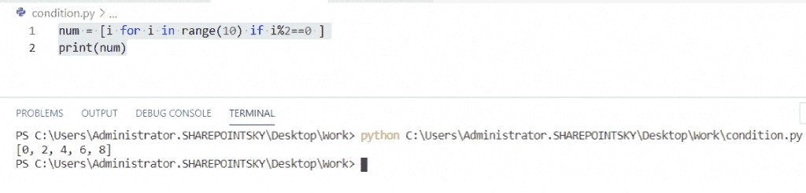
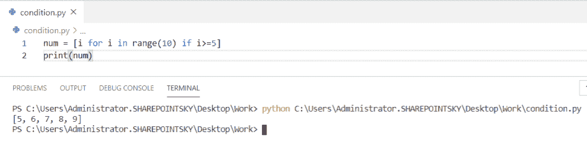
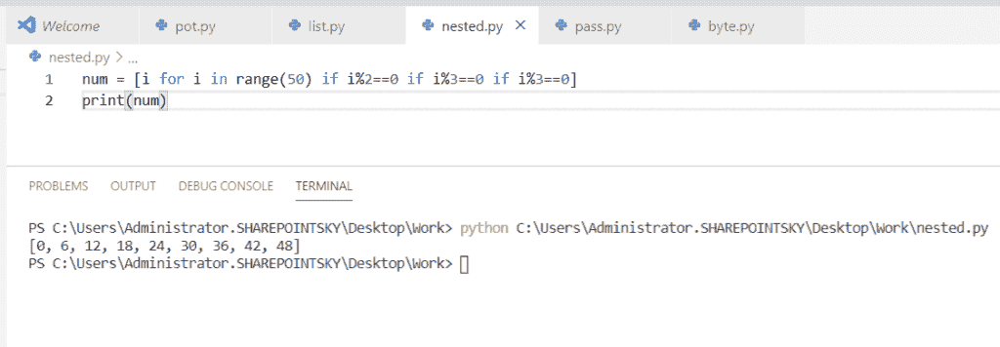
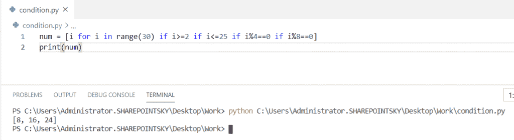
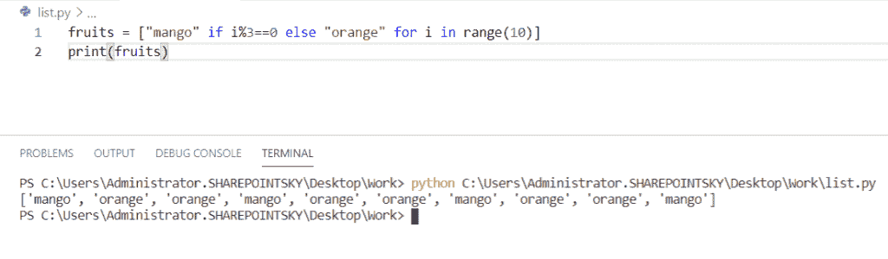
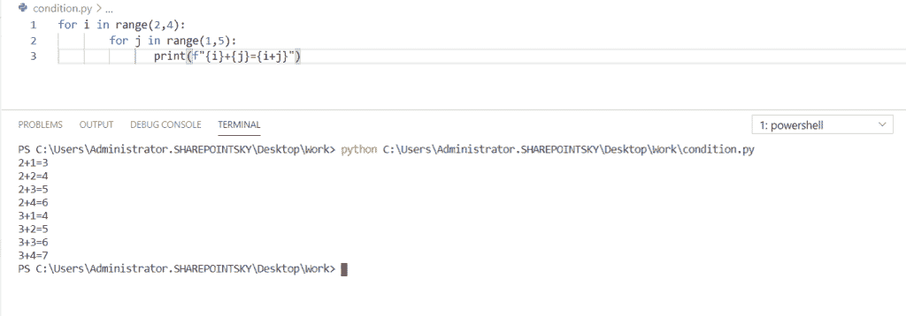
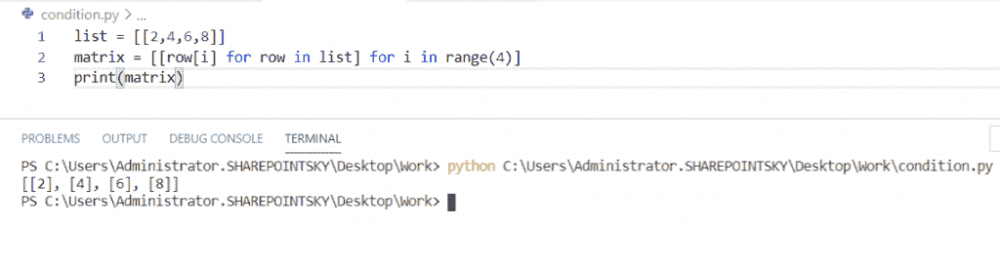

# 使用 if-else 理解 Python 列表

> 原文：<https://pythonguides.com/python-list-comprehension-using-if-else/>

[](https://sharepointsky.teachable.com/p/python-and-machine-learning-training-course)

在本 [Python 教程](https://pythonguides.com/python-programming-for-the-absolute-beginner/)中，我们将使用 if-else 学习 **python 列表理解，我们还将涉及以下主题:**

*   使用 if 语句理解 Python 列表
*   使用 if 不带 else 的 Python 列表理解
*   使用嵌套 if 语句理解 Python 列表
*   使用多个 if 语句理解 Python 列表
*   用 if-else 理解 Python 列表
*   使用嵌套 for 循环理解 Python 列表
*   Python 列表理解转置行和列

目录

[](#)

*   [使用 if 语句理解 Python 列表](#Python_list_comprehension_using_if_statement "Python list comprehension using if statement")
*   [使用 if 而不使用 else 的 Python 列表理解](#Python_list_comprehension_using_if_without_else "Python list comprehension using if without else")
*   [使用嵌套 if 语句理解 Python 列表](#Python_list_comprehension_using_nested_if_statement "Python list comprehension using nested if statement")
*   [使用多个 if 语句理解 Python 列表](#Python_list_comprehension_using_multiple_if_statement "Python list comprehension using multiple if statement")
*   [用 if-else 理解 Python 列表](#Python_list_comprehension_with_if-else "Python list comprehension with if-else ")
*   [使用嵌套 for 循环理解 Python 列表](#Python_list_comprehension_using_nested_for_loop "Python list comprehension using nested for loop")
*   [Python list comprehension 转置行和列](#Python_list_comprehension_transposes_rows_and_columns "Python list comprehension transposes rows and columns")

## 使用 if 语句理解 Python 列表

在这里，我们可以看到在 Python 中使用 if 语句的**列表理解。**

在本例中，我将一个变量作为 `num` ，并使用**进行循环**进行迭代，并分配一个范围 `10` ，如果 i%2==0 ，则 if 条件用作**。为了得到输出，我使用了 `print(num)` 。**

示例:

```py
num = [i for i in range(10) if i%2==0 ]
print(num)
```

在输出中，您可以看到列表形式的数字，范围最大为 10。您可以参考下面的输出截图。



Python list comprehension using if statements

*   [Python While 循环](https://pythonguides.com/python-while-loop/)
*   [Python For 循环](https://pythonguides.com/python-for-loop/)

## 使用 if 而不使用 else 的 Python 列表理解

现在，我们可以看到在 Python 中使用 if without else 的**列表理解。**

在本例中，我将一个**变量作为 num** ，如果使用了 I>= 5，则**num =【I for I in range(10)】，对于**迭代**，我将**用于` `循环**，并分配了一个范围 10，然后如果条件被用作 **if > =5** 。为了得到输出，我使用了 `print(num)` 。**

示例:

```py
num = [i for i in range(10) if i>=5]
print(num)
```

输出以列表的形式显示，您可以看到列表中大于或等于 5 的数字。您可以参考下面的输出截图。



Python list comprehension using if without else

## 使用嵌套 if 语句理解 Python 列表

现在，我们可以看到在 Python 中使用嵌套 if 语句对**列表的理解。**

*   在这个例子中，我取了一个变量 num 。使用**num =[I for I in range(50)if I % 2 = = 0 if I % 3 = = 0 if I % 3 = = 0]**。对于**迭代**，我使用**进行循环**
*   并赋值一个范围 50 和多个 if 条件作为`if`**I % 2 = = 0 if I % 3 = = 0 if I % 3 = = 0**，打印我用过的数字 `print(num)` 。

示例:

```py
num = [i for i in range(50) if i%2==0 if i%3==0 if i%3==0]
print(num)
```

这里，给定范围内满足所有三个 **if 条件**的数字将以列表格式输出。下面的截图显示了输出。



Python list comprehension using nested if statement

## 使用多个 if 语句理解 Python 列表

现在，我们可以看到在 Python 中使用多个 if 语句的**列表理解。**

*   在这个例子中，我取了一个**变量= num** ，这里，循环的**用于迭代，并被赋予 30 的范围。**
*   多个 if 语句被用作**num =[I for I in range(30)if I>= 2 if I<= 25 if I % 4 = = 0 if I % 8 = = 0]**。为了打印数字，我使用了 **print(num)。**

示例:

```py
num = [i for i in range(30) if i>=2 if i<=25 if i%4==0 if i%8==0]
print(num)
```

给定范围内**满足**所有**倍数 if 条件**的数字以**列表格式**打印输出。下面的截图显示了输出。



Python list comprehension using multiple if statement

## 用 if-else 理解 Python 列表

在这里，我们可以看到 Python 中用 if else 对**列表的理解。**

*   在这个例子中，我有一个变量作为**水果**，if-else 条件作为 **i%3==0** ，如果条件为真，那么结果将是**芒果` else `橙**。
*   这里， `for loop` 用于**迭代，**为了得到输出，我使用了 `print(fruits)` 。

示例:

```py
fruits = ["mango" if **i%3==0** else "orange" for i in range(10)]
print(fruits)
```

我们可以看到，在列表格式中，当 if 条件为真时，输出为**芒果，当 else 条件为真**时，输出为**橙色。您可以参考下面的输出截图。**



Python list comprehension with if-else

## 使用嵌套 for 循环理解 Python 列表

现在，我们可以看到在 Python 中使用嵌套的 for 循环来理解**列表。**

*   在此示例中，使用了多个 for 循环。给定范围从 **2 到 4** ，for 循环用于迭代。
*   循环的第一个**作为范围(2，4)**内 I 的**，循环**的另一个**作为范围(1，5)**内 j 的
*   **对这两个循环执行加法运算作为**print(f " { I }+{ j } = { I+j } "**。**
*   **为了打印添加的数字，我使用了**print(f " { I }+{ j } = { I+j } "**。**

 **示例:

```py
for i in range(2,4):
        for j in range(1,5):
               print(f"{i}+{j}={i+j}")
```

在输出中，您可以看到从给定范围添加了个数字**。您可以参考下面的输出截图。**



Python list comprehension using nested for loop

## Python list comprehension 转置行和列

在这里，我们可以看到 **list comprehension 在 Python 中转置行和列**。

*   在这个例子中，我采用了一个列表作为 **list = [[2，4，6，8]]** ，并将这个矩阵转置为行和列。我用**循环**进行**迭代**。
*   我采用了**矩阵=[[row[I]for row in list]for I in range(4)]**，range 给定为 4。
*   为了得到矩阵输出，我使用了 `print(matrix)` 。

示例:

```py
list = [[2,4,6,8]]
matrix = [[row[i] for row in list] for i in range(4)]
print(matrix)
```

我们可以在下面的屏幕截图中看到这四个矩阵的输出。



Python list comprehension transposes rows and columns

您可能会喜欢以下 Python 教程:

*   [Python Tkinter Stopwatch](https://pythonguides.com/python-tkinter-stopwatch/)
*   [Python 读取二进制文件](https://pythonguides.com/python-read-a-binary-file/)
*   [如何使用 Turtle 在 python 中绘制形状](https://pythonguides.com/turtle-programming-in-python/)
*   [如何将 Python 字符串转换成字节数组](https://pythonguides.com/python-string-to-byte-array/)
*   [Python 要求用户输入](https://pythonguides.com/python-ask-for-user-input/)
*   [Python 从列表中选择](https://pythonguides.com/python-select-from-a-list/)
*   [Python 通过引用或值传递示例](https://pythonguides.com/python-pass-by-reference-or-value/)
*   [Python 列表理解λ](https://pythonguides.com/python-list-comprehension/)

在本教程中，我们已经学习了使用 if-else 理解 **Python 列表，并且我们已经涵盖了以下主题:**

*   使用 if 语句理解 Python 列表
*   使用 if 不带 else 的 Python 列表理解
*   使用嵌套 if 语句理解 Python 列表
*   使用多个 if 语句理解 Python 列表
*   用 if-else 理解 Python 列表
*   使用嵌套 for 循环理解 Python 列表
*   Python 列表理解转置行和列

[Bijay Kumar](https://pythonguides.com/author/fewlines4biju/)

Python 是美国最流行的语言之一。我从事 Python 工作已经有很长时间了，我在与 Tkinter、Pandas、NumPy、Turtle、Django、Matplotlib、Tensorflow、Scipy、Scikit-Learn 等各种库合作方面拥有专业知识。我有与美国、加拿大、英国、澳大利亚、新西兰等国家的各种客户合作的经验。查看我的个人资料。

[enjoysharepoint.com/](https://enjoysharepoint.com/)[](https://www.facebook.com/fewlines4biju "Facebook")[](https://www.linkedin.com/in/fewlines4biju/ "Linkedin")[](https://twitter.com/fewlines4biju "Twitter")**