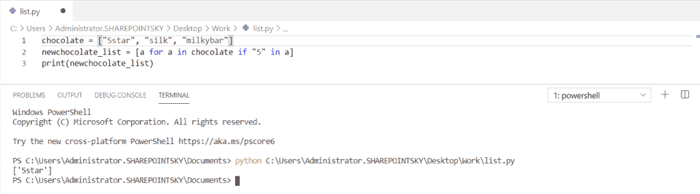
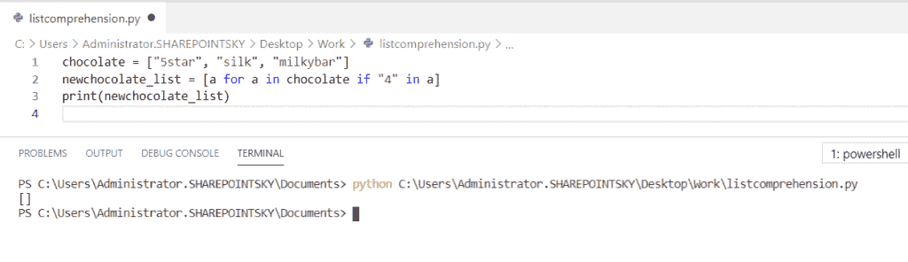
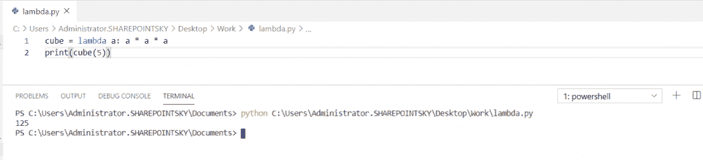
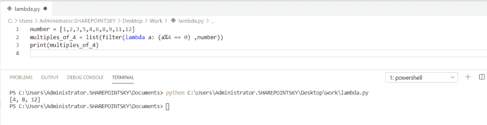
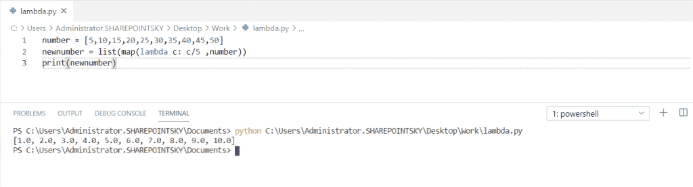
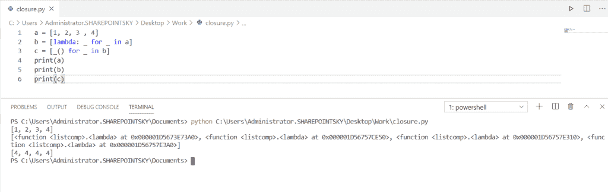

# Python 列表理解 lambda

> 原文：<https://pythonguides.com/python-list-comprehension/>

[](https://sharepointsky.teachable.com/p/python-and-machine-learning-training-course)

在本 Python 教程中，我们将讨论关于 **Python 列表理解**。

*   什么是 Python 列表理解？
*   lambda 是什么？
*   使用过滤器()的 Lambda 函数
*   使用 map()的 Lambda 函数
*   Python 列表理解 lambda 闭包
*   Python 列表理解 vs lambda
*   Python 列表理解与地图

目录

[](#)

*   [什么是 Python 列表理解？](#What_is_Python_list_comprehension "What is Python list comprehension?                         ")
*   [列表理解](#List_comprehension "List comprehension")
*   [Python 中 lambda 是什么？](#What_is_lambda_in_Python "What is lambda in Python?")
*   [Python Lambda 函数使用 filter()](#Python_Lambda_function_using_filter "Python Lambda function using filter()")
*   [Python Lambda 函数使用 map()](#Python_Lambda_function_using_map "Python Lambda function using map()")
*   [Python 列表理解 lambda 闭包](#Python_list_comprehension_lambda_closure "Python list comprehension lambda closure")
*   [Python 列表理解 vs lambda](#Python_list_comprehension_vs_lambda "Python list comprehension vs lambda")
*   [Python 列表理解 vs 地图](#Python_list_comprehension_vs_map "Python list comprehension vs map")

## 什么是 Python 列表理解？

列表理解用于**基于现有列表**创建新列表。列表理解是用来处理列表的。列表理解**返回列表**，其中包含**表达式和括号**。

Python 列表理解的语法

```py
[expression for item in list if condition == True]
```

## 列表理解

在这个例子中，我将一个**列表作为巧克力**和**，如果条件被使用**。在这里，**如果条件为真**。所以它返回了一个新的列表。

示例:

```py
chocolate = ["5star", "silk", "milkybar"]
newchocolate_list = [a for a in chocolate if "5" in a]
print(newchocolate_list)
```

你可以参考下面的输出截图，我们可以看到新的列表。



Python list comprehension

现在，我们将检查如果这些项目不在列表中会发生什么。然后，它将返回一个空列表，因为 **if 条件不为真**。你可以参考下面的截图。



Python list comprehension

阅读[如何在 Python Pygame 中把屏幕放在特定位置](https://pythonguides.com/how-to-put-screen-in-specific-spot-in-python-pygame/)

## Python 中 lambda 是什么？

Lambda 是一个没有名字的函数。通常在 python 中**函数**是用**关键字 def** 定义的，但是**匿名函数**是由**关键字 lambda** 定义的。lambda 函数与内置函数 `map()` ， `filter()` 一起使用。

在这个例子中，我们可以看到**如何使用 lambda 函数找到给定数字**的立方**。**

示例:

```py
cube = lambda a: a * a * a
print(cube(5))
```

在下面的截图中，您可以看到输出:



What is lambda in Python

## Python Lambda 函数使用 filter()

*   在这个例子中，我取了一个数字列表，并在其中指定了从 1 到 12 的值。
*   用列表中的所有项目调用 `filter()` 函数，并返回一个新列表。
*   然后我们可以使用过滤器()使用 **lambda 函数从列表中获取 4 的倍数。**

示例:

```py
number = [1,2,3,5,4,6,8,9,11,12]
multiples_of_4 = list(filter(lambda a: (a%4 == 0) ,number))
print(multiples_of_4)
```

下面的截图显示了输出，我们可以从输出列表中看到 4 的倍数:



Lambda function using filter()

## Python Lambda 函数使用 map()

*   在本例中，我将列表的名称作为数字，并分配了 5 的倍数，使用 **map()将每个数字除以 5。**
*   使用列表中的所有项目调用 map()，并返回一个新列表。

示例:

```py
number = [5,10,15,20,25,30,35,40,45,50]
newnumber = list(map(lambda c: c/5 ,number))
print(newnumber)
```

您可以参考下面的输出截图:



Lambda function using map()

## Python 列表理解 lambda 闭包

*   闭包用于全局创建资源，并在函数中重用它以避免性能问题。
*   闭包只能在嵌套函数中使用。当我们调用 lambda 函数时，它将从封闭的名称空间中获取' **_'** 值。
*   当 lambda 对象被创建时，它将不接受' _ '值。“_”值位于命名空间中。
*   在这个例子中，我已经使用了 **c = [_() for _ in b]** 。它在这里可以工作，因为除了原始输入之外，所有名称都使用了新的名称空间。
*   在**b =【lambda:_ for _ in a】**这里我对循环目标使用了不同的名字，我们并没有屏蔽掉封闭的名字。
*   **'_ '值**保留在 namescope 中，4 次返回值 4。

示例:

```py
a = [1, 2, 3 , 4]
b = [lambda: _ for _ in a]
c = [_() for _ in b]
print(a)
print(b)
print(c)
```

在这个输出中，我们可以看到最后一个元素返回了 4 次。



Python list comprehension lambda closure

## Python 列表理解 vs lambda

让我们看看 Python 列表理解和 lambda 的**区别。**

*   列表理解用于创建列表。
*   Lambda 函数的过程与其他函数相同，返回列表中的值。
*   列表理解比 lambda 函数更易于阅读。
*   用户可以很容易地理解在哪里使用列表理解。
*   列表理解性能比 lambda 好，因为 lambda 中的 filter()比列表理解慢。

## Python 列表理解 vs 地图

让我们试着去理解 **Python 列表理解 vs 地图**。

*   列表理解允许过滤，地图中没有过滤。
*   List comprehension 返回结果列表，而 map 只返回 map 对象。
*   map 调用已定义函数更快，而 lambda 不需要调用已定义函数。
*   与列表理解相比，地图表现更好。

您可能会喜欢以下 Python 教程:

*   [Python 线程和多线程](https://pythonguides.com/python-threading-and-multithreading/)
*   [如何将字符串追加到列表 Python 的开头](https://pythonguides.com/append-string-to-beginning-of-list-python/)
*   [如何将 Python 角度转换为弧度](https://pythonguides.com/python-degrees-to-radians/)
*   [Python 比较运算符](https://pythonguides.com/python-comparison-operators/)
*   [Python 命名空间教程](https://pythonguides.com/python-namespace-tutorial/)
*   [Python Tkinter 帧](https://pythonguides.com/python-tkinter-frame/)
*   [如何用 Python 制作矩阵](https://pythonguides.com/make-a-matrix-in-python/)
*   [如何用 Python 显示日历](https://pythonguides.com/display-calendar-in-python/)
*   [Python 中的链表](https://pythonguides.com/linked-lists-in-python/)
*   [Python 中的转义序列](https://pythonguides.com/escape-sequence-in-python/)
*   [Python 接口介绍](https://pythonguides.com/python-interface/)
*   [Python 要求用户输入](https://pythonguides.com/python-ask-for-user-input/)

在本 Python 教程中，我们学习了 **Python 列表理解 lambda** 。此外，我们还讨论了以下主题:

*   什么是 Python 列表理解？
*   lambda 是什么？
*   使用过滤器()的 Lambda 函数
*   使用 map()的 Lambda 函数
*   Python 列表理解 lambda 闭包
*   Python 列表理解 vs lambda
*   Python 列表理解与地图

[Bijay Kumar](https://pythonguides.com/author/fewlines4biju/)

Python 是美国最流行的语言之一。我从事 Python 工作已经有很长时间了，我在与 Tkinter、Pandas、NumPy、Turtle、Django、Matplotlib、Tensorflow、Scipy、Scikit-Learn 等各种库合作方面拥有专业知识。我有与美国、加拿大、英国、澳大利亚、新西兰等国家的各种客户合作的经验。查看我的个人资料。

[enjoysharepoint.com/](https://enjoysharepoint.com/)[](https://www.facebook.com/fewlines4biju "Facebook")[](https://www.linkedin.com/in/fewlines4biju/ "Linkedin")[](https://twitter.com/fewlines4biju "Twitter")