# 11 种 Python 列表方法

> 原文：<https://pythonguides.com/python-list-methods/>

[](https://sharepointsky.teachable.com/p/python-and-machine-learning-training-course)

在这个 [python 教程](https://pythonguides.com/python-hello-world-program/)中，你将学习 Python 中不同的内置**列表方法，用于修改列表。在这里，我们将看到各种各样的 **python 列表方法**，它们可以在 [Python 列表](https://pythonguides.com/create-list-in-python/)中使用。下面我们将检查 **Python 列表方法**。**

*   Python 列表方法
*   Python 列表 append()方法
*   Python 列表扩展()方法
*   Python 列表 insert()方法
*   Python 列表 remove()方法
*   Python 列表计数()方法
*   Python 列表 clear()方法
*   Python 列表 copy()方法
*   Python 列表索引()方法
*   Python List reverse()方法
*   Python 列表 pop()方法
*   Python 列表排序()方法
*   Python list len()方法

目录

[](#)

*   [Python 列表方法](#Python_list_methods "Python list methods")
*   [Python 列表 append()方法](#Python_List_append_method "Python List append() method")
*   [Python List extend()方法](#Python_List_extend_method "Python List extend() method")
*   [Python List insert()方法](#Python_List_insert_method "Python List insert() method")
*   [Python List remove()方法](#Python_List_remove_method "Python List remove() method")
*   [Python List count()方法](#Python_List_count_method "Python List count() method")
*   [Python List clear()方法](#Python_List_clear_method "Python List clear() method")
*   [Python List copy()方法](#Python_List_copy_method "Python List copy() method")
*   [Python List index()方法](#Python_List_index_method "Python List index() method")
*   [Python List reverse()方法](#Python_List_reverse_method "Python List reverse() method")
*   [Python List pop()方法](#Python_List_pop_method "Python List pop() method")
*   [Python List sort()方法](#Python_List_sort_method "Python List sort() method")
*   [Python List len()方法](#Python_List_len_method "Python List len() method")

## Python 列表方法

在这里，我们将看到各种各样的 **python 列表方法**，它们对于在 python 中使用 list 非常有用。

## Python 列表 append()方法

在 python 中， **append()方法**将单个元素添加到现有列表的末尾。

**举例:**

```py
vegetable = ['Corn', 'Tomato', 'Broccoli']
vegetable.append('Cucumber')
print(vegetable)
```

写完上面的代码(python list append 方法)，你将打印出**"蔬菜"**，然后输出将显示为 **"['玉米'，'番茄'，'西兰花'，'黄瓜']"** 。在这里，我添加了黄瓜，它被添加到列表中。创建 python 列表 append()可以参考下面的截图。

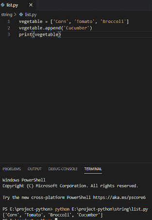

Python List append() method

如果我们想在列表中添加不止一个元素，那么它会生成一个列表列表，我们可以看到下面的截图。

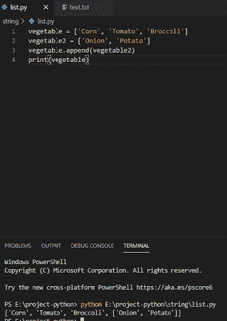

## Python List extend()方法

python 3 中的 **extend()方法将 iterable 的所有元素添加到列表的末尾。extend 方法将一个列表中的所有值相加。**

**举例:**

```py
color = ['Red', 'Pink', 'Orange']
color2 = ['Blue', 'Yellow']
color.extend(color2)
print(color)
```

写完上面的代码(python list extend)，你将打印出 `"color"` ，然后输出将显示为 **"['红色'，'粉色'，'橙色'，'蓝色'，'黄色]"** 。这里，我扩展了 color2，它扩展了列表。创建 python 列表 append()可以参考下面的截图。

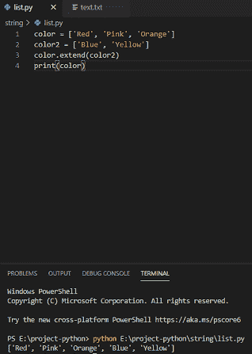

Python List extend() method

你可能喜欢用 [Python 程序来反转一个字符串的例子](https://pythonguides.com/python-program-to-reverse-a-string/)。

## Python List insert()方法

**Python list insert()方法**用于在列表中给定的索引处插入元素。我们知道列表中的元素从索引 0 开始。

**举例:**

```py
name = ['Rita', 'Pinky', 'Babita']
name.insert(1, 'Mini')
print(name)
```

写完上面的代码(python list insert)，你将打印出 `"name"` ，然后输出将显示为 **"['丽塔'，'迷你'，' Pinky '，'巴比塔']"** 。这里，我给了索引 1 来插入元素。创建 python list insert()方法可以参考下面的截图。

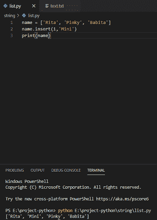

Python List insert() methods

## Python List remove()方法

Python 中的 **remove()方法从列表中删除匹配的元素。它将在列表中搜索给定的元素，如果给定的元素匹配，那么它将被删除。**

**举例:**

```py
roll = [1,2,3,4,5]
roll.remove(3)
print(roll)
```

写完上面的代码(python list remove)，你将打印出**【roll】**，然后输出将显示为**【1，2，4，5】**。在这里，3 个已经从列表中删除。创建 python list remove()方法可以参考下面的截图。

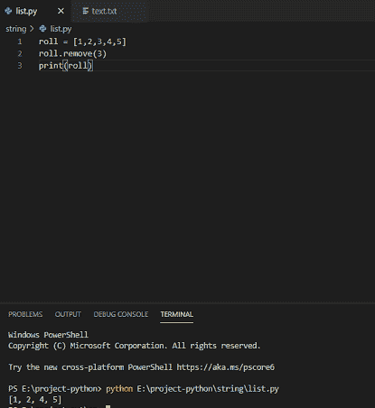

Python List remove() method

## Python List count()方法

Python list count()方法用于计算列表中特定元素的数量。

**举例:**

```py
place = ['Delhi', 'Bangalore', 'kolkata', 'Delhi']
value = place.count('Delhi')
print(value)
```

写完上面的代码(python 列表计数)，你将打印出 `"value"` ，然后输出将显示为 `" 2 "` 。这里，德里两次出现在列表中。创建 python list count()方法可以参考下面的截图。

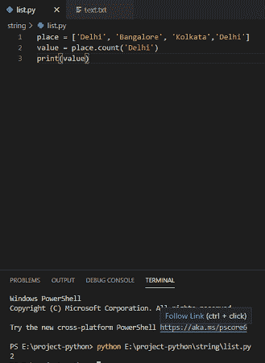

Python List count() method

## Python List clear()方法

python list clear()方法清除列表中的所有元素。clear()方法不带任何参数。

**举例:**

```py
place = ['Delhi', 'Bangalore', 'kolkata']
place.clear()
print(place)
```

写完上面的代码(python list clear)，你将打印出 `"place"` ，然后输出将显示为 **"[ ] "** 。这里，它清除列表，不返回值。创建 python list count()方法可以参考下面的截图。

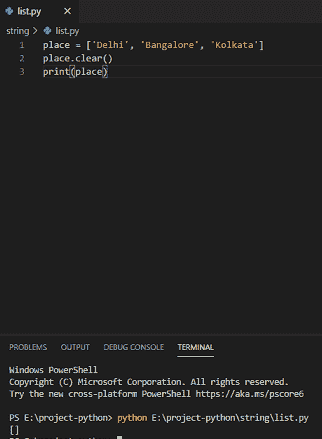

Python List clear() method

## Python List copy()方法

Python list 中的 **copy()方法返回新列表，完全一样。copy()方法不带任何参数。**

**举例:**

```py
chocolate = ['Kitkat', 'Bournville', 'Snickers']
chocolate.copy()
print(chocolate)
```

写完上面的代码(python 列表清除)，你将打印出 `"chocolate"` ，然后输出将显示为 **"[ 'Kitkat '，' Bournville '，' Snickers'` `] "** 。这里，复制方法复制列表，它返回列表中存在的相同元素。创建 python list count()方法可以参考下面的截图。

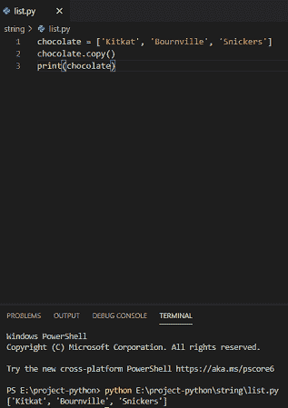

Python List copy() method

## Python List index()方法

**Python list index()方法**从列表中返回指定元素的索引。index 方法接受参数。

**举例:**

```py
flower = ['Flora', 'Hana', 'Rose']
name = flower.index('Hana')
print(name)
```

写完上面的代码后(python 列表清空)，你将打印出**【name】**，然后输出将显示为**【1】**。这里，它给出了列表中指定值的索引。创建 python list count()方法可以参考下面的截图。

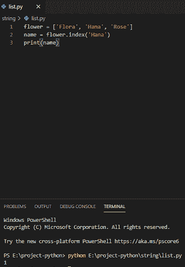

Python List index() method

## Python List reverse()方法

**Python list reverse()方法**用于反转列表中的元素。

**举例:**

```py
emp_id =[12,13,14,15]
emp_id.reverse()
print(emp_id)
```

写完上面的代码(python list reverse)，你将打印出 `"emp_id"` ，然后输出将显示为 **"[15，14，13，12 ] "** 。这里，它将反转整个列表元素。创建 python list count()方法可以参考下面的截图。

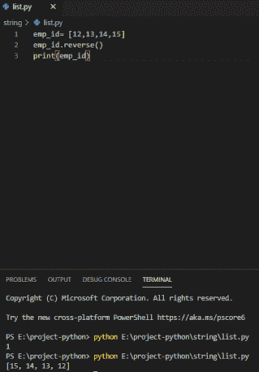

Python List reverse() method

## Python List pop()方法

Python list 中的 **pop()方法用于从列表的给定索引中移除指定项。**

**举例:**

```py
emp_id = [12,13,14,15]
emp_id.pop(1)
print(emp_id)
```

写完上面的代码(python list clear)，你将打印出 `"emp_id"` ，然后输出将显示为 **"[ 12，14，15 ] "** 。这里，它将弹出索引 1 的值 13。创建 python list count()方法可以参考下面的截图。

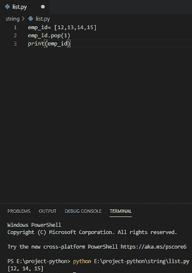

Python List pop() method

## Python List sort()方法

Python list sort()方法用于默认情况下对列表进行升序排序，不需要额外的参数来排序。

**举例:**

```py
bike = ['Splendor', 'Royal Enfield', 'Pulsar']
bike.sort()
print(bike)
```

写完上面的代码(python 列表清空)，你将打印出 `"bike"` ，然后输出将显示为 **"[ 'Pulsar '，' Royal Enfield '，' spread ']"**。在这里，它按升序对列表进行排序。你可以参考下面的截图来创建一个 python list count()方法

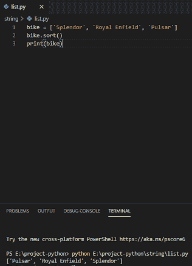

Python List sort() method

也可以使用内置的 sort()方法对其进行降序排序()。通过给定参数“reverse=True”。

**举例:**

```py
bike = ['Splendor', 'Royal Enfield', 'Pulsar']
bike.sort(reverse=True)
print(bike)
```

创建降序的 python list sort()方法可以参考下面的截图。

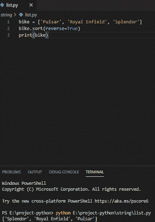

sort()方法还用于根据列表中值的长度对列表进行排序。

**举例:**

```py
def Function(e):
return len(e)
bike = ['Pulsar', 'Royal Enfield', 'Splendor']
bike.sort(key=Function)
print(bike)
```

可以参考下面的截图，创建一个 python list sort()方法，根据值的长度排列元素。

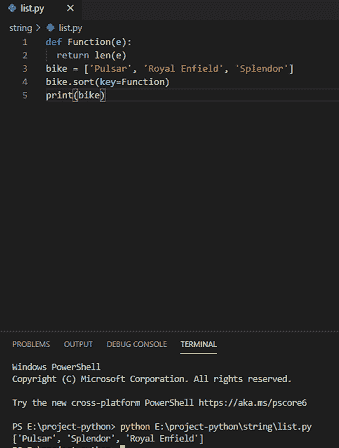

## Python List len()方法

在 python 中，内置的 `len()` **方法**用于获取列表中元素的总数。在列表中，项目可以是数字和字符串的组合。

**举例:**

```py
my_list = [20, 34, 39, 'Apple', 'Mango', 'Orange']
print(" The length is: ", len(my_list))
```

写完上面的代码(Python List len()方法)，你会打印出 `" len(my_list)"` 然后输出会出现一个**"长度为:6"** 。这里，len()方法将给出列表中项目的长度。python List len()方法可以参考下面的截图。

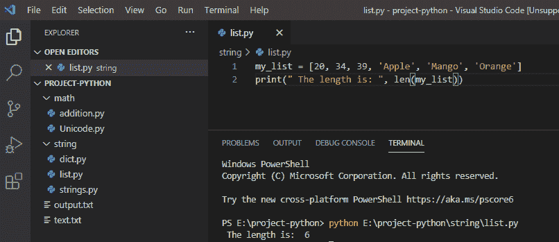

这些是各种 python 列表方法和列表方法 python 3。

您可能会喜欢以下 Python 教程:

*   [使用 Visual Studio 代码](https://pythonguides.com/python-hello-world-program/)用 python 创建一个 hello world 程序
*   [Python 字符串函数](https://pythonguides.com/string-methods-in-python/)
*   [如何在 python 中把整数转换成字符串](https://pythonguides.com/convert-an-integer-to-string-in-python/)
*   [如何在 python 中连接字符串](https://pythonguides.com/concatenate-strings-in-python/)
*   [如何在 python 中使用正则表达式拆分字符串](https://pythonguides.com/python-split-string-regex/)
*   [如何在 python 中创建一个字符串并将其赋给一个变量](https://pythonguides.com/create-a-string-in-python/)
*   [Python 命名惯例(详细指南)](https://pythonguides.com/python-naming-conventions/)

在本 python 教程中，我们学习了 Python 中的各种列表方法，例如:

*   Python 列表方法
*   Python 列表 append()方法
*   Python 列表扩展()方法
*   Python 列表 insert()方法
*   Python 列表 remove()方法
*   Python 列表计数()方法
*   Python 列表 clear()方法
*   Python 列表 copy()方法
*   Python 列表索引()方法
*   Python List reverse()方法
*   Python 列表 pop()方法
*   Python 列表排序()方法
*   Python list len()方法

[Bijay Kumar](https://pythonguides.com/author/fewlines4biju/)

Python 是美国最流行的语言之一。我从事 Python 工作已经有很长时间了，我在与 Tkinter、Pandas、NumPy、Turtle、Django、Matplotlib、Tensorflow、Scipy、Scikit-Learn 等各种库合作方面拥有专业知识。我有与美国、加拿大、英国、澳大利亚、新西兰等国家的各种客户合作的经验。查看我的个人资料。

[enjoysharepoint.com/](https://enjoysharepoint.com/)[](https://www.facebook.com/fewlines4biju "Facebook")[](https://www.linkedin.com/in/fewlines4biju/ "Linkedin")[](https://twitter.com/fewlines4biju "Twitter")