# Python 循环遍历列表

> 原文：<https://pythonguides.com/python-loop-through-a-list/>

[](https://sharepointsky.teachable.com/p/python-and-machine-learning-training-course)

在本 [Python 教程](https://pythonguides.com/learn-python/)中，我们将通过一个列表来讨论 **Python 循环。**这里我们还将涵盖下面的例子:

*   Python 遍历字符串列表
*   Python 循环遍历带索引的列表
*   Python 循环遍历字典列表
*   Python 遍历列表并写入文件
*   Python 循环遍历具有范围的列表
*   Python 遍历列表并创建字典
*   Python 向后遍历列表
*   Python 循环遍历列表列表
*   Python 循环遍历列表并移除项目
*   Python 循环遍历列表并更改值
*   Python 循环遍历列表并追加到字符串
*   Python 循环通过列表添加到字典
*   Python 遍历列表并获取索引

目录

[](#)

*   [Python 循环遍历一个列表](#Python_loop_through_a_list "Python loop through a list")
    *   [通过使用 for 循环方法](#By_using_for_loop_method "By using for loop method")
    *   [用列表理解法](#By_using_list_comprehension_method "By using list comprehension method")
    *   [通过使用枚举器方法](#By_using_enumerator_method "By using enumerator method")
*   [Python 遍历字符串列表](#Python_loop_through_a_list_of_strings "Python loop through a list of strings")
*   [Python 循环遍历索引为](#Python_loop_through_list_with_index "Python loop through list with index")的列表
*   [Python 循环遍历字典列表](#Python_loop_through_list_of_dictionaries "Python loop through list of dictionaries")
*   [Python 循环遍历范围为](#Python_loop_through_list_with_range "Python loop through list with range")的列表
*   [Python 遍历列表并创建字典](#Python_loop_through_list_and_create_dictionary "Python loop through list and create dictionary")
*   [Python 向后遍历列表](#Python_loop_through_list_backwards "Python loop through list backwards")
*   [Python 循环遍历列表列表](#Python_loop_through_list_of_lists "Python loop through list of lists")
*   [Python 循环遍历列表并移除项目](#Python_loop_through_list_and_remove_items "Python loop through list and remove items")
*   [Python 循环遍历列表并改变值](#Python_loop_through_list_and_change_values "Python loop through list and change values")
*   [Python 遍历列表并追加到字符串](#Python_loop_through_list_and_append_to_string "Python loop through list and append to string")
*   [Python 循环遍历列表添加到字典](#Python_loop_through_list_add_to_dictionary "Python loop through list add to dictionary")
*   [Python 遍历列表并获取索引](#Python_loop_through_list_and_get_index "Python loop through list and get index")

## Python 循环遍历一个列表

*   为了在 python 中遍历一个[列表，我们可以很容易地使用 **range()方法**。这个方法返回一个项目序列，它可以用来结合一个 for 循环和 `range()` 函数来遍历一个列表。](https://pythonguides.com/create-list-in-python/)
*   有各种方法来执行这个任务。
    *   通过使用 for 循环方法
    *   通过使用列表理解方法
    *   通过使用枚举方法

**语法:**

下面是 range()函数的语法

```py
range(start,stop,[step])
```

*   它由几个参数组成
    *   **Start:** 可选参数，默认为 0。
    *   `Stop` :该参数指定我们要在哪个位置停止整数值。
    *   **步骤:**该参数指定增量，默认值为 1。

**注意:**该函数创建从第一个值到最后一个值的整数序列，但结束值不包括 range()函数参数。

**源代码:**

```py
my_lis = [9, 1, 16, 86, 92]

iter_len = len(my_lis)
for e in range(iter_len):
    print("Iterate through list:",my_lis[e])
```

在上面的代码中，我们首先创建了一个链表，并给它们分配整数数字。现在我们必须通过使用 `len()` 函数找到列表的长度，它将显示长度为 5 的数字。之后，我们必须使用 for 循环和 range 函数。

下面是以下给定代码的执行过程

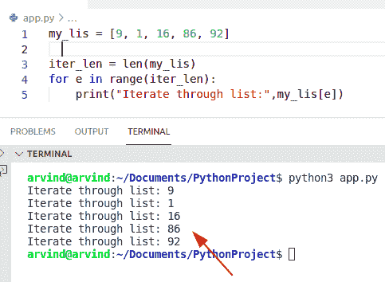

Python loop through a list

### 通过使用 for 循环方法

为了在 python 中遍历一个[列表，我们可以使用**来循环**方法。](https://pythonguides.com/python-list-methods/)

**语法:**

```py
for var_name in listname:
```

**举例:**

```py
my_lis = [16, 29, 45, 83]

for m in my_lis:
    print(m)
```

下面是以下代码的截图

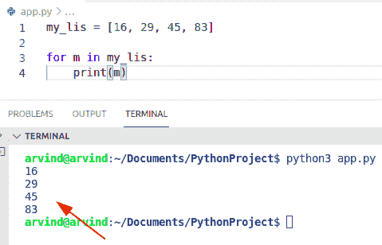

Python loop through a list using for loop method

### 用列表理解法

在 Python 中，如果我们想创建一行代码来迭代一个列表，那么我们可以使用列表理解方法。

**语法:**

```py
[statement for item in list]
```

**源代码:**

```py
num_lis = [36,84,12,45,94,51] 
[print(l) for l in num_lis] 
```

在本例中， `print(l)` 是语句，**‘l’**是变量名，表示 iterable 的值。

**输出:**

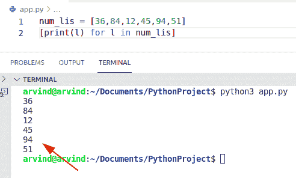

Python loop through a list by using list comprehension

阅读 [Python 数字猜谜游戏](https://pythonguides.com/python-number-guessing-game/)

### 通过使用枚举器方法

在 Python 中迭代一个列表，我们也可以使用 enumerator()方法。它是 Python 中的内置函数。此方法帮助用户将枚举器对象转换为列表和元组。

要检查循环中发生了多少次迭代，我们可以使用 Python 中的 enumerator()函数。

**语法:**

```py
enumerate
         (
          iterable,
          start
         )
```

*   它由两个参数组成
    *   **iterable:** 是一个对象。
    *   **Start:** 可选参数，默认为 0。

**源代码:**

```py
enu_lis = [17,18,19,20]

for f, nw_val in enumerate(enu_lis):
    print (f, "-",nw_val)
```

下面是以下代码的截图

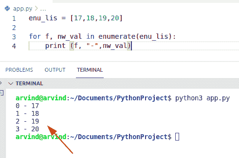

Python loop through a list by using the enumerator method

读: [For 循环 vs Python 中的 while 循环](https://pythonguides.com/for-loop-vs-while-loop-in-python/)

## Python 遍历字符串列表

*   让我们看看如何在 Python 的 for 循环中**迭代字符串列表。**
*   通过使用 zip()函数，我们将创建一个迭代器，这个方法产生一个 zip 对象，它是元组的迭代器。

**举例:**

```py
new_lis = [9,2,4,5,6] 
Country_name = ['Afghanistan','Cyprus','Cuba','Germany','Africa'] 
for (m, n) in zip(new_lis, Country_name): 
    print ("Iterate a list:",m,n) 
```

在上面的代码中，迭代器对象是 `new_lis` 和 **country_name。**现在我们可以使用 zip 函数来组合这些迭代器对象，并返回列表中的一些字符串和整数。

下面是以下给定代码的实现。

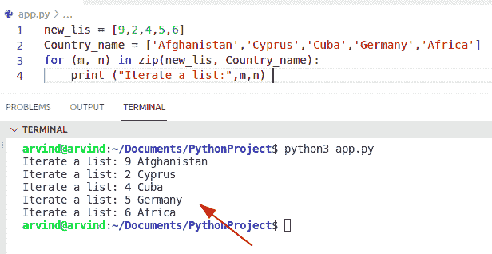

Python loop through a list of strings

阅读: [Python while 循环继续](https://pythonguides.com/python-while-loop-continue/)

## Python 循环遍历索引为的列表

*   这里我们可以看到如何在 Python 中通过循环使用索引来迭代一个列表。
*   为了执行这个任务，我们可以很容易地使用 `map()` 和 [lambda 函数](https://pythonguides.com/python-anonymous-function/)。在 python 中，要创建内联函数，我们可以应用 lambda 语句，并且在不使用 for 循环的情况下转换 iterable 中的项，我们可以使用 **map()函数**。

**举例:**

```py
new_lis =['John','Peter','Smith','Chris']

new_out = map(lambda n: (n, new_lis[n]), range(len(new_lis)))
print("Iterate list via index",list(new_out))
```

首先在上面的代码中，我们将初始化一个列表。现在创建一个 map 函数，并指定一个 lambda 语句作为参数来迭代一个带有索引的列表。

下面是以下给定代码的输出

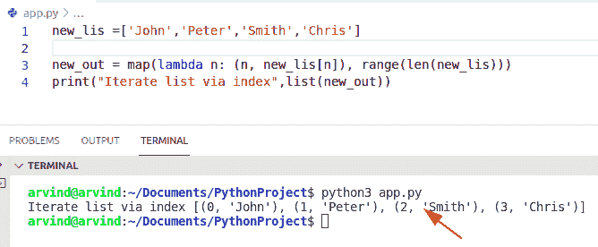

Python loop through the list with index

使用 enumerator 方法检查如何迭代带有索引的列表的替代示例。

**源代码:**

```py
nu_list = [23,28,29,40]

for z, new_values in enumerate(nu_list):
    print (z, "|",new_values)
```

**实施:**

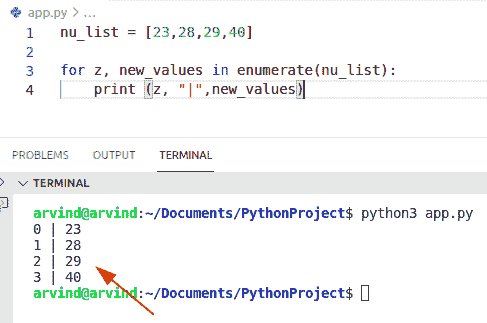

Python loop through the list with index method

阅读: [Python for 循环索引](https://pythonguides.com/python-for-loop-index/)

## Python 循环遍历字典列表

*   让我们看看如何通过 Python 中的循环来迭代一列[字典](https://pythonguides.com/python-dictionary-methods/)。
*   为了解决这个问题，我们可以应用 range()函数。这个方法返回一个项目序列，它可以用来结合一个 for 循环和 range()函数来遍历一个列表。

**语法:**

```py
range(
     start,
     stop,
     [step]
    )
```

**举例:**

让我们举一个例子，检查如何通过循环迭代字典列表。

```py
my_ne_lis = [{'o': 42}, {'z': 52}, {'y': 19}]
for new_index in range(len(my_ne_lis)):
    for new_key in my_ne_lis[new_index]:
        print(my_ne_lis[new_index][new_key])
```

下面是下面的截图

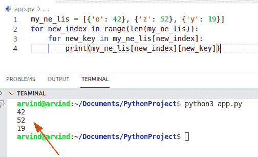

Python loop through a list of dictionaries method

阅读: [Python while 循环多个条件](https://pythonguides.com/python-while-loop-multiple-conditions/)

## Python 循环遍历范围为的列表

在 Python 中要执行这项任务，我们可以使用切片方法，首先我们在列表中创建一个范围，从第一个值到最后一个值，但最终值不包括在本例中。

**语法:**

```py
slice(start,stop,step)
```

**注意:**这个方法总是返回一个包含给定范围内元素的对象。

**源代码:**

```py
my_list = ["j","i","q","w","o"]

for m in my_list[2:4]:
    print("Iterate list with range:",m)
```

首先在这个例子中，我们将初始化一个列表并将它们分配给字符串字符。现在使用一个切片方法，并将起始值**‘2’**指定为一个参数，它将显示结果**‘q’**，同时我们必须为停止点指定一个值，即**‘4’。**

**输出:**

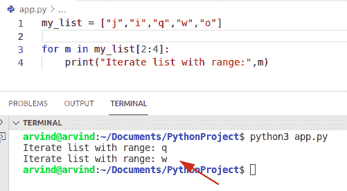

Python loop through the list with a range

阅读:[如何在 Python 中创建列表](https://pythonguides.com/create-list-in-python/)

## Python 遍历列表并创建字典

*   在 Python to [中，通过使用遍历列表的 for 循环来创建字典](https://pythonguides.com/create-a-dictionary-in-python/)。我们必须创建一个有序列表，并将列表中的值与有序数字进行比较。
*   在这个例子中，我们将列表中相应的项目作为值。现在，我们必须使用 **dictionary[count] = item** 在字典中设置一个条目，在这种情况下，count 变量是关键。

**代码:**

```py
to_lis = [82, 73, 156,234,346]
my_coun = 0
new_dictionary = {} 

for n in to_lis:
    new_dictionary[my_coun] = n
    my_coun+=1
print(new_dictionary)
```

下面是以下代码的截图

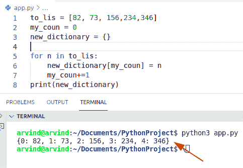

Python loop through the list and create a dictionary

阅读: [Python 字典追加](https://pythonguides.com/python-dictionary-append/)

## Python 向后遍历列表

*   在 Python 中以逆序迭代一个列表，我们可以应用 loop 和 `reversed()` 方法。该方法只接受一个 sequence 参数，并以相反的顺序返回一个 iterator 项。

**语法:**

```py
reversed(sequence)
```

让我们举一个例子，使用 for 循环以相反的顺序迭代这个列表

**源代码:**

```py
new_list = [92,46,73,28,14,13]
for n in reversed(new_list):
    print("Backward iterated list:",n)
```

下面是以下给定代码的执行过程

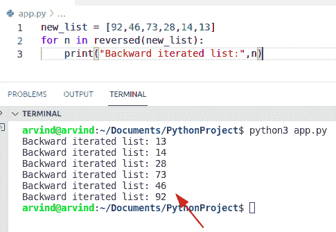

Python loop through list backward

阅读:[在 Python 中检查列表是否为空](https://pythonguides.com/check-if-a-list-is-empty-in-python/)

## Python 循环遍历列表列表

*   让我们看看如何使用 for 循环方法在 Python 中迭代嵌套列表。
*   要迭代列表中的每个元素，我们可以应用 for-loop 方法。

**举例:**

```py
new_lis = [[82,36,10], [15, 19, 32], [18, 46, 57]]
for list in new_lis:
    for new_num in list:
        print (new_num)
```

下面是以下给定代码的执行过程

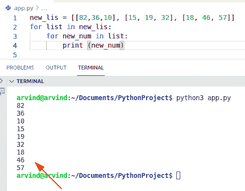

Python loop through a list of lists

阅读:[在 Python 中连接多个列表](https://pythonguides.com/concatenate-multiple-lists-in-python/)

## Python 循环遍历列表并移除项目

*   在 Python 中要从列表中删除条目，我们可以使用 for 循环方法。
*   让我们假设我们有一个数字列表，我们想从列表中删除项目。为了完成这项任务，首先我们将创建一个列表并迭代每个元素。
*   在这个例子中，如果你想从列表中删除一个条目，那么你可以使用 `remove()` 函数。

**源代码:**

```py
numbers_list = [11,17,82,34,22,76,91]

for value in list(numbers_list):
    if value == 22 or value == 34:
        numbers_list.remove(value)
print(numbers_list)
```

下面是以下代码的截图

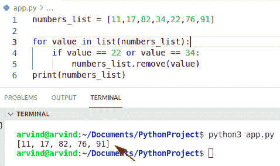

Python loop through the list and remove list

阅读:[如何使用 Turtle 在 python 中绘制形状](https://pythonguides.com/turtle-programming-in-python/)

## Python 循环遍历列表并改变值

在 python 中，我们可以通过使用 for 循环方法来更改 Python 列表中的值。要完成这项任务，我们可以使用 python range()函数。这个方法返回一个项目序列。

**举例:**

```py
new_list = [19,29,31,42,51,48]
for m in range(len(new_list)):
    new_list[m] = new_list[m] * 3
print(new_list)
```

在上面的代码中，我们必须更改列表中所有可用的值。为了检查它是如何工作的，我们必须将所有的整数乘以 3。

下面是以下给定代码的输出

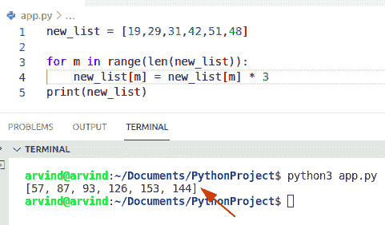

Python loop through list and change values

阅读: [Python 列表方法](https://pythonguides.com/python-list-methods/)

## Python 遍历列表并追加到字符串

*   让我们看看如何使用 `item()` 方法在 for 循环中向字符串追加内容。
*   在这个例子中，我们必须初始化一个列表，并将元素放入列表中。现在使用 for 循环方法，通过使用 `+= item` 操作符连接所有字符串字符。这个方法是 Python 中的内置函数。

**源代码:**

```py
new_lis = ['Adam', 'Gilchrist', 'Hayden']
d = ""
for item in new_lis:
   d += item
print("append strings:",d)
```

下面是以下给定代码的执行过程

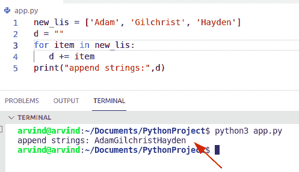

Python loop through the list and append to a string

阅读: [Python 字典方法](https://pythonguides.com/python-dictionary-methods/)

## Python 循环遍历列表添加到字典

*   这里我们可以看到如何迭代一个列表并将其添加到字典中。
*   为了执行这个特定的任务，我们可以应用 `splitlines()` 方法。这是 Python 中的一个内置函数，用于根据行来断开字符串。

**举例:**

让我们举一个例子，看看如何在 python 中迭代一个列表并将其添加到字典中。

```py
final_result = '''Name
 George
age
 40'''

new_lis = final_result.splitlines()
my_dict = {}
new_dicti_key=''
for n in new_lis:
    if not n[0]==(" "):
        new_dicti_key=n
        my_dict[n] = []
    else:
        my_dict[new_dicti_key].append(n)

print(my_dict)
```

下面是以下代码的截图

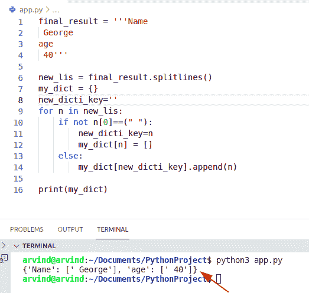

Python loop through list add to dictionary

阅读 [Python 数字猜谜游戏](https://pythonguides.com/python-number-guessing-game/)

## Python 遍历列表并获取索引

*   让我们看看**如何在 Python** 中迭代一个列表并获取索引值。
*   为了完成这个任务，我们可以使用 `enumerator()` 方法。这个方法接受一个 iterable 项作为参数，比如 list，并以 enumerator 对象的形式返回。

**源代码:**

```py
list_numbers = ['Lebanon','Mauritius','Mexico','Newzealand']

for n, new_values in enumerate(list_numbers):
    print (n, "|",new_values)
```

下面是以下给定代码的执行过程

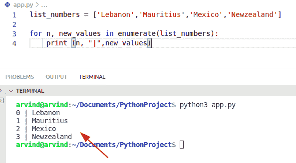

Python loop through the list and get index

您可能会喜欢以下 Python 教程:

*   [Python 要求用户输入](https://pythonguides.com/python-ask-for-user-input/)
*   [如何将 Python 字符串转换成字节数组并举例](https://pythonguides.com/python-string-to-byte-array/)
*   [Python 通过引用或值传递示例](https://pythonguides.com/python-pass-by-reference-or-value/)
*   [Python 从列表中选择](https://pythonguides.com/python-select-from-a-list/)
*   [检查一个列表是否存在于另一个列表中 Python](https://pythonguides.com/check-if-a-list-exists-in-another-list-python/)

在本 Python 教程中，我们将通过一个列表来讨论 **Python 循环。**在这里，我们还将介绍以下示例:

*   Python 遍历字符串列表
*   Python 循环遍历带索引的列表
*   Python 循环遍历字典列表
*   Python 遍历列表并写入文件
*   Python 循环遍历具有范围的列表
*   Python 遍历列表并创建字典
*   Python 向后遍历列表
*   Python 循环遍历列表列表
*   Python 循环遍历列表并移除项目
*   Python 循环遍历列表并更改值
*   Python 循环遍历列表并追加到字符串
*   Python 循环通过列表添加到字典
*   Python 遍历列表并获取索引

[Bijay Kumar](https://pythonguides.com/author/fewlines4biju/)

Python 是美国最流行的语言之一。我从事 Python 工作已经有很长时间了，我在与 Tkinter、Pandas、NumPy、Turtle、Django、Matplotlib、Tensorflow、Scipy、Scikit-Learn 等各种库合作方面拥有专业知识。我有与美国、加拿大、英国、澳大利亚、新西兰等国家的各种客户合作的经验。查看我的个人资料。

[enjoysharepoint.com/](https://enjoysharepoint.com/)[](https://www.facebook.com/fewlines4biju "Facebook")[](https://www.linkedin.com/in/fewlines4biju/ "Linkedin")[](https://twitter.com/fewlines4biju "Twitter")