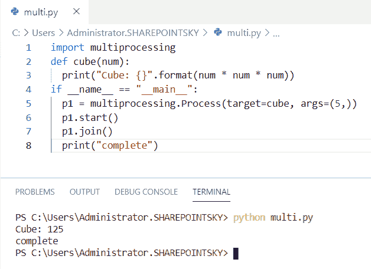
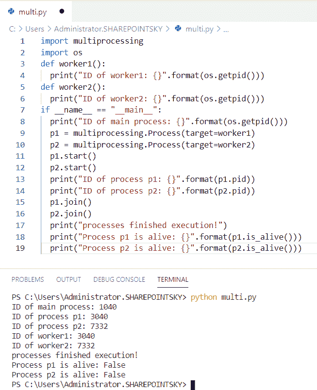
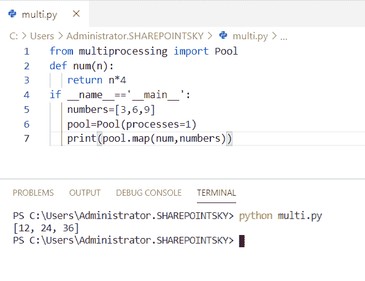
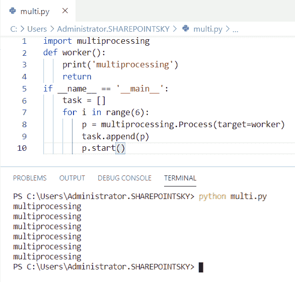
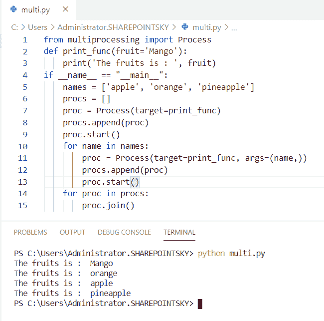
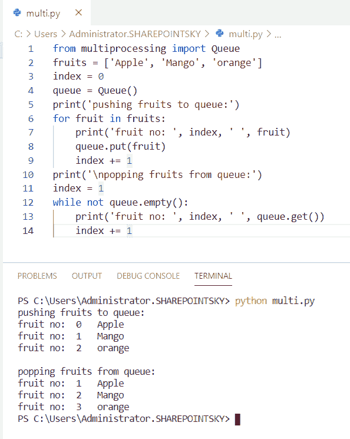
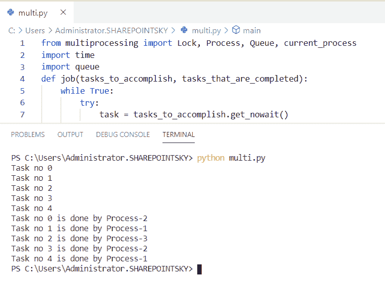
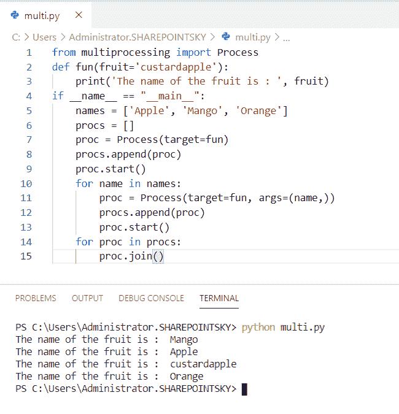

# Python 多重处理

> 原文：<https://pythonguides.com/python-multiprocessing/>

[](https://sharepointsky.teachable.com/p/python-and-machine-learning-training-course)

在这个 [python 教程中，](https://pythonguides.com/python-hello-world-program/)你将了解到 **Python 多处理**，我们也将检查 **:**

*   什么是多重处理？
*   Python 中的多重处理示例
*   运行同一 python 脚本的不同流程
*   Python 多处理池类
*   使用多重处理的示例
*   Python 多重处理队列
*   Python 多重处理锁类
*   Python 多重处理过程类

目录

[](#)

*   什么是多重处理？
*   [多重处理示例](#Multiprocessing_example "Multiprocessing example")
*   [同一个 python 脚本的不同进程运行](#The_different_process_running_of_the_same_python_script "The different process running of the same python script")
*   [Python 多处理池类](#Python_Multiprocessing_Pool_Class "Python Multiprocessing Pool Class")
*   [使用多重处理的示例](#Example_using_multiprocessing "Example using multiprocessing")
*   [Python 多重处理队列](#Python_multiprocessing_queue "Python multiprocessing queue")
*   [Python 多重处理队列类](#Python_multiprocessing_Queue_class "Python multiprocessing Queue class")
*   [Python 多重处理锁类](#Python_multiprocessing_Lock_Class "Python multiprocessing Lock Class")
*   [Python 多处理进程类](#Python_multiprocessing_process_class "Python multiprocessing process class")

## 什么是多重处理？

多重处理是计算机中的两个或多个处理器同时处理同一程序的两个或多个不同部分的过程。

## 多重处理示例

在这里，我们可以看到**一个使用 python 中的多重处理**来寻找一个数的立方的例子

*   在这个例子中，我导入了一个名为**多重处理的模块。**
*   模块多重处理是一个使用 API 支持交换过程的包。
*   该函数被定义为一个 **def 立方体(num)** 。
*   `(num * num * num)` 用于求该数的立方。
*   `if __name__ == "__main__"` 用于不导入文件时直接运行代码。
*   `p1.start()` 函数用于启动进程，调用 `p1.join` 将终止进程。

示例:

```py
import multiprocessing 
def cube(num): 
	print("Cube: {}".format(num * num * num)) 
if __name__ == "__main__":  
	p1 = multiprocessing.Process(target=cube, args=(5,)) 
	p1.start() 
	p1.join() 
	print("complete") 
```

我们可以看到 5 的立方是 125 作为输出。您可以参考下面的输出截图。



Multiprocessing example

还看，[如何打印 Python 斐波那契数列](https://pythonguides.com/python-fibonacci-series/)。

## 同一个 python 脚本的不同进程运行

现在，我们可以看到**在 python 中运行相同的 python 脚本**的不同进程

*   在这个例子中，我导入了一个名为**多重处理**和**操作系统**的模块。
*   一个函数被定义为 `def worker1()` ，为了获得当前的进程 ID，我使用了 **os.getpid()。**两种功能都有。
*   `if __name__ == "__main__"` 用于不导入文件时直接运行代码。
*   `p1.start()` ， `p2.start()` 函数用于启动进程，调用 `p1.join()` 和 `p2.join()` 将终止进程。
*   `p1.pid` 用于获取当前进程 id。
*   一旦执行完毕。**。is_alive** 用于检查进程是否存在。

示例:

```py
import multiprocessing 
import os 
def worker1(): 
	print("ID of worker1: {}".format(os.getpid())) 
def worker2(): 
	print("ID of worker2: {}".format(os.getpid())) 
if __name__ == "__main__": 
	print("ID of main process: {}".format(os.getpid())) 
	p1 = multiprocessing.Process(target=worker1) 
	p2 = multiprocessing.Process(target=worker2) 
	p1.start() 
	p2.start() 
	print("ID of process p1: {}".format(p1.pid)) 
	print("ID of process p2: {}".format(p2.pid))  
	p1.join() 
	p2.join() 
	print("processes finished execution!") 
	print("Process p1 is alive: {}".format(p1.is_alive())) 
	print("Process p2 is alive: {}".format(p2.is_alive())) 
```

当执行完成时，我们可以看到该进程没有活动，因此输出返回 false。您可以参考下面的输出截图。



The different process running of the same python script

## Python 多处理池类

现在，我们可以看到 python 中多处理池类的一个例子

*   在这个例子中，我从多处理中导入了一个名为 `pool` 的模块。
*   池模块用于跨多个输入值并行执行函数。
*   函数被定义为 `def num(n)` 然后函数被返回为 `n*4` 。
*   `if __name__ == "__main__"` 用于不导入文件时直接运行代码。
*   与函数相乘的数字在列表中指定为**numbers =【3，6，9】**。
*   这里，我们使用池来提高程序执行的性能。
*   `pool.map()` 将我们想要并行化的函数和一个 iterable 作为参数

示例:

```py
from multiprocessing import Pool
def num(n):
   return n*4
if __name__=='__main__':
   numbers=[3,6,9]
   pool=Pool(processes=1)
   print(pool.map(num,numbers))
```

我们可以看到数字与函数相乘作为输出。您可以参考下面的输出截图。



Python Multiprocessing Pool Class

## 使用多重处理的示例

现在，我们可以看到 python 中多处理的一个**例子**

*   在这个例子中，我导入了一个名为**多重处理**的模块。
*   函数定义为 `def worker()` 然后函数返回。
*   **if__name__=='__main__'** 用于不导入文件时直接执行。
*   范围 6 用于打印报表 6 次。
*   声明一个空队列，然后使用 for 循环进行迭代，迭代后，使用 `task.append()` 将语句追加到队列中。
*   目标用于传递参数。 `p.start` 用于启动过程。

示例:

```py
import multiprocessing
def worker():
    print('multiprocessing')
    return
if __name__ == '__main__':
    task = []
    for i in range(6):
        p = multiprocessing.Process(target=worker)
        task.append(p)
        p.start()
```

多重处理语句作为输出被打印 6 次。您可以参考下面的输出截图。



Example

## Python 多重处理队列

现在，我们可以在 python 中看到**多重处理队列**

*   在这个例子中，我从**多重处理中导入了一个名为**进程**的模块。**
*   我定义了一个名为 `print_func` 的函数，一个参数作为 **(fruit='Mango')** 传递。
*   `if __name__ == "__main__"` 用于不导入文件时直接运行代码。
*   列表中的条目被创建为 **names = ['apple '，' orange '，'菠萝']** 。
*   创建一个队列，并将列表中的项目追加到队列中。
*   使用 target 和**传递函数中的参数。start ()** 函数用于启动进程。
*   **。join** 用于完成流程。

示例:

```py
from multiprocessing import Process
def print_func(fruit='Mango'):
    print('The fruits is : ', fruit)
if __name__ == "__main__":  
    names = ['apple', 'orange', 'pineapple']
    procs = []
    proc = Process(target=print_func)
    procs.append(proc)
    proc.start()
    for name in names:
        proc = Process(target=print_func, args=(name,))
        procs.append(proc)
        proc.start()
    for proc in procs:
        proc.join()
```

列表中的项目作为输出被附加到队列中。您可以参考下面的输出截图。



Python multiprocessing queue

## Python 多重处理队列类

在这里，我们可以看到 python 中的**多重处理队列类**。

*   在这个例子中，我从**多处理**中导入了一个名为**队列**的模块。
*   列表已定义，其中包含项目。为了给队列中的条目分配索引，我使用了 `index = 0` 。
*   队列是一个**数据结构**,用于存储列表中的项目。
*   for 循环用于**的迭代，put()** 用于在队列的最大容量填满时进行阻塞。
*   该项目的索引号被指定为 `index += 1` 。
*   队列中的项目被弹出。执行 while 条件，并通过使用来自**索引值+=1** 的 `queue.get()` 再次推送项目。

示例:

```py
from multiprocessing import Queue
fruits = ['Apple', 'Mango', 'orange']
index = 0
queue = Queue()
print('pushing fruits to queue:')
for fruit in fruits:
    print('fruit no: ', index, ' ', fruit)
    queue.put(fruit)
    index += 1
print('\npopping fruits from queue:')
index = 1
while not queue.empty():
    print('fruit no: ', index, ' ', queue.get())
    index += 1
```

我们可以看到将一个项目推入队列并弹出作为输出。您可以参考下面的输出屏幕截图。



Python multiprocessing Queue class

## Python 多重处理锁类

现在，我们可以在 python 中看到**多重处理锁类**

*   在这个例子中，我从多重处理中导入了一个名为 **Lock，Process，Queue，current_process** 的模块。
*   定义函数 job 并传递参数**(tasks _ to _ complete，tasks_that_are_completed)** 。
*   while 条件用于 try 块用于异常。
*   **。get_nowait()** 返回一个项目，如果一个项目立即可用，异常**队列。空**用于程序的进一步执行。
*   否则。将一个项目放入队列。如果队列已满，请等到有空闲位置时再添加项目。
*   `time.sleep` 用于增加程序执行的延迟。
*   该函数定义为 `def main()` 。
*   任务数和进程数被分配为 `5` 和 `3` 。
*   如果队列为空， `Queue()` 返回 true，如果队列不为空，则返回 false。
*   for 循环用于迭代。
*   **p = Process(target=job，args =(tasks _ to _ complete，tasks_that_are_completed))** 用于创建流程。
*   `p.join` 用于完成流程。
*   为了得到输出，使用了**(而不是 tasks _ that _ are _ completed . empty())**。
*   `print(tasks _ that _ are _ completed . get())`用于获取输出。
*   **。如果队列为空，则 empty()** 返回 true。
*   **。get()** 用于从队列中移除和返回元素。

示例:

```py
from multiprocessing import Lock, Process, Queue, current_process
import time
import queue
def job(tasks_to_accomplish, tasks_that_are_completed):
    while True:
        try:
            task = tasks_to_accomplish.get_nowait()
        except queue.Empty:
            break
        else:
            print(task)
            tasks_that_are_completed.put(task + ' is done by ' + current_process().name)
            time.sleep(.5)
    return True
def main():
    number_of_task = 5
    number_of_processes = 3
    tasks_to_accomplish = Queue()
    tasks_that_are_completed = Queue()
    processes = []
    for i in range(number_of_task):
        tasks_to_accomplish.put("Task no " + str(i))
    for w in range(number_of_processes):
        p = Process(target=job, args=(tasks_to_accomplish, tasks_that_are_completed))
        processes.append(p)
        p.start()
    for p in processes:
        p.join()
    while not tasks_that_are_completed.empty():
        print(tasks_that_are_completed.get())
    return True
if __name__ == '__main__':
    main() 
```

我们可以看到哪个处理器完成的任务数量作为输出。您可以参考下面的输出截图。



Python multiprocessing Lock Class

## Python 多处理进程类

在这里，我们可以看到 python 中的**多重处理进程类**

*   在这个例子中，我从**多处理**中导入了一个名为**进程**的模块。
*   我定义了一个名为 `fun` 的函数，并传递了一个参数作为 **fruit='custarsapple'** 。
*   `if __name__ == "__main__"` 用于不导入文件时直接执行。
*   为了填充队列，使用了**过程追加**。
*   `start()` 函数用于开始处理，然后流程将运行并返回结果。
*   `args` 是用于在流程中传递参数的关键字。
*   使用 `p.join()` 来完成这个过程。

示例:

```py
from multiprocessing import Process
def fun(fruit='custardapple'):
    print('The name of the fruit is : ', fruit)
if __name__ == "__main__":  
    names = ['Apple', 'Mango', 'Orange']
    procs = []
    proc = Process(target=fun)
    procs.append(proc)
    proc.start()
    for name in names:
        proc = Process(target=fun, args=(name,))
        procs.append(proc)
        proc.start()
    for proc in procs:
        proc.join()
```

下面的截图显示了输出。



Python multiprocessing process class

您可能会喜欢以下 Python 教程:

*   [Os 改变目录 Python](https://pythonguides.com/os-change-directory-python/)
*   [Python 程序反转字符串的例子](https://pythonguides.com/python-program-to-reverse-a-string/)
*   [Python 中熊猫缺失数据](https://pythonguides.com/missing-data-in-pandas/)
*   [如何在 python 中连接字符串](https://pythonguides.com/concatenate-strings-in-python/)
*   [Python 串联字典+例子](https://pythonguides.com/python-concatenate-dictionary/)
*   [Python Tkinter 在文本框中显示数据](https://pythonguides.com/python-tkinter-to-display-data-in-textboxes/)

在这个 Python 教程中，我们学习了 **Python 多处理**。此外，我们还讨论了以下主题:

*   什么是多重处理？
*   多重处理示例
*   运行同一 python 脚本的不同流程
*   Python 多处理池类
*   使用多重处理的示例
*   Python 多重处理队列
*   Python 多重处理锁类
*   Python 多重处理过程类

[Bijay Kumar](https://pythonguides.com/author/fewlines4biju/)

Python 是美国最流行的语言之一。我从事 Python 工作已经有很长时间了，我在与 Tkinter、Pandas、NumPy、Turtle、Django、Matplotlib、Tensorflow、Scipy、Scikit-Learn 等各种库合作方面拥有专业知识。我有与美国、加拿大、英国、澳大利亚、新西兰等国家的各种客户合作的经验。查看我的个人资料。

[enjoysharepoint.com/](https://enjoysharepoint.com/)[](https://www.facebook.com/fewlines4biju "Facebook")[](https://www.linkedin.com/in/fewlines4biju/ "Linkedin")[](https://twitter.com/fewlines4biju "Twitter")